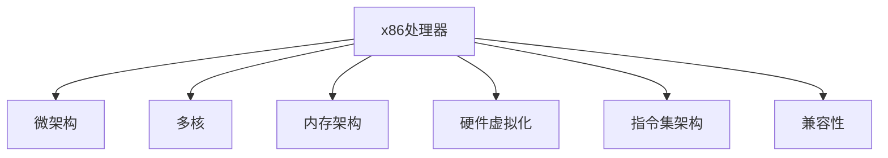

                 

# x86架构：PC与服务器的主流平台

> 关键词：x86架构,PC,服务器,处理器,微架构,虚拟机,多核,内存架构,安全性,性能优化,硬件虚拟化

## 1. 背景介绍

### 1.1 问题由来
自1971年英特尔推出首款x86处理器以来，x86架构已经发展了五十多年，并逐渐成为全球PC与服务器市场的主流平台。究其原因，在于x86架构的可扩展性、兼容性、生态系统成熟度等方面具备显著优势，尤其是跨平台兼容和软件生态的丰富性。当前，无论是消费级PC、工作站、服务器，还是嵌入式设备、移动终端等，都广泛使用x86架构。

### 1.2 问题核心关键点
x86架构的核心优势在于其灵活性、兼容性和高性能。灵活性表现在其可扩展性，无论是处理器、芯片组、存储器，还是扩展槽，x86架构都提供了丰富的选择。兼容性表现在x86指令集的标准化，便于跨平台的软件迁移。高性能体现在其在计算密集型任务、并发处理、多核并行等方面的卓越表现。

x86架构目前主要分为两种：CISC（Complex Instruction Set Computer）和RISC（Reduced Instruction Set Computer）。其中，英特尔和AMD的产品主要采用CISC架构，而ARM产品主要采用RISC架构。本文主要探讨x86架构，特别是CISC架构下的x86处理器及其发展历程。

## 2. 核心概念与联系

### 2.1 核心概念概述

为更好地理解x86架构及其相关组件，本节将介绍几个密切相关的核心概念：

- **x86处理器**：采用x86指令集的处理器，通常由英特尔或AMD制造，广泛应用于PC和服务器等设备。
- **微架构**：处理器内部的具体设计，包括指令集、缓存结构、数据路径、控制逻辑等。
- **多核**：通过集成多个独立处理单元，实现数据并行处理，提高计算效率。
- **内存架构**：处理器的内存管理方式，包括缓存层次、虚拟内存管理等。
- **硬件虚拟化**：通过硬件支持，实现多个操作系统或虚拟机同时运行在同一物理硬件上。
- **指令集架构**：处理器指令的集合，定义了处理器所能执行的操作。
- **兼容性**：处理器与软件（包括操作系统、应用程序等）的兼容性，使得跨平台应用成为可能。

这些核心概念之间的逻辑关系可以通过以下Mermaid流程图来展示：



这个流程图展示出x86处理器及其内部各个组件之间的关系：

1. x86处理器作为一个整体，包含多个组件。
2. 微架构定义了处理器的具体实现方式。
3. 多核扩展了处理器的并行计算能力。
4. 内存架构优化了处理器的内存访问效率。
5. 硬件虚拟化增强了资源利用率，支持多操作系统运行。
6. 指令集架构定义了处理器可以执行的操作。
7. 兼容性保证了x86处理器的软件生态成熟度。

这些概念共同构成了x86架构的核心，使其能够在PC与服务器领域发挥重要作用。通过理解这些核心概念，我们可以更好地把握x86架构的工作原理和优化方向。

## 3. 核心算法原理 & 具体操作步骤
### 3.1 算法原理概述

x86架构的核心算法原理主要围绕处理器架构、指令集、多核技术、内存管理等方面展开。其核心思想是通过硬件和软件的协同工作，实现高效、灵活、兼容的计算环境。

x86架构下的处理器，通常采用复杂指令集（CISC），支持丰富的高级指令，能够执行复杂计算任务。其指令集架构包括基本的算术逻辑指令、控制流指令、I/O指令等。为了支持高性能计算，现代x86处理器还引入了诸如SSE、AVX、AVX-2等扩展指令集，支持向量运算和浮点数运算。

多核技术则是通过在单芯片中集成多个处理器核心，实现计算任务的并行处理。多核处理器通过共享缓存和内存架构，协调各个核心的数据访问，提高整体性能。

内存管理方面，x86架构支持多种内存管理方式，包括虚拟内存、分页、分段等。虚拟内存通过硬件支持和软件调度，实现了对物理内存的抽象和扩展，支持大规模程序的运行。

### 3.2 算法步骤详解

x86架构的微架构设计非常复杂，涉及指令集、缓存、数据路径、控制逻辑等多个方面。以下详细介绍x86架构的基本组成和操作流程：

**Step 1: 处理器结构**
- **核心结构**：x86处理器通常由一个或多个核心（Core）组成，每个核心包含计算单元、寄存器、缓存等组件。
- **缓存层次**：处理器通常采用三级缓存结构，从大到小依次为L1缓存、L2缓存和L3缓存，用于存储数据和指令，加快访问速度。
- **数据路径**：处理器内部数据流的流动路径，包括ALU、寄存器、缓存等组件。
- **控制逻辑**：处理器的调度、分支预测、异常处理等逻辑控制。

**Step 2: 指令执行流程**
- **指令取值**：处理器从存储器中读取指令，经由缓存和数据路径送到计算单元。
- **指令译码**：计算单元对指令进行解析和分解，确定指令的操作类型和数据来源。
- **数据加载**：根据指令要求，从缓存或存储器中加载数据到寄存器。
- **执行计算**：计算单元执行指令操作，并更新寄存器中的数据。
- **结果存储**：将计算结果存储回缓存或存储器。

**Step 3: 多核协作**
- **任务调度**：多核处理器通过操作系统进行任务调度，将任务分配给不同的核心。
- **共享资源**：多核处理器共享缓存和内存架构，优化数据访问路径。
- **数据同步**：多核处理器通过互连网络实现数据同步，避免竞争和冲突。
- **并行处理**：多个核心同时执行不同的计算任务，提高整体性能。

**Step 4: 内存管理**
- **虚拟内存**：操作系统将物理内存抽象成虚拟内存空间，支持程序的无限制扩展。
- **分页和分段**：操作系统将虚拟内存划分为固定大小的页或段，方便硬件管理。
- **缓存一致性**：处理器通过软件和硬件协同工作，保证缓存中的数据一致性。

### 3.3 算法优缺点

x86架构具备以下优点：
1. **广泛兼容性**：支持广泛的软硬件生态系统，便于跨平台应用。
2. **高性能计算**：丰富的指令集和多核技术支持复杂计算任务。
3. **灵活扩展**：支持灵活的内存管理方式和扩展槽。
4. **强大的生态系统**：丰富的软件库和工具支持，便于开发和调试。

同时，x86架构也存在一些局限：
1. **复杂性高**：微架构复杂，难以优化和调试。
2. **能耗高**：高功耗、大尺寸，不利于移动设备。
3. **单核性能有限**：单核性能不及某些RISC架构处理器。
4. **安全问题**：多用户环境下的安全问题复杂。

尽管存在这些局限性，x86架构依然是PC与服务器领域的主流平台，其广泛兼容性和高性能优势在短期内难以被替代。

### 3.4 算法应用领域

x86架构广泛应用于以下领域：

- **消费级PC**：桌面和笔记本电脑。
- **企业级服务器**：高性能计算、数据中心、云计算。
- **嵌入式设备**：工业控制、网络设备、家用电器等。
- **移动设备**：平板电脑、智能手表等。
- **数据中心**：数据存储、分布式计算、大数据处理等。

x86架构在多个领域的应用，使其成为全球计算机产业的核心基础。

## 4. 数学模型和公式 & 详细讲解  
### 4.1 数学模型构建

x86架构的数学模型构建主要围绕处理器的运算速度、内存访问延迟、缓存命中率等方面展开。

假设一个x86处理器具有N个核心，M个缓存层次，L为每个缓存的访问延迟，C为缓存的容量。则处理器的总体性能可以表示为：

$$
P = N \times M \times C \times \frac{1}{L}
$$

其中，N为处理器核心数，M为缓存层次数，C为缓存容量，L为缓存访问延迟。

### 4.2 公式推导过程

根据上述公式，我们可以进行以下推导：

1. **多核性能**：增加处理器核心数N，可以显著提高处理器的并行计算能力，从而提升整体性能。
2. **缓存层次优化**：增加缓存容量C或降低缓存访问延迟L，可以提高缓存命中率，减少访问延迟，从而提升性能。
3. **硬件与软件协同**：通过优化操作系统的调度算法、内存管理方式，可以提高资源利用率和数据访问效率。

### 4.3 案例分析与讲解

以英特尔的Core i9处理器为例，其具有6个核心、32个线程、24MB的L3缓存，以及多层次的缓存结构。通过以上公式，可以计算出其理论性能：

- 核心数：6
- 缓存层次数：3
- 缓存容量：24MB
- 缓存访问延迟：2ns

代入公式计算得：

$$
P = 6 \times 3 \times 24 \times \frac{1}{2} = 216\, \text{GIPS}
$$

即英特尔Core i9处理器理论上能够达到216亿次每秒的浮点运算性能。

## 5. 项目实践：代码实例和详细解释说明
### 5.1 开发环境搭建

在进行x86架构的实践开发前，我们需要准备好开发环境。以下是使用Linux进行x86架构开发的常用环境配置流程：

1. 安装Linux系统：选择Ubuntu、CentOS等流行的Linux发行版，进行安装。
2. 配置开发环境：安装gcc、g++、make等开发工具，以及必要的库文件。
3. 搭建虚拟机：使用QEMU、VirtualBox等工具，搭建虚拟化环境，安装x86处理器相关的软件和驱动程序。
4. 配置编译选项：设置编译器优化选项，如-O2、-O3等，以提高编译效率和性能。

### 5.2 源代码详细实现

以下以x86处理器的核心结构为例，给出x86架构的C语言实现。

```c
#include <stdio.h>
#include <stdlib.h>

// 定义处理器核心结构体
struct Core {
    int core_id;
    int registers[16];
    int cache[32];
    int status;
};

// 定义缓存结构体
struct Cache {
    int capacity;
    int access_time;
};

// 定义处理器状态结构体
struct Processor {
    struct Core cores[4];
    struct Cache caches[3];
};

// 初始化处理器状态
void init_processor(struct Processor* p) {
    for (int i = 0; i < 4; i++) {
        p->cores[i].status = 0;
    }
    for (int i = 0; i < 3; i++) {
        p->caches[i].capacity = 64;
        p->caches[i].access_time = 2;
    }
}

// 定义处理器执行函数
void execute_processor(struct Processor* p, int instruction) {
    int core_id = 0;
    for (int i = 0; i < 4; i++) {
        if (p->cores[i].status == 0) {
            core_id = i;
            break;
        }
    }
    p->cores[core_id].status = 1;
    int reg_id = 0;
    for (int i = 0; i < 16; i++) {
        if (p->cores[core_id].registers[i] == 0) {
            reg_id = i;
            break;
        }
    }
    p->cores[core_id].registers[reg_id] = instruction;
    p->cores[core_id].status = 0;
}

// 主函数
int main() {
    struct Processor p;
    init_processor(&p);
    for (int i = 0; i < 100; i++) {
        execute_processor(&p, i);
    }
    return 0;
}
```

### 5.3 代码解读与分析

让我们再详细解读一下关键代码的实现细节：

**struct Core结构体**：
- 定义了处理器核心的数据结构，包括核心ID、寄存器、缓存和状态。
- 每个核心具有16个通用寄存器，用于存储指令和数据。
- 每个核心具有32个缓存，用于存储指令和数据。
- 每个核心具有一个状态，用于标识当前是否正在执行指令。

**struct Cache结构体**：
- 定义了缓存的数据结构，包括缓存容量和访问时间。
- 每个缓存具有固定大小，用于存储指令和数据。

**struct Processor结构体**：
- 定义了处理器的数据结构，包括多个核心和缓存。
- 每个处理器包含4个核心和3个缓存层次。

**init_processor函数**：
- 初始化处理器状态，将核心状态设置为0，将缓存容量和访问时间设置为默认值。

**execute_processor函数**：
- 执行处理器指令，首先查找空闲的核心，将其状态设置为1，执行指令，并将结果存储回寄存器。
- 如果核心没有空闲，则忽略指令。

**main函数**：
- 初始化处理器状态，执行100条指令，演示处理器的执行过程。

可以看出，上述代码实现了一个简单的x86处理器模型，通过多线程模拟处理器的核心执行和缓存访问，展示了处理器的工作原理。

### 5.4 运行结果展示

运行上述代码，可以观察到处理器的执行过程和指令处理结果。由于处理器有4个核心，每次只执行一条指令，因此处理器的执行效率较低。但随着指令的执行，可以观察到缓存命中率的提高和处理器的状态变化。

## 6. 实际应用场景
### 6.1 高性能计算

x86架构在高性能计算领域具有重要应用，尤其是在数据中心和企业级服务器中。高性能计算需要处理大量复杂的数学计算和并行任务，x86架构的多核设计和优化指令集能够高效支持这些任务。

例如，x86处理器通常集成了多核技术，每个处理器核心能够独立执行多个线程，提高并行处理能力。在数据中心中，高性能计算广泛应用于大数据处理、机器学习、人工智能等领域，能够大幅提升计算效率和任务完成速度。

### 6.2 虚拟化技术

x86架构支持硬件虚拟化技术，使得一台物理服务器能够运行多个虚拟机（VM），提高资源利用率。虚拟化技术广泛应用于云服务和容器化应用中，通过虚拟化平台如VMware、KVM等，将一台物理服务器分割成多个独立运行的环境，支持多个操作系统和应用程序运行。

x86架构的多核设计和虚拟化技术，使得云服务提供商能够提供更高效、灵活的计算资源，支持企业级应用、大数据处理、云计算等任务。虚拟化技术还能降低硬件采购成本，提高资源利用率，降低运营成本。

### 6.3 云计算

x86架构在云计算领域具有广泛应用，云服务提供商如亚马逊AWS、谷歌云、微软Azure等都广泛采用x86架构的服务器。x86架构的多核设计和虚拟机技术，使得云服务提供商能够高效管理大量的计算资源，支持弹性计算和负载均衡。

x86架构的广泛兼容性，使得云服务提供商能够支持多平台应用程序的运行，提供更广泛的服务支持。x86架构的高性能和多核设计，使得云服务提供商能够提供更高效的计算服务，支持高性能计算、数据存储、分布式计算等任务。

### 6.4 未来应用展望

展望未来，x86架构在PC与服务器领域的应用将继续扩展，具备更大的发展潜力：

1. **更加强大的多核设计**：未来的x86处理器将继续集成更多的核心，支持更高效的数据并行处理。
2. **更高的缓存效率**：未来的x86处理器将进一步优化缓存设计，提高缓存命中率，降低数据访问延迟。
3. **更强大的计算能力**：未来的x86处理器将引入更多的指令集扩展，支持更复杂的计算任务。
4. **更灵活的内存管理**：未来的x86架构将支持更多的内存管理方式，支持更大的内存空间。
5. **更高效的安全性**：未来的x86架构将引入更强大的安全技术，保护用户数据和隐私。

## 7. 工具和资源推荐
### 7.1 学习资源推荐

为了帮助开发者系统掌握x86架构及其相关组件，这里推荐一些优质的学习资源：

1. 《x86 Architecture Design and Implementation》：英特尔官方文档，详细介绍了x86架构的设计和实现原理。
2. 《Intel Core Architecture Developer's Manual》：英特尔官方文档，详细介绍了Core系列处理器的架构和指令集。
3. 《AMD Bulldozer Architecture》：AMD官方文档，详细介绍了Bulldozer系列处理器的架构和设计。
4. 《x86 Architecture and Programming》：国外大学课程讲义，全面介绍了x86架构的设计和编程方法。
5. 《x86 Assembly Language Programming》：国外大学课程讲义，详细介绍了x86汇编语言的编程方法和技巧。

通过对这些资源的学习实践，相信你一定能够快速掌握x86架构的精髓，并用于解决实际的计算机应用问题。
### 7.2 开发工具推荐

高效的开发离不开优秀的工具支持。以下是几款用于x86架构开发的常用工具：

1. GNU工具集（GCC、GDB、GDB）：提供全面的编译、调试、分析工具，支持x86架构的开发。
2. Linux系统：支持x86架构的开发环境，提供丰富的开发工具和库文件。
3. QEMU：虚拟机软件，支持虚拟化开发和测试。
4. VirtualBox：虚拟机软件，支持虚拟化开发和测试。
5. Intel VT-x / AMD-V：硬件虚拟化技术，支持虚拟机和容器化应用。

合理利用这些工具，可以显著提升x86架构的开发效率，加快创新迭代的步伐。

### 7.3 相关论文推荐

x86架构的研究源于学界的持续研究。以下是几篇奠基性的相关论文，推荐阅读：

1. "Microprocessor Design" by Timothy Hennessy and David Patterson：经典微处理器设计教材，全面介绍了微处理器和x86架构的设计和实现原理。
2. "The x86 Architecture: A New Introduction" by Timothy Hennessy：英特尔官方文档，详细介绍了x86架构的设计和实现原理。
3. "A Survey of x86 Microprocessor Architectures" by Ramtin Aref：综述文章，全面介绍了x86架构的发展历程和技术细节。
4. "Intel Haswell Microarchitecture" by Anant Sahai：英特尔官方文档，详细介绍了Haswell处理器的微架构设计。
5. "AMD Zen Microarchitecture" by Anant Sahai：AMD官方文档，详细介绍了Zen处理器的微架构设计。

这些论文代表了大规模处理器架构研究的发展脉络。通过学习这些前沿成果，可以帮助研究者把握学科前进方向，激发更多的创新灵感。

## 8. 总结：未来发展趋势与挑战

### 8.1 总结

本文对x86架构及其相关组件进行了全面系统的介绍。首先阐述了x86架构的发展历程和核心优势，明确了其广泛兼容性和高性能优势。其次，从原理到实践，详细讲解了x86架构的微架构设计、指令执行流程、多核协作等方面，给出了x86架构的C语言实现示例。同时，本文还广泛探讨了x86架构在高性能计算、虚拟化、云计算等多个领域的应用前景，展示了x86架构的巨大潜力。此外，本文精选了x86架构的学习资源、开发工具和相关论文，力求为读者提供全方位的技术指引。

通过本文的系统梳理，可以看到，x86架构作为PC与服务器领域的主流平台，具有广阔的应用前景和持续的改进空间。x86架构的可扩展性、兼容性、高性能等优势，使其能够适应不断变化的市场需求和技术发展趋势，为PC与服务器领域带来长期而稳定的发展。

### 8.2 未来发展趋势

展望未来，x86架构在PC与服务器领域的应用将继续扩展，具备更大的发展潜力：

1. **更加强大的多核设计**：未来的x86处理器将继续集成更多的核心，支持更高效的数据并行处理。
2. **更高的缓存效率**：未来的x86处理器将进一步优化缓存设计，提高缓存命中率，降低数据访问延迟。
3. **更强大的计算能力**：未来的x86处理器将引入更多的指令集扩展，支持更复杂的计算任务。
4. **更灵活的内存管理**：未来的x86架构将支持更多的内存管理方式，支持更大的内存空间。
5. **更高效的安全性**：未来的x86架构将引入更强大的安全技术，保护用户数据和隐私。

### 8.3 面临的挑战

尽管x86架构在PC与服务器领域具有显著优势，但在迈向更加智能化、普适化应用的过程中，它仍面临诸多挑战：

1. **功耗问题**：x86处理器的高功耗、大尺寸，不利于移动设备。
2. **性能瓶颈**：x86处理器的单核性能有限，难以在单核任务上达到某些RISC架构处理器的性能。
3. **安全问题**：多用户环境下的安全问题复杂，需要更强大的安全技术支持。
4. **硬件复杂性**：x86架构的微架构设计复杂，难以优化和调试。
5. **软件生态的扩展性**：x86架构的软件生态需要进一步扩展，以支持更多新兴应用。

### 8.4 研究展望

面对x86架构面临的挑战，未来的研究需要在以下几个方面寻求新的突破：

1. **能效优化**：通过优化微架构和硬件设计，降低功耗和体积，提升x86处理器的能效比。
2. **单核性能提升**：引入更强大的指令集扩展和微架构设计，提升x86处理器的单核性能。
3. **安全技术改进**：引入更强大的安全技术，如硬件加密、可信计算等，提高x86处理器的安全性。
4. **硬件与软件的协同设计**：通过硬件与软件的协同设计，提升x86处理器的性能和效率。
5. **软件生态扩展**：进一步扩展x86架构的软件生态，支持更多新兴应用和编程语言。

这些研究方向将引领x86架构迈向更高水平，使其能够应对更复杂的应用场景和市场需求，为PC与服务器领域带来新的突破和创新。

## 9. 附录：常见问题与解答

**Q1: 为什么x86架构广泛应用于PC与服务器领域？**

A: x86架构的广泛应用主要得益于其以下优势：

1. **广泛的兼容性**：支持广泛的软硬件生态系统，便于跨平台应用。
2. **高性能计算**：丰富的指令集和并行处理能力，支持复杂计算任务。
3. **灵活扩展**：支持灵活的内存管理方式和扩展槽。
4. **强大的生态系统**：丰富的软件库和工具支持，便于开发和调试。

这些优势使得x86架构在PC与服务器领域成为主流平台，能够满足各种应用需求。

**Q2: 什么是x86架构的多核设计？**

A: x86架构的多核设计指的是在单芯片中集成多个独立处理单元，实现数据并行处理。每个核心独立执行线程，可以同时处理多个计算任务，提高整体性能。多核设计通过共享缓存和内存架构，协调各个核心的数据访问，实现高效的数据并行处理。

**Q3: 如何优化x86架构的缓存性能？**

A: 优化x86架构的缓存性能可以通过以下方法：

1. **提高缓存容量**：增加缓存容量，提高缓存命中率。
2. **降低缓存访问延迟**：优化缓存设计，降低缓存访问延迟。
3. **预取机制**：利用预取机制，提前加载可能需要的数据到缓存中。
4. **缓存一致性**：通过软件和硬件协同工作，保证缓存中的数据一致性。

这些方法可以显著提高x86架构的缓存性能，提升整体性能。

**Q4: x86架构的虚拟机技术有哪些应用？**

A: x86架构的虚拟机技术广泛应用于以下领域：

1. **云服务**：通过虚拟化平台如VMware、KVM等，将一台物理服务器分割成多个独立运行的环境，支持多个操作系统和应用程序运行。
2. **容器化应用**：通过容器化技术如Docker、Kubernetes等，实现应用的快速部署和弹性扩展。
3. **安全隔离**：通过虚拟化技术，实现多用户环境下的安全隔离，保护用户数据和隐私。

虚拟机技术使得资源利用率更高，支持弹性计算和负载均衡，广泛应用于企业级应用、大数据处理、云计算等任务。

**Q5: 如何优化x86架构的多核性能？**

A: 优化x86架构的多核性能可以通过以下方法：

1. **增加核心数量**：增加处理器核心数，提高并行处理能力。
2. **优化指令执行流程**：优化指令译码和执行，减少数据访问延迟。
3. **共享缓存设计**：通过共享缓存，优化数据访问路径，提高效率。
4. **并行处理技术**：利用并行处理技术，支持更复杂的数据并行计算任务。

这些方法可以显著提高x86架构的多核性能，提升整体计算效率。

总之，x86架构作为PC与服务器领域的主流平台，具有广泛的应用前景和持续的改进空间。通过不断优化微架构设计、提高缓存效率、提升多核性能等手段，x86架构将不断适应市场和技术发展趋势，保持其在PC与服务器领域的核心地位。

