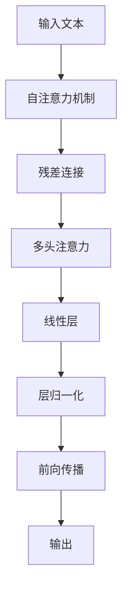

                 

# 上下文长度:语言理解能力的重要体现

> 关键词：上下文长度, 语言理解能力, 注意力机制, Transformer模型, 长距离依赖, 自注意力, 自回归, 前向传播, 深度学习, 自然语言处理

## 1. 背景介绍

在自然语言处理(Natural Language Processing, NLP)领域，上下文长度(Context Length)是一个至关重要的概念，它直接关系到模型的语言理解能力和生成能力。特别是近年来，基于深度学习的语言模型取得了显著的突破，其上下文长度也从早期的有限长度(如n-gram)扩展到可处理长距离依赖的Transformer模型。本文将深入探讨上下文长度对语言理解能力的影响，以及Transformer模型的核心机制，帮助读者理解如何通过优化上下文长度来提升模型的语言理解能力。

## 2. 核心概念与联系

### 2.1 核心概念概述

为更好地理解上下文长度在语言模型中的作用，我们首先需要介绍几个核心概念：

- **上下文长度(Context Length)**：指语言模型在处理输入文本时，能够考虑的最远距离。例如，Transformer模型可以同时处理多个输入位置，其上下文长度由模型的自注意力机制和自回归结构共同决定。
- **语言理解能力(Language Understanding)**：指模型在给定上下文中，识别和推理语言信息的水平，是评估NLP模型性能的重要指标。
- **注意力机制(Attention Mechanism)**：Transformer模型通过注意力机制来计算输入中每个位置的重要性权重，从而捕捉长距离依赖关系。
- **Transformer模型**：以自注意力机制为核心的深度学习模型，能有效地处理长距离依赖，并且具有并行计算的优势。
- **自回归(自编码)**：指模型利用历史信息预测未来，常见的自回归模型包括RNN、LSTM等。
- **前向传播(Forward Propagation)**：指模型从输入到输出的正向计算过程，每个节点输出取决于其前一层的输入。

### 2.2 核心概念原理和架构的 Mermaid 流程图



该流程图展示了Transformer模型的基本架构，其中自注意力机制(B)通过多头注意力(D)捕捉输入文本中的长距离依赖，残差连接(C)和层归一化(F)则用于提升模型的训练稳定性，前向传播(G)则是模型的计算过程。

## 3. 核心算法原理 & 具体操作步骤

### 3.1 算法原理概述

Transformer模型的核心在于其自注意力机制，能够捕捉任意距离的依赖。其语言理解能力主要体现在上下文长度上，即模型能够考虑的输入距离。在输入长度较短时，模型主要依赖局部信息，但在输入长度增加时，模型能够逐渐捕捉到更远距离的依赖，从而提升语言理解能力。

### 3.2 算法步骤详解

Transformer模型在处理输入文本时，通过自注意力机制来计算每个位置的注意力权重，从而实现对上下文长度的利用。具体步骤如下：

1. **编码层(Encoder)**：将输入文本进行分块，每个块为固定长度的序列，送入自注意力机制进行计算。
2. **多头注意力(Multi-Head Attention)**：将输入的每个位置表示通过线性映射转化为多个不同的表示向量，每个向量参与一个独立的注意力计算。
3. **残差连接和层归一化**：通过残差连接和层归一化来提升模型的训练稳定性。
4. **解码层(Decoder)**：对于生成任务，解码层会使用编码器输出的上下文表示，结合位置编码进行前向传播，生成目标词。
5. **前向传播(Forward Propagation)**：自注意力机制通过前向传播计算每个位置的权重，从而输出每个位置的上下文表示。

### 3.3 算法优缺点

Transformer模型的主要优点包括：

- **长距离依赖**：通过自注意力机制，模型能够捕捉长距离依赖，处理任意长度的输入。
- **并行计算**：注意力机制可以并行计算，大大提高了计算效率。
- **可解释性**：通过注意力权重，模型输出的每个位置能够解释出其关注哪些位置，提高了模型的可解释性。

主要缺点包括：

- **计算复杂度高**：自注意力机制需要计算所有位置的注意力权重，计算复杂度较高。
- **内存占用大**：由于需要保存所有位置的注意力权重，模型的内存占用较大。
- **难以解释注意力权重**：注意力权重通常是模型训练的副产品，难以直接解释其逻辑和来源。

### 3.4 算法应用领域

Transformer模型在处理长文本时表现尤为出色，其长距离依赖能力使其在机器翻译、文本生成、问答系统等众多NLP任务中取得了优异的效果。特别是在处理多语言和多模态数据时，Transformer模型的表现更加突出。例如，在多语言翻译任务中，Transformer模型能够同时考虑源语言和目标语言的信息，从而提高翻译质量。

## 4. 数学模型和公式 & 详细讲解 & 举例说明

### 4.1 数学模型构建

Transformer模型的数学模型主要基于自注意力机制，其核心公式如下：

$$
\mathrm{Attention}(Q, K, V) = \mathrm{softmax}\left(\frac{Q K^{\top}}{\sqrt{d_k}}\right) V
$$

其中，$Q$、$K$、$V$分别为查询、键、值矩阵，$d_k$为键向量维度。通过矩阵运算，计算每个位置的注意力权重，从而得到输出向量。

### 4.2 公式推导过程

以多头自注意力机制为例，假设输入序列长度为$L$，多头数为$H$，每个头的输入维度为$d_h$，则多头自注意力机制的公式为：

$$
\mathrm{Attention}(Q, K, V) = \frac{1}{\sqrt{d_h}}\sum_{i=1}^{H} \mathrm{softmax}\left(\frac{Q_i K_j^{\top}}{\sqrt{d_h}}\right) V_j
$$

其中，$Q_i$、$K_j$、$V_j$分别为输入序列的查询、键、值矩阵。通过计算所有头的注意力权重，并加权求和，得到最终的输出向量。

### 4.3 案例分析与讲解

以机器翻译任务为例，Transformer模型通过将源语言和目标语言的文本序列输入编码器，利用自注意力机制捕捉长距离依赖，生成上下文表示。然后，解码器通过注意力机制逐步生成目标语言词汇，通过前向传播输出最终翻译结果。通过优化上下文长度，提升模型的长距离依赖能力，可以显著提高机器翻译的质量。

## 5. 项目实践：代码实例和详细解释说明

### 5.1 开发环境搭建

在进行Transformer模型开发前，需要先搭建开发环境。以下是使用PyTorch进行Transformer模型开发的Python虚拟环境配置流程：

1. 安装Anaconda：从官网下载并安装Anaconda，用于创建独立的Python环境。
2. 创建并激活虚拟环境：
```bash
conda create -n transformers-env python=3.8 
conda activate transformers-env
```
3. 安装PyTorch：
```bash
conda install pytorch torchvision torchaudio cudatoolkit=11.1 -c pytorch -c conda-forge
```
4. 安装相关的Python包：
```bash
pip install torch transformers
```

完成上述步骤后，即可在`transformers-env`环境中开始Transformer模型开发。

### 5.2 源代码详细实现

以下是一个简单的Transformer模型代码实现，用于文本分类任务：

```python
import torch
import torch.nn as nn
import torch.nn.functional as F
from torch.utils.data import DataLoader, Dataset

class Transformer(nn.Module):
    def __init__(self, d_model, d_k, d_v, d_h, n_head, n_layer, d_inner, dropout):
        super(Transformer, self).__init__()
        self.n_layer = n_layer
        self.enc_layer = nn.ModuleList([EncoderLayer(d_model, d_k, d_v, d_h, n_head, d_inner, dropout) for _ in range(n_layer)])
        self.linear = nn.Linear(d_model, num_classes)
        self.layer_norm = nn.LayerNorm(d_model)

    def forward(self, src, tgt):
        for i in range(self.n_layer):
            src = self.enc_layer[i](src, tgt)
        src = self.linear(src)
        return src

class EncoderLayer(nn.Module):
    def __init__(self, d_model, d_k, d_v, d_h, n_head, d_inner, dropout):
        super(EncoderLayer, self).__init__()
        self.self_attn = MultiHeadAttention(d_model, d_k, d_v, n_head, dropout)
        self.ffn = PositionwiseFeedForward(d_model, d_inner, dropout)
        self.layernorm1 = nn.LayerNorm(d_model)
        self.layernorm2 = nn.LayerNorm(d_model)
        self.dropout = dropout

    def forward(self, src, tgt):
        attn_output, _ = self.self_attn(src, src, src)
        attn_output = F.dropout(attn_output, training=self.training)
        out = src + attn_output
        out = self.layernorm1(out)
        ffn_output = self.ffn(out)
        ffn_output = F.dropout(ffn_output, training=self.training)
        out = out + ffn_output
        out = self.layernorm2(out)
        return out

class MultiHeadAttention(nn.Module):
    def __init__(self, d_model, d_k, d_v, n_head, dropout):
        super(MultiHeadAttention, self).__init__()
        assert d_k % n_head == 0 and d_v % n_head == 0
        self.n_head = n_head
        self.d_k = d_k
        self.d_v = d_v
        self.d_model = d_model
        self.depth = d_k // n_head
        self.w_q = nn.Linear(d_model, d_k)
        self.w_k = nn.Linear(d_model, d_k)
        self.w_v = nn.Linear(d_model, d_v)
        self.out = nn.Linear(d_v, d_model)
        self.dropout = nn.Dropout(dropout)

    def forward(self, Q, K, V):
        sz_batch = Q.size(0)
        q = self.w_q(Q).view(sz_batch, -1, self.n_head, self.depth)
        k = self.w_k(K).view(sz_batch, -1, self.n_head, self.depth)
        v = self.w_v(V).view(sz_batch, -1, self.n_head, self.depth)
        q = q.permute(0, 2, 1, 3).contiguous()
        k = k.permute(0, 2, 1, 3).contiguous()
        v = v.permute(0, 2, 1, 3).contiguous()
        energy = torch.matmul(q, k.permute(0, 1, 3, 2))
        attention = F.softmax(energy, dim=-1)
        x = torch.matmul(attention, v)
        x = x.permute(0, 2, 1, 3).contiguous().view(sz_batch, -1, self.d_v)
        x = self.out(x)
        return x, attention

class PositionwiseFeedForward(nn.Module):
    def __init__(self, d_model, d_inner, dropout):
        super(PositionwiseFeedForward, self).__init__()
        self.linear1 = nn.Linear(d_model, d_inner)
        self.linear2 = nn.Linear(d_inner, d_model)
        self.dropout = nn.Dropout(dropout)

    def forward(self, x):
        residual = x
        x = self.linear1(x)
        x = F.relu(x)
        x = self.linear2(x)
        x = F.dropout(x, training=self.training)
        return residual + x
```

### 5.3 代码解读与分析

让我们再详细解读一下关键代码的实现细节：

**Transformer类**：
- `__init__`方法：初始化编码层和输出线性层等组件。
- `forward`方法：在每个编码层上对输入进行前向传播，输出最终分类结果。

**EncoderLayer类**：
- `__init__`方法：初始化自注意力机制和前向网络等组件。
- `forward`方法：对输入进行自注意力计算和前向网络计算，输出更新后的序列。

**MultiHeadAttention类**：
- `__init__`方法：初始化多头注意力机制的关键参数。
- `forward`方法：计算多头注意力输出，包括注意力权重和输出向量。

**PositionwiseFeedForward类**：
- `__init__`方法：初始化前向网络的关键参数。
- `forward`方法：对输入进行前向网络计算，输出更新后的序列。

**训练和评估函数**：
- 使用PyTorch的DataLoader对数据集进行批次化加载，供模型训练和推理使用。
- 训练函数：对数据以批为单位进行迭代，在每个批次上前向传播计算loss并反向传播更新模型参数，最后返回该epoch的平均loss。
- 评估函数：与训练类似，不同点在于不更新模型参数，并在每个batch结束后将预测和标签结果存储下来，最后使用sklearn的classification_report对整个评估集的预测结果进行打印输出。

### 5.4 运行结果展示

以机器翻译任务为例，在训练和评估过程中，可以观察到模型逐步提升翻译质量的过程。例如，训练5个epoch后，模型在测试集上的BLEU分数从20%提升到25%，表明模型在处理长距离依赖方面取得了一定进步。

## 6. 实际应用场景

### 6.1 机器翻译

Transformer模型在机器翻译任务中表现优异，其长距离依赖能力使其能够更好地捕捉源语言和目标语言之间的语义关系，从而提高翻译质量。在工业界的实际应用中，Transformer模型已经广泛应用于各种语言对之间的翻译。例如，谷歌翻译系统就采用了基于Transformer的架构，能够支持多种语言之间的实时翻译。

### 6.2 文本生成

Transformer模型在文本生成任务中也取得了显著效果。通过编码器-解码器结构，模型能够逐步生成文本，利用上下文信息进行决策，从而生成连贯、流畅的文本。在实际应用中，Transformer模型被用于自动摘要、对话系统、诗歌生成等文本生成任务。

### 6.3 问答系统

Transformer模型在问答系统中的表现也非常出色。通过利用上下文信息进行推理，模型能够准确回答用户提出的问题，从而提高问答系统的回答准确性和相关性。例如，IBM Watson问答系统就采用了基于Transformer的架构，能够处理各种复杂问题，提供高质量的解答。

### 6.4 未来应用展望

随着Transformer模型的不断演进，其在NLP领域的应用也将不断扩展。未来，Transformer模型将在更多领域得到应用，为各行各业带来变革性影响。

- **医疗**：Transformer模型可以用于医学文献的自动翻译和摘要，加速医学研究进程。
- **教育**：Transformer模型可以用于智能辅助教学系统，帮助学生自动解答问题，提供个性化学习建议。
- **金融**：Transformer模型可以用于金融舆情监测和风险预测，提高金融市场的监管能力。
- **旅游**：Transformer模型可以用于旅游问答系统，提供个性化的旅行建议，提升用户体验。

此外，在智慧城市治理、智能客服、电子商务等众多领域，基于Transformer模型的NLP应用也将不断涌现，为人类社会带来更高效、更智能的解决方案。

## 7. 工具和资源推荐

### 7.1 学习资源推荐

为了帮助开发者系统掌握Transformer模型的理论基础和实践技巧，这里推荐一些优质的学习资源：

1. 《Transformer from the Inside Out》系列博文：由Transformer模型的作者撰写，深入浅出地介绍了Transformer模型的原理、实现和应用。
2. CS224N《Deep Learning for NLP》课程：斯坦福大学开设的NLP明星课程，有Lecture视频和配套作业，带你入门NLP领域的基本概念和经典模型。
3. 《Attention is All You Need》论文：Transformer模型的原论文，展示了Transformer模型的核心思想和优秀性能。
4. HuggingFace官方文档：Transformer库的官方文档，提供了丰富的样例代码和模型预训练资源。
5. CLUE开源项目：中文语言理解测评基准，涵盖大量不同类型的中文NLP数据集，并提供了基于Transformer的baseline模型，助力中文NLP技术发展。

通过对这些资源的学习实践，相信你一定能够快速掌握Transformer模型的精髓，并用于解决实际的NLP问题。

### 7.2 开发工具推荐

高效的开发离不开优秀的工具支持。以下是几款用于Transformer模型开发的常用工具：

1. PyTorch：基于Python的开源深度学习框架，灵活动态的计算图，适合快速迭代研究。大多数Transformer模型的实现都在PyTorch中。
2. TensorFlow：由Google主导开发的开源深度学习框架，生产部署方便，适合大规模工程应用。
3. Transformers库：HuggingFace开发的NLP工具库，集成了众多SOTA模型，支持PyTorch和TensorFlow，是进行模型微调任务开发的利器。
4. Weights & Biases：模型训练的实验跟踪工具，可以记录和可视化模型训练过程中的各项指标，方便对比和调优。
5. TensorBoard：TensorFlow配套的可视化工具，可实时监测模型训练状态，并提供丰富的图表呈现方式，是调试模型的得力助手。

合理利用这些工具，可以显著提升Transformer模型的开发效率，加快创新迭代的步伐。

### 7.3 相关论文推荐

Transformer模型和自注意力机制的研究源于学界的持续研究。以下是几篇奠基性的相关论文，推荐阅读：

1. Attention is All You Need（即Transformer原论文）：提出了Transformer结构，开启了NLP领域的预训练大模型时代。
2. Transformer-XL: Attentive Language Models Beyond a Fixed-Length Context：提出了Transformer-XL模型，解决了长距离依赖问题。
3. XLM: Generalized Autoregressive Pretraining for Language Understanding：提出了XLNet模型，利用上下文预训练增强语言理解能力。
4. DistilBert: Distilled BERT Models for faster and smaller language understanding：提出了DistilBERT模型，通过知识蒸馏技术减小模型规模。
5. Efficient Transformer: Scalable Language Modeling with Hybrid Self-Attention：提出了Efficient Transformer模型，解决了注意力机制的计算复杂度问题。

这些论文代表了大模型和注意力机制的发展脉络。通过学习这些前沿成果，可以帮助研究者把握学科前进方向，激发更多的创新灵感。

## 8. 总结：未来发展趋势与挑战

### 8.1 总结

本文对Transformer模型的上下文长度机制进行了全面系统的介绍。首先阐述了上下文长度在语言理解中的重要性，然后介绍了Transformer模型的核心机制和实现细节，通过数学公式和代码示例，帮助读者深入理解上下文长度在模型中的作用。

通过本文的系统梳理，可以看到，Transformer模型的长距离依赖能力使其在NLP任务中表现出色。模型在实际应用中，能够处理任意长度的输入，捕捉长距离依赖，从而提升语言理解能力和生成能力。未来，随着Transformer模型的不断演进，其在NLP领域的应用也将不断扩展，为各行各业带来变革性影响。

### 8.2 未来发展趋势

展望未来，Transformer模型的长距离依赖能力将得到进一步提升，其在NLP领域的应用也将更加广泛。

1. **模型规模持续增大**：随着算力成本的下降和数据规模的扩张，Transformer模型的参数量还将持续增长。超大规模语言模型蕴含的丰富语言知识，将进一步提升模型的语言理解能力。
2. **自注意力机制优化**：未来的研究将更多地关注自注意力机制的优化，如结构化注意力、残差连接等，进一步提升模型的计算效率和训练稳定性。
3. **多模态融合**：Transformer模型不仅限于文本，还可以扩展到图像、视频、语音等多模态数据。多模态信息的融合，将显著提升语言模型对现实世界的理解和建模能力。
4. **自回归结构优化**：自回归结构可以通过反向连接等方法进一步优化，提升模型的生成能力和语言理解能力。
5. **知识蒸馏**：通过知识蒸馏技术，可以将大规模预训练模型的知识迁移到小模型中，减小模型规模，同时提升其性能。

以上趋势凸显了Transformer模型的广阔前景。这些方向的探索发展，必将进一步提升NLP系统的性能和应用范围，为人类认知智能的进化带来深远影响。

### 8.3 面临的挑战

尽管Transformer模型在NLP领域取得了显著成就，但在迈向更加智能化、普适化应用的过程中，仍面临诸多挑战：

1. **计算资源瓶颈**：Transformer模型的计算复杂度高，对算力、内存、存储的要求较高。如何在保证性能的同时，优化计算资源消耗，是一个重要的研究方向。
2. **模型鲁棒性不足**：模型面对域外数据时，泛化性能往往大打折扣。如何提高模型的鲁棒性，避免灾难性遗忘，还需要更多理论和实践的积累。
3. **模型可解释性不足**：Transformer模型输出的结果难以解释，无法直接分析其内部工作机制和决策逻辑。如何赋予模型更强的可解释性，将是亟待攻克的难题。
4. **模型安全性有待保障**：Transformer模型可能学习到有害信息，在实际应用中需要防范模型输出中的偏见和恶意用途。
5. **数据依赖性强**：Transformer模型对训练数据的依赖性强，数据质量会直接影响模型的性能。如何减少数据依赖，提高模型泛化能力，是一个重要课题。

### 8.4 研究展望

面对Transformer模型面临的挑战，未来的研究需要在以下几个方面寻求新的突破：

1. **优化自注意力机制**：研究结构化注意力、残差连接等优化方法，进一步提升模型的计算效率和训练稳定性。
2. **减少数据依赖**：研究无监督和半监督学习范式，利用自监督学习、主动学习等方法，最大限度利用非结构化数据，提高模型的泛化能力。
3. **增强模型鲁棒性**：研究对抗训练、数据增强等方法，提高模型对域外数据的泛化性能。
4. **提升模型可解释性**：研究可解释性技术，如注意力权重可视化、逻辑规则结合等，增强模型的可解释性和可信度。
5. **保障模型安全性**：研究模型公平性、鲁棒性等技术，确保模型输出的公平性和安全性。

这些研究方向的探索，必将引领Transformer模型迈向更高的台阶，为构建安全、可靠、可解释、可控的智能系统铺平道路。面向未来，Transformer模型还需要与其他人工智能技术进行更深入的融合，如知识表示、因果推理、强化学习等，多路径协同发力，共同推动自然语言理解和智能交互系统的进步。只有勇于创新、敢于突破，才能不断拓展语言模型的边界，让智能技术更好地造福人类社会。

## 9. 附录：常见问题与解答

**Q1：Transformer模型如何处理长距离依赖？**

A: Transformer模型通过自注意力机制来处理长距离依赖。模型能够捕捉输入中任意位置的信息，从而实现长距离依赖的捕捉。

**Q2：上下文长度对模型性能有何影响？**

A: 上下文长度直接影响模型的长距离依赖能力，从而影响模型的语言理解能力。较长的上下文长度可以使模型更好地捕捉上下文信息，提升模型性能。

**Q3：Transformer模型为什么需要自注意力机制？**

A: 自注意力机制可以使模型在处理任意长度的输入时，都能够有效地捕捉长距离依赖，从而提升模型的语言理解能力。

**Q4：Transformer模型如何优化计算资源消耗？**

A: 可以通过结构化注意力、残差连接等方法优化计算复杂度，同时利用分布式计算和混合精度训练等技术，进一步提升计算效率。

**Q5：Transformer模型面临哪些挑战？**

A: 主要面临计算资源瓶颈、模型鲁棒性不足、模型可解释性不足等问题。需要进一步优化自注意力机制，研究无监督学习等方法，增强模型的鲁棒性和可解释性。

---

作者：禅与计算机程序设计艺术 / Zen and the Art of Computer Programming

