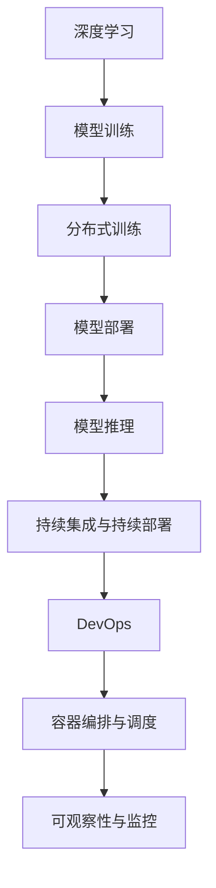

                 

# 云原生AI平台：从开发到部署的全流程

> 关键词：云原生(AI)、人工智能、深度学习、模型部署、分布式训练、持续集成、容器化、微服务、DevOps

## 1. 背景介绍

### 1.1 问题由来
在过去的几年中，人工智能(AI)和深度学习在商业和技术应用中得到了迅速发展，成为驱动新一轮技术变革和产业升级的重要力量。随着AI应用场景的不断扩展和数据量的持续增长，传统的单体应用架构已无法满足日益增长的AI计算需求。

云原生技术为AI的开发、部署和运维提供了全新的解决方案，并逐渐成为AI应用架构的主流选择。云原生技术包括容器化、微服务、持续集成/持续部署(CI/CD)等，旨在通过弹性扩展、自动弹性、持续集成和可观察性，提升AI应用的高可用性、可扩展性和持续演进能力。

### 1.2 问题核心关键点
- **云原生架构**：通过容器化、微服务等技术实现应用的高可用性和弹性扩展。
- **分布式训练**：通过多机多卡并行训练，提高AI模型的训练速度和质量。
- **持续集成与持续部署**：通过自动化测试和部署流程，保障模型上线的一致性和稳定性。
- **容器编排与调度**：通过Kubernetes等容器编排工具，实现资源的动态分配和优化。
- **可观察性与监控**：通过TensorBoard、Prometheus等工具，实时监控模型性能和应用状态。

本文将深入探讨云原生AI平台的关键概念、技术原理和实际应用，并通过详细的开发和部署流程，帮助开发者系统地掌握云原生AI的开发与部署方法。

## 2. 核心概念与联系

### 2.1 核心概念概述

为了更好地理解云原生AI平台，首先需要介绍几个核心概念及其相互关系：

- **云原生(AI)**：利用云平台提供的弹性计算、存储和网络服务，以微服务架构、容器化和自动化流程等技术，实现AI应用的快速部署、持续演进和高可用性。
- **深度学习**：一种基于神经网络的学习方式，用于从数据中提取特征，实现复杂的模式识别和预测。
- **模型部署**：将训练好的AI模型从训练环境迁移到生产环境的过程，以支持实时预测和推理。
- **分布式训练**：利用多台计算设备并行计算，提高AI模型的训练速度和计算效率。
- **持续集成与持续部署**：通过自动化测试和部署流程，保障AI模型的质量和稳定性。
- **容器化**：将应用程序及其依赖打包到可移植的容器中，以实现跨平台部署和灵活扩展。
- **微服务架构**：将大型应用程序拆分为一系列小规模的微服务，以提高系统的可扩展性和松耦合性。
- **DevOps文化**：结合开发和运维，通过自动化流程和持续反馈，提升软件交付的速度和质量。

这些核心概念通过云原生AI平台紧密相连，共同构成了一个支持AI应用全生命周期的生态系统。

### 2.2 核心概念原理和架构的 Mermaid 流程图



该图展示了深度学习模型从训练到推理的全流程，以及与云原生技术（如容器化、微服务、持续集成、持续部署等）的相互作用。

## 3. 核心算法原理 & 具体操作步骤

### 3.1 算法原理概述

云原生AI平台的核心算法原理包括深度学习模型训练、分布式训练、模型部署、持续集成与持续部署等。

- **深度学习模型训练**：通过反向传播算法和优化器（如Adam、SGD等），不断调整模型参数，使得模型在训练集上的损失函数最小化。
- **分布式训练**：将训练任务分配到多台计算设备上并行计算，以提升训练效率。
- **模型部署**：将训练好的模型封装到容器中，并在云平台或Kubernetes集群中运行。
- **持续集成与持续部署**：通过自动化流程，持续集成新的代码变更，并部署到生产环境中。

### 3.2 算法步骤详解

#### 3.2.1 模型训练

1. **数据准备**：收集和预处理训练数据，分为训练集、验证集和测试集。
2. **模型选择**：选择合适的深度学习模型，如卷积神经网络(CNN)、循环神经网络(RNN)或Transformer等。
3. **模型初始化**：随机初始化模型参数，避免初始值对模型性能的影响。
4. **训练过程**：通过反向传播算法和优化器，不断更新模型参数，使得模型在训练集上的损失函数最小化。
5. **验证集评估**：在验证集上评估模型性能，调整模型超参数。
6. **测试集验证**：在测试集上验证模型泛化能力。

#### 3.2.2 分布式训练

1. **数据分割**：将训练数据按比例分割到多个计算设备。
2. **参数同步**：通过参数服务器或AllReduce算法，同步各个设备上的模型参数。
3. **模型并行**：将模型拆分为多个子模块，分别在多个设备上计算，提高计算效率。
4. **模型聚合**：将各个子模块的计算结果聚合，更新全局模型参数。

#### 3.2.3 模型部署

1. **模型封装**：将训练好的模型封装到容器中，包括模型代码、依赖和配置文件。
2. **容器编排**：使用Kubernetes等容器编排工具，管理容器的生命周期和资源分配。
3. **服务发布**：将容器部署到云平台或私有集群，暴露为服务。
4. **负载均衡**：使用Nginx等负载均衡工具，分发请求到多个实例。

#### 3.2.4 持续集成与持续部署

1. **代码管理**：使用Git等版本控制工具，管理代码变更。
2. **自动化测试**：通过单元测试、集成测试和端到端测试，确保代码质量。
3. **自动化部署**：使用Jenkins等CI/CD工具，自动化部署到生产环境。
4. **反馈循环**：通过持续集成和持续部署，不断优化模型和应用性能。

### 3.3 算法优缺点

#### 3.3.1 优点

- **高可扩展性**：云原生架构通过容器化和微服务，支持大规模分布式训练和部署。
- **高可用性**：云平台提供的弹性计算和冗余设计，保障应用的可靠性和持续性。
- **高效率**：分布式训练和多机多卡并行计算，显著提升模型训练速度。
- **高敏捷性**：持续集成和持续部署，支持快速迭代和演进。

#### 3.3.2 缺点

- **资源消耗**：大规模分布式训练和容器化部署，对计算和存储资源要求较高。
- **复杂度**：云原生架构和微服务设计，增加了系统复杂性和维护难度。
- **成本**：云平台和容器编排工具的使用，增加了运维成本。

### 3.4 算法应用领域

云原生AI平台广泛应用于以下几个领域：

- **自动驾驶**：通过感知、决策和控制的AI模型，实现自动驾驶功能。
- **金融风控**：利用机器学习模型，进行风险评估和欺诈检测。
- **医疗诊断**：通过图像识别和自然语言处理，辅助医生诊断和治疗。
- **智能客服**：通过自然语言理解和生成，实现机器人客服和智能推荐。
- **推荐系统**：通过协同过滤和深度学习模型，实现个性化推荐。
- **视频监控**：通过图像处理和行为分析，提高安全监控的效率和准确性。

## 4. 数学模型和公式 & 详细讲解 & 举例说明

### 4.1 数学模型构建

在云原生AI平台中，常用的数学模型包括深度学习模型、分布式训练算法和模型部署的优化算法等。这里以卷积神经网络(CNN)为例，展示其数学模型构建过程。

**卷积神经网络(CNN)**：

$$
y=f(x)=\frac{1}{1+\exp(-z)}=\frac{1}{1+\exp(-W^T\cdot x+b)}
$$

其中，$z$ 为卷积核的加权和，$W$ 为卷积核权重，$b$ 为偏置项，$f$ 为激活函数。

### 4.2 公式推导过程

#### 4.2.1 反向传播算法

反向传播算法用于计算损失函数对模型参数的梯度，用于优化器调整参数。

以卷积层为例，假设输入特征图大小为 $n \times n \times c$，卷积核大小为 $m \times m \times c$，步长为 $s$，输出特征图大小为 $n' \times n' \times c'$，则卷积层输出的计算公式为：

$$
y_{i,j,k}=\sum_{c=0}^{c-1}\sum_{m=0}^{m-1}\sum_{n=0}^{n-1}x_{i',j',k}w_{c,m,n}+b
$$

其中，$i',j'$ 为卷积核位置，$k$ 为通道数。

反向传播过程中，需要计算输出 $y$ 对输入 $x$ 的偏导数 $\frac{\partial L}{\partial x}$，通过链式法则和反向传播公式，可得：

$$
\frac{\partial L}{\partial x}=\frac{\partial L}{\partial y} \cdot \frac{\partial y}{\partial x}
$$

其中，$\frac{\partial L}{\partial y}$ 为损失函数对输出 $y$ 的梯度，$\frac{\partial y}{\partial x}$ 为激活函数对输入 $x$ 的偏导数。

### 4.3 案例分析与讲解

#### 4.3.1 图像分类

假设有一组图像分类任务的数据集，包含 $m$ 个训练样本和 $n$ 个测试样本，每个样本大小为 $p \times p$，图像通道数为 $c$，模型输出大小为 $c'$。使用反向传播算法优化模型参数 $W$ 和 $b$，使得模型在测试集上达到最小分类误差。

以一个简单的CNN模型为例，其计算过程如下：

1. **数据预处理**：将图像转换为模型可接受的数据格式，如将图像转换为张量。
2. **前向传播**：通过卷积层、池化层和全连接层，计算模型输出。
3. **损失函数**：计算模型输出与真实标签的差异，使用交叉熵损失函数。
4. **反向传播**：通过反向传播算法计算损失函数对模型参数的梯度。
5. **优化器**：使用Adam、SGD等优化器更新模型参数。
6. **验证集评估**：在验证集上评估模型性能，调整模型超参数。
7. **测试集验证**：在测试集上验证模型泛化能力。

通过上述过程，不断迭代优化模型，最终在测试集上达到最小分类误差。

## 5. 项目实践：代码实例和详细解释说明

### 5.1 开发环境搭建

为了构建云原生AI平台，需要搭建一个支持分布式训练和持续集成/持续部署的环境。以下是一个典型的云原生AI平台开发环境搭建流程：

1. **安装Docker**：从官网下载并安装Docker，用于容器化应用。
2. **安装Kubernetes**：从官网下载并安装Kubernetes，用于容器编排和调度。
3. **安装Jenkins**：从官网下载并安装Jenkins，用于持续集成和持续部署。
4. **安装Git**：从官网下载并安装Git，用于代码管理和版本控制。
5. **安装TensorFlow**：从官网下载并安装TensorFlow，用于深度学习模型训练和部署。
6. **安装Kubernetes可视化工具**：如Kubeflow、Helm等，用于监控和可视化应用状态。

### 5.2 源代码详细实现

下面以TensorFlow模型部署为例，展示如何使用Docker和Kubernetes进行模型部署。

**1. 编写Dockerfile**

```Dockerfile
# 使用TensorFlow官方Docker镜像
FROM tensorflow/tensorflow:2.6.0-gpu

# 安装依赖
RUN pip install scikit-learn

# 添加代码
COPY model.py /usr/src/app/model.py
COPY requirements.txt /usr/src/app/
COPY scripts /usr/src/app/scripts/
COPY config /usr/src/app/config/

# 安装依赖
WORKDIR /usr/src/app/
RUN pip install -r requirements.txt

# 配置启动脚本
COPY scripts/run.sh /usr/src/app/scripts/
RUN chmod +x /usr/src/app/scripts/run.sh
```

**2. 编写run.sh脚本**

```bash
#!/bin/bash
python -m flask --app=model --host=0.0.0.0 --port=$PORT
```

**3. 构建Docker镜像**

```bash
docker build -t my_model .
```

**4. 发布Docker镜像到私有仓库**

```bash
docker push my_model:latest
```

**5. 编写Kubernetes配置文件**

```yaml
apiVersion: apps/v1
kind: Deployment
metadata:
  name: my_model
spec:
  replicas: 3
  selector:
    matchLabels:
      app: my_model
  template:
    metadata:
      labels:
        app: my_model
    spec:
      containers:
      - name: my_model
        image: my_model:latest
        ports:
        - containerPort: 5000
```

**6. 部署Kubernetes应用**

```bash
kubectl apply -f deployment.yaml
```

**7. 编写Jenkins Pipeline**

```yaml
pipeline {
    agent any

    stages {
        stage('Build') {
            steps {
                withDocker(
                    name: 'docker-build',
                    image: 'docker:latest'
                ) {
                    docker.build(
                        name: 'build',
                        script: '''
                            docker build -t my_model .
                            docker push my_model:latest
                        '''
                    )
                }
            }
        }

        stage('Deploy') {
            steps {
                withDocker(
                    name: 'docker-deploy',
                    image: 'docker:latest'
                ) {
                    docker.build(
                        name: 'deploy',
                        script: '''
                            kubectl apply -f deployment.yaml
                        '''
                    )
                }
            }
        }
    }
}
```

### 5.3 代码解读与分析

**Dockerfile解析**

- **FROM指令**：指定基础镜像。
- **RUN指令**：在容器中执行命令，如安装依赖。
- **COPY指令**：将本地文件复制到容器中。
- **WORKDIR指令**：设置工作目录。
- **RUN指令**：在容器中执行命令，如安装依赖。
- **COPY指令**：将本地文件复制到容器中。
- **RUN指令**：在容器中执行命令，如配置启动脚本。

**run.sh脚本解析**

- **#!指令**：指定脚本的解释器。
- **命令**：启动Flask应用。

**Kubernetes配置文件解析**

- **apiVersion**：指定Kubernetes API版本。
- **kind**：指定资源类型。
- **metadata**：指定资源元数据。
- **spec**：指定资源的规范。
- **replicas**：指定复制数量。
- **selector**：指定选择器。
- **template**：指定模板。
- **metadata**：指定模板元数据。
- **spec**：指定模板规范。
- **containers**：指定容器。
- **ports**：指定端口。

**Jenkins Pipeline解析**

- **pipeline**：定义Jenkins Pipeline。
- **agent**：指定代理。
- **stages**：定义阶段。
- **stage**：定义阶段步骤。
- **steps**：定义步骤。
- **withDocker**：指定Docker环境。
- **docker.build**：指定Docker构建命令。

### 5.4 运行结果展示

通过上述流程，可以将TensorFlow模型成功部署到云原生AI平台中，并在Kubernetes集群上运行。

在Jenkins Pipeline中，可以看到构建和部署的详细日志，如构建成功、部署成功等。

```bash
[Pipeline] docker.build
Started
5d32d7b7
[Pipeline] docker.push
Started
5d32d7b7
[Pipeline] kubectl.apply
Started
my_model deployment created
[Pipeline] END
```

## 6. 实际应用场景

### 6.1 智能客服系统

智能客服系统通过云原生AI平台，实现了自然语言理解和生成，能够自动解答客户问题，提升客户满意度。

**系统架构**

- **前端**：用户交互界面，通过API调用后端服务。
- **后端**：基于微服务架构，包括用户管理、问题处理、知识库管理等模块。
- **知识库**：包含常见问题和答案的语料库。
- **模型服务**：使用微调后的NLP模型，实现自然语言理解和生成。

**系统流程**

1. **用户提问**：用户在平台上提交问题。
2. **系统理解**：通过自然语言理解模型，将用户问题转化为结构化数据。
3. **匹配答案**：根据问题，在知识库中匹配最相关的答案。
4. **自动生成**：使用生成模型，生成更自然流畅的回复。
5. **用户反馈**：用户对回复的满意度进行评价，用于持续优化模型。

### 6.2 金融风控系统

金融风控系统通过云原生AI平台，实现了机器学习模型的部署和监控，能够实时监测风险，及时预警。

**系统架构**

- **数据层**：存储和管理原始数据。
- **计算层**：使用分布式训练，构建风险评估模型。
- **应用层**：通过API接口，将模型部署到生产环境。
- **监控层**：使用TensorBoard和Prometheus等工具，实时监控模型状态。

**系统流程**

1. **数据收集**：收集和预处理历史交易数据。
2. **模型训练**：使用分布式训练算法，训练风险评估模型。
3. **模型部署**：将模型部署到Kubernetes集群中。
4. **实时预警**：实时监测交易行为，评估风险。
5. **异常处理**：对高风险交易进行人工审核。

### 6.3 医疗诊断系统

医疗诊断系统通过云原生AI平台，实现了深度学习模型的部署和优化，能够辅助医生进行疾病诊断。

**系统架构**

- **数据层**：存储和管理医学影像和病历数据。
- **计算层**：使用分布式训练，构建疾病诊断模型。
- **应用层**：通过API接口，将模型部署到生产环境。
- **监控层**：使用TensorBoard和Prometheus等工具，实时监控模型状态。

**系统流程**

1. **数据收集**：收集和预处理医学影像和病历数据。
2. **模型训练**：使用分布式训练算法，训练疾病诊断模型。
3. **模型部署**：将模型部署到Kubernetes集群中。
4. **实时诊断**：实时分析医学影像，辅助医生诊断疾病。
5. **结果反馈**：医生对诊断结果进行反馈，用于持续优化模型。

## 7. 工具和资源推荐

### 7.1 学习资源推荐

为了帮助开发者系统掌握云原生AI平台，推荐以下学习资源：

1. **Kubernetes官方文档**：详细介绍了Kubernetes的API、架构和最佳实践。
2. **TensorFlow官方文档**：提供了深度学习模型训练和部署的详细教程和示例。
3. **TensorFlow DevOps**：介绍了如何使用TensorFlow进行持续集成和持续部署。
4. **Docker官方文档**：提供了Docker容器的使用和配置教程。
5. **Jenkins官方文档**：提供了持续集成和持续部署的详细教程和示例。
6. **微服务架构**：介绍了微服务的概念、设计原则和最佳实践。
7. **DevOps文化**：介绍了DevOps文化的核心思想和实践方法。

通过学习这些资源，可以帮助开发者掌握云原生AI平台的核心技术，提升AI应用的开发和部署能力。

### 7.2 开发工具推荐

为了加速云原生AI平台的应用开发，推荐以下开发工具：

1. **Docker**：容器化应用，支持跨平台部署。
2. **Kubernetes**：容器编排和调度，支持大规模分布式部署。
3. **Jenkins**：持续集成和持续部署，自动化测试和部署。
4. **TensorFlow**：深度学习模型训练和部署。
5. **TensorBoard**：可视化模型训练和推理过程。
6. **Prometheus**：监控系统指标和告警。
7. **Nginx**：负载均衡和反向代理。

这些工具涵盖了从应用开发到部署的各个环节，可以帮助开发者高效构建云原生AI平台。

### 7.3 相关论文推荐

为了深入理解云原生AI平台，推荐以下相关论文：

1. **《Cloud-Native Machine Learning: A survey》**：综述了云原生机器学习的研究现状和应用场景。
2. **《Kubernetes: The Cloud-Native Platform》**：介绍了Kubernetes的架构和设计理念。
3. **《TensorFlow DevOps: Best Practices for Machine Learning Model Deployment》**：介绍了TensorFlow DevOps的实践方法和最佳实践。
4. **《Docker in Production》**：介绍了Docker在生产环境中的应用和最佳实践。
5. **《Microservices: A personal story》**：介绍了微服务架构的设计原则和实践方法。
6. **《The Culture of DevOps: Breaking Down Silos to Deliver Quality at Scale》**：介绍了DevOps文化的核心思想和实践方法。

这些论文为云原生AI平台提供了丰富的理论支持，帮助开发者深入理解其技术原理和应用方法。

## 8. 总结：未来发展趋势与挑战

### 8.1 总结

本文系统介绍了云原生AI平台的核心概念、技术原理和应用场景，通过详细的开发和部署流程，帮助开发者掌握云原生AI的开发与部署方法。

通过上述介绍，可以看到云原生AI平台通过容器化、微服务、持续集成/持续部署等技术，实现了AI应用的高可扩展性、高可用性和高效率。云原生AI平台不仅适用于AI模型的训练和部署，还能够在实际应用中提供稳定、可靠的服务。

### 8.2 未来发展趋势

展望未来，云原生AI平台将呈现以下几个发展趋势：

1. **模型自动化**：自动化模型开发、训练、优化和部署，提高开发效率。
2. **边缘计算**：在边缘设备上部署AI模型，提升实时处理能力。
3. **联邦学习**：在保护隐私的前提下，通过分布式训练提升模型性能。
4. **模型解释性**：通过可解释性技术，增强模型的透明度和可信度。
5. **跨领域知识整合**：通过知识图谱、规则库等，实现多领域知识的整合和应用。
6. **自动化运维**：通过自动化工具，提升运维效率和系统稳定性。

### 8.3 面临的挑战

尽管云原生AI平台具有显著优势，但也面临着诸多挑战：

1. **资源消耗**：大规模分布式训练和容器化部署，对计算和存储资源要求较高。
2. **系统复杂性**：云原生架构和微服务设计，增加了系统复杂性和维护难度。
3. **成本问题**：云平台和容器编排工具的使用，增加了运维成本。
4. **可扩展性**：在高并发和大数据量的情况下，如何保障系统的可扩展性和稳定性。
5. **安全问题**：如何保护AI模型的安全性，防止恶意攻击和数据泄露。
6. **模型性能**：如何平衡模型的性能和资源消耗，提升模型精度和响应速度。

### 8.4 研究展望

为了应对上述挑战，未来的研究需要在以下几个方面寻求新的突破：

1. **资源优化**：通过算法优化、模型压缩等技术，减少资源消耗，提升模型训练和推理效率。
2. **系统简化**：通过模块化和组件化设计，降低系统复杂性，提升可维护性和可扩展性。
3. **成本控制**：通过开源工具和平台，降低运维成本，提升资源利用率。
4. **自动化运维**：通过自动化运维工具，提升运维效率和系统稳定性。
5. **模型解释性**：通过可解释性技术，增强模型的透明度和可信度。
6. **跨领域知识整合**：通过知识图谱、规则库等，实现多领域知识的整合和应用。

这些研究方向将引领云原生AI平台向更高的台阶发展，为AI应用的全生命周期提供更全面、高效、安全的服务。

## 9. 附录：常见问题与解答

**Q1：云原生AI平台中的“云原生”是什么意思？**

A: 云原生是指在云计算环境中设计、部署和运行应用的一种技术架构，包括容器化、微服务、持续集成/持续部署、服务网格等。云原生架构能够实现应用的弹性扩展、自动弹性和持续演进，提升应用的高可用性和可扩展性。

**Q2：云原生AI平台如何实现分布式训练？**

A: 云原生AI平台通过容器化技术，将模型拆分为多个微服务，使用Kubernetes等容器编排工具，将微服务部署到多台计算设备上进行并行计算。通过参数服务器或AllReduce算法，同步各个设备上的模型参数，实现分布式训练。

**Q3：云原生AI平台如何实现持续集成和持续部署？**

A: 云原生AI平台通过Jenkins等持续集成工具，自动化地集成新的代码变更，并在测试集上进行自动化测试。通过Jenkins Pipeline，自动化地将测试通过的代码部署到生产环境中，实现持续部署。

**Q4：云原生AI平台中的微服务架构有何优势？**

A: 微服务架构将大型应用程序拆分为多个小规模的微服务，每个微服务负责一个独立的功能模块，具有高可扩展性、高可用性和高灵活性。通过API网关和服务发现机制，可以实现微服务的快速集成和扩展。

**Q5：云原生AI平台中的容器化技术有何优势？**

A: 容器化技术将应用程序及其依赖打包到容器中，实现了应用的跨平台部署和灵活扩展。容器化技术能够实现应用的快速部署、高效管理和高可用性。通过Kubernetes等容器编排工具，可以实现容器的动态分配和优化。

综上所述，本文深入探讨了云原生AI平台的关键概念、技术原理和实际应用，通过详细的开发和部署流程，帮助开发者系统地掌握云原生AI的开发与部署方法。云原生AI平台通过容器化、微服务、持续集成/持续部署等技术，实现了AI应用的高可扩展性、高可用性和高效率，将深度学习模型广泛应用于各个领域，推动AI技术的产业化进程。展望未来，云原生AI平台将不断演进，提升模型的自动化、自动化运维和可解释性，为AI应用的全生命周期提供更全面、高效、安全的服务。

---

作者：禅与计算机程序设计艺术 / Zen and the Art of Computer Programming

