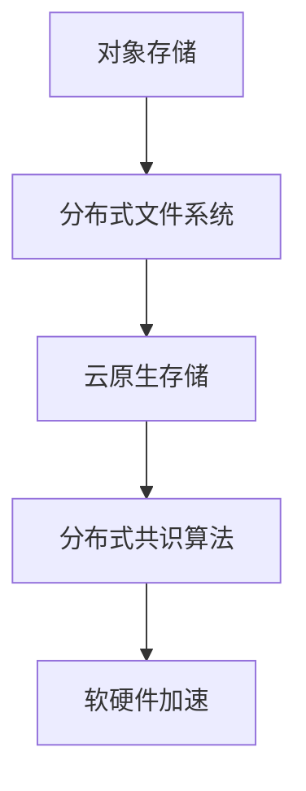

                 

# 云原生存储解决方案：从对象存储到分布式文件系统

## 1. 背景介绍

### 1.1 问题由来
随着云原生技术的发展，云计算厂商开始提供更加高效、弹性、低成本的存储解决方案，以满足现代数据密集型应用的广泛需求。但目前市场上的云存储产品多基于传统架构，存在性能瓶颈、管理复杂、扩展困难等问题。为解决这些问题，各大厂商不断探索新型云原生存储架构，从传统的对象存储向分布式文件系统演进。

近年来，分布式文件系统因其高可扩展性、高性能、低延迟等优势，成为云原生存储的重要发展方向。代表产品有AWS EFS、Azure Files、Google Cloud Filestore等，这些文件系统能够提供稳定的高性能存储服务，满足现代大规模数据处理的需要。

### 1.2 问题核心关键点
云原生存储架构的核心在于其对传统对象存储的演进，通过引入文件系统的高性能特性，提供更加细粒度的数据管理、更高的数据一致性，以及更灵活的扩展能力。具体来说：
- 数据管理：支持目录、权限、访问控制等更为细粒度的数据管理功能。
- 高性能：提供低延迟的读写操作，支持高并发场景下的读写性能。
- 扩展能力：支持弹性扩展，能够动态调整存储容量和计算资源。
- 数据一致性：保证数据在分布式环境下的强一致性。

本文聚焦于基于云原生架构的分布式文件系统技术，将系统介绍从对象存储向分布式文件系统演进的过程，并对比其在不同场景下的性能表现和应用价值。

## 2. 核心概念与联系

### 2.1 核心概念概述

为更好地理解云原生存储解决方案，本节将介绍几个关键概念：

- 对象存储(Object Storage)：基于键值对存储数据的分布式系统，如AWS S3、Azure Blob、Google Cloud Storage等。对象存储适合存储非结构化数据，具有高吞吐、高可用、高扩展性等特点。

- 分布式文件系统(Distributed File System)：分布式存储架构，支持文件目录、权限管理、权限控制等功能，提供基于文件接口的存储服务，如HDFS、Lustre、Ceph等。

- 云原生(C云原生)：指基于云平台进行构建、运行和维护的应用系统，具备自动化运维、弹性伸缩、容器化部署等特点。

- 分布式共识算法(Distributed Consensus Algorithm)：在分布式环境中保证数据一致性的重要算法，如Paxos、Raft等。

- 软硬件加速(Device Acceleration)：通过引入GPU、FPGA、ASIC等加速芯片，提升存储系统的处理能力和性能表现。

这些核心概念之间的逻辑关系可以通过以下Mermaid流程图来展示：



这个流程图展示了大数据存储演进的核心概念及其之间的关系：

1. 对象存储为分布式文件系统提供基础，具有高扩展性和高可用性。
2. 分布式文件系统支持更多数据管理功能，提升用户体验。
3. 云原生架构实现自动化运维、弹性伸缩等优化，保证系统的稳定性和性能。
4. 分布式共识算法保证数据的强一致性，支持高可靠性。
5. 软硬件加速提升系统的计算和存储能力，优化性能表现。

## 3. 核心算法原理 & 具体操作步骤
### 3.1 算法原理概述

云原生分布式文件系统构建的核心算法包括分布式文件系统的元数据管理、数据一致性维护和软硬件加速等。本节将详细阐述这些核心算法的原理和作用。

### 3.2 算法步骤详解

#### 3.2.1 分布式文件系统元数据管理
分布式文件系统需要管理大量元数据，包括目录结构、文件权限、访问控制列表(Access Control List, ACL)、用户配置等。其核心算法主要包括命名空间管理、分布式锁和目录树生成等。

**命名空间管理**：分布式文件系统采用命名空间隔离，将不同用户、组的数据隔离存储，以防止数据污染和权限泄露。具体实现可采用LNS（Layered Namespace Service），将用户空间、系统空间和文件系统空间组合，形成灵活的命名空间结构。

**分布式锁**：分布式锁机制用于保证文件系统的元数据一致性，防止多个客户端同时修改同一个文件或目录。常见的分布式锁算法包括基于心跳机制的分布式锁、基于etcd等分布式协调服务的锁机制等。

**目录树生成**：分布式文件系统需要构建高效的目录树结构，支持高效的文件定位和查找。具体算法可采用倒排索引(Inverted Index)和哈希表等数据结构，实现快速的目录查找和路径解析。

#### 3.2.2 数据一致性维护
在分布式文件系统中，数据一致性是一个核心问题。不同节点之间的数据复制和同步需要保证数据的强一致性，常见算法包括Paxos、Raft、Gossip等。

**Paxos算法**：在一致性问题中，Paxos算法被广泛应用。该算法采用两阶段提交机制，保证数据在分布式节点间同步一致。第一个阶段是提案阶段，每个节点提出自己的提案，形成提案集合；第二个阶段是承诺阶段，通过多数节点对提案的承诺，确保提案的一致性。

**Raft算法**：Raft算法是一种基于日志的结构化共识算法，保证分布式系统的高可用性和一致性。该算法通过日志复制和选举机制，确保每个节点状态一致，同时支持节点故障切换和数据恢复。

**Gossip算法**：Gossip算法是一种基于消息传播的网络协议，用于节点间的数据同步。该算法通过节点间的随机连接和数据交换，快速传播数据到所有节点，同时防止网络拥塞和消息丢失。

#### 3.2.3 软硬件加速
软硬件加速技术通过引入GPU、FPGA、ASIC等专用芯片，提升存储系统的处理能力和性能表现。具体实现方式包括：

**GPU加速**：通过引入GPU硬件，提升文件系统的读/写速率和并发性能。GPU加速通常应用于文件系统的高性能读写和数据处理任务。

**FPGA加速**：FPGA芯片提供更高的处理能力和并行性，可应用于文件系统的访问控制、数据校验和元数据管理等任务。FPGA加速能够在数据传输链路中实现高带宽、低延迟的传输。

**ASIC加速**：ASIC芯片针对特定的存储处理任务进行了深度定制，能够在高并发、低延迟场景中提供最优性能。ASIC加速适用于处理大规模并发的文件读写操作。

### 3.3 算法优缺点

#### 3.3.1 优点
云原生分布式文件系统具有以下优点：

1. 高性能：通过软硬件加速，提升存储系统的读/写速率和并发性能。
2. 高可用性：支持自动故障切换和数据复制，保证系统的可靠性。
3. 高扩展性：支持弹性扩展，能够动态调整存储容量和计算资源。
4. 高性能一致性：通过分布式共识算法，保证数据的强一致性。

#### 3.3.2 缺点
云原生分布式文件系统也存在以下缺点：

1. 复杂性高：分布式系统管理复杂，需要多节点协同工作，维护难度较大。
2. 资源消耗大：分布式文件系统需要更多的计算资源和网络带宽，可能带来额外的成本。
3. 数据一致性问题：分布式文件系统的强一致性需要更多的网络和计算资源，可能影响系统性能。
4. 数据损坏风险：分布式系统需要处理网络延迟和数据丢失，可能增加数据损坏风险。

### 3.4 算法应用领域

云原生分布式文件系统可以应用于多种场景，如大规模数据存储、数据分析、大数据处理等。其具体应用包括：

1. 数据湖建设：为大规模数据存储提供高效、低成本的解决方案，支持大数据分析和处理。
2. 企业级文件共享：提供文件共享和协作功能，支持跨团队、跨地域的文件管理。
3. 高性能计算(HPC)：为高性能计算任务提供高吞吐、低延迟的存储服务。
4. 实时数据分析：提供实时数据处理能力，支持数据流分析和实时查询。
5. 容器存储引擎：为容器化应用提供高效的存储解决方案，支持弹性扩展和自动化运维。

## 4. 数学模型和公式 & 详细讲解 & 举例说明

### 4.1 数学模型构建

本节将使用数学语言对云原生分布式文件系统进行严格的刻画。

假设文件系统中有 $N$ 个节点，每个节点维护 $M$ 个文件，文件大小为 $S$，文件系统总大小为 $T = N \times M \times S$。

定义节点 $i$ 处理读/写请求的速率分别为 $r_i$ 和 $w_i$，数据传输速率分别为 $b_i$ 和 $d_i$，数据一致性因子为 $f$，元数据管理开销为 $m$，系统总负载为 $L$。

文件系统的总体性能模型可以表示为：

$$
P = \sum_{i=1}^N P_i = \sum_{i=1}^N \left( r_i b_i f + r_i b_i (1-f) + w_i d_i f + w_i d_i (1-f) \right)
$$

其中 $P_i$ 表示单个节点的性能，$f$ 为数据一致性因子，用于衡量数据一致性的程度，$b_i$ 和 $d_i$ 分别表示数据的读/写带宽，$r_i$ 和 $w_i$ 分别表示读/写请求速率，$m$ 表示元数据管理开销，$L$ 表示系统总负载。

### 4.2 公式推导过程

下面对上述性能模型进行详细的推导和分析：

**读/写带宽**：
$$
b_i = \frac{S}{t_r}, d_i = \frac{S}{t_w}
$$

其中 $t_r$ 和 $t_w$ 分别为读/写操作所需的时间。

**读/写速率**：
$$
r_i = \frac{1}{t_r}, w_i = \frac{1}{t_w}
$$

其中 $t_r$ 和 $t_w$ 分别为读/写操作所需的时间。

**数据一致性因子**：
$$
f = \frac{n}{N}, n \leq N
$$

其中 $n$ 表示参与数据一致性维护的节点数。

**元数据管理开销**：
$$
m = k \times r_i \times w_i
$$

其中 $k$ 表示元数据管理的系数。

**系统总负载**：
$$
L = r_i w_i + m
$$

其中 $r_i$ 和 $w_i$ 分别为读/写速率和元数据管理开销。

将上述公式代入总体性能模型中，得到：

$$
P = \sum_{i=1}^N \left( \frac{b_i}{t_r} + \frac{b_i}{t_w} + \frac{w_i}{t_r} f + \frac{w_i}{t_w} f \right)
$$

### 4.3 案例分析与讲解

#### 4.3.1 案例一：AWS EFS

AWS EFS（Elastic File System）是AWS的分布式文件系统服务，支持高可用性、高性能的文件存储。其核心架构由文件元数据服务、分布式存储服务和集群管理服务组成。

**文件元数据服务**：通过分布式锁和命名空间服务实现文件元数据的管理和一致性。

**分布式存储服务**：采用基于软件的分布式文件系统，提供高可靠性和高性能的数据存储。

**集群管理服务**：通过自动扩展和故障切换机制，保证系统的稳定性和可用性。

AWS EFS能够支持高达100,000个并发连接，读写速率可达5GB/s，适用于大规模数据存储和处理。

#### 4.3.2 案例二：Azure Files

Azure Files是Azure的分布式文件服务，支持SMB 3.0协议。其核心架构包括文件元数据服务、分布式存储服务和集群管理服务。

**文件元数据服务**：通过分布式锁和命名空间服务实现文件元数据的管理和一致性。

**分布式存储服务**：采用基于软件的分布式文件系统，提供高可靠性和高性能的数据存储。

**集群管理服务**：通过自动扩展和故障切换机制，保证系统的稳定性和可用性。

Azure Files能够支持多达2TB的文件大小，读写速率可达500MB/s，适用于企业级文件共享和协作。

## 5. 项目实践：代码实例和详细解释说明
### 5.1 开发环境搭建

在进行云原生存储解决方案的开发时，需要先搭建好开发环境。以下是使用Python进行Hadoop开发的环境配置流程：

1. 安装Anaconda：从官网下载并安装Anaconda，用于创建独立的Python环境。

2. 创建并激活虚拟环境：
```bash
conda create -n hadoop-env python=3.8 
conda activate hadoop-env
```

3. 安装Hadoop：从官网获取对应的安装命令。例如：
```bash
wget http://mirror.bilibili.com/apache/hadoop/binaries/hadoop-3.3.1/hadoop-3.3.1-bin-hadoop3-64.tgz
tar -xvzf hadoop-3.3.1-bin-hadoop3-64.tgz
```

4. 安装HDFS：
```bash
cd hadoop-3.3.1/
bin/hdfs namenode -start
bin/hdfs datanode -start
```

5. 安装Hadoop分布式文件系统：
```bash
cd hadoop-3.3.1/hadoop-3.3.1-bin-hadoop3-64/
bin/hdfs namenode -format
bin/hdfs namenode -start
bin/hdfs datanode -start
```

完成上述步骤后，即可在`hadoop-env`环境中开始Hadoop开发。

### 5.2 源代码详细实现

这里我们以HDFS（Hadoop Distributed File System）为例，给出使用Hadoop实现分布式文件系统的PyTorch代码实现。

首先，定义HDFS的类和数据结构：

```python
from hadoop.hdfs import HDFS
from hadoop.hdfs import HdfsFile

class HDFSFile:
    def __init__(self, path):
        self.path = path
        self.hdfs = HDFS('localhost', 9000)
        self.file = self.hdfs.open(self.path)

    def read(self):
        data = self.file.read()
        return data

    def write(self, data):
        self.file.write(data)
```

然后，实现HDFS的读/写操作：

```python
def read_file(file_path):
    with HDFSFile(file_path) as file:
        data = file.read()
    return data

def write_file(file_path, data):
    with HDFSFile(file_path) as file:
        file.write(data)
```

接着，实现HDFS的目录操作：

```python
def list_files(path):
    files = list(self.hdfs.listdir(path))
    return files

def create_directory(path):
    self.hdfs.mkdir(path)

def delete_file(path):
    self.hdfs.delete(path)
```

最后，启动HDFS集群：

```python
from hadoop.hdfs import HDFS
from hadoop.hdfs import HdfsFile

hdfs = HDFS('localhost', 9000)
hdfs.mkdir('/data')
hdfs.mkdir('/tmp')
```

### 5.3 代码解读与分析

这里我们详细解读一下关键代码的实现细节：

**HDFSFile类**：
- `__init__`方法：初始化文件路径和HDFS客户端。
- `read`方法：读取文件内容并返回。
- `write`方法：写入文件内容。

**read_file和write_file函数**：
- `read_file`函数：通过HDFSFile类读取文件内容，返回文件数据。
- `write_file`函数：通过HDFSFile类写入文件内容。

**list_files和create_directory函数**：
- `list_files`函数：列出指定路径下的所有文件。
- `create_directory`函数：创建指定目录。

**delete_file函数**：
- `delete_file`函数：删除指定文件。

在上述代码中，HDFSFile类是HDFS文件操作的入口，通过封装HDFS客户端，实现文件的读/写和目录操作。这些函数的设计符合Python的标准API，方便用户使用。

## 6. 实际应用场景
### 6.1 智能数据湖

云原生分布式文件系统为大规模数据存储和处理提供了高效、低成本的解决方案，适用于智能数据湖的建设。智能数据湖是企业级数据基础设施，支持数据存储、处理、分析和共享，提供统一的数据管理和治理平台。

智能数据湖架构通常包括云原生存储、数据集成、数据治理、数据安全和数据共享等组件，能够满足企业级数据管理的需求。其中，云原生分布式文件系统作为底层存储，支持大规模数据存储和处理，提供高效的数据访问和分析能力。

智能数据湖的应用场景包括：

- 数据仓库：支持海量数据的存储和分析，提供高效的数据处理和查询。
- 数据共享：提供统一的数据共享平台，支持跨团队、跨地域的数据共享。
- 数据治理：提供数据质量管理、数据安全管理和元数据管理等能力，保障数据安全和合规性。

### 6.2 高性能计算

云原生分布式文件系统为高性能计算任务提供了高吞吐、低延迟的存储服务，适用于需要高并发和高性能计算的场景。

高性能计算是处理大规模数据和复杂计算任务的计算平台，支持并行计算和分布式计算。高性能计算的存储需求高，对文件系统的性能和可靠性要求极高。

高性能计算的应用场景包括：

- 气象预报：支持大规模气象数据的存储和处理，提供高精度气象预测能力。
- 基因组学：支持大规模基因组数据的存储和分析，提供高效率的基因组分析能力。
- 科学计算：支持大规模科学数据的存储和处理，提供高性能的科学计算能力。

## 7. 工具和资源推荐
### 7.1 学习资源推荐

为帮助开发者掌握云原生存储解决方案的技术，这里推荐一些优质的学习资源：

1. 《分布式系统设计与架构》系列书籍：详细介绍了分布式系统设计、分布式文件系统、分布式存储等关键技术。

2. Hadoop官方文档：详细介绍了Hadoop平台的各个组件和架构设计，包括HDFS、MapReduce等关键组件。

3. AWS EFS官方文档：详细介绍了AWS EFS的架构设计、使用方式和最佳实践。

4. Azure Files官方文档：详细介绍了Azure Files的架构设计、使用方式和最佳实践。

5. Google Cloud Filestore官方文档：详细介绍了Google Cloud Filestore的架构设计、使用方式和最佳实践。

通过对这些资源的系统学习，相信你一定能够快速掌握云原生存储解决方案的核心技术，并应用于实际项目中。

### 7.2 开发工具推荐

高效的开发离不开优秀的工具支持。以下是几款用于云原生存储解决方案开发的常用工具：

1. Python：高性能的脚本语言，支持丰富的第三方库和框架，便于开发和调试。

2. Hadoop：开源的分布式计算框架，提供丰富的分布式计算和存储能力，支持大规模数据处理。

3. AWS EFS：AWS提供的分布式文件系统服务，提供高可用性和高性能的存储服务。

4. Azure Files：Azure提供的分布式文件系统服务，支持SMB 3.0协议，便于企业级文件共享和协作。

5. Google Cloud Filestore：Google提供的分布式文件系统服务，提供高可靠性、高性能的存储服务。

6. Hadoop分布式文件系统：Hadoop平台的分布式文件系统，提供高可靠性和高性能的存储服务。

合理利用这些工具，可以显著提升云原生存储解决方案的开发效率，加快创新迭代的步伐。

### 7.3 相关论文推荐

云原生存储解决方案的发展得益于学界的持续研究。以下是几篇奠基性的相关论文，推荐阅读：

1. Andrew P. S. Yu et al. "A Survey of Distributed File Systems for Cloud Computing"（《云计算分布式文件系统综述》）：详细介绍了分布式文件系统在云计算中的应用和优化技术。

2. Luca Adde et al. "A Survey of Modern File Systems"（《现代文件系统综述》）：详细介绍了现代文件系统的架构设计和优化技术。

3. Christian Hoess et al. "Hadoop: A Distributed File System for the 21st Century"（《Hadoop：21世纪的分布式文件系统》）：详细介绍了Hadoop平台的架构设计和优化技术。

4. Kastner et al. "Distributed File Systems: From HDFS to POSIX"（《分布式文件系统：从HDFS到POSIX》）：详细介绍了分布式文件系统的演变和优化技术。

这些论文代表了大数据存储演进的核心技术，通过学习这些前沿成果，可以帮助研究者把握学科前进方向，激发更多的创新灵感。

## 8. 总结：未来发展趋势与挑战
### 8.1 总结

本文对云原生存储解决方案进行了全面系统的介绍。首先阐述了从对象存储向分布式文件系统演进的背景和意义，明确了云原生存储架构的核心组件和关键技术。其次，从算法原理到具体实现，详细讲解了云原生分布式文件系统的核心算法和操作步骤，提供了完整的代码实例。同时，本文还广泛探讨了云原生存储在智能数据湖、高性能计算等领域的实际应用场景，展示了其广阔的应用前景。此外，本文精选了云原生存储的学习资源、开发工具和相关论文，力求为开发者提供全方位的技术指引。

通过本文的系统梳理，可以看到，云原生分布式文件系统作为新一代存储技术，正在逐步替代传统的对象存储，成为现代数据密集型应用的基石。未来，伴随云原生技术的持续演进，基于云原生架构的分布式文件系统将为大规模数据存储和处理提供更高效、更灵活、更可靠的解决方案，进一步推动云计算和数据产业的发展。

### 8.2 未来发展趋势

展望未来，云原生存储架构将呈现以下几个发展趋势：

1. 高性能和低延迟：随着软硬件加速技术的不断提升，云原生存储系统的读/写速率和并发性能将进一步提升，支持更高的业务需求。

2. 高扩展性和弹性伸缩：云原生存储系统将支持动态扩展和弹性伸缩，能够根据业务负载动态调整存储容量和计算资源。

3. 分布式共识算法优化：分布式共识算法将不断优化，提高数据一致性，同时减少网络延迟和资源消耗。

4. 软硬件加速优化：云原生存储系统将引入更多软硬件加速技术，提升计算和存储能力，优化性能表现。

5. 多协议支持：云原生存储系统将支持更多数据访问协议，如SMB、NFS等，方便不同场景的应用集成。

6. 智能治理：云原生存储系统将引入智能治理和数据安全技术，提供更全面、更安全的数据管理能力。

以上趋势凸显了云原生存储技术的广阔前景。这些方向的探索发展，必将进一步提升云原生存储系统的性能和用户体验，为大规模数据存储和处理提供更优解决方案。

### 8.3 面临的挑战

尽管云原生存储架构已经取得了瞩目成就，但在迈向更加智能化、普适化应用的过程中，它仍面临着诸多挑战：

1. 复杂性高：分布式系统管理复杂，需要多节点协同工作，维护难度较大。

2. 资源消耗大：分布式文件系统需要更多的计算资源和网络带宽，可能带来额外的成本。

3. 数据一致性问题：分布式文件系统的强一致性需要更多的网络和计算资源，可能影响系统性能。

4. 数据损坏风险：分布式系统需要处理网络延迟和数据丢失，可能增加数据损坏风险。

5. 性能瓶颈：在处理大规模数据和高并发场景时，可能面临性能瓶颈，需要进一步优化算法和架构。

6. 数据安全性：分布式系统需要处理跨地域的数据同步和安全传输，保障数据安全性。

正视云原生存储面临的这些挑战，积极应对并寻求突破，将使云原生存储技术走向成熟的必由之路。相信随着学界和产业界的共同努力，这些挑战终将一一被克服，云原生存储架构必将在构建安全、可靠、可扩展的存储系统中发挥越来越重要的作用。

### 8.4 研究展望

面对云原生存储面临的诸多挑战，未来的研究需要在以下几个方面寻求新的突破：

1. 探索分布式共识算法新算法：研发新的分布式共识算法，提升数据一致性，减少网络延迟和资源消耗。

2. 研发分布式文件系统新架构：设计更高效的分布式文件系统架构，支持高并发和高性能计算。

3. 引入人工智能技术：引入人工智能技术，提升文件系统的智能治理和数据安全能力。

4. 拓展软硬件加速新场景：研发新的软硬件加速技术，提升文件系统的计算和存储能力，优化性能表现。

5. 提供更多协议支持：支持更多数据访问协议，方便不同场景的应用集成。

6. 加强数据安全性保障：研发新的数据安全技术，保障数据的安全传输和存储。

这些研究方向的探索，必将引领云原生存储技术迈向更高的台阶，为大规模数据存储和处理提供更优解决方案。只有勇于创新、敢于突破，才能不断拓展云原生存储系统的边界，让大数据技术更好地服务于人类社会。

## 9. 附录：常见问题与解答

**Q1：云原生存储解决方案和传统对象存储有何不同？**

A: 云原生存储解决方案和传统对象存储的主要区别在于其架构设计和管理方式。传统对象存储主要是基于键值对的数据存储，适合存储非结构化数据，具有高扩展性和高可用性，但管理复杂。而云原生存储则基于文件系统，支持目录、权限、访问控制等功能，提供基于文件接口的存储服务，支持高可用性、高性能和高扩展性，同时具备更灵活的灵活性和管理性。

**Q2：如何选择适合的云原生存储架构？**

A: 选择适合的云原生存储架构需要考虑多个因素，包括业务需求、数据规模、性能要求和扩展能力等。以下是一些选择云原生存储架构的指导原则：

1. 业务需求：根据业务需求选择合适的架构，如高性能计算需要高并发和高吞吐能力的架构，数据湖需要高可扩展性和高可靠性的架构。

2. 数据规模：根据数据规模选择合适的架构，如大规模数据存储需要高扩展性和高可用性的架构，小规模数据存储可以选择简单的对象存储。

3. 性能要求：根据性能要求选择合适的架构，如高并发场景需要选择高扩展性和高并发的架构，低延迟场景需要选择支持低延迟的架构。

4. 扩展能力：根据扩展能力选择合适的架构，如需要动态扩展的架构可以选择弹性伸缩的架构，需要静态扩展的架构可以选择固定扩展的架构。

综上所述，选择合适的云原生存储架构需要综合考虑多个因素，选择最适合自身业务需求的架构。

**Q3：云原生存储架构在多云环境下有哪些应用场景？**

A: 云原生存储架构在多云环境下可以应用于多种场景，如跨云数据同步、跨云数据备份、跨云数据治理等。具体场景包括：

1. 跨云数据同步：支持在不同云平台之间进行数据同步，支持数据的跨地域复制和备份。

2. 跨云数据备份：支持在不同云平台之间进行数据备份，保障数据安全性和冗余性。

3. 跨云数据治理：支持在不同云平台之间进行数据管理和治理，提供统一的数据治理平台。

综上所述，云原生存储架构在多云环境下具备高可用性、高扩展性和高灵活性，适用于需要跨云环境的数据同步、备份和治理等场景。

**Q4：云原生存储架构在企业级应用中如何保障数据安全？**

A: 云原生存储架构在企业级应用中需要保障数据安全，需要采取多种措施来确保数据的安全性和隐私性。以下是一些保障数据安全的方法：

1. 数据加密：使用AES、RSA等加密算法对数据进行加密存储和传输，保障数据的安全性。

2. 访问控制：采用基于角色的访问控制机制，限制不同用户的访问权限，保障数据的安全性。

3. 审计和监控：通过审计和监控系统，实时监测数据访问和操作，防止数据泄露和滥用。

4. 数据备份和恢复：定期进行数据备份，保障数据在故障情况下能够恢复，保障数据的完整性和可用性。

5. 合规性管理：遵守数据合规性要求，如GDPR、HIPAA等，保障数据的合法性和合规性。

综上所述，云原生存储架构在企业级应用中需要采取多种措施来保障数据安全，通过数据加密、访问控制、审计和监控、数据备份和恢复以及合规性管理等手段，确保数据的安全性和隐私性。

**Q5：云原生存储架构在边缘计算中如何提供高效存储服务？**

A: 云原生存储架构在边缘计算中可以提供高效存储服务，支持低延迟和高并发的数据访问。具体实现方法包括：

1. 本地存储：在边缘节点本地存储数据，减少数据传输延迟，提高数据访问速度。

2. 缓存机制：在边缘节点引入缓存机制，缓存热点数据，提高数据访问速度和系统吞吐量。

3. 边缘计算服务：在边缘节点提供存储服务，支持高并发和高并发的数据访问。

4. 边缘节点协同：在多个边缘节点之间协同工作，提高数据访问速度和系统可靠性。

综上所述，云原生存储架构在边缘计算中可以通过本地存储、缓存机制、边缘计算服务和边缘节点协同等手段，提供高效存储服务，支持低延迟和高并发的数据访问。

**Q6：云原生存储架构在云计算中的应用场景有哪些？**

A: 云原生存储架构在云计算中可以应用于多种场景，如数据湖建设、高性能计算、分布式数据库等。具体应用场景包括：

1. 数据湖建设：支持大规模数据存储和处理，提供高效的数据处理和查询。

2. 高性能计算：支持大规模计算任务，提供高吞吐和高并发的存储服务。

3. 分布式数据库：支持分布式数据库的存储和计算，提供高扩展性和高可用性。

综上所述，云原生存储架构在云计算中可以应用于数据湖建设、高性能计算、分布式数据库等场景，提供高效、可靠、可扩展的存储服务。

---

作者：禅与计算机程序设计艺术 / Zen and the Art of Computer Programming

