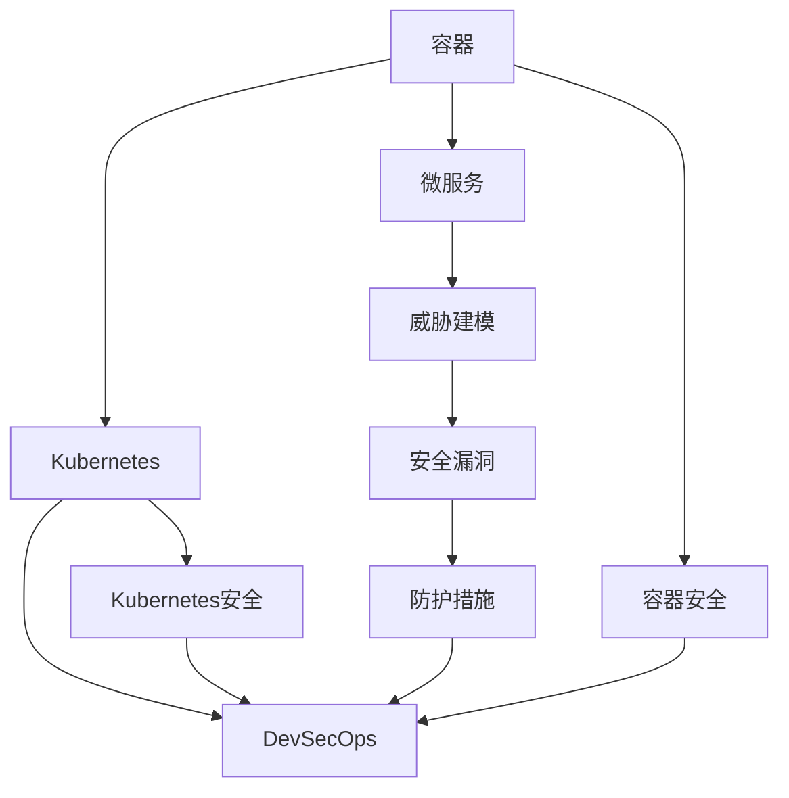

                 

# 云原生安全：容器和Kubernetes环境下的防护

> 关键词：云原生安全,容器, Kubernetes, 微服务, DevSecOps, 威胁建模, 安全漏洞

## 1. 背景介绍

随着云计算的迅速发展和容器技术的崛起，云原生应用架构（Cloud-Native Application Architecture）成为了企业构建高效、弹性和安全应用的新选择。云原生架构以容器和微服务为基石，实现了应用部署和运维的自动化、弹性伸缩和自我修复，极大提升了系统的可靠性、可扩展性和灵活性。然而，云原生环境也带来了新的安全挑战，尤其是在容器和Kubernetes环境下，如何构建和维护一个安全的应用生态，成为业界关注的焦点。

### 1.1 问题由来

云原生安全（Cloud-Native Security）旨在保护云原生应用在容器化和微服务架构下的安全。与传统的虚拟机和集中式部署相比，容器和Kubernetes环境的安全问题复杂多变，主要体现在以下几个方面：

1. **暴露面增大**：容器和微服务的应用模块众多，接口开放，可能导致攻击面大幅扩展。
2. **快速迭代更新**：云原生应用频繁迭代更新，增加了安全漏洞被利用的风险。
3. **资源调度动态**：Kubernetes容器调度机制复杂，资源动态调整带来了潜在的安全风险。
4. **分布式环境**：云原生应用部署在分布式系统中，网络隔离和通信安全成为难点。
5. **弹性伸缩与自愈**：弹性伸缩和自愈机制虽然提高了应用的可扩展性和自修复能力，但也可能成为攻击的切入点。

### 1.2 问题核心关键点

为有效应对云原生环境下的安全挑战，本节将介绍几个关键问题点：

- **威胁建模**：如何在设计阶段识别和评估潜在威胁，制定安全策略。
- **容器安全**：如何在容器化环境中防范和缓解各种安全威胁。
- **Kubernetes安全**：如何在Kubernetes平台上实施有效的安全防护措施。
- **DevSecOps整合**：如何将安全流程嵌入到DevOps流程中，实现全生命周期的安全管理。

这些核心问题点是构建云原生安全架构的基础，通过深入理解这些问题，可以全面掌握云原生环境下的安全防护策略。

## 2. 核心概念与联系

### 2.1 核心概念概述

为更好地理解云原生安全，本节将介绍几个关键概念：

- **容器（Container）**：一种轻量级、可移植的运行环境，用于封装应用程序及其依赖项。容器通过统一的应用接口，实现了应用的可移植性和可重复性。
- **Kubernetes（K8s）**：一个开源容器编排平台，通过自动化运维和管理容器，实现了应用的弹性伸缩、自我修复和资源调度。
- **微服务（Microservices）**：将应用拆分成一组细粒度的服务，每个服务独立部署、开发和运维。微服务架构提升了应用的可扩展性和可维护性。
- **DevSecOps**：一种软件开发和运维模式，强调安全、质量和效率的协同，将安全过程嵌入到DevOps流程中。
- **威胁建模**：通过威胁建模工具和技术，系统性地识别和评估潜在威胁，制定相应的安全策略。
- **安全漏洞**：在软件和系统中存在的、可能被利用的缺陷或错误，如SQL注入、跨站脚本（XSS）等。

这些概念之间的逻辑关系可以通过以下Mermaid流程图来展示：



这个流程图展示了一些核心概念及其之间的关系：

1. 容器和微服务是云原生应用的基础组件。
2. Kubernetes平台提供了容器管理和编排功能。
3. DevSecOps将安全融入整个软件开发生命周期。
4. 威胁建模是安全防护的重要步骤，通过识别潜在威胁，制定防护策略。
5. 安全漏洞是威胁建模和防护的焦点。
6. 防护措施依据威胁建模结果制定，应用于容器、Kubernetes和微服务。

## 3. 核心算法原理 & 具体操作步骤
### 3.1 算法原理概述

云原生安全主要依赖于威胁建模、容器安全、Kubernetes安全和DevSecOps整合等关键技术。其核心算法原理可概括为以下几个方面：

1. **威胁建模**：通过威胁建模工具（如OWASP威胁建模语言（TML）、StriderCX等）识别和评估应用中的潜在威胁，并制定相应的安全策略。
2. **容器安全**：通过加固容器镜像、限制容器访问权限、监控容器运行状态等技术手段，提升容器的安全性。
3. **Kubernetes安全**：通过网络隔离、策略控制、认证授权等技术，确保Kubernetes平台的安全性。
4. **DevSecOps整合**：将安全流程嵌入到DevOps流程中，实现自动化和持续的安全监控和改进。

这些技术共同构成了云原生安全的基础架构，通过威胁建模识别威胁，通过容器和Kubernetes安全技术缓解威胁，通过DevSecOps整合保障持续安全，形成了一个闭环的安全防护体系。

### 3.2 算法步骤详解

云原生安全的实现步骤包括：

1. **威胁建模**：
   - 选择合适的威胁建模工具，如OWASP TML、StriderCX等。
   - 定义应用的上下文、威胁场景和资产列表。
   - 识别潜在威胁，评估威胁的可行性和影响。
   - 制定相应的安全策略和防护措施。

2. **容器安全**：
   - 构建安全的容器镜像，使用镜像签名和扫描工具检测漏洞。
   - 限制容器访问权限，使用最小权限原则。
   - 监控容器运行状态，设置告警规则。

3. **Kubernetes安全**：
   - 配置网络策略，实现网络隔离。
   - 使用RBAC（Role-Based Access Control），进行严格的认证和授权。
   - 配置资源限制，避免资源耗尽攻击。

4. **DevSecOps整合**：
   - 将安全测试、代码审查、漏洞扫描等安全流程嵌入到CI/CD管道中。
   - 实现自动化持续安全监控和改进，如使用安全扫描工具、安全自动化测试等。
   - 实施自动化应急响应机制，快速修复安全漏洞。

### 3.3 算法优缺点

云原生安全的算法具有以下优点：

1. **自动化与持续性**：通过DevSecOps整合，将安全流程自动化嵌入到开发和运维流程中，实现持续监控和改进。
2. **灵活性与可扩展性**：云原生架构天然支持微服务和弹性伸缩，能够灵活应对安全威胁和资源变化。
3. **分层防护**：通过威胁建模、容器安全、Kubernetes安全和DevSecOps整合的多层防护机制，提升整体安全性。
4. **快速响应**：在威胁出现时，通过自动化机制快速识别和修复漏洞。

同时，也存在一些缺点：

1. **复杂性**：云原生架构本身复杂，安全防护也需要考虑多方面因素，增加了实现难度。
2. **依赖性**：依赖于工具和平台的兼容性，一旦出现兼容性问题，安全效果可能大打折扣。
3. **资源消耗**：自动化和持续监控需要大量计算资源，增加了成本。
4. **误报率高**：自动化检测和告警可能产生大量误报，需要人工确认和处理。

### 3.4 算法应用领域

云原生安全技术已经在多个领域得到了广泛应用，涵盖了从应用开发、容器管理到运维监控的各个环节：

- **Web应用**：通过威胁建模、容器安全、Kubernetes安全和DevSecOps整合，提升Web应用的整体安全性。
- **移动应用**：在容器化环境中构建和部署移动应用，通过容器安全、Kubernetes安全和DevSecOps整合，保障应用安全性。
- **IoT应用**：将物联网设备和服务容器化，使用微服务和Kubernetes进行管理和调度，保障设备和服务的安全性。
- **金融服务**：在金融领域，云原生安全技术应用于交易、支付、客户服务等环节，保障敏感数据和交易的安全性。
- **医疗健康**：在医疗健康领域，云原生安全技术保障患者信息、医疗数据和服务的隐私和安全。
- **政府服务**：在政府服务领域，云原生安全技术用于保障公共服务的稳定性和安全性。

## 4. 数学模型和公式 & 详细讲解 & 举例说明

### 4.1 数学模型构建

云原生安全的数学模型构建涉及威胁建模和风险评估。以下是一个简单的风险评估模型，用于量化威胁的潜在影响：

设威胁 $T$ 的潜在影响为 $R(T)$，威胁 $T$ 的可实现性为 $A(T)$，则威胁的总体风险 $R$ 可以表示为：

$$
R(T) = R(T) \times A(T)
$$

其中 $R(T)$ 为威胁 $T$ 的潜在影响，如数据泄露、系统瘫痪等；$A(T)$ 为威胁 $T$ 的可实现性，如攻击复杂度、攻击者能力等。

### 4.2 公式推导过程

为了计算威胁 $T$ 的潜在影响 $R(T)$，需要量化威胁的可能性和潜在影响。假设威胁 $T$ 发生的概率为 $P(T)$，威胁 $T$ 对系统的影响为 $I(T)$，则威胁的潜在影响 $R(T)$ 可以表示为：

$$
R(T) = P(T) \times I(T)
$$

在实际应用中，可以使用统计方法和历史数据来估计 $P(T)$ 和 $I(T)$。例如，使用漏洞扫描工具扫描应用，发现一个SQL注入漏洞，假设攻击者利用该漏洞的概率为 $P(T)$，成功攻击后对系统的影响为 $I(T)$，则威胁的潜在影响可以计算如下：

$$
R(T) = P(T) \times I(T)
$$

### 4.3 案例分析与讲解

以SQL注入漏洞为例，分析威胁建模和风险评估的过程：

1. **威胁识别**：通过漏洞扫描工具发现SQL注入漏洞，威胁为 SQL注入攻击。
2. **可实现性分析**：假设攻击者可以通过SQL注入获取数据库管理员权限，概率为 $P(T)$。
3. **潜在影响分析**：攻击成功后，数据库管理员密码可能被泄露，系统数据可能被篡改或删除，影响为 $I(T)$。
4. **风险评估**：计算威胁的潜在影响 $R(T)$，然后根据威胁矩阵进行优先级排序，制定相应的防护措施。

## 5. 项目实践：代码实例和详细解释说明

### 5.1 开发环境搭建

在云原生安全实践过程中，需要搭建一个集成了容器和Kubernetes环境的开发环境。以下是一个示例环境搭建过程：

1. **安装Docker**：从官网下载并安装Docker，用于管理和运行容器。
2. **安装Kubernetes**：选择Kubernetes分布式架构，如Minikube、Kubernetes集群等，安装Kubernetes服务。
3. **配置CI/CD**：使用Jenkins、GitLab CI/CD等工具，实现自动化持续集成和持续部署。
4. **部署应用**：将应用容器化，使用Kubernetes部署和管理应用。
5. **配置监控**：使用Prometheus、Grafana等工具，实现应用监控和告警。

### 5.2 源代码详细实现

以下是一个简单的Python脚本，用于扫描Docker镜像中的漏洞：

```python
import docker
from docker import DockerClient

# 连接Docker客户端
client = DockerClient(base_url='unix://var/run/docker.sock')

# 获取所有镜像列表
images = client.images.list()

# 扫描镜像中的漏洞
for image in images:
    client.images.get(image.id).run()
```

### 5.3 代码解读与分析

上述代码通过Docker客户端获取所有镜像，并运行每个镜像，以检测其中的安全漏洞。在实际应用中，可以使用更高级的漏洞扫描工具，如Clair、Anchore等，结合威胁建模工具进行更全面、准确的安全评估。

### 5.4 运行结果展示

运行上述代码后，可以通过观察Docker守护进程的输出，获取容器运行状态和错误信息。在实际应用中，可以利用日志分析和监控工具，实时监控容器和应用的状态，及时发现和处理安全事件。

## 6. 实际应用场景

### 6.1 智能合约安全

在区块链和智能合约领域，云原生安全技术可以用于保障智能合约的安全性。智能合约作为自动执行的代码，其安全性直接关系到数字资产的保护。通过威胁建模、容器安全和Kubernetes安全，可以确保智能合约在分布式环境中的安全运行。

具体而言，可以在容器化和Kubernetes环境中部署智能合约，使用DevSecOps整合安全流程，实现自动化漏洞扫描和修复。同时，利用区块链的透明性和可追溯性，对智能合约的运行进行实时监控，确保其安全性。

### 6.2 物联网安全

物联网设备和服务通过容器化技术部署在云平台上，云原生安全技术可以用于保障物联网系统的安全。通过威胁建模，识别物联网设备和服务中的潜在威胁，制定相应的防护措施。使用容器安全和Kubernetes安全技术，对容器和网络进行安全加固。

具体而言，可以使用容器镜像签名技术，确保容器镜像的安全性；使用网络策略和RBAC，限制容器和设备的网络访问权限；使用DevSecOps整合安全流程，实现持续监控和改进。

### 6.3 云应用安全

云应用在云原生环境中运行，面临的安全挑战复杂多样。通过云原生安全技术，可以提升云应用的整体安全性。

具体而言，使用容器化技术封装云应用，利用容器安全和Kubernetes安全技术，对容器和网络进行安全加固。使用威胁建模工具，识别和评估应用中的潜在威胁，制定相应的防护措施。使用DevSecOps整合安全流程，实现自动化持续监控和改进。

### 6.4 未来应用展望

未来，随着云原生技术的进一步发展，云原生安全技术将在更多领域得到应用，为各行业带来新的安全防护能力。

1. **边缘计算安全**：随着边缘计算的普及，云原生安全技术将用于保障边缘计算环境的安全性。
2. **混合云安全**：在混合云环境中，云原生安全技术将用于保障跨云环境的安全性。
3. **区块链安全**：云原生安全技术将应用于区块链领域，保障智能合约和数字资产的安全性。
4. **自动驾驶安全**：在自动驾驶领域，云原生安全技术将用于保障车辆和道路的安全性。
5. **金融科技安全**：在金融科技领域，云原生安全技术将用于保障交易、支付等关键环节的安全性。
6. **医疗健康安全**：在医疗健康领域，云原生安全技术将用于保障患者信息和医疗数据的安全性。

## 7. 工具和资源推荐

### 7.1 学习资源推荐

为了帮助开发者掌握云原生安全技术，以下是一些优质的学习资源：

1. **《云原生安全白皮书》**：由Cloud Native Security（CNS）组织发布，介绍了云原生安全的基本概念和最佳实践。
2. **Kubernetes安全指南**：Kubernetes官方文档中的安全章节，提供了详细的Kubernetes安全配置和管理指南。
3. **OWASP Web Security Cheat Sheet**：OWASP发布的Web安全指南，包含常见的Web安全威胁和防护措施。
4. **DevSecOps全栈实践**：DevSecOps领域的权威书籍，介绍了DevSecOps的最佳实践和案例。
5. **《容器安全手册》**：介绍了容器安全和Kubernetes安全的最佳实践和技术细节。

通过学习这些资源，可以全面掌握云原生安全技术，并将其应用于实际项目中。

### 7.2 开发工具推荐

在云原生安全开发中，以下工具可以显著提升开发效率：

1. **Docker**：用于管理和运行容器，提供了丰富的镜像和工具支持。
2. **Kubernetes**：用于容器编排和管理，提供了强大的弹性伸缩和自修复能力。
3. **Prometheus**：用于监控和告警，提供了实时监控和告警功能。
4. **Anchore**：用于容器镜像扫描和签名，保障容器镜像的安全性。
5. **Clair**：用于容器镜像扫描和分析，提供详细的漏洞信息。

这些工具的合理使用，可以大大提升云原生安全开发的效率和效果。

### 7.3 相关论文推荐

云原生安全领域的研究非常活跃，以下是几篇经典论文，推荐阅读：

1. **《Cloud-Native Security in Practice》**：介绍了云原生安全的基本概念和最佳实践，提供了实际应用的案例。
2. **《DevSecOps in Practice》**：介绍了DevSecOps的最佳实践和工具，提供了实际应用的案例。
3. **《The Security of Blockchain and Smart Contracts》**：介绍了区块链和智能合约的安全问题，提供了相应的防护措施。
4. **《Security in Kubernetes》**：介绍了Kubernetes的安全配置和管理，提供了详细的安全实践指南。
5. **《Anchoring Container Images》**：介绍了容器镜像签名和扫描技术，提供了保障容器镜像安全的方法。

这些论文代表了云原生安全领域的研究前沿，通过阅读这些论文，可以深入理解云原生安全技术的理论基础和实践方法。

## 8. 总结：未来发展趋势与挑战

### 8.1 研究成果总结

云原生安全技术在近年来得到了快速发展，广泛应用于各行业。通过威胁建模、容器安全和Kubernetes安全等技术手段，云原生应用的安全性得到了显著提升。DevSecOps的整合，实现了安全流程的自动化和持续改进，提升了整体安全性。

### 8.2 未来发展趋势

展望未来，云原生安全技术将呈现以下几个发展趋势：

1. **自动化与智能化**：随着AI技术的发展，云原生安全技术将逐步实现自动化和智能化，提升安全防护的效率和效果。
2. **零信任架构**：零信任架构将成为云原生安全的重要方向，通过严格的认证和授权，确保系统的安全性。
3. **供应链安全**：云原生安全技术将扩展到供应链安全领域，保障应用组件和第三方服务的安全性。
4. **跨平台集成**：云原生安全技术将与其他安全技术（如网络安全、应用安全等）进行更深入的整合，形成统一的安全防护体系。
5. **区块链安全**：云原生安全技术将应用于区块链领域，保障智能合约和数字资产的安全性。
6. **边缘计算安全**：云原生安全技术将应用于边缘计算领域，保障边缘计算环境的安全性。

### 8.3 面临的挑战

尽管云原生安全技术取得了显著进展，但在实现过程中仍面临诸多挑战：

1. **复杂性**：云原生架构本身复杂，安全防护也需要考虑多方面因素，增加了实现难度。
2. **依赖性**：依赖于工具和平台的兼容性，一旦出现兼容性问题，安全效果可能大打折扣。
3. **资源消耗**：自动化和持续监控需要大量计算资源，增加了成本。
4. **误报率高**：自动化检测和告警可能产生大量误报，需要人工确认和处理。

### 8.4 研究展望

未来，云原生安全技术需要在以下几个方面寻求新的突破：

1. **自动化与智能化**：开发更加智能化的安全工具，实现自动化检测和分析，减少误报率。
2. **区块链安全**：开发专门针对区块链应用的云原生安全技术，保障智能合约和数字资产的安全性。
3. **边缘计算安全**：开发专门针对边缘计算的云原生安全技术，保障边缘计算环境的安全性。
4. **跨平台集成**：将云原生安全技术与其他安全技术进行整合，形成统一的安全防护体系。
5. **零信任架构**：研究和实践零信任架构，通过严格的认证和授权，确保系统的安全性。
6. **供应链安全**：研究和实践供应链安全，保障应用组件和第三方服务的安全性。

这些研究方向和突破将进一步提升云原生安全技术的防护能力，为构建安全、可靠、高效的云原生应用奠定坚实基础。

## 9. 附录：常见问题与解答

**Q1：云原生安全与传统安全有什么区别？**

A: 云原生安全与传统安全的主要区别在于防护对象和防护手段。传统安全主要针对单个应用或系统进行防护，防护手段包括防火墙、入侵检测、防病毒等。云原生安全则面向整个云原生架构，包括容器、微服务、Kubernetes等组件，防护手段包括威胁建模、容器安全、Kubernetes安全、DevSecOps整合等。

**Q2：如何选择合适的容器镜像？**

A: 选择合适的容器镜像应考虑以下几个方面：
1. 官方镜像：选择官方镜像，保障其稳定性和安全性。
2. 历史版本：选择历史版本，避免使用可能存在漏洞的最新镜像。
3. 权限控制：使用容器镜像仓库的权限控制功能，限制访问和使用镜像的用户。
4. 安全扫描：使用安全扫描工具检测镜像中的漏洞，确保其安全性。

**Q3：Kubernetes安全有哪些关键配置？**

A: Kubernetes安全的关键配置包括：
1. 网络策略：配置网络策略，实现网络隔离和控制。
2. RBAC：使用RBAC，实现严格的认证和授权。
3. 资源限制：配置资源限制，避免资源耗尽攻击。
4. 定期更新：定期更新Kubernetes集群和组件，修复安全漏洞。
5. 安全日志：开启安全日志，记录和分析安全事件。

**Q4：DevSecOps整合如何实现？**

A: DevSecOps整合的实现步骤如下：
1. 自动化漏洞扫描：在CI/CD管道中加入漏洞扫描环节，自动化检测代码中的安全漏洞。
2. 自动化代码审查：使用静态代码分析工具，自动化审查代码，检测安全问题。
3. 自动化安全测试：使用自动化测试工具，自动化测试应用的各个环节，确保其安全性。
4. 自动化持续监控：使用监控工具，实时监控应用和系统的安全状态，及时发现和处理安全事件。
5. 自动化应急响应：使用自动化应急响应机制，快速修复安全漏洞，保障系统安全性。

通过DevSecOps整合，可以实现安全流程的自动化和持续改进，提升整体安全性。

---

作者：禅与计算机程序设计艺术 / Zen and the Art of Computer Programming

