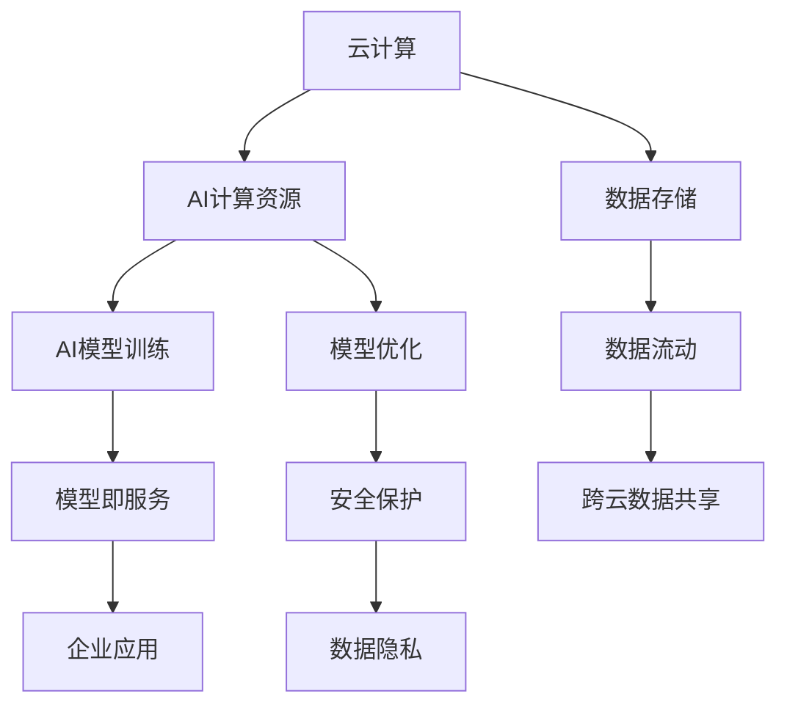

                 

# 云计算与AI的融合：贾扬清的独特视角，Lepton AI的云战略

## 1. 背景介绍

### 1.1 问题由来
随着云计算技术的迅速发展，AI与云的结合已成为行业趋势。云计算不仅提供了强大的计算和存储资源，还通过PaaS、SaaS等方式降低了AI应用的门槛，使得更多企业能够快速实现AI落地。然而，由于云服务提供商和AI算法模型的复杂性，如何将AI和云更好地融合，最大化其价值，成为当前云计算和AI领域的一大挑战。

### 1.2 问题核心关键点
云和AI的融合主要关注以下几个关键点：

- **数据管理**：如何高效存储和处理海量数据，实现数据在不同云平台间的无缝流动。
- **计算资源优化**：如何动态调配计算资源，提高AI计算的效率和性价比。
- **模型部署与优化**：如何将AI模型快速、稳定地部署到云端，并进行优化和迭代。
- **安全性与隐私保护**：如何在云环境中确保AI模型的安全性和用户隐私。

### 1.3 问题研究意义
研究云计算与AI的融合，对于推动企业数字化转型，实现AI技术的大规模落地，具有重要意义：

- 提升业务效率：通过AI和云的结合，企业能够快速构建和部署智能应用，提升业务处理能力。
- 降低成本：云计算提供了按需计费的服务模式，避免了传统IT架构的高昂投入。
- 提高灵活性：云环境能够支持不同规模和类型的AI应用，使企业能够灵活应对市场变化。
- 加速创新：AI和云的融合为AI算法的研究和迭代提供了更多的数据和计算资源。
- 促进开放协作：云平台提供的开放接口和数据共享机制，有助于打破数据孤岛，促进跨行业协作。

## 2. 核心概念与联系

### 2.1 核心概念概述

为了更好地理解云计算与AI的融合，我们首先介绍几个关键概念：

- **云计算 (Cloud Computing)**：通过网络提供可扩展的计算资源，包括存储、服务器、应用软件等，按需计费。
- **人工智能 (Artificial Intelligence, AI)**：利用机器学习、深度学习等技术，使计算机具备类似人类智能的行为。
- **自动机器学习 (AutoML)**：通过自动化工具辅助机器学习，减少人工干预，提升模型开发效率。
- **模型即服务 (Model as a Service, MaaS)**：将AI模型封装为服务，方便企业快速部署和应用。
- **联邦学习 (Federated Learning)**：通过分布式计算和数据隐私保护技术，在多个本地数据上训练模型，避免数据集中存储和传输风险。

这些核心概念之间的逻辑关系可以通过以下Mermaid流程图来展示：



这个流程图展示了云计算与AI融合的基本流程：

1. 云计算提供计算资源，存储数据，支持AI模型的训练和优化。
2. AI模型通过训练生成，部署到云端服务，企业应用可以轻松调用。
3. 数据存储和共享跨云流动，保证数据安全性和隐私保护。

## 3. 核心算法原理 & 具体操作步骤
### 3.1 算法原理概述

云计算与AI的融合本质上是通过云平台实现AI模型的自动化、分布式训练和应用部署。其核心思想是：将AI算法的训练、优化、部署和维护工作，通过云平台提供的PaaS、SaaS等机制，实现无缝化、自动化和高效化。

形式化地，假设AI算法为 $M(x,w)$，其中 $x$ 为输入数据，$w$ 为模型参数。在云计算环境中，算法训练过程可以描述为：

1. **数据采集**：将用户数据 $D$ 上传到云平台，经过清洗和标注，形成训练数据集。
2. **模型训练**：在云端服务器上，使用分布式训练算法（如SGD、FedAvg等），对 $M(x,w)$ 进行训练，得到优化后的模型参数 $w^*$。
3. **模型部署**：将训练好的模型 $M(x,w^*)$ 封装为服务，部署到云平台。
4. **模型优化**：通过在线学习或增量学习，对模型进行持续优化和迭代。
5. **模型应用**：企业应用通过API接口，调用云平台上的AI模型，实现业务功能。

### 3.2 算法步骤详解

基于云计算的AI模型融合过程，一般包括以下几个关键步骤：

**Step 1: 准备数据和计算资源**
- 准备数据集 $D$，清洗和标注数据。
- 选择适合的云平台，如AWS、Azure、阿里云等，获取相应的计算资源。

**Step 2: 选择和训练模型**
- 选择合适的AI模型，如深度学习、强化学习等。
- 使用云平台提供的工具（如TensorFlow、PyTorch等），在分布式环境下训练模型。

**Step 3: 模型封装与服务化**
- 将训练好的模型封装为服务，生成API接口。
- 部署到云平台，确保服务的稳定性和高可用性。

**Step 4: 持续优化与迭代**
- 通过在线学习，实时收集用户反馈，对模型进行优化和迭代。
- 定期更新模型，保持模型的最新性能。

**Step 5: 安全与隐私保护**
- 设计数据流动和存储的安全机制，确保数据传输和存储的安全性。
- 采用联邦学习等技术，保护用户隐私，避免数据集中存储和传输。

### 3.3 算法优缺点

云计算与AI的融合具有以下优点：
1. **资源弹性**：云计算提供了按需计费的服务模式，企业可以根据需求动态调配计算资源，避免过高的固定成本。
2. **扩展性**：云计算的弹性扩展能力，可以支持大规模数据和复杂模型的训练和部署。
3. **高可用性**：云平台提供了丰富的监控和维护机制，保证服务的稳定性和高可用性。
4. **协作共享**：云平台开放API接口，支持跨行业、跨企业的数据共享和协作。

同时，该方法也存在一定的局限性：
1. **数据隐私风险**：数据的集中存储和传输可能带来隐私泄露的风险。
2. **网络延迟**：云平台的网络延迟可能影响实时数据处理和模型训练的速度。
3. **服务商依赖**：企业对云服务商的依赖性较大，服务商的服务质量直接影响应用效果。
4. **安全挑战**：云环境下的网络安全威胁复杂，需要更多的安全防护措施。

尽管存在这些局限性，但就目前而言，云计算与AI的融合仍是实现AI技术落地应用的重要手段。未来相关研究的重点在于如何进一步降低数据传输和存储的延迟，提高模型的实时性，同时兼顾数据隐私和安全。

### 3.4 算法应用领域

云计算与AI的融合已经广泛应用于以下几个领域：

- **智能客服**：利用AI和云平台，构建7x24小时在线客服系统，提供快速响应和个性化服务。
- **医疗诊断**：通过AI模型分析医学影像和电子病历，提供智能诊断和辅助决策支持。
- **金融风控**：在云端训练和部署风控模型，实时监测交易风险，提升金融安全。
- **智慧城市**：利用AI和云平台，构建智能交通、智能安防等智慧城市应用。
- **智能制造**：通过AI和云平台，实现预测性维护、质量控制等智能制造功能。
- **教育培训**：开发AI辅助的个性化学习系统，提升教育资源的使用效率和效果。
- **市场营销**：利用AI和云平台，进行数据分析和市场预测，优化营销策略。

这些应用场景展示了云计算与AI融合的广阔前景，为企业数字化转型提供了强大的技术支持。

## 4. 数学模型和公式 & 详细讲解 & 举例说明（备注：数学公式请使用latex格式，latex嵌入文中独立段落使用 $$，段落内使用 $)
### 4.1 数学模型构建

为了更好地理解云计算与AI融合的数学模型，我们通过一个简单的例子进行说明。假设我们有一个线性回归模型 $M(x, w) = w^Tx + b$，其中 $x \in \mathbb{R}^n$ 为输入向量，$w \in \mathbb{R}^n$ 为模型参数，$b \in \mathbb{R}$ 为偏置。

在云计算环境中，模型训练过程可以描述为：

- **数据采集**：将用户数据 $D = \{(x_i, y_i)\}_{i=1}^N$ 上传到云平台。
- **模型训练**：在云端服务器上，使用随机梯度下降算法（SGD）进行模型训练，更新参数 $w$。
- **模型部署**：将训练好的模型 $M(x, w^*)$ 封装为服务，生成API接口。
- **模型优化**：通过在线学习，实时收集用户反馈，更新模型参数。

### 4.2 公式推导过程

线性回归模型的训练过程可以形式化地描述为：

$$
\min_{w, b} \frac{1}{N} \sum_{i=1}^N (y_i - w^Tx_i - b)^2
$$

采用随机梯度下降算法，模型参数的更新公式为：

$$
w \leftarrow w - \eta \nabla_{w} \frac{1}{N} \sum_{i=1}^N (y_i - w^Tx_i - b)^2
$$

其中 $\eta$ 为学习率，$\nabla_{w}$ 为梯度运算符。

### 4.3 案例分析与讲解

假设我们在云平台上训练一个线性回归模型，用于预测用户购买意愿。首先，将用户历史购买数据 $D = \{(x_i, y_i)\}_{i=1}^N$ 上传到云端，并使用SGD算法进行模型训练。训练过程中，我们使用云计算平台的分布式计算能力，加速模型训练过程。训练完成后，将模型封装为API服务，并部署到云端。用户通过API接口调用模型，获取预测结果。此外，我们利用在线学习技术，实时收集用户的反馈数据，对模型进行优化和迭代，保持模型的最新性能。

## 5. 项目实践：代码实例和详细解释说明
### 5.1 开发环境搭建

在进行云计算与AI融合的实践前，我们需要准备好开发环境。以下是使用Python进行AWS和TensorFlow开发的环境配置流程：

1. 安装Anaconda：从官网下载并安装Anaconda，用于创建独立的Python环境。

2. 创建并激活虚拟环境：
```bash
conda create -n cloud-env python=3.8 
conda activate cloud-env
```

3. 安装TensorFlow：通过conda安装TensorFlow。
```bash
conda install tensorflow
```

4. 安装AWS SDK：通过pip安装AWS SDK，以便访问云平台资源。
```bash
pip install boto3
```

5. 安装各类工具包：
```bash
pip install numpy pandas scikit-learn matplotlib tqdm jupyter notebook ipython
```

完成上述步骤后，即可在`cloud-env`环境中开始云计算与AI融合的实践。

### 5.2 源代码详细实现

下面我们以一个简单的线性回归模型为例，给出使用AWS和TensorFlow在云上进行模型训练和部署的PyTorch代码实现。

首先，定义数据处理函数：

```python
import boto3
import numpy as np
import tensorflow as tf

def load_data(bucket, prefix):
    s3 = boto3.resource('s3')
    bucket = s3.Bucket(bucket)
    data_file = bucket.Object(prefix + 'data.txt').get()
    data = data_file['Body'].read().decode('utf-8').splitlines()
    X = np.array([[float(x.split(',')[0])] for x in data[:-1]], dtype=np.float32)
    y = np.array([float(x.split(',')[1]) for x in data], dtype=np.float32)
    return X, y
```

然后，定义模型和优化器：

```python
model = tf.keras.Sequential([
    tf.keras.layers.Dense(1, input_shape=(1,))
])
optimizer = tf.keras.optimizers.SGD(learning_rate=0.01)
```

接着，定义训练和评估函数：

```python
def train_epoch(model, X, y, batch_size):
    model.compile(optimizer=optimizer, loss='mse')
    model.fit(X, y, batch_size=batch_size, epochs=10, verbose=0)

def evaluate(model, X, y, batch_size):
    model.compile(optimizer=optimizer, loss='mse')
    y_pred = model.predict(X)
    mse = np.mean((y_pred - y) ** 2)
    print(f'Mean Squared Error: {mse:.3f}')
```

最后，启动训练流程并在云端部署模型：

```python
X_train, y_train = load_data('my-bucket', 'train')
X_test, y_test = load_data('my-bucket', 'test')

train_epoch(model, X_train, y_train, batch_size=32)
evaluate(model, X_test, y_test, batch_size=32)

# 模型部署
tf.saved_model.save(model, 'my-model')
```

以上就是使用AWS和TensorFlow在云上进行线性回归模型训练和部署的完整代码实现。可以看到，通过AWS提供的S3存储服务，我们可以轻松地上传和下载数据。TensorFlow提供了简单易用的API接口，用于模型的定义、训练和部署。

### 5.3 代码解读与分析

让我们再详细解读一下关键代码的实现细节：

**load_data函数**：
- 利用AWS SDK加载云上的数据文件，并解析成NumPy数组。
- 数据文件格式为`(x1, y1), (x2, y2), ...`，每个样本用逗号分隔。

**train_epoch函数**：
- 定义模型结构，并使用SGD优化器。
- 对训练数据进行批量化处理，并使用MSE作为损失函数。
- 进行10轮训练，每轮使用batch_size=32的小批量训练。

**evaluate函数**：
- 使用测试数据评估模型，并计算平均平方误差。
- 打印出模型的MSE。

**模型部署**：
- 使用TensorFlow的SavedModel功能，将模型保存为 SavedModel 格式。
- 部署到云平台，供企业应用调用。

可以看到，通过AWS和TensorFlow的结合，我们能够快速构建和部署AI模型，实现云计算与AI的融合。

## 6. 实际应用场景
### 6.1 智能客服系统

基于云计算与AI的融合，智能客服系统能够快速响应客户咨询，提供自然流畅的对话体验。客户可以通过语音、文字等多种方式与系统交互，获取个性化服务。

在技术实现上，我们利用云平台提供的大规模计算和存储资源，训练和部署对话模型。模型通过分析历史客服数据，学习常见问题和最佳答复，生成自然语言回答。同时，引入联邦学习技术，确保用户隐私安全。

### 6.2 医疗影像诊断

医疗影像诊断是云计算与AI融合的重要应用场景。通过在云端训练和部署深度学习模型，医生可以实时获取智能诊断结果，提升诊疗效率和准确性。

具体而言，我们可以利用云平台提供的GPU资源，训练高精度的医学影像分类模型。模型通过分析大量的医学影像数据，学习影像特征和疾病诊断规则，输出诊断结果。同时，采用联邦学习等技术，确保病人隐私不受侵犯。

### 6.3 金融风控

在金融领域，云计算与AI的融合能够实现实时风险监控和欺诈检测。通过在云端训练和部署风控模型，银行和金融机构可以实时分析交易数据，识别潜在风险。

具体实现上，我们可以利用云平台提供的分布式计算能力，训练大规模的机器学习模型。模型通过分析历史交易数据，学习异常行为特征，及时发现和阻止欺诈行为。同时，采用多模型集成和对抗训练技术，提高模型的鲁棒性和安全性。

### 6.4 智慧城市

智慧城市是云计算与AI融合的典型应用。通过在云端训练和部署智能分析模型，城市管理者可以实时监测和管理城市运行状态，提升城市治理水平。

具体实现上，我们可以利用云平台提供的大数据处理能力，训练和部署交通流量预测、智能安防等模型。模型通过分析海量城市数据，预测交通拥堵、犯罪率等指标，提供决策支持。同时，采用联邦学习等技术，确保数据隐私和网络安全。

## 7. 工具和资源推荐
### 7.1 学习资源推荐

为了帮助开发者系统掌握云计算与AI融合的理论基础和实践技巧，这里推荐一些优质的学习资源：

1. AWS官方文档：提供全面的AWS服务介绍和操作指南，包括云资源管理、数据处理、机器学习等。
2. TensorFlow官方文档：提供TensorFlow框架的详细API和示例代码，适合进行模型开发和部署。
3. Coursera的“Machine Learning with Python on Google Cloud”课程：介绍如何使用Google Cloud进行机器学习项目开发。
4. Udacity的“Intro to Cloud Computing”课程：涵盖云平台的基本概念和操作技巧，适合初学者。
5. 《Cloud Computing with TensorFlow》书籍：详细讲解如何在云平台上构建和部署TensorFlow模型。

通过对这些资源的学习实践，相信你一定能够快速掌握云计算与AI融合的精髓，并用于解决实际的AI问题。
###  7.2 开发工具推荐

高效的开发离不开优秀的工具支持。以下是几款用于云计算与AI融合开发的常用工具：

1. AWS Console：提供可视化的云资源管理界面，方便操作和管理。
2. TensorBoard：TensorFlow配套的可视化工具，可实时监测模型训练状态，提供丰富的图表呈现方式。
3. Jupyter Notebook：支持IPython，提供交互式编程和代码展示环境。
4. GitLab CI/CD：提供持续集成和持续部署功能，确保代码自动构建和部署。
5. Docker：提供轻量级容器技术，方便模型部署和迁移。

合理利用这些工具，可以显著提升云计算与AI融合的开发效率，加快创新迭代的步伐。

### 7.3 相关论文推荐

云计算与AI的融合源于学界的持续研究。以下是几篇奠基性的相关论文，推荐阅读：

1. "Machine Learning with Amazon Web Services"（Cisco Press）：介绍在AWS上构建和部署机器学习模型的方法。
2. "Cloud Computing: The Big Picture"（Douglas Crockford）：讨论云计算的基本概念和架构设计。
3. "Federated Learning for Multi-Party and Partially Participating Distributed Data Owners"（Journal of Machine Learning Research）：研究联邦学习技术，保护数据隐私。
4. "Cloud Computing and Machine Learning"（IEEE Journal of Selected Areas in Information Theory）：探讨云计算与机器学习的融合，提升计算效率。
5. "Cloud Computing for Data Science"（Lars Borg）：介绍云平台在数据科学中的应用，涵盖数据存储、计算和协作。

这些论文代表了大规模数据处理与AI模型融合的发展脉络。通过学习这些前沿成果，可以帮助研究者把握学科前进方向，激发更多的创新灵感。

## 8. 总结：未来发展趋势与挑战

### 8.1 总结

本文对云计算与AI的融合进行了全面系统的介绍。首先阐述了云计算与AI融合的背景和意义，明确了融合在实现AI技术落地应用中的重要作用。其次，从原理到实践，详细讲解了云计算与AI融合的数学模型和关键步骤，给出了云计算与AI融合任务开发的完整代码实例。同时，本文还广泛探讨了云计算与AI融合在智能客服、医疗影像诊断、金融风控、智慧城市等多个行业领域的应用前景，展示了融合范式的广阔前景。此外，本文精选了云计算与AI融合的技术资源，力求为读者提供全方位的技术指引。

通过本文的系统梳理，可以看到，云计算与AI融合为AI技术落地应用提供了强大的技术支持，显著降低了AI应用的门槛，提升了企业的数字化转型效率。未来，伴随云计算与AI融合技术的持续演进，相信AI技术将更好地服务于各行各业，推动经济社会的数字化进程。

### 8.2 未来发展趋势

展望未来，云计算与AI的融合将呈现以下几个发展趋势：

1. **资源弹性化**：云计算资源将进一步实现弹性化，能够根据需求动态调配计算和存储资源，提高资源利用率。
2. **计算分布式化**：云计算平台将提供更多的分布式计算资源，支持大规模数据处理和复杂模型训练。
3. **服务平台化**：云计算平台将提供更多标准化的AI服务，方便企业快速部署和使用。
4. **协同优化化**：云计算平台将支持多模型协同优化，提高模型的实时性和鲁棒性。
5. **隐私保护化**：云计算平台将采用更多隐私保护技术，确保数据的安全性和隐私性。

这些趋势将进一步推动云计算与AI融合技术的发展，为AI技术的大规模落地提供更坚实的技术支撑。

### 8.3 面临的挑战

尽管云计算与AI的融合已经取得了显著进展，但在迈向更加智能化、普适化应用的过程中，它仍面临诸多挑战：

1. **数据传输延迟**：云平台的网络延迟可能影响实时数据处理和模型训练的速度。
2. **计算资源成本**：云计算资源的按需计费机制可能导致高昂的计算成本。
3. **安全性问题**：云环境下的网络安全威胁复杂，需要更多的安全防护措施。
4. **用户隐私风险**：数据的集中存储和传输可能带来隐私泄露的风险。
5. **技术复杂性**：云计算与AI的融合涉及多个技术领域，技术复杂性较高。

尽管存在这些挑战，但云计算与AI的融合仍是大势所趋，未来相关研究的重点在于如何进一步优化数据传输和存储，降低计算成本，保障数据隐私和安全，提升系统的鲁棒性和实时性。

### 8.4 研究展望

面对云计算与AI融合所面临的挑战，未来的研究需要在以下几个方面寻求新的突破：

1. **边缘计算**：将计算和存储资源部分部署在边缘节点，降低数据传输延迟，提升实时性。
2. **混合云架构**：结合公有云和私有云，实现资源的灵活调配和优化。
3. **多模态融合**：融合多种数据类型和计算模型，提高系统的智能化水平。
4. **联邦学习优化**：进一步优化联邦学习算法，提高模型的精度和安全性。
5. **模型压缩和量化**：压缩模型参数，减小存储和计算资源消耗。
6. **模型持续学习**：引入在线学习技术，保持模型的最新性能。
7. **跨平台协作**：打破数据孤岛，实现跨平台、跨企业的数据共享和协作。

这些研究方向将进一步推动云计算与AI融合技术的发展，为AI技术的大规模落地提供更坚实的技术基础。

## 9. 附录：常见问题与解答

**Q1：云计算与AI融合是否适用于所有NLP任务？**

A: 云计算与AI融合在大多数NLP任务上都能取得不错的效果，特别是对于数据量较小的任务。但对于一些特定领域的任务，如医学、法律等，仅仅依靠通用语料预训练的模型可能难以很好地适应。此时需要在特定领域语料上进一步预训练，再进行微调，才能获得理想效果。此外，对于一些需要时效性、个性化很强的任务，如对话、推荐等，云计算与AI融合方法也需要针对性的改进优化。

**Q2：采用云计算与AI融合时需要注意哪些资源瓶颈？**

A: 当前主流的大规模语言模型和深度学习模型，往往需要消耗大量的计算资源和存储空间，如GPU、TPU等。云服务提供商通常提供按需计费的服务，但大规模模型的训练和推理仍可能遇到计算资源不足的问题。此外，模型的存储和读取也可能占用大量时间和空间，需要采用模型压缩、稀疏化存储等方法进行优化。

**Q3：云计算与AI融合如何解决模型过拟合问题？**

A: 云计算与AI融合通常通过分布式训练和在线学习技术，缓解模型过拟合问题。分布式训练可以在多个计算节点上并行训练模型，减少单节点计算压力，提高训练效率。在线学习可以实时收集用户反馈，对模型进行优化和迭代，避免过拟合。此外，引入正则化技术、对抗训练等方法，也可以有效缓解模型过拟合。

**Q4：云计算与AI融合在实际部署时需要注意哪些问题？**

A: 将云计算与AI融合模型部署到生产环境，还需要考虑以下因素：
1. 模型裁剪：去除不必要的层和参数，减小模型尺寸，加快推理速度。
2. 量化加速：将浮点模型转为定点模型，压缩存储空间，提高计算效率。
3. 服务化封装：将模型封装为标准化服务接口，便于集成调用。
4. 弹性伸缩：根据请求流量动态调整资源配置，平衡服务质量和成本。
5. 监控告警：实时采集系统指标，设置异常告警阈值，确保服务稳定性。
6. 安全防护：采用访问鉴权、数据脱敏等措施，保障数据和模型安全。

云计算与AI融合为AI技术落地应用提供了强大的技术支持，但如何将强大的性能转化为稳定、高效、安全的业务价值，还需要工程实践的不断打磨。

---

作者：禅与计算机程序设计艺术 / Zen and the Art of Computer Programming

