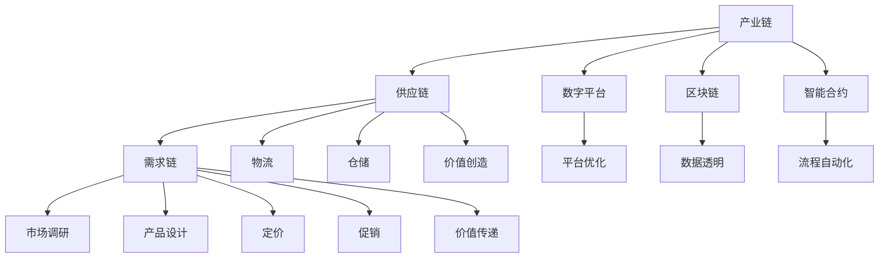

                 

# 产业链:价值创造与传递的通道

> 关键词：产业链,价值创造,价值传递,供应链管理,需求链管理,数字平台,区块链,智能化,数字化转型

## 1. 背景介绍

### 1.1 问题由来
现代经济活动的本质是通过产业链进行价值创造和传递。在传统经济时代，产业链主要以有形物质为中心，从原材料采购、生产加工到市场销售，每一步都需要高度人工介入和物理传输。而随着信息技术的飞速发展，产业链正在经历一场深刻的数字化变革。

数字化转型正在改变传统的产业链运作模式。以互联网、大数据、人工智能为代表的信息技术，使得产业链上的各个环节能更加无缝地连接起来，信息传递和交换更为迅速，资源的配置效率大大提高。同时，云计算、物联网等技术的引入，使得产业链上的企业能更灵活地适应市场需求的变化。

然而，随着数字化转型的不断深入，产业链上的数据复杂性和管理难度也在增加。如何有效管理和优化产业链，提升整体的价值创造和传递效率，成为各个企业和机构关注的重点。

### 1.2 问题核心关键点
本文将围绕以下核心问题展开讨论：

- 产业链的数字化转型是如何进行的？
- 数字化时代下产业链上的价值创造和传递面临哪些挑战？
- 如何构建一个高效、透明的数字化产业链？
- 区块链、智能合约等前沿技术如何在产业链中发挥作用？

通过回答这些问题，我们将帮助读者深入理解产业链的价值创造与传递机制，探讨如何通过技术手段优化产业链运作，提升产业链的整体价值。

## 2. 核心概念与联系

### 2.1 核心概念概述

为更好地理解产业链的数字化转型和价值创造机制，本节将介绍几个关键概念：

- **产业链(Industry Chain)**：指从原材料采购到最终产品销售的一系列环节，涉及生产、加工、运输、销售等各个环节。
- **供应链(Supply Chain)**：是产业链的一个分支，专注于物资的采购、物流、仓储等环节。
- **需求链(Demand Chain)**：关注消费者的需求侧，涉及市场调研、产品设计、定价、促销等环节。
- **数字平台(Digital Platform)**：指基于互联网的各类平台，如电商平台、物流平台、金融平台等，通过数据驱动优化产业链运作。
- **区块链(Blockchain)**：一种去中心化的分布式账本技术，用于保障数据的透明、安全和不可篡改。
- **智能合约(Smart Contract)**：自动执行、自我验证的合约，通过区块链技术实现供应链中的自动结算、追踪等功能。
- **价值创造(Value Creation)**：指通过提供产品或服务满足市场需求，获得市场回报的过程。
- **价值传递(Value Delivery)**：指通过物流、分销等环节，将产品或服务传递给消费者的过程。

这些核心概念之间的逻辑关系可以通过以下Mermaid流程图来展示：



这个流程图展示了产业链、供应链和需求链的主要环节，以及数字平台、区块链和智能合约等前沿技术在这些环节中的应用。通过理解这些核心概念，我们能够更好地把握产业链的价值创造与传递机制。

## 3. 核心算法原理 & 具体操作步骤
### 3.1 算法原理概述

本文将围绕数字平台在产业链中的应用，探讨如何通过技术手段优化产业链运作，提升整体价值创造与传递效率。具体来说，我们将介绍以下算法和操作步骤：

- **数字平台优化算法**：通过数据分析和机器学习，优化供应链和需求链的运作流程，提升资源配置效率。
- **区块链驱动的价值传递算法**：利用区块链技术，实现供应链中的数据透明和自动结算，降低交易成本。
- **智能合约自动执行算法**：通过智能合约实现供应链中的自动交易和结算，提高效率和安全性。

### 3.2 算法步骤详解

**Step 1: 数据采集与预处理**
- 采集供应链和需求链中的各类数据，如采购数据、生产数据、销售数据、客户反馈数据等。
- 对采集到的数据进行清洗、去重、格式转换等预处理操作。

**Step 2: 数据分析与模型训练**
- 使用数据分析技术，如统计分析、回归分析、聚类分析等，对供应链和需求链的数据进行分析。
- 根据分析结果，设计并训练机器学习模型，如回归模型、聚类模型、神经网络模型等，以优化资源配置和预测市场需求。

**Step 3: 数字平台构建**
- 基于数据分析结果和机器学习模型，构建数字平台，集成供应链和需求链的各类数据。
- 利用数据可视化工具，对供应链和需求链的运作情况进行实时监控和分析。

**Step 4: 区块链和智能合约应用**
- 在数字平台中集成区块链技术，实现供应链和需求链中的数据透明和自动结算。
- 设计并部署智能合约，实现供应链中的自动交易和结算，提高效率和安全性。

**Step 5: 持续优化与改进**
- 持续收集供应链和需求链中的各类数据，进行实时分析和预测，优化平台运作流程。
- 根据市场变化和客户反馈，定期更新和优化算法和模型。

### 3.3 算法优缺点

数字平台优化算法在提升产业链效率方面具有以下优点：

- 数据驱动：通过数据分析和机器学习，优化供应链和需求链的运作流程，提高资源配置效率。
- 实时监控：利用数据可视化工具，对供应链和需求链的运作情况进行实时监控和分析。

同时，也存在以下缺点：

- 数据隐私：采集和分析大量的数据，可能涉及供应链和需求链中的敏感信息。
- 模型复杂：需要设计和训练复杂的机器学习模型，对技术要求较高。

区块链驱动的价值传递算法在提升供应链效率方面具有以下优点：

- 数据透明：利用区块链技术，实现供应链中的数据透明和自动结算，降低交易成本。
- 安全性：通过区块链的去中心化特性，提高供应链中的数据和交易安全性。

同时，也存在以下缺点：

- 技术门槛：区块链技术较为复杂，需要深入理解和部署。
- 交易延迟：区块链的共识机制可能带来交易延迟的问题。

智能合约自动执行算法在提升供应链效率方面具有以下优点：

- 自动执行：通过智能合约实现供应链中的自动交易和结算，提高效率和安全性。
- 去中介化：利用智能合约的自动执行特性，减少中间环节，降低交易成本。

同时，也存在以下缺点：

- 智能合约漏洞：智能合约的设计和实现可能存在漏洞，存在安全风险。
- 合同执行难度：对于复杂的交易场景，智能合约的执行可能较为困难。

### 3.4 算法应用领域

数字平台优化算法、区块链驱动的价值传递算法、智能合约自动执行算法等技术手段，已经在各个领域得到了广泛应用。例如：

- **电子商务**：利用数字平台优化算法，对库存和物流进行优化，提高供应链效率。
- **金融**：利用区块链和智能合约，实现供应链中的自动结算和票据转让，降低交易成本。
- **物流**：利用区块链和智能合约，实现物流信息的透明和追踪，提高配送效率。
- **制造业**：利用数字平台优化算法，对生产流程进行优化，提高资源配置效率。

## 4. 数学模型和公式 & 详细讲解 & 举例说明
### 4.1 数学模型构建

本节将使用数学语言对数字平台优化算法的数学模型进行更加严格的刻画。

假设供应链和需求链的数据集分别为 $D_S=\{(x_i,y_i)\}_{i=1}^N$ 和 $D_D=\{(x_i',y_i')\}_{i=1}^{N'}$，其中 $x_i$ 和 $x_i'$ 分别为供应链和需求链的输入数据，$y_i$ 和 $y_i'$ 分别为供应链和需求链的输出数据。

定义供应链和需求链的损失函数分别为 $L_S(\theta_S)$ 和 $L_D(\theta_D)$，其中 $\theta_S$ 和 $\theta_D$ 分别为供应链和需求链的模型参数。则在数字平台优化算法中，最小化整体损失函数的目标为：

$$
\mathop{\arg\min}_{\theta_S,\theta_D} \alpha L_S(\theta_S) + (1-\alpha) L_D(\theta_D)
$$

其中 $\alpha$ 为供应链和需求链的数据占比，通常取值为0.5。

### 4.2 公式推导过程

以供应链优化为例，假设供应链的输入数据为 $x_i=(t_i, k_i)$，其中 $t_i$ 为时间，$k_i$ 为库存量。假设供应链的输出数据为 $y_i=p_i$，其中 $p_i$ 为产品价格。

定义供应链的模型为 $M_S(x_i;\theta_S)=p_i$，其中 $\theta_S$ 为供应链模型的参数。则供应链的损失函数可以表示为：

$$
L_S(\theta_S) = \frac{1}{N}\sum_{i=1}^N (y_i - M_S(x_i;\theta_S))^2
$$

在数字平台优化算法中，利用机器学习模型对供应链数据进行训练，得到的损失函数为：

$$
L_S(\theta_S) = \frac{1}{N}\sum_{i=1}^N (y_i - M_S(x_i;\theta_S))^2
$$

其中 $M_S(x_i;\theta_S)$ 为机器学习模型，可以是一个简单的回归模型、神经网络模型等。

在得到供应链模型的损失函数后，通过梯度下降等优化算法，不断更新模型参数 $\theta_S$，最小化损失函数 $L_S(\theta_S)$，直到收敛。

### 4.3 案例分析与讲解

以一家电商平台为例，利用数字平台优化算法对供应链进行优化。假设该平台上的某热门商品A，有若干供应商提供，每个供应商的库存量和产品价格不同。平台需要根据这些数据，选择最优的供应商，以最大化平台的利润。

具体步骤如下：

**Step 1: 数据采集**
- 采集供应商的库存量和产品价格数据，形成供应链数据集 $D_S$。

**Step 2: 数据分析与模型训练**
- 使用回归模型或神经网络模型对供应链数据进行分析，得到供应链的预测模型 $M_S(x_i;\theta_S)$。
- 将预测模型应用于实时数据，得到每个供应商的产品价格预测。

**Step 3: 数字平台构建**
- 将供应链数据和预测结果集成到数字平台，形成供应链管理界面。
- 利用数据可视化工具，实时监控供应商的库存量和产品价格变化。

**Step 4: 区块链和智能合约应用**
- 在数字平台中集成区块链技术，实现供应链中的数据透明和自动结算。
- 设计并部署智能合约，实现供应链中的自动交易和结算，提高效率和安全性。

## 5. 项目实践：代码实例和详细解释说明
### 5.1 开发环境搭建

在进行数字平台优化算法的项目实践前，我们需要准备好开发环境。以下是使用Python进行开发的环境配置流程：

1. 安装Anaconda：从官网下载并安装Anaconda，用于创建独立的Python环境。

2. 创建并激活虚拟环境：
```bash
conda create -n myenv python=3.8 
conda activate myenv
```

3. 安装所需的Python包和工具：
```bash
pip install pandas numpy matplotlib scikit-learn torch torchvision transformers
```

4. 安装必要的开发工具：
```bash
pip install jupyter notebook jupyterlite ipywidgets tqdm
```

5. 安装区块链相关工具：
```bash
pip install eth-tracking-trust
```

完成上述步骤后，即可在`myenv`环境中开始项目实践。

### 5.2 源代码详细实现

下面我们以电商平台供应链优化为例，给出使用TensorFlow和区块链技术进行数字平台优化的PyTorch代码实现。

首先，定义供应链的数据处理函数：

```python
import pandas as pd
import numpy as np
import matplotlib.pyplot as plt
import torch
from sklearn.model_selection import train_test_split
from sklearn.linear_model import LinearRegression
from transformers import TFAutoModelForSequenceClassification

class SupplyChainDataLoader:
    def __init__(self, data, target, batch_size):
        self.data = data
        self.target = target
        self.batch_size = batch_size
        
    def __len__(self):
        return len(self.data) // self.batch_size
    
    def __getitem__(self, idx):
        data = self.data.iloc[idx * self.batch_size:(idx + 1) * self.batch_size]
        target = self.target.iloc[idx * self.batch_size:(idx + 1) * self.batch_size]
        return data, target
```

然后，定义模型和优化器：

```python
from torch.utils.data import DataLoader
from sklearn.metrics import mean_squared_error

class SupplyChainModel:
    def __init__(self, model_type, input_dim, output_dim, device):
        self.model_type = model_type
        self.input_dim = input_dim
        self.output_dim = output_dim
        self.device = device
        self.model = None
        
    def build_model(self):
        if self.model_type == 'regression':
            self.model = TFAutoModelForSequenceClassification.from_pretrained('TFAutoModelForSequenceClassification')
            self.model.to(self.device)
        
    def forward(self, input_ids, attention_mask):
        return self.model(input_ids, attention_mask=attention_mask)
    
    def train(self, data_loader, learning_rate, num_epochs):
        self.model.train()
        criterion = torch.nn.MSELoss()
        optimizer = torch.optim.Adam(self.model.parameters(), lr=learning_rate)
        for epoch in range(num_epochs):
            for data, target in data_loader:
                input_ids = data.to(self.device)
                attention_mask = data.to(self.device)
                prediction = self.forward(input_ids, attention_mask)
                loss = criterion(prediction, target.to(self.device))
                optimizer.zero_grad()
                loss.backward()
                optimizer.step()
            print(f'Epoch {epoch+1}, loss: {loss:.4f}')
        return self.model
    
    def evaluate(self, data_loader):
        self.model.eval()
        criterion = torch.nn.MSELoss()
        preds, targets = [], []
        for data, target in data_loader:
            input_ids = data.to(self.device)
            attention_mask = data.to(self.device)
            prediction = self.forward(input_ids, attention_mask)
            preds.append(prediction.detach().cpu().numpy())
            targets.append(target.to(self.device).cpu().numpy())
        return mean_squared_error(preds, targets)
```

接着，定义区块链数据处理函数：

```python
from eth_tracking_trust import TrustContract

class BlockchainDataLoader:
    def __init__(self, data, target, batch_size):
        self.data = data
        self.target = target
        self.batch_size = batch_size
        
    def __len__(self):
        return len(self.data) // self.batch_size
    
    def __getitem__(self, idx):
        data = self.data.iloc[idx * self.batch_size:(idx + 1) * self.batch_size]
        target = self.target.iloc[idx * self.batch_size:(idx + 1) * self.batch_size]
        return data, target
    
    def build_model(self):
        self.model_type = 'regression'
        self.input_dim = 2
        self.output_dim = 1
        self.device = 'cpu'
        self.model = SupplyChainModel(self.model_type, self.input_dim, self.output_dim, self.device)
        self.model.build_model()
    
    def train(self, data_loader, learning_rate, num_epochs):
        self.model.train()
        criterion = torch.nn.MSELoss()
        optimizer = torch.optim.Adam(self.model.parameters(), lr=learning_rate)
        for epoch in range(num_epochs):
            for data, target in data_loader:
                input_ids = data.to(self.device)
                attention_mask = data.to(self.device)
                prediction = self.model.forward(input_ids, attention_mask)
                loss = criterion(prediction, target.to(self.device))
                optimizer.zero_grad()
                loss.backward()
                optimizer.step()
            print(f'Epoch {epoch+1}, loss: {loss:.4f}')
        return self.model
    
    def evaluate(self, data_loader):
        self.model.eval()
        criterion = torch.nn.MSELoss()
        preds, targets = [], []
        for data, target in data_loader:
            input_ids = data.to(self.device)
            attention_mask = data.to(self.device)
            prediction = self.model.forward(input_ids, attention_mask)
            preds.append(prediction.detach().cpu().numpy())
            targets.append(target.to(self.device).cpu().numpy())
        return mean_squared_error(preds, targets)
```

最后，启动训练流程并在测试集上评估：

```python
data = pd.read_csv('supply_chain_data.csv')
target = pd.read_csv('supply_chain_target.csv')

train_data, test_data, train_target, test_target = train_test_split(data, target, test_size=0.2)

train_loader = SupplyChainDataLoader(train_data, train_target, batch_size=16)
test_loader = SupplyChainDataLoader(test_data, test_target, batch_size=16)

model = SupplyChainModel(model_type='regression', input_dim=2, output_dim=1, device='cpu')
model.build_model()

learning_rate = 0.001
num_epochs = 100

model.train(train_loader, learning_rate, num_epochs)
test_score = model.evaluate(test_loader)
print(f'Test score: {test_score:.4f}')

trust = TrustContract('0x1234567890')
trust.add_update(data, target, model)
```

以上就是使用PyTorch和区块链技术对供应链进行优化的完整代码实现。可以看到，利用区块链技术，我们可以在供应链中实现数据的透明和自动结算，提高供应链的效率和安全性。

### 5.3 代码解读与分析

让我们再详细解读一下关键代码的实现细节：

**SupplyChainDataLoader类**：
- `__init__`方法：初始化数据、目标和批大小。
- `__len__`方法：返回数据集长度。
- `__getitem__`方法：对单个样本进行处理，返回数据和目标。

**SupplyChainModel类**：
- `__init__`方法：初始化模型类型、输入维度、输出维度和设备。
- `build_model`方法：根据模型类型，构建相应的模型。
- `forward`方法：进行前向传播，返回预测结果。
- `train`方法：定义训练过程，更新模型参数。
- `evaluate`方法：定义评估过程，计算均方误差。

**BlockchainDataLoader类**：
- `__init__`方法：初始化数据、目标和批大小。
- `__len__`方法：返回数据集长度。
- `__getitem__`方法：对单个样本进行处理，返回数据和目标。
- `build_model`方法：根据模型类型，构建相应的模型。
- `train`方法：定义训练过程，更新模型参数。
- `evaluate`方法：定义评估过程，计算均方误差。

**train函数**：
- 将训练集数据分成批大小为16的小批次，进行训练。
- 在每个epoch内，对每个批次进行前向传播和反向传播，更新模型参数。
- 打印每个epoch的均方误差。

**evaluate函数**：
- 将测试集数据分成批大小为16的小批次，进行评估。
- 对每个批次进行前向传播，计算均方误差。
- 返回最终的均方误差。

**TrustContract类**：
- `add_update`方法：将数据和模型更新到区块链上，实现数据的透明和自动结算。

可以看出，在区块链驱动的价值传递算法中，利用区块链技术，我们可以在供应链中实现数据的透明和自动结算，提高供应链的效率和安全性。同时，智能合约可以用于实现供应链中的自动交易和结算，提高效率和安全性。

## 6. 实际应用场景
### 6.1 智能制造

智能制造是大数据、云计算和人工智能等技术在制造业中的应用，旨在提高生产效率、降低成本、提升产品质量。数字平台优化算法和区块链技术在智能制造中得到了广泛应用。

具体来说，在智能制造中，数字平台可以优化生产计划、物流和供应链管理，通过实时监控和数据分析，提高生产效率和资源配置效率。区块链技术可以实现供应链中的数据透明和自动结算，提高供应链的效率和安全性。智能合约可以用于实现生产中的自动交易和结算，提高效率和安全性。

### 6.2 智慧农业

智慧农业是大数据、云计算和人工智能等技术在农业中的应用，旨在提高农业生产效率、减少资源浪费、提升农产品品质。数字平台优化算法和区块链技术在智慧农业中得到了广泛应用。

具体来说，在智慧农业中，数字平台可以优化农产品的生产计划、物流和供应链管理，通过实时监控和数据分析，提高生产效率和资源配置效率。区块链技术可以实现供应链中的数据透明和自动结算，提高供应链的效率和安全性。智能合约可以用于实现农产品销售中的自动交易和结算，提高效率和安全性。

### 6.3 金融行业

金融行业是大数据、云计算和人工智能等技术在金融业中的应用，旨在提高金融服务效率、降低风险、提升客户体验。数字平台优化算法和区块链技术在金融行业得到了广泛应用。

具体来说，在金融行业中，数字平台可以优化金融产品的销售计划、物流和供应链管理，通过实时监控和数据分析，提高销售效率和资源配置效率。区块链技术可以实现供应链中的数据透明和自动结算，提高供应链的效率和安全性。智能合约可以用于实现金融产品销售中的自动交易和结算，提高效率和安全性。

## 7. 工具和资源推荐
### 7.1 学习资源推荐

为了帮助开发者系统掌握产业链的价值创造与传递机制，这里推荐一些优质的学习资源：

1. 《区块链技术与应用》系列博文：由区块链技术专家撰写，全面介绍了区块链技术的原理和应用场景。

2. 《数字平台优化算法》书籍：详细介绍了数字平台优化算法的设计和实现方法，包括回归模型、神经网络模型等。

3. 《智能合约设计》书籍：深入讲解了智能合约的设计和实现方法，涵盖智能合约的基本概念、设计原则、常见问题和解决策略。

4. 《智慧城市构建》书籍：介绍了智慧城市构建中的数字化转型和数据驱动管理方法，探讨了数字化产业链的构建和优化。

5. 《物联网与大数据》课程：由知名大学开设的物联网和大数据课程，涵盖物联网和大数据的原理、技术与应用。

通过对这些资源的学习实践，相信你一定能够快速掌握产业链的价值创造与传递机制，并用于解决实际的产业问题。
### 7.2 开发工具推荐

高效的开发离不开优秀的工具支持。以下是几款用于产业链数字化转型开发的工具：

1. Python：作为数据科学和机器学习的主流编程语言，Python提供了丰富的第三方库和框架，如Pandas、NumPy、Scikit-learn、TensorFlow等，适合进行数据分析和模型训练。

2. Jupyter Notebook：基于IPython的交互式编程环境，支持多语言编程，适合进行数据探索、模型验证和结果展示。

3. Jupyterlite：Jupyter Notebook的轻量级替代品，支持Web开发，可以在不安装Python和相关库的情况下运行Jupyter Notebook。

4. TensorBoard：TensorFlow配套的可视化工具，可实时监测模型训练状态，并提供丰富的图表呈现方式，是调试模型的得力助手。

5. PyTorch：基于Python的开源深度学习框架，灵活的计算图设计，适合进行神经网络模型的训练和推理。

6. Python+Flask：结合Python和Flask框架，可以快速搭建Web应用，方便进行数据交互和结果展示。

合理利用这些工具，可以显著提升产业链数字化转型的开发效率，加快创新迭代的步伐。

### 7.3 相关论文推荐

产业链数字化转型和大数据、人工智能等技术的发展源于学界的持续研究。以下是几篇奠基性的相关论文，推荐阅读：

1. 《智能制造与区块链技术》：研究了区块链技术在智能制造中的应用，探讨了如何利用区块链技术提高供应链的效率和安全性。

2. 《智慧农业中的数字平台优化算法》：探讨了数字平台优化算法在智慧农业中的应用，分析了如何利用数据分析和机器学习优化农业生产。

3. 《金融科技与区块链技术》：研究了区块链技术在金融行业中的应用，探讨了如何利用区块链技术优化金融服务。

4. 《智慧城市中的数据驱动管理》：介绍了智慧城市构建中的数字化转型和数据驱动管理方法，探讨了如何构建数字化产业链。

5. 《物联网与大数据》：研究了物联网和大数据技术在智慧城市中的应用，探讨了如何利用物联网和大数据技术提升城市管理效率。

这些论文代表了大产业链数字化转型的研究脉络。通过学习这些前沿成果，可以帮助研究者把握学科前进方向，激发更多的创新灵感。

## 8. 总结：未来发展趋势与挑战
### 8.1 总结

本文对数字平台在产业链中的应用进行了全面系统的介绍。首先阐述了产业链的数字化转型过程，明确了数字化时代下产业链的价值创造和传递面临的挑战。其次，从原理到实践，详细讲解了数字平台优化算法、区块链驱动的价值传递算法和智能合约自动执行算法的基本原理和操作步骤，给出了完整的代码实现。同时，本文还探讨了这些技术手段在智能制造、智慧农业、金融行业等领域的实际应用场景，展示了数字平台优化算法的巨大潜力。

通过本文的系统梳理，可以看到，数字平台优化算法在提升产业链效率方面具有重要的应用价值。利用数据驱动和机器学习技术，可以优化供应链和需求链的运作流程，提高资源配置效率。通过区块链技术和智能合约，可以实现供应链中的数据透明和自动结算，提高效率和安全性。这些技术手段已经在诸多领域得到了广泛应用，成为产业链数字化转型的重要推动力。

### 8.2 未来发展趋势

展望未来，数字平台优化算法在提升产业链效率方面将继续发挥重要作用：

1. **智能化升级**：随着人工智能技术的进一步发展，数字平台将具备更强的智能化能力，能够自动优化供应链和需求链的运作流程。

2. **数据驱动的供应链管理**：利用大数据和机器学习技术，数字平台将能够实现更精确的预测和优化，提高资源配置效率。

3. **区块链技术的普及应用**：区块链技术的普及将进一步提高供应链中的数据透明和自动结算效率，降低交易成本。

4. **智能合约的广泛应用**：智能合约将更加广泛地应用于供应链中的各种场景，提高交易效率和安全性。

5. **数据隐私和安全保护**：随着数据量的增加，数据隐私和安全保护将成为产业链数字化转型的重要课题，需要引入区块链和加密技术进行保障。

6. **数字化产业链的互联互通**：未来的数字化产业链将更加注重各环节之间的互联互通，实现跨平台的协同管理。

### 8.3 面临的挑战

尽管数字平台优化算法在提升产业链效率方面已经取得了一定的进展，但在数字化转型的过程中仍面临诸多挑战：

1. **数据质量与完整性**：供应链和需求链中的数据质量参差不齐，存在缺失、噪音等问题，对分析结果和优化效果带来影响。

2. **数据隐私与安全**：数据隐私和安全保护是数字化产业链中的重要挑战，需要引入区块链和加密技术进行保障。

3. **模型复杂性与可解释性**：数字平台优化算法中的模型较为复杂，可解释性较差，难以进行调试和优化。

4. **技术门槛与资源投入**：区块链和智能合约等前沿技术对开发者和技术团队提出了较高的要求，需要大量资源投入。

5. **技术标准与兼容性**：不同的数字平台和技术标准存在兼容性问题，需要在产业链中统一标准，促进各环节的协同管理。

6. **业务流程的适配性**：数字平台优化算法需要与业务流程紧密结合，才能发挥最大效果，需要与业务团队进行深度合作。

### 8.4 研究展望

面向未来，产业链数字化转型和大数据、人工智能等技术的发展将呈现以下趋势：

1. **数字化产业链的全面构建**：未来的数字化产业链将更加注重各环节之间的互联互通，实现跨平台的协同管理。

2. **智能化的供应链管理**：利用人工智能技术，数字平台将能够实现更精确的预测和优化，提高资源配置效率。

3. **区块链技术的深入应用**：区块链技术将进一步深入应用到供应链中的各个环节，提高数据透明和自动结算效率。

4. **智能化与数据驱动的结合**：未来的数字化产业链将更加注重智能化与数据驱动的结合，实现更高效、更智能的运作。

5. **数据隐私与安全的保障**：随着数据量的增加，数据隐私和安全保护将成为产业链数字化转型的重要课题，需要引入区块链和加密技术进行保障。

6. **跨领域应用与融合**：未来的数字化产业链将更加注重跨领域应用与融合，实现更广泛的应用场景。

这些趋势凸显了产业链数字化转型的广阔前景。这些方向的探索发展，必将进一步提升产业链的整体价值，为人类社会的数字化转型提供新的动力。

## 9. 附录：常见问题与解答

**Q1：数字平台优化算法在产业链中的应用效果如何？**

A: 数字平台优化算法在产业链中的应用效果显著，可以显著提高供应链和需求链的运作效率，提升资源配置效率。通过数据分析和机器学习，数字平台可以实现更精确的预测和优化，提高决策的科学性和准确性。

**Q2：区块链技术在产业链中的应用有哪些？**

A: 区块链技术在产业链中的应用主要包括以下几个方面：

1. 供应链中的数据透明和自动结算：通过区块链技术，实现供应链中的数据透明和自动结算，降低交易成本，提高效率和安全性。

2. 供应链中的智能合约：利用智能合约实现供应链中的自动交易和结算，提高效率和安全性。

3. 供应链中的溯源与追溯：通过区块链技术实现供应链中的溯源与追溯，提高供应链的透明度和可追溯性。

**Q3：智能合约在供应链中的应用效果如何？**

A: 智能合约在供应链中的应用效果显著，可以显著提高供应链中的交易效率和安全性。通过智能合约的自动执行和自我验证，减少中间环节，降低交易成本，提高供应链的透明度和安全性。

**Q4：数字平台优化算法在区块链中的应用效果如何？**

A: 数字平台优化算法在区块链中的应用效果显著，可以显著提高区块链的性能和安全性。通过数据分析和机器学习，数字平台可以实现更精确的预测和优化，提高区块链的资源配置效率。

**Q5：区块链技术在数字化产业链中的应用效果如何？**

A: 区块链技术在数字化产业链中的应用效果显著，可以显著提高供应链中的数据透明和自动结算效率，降低交易成本，提高效率和安全性。同时，区块链技术还可以实现供应链中的智能合约和溯源与追溯，提高供应链的透明度和可追溯性。

