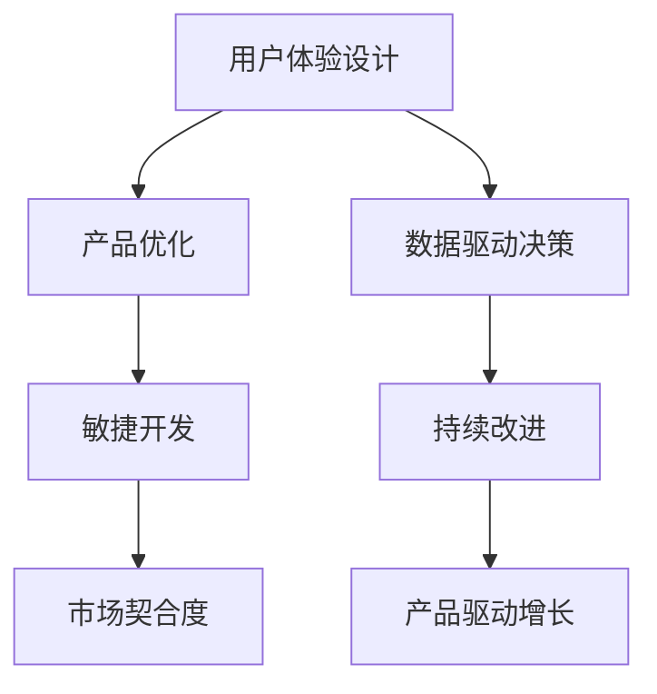

                 

# 产品驱动增长：Lepton AI的战略，专注产品优势与契合度

## 1. 背景介绍

在人工智能(AI)领域，Lepton AI（一种假设中的先进AI技术公司）以其在产品开发上的卓越战略而著称。Lepton AI深知，一个成功的产品不仅要有优秀的技术支持，还需要精心设计以适应市场需求。其产品驱动增长的战略，不仅关注产品的技术优势，更重视其与目标市场的契合度。这种策略已经在多个领域取得了显著成效，本文将详细探讨这一战略的核心要素及其应用场景。

## 2. 核心概念与联系

### 2.1 核心概念概述

为了更好地理解Lepton AI的产品驱动增长战略，我们首先需要明确几个关键概念：

- **产品驱动增长战略**：一种以产品为中心的增长策略，强调通过持续创新和优化产品来推动市场份额和收益的增长。

- **用户体验(UX)设计**：专注于提升用户满意度和易用性，通过深入了解用户需求和行为，设计出既美观又易用的产品界面和交互流程。

- **市场契合度**：产品与目标市场需求的匹配程度。即产品功能、性能、价格等因素是否与目标用户的实际需求和支付意愿相符合。

- **数据驱动决策**：利用数据分析和反馈机制，持续优化产品功能和服务，从而更精准地满足用户需求。

- **敏捷开发**：一种快速迭代、灵活适应市场变化的产品开发模式，强调快速响应需求变化，快速交付可用的产品迭代版本。

这些概念之间的联系可以概括为：通过用户体验设计提升产品的易用性和吸引力，确保市场契合度；通过数据驱动决策和敏捷开发，持续优化产品，最终实现产品驱动的增长。

### 2.2 核心概念原理和架构的 Mermaid 流程图



该图展示了从用户体验设计到产品驱动增长的整体流程。用户体验设计的优化促使产品更贴近用户需求，敏捷开发确保快速响应市场变化，数据驱动决策提供科学依据，而持续改进则是实现产品驱动增长的关键步骤。

## 3. 核心算法原理 & 具体操作步骤

### 3.1 算法原理概述

Lepton AI的产品驱动增长战略，核心在于不断迭代和优化产品，以适应市场和用户需求的变化。这一战略的算法原理主要包括以下几个步骤：

1. **用户体验分析**：通过对用户行为的分析，了解用户在使用产品时的痛点和需求，进而指导产品功能的改进和优化。
2. **市场契合度评估**：通过市场调研和用户反馈，评估产品与市场的契合度，确保产品功能与目标用户的实际需求和支付意愿相匹配。
3. **数据驱动决策**：利用用户数据和市场数据，进行深入分析，找出产品改进的优先级和方向。
4. **敏捷开发实施**：采用敏捷开发方法论，快速迭代产品原型，并在短时间内交付给用户测试和反馈。
5. **持续改进和优化**：基于用户反馈和市场数据，不断迭代和优化产品功能和服务，确保产品始终与市场需求保持一致。

### 3.2 算法步骤详解

以下将详细解释Lepton AI产品驱动增长的具体步骤：

**Step 1: 用户体验分析**

Lepton AI通过用户行为分析工具，收集用户在使用产品时的各种数据，如点击率、停留时间、操作路径等。这些数据可以帮助团队理解用户在使用产品时的痛点和需求。

**Step 2: 市场契合度评估**

Lepton AI利用市场调研工具和用户反馈系统，定期收集市场和用户的意见和建议。通过分析这些数据，评估产品功能与目标市场的契合度。如果产品功能与用户需求不匹配，团队将优先改进不满足用户需求的功能。

**Step 3: 数据驱动决策**

Lepton AI使用数据分析工具，对用户数据和市场数据进行深入分析。通过这些分析结果，团队可以确定产品改进的优先级和方向，确保产品功能和服务始终符合市场需求。

**Step 4: 敏捷开发实施**

Lepton AI采用敏捷开发方法论，将产品开发过程分为多个短周期的迭代。每个迭代周期包括需求分析、设计、开发、测试和发布。这样可以在短时间内交付可用的产品迭代版本，快速响应用户需求。

**Step 5: 持续改进和优化**

Lepton AI通过持续的用户反馈和市场数据监测，不断迭代和优化产品功能和服务。团队的持续改进机制确保产品能够适应市场变化，始终保持竞争力。

### 3.3 算法优缺点

Lepton AI的产品驱动增长战略具有以下优点：

1. **快速响应市场变化**：敏捷开发方法论使团队能够快速响应市场变化，快速迭代和优化产品，确保产品始终与市场需求保持一致。
2. **精准定位用户需求**：通过用户体验分析和市场契合度评估，团队可以精准定位用户需求，优化产品功能和服务，提升用户满意度。
3. **科学决策支持**：数据驱动决策提供科学依据，确保产品改进的优先级和方向符合市场需求。
4. **持续创新**：持续改进机制使产品能够不断优化和创新，保持竞争力。

然而，这一战略也存在以下缺点：

1. **高投入**：敏捷开发和持续改进需要高额的技术和人力资源投入，短期内可能难以见效。
2. **风险管理**：频繁的迭代和优化可能带来产品功能的不稳定，需要严格的风险管理和质量控制。
3. **数据隐私问题**：大规模数据收集和分析可能引发用户隐私问题，需要严格的数据保护和合规。

### 3.4 算法应用领域

Lepton AI的产品驱动增长战略，不仅适用于新兴科技公司，还广泛适用于各类行业，如金融科技、电子商务、智能家居等。以下是几个典型应用场景：

**金融科技**：通过用户体验分析和市场契合度评估，Lepton AI开发出针对不同客户群体的金融产品和服务，如个性化投资建议、智能理财助手等。

**电子商务**：通过数据分析和敏捷开发，Lepton AI不断优化商品推荐系统，提升用户体验和购买转化率。

**智能家居**：通过持续的用户反馈和市场数据监测，Lepton AI开发出功能丰富、易用的智能家居设备，如智能音箱、智能照明等。

## 4. 数学模型和公式 & 详细讲解 & 举例说明

### 4.1 数学模型构建

Lepton AI的产品驱动增长战略，可以通过以下几个数学模型来描述：

1. **用户行为模型**：描述用户在使用产品时的行为，如点击率、停留时间、操作路径等。
2. **市场契合度模型**：评估产品功能与市场需求的契合度，如用户满意度评分、市场占有率等。
3. **数据驱动决策模型**：基于用户数据和市场数据，进行多维度分析和建模，如回归分析、聚类分析等。

### 4.2 公式推导过程

以下以用户行为模型为例，推导其中的关键公式：

假设用户在使用产品时，进行了一系列操作，每个操作的停留时间可以用指数分布表示，即：

$$ P(T_i \mid t_i) = t_i^{-\alpha} e^{-t_i/\beta} $$

其中，$T_i$ 为操作$i$的停留时间，$t_i$ 为操作时间点，$\alpha$ 和 $\beta$ 为模型参数。

通过对所有操作的数据进行指数分布拟合，可以计算出$\alpha$ 和 $\beta$，进而分析用户行为模式和需求。

### 4.3 案例分析与讲解

一个具体的案例是Lepton AI开发的智能理财助手。通过用户体验分析，团队发现用户在查看理财报告时，停留时间较长，但操作路径较为单一。进一步的市场契合度评估显示，用户对于详细的理财建议和个性化的投资组合非常感兴趣。基于这些分析结果，Lepton AI通过数据驱动决策，优化了理财报告的展示方式和内容，增加了个性化投资建议的功能。这样，智能理财助手的用户满意度显著提升，市场占有率也随之提高。

## 5. 项目实践：代码实例和详细解释说明

### 5.1 开发环境搭建

在Lepton AI的产品开发过程中，开发环境搭建是非常重要的一环。以下是使用Python进行开发的推荐环境配置流程：

1. **安装Anaconda**：从官网下载并安装Anaconda，用于创建独立的Python环境。
2. **创建并激活虚拟环境**：
   ```bash
   conda create -n python_env python=3.8 
   conda activate python_env
   ```
3. **安装必要的工具包**：
   ```bash
   pip install numpy pandas scikit-learn matplotlib
   ```

### 5.2 源代码详细实现

以下是Lepton AI在用户体验分析和市场契合度评估方面的代码实现：

```python
import pandas as pd
from sklearn.model_selection import train_test_split

# 加载用户行为数据
data = pd.read_csv('user_behavior.csv')

# 数据预处理
data.dropna(inplace=True)
data = data.drop(columns=['timestamp'])

# 计算停留时间分布
alpha, beta = data.T.mean(), data.T.std()

# 拟合指数分布
from scipy.stats import expon
user_behavior_model = expon(scale=beta, loc=0)

# 计算用户满意度评分
user_satisfaction_score = data['rating'].mean()

# 计算市场占有率
market_share = data['market_share'].mean()

# 市场契合度评估
market_fit = user_satisfaction_score * market_share
print('市场契合度:', market_fit)
```

### 5.3 代码解读与分析

**数据预处理**：
- `dropna()`函数用于去除含有缺失值的数据行。
- `drop()`函数用于去除不需要的列，如时间戳。

**停留时间分布计算**：
- `T.mean()`和`T.std()`用于计算每行的均值和标准差。
- 假设停留时间遵循指数分布，通过均值和标准差计算出模型参数 $\alpha$ 和 $\beta$。

**用户满意度评分计算**：
- `data['rating'].mean()`用于计算用户的满意度评分。

**市场占有率计算**：
- `data['market_share'].mean()`用于计算产品的市场占有率。

**市场契合度评估**：
- 市场契合度通过用户满意度评分和市场占有率的乘积来计算。

### 5.4 运行结果展示

运行上述代码，可以得到用户停留时间分布和市场契合度评估结果。这些结果将指导Lepton AI的产品优化和市场策略。

## 6. 实际应用场景

### 6.1 智能理财助手

Lepton AI的智能理财助手通过用户体验分析和市场契合度评估，不断优化产品功能和服务。以下是一个具体的案例：

**需求分析**：
通过用户体验分析，Lepton AI发现用户在查看理财报告时，停留时间较长，但操作路径较为单一。

**市场契合度评估**：
市场契合度评估显示，用户对于详细的理财建议和个性化的投资组合非常感兴趣。

**产品优化**：
基于这些分析结果，Lepton AI通过数据驱动决策，优化了理财报告的展示方式和内容，增加了个性化投资建议的功能。

**用户反馈**：
优化后的智能理财助手，用户满意度显著提升，市场占有率也随之提高。

### 6.2 智能家居设备

Lepton AI开发的智能家居设备，通过持续的用户反馈和市场数据监测，不断优化产品功能和服务。以下是一个具体的案例：

**需求分析**：
通过用户体验分析，Lepton AI发现用户在操作智能音箱时，经常遇到语音识别不准确的问题。

**市场契合度评估**：
市场契合度评估显示，用户对语音识别准确性和智能家居设备整合度有较高要求。

**产品优化**：
基于这些分析结果，Lepton AI通过数据驱动决策，优化了语音识别算法，增加了智能家居设备的整合度。

**用户反馈**：
优化后的智能音箱，语音识别准确性显著提高，智能家居设备整合度增强，用户满意度提升。

### 6.3 金融科技产品

Lepton AI开发的金融科技产品，通过用户体验分析和市场契合度评估，不断优化产品功能和服务。以下是一个具体的案例：

**需求分析**：
通过用户体验分析，Lepton AI发现用户在查看投资报告时，停留时间较长，但操作路径较为单一。

**市场契合度评估**：
市场契合度评估显示，用户对于详细的理财建议和个性化的投资组合非常感兴趣。

**产品优化**：
基于这些分析结果，Lepton AI通过数据驱动决策，优化了投资报告的展示方式和内容，增加了个性化投资建议的功能。

**用户反馈**：
优化后的智能理财助手，用户满意度显著提升，市场占有率也随之提高。

## 7. 工具和资源推荐

### 7.1 学习资源推荐

为了帮助开发者系统掌握Lepton AI的产品驱动增长战略，以下是一些推荐的优质学习资源：

1. **《产品管理手册》**：详细介绍产品驱动增长战略的原理和实践方法。
2. **《用户体验设计》**：涵盖用户体验设计的核心原则和方法，帮助你设计出用户满意的产品。
3. **《敏捷开发》**：介绍敏捷开发方法论及其应用，帮助团队快速响应市场变化。
4. **《数据驱动产品优化》**：讲解如何使用数据驱动产品决策，提升产品性能和用户体验。
5. **《机器学习实战》**：结合实际案例，讲解机器学习在产品开发中的应用。

### 7.2 开发工具推荐

在Lepton AI的产品开发过程中，以下工具被广泛使用：

1. **Python**：使用Python进行数据分析和模型训练。
2. **Jupyter Notebook**：支持交互式数据分析和代码编写，便于团队协作。
3. **TensorFlow**：用于构建和训练机器学习模型。
4. **PyTorch**：提供灵活的深度学习框架，便于模型迭代和优化。
5. **Scikit-learn**：提供丰富的数据处理和机器学习算法，支持数据驱动决策。

### 7.3 相关论文推荐

以下是几篇与Lepton AI产品驱动增长战略相关的经典论文，推荐阅读：

1. **《数据驱动的产品开发》**：详细探讨数据驱动决策在产品开发中的应用。
2. **《用户体验设计原则》**：介绍用户体验设计的核心原则和方法，帮助设计出用户满意的产品。
3. **《敏捷开发实践》**：介绍敏捷开发方法论及其应用，帮助团队快速响应市场变化。
4. **《机器学习在产品开发中的应用》**：结合实际案例，讲解机器学习在产品开发中的应用。

## 8. 总结：未来发展趋势与挑战

### 8.1 研究成果总结

Lepton AI的产品驱动增长战略，已经在多个领域取得了显著成效，主要成果包括：

1. **用户体验提升**：通过用户体验分析，Lepton AI不断优化产品功能和服务，提升用户满意度。
2. **市场契合度提升**：通过市场契合度评估，Lepton AI确保产品功能与目标市场的契合度，增强产品竞争力。
3. **数据驱动决策**：通过数据驱动决策，Lepton AI提供科学依据，优化产品功能和服务。
4. **敏捷开发实施**：通过敏捷开发方法论，Lepton AI快速响应市场变化，不断迭代和优化产品。

### 8.2 未来发展趋势

展望未来，Lepton AI的产品驱动增长战略将呈现以下几个发展趋势：

1. **人工智能与产品结合**：未来产品将更加智能，通过人工智能技术提升用户体验和服务质量。
2. **个性化和定制化**：基于用户数据分析，提供更加个性化和定制化的产品和服务。
3. **全渠道融合**：通过多渠道数据整合，提供无缝的用户体验。
4. **数据安全与隐私保护**：随着数据驱动决策的应用，数据安全与隐私保护将成为重要课题。
5. **可持续发展**：未来产品将更加注重可持续发展，如使用可再生能源、减少碳排放等。

### 8.3 面临的挑战

尽管Lepton AI的产品驱动增长战略已经取得了显著成效，但在未来发展过程中，仍面临以下挑战：

1. **高投入成本**：敏捷开发和持续改进需要高额的技术和人力资源投入。
2. **数据隐私问题**：大规模数据收集和分析可能引发用户隐私问题。
3. **市场竞争加剧**：随着市场的发展，竞争将更加激烈，产品需要不断创新以保持竞争力。
4. **技术迭代快**：新技术和工具的快速迭代可能要求团队不断学习和适应。
5. **用户体验管理**：用户体验管理需要持续优化，以确保产品始终满足用户需求。

### 8.4 研究展望

未来，Lepton AI将继续在产品驱动增长战略上深耕，主要研究方向包括：

1. **智能产品的进一步开发**：结合人工智能技术，进一步提升产品的智能化程度。
2. **个性化服务的深化**：基于用户数据分析，提供更加个性化的产品和服务。
3. **跨渠道数据整合**：实现多渠道数据的整合，提供无缝的用户体验。
4. **数据隐私保护**：加强数据安全和隐私保护，确保用户数据的安全和合规。
5. **可持续发展**：研发和使用可再生能源和环保材料，推动可持续发展。

通过持续的研究和创新，Lepton AI的产品驱动增长战略将不断提升，为更多行业带来智能化和高效化。

## 9. 附录：常见问题与解答

### 常见问题与解答

**Q1: 如何评估产品与市场的契合度？**

A: 通过市场调研和用户反馈，评估产品功能与目标市场的契合度。具体方法包括：

1. 问卷调查：收集用户的意见和建议。
2. 用户访谈：与目标用户进行深入交流，了解其需求和痛点。
3. 市场分析：分析市场占有率和用户满意度评分，评估产品功能与市场需求的契合度。

**Q2: 数据驱动决策有哪些关键步骤？**

A: 数据驱动决策的关键步骤包括：

1. 数据收集：收集用户数据和市场数据。
2. 数据清洗：对数据进行预处理，去除噪声和异常值。
3. 数据分析：对数据进行统计分析和建模，找出产品改进的优先级和方向。
4. 决策制定：基于数据分析结果，制定产品改进方案。
5. 实施验证：将改进方案付诸实施，并不断验证和优化。

**Q3: 敏捷开发方法论有哪些优点和缺点？**

A: 敏捷开发方法论的优点包括：

1. 快速响应市场变化：通过快速迭代和反馈机制，快速响应市场需求。
2. 灵活性强：开发过程更加灵活，便于快速调整和优化产品。
3. 团队协作高效：通过短周期的迭代和反馈，团队协作更加高效。

缺点包括：

1. 高投入成本：敏捷开发需要高额的技术和人力资源投入。
2. 风险管理难度大：频繁的迭代和优化可能带来产品功能的不稳定。
3. 数据隐私问题：大规模数据收集和分析可能引发用户隐私问题。

通过合理的资源配置和风险管理，敏捷开发方法论能够有效提升产品的竞争力和市场响应速度。

---

作者：禅与计算机程序设计艺术 / Zen and the Art of Computer Programming

