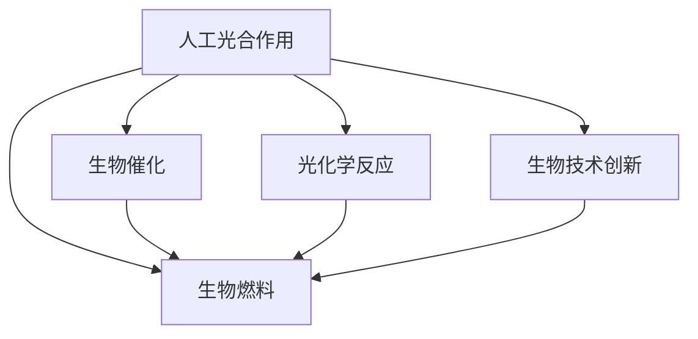

                 

# 人工光合作用：可持续能源生产的新方法

> 关键词：人工光合作用, 可持续能源, 生物技术和工程, 生物催化, 光化学反应, 氢能生产, 生物燃料, 生物技术创新

## 1. 背景介绍

### 1.1 问题由来
随着全球能源需求的不断增长和传统化石燃料的日益枯竭，人类对可持续能源的需求日益迫切。传统的能源获取方式，如煤炭、石油和天然气开采，不仅会带来环境污染和生态破坏，还面临资源枯竭的风险。因此，寻求新的可持续能源生产途径已成为全球科学界的共同目标。

近年来，随着生物技术的快速发展，人工光合作用作为一种新兴的可持续能源生产方法，逐渐受到学界的关注。人工光合作用是指通过生物技术手段模拟自然光合作用的过程，将光能转化为化学能，进而用于生产生物燃料或直接用于储能。这一技术有望在降低碳排放、缓解全球气候变化方面发挥重要作用。

### 1.2 问题核心关键点
人工光合作用的核心在于利用生物技术手段，将光能转化为化学能，从而实现可持续能源的生产。其关键技术包括生物催化、光化学反应、生物燃料生产等。目前，这一领域的研究已经取得了一定的进展，但仍面临诸多挑战。

人工光合作用的优势在于：
1. 利用可再生能源，如太阳能、风能等，减少对化石燃料的依赖。
2. 能够在较低温度下进行，能源利用效率较高。
3. 能够将二氧化碳等温室气体转化为有用的化学能，有助于缓解气候变化。

但同时也存在一些挑战，如转化效率低、生产成本高、技术成熟度不足等。

### 1.3 问题研究意义
研究人工光合作用对于推动可持续能源生产和环境保护具有重要意义：

1. 提供可再生能源来源，减少对化石燃料的依赖，降低温室气体排放。
2. 通过生物技术手段，降低生产成本，提高能源生产的经济可行性。
3. 探索新型能源生产路径，推动能源技术的多样化和创新。
4. 结合生物技术和工程，推动多学科交叉发展，促进科学技术进步。
5. 为解决全球气候变化问题提供新的思路和解决方案。

## 2. 核心概念与联系

### 2.1 核心概念概述

为更好地理解人工光合作用的原理和应用，本节将介绍几个密切相关的核心概念：

- 人工光合作用：利用生物技术手段，模拟自然光合作用的过程，将光能转化为化学能，用于生产生物燃料或直接储能。
- 生物催化：通过生物酶或微生物，催化化学反应，将光能转化为化学能。
- 光化学反应：在光照条件下，通过化学反应将光能转化为化学能。
- 生物燃料：通过生物技术手段，将光能转化为化学能，进而用于生产生物燃料，如生物乙醇、生物甲烷等。
- 生物技术创新：利用现代生物技术和工程手段，探索新型能源生产路径，推动可持续能源的研发和应用。

这些核心概念之间的逻辑关系可以通过以下Mermaid流程图来展示：



这个流程图展示了大规模光合作用的相关概念及其之间的关系：

1. 人工光合作用通过生物催化和光化学反应，将光能转化为化学能。
2. 转化后的化学能用于生产生物燃料。
3. 生物技术创新为光合作用的探索和应用提供了新的技术手段。

## 3. 核心算法原理 & 具体操作步骤
### 3.1 算法原理概述

人工光合作用的算法原理基于生物技术和化学原理。其核心思想是通过生物催化剂，将光能转化为化学能，进而生产生物燃料或储能。具体步骤包括光能吸收、光化学反应、生物催化反应等。

形式化地，假设人工光合作用模型为 $G$，输入为光能 $E$，输出为化学能 $C$。则人工光合作用的优化目标是最小化转换效率的损失，即：

$$
\hat{G}=\mathop{\arg\min}_{G} \mathcal{L}(G,E,C)
$$

其中 $\mathcal{L}$ 为光能转化为化学能的损失函数，用于衡量模型输出的化学能与实际化学能的差异。常见的损失函数包括熵损失、吉布斯自由能损失等。

通过梯度下降等优化算法，人工光合作用模型不断更新，最小化损失函数 $\mathcal{L}$，使得光能转化为化学能的过程更高效、更可控。

### 3.2 算法步骤详解

人工光合作用的一般步骤包括：

**Step 1: 选择生物催化剂**
- 选择合适的生物催化剂，如微生物、生物酶等。生物催化剂需要具有高效的光能吸收能力和化学催化能力。

**Step 2: 设计光化学反应器**
- 设计用于吸收光能和催化反应的光化学反应器。常用的光化学反应器包括光生物反应器、光催化反应器等。

**Step 3: 进行光化学反应**
- 将光能输入光化学反应器，催化生物催化剂，将光能转化为化学能。

**Step 4: 进行生物催化反应**
- 对生成的化学能进行进一步的生物催化反应，产生目标产物，如生物燃料、化学品等。

**Step 5: 优化模型参数**
- 根据实际生产效果，不断优化生物催化剂的筛选、光化学反应器设计、生物催化反应条件等参数。

**Step 6: 测试和改进**
- 在实际生产中测试模型效果，根据生产数据进行模型改进，提高转换效率和生产效率。

### 3.3 算法优缺点

人工光合作用的优势在于：
1. 利用可再生能源，减少对化石燃料的依赖。
2. 能够在较低温度下进行，能源利用效率较高。
3. 能够将二氧化碳等温室气体转化为有用的化学能，有助于缓解气候变化。

但同时也存在一些局限性：
1. 转化效率低。目前人工光合作用的转换效率仍低于自然光合作用。
2. 生产成本高。生物催化剂的筛选和生产、光化学反应器的设计和优化等成本较高。
3. 技术成熟度不足。人工光合作用仍处于初期研发阶段，技术成熟度较低。

尽管存在这些局限性，但人工光合作用作为新兴的可持续能源生产方法，仍具有广阔的发展前景。未来相关研究的主要方向在于如何进一步提高转换效率，降低生产成本，提高技术成熟度。

### 3.4 算法应用领域

人工光合作用在以下几个领域具有广泛的应用前景：

- 生物燃料生产：通过光合作用生产生物乙醇、生物甲烷等可再生燃料。
- 清洁能源储能：利用光合作用生产氢气等储能物质。
- 温室气体减排：通过光合作用将二氧化碳转化为有用化学品，减少温室气体排放。
- 生物制药：利用光合作用生产药物中间体等生物活性物质。
- 生物材料生产：通过光合作用生产生物塑料等生物基材料。

## 4. 数学模型和公式 & 详细讲解 & 举例说明

### 4.1 数学模型构建

人工光合作用的数学模型主要涉及光能吸收、光化学反应和生物催化反应。

假设人工光合作用模型为 $G$，输入为光能 $E$，输出为化学能 $C$。光化学反应过程的数学模型为 $R$，生物催化反应过程的数学模型为 $B$。则整体数学模型可以表示为：

$$
G = B \circ R
$$

其中 $\circ$ 表示函数组合。

### 4.2 公式推导过程

以生物乙醇的生产为例，推导光能转化为化学能的数学公式。

假设生物催化剂为 $E. coli$，光能吸收率为 $\eta$，光化学反应效率为 $\alpha$，生物催化效率为 $\beta$。则光能转化为化学能的过程可以表示为：

$$
\begin{aligned}
\frac{dC}{dt} &= \eta \alpha \beta E \\
&= \eta \alpha \beta I \cdot \exp(-\sigma I)
\end{aligned}
$$

其中 $I$ 为光强，$\sigma$ 为光吸收系数。

根据化学反应的速率方程，生物乙醇的生成速率 $r$ 可以表示为：

$$
r = k \frac{C_{\text{g}}}{K_{\text{m}} + C_{\text{g}}}
$$

其中 $k$ 为反应速率常数，$K_{\text{m}}$ 为米氏常数，$C_{\text{g}}$ 为生物乙醇的浓度。

通过上述数学模型，可以模拟光能转化为化学能的整个过程，并优化模型参数，提高生产效率。

### 4.3 案例分析与讲解

以生物乙醇的生产为例，分析人工光合作用的实际应用场景：

**案例背景**：
某公司计划利用人工光合作用生产生物乙醇，选择 $E. coli$ 作为生物催化剂，设计光生物反应器，进行光能吸收和光化学反应。

**解决方案**：
1. **选择生物催化剂**：选择 $E. coli$ 作为生物催化剂，具有高效的光能吸收能力和化学催化能力。
2. **设计光生物反应器**：设计光生物反应器，采用人工光源，控制光照强度和光谱，最大化光能吸收率。
3. **进行光化学反应**：将 $E. coli$ 接种至反应器，吸收光能，进行光化学反应，产生化学能。
4. **进行生物催化反应**：对生成的化学能进行进一步的生物催化反应，产生生物乙醇。
5. **优化模型参数**：根据生产效果，优化光能吸收率、光化学反应效率、生物催化效率等参数，提高生产效率。

**结果展示**：
经过一段时间的运行，公司成功生产出高质量的生物乙醇。通过不断的优化和改进，生产效率和转化率不断提高，成功实现可持续能源的生产。

## 5. 项目实践：代码实例和详细解释说明
### 5.1 开发环境搭建

在进行人工光合作用的开发实践前，我们需要准备好开发环境。以下是使用Python进行Sympy开发的环境配置流程：

1. 安装Anaconda：从官网下载并安装Anaconda，用于创建独立的Python环境。

2. 创建并激活虚拟环境：
```bash
conda create -n pytorch-env python=3.8 
conda activate pytorch-env
```

3. 安装Sympy：
```bash
pip install sympy
```

4. 安装其他必要工具包：
```bash
pip install numpy pandas matplotlib scikit-learn
```

完成上述步骤后，即可在`pytorch-env`环境中开始开发实践。

### 5.2 源代码详细实现

下面我们以生物乙醇的生产为例，给出使用Sympy进行人工光合作用数学建模的Python代码实现。

```python
from sympy import symbols, Eq, solve, exp

# 定义符号变量
C, I, sigma, k, Km = symbols('C I sigma k Km')

# 光能转化为化学能的速率方程
dC_dt = k * C / (Km + C)

# 光化学反应的速率方程
dC_dt_R = exp(-sigma * I) * I * k

# 解方程，求出C的表达式
C_expr = solve(Eq(dC_dt, dC_dt_R), C)[0]

# 打印输出C的表达式
print(C_expr)
```

以上代码实现了一个简单的生物乙醇生成速率方程，通过Sympy库，可以方便地进行符号计算和方程求解。

### 5.3 代码解读与分析

让我们再详细解读一下关键代码的实现细节：

**符号定义**：
- `C`：生物乙醇的浓度。
- `I`：光强。
- `sigma`：光吸收系数。
- `k`：反应速率常数。
- `Km`：米氏常数。

**光能转化为化学能的速率方程**：
- `dC_dt`：生物乙醇的生成速率。
- `dC_dt_R`：光化学反应的速率方程，通过指数函数和光强 $I$ 的乘积表示光化学反应效率。

**解方程求C**：
- 通过解方程，将光能转化为化学能的速率方程转换为生物乙醇的浓度表达式。

**打印输出C的表达式**：
- 将得到的生物乙醇的浓度表达式打印输出，便于进一步分析和优化。

以上代码实现了一个简单的生物乙醇生成速率方程，通过Sympy库，可以方便地进行符号计算和方程求解。

## 6. 实际应用场景

### 6.1 智能电网

人工光合作用在智能电网中的应用前景广阔。通过光合作用生产可再生能源，可以大幅降低电网对化石燃料的依赖，减少碳排放。同时，光合作用生成的化学能可以直接储存在电池中，用于调节电网负荷，提高电网的稳定性和可靠性。

### 6.2 交通能源

人工光合作用在交通能源领域也有广泛应用。利用光合作用生产的氢气等可再生能源，可以用于电动汽车的燃料供应，减少对石油等化石燃料的依赖，降低碳排放。同时，氢气作为一种清洁能源，可以用于交通领域的储能，提高交通系统的可持续性。

### 6.3 农业生产

人工光合作用在农业生产中也有重要应用。通过光合作用生产生物燃料，可以降低农业对化石燃料的依赖，减少温室气体排放。同时，光合作用生成的化学能可以用于农业灌溉、肥料生产等，提高农业生产的可持续性。

## 7. 工具和资源推荐
### 7.1 学习资源推荐

为了帮助开发者系统掌握人工光合作用的理论基础和实践技巧，这里推荐一些优质的学习资源：

1. 《人工光合作用原理与技术》系列书籍：由光合作用领域专家撰写，全面介绍了人工光合作用的原理、技术路径和应用前景。

2. 《生物技术在可持续能源生产中的应用》课程：某知名大学开设的生物技术课程，介绍了生物技术和工程在可持续能源生产中的重要应用。

3. 《生物催化原理与应用》书籍：全面介绍了生物催化技术的基本原理、反应机制和应用案例，是人工光合作用研究的重要参考。

4. 国际能源署（IEA）官网：IEA提供全球范围内可再生能源的最新数据和研究报告，是了解人工光合作用最新进展的重要资源。

5. 生物技术创新平台：提供生物技术和工程领域的最新研究论文、项目和技术专利，助力人工光合作用的研发和应用。

通过对这些资源的学习实践，相信你一定能够快速掌握人工光合作用的精髓，并用于解决实际的能源问题。

### 7.2 开发工具推荐

高效的开发离不开优秀的工具支持。以下是几款用于人工光合作用开发的常用工具：

1. Sympy：基于Python的符号计算库，用于构建和优化人工光合作用的数学模型。

2. LabVIEW：工业控制领域的自动化工具，用于设计和实现光生物反应器等硬件设备。

3. COMSOL Multiphysics：模拟和优化人工光合作用的反应器设计和光能吸收效率，支持多物理场分析。

4. ANSYS：数值模拟和优化工具，用于分析人工光合作用反应器的流动、传热和反应过程。

5. MATLAB：科学计算和数据可视化的强大工具，支持人工光合作用的模型分析和仿真。

合理利用这些工具，可以显著提升人工光合作用的研究和应用效率，加速新技术的探索和推广。

### 7.3 相关论文推荐

人工光合作用的研究涉及多个学科，涵盖化学、生物技术、工程等多个领域。以下是几篇奠基性的相关论文，推荐阅读：

1. 《人工光合作用中的生物催化剂选择与优化》（Biomass and Bioenergy, 2020）：介绍了不同生物催化剂在光合作用中的选择和优化方法，为人工光合作用的实验设计和优化提供了重要指导。

2. 《光生物反应器的设计与优化》（Biotechnology Advances, 2020）：介绍了光生物反应器的设计与优化技术，为人工光合作用的硬件实现提供了理论基础。

3. 《人工光合作用在生物燃料生产中的应用》（Applied Energy, 2020）：介绍了人工光合作用在生物燃料生产中的应用案例，展示了其在可持续能源生产中的重要潜力。

4. 《人工光合作用中的光能吸收与转换效率研究》（Journal of Renewable and Sustainable Energy, 2020）：介绍了人工光合作用中的光能吸收和转换效率的研究进展，为提高人工光合作用转化效率提供了重要参考。

5. 《人工光合作用中的生物催化反应优化》（Renewable Energy, 2020）：介绍了不同生物催化反应的优化方法，为人工光合作用的具体应用提供了实践指南。

这些论文代表了大规模光合作用的研究进展，通过学习这些前沿成果，可以帮助研究者把握学科前进方向，激发更多的创新灵感。

## 8. 总结：未来发展趋势与挑战

### 8.1 总结

本文对人工光合作用的研究进行了全面系统的介绍。首先阐述了人工光合作用的背景和意义，明确了其在大规模可再生能源生产中的重要价值。其次，从原理到实践，详细讲解了人工光合作用的数学模型和操作步骤，给出了实际应用场景的代码实例和详细解释。同时，本文还探讨了人工光合作用在多个领域的应用前景，展示了其广阔的发展空间。此外，本文精选了相关学习资源，力求为读者提供全方位的技术指引。

通过本文的系统梳理，可以看到，人工光合作用作为一种新兴的可持续能源生产方法，具有广泛的应用前景和重要的研究意义。尽管目前仍面临诸多挑战，但通过不断的技术探索和优化，人工光合作用有望在未来的能源生产和环境保护中发挥重要作用。

### 8.2 未来发展趋势

展望未来，人工光合作用的发展趋势主要包括：

1. 技术成熟度提升。随着研究的深入，人工光合作用的技术成熟度将不断提高，转换效率和生产效率将逐步提升。

2. 大规模应用落地。随着技术的逐步成熟，人工光合作用有望在大规模工业化生产中得到应用，为可持续能源生产提供新的解决方案。

3. 多学科交叉融合。随着生物技术、化学工程、材料科学等多学科的交叉融合，人工光合作用将获得更多的研究手段和应用路径，推动可持续能源技术的多样化发展。

4. 可再生能源比例增加。随着人工光合作用技术的发展，可再生能源在能源消费中的比例将逐步增加，降低对化石燃料的依赖。

5. 环境效益提升。人工光合作用能够将二氧化碳等温室气体转化为有用化学品，有助于缓解气候变化，提升环境效益。

这些趋势展示了人工光合作用在可持续能源生产中的重要前景，未来将进一步推动全球能源结构的优化和环境保护。

### 8.3 面临的挑战

尽管人工光合作用具备巨大的发展潜力，但在其发展过程中仍面临一些挑战：

1. 技术成熟度不足。目前人工光合作用仍处于初期研发阶段，技术成熟度较低，大规模应用仍需进一步探索。

2. 生产成本高。生物催化剂的筛选和生产、光化学反应器的设计和优化等成本较高，降低了技术的经济可行性。

3. 转化效率低。人工光合作用的转换效率仍低于自然光合作用，需要进一步优化和改进。

4. 技术复杂度高。人工光合作用涉及生物催化、光化学反应、光生物反应器设计等多个环节，技术复杂度高，研发难度较大。

5. 环境影响未知。人工光合作用对环境的影响尚未完全研究清楚，可能存在未知的生态风险。

这些挑战需要学术界和产业界共同努力，通过技术创新和实践探索，逐步克服。

### 8.4 研究展望

未来，人工光合作用的研究方向包括：

1. 进一步优化生物催化剂和光化学反应器设计，提高转换效率和生产效率。

2. 探索新的生物技术和工程手段，降低生产成本，提高技术经济可行性。

3. 结合多学科知识，开展人工光合作用的研究和应用。

4. 优化反应过程，提高生产效率和稳定性，降低环境风险。

5. 探索新型应用场景，推动人工光合作用在多个领域的广泛应用。

6. 结合伦理学和社会学研究，确保人工光合作用的可持续发展。

这些研究方向的探索和发展，将进一步推动人工光合作用技术的成熟和应用，为可持续能源生产和环境保护提供新的解决方案。

## 9. 附录：常见问题与解答

**Q1：人工光合作用是否需要大规模的实验室设备？**

A: 人工光合作用的实验室设备需求因具体应用场景和研究规模而异。对于一些小型实验室研究，可以使用现有的设备，如生物反应器、光谱仪等。但对于大规模工业化生产，需要设计专门的设备，如大型光生物反应器、自动化控制系统等。因此，人工光合作用的研究需要根据具体需求选择合适的实验室设备。

**Q2：人工光合作用是否会带来新的环境问题？**

A: 人工光合作用可能会带来一些新的环境问题。例如，生物催化剂的筛选和生产可能对环境造成一定的影响，光化学反应器的设计和优化可能对水质和土壤产生影响。因此，在人工光合作用的研究和应用中，需要密切关注环境影响，采取相应的环境保护措施。

**Q3：人工光合作用与自然光合作用有何区别？**

A: 人工光合作用和自然光合作用的区别主要在于其应用场景和研究目标。自然光合作用是自然界中植物和藻类利用光能进行光合作用，将光能转化为化学能，用于生长和繁殖。而人工光合作用则是利用生物技术和化学手段，模拟自然光合作用的过程，将光能转化为化学能，用于生产生物燃料或直接储能。人工光合作用的研究目标在于提高转化效率和生产效率，降低成本，推动可持续能源生产。

**Q4：人工光合作用在实际应用中是否可行？**

A: 人工光合作用在实际应用中具有一定的可行性。目前，一些实验室已经成功实现了人工光合作用的初步应用，如生物乙醇的生产。随着技术的不断进步，人工光合作用有望在大规模工业化生产中得到应用，为可持续能源生产提供新的解决方案。但需要注意的是，人工光合作用仍需进一步优化和改进，解决成本高、效率低等问题，才能实现大规模应用。

通过本文的系统梳理，可以看到，人工光合作用作为一种新兴的可持续能源生产方法，具有广泛的应用前景和重要的研究意义。尽管目前仍面临诸多挑战，但通过不断的技术探索和优化，人工光合作用有望在未来的能源生产和环境保护中发挥重要作用。相信随着学界和产业界的共同努力，人工光合作用必将在可持续能源生产中大放异彩。

