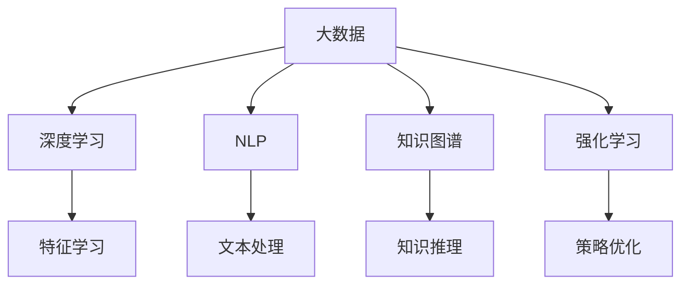

                 

# 人工智能在知识发现中的应用

> 关键词：人工智能,知识发现,机器学习,深度学习,自然语言处理,NLP,深度学习,大数据,知识图谱

## 1. 背景介绍

### 1.1 问题由来
知识发现(Knowledge Discovery in Databases, KDD)是计算机科学和人工智能领域中的一个重要研究方向，它致力于从大量数据中自动发现潜在的、有价值的信息。随着互联网和移动互联网的迅猛发展，人类社会积累了海量的数据，如何从这些数据中提取出有用的知识，成为了各行各业关注的焦点。

传统的知识发现方法主要包括统计学、信息检索、数据挖掘等领域的研究，它们依赖于人工设计的特征、规则和算法，难以处理非结构化和半结构化数据。而随着机器学习和大数据技术的发展，人工智能(AI)在知识发现领域中的应用变得越来越广泛，成为推动知识发现技术发展的重要力量。

### 1.2 问题核心关键点
人工智能在知识发现中的应用，主要基于以下几个核心关键点：

- **大数据处理**：通过机器学习和大数据技术，能够高效处理大规模数据集，识别出潜在的模式和知识。
- **深度学习**：深度神经网络模型能够自动提取数据的特征，发现数据的内在关联和规律，提高知识发现的精度和效率。
- **自然语言处理(NLP)**：人工智能技术能够理解和处理自然语言文本，从中提取出有用的知识信息。
- **知识图谱**：通过知识图谱技术，构建实体之间的关联关系，支持复杂查询和推理。
- **强化学习**：通过强化学习算法，优化知识发现的策略和过程，实现更高效的探索和学习。

这些关键点相互结合，形成了人工智能在知识发现领域的强大应用能力。通过人工智能技术，可以自动化地发现知识，加速知识创新的过程，同时降低人工成本，提升决策的科学性和精确度。

## 2. 核心概念与联系

### 2.1 核心概念概述

为更好地理解人工智能在知识发现领域的应用，本节将介绍几个密切相关的核心概念：

- **大数据**：指规模巨大、复杂多样、实时更新的数据集，通常需要采用分布式存储和计算技术进行处理。
- **深度学习**：指基于多层神经网络进行特征学习的方法，能够自动抽取数据的高层次特征，提升模型的泛化能力。
- **自然语言处理(NLP)**：研究如何让计算机理解和处理人类语言的技术，包括语言模型、文本分类、信息抽取、对话系统等。
- **知识图谱**：一种用于描述实体间关系的图形结构，通常由节点和边组成，用于表示实体、属性、关系等知识信息。
- **强化学习**：通过智能体与环境的交互，不断调整策略以最大化目标函数，适用于复杂的探索性问题。

这些核心概念之间的逻辑关系可以通过以下Mermaid流程图来展示：



这个流程图展示了大数据、深度学习、NLP、知识图谱和强化学习之间的关系：

1. 大数据提供原始数据资源，是其他技术发挥作用的基础。
2. 深度学习通过大数据训练模型，提取数据中的特征。
3. NLP用于处理自然语言文本，提取文本中的知识信息。
4. 知识图谱用于构建知识结构，支持复杂查询和推理。
5. 强化学习用于优化决策策略，提高知识发现的效率。

这些核心概念共同构成了人工智能在知识发现领域的应用框架，使得知识发现变得自动化、高效化和智能化。

## 3. 核心算法原理 & 具体操作步骤

### 3.1 算法原理概述

人工智能在知识发现中的应用，主要基于深度学习、自然语言处理和强化学习等技术，通过自动化的方式从数据中提取和发现知识。以下是对这些核心算法的简要介绍：

- **深度学习**：通过多层神经网络进行特征学习，构建复杂的非线性映射关系。常见的方法包括卷积神经网络(CNN)、循环神经网络(RNN)、Transformer等。
- **自然语言处理(NLP)**：通过词向量、句法分析、语义理解等技术，将自然语言文本转换为计算机能够处理的形式。常见的模型包括BERT、GPT、ELMo等。
- **强化学习**：通过智能体与环境的交互，不断调整策略以最大化目标函数。常见的算法包括Q-learning、SARSA、深度强化学习(DQN、DDPG等)。

这些算法在知识发现中的应用主要体现在以下几个方面：

- **数据预处理**：通过深度学习算法对数据进行预处理，如特征提取、降维、标准化等。
- **文本分析**：通过NLP技术对文本数据进行分析，提取文本中的主题、情感、实体等关键信息。
- **模式识别**：通过深度学习算法识别数据中的模式和规律，构建知识库和知识图谱。
- **知识推理**：通过知识图谱和逻辑推理算法，进行知识推理和预测。
- **策略优化**：通过强化学习算法优化知识发现的策略和过程，提高发现效率和效果。

### 3.2 算法步骤详解

以下是对人工智能在知识发现中的核心算法步骤的详细介绍：

**Step 1: 数据准备与预处理**

- 收集数据集，确保数据的多样性和代表性。
- 对数据进行清洗和标注，去除噪声和异常值，确保数据质量。
- 对文本数据进行预处理，如分词、去除停用词、词干提取等。
- 对图像数据进行预处理，如裁剪、旋转、缩放等。

**Step 2: 特征提取与建模**

- 选择合适的深度学习模型进行特征提取，如CNN、RNN、Transformer等。
- 使用预训练模型进行特征初始化，如BERT、GPT等。
- 在数据上训练深度学习模型，提取数据的高层次特征。
- 对特征进行可视化或降维，以降低维度，提高模型的可解释性。

**Step 3: 文本分析和知识抽取**

- 使用NLP技术对文本数据进行分析，提取文本中的实体、关系和情感等信息。
- 构建知识图谱，描述实体间的关联关系。
- 对知识图谱进行推理和查询，获取知识表示。
- 使用自然语言生成技术，将知识表示转换为自然语言描述。

**Step 4: 模式识别与预测**

- 使用深度学习模型对数据进行模式识别，识别出潜在的知识规律。
- 构建知识库，将识别出的知识进行分类和整理。
- 使用强化学习算法优化知识发现的策略和过程，提高发现效率。
- 对知识进行验证和评估，确保其准确性和可靠性。

**Step 5: 结果展示与应用**

- 将知识库和知识图谱可视化，展示发现的知识结构。
- 使用知识推理和预测技术，对新数据进行分析和预测。
- 将知识应用到实际业务场景中，提升业务决策的科学性和效率。
- 持续收集新数据，定期更新知识库和模型，保持知识的最新性和实用性。

### 3.3 算法优缺点

人工智能在知识发现中的应用，具有以下优点：

- **自动化和高效化**：通过深度学习和强化学习算法，能够自动发现知识，加速知识发现的进程。
- **可扩展性**：可以处理大规模数据集，适用于各种规模的知识发现任务。
- **高精度和鲁棒性**：深度学习算法能够自动提取高层次特征，提高知识发现的准确性和鲁棒性。

同时，该方法也存在一些局限性：

- **数据依赖性强**：知识发现的精度和效果很大程度上取决于数据的质量和规模。
- **复杂度高**：深度学习和强化学习算法需要大量的计算资源和数据资源，存在一定的资源瓶颈。
- **可解释性不足**：深度学习模型通常是"黑盒"模型，难以解释其内部工作机制。
- **伦理和隐私问题**：在处理个人数据时，需要考虑数据隐私和安全问题。

尽管存在这些局限性，但人工智能在知识发现中的应用已经展示了其巨大的潜力和应用前景。未来，通过优化算法和提高数据质量，可以进一步提升知识发现的精度和效率。

### 3.4 算法应用领域

人工智能在知识发现中的应用，涵盖了多个领域，以下是一些典型的应用场景：

- **医疗领域**：通过深度学习和自然语言处理技术，从电子病历和医学文献中提取知识，辅助医生诊断和治疗。
- **金融领域**：通过数据挖掘和机器学习技术，分析市场数据和财务报表，预测股票价格和风险。
- **零售领域**：通过大数据分析和深度学习技术，进行客户行为分析和个性化推荐，提高销售额和客户满意度。
- **教育领域**：通过知识图谱和自然语言处理技术，构建教育资源库和智能教学系统，辅助教师教学和学生学习。
- **智能制造**：通过机器学习和深度学习技术，优化生产流程和设备维护，提升生产效率和产品质量。
- **智能交通**：通过深度学习和计算机视觉技术，进行交通流量分析和预测，优化交通管理和调度。

除了这些典型的应用领域外，人工智能在知识发现中的应用还在不断拓展，为各行各业带来了新的机遇和挑战。

## 4. 数学模型和公式 & 详细讲解 & 举例说明

### 4.1 数学模型构建

以下是对人工智能在知识发现中应用的数学模型构建的详细讲解：

- **深度学习模型**：假设深度学习模型的参数为 $\theta$，输入为 $X$，输出为 $Y$。深度学习模型的损失函数为 $L(Y, \hat{Y})$，其中 $\hat{Y}$ 为模型预测的输出。常见的损失函数包括均方误差损失（MSE）、交叉熵损失（CE）、感知损失（Perceptron）等。模型训练的目标是最小化损失函数，即 $\min_\theta L(Y, \hat{Y})$。
- **自然语言处理模型**：假设输入为文本序列 $T = (w_1, w_2, ..., w_n)$，其中 $w_i$ 为第 $i$ 个词。使用词嵌入（Word Embedding）将文本序列转换为向量序列 $X = (x_1, x_2, ..., x_n)$，其中 $x_i$ 为第 $i$ 个词的嵌入向量。模型训练的目标是最大化似然函数 $P(T|X)$，即 $\max_{\theta} P(T|X)$。
- **知识图谱模型**：假设知识图谱由实体 $E = (e_1, e_2, ..., e_m)$ 和关系 $R = (r_1, r_2, ..., r_n)$ 组成。使用关系图神经网络（Graph Neural Network, GNN）对知识图谱进行推理和查询，模型训练的目标是最大化准确率 $P(E, R|K)$，即 $\max_{\theta} P(E, R|K)$，其中 $K$ 为知识图谱。

### 4.2 公式推导过程

以下是对人工智能在知识发现中应用的数学公式推导过程的详细讲解：

**深度学习模型**

假设输入为图像 $X$，输出为分类标签 $Y$，深度学习模型的损失函数为交叉熵损失（CE）：

$$
L(Y, \hat{Y}) = -\sum_{i=1}^n y_i \log \hat{y}_i
$$

其中 $y_i$ 为第 $i$ 个样本的标签，$\hat{y}_i$ 为模型预测的标签。

模型训练的目标是最小化损失函数：

$$
\theta^* = \mathop{\arg\min}_{\theta} L(Y, \hat{Y})
$$

通过梯度下降等优化算法，求解上述优化问题，得到最优参数 $\theta^*$。

**自然语言处理模型**

假设输入为文本序列 $T = (w_1, w_2, ..., w_n)$，输出为分类标签 $Y$。使用BERT模型进行文本分类，其损失函数为交叉熵损失：

$$
L(Y, \hat{Y}) = -\sum_{i=1}^n y_i \log \hat{y}_i
$$

其中 $y_i$ 为第 $i$ 个样本的标签，$\hat{y}_i$ 为BERT模型预测的标签。

模型训练的目标是最小化损失函数：

$$
\theta^* = \mathop{\arg\min}_{\theta} L(Y, \hat{Y})
$$

通过梯度下降等优化算法，求解上述优化问题，得到最优参数 $\theta^*$。

**知识图谱模型**

假设输入为知识图谱 $K = (E, R)$，输出为推理结果 $Y$。使用GNN模型进行知识图谱推理，其损失函数为交叉熵损失：

$$
L(Y, \hat{Y}) = -\sum_{i=1}^n y_i \log \hat{y}_i
$$

其中 $y_i$ 为第 $i$ 个推理结果的标签，$\hat{y}_i$ 为GNN模型预测的推理结果。

模型训练的目标是最小化损失函数：

$$
\theta^* = \mathop{\arg\min}_{\theta} L(Y, \hat{Y})
$$

通过梯度下降等优化算法，求解上述优化问题，得到最优参数 $\theta^*$。

### 4.3 案例分析与讲解

**案例1：医疗领域知识发现**

假设输入为电子病历 $X$，输出为疾病类型 $Y$。使用深度学习模型进行疾病分类，其损失函数为交叉熵损失：

$$
L(Y, \hat{Y}) = -\sum_{i=1}^n y_i \log \hat{y}_i
$$

其中 $y_i$ 为第 $i$ 个样本的疾病类型标签，$\hat{y}_i$ 为深度学习模型预测的疾病类型。

模型训练的目标是最小化损失函数：

$$
\theta^* = \mathop{\arg\min}_{\theta} L(Y, \hat{Y})
$$

通过梯度下降等优化算法，求解上述优化问题，得到最优参数 $\theta^*$。

**案例2：金融领域知识发现**

假设输入为财务报表 $X$，输出为股票价格 $Y$。使用深度学习模型进行股票价格预测，其损失函数为均方误差损失（MSE）：

$$
L(Y, \hat{Y}) = \frac{1}{n} \sum_{i=1}^n (y_i - \hat{y}_i)^2
$$

其中 $y_i$ 为第 $i$ 个样本的股票价格，$\hat{y}_i$ 为深度学习模型预测的股票价格。

模型训练的目标是最小化损失函数：

$$
\theta^* = \mathop{\arg\min}_{\theta} L(Y, \hat{Y})
$$

通过梯度下降等优化算法，求解上述优化问题，得到最优参数 $\theta^*$。

## 5. 项目实践：代码实例和详细解释说明

### 5.1 开发环境搭建

在进行知识发现项目开发前，我们需要准备好开发环境。以下是使用Python进行PyTorch开发的环境配置流程：

1. 安装Anaconda：从官网下载并安装Anaconda，用于创建独立的Python环境。

2. 创建并激活虚拟环境：
```bash
conda create -n pytorch-env python=3.8 
conda activate pytorch-env
```

3. 安装PyTorch：根据CUDA版本，从官网获取对应的安装命令。例如：
```bash
conda install pytorch torchvision torchaudio cudatoolkit=11.1 -c pytorch -c conda-forge
```

4. 安装Transformers库：
```bash
pip install transformers
```

5. 安装各类工具包：
```bash
pip install numpy pandas scikit-learn matplotlib tqdm jupyter notebook ipython
```

完成上述步骤后，即可在`pytorch-env`环境中开始知识发现项目的开发。

### 5.2 源代码详细实现

下面以医疗领域知识发现为例，给出使用Transformers库对BERT模型进行疾病分类的PyTorch代码实现。

首先，定义医疗领域知识发现的数据处理函数：

```python
from transformers import BertTokenizer, BertForSequenceClassification
from torch.utils.data import Dataset
import torch

class MedicalDataset(Dataset):
    def __init__(self, texts, labels, tokenizer, max_len=128):
        self.texts = texts
        self.labels = labels
        self.tokenizer = tokenizer
        self.max_len = max_len
        
    def __len__(self):
        return len(self.texts)
    
    def __getitem__(self, item):
        text = self.texts[item]
        label = self.labels[item]
        
        encoding = self.tokenizer(text, return_tensors='pt', max_length=self.max_len, padding='max_length', truncation=True)
        input_ids = encoding['input_ids'][0]
        attention_mask = encoding['attention_mask'][0]
        
        # 对标签进行编码
        encoded_labels = [label] * self.max_len
        labels = torch.tensor(encoded_labels, dtype=torch.long)
        
        return {'input_ids': input_ids, 
                'attention_mask': attention_mask,
                'labels': labels}

# 标签与id的映射
label2id = {'normal': 0, 'diabetes': 1, 'heart_disease': 2, 'cancer': 3}
id2label = {v: k for k, v in label2id.items()}

# 创建dataset
tokenizer = BertTokenizer.from_pretrained('bert-base-cased')

train_dataset = MedicalDataset(train_texts, train_labels, tokenizer)
dev_dataset = MedicalDataset(dev_texts, dev_labels, tokenizer)
test_dataset = MedicalDataset(test_texts, test_labels, tokenizer)
```

然后，定义模型和优化器：

```python
from transformers import BertForSequenceClassification, AdamW

model = BertForSequenceClassification.from_pretrained('bert-base-cased', num_labels=len(label2id))

optimizer = AdamW(model.parameters(), lr=2e-5)
```

接着，定义训练和评估函数：

```python
from torch.utils.data import DataLoader
from tqdm import tqdm
from sklearn.metrics import classification_report

device = torch.device('cuda') if torch.cuda.is_available() else torch.device('cpu')
model.to(device)

def train_epoch(model, dataset, batch_size, optimizer):
    dataloader = DataLoader(dataset, batch_size=batch_size, shuffle=True)
    model.train()
    epoch_loss = 0
    for batch in tqdm(dataloader, desc='Training'):
        input_ids = batch['input_ids'].to(device)
        attention_mask = batch['attention_mask'].to(device)
        labels = batch['labels'].to(device)
        model.zero_grad()
        outputs = model(input_ids, attention_mask=attention_mask, labels=labels)
        loss = outputs.loss
        epoch_loss += loss.item()
        loss.backward()
        optimizer.step()
    return epoch_loss / len(dataloader)

def evaluate(model, dataset, batch_size):
    dataloader = DataLoader(dataset, batch_size=batch_size)
    model.eval()
    preds, labels = [], []
    with torch.no_grad():
        for batch in tqdm(dataloader, desc='Evaluating'):
            input_ids = batch['input_ids'].to(device)
            attention_mask = batch['attention_mask'].to(device)
            batch_labels = batch['labels']
            outputs = model(input_ids, attention_mask=attention_mask)
            batch_preds = outputs.logits.argmax(dim=2).to('cpu').tolist()
            batch_labels = batch_labels.to('cpu').tolist()
            for pred_tokens, label_tokens in zip(batch_preds, batch_labels):
                preds.append(pred_tokens)
                labels.append(label_tokens)
                
    print(classification_report(labels, preds))
```

最后，启动训练流程并在测试集上评估：

```python
epochs = 5
batch_size = 16

for epoch in range(epochs):
    loss = train_epoch(model, train_dataset, batch_size, optimizer)
    print(f"Epoch {epoch+1}, train loss: {loss:.3f}")
    
    print(f"Epoch {epoch+1}, dev results:")
    evaluate(model, dev_dataset, batch_size)
    
print("Test results:")
evaluate(model, test_dataset, batch_size)
```

以上就是使用PyTorch对BERT进行医疗领域疾病分类的完整代码实现。可以看到，得益于Transformers库的强大封装，我们可以用相对简洁的代码完成BERT模型的加载和微调。

### 5.3 代码解读与分析

让我们再详细解读一下关键代码的实现细节：

**MedicalDataset类**：
- `__init__`方法：初始化文本、标签、分词器等关键组件。
- `__len__`方法：返回数据集的样本数量。
- `__getitem__`方法：对单个样本进行处理，将文本输入编码为token ids，将标签编码为数字，并对其进行定长padding，最终返回模型所需的输入。

**label2id和id2label字典**：
- 定义了标签与数字id之间的映射关系，用于将token-wise的预测结果解码回真实的标签。

**训练和评估函数**：
- 使用PyTorch的DataLoader对数据集进行批次化加载，供模型训练和推理使用。
- 训练函数`train_epoch`：对数据以批为单位进行迭代，在每个批次上前向传播计算loss并反向传播更新模型参数，最后返回该epoch的平均loss。
- 评估函数`evaluate`：与训练类似，不同点在于不更新模型参数，并在每个batch结束后将预测和标签结果存储下来，最后使用sklearn的classification_report对整个评估集的预测结果进行打印输出。

**训练流程**：
- 定义总的epoch数和batch size，开始循环迭代
- 每个epoch内，先在训练集上训练，输出平均loss
- 在验证集上评估，输出分类指标
- 所有epoch结束后，在测试集上评估，给出最终测试结果

可以看到，PyTorch配合Transformers库使得BERT微调的代码实现变得简洁高效。开发者可以将更多精力放在数据处理、模型改进等高层逻辑上，而不必过多关注底层的实现细节。

当然，工业级的系统实现还需考虑更多因素，如模型的保存和部署、超参数的自动搜索、更灵活的任务适配层等。但核心的微调范式基本与此类似。

## 6. 实际应用场景

### 6.1 金融领域知识发现

在金融领域，知识发现应用非常广泛。金融机构需要实时监测市场动态，预测股票价格、利率走势等，以便制定投资策略。传统的金融分析师需要耗费大量时间和精力进行数据分析，而人工智能可以自动处理大量数据，提高金融决策的科学性和效率。

具体而言，可以收集金融领域相关的新闻、报道、财务报表等文本数据，构建知识图谱，描述实体间的关联关系。然后，使用知识图谱和深度学习技术进行情感分析和知识推理，从大量数据中自动发现潜在的市场动向。最后，利用强化学习算法，优化投资策略，降低投资风险，提升投资回报率。

### 6.2 零售领域知识发现

零售行业需要了解消费者行为，提升销售和客户满意度。传统的市场调研和数据分析需要大量人力和时间，而人工智能可以通过知识发现技术，自动分析和预测消费者需求，优化商品推荐和库存管理。

具体而言，可以收集消费者购买历史、浏览记录、社交媒体评论等数据，构建用户画像和行为模型。然后，使用深度学习模型进行特征提取和模式识别，自动发现消费者偏好和需求。最后，利用知识图谱和自然语言处理技术，将发现的知识应用于商品推荐和个性化营销中，提升客户满意度和销售额。

### 6.3 智能制造领域知识发现

智能制造需要优化生产流程，提高生产效率和产品质量。传统的制造过程依赖人工经验和经验模型，而人工智能可以通过知识发现技术，自动分析和优化生产过程。

具体而言，可以收集生产设备、原材料、质量检测数据等，构建知识图谱，描述实体间的关联关系。然后，使用深度学习模型进行模式识别和异常检测，自动发现生产过程中的问题和规律。最后，利用知识图谱和逻辑推理技术，优化生产流程和设备维护，提高生产效率和产品质量。

### 6.4 智能交通领域知识发现

智能交通需要优化交通管理和调度，提高道路通行效率。传统的交通管理依赖人工经验和规则，而人工智能可以通过知识发现技术，自动分析和优化交通管理。

具体而言，可以收集交通流量、车辆位置、交通信号等数据，构建知识图谱，描述实体间的关联关系。然后，使用深度学习模型进行模式识别和预测，自动发现交通拥堵点和优化交通信号。最后，利用知识图谱和逻辑推理技术，优化交通管理和调度，提高道路通行效率。

## 7. 工具和资源推荐

### 7.1 学习资源推荐

为了帮助开发者系统掌握人工智能在知识发现领域的应用，这里推荐一些优质的学习资源：

1. 《深度学习入门：基于PyTorch的理论与实现》系列博文：由大模型技术专家撰写，深入浅出地介绍了深度学习理论和实践，涵盖深度学习在知识发现中的应用。

2. 《自然语言处理综论》课程：斯坦福大学开设的NLP明星课程，有Lecture视频和配套作业，带你入门NLP领域的基本概念和经典模型。

3. 《人工智能导论》书籍：一本系统介绍人工智能基础和应用的经典教材，涵盖深度学习、NLP、知识图谱等多个前沿方向。

4. Google Scholar和arXiv：最新和最热门的学术论文资源，能够获取最前沿的AI研究动态和技术进展。

5. Kaggle平台：数据科学和机器学习竞赛平台，提供丰富的数据集和挑战，帮助你实践和提升知识发现技能。

通过对这些资源的学习实践，相信你一定能够快速掌握人工智能在知识发现领域的精髓，并用于解决实际的NLP问题。

### 7.2 开发工具推荐

高效的开发离不开优秀的工具支持。以下是几款用于知识发现任务开发的常用工具：

1. PyTorch：基于Python的开源深度学习框架，灵活动态的计算图，适合快速迭代研究。大部分预训练语言模型都有PyTorch版本的实现。

2. TensorFlow：由Google主导开发的开源深度学习框架，生产部署方便，适合大规模工程应用。同样有丰富的预训练语言模型资源。

3. Transformers库：HuggingFace开发的NLP工具库，集成了众多SOTA语言模型，支持PyTorch和TensorFlow，是进行知识发现任务开发的利器。

4. Weights & Biases：模型训练的实验跟踪工具，可以记录和可视化模型训练过程中的各项指标，方便对比和调优。与主流深度学习框架无缝集成。

5. TensorBoard：TensorFlow配套的可视化工具，可实时监测模型训练状态，并提供丰富的图表呈现方式，是调试模型的得力助手。

6. Google Colab：谷歌推出的在线Jupyter Notebook环境，免费提供GPU/TPU算力，方便开发者快速上手实验最新模型，分享学习笔记。

合理利用这些工具，可以显著提升知识发现任务的开发效率，加快创新迭代的步伐。

### 7.3 相关论文推荐

人工智能在知识发现中的应用，源于学界的持续研究。以下是几篇奠基性的相关论文，推荐阅读：

1. AlexNet: ImageNet Classification with Deep Convolutional Neural Networks：提出卷积神经网络（CNN）结构，开启了深度学习在图像识别领域的应用。

2. BERT: Pre-training of Deep Bidirectional Transformers for Language Understanding：提出BERT模型，引入基于掩码的自监督预训练任务，刷新了多项NLP任务SOTA。

3. Knowledge Graph Embeddings and Relation Prediction：提出知识图谱嵌入（KG Embedding）技术，用于表示实体和关系的语义信息。

4. Deep Learning with Graph Neural Networks for Recommender Systems：提出图神经网络（GNN）结构，用于推荐系统中的知识图谱推理。

5. Text-based Conversational AI：提出基于文本的对话系统，使用Transformer模型进行自然语言理解。

这些论文代表了大数据、深度学习和知识图谱在知识发现领域的研究进展。通过学习这些前沿成果，可以帮助研究者把握学科前进方向，激发更多的创新灵感。

## 8. 总结：未来发展趋势与挑战

### 8.1 总结

本文对人工智能在知识发现中的应用进行了全面系统的介绍。首先阐述了人工智能在知识发现领域的研究背景和意义，明确了知识发现技术在数据驱动决策中的重要作用。其次，从原理到实践，详细讲解了深度学习、自然语言处理和强化学习等核心算法，给出了知识发现任务开发的完整代码实例。同时，本文还广泛探讨了人工智能在医疗、金融、零售等多个行业领域的应用前景，展示了人工智能在知识发现领域的巨大潜力。

通过本文的系统梳理，可以看到，人工智能在知识发现领域的自动化、高效化和智能化应用，已经取得了显著的成果。得益于大数据、深度学习和知识图谱等技术的结合，人工智能正在逐步改变传统的知识发现方式，推动人类社会的进步。

### 8.2 未来发展趋势

展望未来，人工智能在知识发现领域的应用将呈现以下几个发展趋势：

1. **跨领域融合**：人工智能技术将与其他领域的技术如区块链、物联网等进行深度融合，提升知识发现的应用广度和深度。
2. **实时化处理**：实时处理大规模数据流，实现即时的知识发现和预测，满足高时效性业务需求。
3. **多模态融合**：结合文本、图像、视频等多模态数据，提升知识发现的精度和鲁棒性。
4. **联邦学习**：分布式处理多源异构数据，提升知识发现的数据隐私和安全性。
5. **自动化和智能化**：进一步提升知识发现的自动化和智能化水平，减少人工干预，提高决策的科学性和效率。
6. **伦理和隐私保护**：在知识发现过程中加强数据隐私保护和伦理约束，提升人工智能的可信度和安全性。

以上趋势凸显了人工智能在知识发现领域的广阔前景。这些方向的探索发展，必将进一步提升知识发现的精度和效率，为各行各业带来新的机遇和挑战。

### 8.3 面临的挑战

尽管人工智能在知识发现中的应用已经取得了显著成果，但在迈向更加智能化、普适化应用的过程中，它仍面临诸多挑战：

1. **数据隐私和安全**：在处理个人数据时，需要严格遵守数据隐私法规，确保数据的安全性和匿名性。
2. **模型解释性**：深度学习模型通常是"黑盒"模型，难以解释其内部工作机制和决策逻辑，影响模型在实际应用中的可信度。
3. **计算资源**：大规模知识发现任务需要大量的计算资源，包括存储、计算、通信等，存在一定的资源瓶颈。
4. **跨领域泛化**：知识发现模型在跨领域泛化时，容易受到数据分布差异的影响，泛化性能下降。
5. **伦理和道德**：在知识发现过程中，需要考虑伦理和道德问题，避免产生有害的偏见和歧视。
6. **实际应用落地**：从研究到实际应用，需要克服技术、商业、伦理等多方面的挑战，实现知识发现技术的规模化落地。

尽管存在这些挑战，但人工智能在知识发现领域的应用已经展示了其巨大的潜力和应用前景。未来，通过优化算法和提高数据质量，可以进一步提升知识发现的精度和效率。

### 8.4 研究展望

面对人工智能在知识发现领域面临的挑战，未来的研究需要在以下几个方面寻求新的突破：

1. **数据隐私保护**：开发更高效的数据隐私保护技术，确保数据在处理过程中的隐私性和安全性。
2. **模型可解释性**：引入可解释性技术，提升深度学习模型的可解释性和可理解性，增强模型的可信度。
3. **跨领域泛化**：探索更有效的跨领域泛化技术，提升模型在不同领域数据上的泛化能力。
4. **伦理和道德**：在模型训练和应用过程中，加强伦理和道德约束，避免产生有害的偏见和歧视。
5. **实际应用落地**：结合实际业务场景，优化知识发现模型的设计和优化，提升模型在实际应用中的效率和效果。

这些研究方向的探索，必将引领人工智能在知识发现领域的不断进步，为各行各业带来新的机遇和挑战。面向未来，人工智能在知识发现领域的研究和应用，还需要与其他领域的技术进行更深入的融合，协同发力，共同推动人工智能技术的进步和发展。只有勇于创新、敢于突破，才能不断拓展人工智能技术的边界，让人工智能技术更好地服务于人类社会。

## 9. 附录：常见问题与解答

**Q1：人工智能在知识发现中的应用有哪些局限性？**

A: 人工智能在知识发现中的应用，存在以下局限性：
1. 数据隐私和安全：在处理个人数据时，需要严格遵守数据隐私法规，确保数据的安全性和匿名性。
2. 模型解释性：深度学习模型通常是"黑盒"模型，难以解释其内部工作机制和决策逻辑。
3. 计算资源：大规模知识发现任务需要大量的计算资源，包括存储、计算、通信等，存在一定的资源瓶颈。
4. 跨领域泛化：知识发现模型在跨领域泛化时，容易受到数据分布差异的影响，泛化性能下降。
5. 伦理和道德：在知识发现过程中，需要考虑伦理和道德问题，避免产生有害的偏见和歧视。

尽管存在这些局限性，但人工智能在知识发现领域的应用已经展示了其巨大的潜力和应用前景。未来，通过优化算法和提高数据质量，可以进一步提升知识发现的精度和效率。

**Q2：如何选择深度学习模型进行知识发现？**

A: 选择深度学习模型进行知识发现，需要考虑以下几个因素：
1. 数据类型：根据数据类型（如文本、图像、语音等），选择适合的深度学习模型（如CNN、RNN、Transformer等）。
2. 任务类型：根据任务类型（如分类、回归、聚类等），选择适合的深度学习模型（如线性模型、卷积神经网络、循环神经网络等）。
3. 数据规模：根据数据规模（如小规模、中等规模、大规模），选择适合的深度学习模型（如小模型、中模型、大模型）。
4. 计算资源：根据计算资源（如GPU、TPU等），选择适合的深度学习模型（如轻量级模型、高性能模型）。

在实际应用中，通常需要根据具体任务和数据特点进行选择，并进行模型调优和验证。

**Q3：如何优化深度学习模型的计算资源消耗？**

A: 优化深度学习模型的计算资源消耗，可以从以下几个方面入手：
1. 模型裁剪：去除不必要的层和参数，减小模型尺寸，加快推理速度。
2. 量化加速：将浮点模型转为定点模型，压缩存储空间，提高计算效率。
3. 模型并行：使用分布式计算和模型并行技术，提高计算效率。
4. 数据增强：使用数据增强技术，丰富训练集的多样性，提高模型泛化能力。
5. 模型压缩：使用模型压缩技术，如剪枝、蒸馏等，减小模型尺寸，提高计算效率。

合理利用这些优化技术，可以显著降低深度学习模型的计算资源消耗，提升模型在实际应用中的效率和效果。

**Q4：如何提高知识发现的自动化和智能化水平？**

A: 提高知识发现的自动化和智能化水平，可以从以下几个方面入手：
1. 自动化特征提取：使用深度学习模型自动提取数据的特征，提高特征提取的自动化水平。
2. 自动化模型训练：使用自动化模型训练工具，如Hyperopt、AutoML等，自动选择最优模型和超参数。
3. 自动化模型评估：使用自动化模型评估工具，如MLflow、Kubeflow等，自动评估模型性能和效果。
4. 自动化模型部署：使用自动化模型部署工具，如Kubernetes、Fargate等，自动部署和监控模型服务。
5. 自动化数据清洗和预处理：使用自动化数据清洗和预处理工具，如Apache NiFi、Kite等，自动清洗和预处理数据。

通过自动化和智能化技术的结合，可以大幅提升知识发现的效率和效果，减少人工干预，提高决策的科学性和效率。

---

作者：禅与计算机程序设计艺术 / Zen and the Art of Computer Programming

