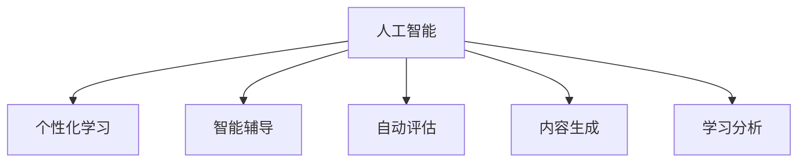

                 

# 人工智能：教育变革的催化剂

## 1. 背景介绍

### 1.1 问题由来
人工智能（AI）技术正迅速渗透到各个领域，而教育领域也不例外。教育是一项复杂且重要的社会任务，其目标不仅是传授知识，更是培养学生的批判性思维和解决问题的能力。然而，传统的教育模式面临着诸多挑战，如资源分配不均、个性化教育难以实现等。AI技术，特别是深度学习和机器学习，为这些挑战提供了创新的解决方案，从而可能引发教育领域的革命性变革。

### 1.2 问题核心关键点
AI在教育领域的应用主要集中在以下几个方面：

- **个性化学习**：AI可以分析学生的学习数据，为每个学生定制个性化的学习计划，提高学习效率和效果。
- **智能辅导**：AI助教能够24/7提供实时反馈和答疑，减轻教师负担，提升教学质量。
- **自动评估**：AI可以自动评估作业和考试，提高评估效率和公平性。
- **内容生成**：AI可以生成教育资源，如教学视频、教材等，丰富教学资源库。
- **学习分析**：AI可以分析学习数据，发现学生学习行为和成果的趋势和模式，指导教学策略优化。

AI在教育领域的应用，有望大幅提升教学质量，推动教育公平，开启个性化学习的新纪元。

## 2. 核心概念与联系

### 2.1 核心概念概述

为更好地理解AI在教育领域的应用，我们首先介绍几个关键概念：

- **人工智能**：指模拟人类智能行为的机器系统，包括机器学习、深度学习等技术。
- **个性化学习**：指根据每个学生的学习习惯、兴趣、能力和进度定制化教学计划和资源。
- **智能辅导**：指AI助教通过自然语言处理和机器学习技术，为学生提供实时、个性化的学习支持和反馈。
- **自动评估**：指使用AI模型自动评估学生的作业和考试，确保评估的客观性和效率。
- **内容生成**：指使用生成对抗网络（GAN）、变分自编码器（VAE）等技术，自动生成教学材料和资源。
- **学习分析**：指利用AI技术分析学生的学习数据，发现学习模式，优化教学策略。

这些概念之间的逻辑关系可以通过以下Mermaid流程图来展示：



这个流程图展示了个体化学习系统与其他AI教育应用之间的联系：

1. 通过人工智能的算法和模型，个性化学习系统可以精准地分析学生的学习行为，生成个性化学习计划。
2. 智能辅导系统可以结合学生当前的学习状态，实时调整教学内容和反馈方式。
3. 自动评估系统可以高效、公平地批改作业和考试，为学生提供及时反馈。
4. 内容生成系统可以不断创造和优化教学资源，丰富教学材料库。
5. 学习分析系统可以深度挖掘学生的学习数据，发现潜在问题和改进方向。

## 3. 核心算法原理 & 具体操作步骤
### 3.1 算法原理概述

AI在教育中的应用，主要基于数据驱动的机器学习和深度学习技术。其核心思想是通过分析大量的学习数据，构建个性化的教学模型，实现智能辅导、自动评估等功能。

具体而言，AI教育系统通常包括以下几个关键步骤：

1. **数据收集与预处理**：收集学生的学习数据，包括成绩、答题时间、点击率、行为数据等，并进行清洗和标准化处理。
2. **特征提取与建模**：从数据中提取有用的特征，构建机器学习或深度学习模型，用于预测学生行为和评估学习效果。
3. **模型训练与优化**：使用标注数据训练模型，并通过交叉验证等技术优化模型参数。
4. **系统集成与应用**：将训练好的模型集成到教学平台中，实现个性化学习、智能辅导等功能。

### 3.2 算法步骤详解

#### 3.2.1 数据收集与预处理

**数据来源**：
- **学习行为数据**：包括学生的点击、阅读、写作、答题等行为数据。
- **成绩数据**：学生的测试成绩、作业评分等。
- **文本数据**：学生的作业、笔记、讨论等文本数据。
- **情感数据**：学生在学习过程中的情绪和反馈。

**数据预处理**：
- **缺失值处理**：填补或删除缺失值，确保数据完整性。
- **数据标准化**：对数值型数据进行标准化处理，便于模型训练。
- **文本清洗**：去除噪声和无用信息，如拼写错误、停用词等。
- **特征提取**：将文本数据转换为模型可处理的数值特征，如词频、TF-IDF、embedding等。

#### 3.2.2 特征提取与建模

**特征提取**：
- **词袋模型**：统计文本中每个词的出现频率。
- **TF-IDF**：计算单词的权重，考虑其在文档和语料库中的重要性。
- **word2vec**：将单词转换为向量表示，捕捉单词之间的语义关系。
- **BERT嵌入**：使用BERT模型对单词进行编码，捕捉上下文语义。

**模型构建**：
- **回归模型**：用于预测学生的成绩和学习进度。
- **分类模型**：用于判断学生的学习状态和能力。
- **序列模型**：用于预测学生未来的学习行为和需求。
- **推荐系统**：用于推荐个性化的学习资源和路径。

#### 3.2.3 模型训练与优化

**模型选择**：
- **线性回归**：用于预测学生成绩和进度。
- **逻辑回归**：用于分类学生的学习状态和能力。
- **RNN/LSTM**：用于预测学生未来的学习行为。
- **协同过滤**：用于推荐学习资源。

**模型训练**：
- **交叉验证**：使用交叉验证技术评估模型性能。
- **正则化**：使用L2正则化防止过拟合。
- **学习率调整**：通过学习率调度策略优化模型训练过程。
- **超参数调优**：使用网格搜索、贝叶斯优化等技术寻找最优参数。

**模型评估**：
- **准确率**：用于评估分类模型的性能。
- **F1-score**：用于评估分类模型的平衡性能。
- **MAE**：用于评估回归模型的预测精度。
- **均方误差**：用于评估回归模型的预测精度。

#### 3.2.4 系统集成与应用

**个性化学习系统**：
- **学习计划生成**：根据学生的历史数据和当前状态，生成个性化学习计划。
- **学习资源推荐**：推荐适合学生的学习材料和活动。
- **学习进度跟踪**：实时监控学生的学习进度和效果。

**智能辅导系统**：
- **自然语言处理**：使用NLP技术理解学生问题，生成回答。
- **实时反馈**：提供即时反馈，纠正错误和提供建议。
- **交互界面**：构建友好的交互界面，支持学生提问和反馈。

**自动评估系统**：
- **自动评分**：自动评分学生的作业和考试。
- **实时反馈**：提供即时反馈，帮助学生改进。
- **成绩分析**：分析学生成绩，发现学习趋势和问题。

**内容生成系统**：
- **视频生成**：自动生成教学视频和演示。
- **教材生成**：自动生成教材和练习题。
- **交互式内容**：创建交互式学习活动和游戏。

**学习分析系统**：
- **学习行为分析**：分析学生的点击、阅读、答题等行为。
- **学习效果评估**：评估学生的学习效果和知识掌握情况。
- **个性化优化**：根据分析结果，优化教学策略和资源。

## 4. 数学模型和公式 & 详细讲解 & 举例说明

### 4.1 数学模型构建

**回归模型**：
- 假设数据集为 $(x_i, y_i)$，其中 $x_i$ 为输入特征，$y_i$ 为输出标签。
- 线性回归模型为 $y_i = \theta_0 + \theta_1x_1 + \ldots + \theta_nx_n$。
- 最小二乘估计法求解 $\theta$：
  $$
  \hat{\theta} = (\mathbf{X}^T\mathbf{X})^{-1}\mathbf{X}^Ty
  $$

**分类模型**：
- 逻辑回归模型为 $P(y_i = 1|x_i) = \frac{1}{1 + e^{-\hat{\theta}^Tx_i}}$。
- 最大似然估计法求解 $\hat{\theta}$：
  $$
  \hat{\theta} = \text{argmin}_{\theta} -\frac{1}{N}\sum_{i=1}^N(y_i\log P(y_i = 1|x_i) + (1-y_i)\log P(y_i = 0|x_i))
  $$

### 4.2 公式推导过程

#### 4.2.1 回归模型

**最小二乘法**：
- 目标函数为 $\sum_{i=1}^N(y_i - \hat{y}_i)^2$。
- 对 $\theta$ 求偏导，得 $2\sum_{i=1}^N(y_i - \hat{y}_i)x_i = 0$。
- 解得 $\hat{\theta} = (\mathbf{X}^T\mathbf{X})^{-1}\mathbf{X}^Ty$。

#### 4.2.2 分类模型

**逻辑回归**：
- 目标函数为 $-\frac{1}{N}\sum_{i=1}^N(y_i\log P(y_i = 1|x_i) + (1-y_i)\log P(y_i = 0|x_i))$。
- 对 $\theta$ 求偏导，得 $\frac{1}{N}\sum_{i=1}^N(y_i - P(y_i = 1|x_i))x_i = 0$。
- 解得 $\hat{\theta} = \text{argmin}_{\theta} -\frac{1}{N}\sum_{i=1}^N(y_i\log P(y_i = 1|x_i) + (1-y_i)\log P(y_i = 0|x_i))$。

### 4.3 案例分析与讲解

**案例1：个性化学习计划生成**

- **数据来源**：学生的历史成绩、答题时间、阅读记录等。
- **特征提取**：提取学生的学习行为特征，如阅读时间、答题次数、正确率等。
- **模型选择**：线性回归模型。
- **训练与优化**：使用历史数据训练模型，通过交叉验证优化超参数。
- **结果展示**：生成每个学生的个性化学习计划，推荐适合的学习资源和活动。

**案例2：智能辅导系统**

- **数据来源**：学生的提问和反馈。
- **特征提取**：提取问题的关键词和意图。
- **模型选择**：自然语言处理模型，如BERT。
- **训练与优化**：使用标注数据训练模型，通过正则化和学习率调整优化模型。
- **结果展示**：实时回答学生问题，提供即时反馈和建议。

## 5. 项目实践：代码实例和详细解释说明

### 5.1 开发环境搭建

进行AI教育系统的开发，需要以下环境：

1. **Python环境**：
   - 安装Python 3.x
   - 安装必要的库，如NumPy、Pandas、Scikit-learn、TensorFlow等。

2. **数据处理工具**：
   - Pandas：用于数据处理和清洗。
   - Scikit-learn：用于特征提取和建模。

3. **深度学习框架**：
   - TensorFlow：用于深度学习模型的构建和训练。
   - PyTorch：用于深度学习模型的构建和训练。

4. **可视化工具**：
   - Matplotlib：用于数据可视化。
   - Seaborn：用于统计图形绘制。

5. **部署工具**：
   - Flask：用于Web应用开发。
   - Docker：用于应用部署和管理。

### 5.2 源代码详细实现

#### 5.2.1 数据预处理

```python
import pandas as pd
from sklearn.preprocessing import StandardScaler

# 加载数据
data = pd.read_csv('data.csv')

# 数据清洗
data = data.dropna()

# 数据标准化
scaler = StandardScaler()
data = scaler.fit_transform(data)

# 特征选择
features = ['feature1', 'feature2', 'feature3']
data = data[features]

# 输出预处理后的数据
print(data)
```

#### 5.2.2 特征提取

```python
from sklearn.feature_extraction.text import TfidfVectorizer

# 创建TF-IDF向量器
vectorizer = TfidfVectorizer()

# 特征提取
X = vectorizer.fit_transform(data['text'])

# 输出特征向量
print(X)
```

#### 5.2.3 模型训练

```python
from sklearn.linear_model import LinearRegression

# 创建线性回归模型
model = LinearRegression()

# 训练模型
model.fit(X, y)

# 输出模型系数
print(model.coef_)
```

#### 5.2.4 系统集成与应用

```python
# 加载训练好的模型
model = joblib.load('model.pkl')

# 预测学生成绩
y_pred = model.predict(X)

# 输出预测结果
print(y_pred)
```

### 5.3 代码解读与分析

**数据预处理**：
- 加载数据并进行清洗，确保数据完整性。
- 使用标准差标准化数据，便于模型训练。
- 选择关键特征，减少噪声干扰。

**特征提取**：
- 使用TF-IDF向量器将文本数据转换为数值特征，捕捉单词的权重和语义关系。

**模型训练**：
- 创建线性回归模型，使用标注数据训练模型。
- 通过交叉验证优化模型参数，确保模型泛化性能。

**系统集成与应用**：
- 加载训练好的模型，用于预测学生成绩。
- 根据预测结果生成个性化学习计划和推荐资源。

## 6. 实际应用场景

### 6.1 个性化学习系统

**应用场景**：
- **智能推荐**：根据学生的学习行为和成绩，推荐适合的学习资源和活动。
- **学习进度跟踪**：实时监控学生的学习进度和效果，提供个性化反馈。

**技术实现**：
- **数据收集**：收集学生的学习数据，包括点击、阅读、答题等行为。
- **特征提取**：提取学生的历史行为特征，如阅读时间、答题次数、正确率等。
- **模型训练**：训练推荐系统模型，使用线性回归或协同过滤算法。
- **系统集成**：将模型集成到学习平台上，实现实时推荐和进度跟踪。

**案例**：
- **Khan Academy**：使用个性化学习系统，根据学生的学习进度和表现，推荐适合的学习材料和活动。

### 6.2 智能辅导系统

**应用场景**：
- **实时答疑**：学生可以通过系统提问，获取即时反馈和建议。
- **学习支持**：系统提供实时答疑、资源推荐和学习建议，支持学生自主学习。

**技术实现**：
- **自然语言处理**：使用BERT等模型理解学生的问题和意图。
- **智能回答**：根据问题生成回答，提供即时反馈。
- **学习记录**：记录学生的提问和反馈，供后续分析和改进。

**案例**：
- **Duolingo**：使用智能辅导系统，提供实时答疑和个性化学习建议。

### 6.3 自动评估系统

**应用场景**：
- **自动评分**：自动评估学生的作业和考试，提供即时反馈。
- **成绩分析**：分析学生的学习效果，发现学习趋势和问题。

**技术实现**：
- **数据收集**：收集学生的作业和考试数据。
- **模型训练**：训练评分模型，使用回归或分类算法。
- **系统集成**：将模型集成到评估系统中，实现自动评分和成绩分析。

**案例**：
- **Turnitin**：使用自动评估系统，提供即时反馈和成绩分析。

## 7. 工具和资源推荐

### 7.1 学习资源推荐

1. **Coursera**：提供深度学习和自然语言处理的课程，涵盖多个AI应用领域。
2. **Kaggle**：提供大量数据集和竞赛，实践AI教育应用。
3. **IEEE Xplore**：收录大量AI领域的研究论文，深入理解前沿技术。
4. **arXiv**：收录最新AI研究论文，跟踪最新研究进展。
5. **GitHub**：搜索和分享AI教育应用的开源代码，加速开发进程。

### 7.2 开发工具推荐

1. **TensorFlow**：开源深度学习框架，支持分布式计算和模型部署。
2. **PyTorch**：开源深度学习框架，灵活的动态计算图，适合研究和实验。
3. **Jupyter Notebook**：交互式编程环境，支持代码编写和数据可视化。
4. **Google Colab**：免费的GPU环境，方便实验和分享代码。
5. **Flask**：轻量级Web框架，用于构建API接口和Web应用。

### 7.3 相关论文推荐

1. **"Personalizing Online Learning Using Neural Collaborative Filtering"**：研究在线学习平台的个性化推荐系统。
2. **"Learning to Predict Data Understanding: A Controlled Study"**：研究学生对学习材料的理解预测模型。
3. **"Fine-Grained Adaptive Educational Experience for Students"**：研究个性化学习体验的设计和实现。
4. **"Adaptive Educational Recommendation System Using Multi-Sensor Data"**：研究多传感器数据的个性化学习推荐系统。
5. **"Assistive Educational Machine Learning Platforms: A Survey"**：综述了多种AI教育应用的现状和未来方向。

## 8. 总结：未来发展趋势与挑战

### 8.1 研究成果总结

1. **个性化学习**：通过AI技术实现个性化学习计划，提升学习效果。
2. **智能辅导**：利用自然语言处理和机器学习技术，提供实时答疑和学习支持。
3. **自动评估**：使用AI模型自动评分作业和考试，提高评估效率和公平性。
4. **内容生成**：使用生成对抗网络和变分自编码器，自动生成教学资源。
5. **学习分析**：通过深度学习分析学习数据，优化教学策略和资源。

### 8.2 未来发展趋势

1. **大规模数据应用**：未来AI教育系统将基于大规模数据集进行训练，提升模型的泛化能力和准确性。
2. **多模态学习**：融合视觉、听觉、文本等多模态数据，增强学习效果。
3. **跨学科整合**：与其他学科的知识和资源进行整合，提升教育的综合性。
4. **自适应学习**：通过实时学习数据分析，动态调整教学策略和资源。
5. **个性化资源**：开发个性化学习资源，满足不同学生的需求。

### 8.3 面临的挑战

1. **数据隐私**：学生数据隐私保护，防止数据泄露和滥用。
2. **公平性**：确保教育资源的公平分配，避免偏见和歧视。
3. **技术门槛**：AI教育技术的高门槛，需要专业人员进行开发和维护。
4. **用户接受度**：用户对AI技术的接受度和适应度，影响推广效果。
5. **数据质量**：高质量标注数据的获取和维护，保障模型性能。

### 8.4 研究展望

1. **隐私保护技术**：研究保护学生隐私的隐私保护技术，如差分隐私、联邦学习等。
2. **公平性算法**：开发公平性算法，确保教育资源的均衡分配。
3. **跨领域知识整合**：探索跨学科知识的整合方法，提升教育的多样性和深度。
4. **实时学习分析**：研究实时学习数据分析方法，动态调整教学策略。
5. **自适应学习系统**：开发自适应学习系统，提升个性化学习的灵活性和效果。

## 9. 附录：常见问题与解答

**Q1：AI在教育领域的应用现状如何？**

A: AI在教育领域的应用已经取得了一些初步成果，如个性化学习系统、智能辅导系统、自动评估系统等。这些技术已经在多个国家、地区的教育实践中得到了应用，显示出良好的效果。但整体上，AI教育还处于起步阶段，仍需进一步探索和优化。

**Q2：AI教育系统需要哪些关键技术支持？**

A: AI教育系统需要以下关键技术支持：
- **数据处理**：数据收集、清洗、标准化等。
- **特征提取**：文本特征提取、行为特征提取等。
- **模型训练**：回归、分类、序列等模型训练。
- **系统集成**：个性化学习、智能辅导、自动评估等系统的集成和应用。

**Q3：AI教育系统的开发难点有哪些？**

A: AI教育系统的开发难点主要包括：
- **数据隐私保护**：确保学生数据隐私和安全。
- **公平性算法**：实现教育资源的公平分配，避免偏见和歧视。
- **技术门槛**：AI技术的高门槛，需要专业人员进行开发和维护。
- **用户接受度**：用户对AI技术的接受度和适应度，影响推广效果。
- **数据质量**：高质量标注数据的获取和维护，保障模型性能。

**Q4：如何提升AI教育系统的用户体验？**

A: 提升AI教育系统的用户体验可以从以下几个方面入手：
- **界面设计**：设计友好、易用的用户界面，提高用户满意度。
- **个性化推荐**：根据用户需求和偏好，推荐合适的学习资源和活动。
- **实时反馈**：提供即时反馈，帮助用户改进学习效果。
- **情感支持**：通过自然语言处理技术，提供情感支持和鼓励。

**Q5：未来AI教育系统的发展方向有哪些？**

A: 未来AI教育系统的发展方向主要包括：
- **大规模数据应用**：基于大规模数据集进行训练，提升模型的泛化能力和准确性。
- **多模态学习**：融合视觉、听觉、文本等多模态数据，增强学习效果。
- **跨学科整合**：与其他学科的知识和资源进行整合，提升教育的综合性。
- **自适应学习**：通过实时学习数据分析，动态调整教学策略和资源。
- **个性化资源**：开发个性化学习资源，满足不同学生的需求。

作者：禅与计算机程序设计艺术 / Zen and the Art of Computer Programming

