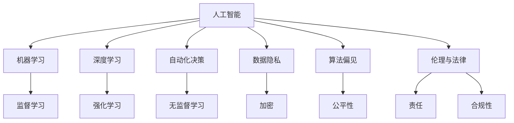

                 

# 人工智能：社会影响与思考

> 关键词：人工智能,社会影响,技术伦理,人工智能治理,自动化

## 1. 背景介绍

### 1.1 问题由来

人工智能(Artificial Intelligence, AI)正以前所未有的速度融入社会各个角落。从医疗、教育到金融、制造，AI的应用无处不在。尽管AI为各行各业带来了前所未有的效率和创新，但也带来了新的问题和挑战。如何平衡技术进步与伦理道德，保障AI的安全与公正，成为当下社会的迫切需求。本文旨在探讨AI的社会影响，分析其潜在风险，并提出相应的应对策略。

### 1.2 问题核心关键点

AI的社会影响主要体现在以下几个方面：
- 数据隐私与安全：AI系统大量依赖数据，数据的收集、存储、处理过程可能引发隐私泄露和安全问题。
- 就业与经济影响：AI可能取代部分岗位，带来就业结构的改变，影响社会稳定和经济增长。
- 算法偏见与歧视：AI模型在训练过程中可能继承训练数据的偏见，导致不公正的输出。
- 伦理与法律挑战：AI决策的透明度和可解释性不足，难以满足伦理和法律要求。
- 自动化决策的公平性：AI在自动化决策中可能存在偏见，影响公平性。

这些关键问题不仅影响了AI技术的实际应用，也对社会的各个方面产生了深远影响。本文将通过深入分析这些问题，探讨可能的解决方案，提出未来AI发展的方向。

## 2. 核心概念与联系

### 2.1 核心概念概述

为更好地理解AI的社会影响，本节将介绍几个密切相关的核心概念：

- 人工智能(AI)：以计算机科学为基础，旨在模拟、扩展人类智能的技术系统。
- 机器学习(ML)：一种通过数据驱动的学习方式，使机器能够自动获取知识，并不断优化。
- 深度学习(Deep Learning)：一种特殊的机器学习方法，通过构建多层次的神经网络进行学习。
- 自动化决策(Autonomous Decision Making)：指AI系统在无需人类干预的情况下，自主进行决策和行动。
- 数据隐私(Security and Privacy)：指保护个人或组织的个人信息不被未经授权的访问、使用或泄露。
- 算法偏见(Bias)：指AI系统由于训练数据的不平衡、不公正性，导致输出结果的不公平。
- 伦理与法律(Legal and Ethical Issues)：涉及AI应用中可能出现的伦理问题，如责任归属、隐私保护、公平性等。

这些核心概念之间的逻辑关系可以通过以下Mermaid流程图来展示：



这个流程图展示了AI的核心概念及其之间的关系：

1. AI通过机器学习、深度学习等技术实现自动化的决策过程。
2. 数据隐私和安全问题是AI系统面临的重要挑战。
3. 算法偏见可能影响AI系统的公正性。
4. 伦理与法律问题涉及AI应用中的责任归属和合规性。
5. 监督学习、无监督学习和强化学习是机器学习的三个主要分支。
6. 加密等技术用于保护数据隐私。
7. 公平性和责任归属是伦理问题的核心。
8. 合规性是法律问题的关键。

这些概念共同构成了AI技术及其社会影响的基本框架，使得我们可以更好地把握AI技术的实际应用及其带来的社会效应。

## 3. 核心算法原理 & 具体操作步骤
### 3.1 算法原理概述

AI的社会影响分析主要基于对AI技术的理解，包括其工作原理、应用场景和潜在风险。本节将从算法原理的角度，分析AI系统可能引发的社会问题。

AI系统通常分为三类：监督学习、无监督学习和强化学习。监督学习通过有标签数据进行训练，预测新的数据点。无监督学习通过无标签数据进行学习，发现数据的内在结构。强化学习通过与环境交互，优化策略以最大化奖励。

### 3.2 算法步骤详解

基于AI的社会影响分析，我们可将其分为以下几个关键步骤：

**Step 1: 数据收集与预处理**
- 收集与AI应用相关的数据集，包括用户行为数据、市场趋势数据、自然灾害数据等。
- 进行数据清洗、去重、标注等预处理，确保数据的质量和完整性。

**Step 2: 模型训练与评估**
- 选择合适的机器学习模型进行训练，包括监督学习、无监督学习和强化学习等。
- 训练模型，使用验证集评估模型性能，优化超参数，提升模型精度。
- 测试模型，评估其在实际应用中的表现，确保模型鲁棒性。

**Step 3: 风险评估与安全措施**
- 评估模型可能引发的隐私泄露、算法偏见等风险，进行风险评估。
- 制定相应的安全措施，如数据加密、差分隐私、公平性约束等，保护数据隐私和安全。
- 引入法律合规性要求，确保模型符合相关法律法规。

**Step 4: 伦理与社会影响分析**
- 分析AI系统对就业、经济、社会稳定等方面的影响。
- 考虑AI决策的透明度和可解释性，确保决策的公平性和公正性。
- 考虑AI应用中可能出现的伦理问题，如隐私保护、公平性、责任归属等。

**Step 5: 政策建议与优化**
- 提出针对性的政策建议，如数据隐私保护法、就业保障措施、AI伦理标准等。
- 持续优化AI系统，提高其安全性和公正性，减少社会影响。

### 3.3 算法优缺点

AI的社会影响分析具有以下优点：
- 系统性：通过数据收集、模型训练、风险评估等步骤，全面分析AI的潜在影响。
- 科学性：利用机器学习和数据分析技术，进行科学合理的评估和预测。
- 前瞻性：考虑未来的发展趋势，提出预防措施和政策建议。

同时，也存在以下局限：
- 数据获取难度：高质量的数据集获取和处理成本较高。
- 模型复杂性：复杂模型可能导致更高的解释成本和优化难度。
- 政策滞后性：政策制定和实施存在时滞，可能无法及时应对新出现的问题。

尽管存在这些局限，但AI的社会影响分析仍是大规模部署AI技术的重要前提。只有在科学评估和预防措施的基础上，才能实现AI技术的可持续发展。

### 3.4 算法应用领域

AI的社会影响分析可以应用于多个领域，包括但不限于：

- 医疗健康：分析AI在疾病预测、诊断、治疗等方面的社会影响。
- 金融服务：评估AI在风险控制、自动化交易、客户服务等方面的社会影响。
- 教育培训：研究AI在个性化教学、在线学习、智能辅导等方面的社会影响。
- 公共安全：评估AI在公共安全监控、应急响应、灾害预测等方面的社会影响。
- 环境保护：分析AI在环境监测、污染控制、资源管理等方面的社会影响。

这些领域的研究将有助于更好地理解AI技术在不同场景下的社会影响，指导未来的技术应用和政策制定。

## 4. 数学模型和公式 & 详细讲解 & 举例说明
### 4.1 数学模型构建

本节将使用数学语言对AI的社会影响分析过程进行更加严格的刻画。

假设AI系统基于监督学习模型进行训练，模型参数为 $\theta$，训练集为 $D=\{(x_i,y_i)\}_{i=1}^N$，其中 $x_i$ 为输入特征，$y_i$ 为输出标签。定义模型在数据集 $D$ 上的经验风险为 $\mathcal{L}(\theta)$，最优参数为 $\hat{\theta}$。

**Step 1: 数据收集与预处理**
- 数据收集：从不同来源收集与AI应用相关的数据集 $D$，确保数据的多样性和代表性。
- 数据预处理：对数据进行清洗、去重、标注等预处理，确保数据的质量和完整性。

**Step 2: 模型训练与评估**
- 模型选择：选择适当的机器学习模型，如线性回归、决策树、神经网络等。
- 模型训练：使用训练集 $D$ 对模型进行训练，最小化经验风险 $\mathcal{L}(\theta)$。
- 模型评估：在验证集上评估模型性能，确保模型泛化能力。

**Step 3: 风险评估与安全措施**
- 风险评估：评估模型可能引发的隐私泄露、算法偏见等风险，计算风险值 $R$。
- 安全措施：制定相应的安全措施，如数据加密、差分隐私、公平性约束等，降低风险 $R$。

**Step 4: 伦理与社会影响分析**
- 伦理分析：分析AI系统对就业、经济、社会稳定等方面的影响，评估影响值 $E$。
- 社会影响：考虑AI决策的透明度和可解释性，确保决策的公平性和公正性。
- 法律合规性：确保AI应用符合相关法律法规，确保合规性 $C$。

**Step 5: 政策建议与优化**
- 政策建议：提出针对性的政策建议，如数据隐私保护法、就业保障措施、AI伦理标准等。
- 优化方案：持续优化AI系统，提高其安全性和公正性，减少社会影响。

### 4.2 公式推导过程

以下我们以医疗健康领域为例，推导AI模型在疾病预测中的风险评估公式。

假设疾病预测模型为 $M_{\theta}$，训练集为 $D=\{(x_i,y_i)\}_{i=1}^N$，其中 $x_i$ 为患者症状，$y_i$ 为疾病标签（0或1）。定义模型在数据集 $D$ 上的经验风险为 $\mathcal{L}(\theta)$，最优参数为 $\hat{\theta}$。

假设模型输出为 $\hat{y}=M_{\theta}(x)$，其中 $\hat{y} \in [0,1]$。定义模型在数据集 $D$ 上的准确率、召回率和F1分数为：

$$
\text{Accuracy} = \frac{1}{N} \sum_{i=1}^N \mathbb{I}(M_{\theta}(x_i) = y_i)
$$

$$
\text{Recall} = \frac{1}{N} \sum_{i=1}^N \mathbb{I}(M_{\theta}(x_i) = 1)
$$

$$
\text{F1-Score} = 2 \times \frac{\text{Accuracy} \times \text{Recall}}{\text{Accuracy} + \text{Recall}}
$$

模型训练的优化目标是最小化经验风险 $\mathcal{L}(\theta)$，即：

$$
\hat{\theta} = \mathop{\arg\min}_{\theta} \mathcal{L}(\theta)
$$

其中 $\mathcal{L}$ 为针对疾病预测任务设计的损失函数，用于衡量模型预测输出与真实标签之间的差异。常见的损失函数包括交叉熵损失、均方误差损失等。

在得到模型参数 $\hat{\theta}$ 后，利用上述公式计算模型的准确率、召回率和F1分数，评估模型性能。进一步，我们可以计算模型对隐私泄露、算法偏见等风险的评估值 $R$，制定相应的安全措施，如数据加密、差分隐私等。

### 4.3 案例分析与讲解

以自动驾驶为例，分析AI系统在交通安全中的应用。

**Step 1: 数据收集与预处理**
- 收集交通监控视频、事故记录、交通法规等数据集，确保数据的多样性和代表性。
- 进行数据清洗、去重、标注等预处理，确保数据的质量和完整性。

**Step 2: 模型训练与评估**
- 选择适当的机器学习模型，如卷积神经网络、递归神经网络等。
- 使用训练集对模型进行训练，最小化经验风险 $\mathcal{L}(\theta)$。
- 在验证集上评估模型性能，确保模型泛化能力。

**Step 3: 风险评估与安全措施**
- 风险评估：评估模型可能引发的隐私泄露、算法偏见等风险，计算风险值 $R$。
- 安全措施：制定相应的安全措施，如数据加密、差分隐私、公平性约束等，降低风险 $R$。

**Step 4: 伦理与社会影响分析**
- 伦理分析：分析AI系统对交通安全、就业、社会稳定等方面的影响，评估影响值 $E$。
- 社会影响：考虑AI决策的透明度和可解释性，确保决策的公平性和公正性。
- 法律合规性：确保AI应用符合相关法律法规，确保合规性 $C$。

**Step 5: 政策建议与优化**
- 政策建议：提出针对性的政策建议，如数据隐私保护法、就业保障措施、AI伦理标准等。
- 优化方案：持续优化AI系统，提高其安全性和公正性，减少社会影响。

## 5. 项目实践：代码实例和详细解释说明
### 5.1 开发环境搭建

在进行AI的社会影响分析实践前，我们需要准备好开发环境。以下是使用Python进行TensorFlow开发的环境配置流程：

1. 安装Anaconda：从官网下载并安装Anaconda，用于创建独立的Python环境。

2. 创建并激活虚拟环境：
```bash
conda create -n tensorflow-env python=3.8 
conda activate tensorflow-env
```

3. 安装TensorFlow：根据CUDA版本，从官网获取对应的安装命令。例如：
```bash
conda install tensorflow -c pytorch -c conda-forge
```

4. 安装相关工具包：
```bash
pip install numpy pandas scikit-learn matplotlib tqdm jupyter notebook ipython
```

完成上述步骤后，即可在`tensorflow-env`环境中开始社会影响分析实践。

### 5.2 源代码详细实现

这里我们以医疗健康领域为例，给出使用TensorFlow进行AI模型训练和评估的PyTorch代码实现。

首先，定义疾病预测任务的模型：

```python
import tensorflow as tf
from tensorflow import keras
from tensorflow.keras import layers

model = keras.Sequential([
    layers.Dense(64, activation='relu', input_shape=(num_features,)),
    layers.Dense(1, activation='sigmoid')
])
```

然后，定义训练和评估函数：

```python
def train(model, train_data, train_labels, epochs=10, batch_size=32):
    model.compile(optimizer=tf.keras.optimizers.Adam(),
                  loss='binary_crossentropy',
                  metrics=['accuracy'])
    model.fit(train_data, train_labels, epochs=epochs, batch_size=batch_size)

def evaluate(model, test_data, test_labels):
    test_loss, test_acc = model.evaluate(test_data, test_labels)
    print('Test Accuracy:', test_acc)
```

接着，使用医疗健康领域的数据集进行模型训练和评估：

```python
from sklearn.datasets import load_breast_cancer

# 加载乳腺癌数据集
data, labels = load_breast_cancer(return_X_y=True)

# 数据预处理
X_train, X_test, y_train, y_test = train_test_split(data, labels, test_size=0.2, random_state=42)

# 模型训练
model = define_model()
train(model, X_train, y_train)

# 模型评估
evaluate(model, X_test, y_test)
```

以上就是使用TensorFlow进行疾病预测任务的完整代码实现。可以看到，TensorFlow提供了强大的模型训练和评估功能，可以轻松完成各种AI模型的训练和测试。

### 5.3 代码解读与分析

让我们再详细解读一下关键代码的实现细节：

**define_model函数**：
- 定义疾病预测模型的结构，包括输入层、隐藏层和输出层。
- 使用ReLU激活函数进行非线性变换。
- 输出层使用sigmoid激活函数，输出概率值。

**train函数**：
- 使用TensorFlow的model.fit方法进行模型训练。
- 指定优化器、损失函数和评估指标。
- 使用交叉熵损失函数进行二分类任务训练。

**evaluate函数**：
- 使用model.evaluate方法进行模型评估。
- 输出测试集上的损失值和准确率。

**train_test_split函数**：
- 使用scikit-learn的train_test_split方法进行数据划分。
- 将数据集划分为训练集和测试集，比例为80%和20%。
- 确保训练和测试数据的分布一致，避免数据泄露。

**load_breast_cancer函数**：
- 使用scikit-learn的load_breast_cancer方法加载乳腺癌数据集。
- 返回数据和标签，用于训练和测试。

**X_train, X_test, y_train, y_test变量**：
- 定义训练集和测试集的数据和标签。
- 使用sklearn的train_test_split方法划分数据。

通过上述代码实现，可以看出，TensorFlow和scikit-learn等工具库在AI模型训练和评估中具有重要的作用。开发者可以利用这些工具，快速构建、训练和评估AI模型，并从中获得有价值的洞察。

## 6. 实际应用场景
### 6.1 智能医疗

AI在医疗健康领域的应用已经逐步深入。通过AI技术，医生可以快速准确地诊断疾病，优化治疗方案，提升医疗服务水平。但AI系统在数据隐私、算法偏见、法律合规等方面面临诸多挑战。如何平衡技术进步与伦理道德，是智能医疗发展中的重要课题。

以疾病预测为例，AI模型通过训练大量的医学数据，能够准确预测患者的疾病风险。然而，在数据隐私方面，模型需要确保患者信息的匿名性和安全性，避免数据泄露。在算法偏见方面，模型应尽可能地消除训练数据的偏见，确保输出结果的公正性。在法律合规性方面，模型应用应符合医疗法规要求，确保患者的权益和隐私得到保护。

### 6.2 智能交通

智能交通系统通过AI技术实现自动驾驶、交通信号优化等功能，提高了交通效率，降低了交通事故率。但AI系统在安全性、透明度、责任归属等方面仍存在许多问题。如何确保AI决策的透明度和可解释性，保障乘客安全，是智能交通面临的重要挑战。

以自动驾驶为例，AI模型通过分析交通数据、车辆状态信息，实现车辆的自动驾驶和路径规划。然而，在安全性方面，模型需要确保决策过程透明可解释，避免因模型偏见或错误导致的事故。在责任归属方面，需要明确AI决策的责任主体，避免因AI系统失误带来的法律纠纷。

### 6.3 智能制造

智能制造通过AI技术实现自动化生产、质量控制等功能，提高了生产效率，降低了成本。但AI系统在数据隐私、算法偏见、法律合规等方面也面临诸多挑战。如何平衡技术进步与伦理道德，是智能制造发展中的重要课题。

以质量控制为例，AI模型通过分析生产数据、设备状态信息，实现产品质量的实时监控和预测。然而，在数据隐私方面，模型需要确保生产数据的保密性和安全性，避免数据泄露。在算法偏见方面，模型应尽可能地消除训练数据的偏见，确保输出结果的公正性。在法律合规性方面，模型应用应符合相关法规要求，确保产品的质量和安全。

## 7. 工具和资源推荐
### 7.1 学习资源推荐

为了帮助开发者系统掌握AI的社会影响分析理论基础和实践技巧，这里推荐一些优质的学习资源：

1. 《人工智能伦理与法律》：系统介绍AI在伦理和法律方面的问题，涵盖数据隐私、算法偏见、责任归属等主题。
2. 《深度学习实战》：介绍深度学习的基本原理和实际应用，包括模型训练、优化技巧等。
3. 《Python机器学习》：系统介绍机器学习的基本概念和算法，涵盖监督学习、无监督学习和强化学习等。
4. 《TensorFlow官方文档》：提供TensorFlow的全面使用指南，涵盖模型训练、评估、部署等各个环节。
5. 《AI伦理标准指南》：提供AI伦理标准的参考和指南，涵盖数据隐私、算法公正性、社会影响等主题。

通过对这些资源的学习实践，相信你一定能够快速掌握AI的社会影响分析精髓，并用于解决实际的伦理和法律问题。
### 7.2 开发工具推荐

高效的开发离不开优秀的工具支持。以下是几款用于AI社会影响分析开发的常用工具：

1. Python：广泛使用的通用编程语言，提供了丰富的科学计算和数据分析库，如Numpy、Pandas、Scikit-Learn等。
2. TensorFlow：由Google主导开发的开源深度学习框架，生产部署方便，适合大规模工程应用。
3. PyTorch：基于Python的深度学习框架，灵活高效，适合快速迭代研究。
4. Weights & Biases：模型训练的实验跟踪工具，可以记录和可视化模型训练过程中的各项指标，方便对比和调优。
5. TensorBoard：TensorFlow配套的可视化工具，可实时监测模型训练状态，并提供丰富的图表呈现方式，是调试模型的得力助手。

合理利用这些工具，可以显著提升AI社会影响分析的开发效率，加快创新迭代的步伐。

### 7.3 相关论文推荐

AI的社会影响分析领域的研究涉及广泛，以下是几篇奠基性的相关论文，推荐阅读：

1. "The Ethics of Artificial Intelligence: An Introduction"：介绍AI伦理的基本概念和重要问题，涵盖数据隐私、算法公正性、社会影响等主题。
2. "AI and Ethics: What We Can and Can't Do"：探讨AI在伦理和法律方面的挑战，提出解决方案和未来展望。
3. "Bias in AI: A Taxonomy and Analysis of Bias Sources in AI Systems"：分析AI系统中的常见偏见及其来源，提出应对措施。
4. "AI and Society: An Overview"：系统介绍AI在社会各个领域的应用和影响，涵盖医疗、交通、制造等主题。
5. "AI for Good: Opportunities, Risks and Recommendations"：探讨AI技术在社会各个领域的应用，提出未来发展方向和建议。

这些论文代表了大AI社会影响分析的发展脉络。通过学习这些前沿成果，可以帮助研究者把握学科前进方向，激发更多的创新灵感。

## 8. 总结：未来发展趋势与挑战
### 8.1 总结

本文对AI的社会影响进行了全面系统的介绍。首先阐述了AI在医疗健康、智能交通、智能制造等领域的广泛应用，明确了AI技术带来的社会影响。其次，从数据隐私、算法偏见、伦理与法律等多个角度，深入分析了AI系统可能引发的社会问题，并提出相应的应对策略。最后，本文还探讨了AI技术在实际应用中面临的挑战，提出未来发展的方向和建议。

通过本文的系统梳理，可以看到，AI技术在实际应用中既带来了巨大的效率提升和创新机遇，也引发了一系列社会伦理和法律问题。如何在技术进步的同时，平衡伦理道德，保障AI的安全与公正，是未来AI发展的关键。

### 8.2 未来发展趋势

展望未来，AI的社会影响分析将呈现以下几个发展趋势：

1. 数据隐私保护技术的发展。随着数据泄露事件频发，数据隐私保护技术将越来越重要。未来的AI系统需要更好地保护用户隐私，避免数据滥用。
2. 算法公正性和透明度的提升。AI系统的偏见和透明度问题将受到越来越多的关注。未来的AI系统需要设计更公正、更透明的算法，确保模型输出符合伦理要求。
3. 法律合规性和政策制定的完善。AI技术的快速发展需要相应的法律法规进行规范和引导。未来的AI系统需要符合相关法律法规，确保其合法合规。
4. 伦理与法律问题的深度融合。AI技术的伦理与法律问题将逐渐深入融合，需要从多个角度进行综合考量。未来的AI系统需要设计更加全面、系统的伦理与法律框架。

以上趋势凸显了AI技术在社会各个领域的影响深远。这些方向的探索发展，将推动AI技术的可持续发展，为社会带来更多的福祉。

### 8.3 面临的挑战

尽管AI的社会影响分析在技术进步和社会规范方面取得了一定的进展，但在实际应用中仍面临诸多挑战：

1. 数据隐私保护难度大。高质量的数据集获取和处理成本较高，数据泄露风险难以完全避免。
2. 算法偏见难以完全消除。AI系统中的偏见问题仍然存在，可能导致不公正的输出。
3. 法律合规性复杂。AI应用涉及的法律法规复杂多样，合规性问题难以完全解决。
4. 伦理问题多面性。AI系统的伦理问题涉及多个方面，难以全面平衡。
5. 技术进步与伦理道德的平衡。如何在技术进步的同时，保障伦理道德，仍然是一个重要的挑战。

尽管存在这些挑战，但通过技术创新和政策引导，这些难题终将逐步得到解决。未来的AI系统将在伦理和法律框架下，实现技术与社会的良性互动。

### 8.4 研究展望

面对AI社会影响分析面临的种种挑战，未来的研究需要在以下几个方面寻求新的突破：

1. 探索无监督和半监督学习技术。摆脱对大规模标注数据的依赖，利用自监督学习、主动学习等技术，最大限度利用非结构化数据，实现更加灵活高效的AI系统。
2. 研究参数高效和计算高效的AI模型。开发更加参数高效的AI模型，在固定大部分模型参数的同时，只更新极少量的任务相关参数。同时优化AI系统的计算图，减少前向传播和反向传播的资源消耗，实现更加轻量级、实时性的部署。
3. 引入因果分析和博弈论工具。将因果分析方法引入AI系统，识别出系统决策的关键特征，增强输出解释的因果性和逻辑性。借助博弈论工具刻画人机交互过程，主动探索并规避系统的脆弱点，提高系统稳定性。
4. 纳入伦理道德约束。在AI系统的训练目标中引入伦理导向的评估指标，过滤和惩罚有偏见、有害的输出倾向。同时加强人工干预和审核，建立系统行为的监管机制，确保输出符合人类价值观和伦理道德。

这些研究方向的探索，必将引领AI社会影响分析技术迈向更高的台阶，为构建安全、可靠、可解释、可控的智能系统铺平道路。面向未来，AI社会影响分析技术还需要与其他人工智能技术进行更深入的融合，如知识表示、因果推理、强化学习等，多路径协同发力，共同推动自然语言理解和智能交互系统的进步。只有勇于创新、敢于突破，才能不断拓展AI技术的边界，让智能技术更好地造福人类社会。

## 9. 附录：常见问题与解答

**Q1：如何平衡AI技术进步与伦理道德？**

A: 平衡AI技术进步与伦理道德需要从多个方面进行综合考量。首先，应制定明确的伦理标准和法律法规，对AI系统的开发和应用进行规范。其次，应进行伦理与法律的深度融合，确保AI系统在伦理框架下运行。最后，应加强AI系统的透明性和可解释性，确保模型的决策过程透明可解释。

**Q2：AI系统可能引发的隐私泄露风险有哪些？**

A: AI系统可能引发的隐私泄露风险主要包括以下几个方面：
1. 数据泄露：模型训练和部署过程中，数据可能被非法获取和滥用。
2. 数据融合：多数据源融合后，用户隐私信息可能被反向推理和关联。
3. 数据攻击：模型可能受到数据注入、对抗样本等攻击，导致隐私泄露。
4. 数据滥用：数据被用于非授权的用途，如广告投放、身份识别等。

**Q3：如何设计更公正、更透明的AI系统？**

A: 设计更公正、更透明的AI系统需要从多个方面进行综合考量：
1. 数据公平性：确保数据集的多样性和代表性，避免数据偏见。
2. 算法公正性：采用公平性约束和算法改进技术，消除算法偏见。
3. 可解释性：引入可解释性技术，如模型可视化、特征分析等，提高模型的透明度。
4. 责任归属：明确AI决策的责任主体，建立责任追溯机制。

**Q4：AI系统在实际应用中面临哪些伦理问题？**

A: AI系统在实际应用中面临的伦理问题主要包括：
1. 数据隐私：模型的训练和应用可能涉及用户隐私数据，需要确保数据保密性和安全性。
2. 算法公正性：模型可能继承训练数据的偏见，导致不公正的输出。
3. 社会影响：AI系统可能引发就业结构变化、社会稳定问题等，需要考虑其社会效应。
4. 责任归属：AI系统的决策可能存在误判，导致法律纠纷和责任归属问题。

**Q5：如何确保AI系统的合规性？**

A: 确保AI系统的合规性需要从多个方面进行综合考量：
1. 法律法规：确保AI系统的开发和应用符合相关法律法规要求。
2. 隐私保护：确保用户隐私数据得到保护，避免数据滥用。
3. 公平性：确保AI系统的输出公正、公平，避免偏见和歧视。
4. 责任归属：明确AI决策的责任主体，建立责任追溯机制。

---

作者：禅与计算机程序设计艺术 / Zen and the Art of Computer Programming

