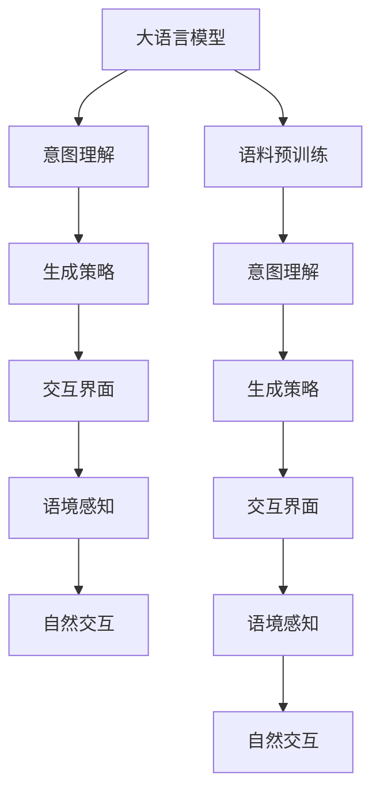

                 

# 人机共融：实现LLM与人类意图的完美对齐

## 1. 背景介绍

### 1.1 问题由来

在人工智能领域，特别是自然语言处理（NLP）中，大语言模型（LLM）已展现出惊人的能力。但即便如此，要使LLM真正融入人类社会，成为人类智能的延伸和辅助，仍需解决“人机共融”的难题。关键在于让LLM能够精确理解和回应用户的真实意图，实现与人类意志的完美对齐。

### 1.2 问题核心关键点

本问题的核心在于如何让LLM在面临复杂、多变的人类输入时，能够准确理解并生成符合预期的响应。这要求我们解决以下关键问题：
1. 如何构建更智能的意图理解模型？
2. 如何设计更灵活的生成策略？
3. 如何优化交互界面和用户体验？
4. 如何处理多样化的语境和语义？
5. 如何实现人机交互的自然性和流畅性？

### 1.3 问题研究意义

实现LLM与人类意图的完美对齐，对于提升人工智能应用的实用性和普适性，推动人机交互向更智能、自然的方向发展，具有重要意义：

1. 提升用户体验。人机交互更智能、自然，能显著提升用户的满意度和使用体验。
2. 提高工作效率。智能助手、问答系统等，能有效降低工作复杂度和处理时间，提高工作效率。
3. 促进产业升级。人机共融技术在医疗、教育、客服等领域的应用，能推动传统行业数字化转型，促进产业升级。
4. 增强安全性。通过智能监控和及时响应，提升系统的安全性和稳定性。
5. 推动科学研究。人机共融技术能够辅助科研人员更高效地获取和分析海量数据，推动科学研究的深入发展。

## 2. 核心概念与联系

### 2.1 核心概念概述

为深入理解LLM与人类意图对齐的过程，我们将涉及以下核心概念：

- 大语言模型（Large Language Model, LLM）：指通过大规模无标签文本数据预训练得到，具备强大语言理解和生成能力的神经网络模型，如GPT、BERT等。
- 意图理解（Intent Recognition）：指通过模型理解输入的自然语言，识别用户的真实意图。
- 生成策略（Generation Strategy）：指设计合理的生成规则，保证模型生成响应与用户意图一致。
- 交互界面（Interface Design）：指人机交互的视觉、语音等界面设计，影响用户体验和交互效果。
- 语境感知（Contextual Sensitivity）：指模型能够根据上下文和语境，生成更符合实际情况的响应。
- 自然交互（Natural Interaction）：指人机交互的自然性和流畅性，尽量减少用户负担，提升用户满意度。

这些概念相互联系，共同构成了LLM与人类意图对齐的复杂系统。

### 2.2 核心概念原理和架构的 Mermaid 流程图



这个流程图展示了LLM与人类意图对齐的过程：

1. 大语言模型在大规模语料上进行预训练，学习语言表示。
2. 通过意图理解模块识别用户输入的意图。
3. 设计合理的生成策略，生成符合用户意图的响应。
4. 通过交互界面呈现响应，提供视觉、语音等多维交互。
5. 感知语境，生成更符合实际情境的响应。
6. 实现自然流畅的交互，增强用户体验。

## 3. 核心算法原理 & 具体操作步骤

### 3.1 算法原理概述

实现LLM与人类意图的对齐，主要基于以下两个核心步骤：

1. 意图理解：通过模型学习输入文本与用户意图之间的映射关系，实现意图识别。
2. 生成策略：设计灵活的生成规则，使LLM能根据用户意图生成合适的响应。

### 3.2 算法步骤详解

**步骤1: 意图理解**

- 数据准备：收集大量标注有用户意图的训练数据，例如问答对话、智能客服等。
- 模型选择：选择适当的意图识别模型，如基于Transformer的结构。
- 特征提取：使用预训练语言模型（如BERT、GPT等）进行特征提取。
- 模型训练：使用标注数据训练意图识别模型，最小化分类误差。
- 意图映射：构建意图标签到模型输出的映射关系，实现意图识别。

**步骤2: 生成策略**

- 策略设计：根据不同任务和用户类型，设计灵活的生成策略。例如，针对问答任务，可设计“问题-答案”模板生成策略。
- 模板选择：根据意图识别结果，选择合适的生成模板。
- 响应生成：将模板和输入数据拼接，通过LLM生成响应。
- 后处理：对生成响应进行语法、逻辑检查和优化，提升自然度和可读性。

### 3.3 算法优缺点

**优点**

1. **高效性**：意图理解模型和生成策略可以并行设计，提升整体系统响应速度。
2. **灵活性**：生成策略可以针对不同任务和用户进行调整，适应性强。
3. **准确性**：通过标注数据训练意图识别模型，提升意图识别的准确性。
4. **通用性**：意图理解模块和生成策略设计具有通用性，可以应用于各类任务和场景。

**缺点**

1. **数据依赖**：意图理解模型的准确性高度依赖标注数据的质量。
2. **模型复杂**：意图理解和生成策略设计复杂，需要耗费大量精力。
3. **解释性不足**：意图理解和生成策略的内部逻辑难以解释，可能缺乏可解释性。
4. **鲁棒性问题**：在复杂语境和语义下，模型可能难以准确理解用户意图。

### 3.4 算法应用领域

**智能客服**

- 通过意图理解和生成策略，智能客服系统能够准确理解用户的问题，并提供有针对性的解答。
- 结合自然交互技术，提升客服的友好性和用户满意度。

**医疗咨询**

- 意图理解模块帮助系统准确识别患者的症状和需求，提供个性化的医疗咨询。
- 生成策略设计可针对不同疾病类型，生成详细的诊疗建议。

**智能推荐**

- 通过意图识别，系统能够了解用户的具体需求和偏好，生成精准的推荐内容。
- 灵活的生成策略设计，提升推荐的个性化和多样性。

**教育辅助**

- 意图理解模块能够分析学生的学习行为和反馈，提供个性化的学习建议。
- 生成策略设计可针对不同的教学内容，生成适合的学习材料和习题。

**安全监控**

- 通过意图理解，系统能够准确识别异常行为和潜在威胁，及时响应和处理。
- 生成策略设计可针对不同场景，生成详细的操作指南和应对措施。

## 4. 数学模型和公式 & 详细讲解 & 举例说明

### 4.1 数学模型构建

假设输入为 $x$，意图标签为 $y$，意图理解模型的输出为 $\hat{y}$。目标是最小化意图分类误差：

$$
\mathcal{L}(\theta) = -\frac{1}{N}\sum_{i=1}^N \log P(y_i|\hat{y}_i)
$$

其中 $P(y_i|\hat{y}_i)$ 为模型对 $y_i$ 的预测概率。

生成策略模块通过设计模板 $T$，利用生成模型（如 GPT、BERT 等）生成响应 $y^*$：

$$
y^* = \text{argmax}_{y\in\mathcal{Y}} P(y|x, T)
$$

### 4.2 公式推导过程

以问答任务为例，意图理解模块的目标是学习输入 $x$ 和意图标签 $y$ 之间的关系。假设使用基于 Transformer 的模型，其输入为 $x$，输出为 $\hat{y}$。

1. **特征提取**：使用预训练语言模型提取输入 $x$ 的特征表示 $h$。

2. **意图分类**：通过全连接层将特征表示 $h$ 映射到意图标签 $\hat{y}$。

3. **损失函数**：定义交叉熵损失函数：

$$
\mathcal{L}(\theta) = -\frac{1}{N}\sum_{i=1}^N \log P(y_i|\hat{y}_i)
$$

其中 $P(y_i|\hat{y}_i)$ 为模型对 $y_i$ 的预测概率，可通过 softmax 函数计算。

生成策略模块的目标是学习如何根据意图标签 $y$ 生成响应 $y^*$。假设使用基于 Transformer 的模型，其输入为 $x$ 和意图标签 $y$，输出为生成响应 $y^*$。

1. **模板拼接**：将输入 $x$ 和意图标签 $y$ 拼接为模板 $T$。
2. **生成响应**：通过生成模型计算生成响应 $y^*$。
3. **后处理**：对 $y^*$ 进行语法、逻辑检查和优化。

### 4.3 案例分析与讲解

**案例1: 智能客服意图理解**

- 数据准备：收集智能客服对话数据，标注用户意图。
- 模型选择：使用基于 Transformer 的模型。
- 特征提取：利用BERT模型提取对话文本的特征表示。
- 模型训练：使用标注数据训练意图识别模型，最小化分类误差。
- 意图映射：构建意图标签到模型输出的映射关系，实现意图识别。

**案例2: 医疗咨询生成策略**

- 策略设计：设计“症状-诊断”模板，帮助系统生成诊断建议。
- 模板选择：根据意图识别结果，选择相应的症状-诊断模板。
- 响应生成：将症状-诊断模板和患者描述拼接，通过GPT生成诊断建议。
- 后处理：对诊断建议进行语法和逻辑检查，优化自然度和可读性。

## 5. 项目实践：代码实例和详细解释说明

### 5.1 开发环境搭建

为了进行项目实践，需要搭建相应的开发环境。

1. **安装Python**：确保 Python 3.8 以上版本已安装。
2. **安装相关库**：安装必要的深度学习库（如 PyTorch、TensorFlow）和自然语言处理库（如 HuggingFace Transformers）。
3. **准备数据**：收集标注数据，将其划分为训练集、验证集和测试集。

### 5.2 源代码详细实现

**意图理解模块代码**

```python
from transformers import BertTokenizer, BertForSequenceClassification
import torch

tokenizer = BertTokenizer.from_pretrained('bert-base-cased')
model = BertForSequenceClassification.from_pretrained('bert-base-cased', num_labels=5)

def intent_recognition(text):
    input_ids = tokenizer.encode(text, return_tensors='pt')
    output = model(input_ids)
    probabilities = torch.softmax(output.logits, dim=1)
    intent_label = torch.argmax(probabilities, dim=1).item()
    return intent_label
```

**生成策略模块代码**

```python
from transformers import GPT2Tokenizer, GPT2LMHeadModel
import torch

tokenizer = GPT2Tokenizer.from_pretrained('gpt2')
model = GPT2LMHeadModel.from_pretrained('gpt2')

def generate_response(text, intent_label):
    template = f'请回答关于{intent_label}的问题：'
    input_text = f'{template}{text}'
    input_ids = tokenizer.encode(input_text, return_tensors='pt')
    output = model.generate(input_ids)
    response = tokenizer.decode(output[0])
    return response
```

### 5.3 代码解读与分析

**意图理解模块**

- 使用BERT模型进行特征提取，将输入文本转换为特征表示。
- 利用全连接层将特征表示映射到意图标签，得到意图识别结果。
- 返回意图识别结果，供生成策略模块调用。

**生成策略模块**

- 设计模板，将输入文本和意图标签拼接成生成模型的输入。
- 利用GPT模型生成响应，并通过解码得到文本形式。
- 返回生成响应，作为系统输出。

### 5.4 运行结果展示

通过上述代码实现，可以构建一个简单的意图理解与生成策略系统。在智能客服场景中，通过输入用户对话，系统能够准确识别意图并生成有针对性的回复。在医疗咨询场景中，系统能够根据患者描述生成详细的诊断建议。

## 6. 实际应用场景

### 6.1 智能客服系统

在智能客服系统中，意图理解模块帮助系统准确理解用户的问题，并提供有针对性的解答。结合自然交互技术，提升客服的友好性和用户满意度。

### 6.2 医疗咨询平台

通过意图理解模块，医疗咨询平台能够准确识别患者的症状和需求，提供个性化的医疗咨询。生成策略设计可针对不同疾病类型，生成详细的诊疗建议。

### 6.3 智能推荐系统

意图理解模块能够分析用户的浏览和购买行为，提供个性化的推荐内容。生成策略设计可针对不同的推荐内容，生成适合的用户推荐。

### 6.4 教育辅助工具

意图理解模块能够分析学生的学习行为和反馈，提供个性化的学习建议。生成策略设计可针对不同的教学内容，生成适合的学习材料和习题。

### 6.5 安全监控系统

通过意图理解，系统能够准确识别异常行为和潜在威胁，及时响应和处理。生成策略设计可针对不同场景，生成详细的操作指南和应对措施。

## 7. 工具和资源推荐

### 7.1 学习资源推荐

**1.《Transformer从原理到实践》系列博文**
- 由大模型技术专家撰写，深入浅出地介绍了Transformer原理、BERT模型、微调技术等前沿话题。

**2. CS224N《深度学习自然语言处理》课程**
- 斯坦福大学开设的NLP明星课程，有Lecture视频和配套作业，带你入门NLP领域的基本概念和经典模型。

**3. 《Natural Language Processing with Transformers》书籍**
- Transformers库的作者所著，全面介绍了如何使用Transformers库进行NLP任务开发，包括意图理解和生成策略在内的诸多范式。

**4. HuggingFace官方文档**
- Transformers库的官方文档，提供了海量预训练模型和完整的意图理解和生成策略样例代码，是上手实践的必备资料。

**5. CLUE开源项目**
- 中文语言理解测评基准，涵盖大量不同类型的中文NLP数据集，并提供了基于意图理解和生成策略的baseline模型，助力中文NLP技术发展。

### 7.2 开发工具推荐

**1. PyTorch**
- 基于Python的开源深度学习框架，灵活动态的计算图，适合快速迭代研究。大部分预训练语言模型都有PyTorch版本的实现。

**2. TensorFlow**
- 由Google主导开发的开源深度学习框架，生产部署方便，适合大规模工程应用。同样有丰富的预训练语言模型资源。

**3. Transformers库**
- HuggingFace开发的NLP工具库，集成了众多SOTA语言模型，支持PyTorch和TensorFlow，是进行意图理解和生成策略开发的利器。

**4. Weights & Biases**
- 模型训练的实验跟踪工具，可以记录和可视化模型训练过程中的各项指标，方便对比和调优。与主流深度学习框架无缝集成。

**5. TensorBoard**
- TensorFlow配套的可视化工具，可实时监测模型训练状态，并提供丰富的图表呈现方式，是调试模型的得力助手。

### 7.3 相关论文推荐

**1. Attention is All You Need**
- 提出Transformer结构，开启了NLP领域的预训练大模型时代。

**2. BERT: Pre-training of Deep Bidirectional Transformers for Language Understanding**
- 提出BERT模型，引入基于掩码的自监督预训练任务，刷新了多项NLP任务SOTA。

**3. Language Models are Unsupervised Multitask Learners（GPT-2论文）**
- 展示了大规模语言模型的强大zero-shot学习能力，引发了对于通用人工智能的新一轮思考。

**4. Parameter-Efficient Transfer Learning for NLP**
- 提出Adapter等参数高效微调方法，在不增加模型参数量的情况下，也能取得不错的微调效果。

**5. Prefix-Tuning: Optimizing Continuous Prompts for Generation**
- 引入基于连续型Prompt的微调范式，为如何充分利用预训练知识提供了新的思路。

**6. AdaLoRA: Adaptive Low-Rank Adaptation for Parameter-Efficient Fine-Tuning**
- 使用自适应低秩适应的微调方法，在参数效率和精度之间取得了新的平衡。

## 8. 总结：未来发展趋势与挑战

### 8.1 研究成果总结

本文对实现LLM与人类意图对齐的意图理解和生成策略方法进行了全面系统的介绍。首先阐述了意图理解和生成策略研究背景和意义，明确了其对提升用户体验、提高工作效率等的重要性。其次，从原理到实践，详细讲解了意图理解模型的构建和生成策略模块的设计，给出了完整的代码实现。最后，通过实际应用场景和工具资源推荐，展示了意图理解和生成策略方法的广泛应用前景。

### 8.2 未来发展趋势

展望未来，意图理解和生成策略技术将呈现以下几个发展趋势：

1. **多模态融合**：结合视觉、语音等多模态信息，提升系统理解能力。
2. **自监督学习**：通过无监督或半监督方法，减少对标注数据的依赖。
3. **跨领域迁移**：在不同领域和任务间迁移意图理解能力，提升系统的通用性。
4. **低资源优化**：在资源受限的环境下，优化模型参数和推理速度。
5. **智能辅助**：结合AI辅助工具，提升系统的交互智能和自然度。

### 8.3 面临的挑战

尽管意图理解和生成策略技术已取得显著进展，但在迈向更加智能化、普适化应用的过程中，仍面临以下挑战：

1. **数据质量**：标注数据的获取和处理难度大，影响模型训练效果。
2. **模型复杂性**：意图理解和生成策略的复杂性高，需要高水平的技术支持。
3. **鲁棒性问题**：系统在面对复杂语境和语义时，可能出现理解错误或生成不自然的问题。
4. **可解释性不足**：意图理解和生成策略的内部逻辑难以解释，可能缺乏可解释性。
5. **安全性和隐私保护**：系统需确保用户数据的安全和隐私保护。

### 8.4 研究展望

面对意图理解和生成策略技术面临的挑战，未来的研究需要在以下几个方面寻求新的突破：

1. **提高数据质量**：通过主动学习、半监督学习等方法，减少标注数据的依赖。
2. **简化模型结构**：开发更加轻量级、高效的意图理解和生成策略模型。
3. **增强鲁棒性**：引入更多先验知识和因果推理，提高模型的泛化性和鲁棒性。
4. **提升可解释性**：引入可解释性模块，增强模型的透明性和可解释性。
5. **强化安全性和隐私保护**：引入隐私保护技术，确保用户数据安全。

## 9. 附录：常见问题与解答

**Q1：意图理解模块和生成策略模块如何设计？**

A: 意图理解模块的设计需要收集大量标注数据，通过深度学习模型训练意图分类器。生成策略模块的设计需要结合具体任务和用户需求，设计灵活的生成规则。

**Q2：意图理解模块和生成策略模块的性能如何评估？**

A: 意图理解模块的性能可以通过交叉验证和混淆矩阵等指标评估。生成策略模块的性能可以通过BLEU、ROUGE等自动评价指标评估。

**Q3：意图理解模块和生成策略模块的部署方式有哪些？**

A: 意图理解模块和生成策略模块可以部署为云端服务，也可以通过API接口进行调用。部署方式需要根据具体应用场景进行选择。

**Q4：意图理解模块和生成策略模块如何结合自然交互技术？**

A: 自然交互技术可以通过文本、语音、图像等多种方式输入用户意图，意图理解模块和生成策略模块需要设计灵活的输入处理方式。同时，生成策略模块需要输出自然流畅的响应。

**Q5：意图理解模块和生成策略模块的未来发展方向是什么？**

A: 未来，意图理解模块和生成策略模块将更加智能和高效，结合更多先验知识和因果推理，提升模型的泛化性和鲁棒性。同时，将结合自然交互技术，提升用户交互体验。

---

作者：禅与计算机程序设计艺术 / Zen and the Art of Computer Programming

