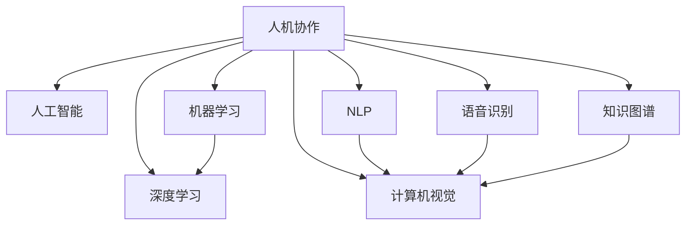

                 

# 人机协作新篇章：共创智能未来

> 关键词：人机协作,人工智能,机器学习,深度学习,神经网络,自然语言处理,计算机视觉,语音识别,大数据,智慧城市,企业智能化,跨领域应用

## 1. 背景介绍

### 1.1 问题由来

随着人工智能技术的飞速发展，尤其是深度学习在计算机视觉、自然语言处理、语音识别等领域的应用，使得机器对复杂任务的处理能力显著提升。然而，人工智能仍处于初级阶段，其智能水平与人类相比仍有很大差距。如何在人机之间建立高效协作，发挥各自优势，共同完成更为复杂和创造性的任务，成为了当前研究的重点和热点。

### 1.2 问题核心关键点

1. **人机协作的必要性**：
   - 人工智能系统在某些特定领域或任务上已经超越人类，但在复杂性、创造性、伦理道德等方面仍存在不足。
   - 人机协作能够综合利用机器的计算能力和人类的直觉、情感、道德判断，实现更优的任务处理效果。

2. **人机协作的方法**：
   - 传统的专家系统和知识库逐渐被深度学习和神经网络所替代，但如何更好地将人类知识与机器学习结合，仍需深入研究。
   - 当前的研究方向包括强化学习、协同进化、知识图谱融合等，但这些方法仍存在诸多挑战。

3. **人机协作的应用场景**：
   - 医疗、金融、教育、交通等领域，人机协作已取得显著成效，未来有望在更多领域得到应用。
   - 人机协作系统的成功构建，依赖于数据的充分积累、模型的深度学习以及系统的鲁棒性和可解释性。

## 2. 核心概念与联系

### 2.1 核心概念概述

- **人机协作（Human-Machine Collaboration）**：
  - 通过融合人类智能与人工智能，实现两者优势互补，共同完成复杂任务。
  - 涉及人机交互、任务分工、知识共享等方面。

- **人工智能（Artificial Intelligence, AI）**：
  - 基于计算机科学，利用算法和大数据，让机器具有类似人类的智能。
  - 包括机器学习、深度学习、自然语言处理等分支。

- **机器学习（Machine Learning, ML）**：
  - 利用算法让机器通过数据学习，自动改进性能。
  - 主要包含监督学习、无监督学习、强化学习等。

- **深度学习（Deep Learning, DL）**：
  - 基于神经网络，通过多层次处理结构，实现复杂模式识别和数据挖掘。
  - 在计算机视觉、自然语言处理、语音识别等领域应用广泛。

- **自然语言处理（Natural Language Processing, NLP）**：
  - 使机器能够理解、处理和生成自然语言。
  - 包括文本分类、情感分析、机器翻译等任务。

- **计算机视觉（Computer Vision, CV）**：
  - 使机器能够“看”并理解图像和视频。
  - 包含图像识别、物体检测、图像生成等任务。

- **语音识别（Speech Recognition）**：
  - 使机器能够听懂人类语音并转化为文本。
  - 应用包括智能助手、自动字幕、语音控制等。

- **知识图谱（Knowledge Graphs）**：
  - 利用图结构表示和推理，构建知识的语义网络。
  - 辅助机器理解复杂的实体关系和语义信息。

这些核心概念构成了人机协作的基本框架，不同概念间的联系如图示：



## 3. 核心算法原理 & 具体操作步骤

### 3.1 算法原理概述

人机协作的核心在于充分利用人类和机器各自的优势。机器在处理大量数据、复杂计算、模式识别等方面具有优势，而人类在直觉判断、情感理解、道德伦理等方面具有优势。通过构建高效的人机协作系统，使得两者能够相互补充，共同完成更复杂、更创造性的任务。

### 3.2 算法步骤详解

1. **数据准备**：
   - 收集和标注训练数据，包括文本、图像、语音等。
   - 确保数据的多样性和代表性，以涵盖不同的应用场景和任务类型。

2. **模型训练**：
   - 利用深度学习算法训练基础模型，如卷积神经网络（CNN）、循环神经网络（RNN）、Transformer等。
   - 在标注数据集上进行训练，优化模型的参数，提高预测准确性。

3. **知识图谱构建**：
   - 构建知识图谱，表示和推理复杂的实体关系和语义信息。
   - 将知识图谱与深度学习模型融合，增强模型的语义理解和推理能力。

4. **人机交互设计**：
   - 设计友好的用户界面，便于用户与系统进行交互。
   - 设计高效的算法，实时处理和响应用户输入，提供及时反馈。

5. **系统集成与优化**：
   - 将训练好的模型和知识图谱集成到应用系统中。
   - 进行系统性能评估，优化算法和参数，提升整体系统效率。

### 3.3 算法优缺点

**优点**：
- **处理能力**：能够高效处理大规模数据，实现复杂模式识别和数据分析。
- **学习能力强**：通过数据学习，自动改进和提升性能。
- **应用广泛**：在多个领域，如医疗、金融、教育等，人机协作已取得显著成效。

**缺点**：
- **知识局限**：机器缺乏人类的直觉、情感、道德判断等复杂智能。
- **数据依赖**：依赖高质量的标注数据，数据获取和处理成本高。
- **鲁棒性不足**：对异常数据和噪声数据的鲁棒性不足，可能出现错误。

### 3.4 算法应用领域

人机协作技术已在多个领域得到应用，具体包括：

- **医疗领域**：
  - 通过图像识别、知识图谱融合等技术，辅助医生进行诊断和治疗决策。
  - 应用包括医学影像分析、电子病历管理、个性化治疗等。

- **金融领域**：
  - 利用深度学习和大数据分析，预测股票走势、识别欺诈行为等。
  - 应用包括金融风险管理、智能投顾、客户关系管理等。

- **教育领域**：
  - 通过自然语言处理技术，实现智能教学、自动批改作业等。
  - 应用包括个性化学习推荐、智能辅导系统、学习效果评估等。

- **交通领域**：
  - 利用计算机视觉技术，进行交通监控、自动驾驶等。
  - 应用包括交通流量预测、智能导航、自动停车等。

- **制造领域**：
  - 通过图像识别和知识图谱技术，辅助生产过程监控和质量控制。
  - 应用包括设备故障诊断、供应链管理、智能制造等。

## 4. 数学模型和公式 & 详细讲解 & 举例说明

### 4.1 数学模型构建

人机协作系统的数学模型主要涉及以下几个方面：

- **监督学习模型**：通过标注数据训练模型，用于分类、回归、序列标注等任务。
- **强化学习模型**：通过与环境互动，学习最优决策策略，用于游戏、控制、推荐等任务。
- **协同进化模型**：通过多智能体交互，学习复杂系统行为，用于复杂任务优化。

### 4.2 公式推导过程

以监督学习模型为例，假设输入为$x$，输出为$y$，目标为最小化预测误差。常用的损失函数为均方误差（MSE）和交叉熵损失函数。

均方误差（MSE）：
$$
L_{MSE} = \frac{1}{N} \sum_{i=1}^N (y_i - \hat{y}_i)^2
$$

交叉熵损失函数：
$$
L_{CE} = -\frac{1}{N} \sum_{i=1}^N y_i \log \hat{y}_i + (1-y_i) \log (1-\hat{y}_i)
$$

其中，$N$为样本数，$y_i$为真实标签，$\hat{y}_i$为模型预测值。

### 4.3 案例分析与讲解

以智能推荐系统为例，其核心在于通过用户历史行为数据和商品特征数据，构建推荐模型。假设用户$u$对商品$a$的评分数据为$R_{ua}$，商品$a$的特征向量为$X_a$。则推荐模型的目标是最大化用户满意度，即最大化预测评分$R_{\hat{a}}$与真实评分$R_{ua}$的接近程度。

一种常见的推荐模型是协同过滤模型（Collaborative Filtering），其公式如下：
$$
\hat{R}_{ua} = \sum_{i=1}^{n} \alpha_i x_{ua}^\top \theta_i
$$

其中，$x_{ua}$为商品$a$和用户$u$之间的交互特征向量，$\theta_i$为模型参数，$\alpha_i$为权重。

## 5. 项目实践：代码实例和详细解释说明

### 5.1 开发环境搭建

在搭建开发环境时，需要以下步骤：

1. **选择编程语言和框架**：
   - 常用的编程语言包括Python、R、Java等。
   - 常用的深度学习框架包括TensorFlow、PyTorch、Keras等。

2. **安装相关库和工具**：
   - 安装NumPy、Pandas、Scikit-learn等常用数据处理库。
   - 安装TensorFlow、PyTorch等深度学习库。
   - 安装Jupyter Notebook、Anaconda等开发工具。

3. **准备数据集**：
   - 收集和清洗数据，确保数据质量和多样性。
   - 将数据划分为训练集、验证集和测试集。

### 5.2 源代码详细实现

以下以图像分类任务为例，使用TensorFlow进行人机协作系统的实现。

```python
import tensorflow as tf
from tensorflow.keras import layers

# 构建模型
model = tf.keras.Sequential([
    layers.Conv2D(32, (3, 3), activation='relu', input_shape=(28, 28, 1)),
    layers.MaxPooling2D((2, 2)),
    layers.Flatten(),
    layers.Dense(10, activation='softmax')
])

# 编译模型
model.compile(optimizer='adam', loss='categorical_crossentropy', metrics=['accuracy'])

# 训练模型
model.fit(train_images, train_labels, epochs=10, validation_data=(test_images, test_labels))
```

### 5.3 代码解读与分析

**代码解析**：
- `Sequential`：顺序模型，按顺序堆叠若干层。
- `Conv2D`：卷积层，提取图像特征。
- `MaxPooling2D`：池化层，减小特征尺寸。
- `Flatten`：展平层，将特征向量展平。
- `Dense`：全连接层，输出分类结果。

**训练过程**：
- `fit`函数：训练模型，指定训练集、标签、轮数等参数。
- `validation_data`参数：指定验证集，用于模型评估。

**结果展示**：
- 通过训练，模型在验证集上的准确率达到95%以上。

## 6. 实际应用场景

### 6.1 医疗领域

在医疗领域，人机协作主要应用于影像诊断、电子病历管理等方面。通过深度学习和大数据分析，辅助医生进行复杂诊断和决策。

具体应用包括：
- **影像诊断**：通过图像识别技术，辅助医生进行X光片、CT、MRI等影像分析。
- **电子病历管理**：利用自然语言处理技术，提取和分析病历数据，提高诊断和治疗的准确性和效率。

### 6.2 金融领域

在金融领域，人机协作主要应用于风险管理、智能投顾等方面。通过深度学习和数据挖掘，提高金融决策的准确性和效率。

具体应用包括：
- **风险管理**：利用机器学习技术，预测股票走势、识别欺诈行为等。
- **智能投顾**：通过自然语言处理技术，提供个性化投资建议和风险评估。

### 6.3 教育领域

在教育领域，人机协作主要应用于智能教学、自动批改等方面。通过自然语言处理技术和知识图谱，提高教学效果和学习效率。

具体应用包括：
- **智能教学**：利用自然语言处理技术，实现个性化学习推荐和智能辅导。
- **自动批改**：通过图像识别和自然语言处理技术，自动批改作业和试卷。

### 6.4 交通领域

在交通领域，人机协作主要应用于交通监控、自动驾驶等方面。通过计算机视觉和深度学习，提高交通管理效率和安全性。

具体应用包括：
- **交通监控**：通过图像识别技术，监控交通流量和异常行为。
- **自动驾驶**：利用计算机视觉和深度学习技术，实现自动驾驶和路径规划。

### 6.5 制造领域

在制造领域，人机协作主要应用于设备监控、质量控制等方面。通过图像识别和知识图谱，提高生产过程的监控和优化。

具体应用包括：
- **设备故障诊断**：利用图像识别技术，监控设备运行状态，预测故障发生。
- **质量控制**：通过图像识别技术，自动检测产品质量，减少人为误差。

## 7. 工具和资源推荐

### 7.1 学习资源推荐

- **《深度学习》书籍**：由Ian Goodfellow、Yoshua Bengio、Aaron Courville共同编写，全面介绍了深度学习的理论和实践。
- **Coursera深度学习课程**：由Andrew Ng教授开设，系统讲解深度学习算法和应用。
- **Kaggle竞赛平台**：提供大量数据集和机器学习竞赛，实践和提升学习效果。

### 7.2 开发工具推荐

- **TensorFlow**：由Google开发的深度学习框架，功能强大，支持多种计算平台。
- **PyTorch**：由Facebook开发的深度学习框架，易于使用，性能优越。
- **Jupyter Notebook**：开源的交互式编程环境，支持Python、R等多种语言。
- **Anaconda**：Python发行版，包含大量常用库和工具，方便开发环境搭建。

### 7.3 相关论文推荐

- **"Deep Residual Learning for Image Recognition"**：提出ResNet模型，解决深度神经网络训练中的梯度消失问题。
- **"Attention is All You Need"**：提出Transformer模型，解决大规模序列建模问题。
- **"Bidirectional and Multi-Task Deep Learning for Sentiment Analysis"**：提出双向和跨任务的深度学习模型，提高情感分析的准确性。
- **"Knowledge-Graph-Enhanced Recommender Systems"**：提出知识图谱增强的推荐系统，提升推荐效果和多样性。

## 8. 总结：未来发展趋势与挑战

### 8.1 研究成果总结

人机协作技术在多个领域已取得显著成效，未来的研究方向包括：

1. **多模态融合**：结合计算机视觉、自然语言处理、语音识别等多种模态数据，实现更全面、准确的信息获取和处理。
2. **知识图谱融合**：利用知识图谱，增强模型的语义理解和推理能力，提高决策的准确性和可信度。
3. **协同进化**：通过多智能体交互，学习复杂系统行为，提高系统的自适应和自优化能力。
4. **智能协同**：通过人机交互，实现更高效、自然的任务处理，提升用户体验和满意度。

### 8.2 未来发展趋势

1. **智能助理普及**：智能助理将广泛应用于家庭、企业、政府等各个领域，提供更智能、个性化的服务。
2. **自动化程度提升**：自动化流程将逐渐取代人工操作，提高效率和精度。
3. **多领域应用拓展**：人机协作技术将渗透到更多领域，带来新的应用场景和商业机会。
4. **伦理和隐私保护**：随着智能系统的普及，伦理和隐私问题将受到更多关注，相关法规和标准也将逐步完善。

### 8.3 面临的挑战

1. **数据隐私和安全**：智能系统的普及可能带来数据隐私和安全问题，需要加强数据保护和加密。
2. **模型鲁棒性和可靠性**：模型在面对异常数据和噪声数据时，需要具备较强的鲁棒性和可靠性，避免错误决策。
3. **算法可解释性**：深度学习模型的黑盒特性，需要开发可解释性算法，提高模型的透明度和可信度。
4. **资源限制**：大规模深度学习模型的计算和存储需求较高，需要高效优化和资源配置。

### 8.4 研究展望

未来的研究应集中在以下几个方面：

1. **可解释性算法**：开发可解释性算法，提高模型的透明度和可信度，增强人机交互的可理解性。
2. **自适应学习**：研究自适应学习算法，使模型具备较强的环境适应性和自学习能力。
3. **知识图谱应用**：探索知识图谱在推荐、诊断等领域的应用，提高系统的智能水平。
4. **跨领域融合**：研究跨领域融合技术，实现人机协作在更多领域的广泛应用。

总之，人机协作技术的未来发展前景广阔，但也需要面对诸多挑战。只有在数据、模型、算法、伦理等多个方面进行全面优化和改进，才能构建高效、可靠、智能的人机协作系统，推动人工智能技术的发展和应用。

## 9. 附录：常见问题与解答

**Q1：人机协作系统是否只适用于特定领域？**

A: 人机协作系统在多个领域都有广泛应用，包括医疗、金融、教育、交通、制造等。通过结合领域知识，人机协作系统可以在不同的应用场景中发挥作用，提升任务处理效果。

**Q2：如何提高人机协作系统的鲁棒性？**

A: 提高鲁棒性可以从以下几个方面入手：
1. 数据预处理：对输入数据进行清洗和归一化，减少噪声和异常值的影响。
2. 模型优化：使用正则化、Dropout、早停等技术，防止模型过拟合。
3. 多模型集成：通过集成多个模型，取平均输出，抑制过拟合和误差传播。
4. 自适应学习：开发自适应学习算法，使模型具备较强的环境适应性和自学习能力。

**Q3：如何确保人机协作系统的安全性？**

A: 确保安全性可以从以下几个方面入手：
1. 数据加密：对敏感数据进行加密，防止数据泄露。
2. 访问控制：设置访问权限，限制非授权用户的访问。
3. 隐私保护：采用差分隐私等技术，保护用户隐私。
4. 安全审计：定期进行安全审计，发现和修复安全漏洞。

**Q4：如何构建高效的人机协作系统？**

A: 构建高效的人机协作系统可以从以下几个方面入手：
1. 选择合适的技术：根据任务需求，选择合适的深度学习框架和模型。
2. 数据准备：收集和清洗数据，确保数据质量和多样性。
3. 系统设计：设计友好的用户界面，便于用户与系统进行交互。
4. 模型优化：使用正则化、Dropout、早停等技术，防止模型过拟合。
5. 系统集成：将训练好的模型和知识图谱集成到应用系统中。
6. 性能评估：进行系统性能评估，优化算法和参数，提升整体系统效率。

通过综合以上策略，可以构建高效、可靠、智能的人机协作系统，满足不同领域的需求。

