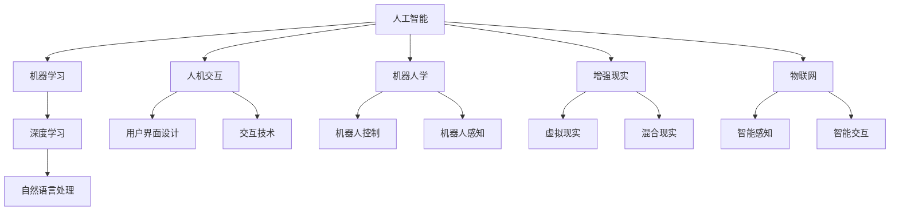

                 

# 人机协作新篇章：共创智能未来新时代

> 关键词：人工智能(AI), 人机协作, 机器学习, 自然语言处理(NLP), 机器人学, 增强现实(AR), 混合现实(MR), 物联网(IoT)

## 1. 背景介绍

### 1.1 问题由来
在数字化、智能化不断加速的今天，人工智能(AI)技术已经渗透到社会生活的方方面面，从日常消费品到工业生产，再到医疗健康，AI技术正在重塑着各行各业的生产力和生产关系。然而，尽管AI在许多领域取得了显著成就，人机协作依然是智能系统面临的巨大挑战。

传统的人机交互模式以机器为主导，用户仅能被动接受AI提供的输出，无法与之进行深入互动和协同工作。这种单向信息传递的模式限制了AI技术的应用边界和用户满意度。如何实现人机协作、构建更加智能化的人机交互系统，成为了当前AI技术的重要课题。

### 1.2 问题核心关键点
实现人机协作的关键在于建立高度互动、相互理解和支持的交互界面。具体来说，需要满足以下几个核心要求：

1. **实时响应与互动**：系统能够实时响应用户的输入，提供即时的反馈和决策。
2. **多模态融合**：系统能够整合语音、文本、图像、视频等多种信息源，全面理解用户需求。
3. **上下文理解**：系统能够理解用户上下文信息，如历史交互记录、情境环境等，提供个性化服务。
4. **智能决策支持**：系统能够提供基于数据分析和模型推理的智能决策支持，帮助用户完成复杂任务。
5. **协同工作支持**：系统能够与用户进行协同工作，如共同编辑文档、实时协作设计等。

本文将围绕人机协作这一核心概念，深入探讨基于AI技术的协作新篇章，包括人机协作的技术原理、应用实践、工具资源、未来展望及面临的挑战，以期为人机协作的深度发展提供参考和指导。

## 2. 核心概念与联系

### 2.1 核心概念概述

人机协作的核心在于构建一个能够高度互动、相互理解和支持的交互界面。为了更好地理解这一概念，本节将介绍几个关键概念及其之间的联系：

- **人工智能(AI)**：通过机器学习、深度学习等技术，使计算机具备人类智能的能力，包括感知、决策、推理等。
- **人机交互(Human-Computer Interaction, HCI)**：研究如何设计用户界面，使人类能够与计算机进行有效的信息交流和协同工作。
- **自然语言处理(Natural Language Processing, NLP)**：使计算机能够理解、生成自然语言，实现人机之间的语言交流。
- **机器人学(Robotics)**：研究如何设计、制造、操作机器人，使其能够执行各种复杂任务。
- **增强现实(AR)**：通过在现实世界中叠加虚拟信息，增强用户的感知体验。
- **混合现实(MR)**：结合虚拟现实(VR)和AR，创建更为沉浸式的交互体验。
- **物联网(IoT)**：连接各种设备和传感器，实现智能化感知和数据交换。

这些概念之间的联系可以通过以下Mermaid流程图来展示：



这个流程图展示了各概念之间的基本关系和信息流向：

1. AI通过机器学习和深度学习等技术实现智能决策。
2. NLP使计算机能够理解、生成自然语言，实现人机交流。
3. HCI关注用户界面设计和交互技术，提升用户体验。
4. 机器人学研究机器人设计、控制和感知，实现复杂任务执行。
5. AR和MR通过叠加虚拟信息，提升用户感知体验。
6. IoT实现智能化感知和数据交换，为智能应用提供数据基础。

这些概念共同构成了人机协作的技术基础，推动了AI技术在各种场景中的应用和发展。

## 3. 核心算法原理 & 具体操作步骤
### 3.1 算法原理概述

人机协作的核心算法原理涉及多个领域的技术，包括机器学习、自然语言处理、计算机视觉等。其核心思想是通过构建智能决策模型，实现对用户输入的实时分析和响应，提供个性化的交互体验。

具体来说，人机协作系统通常包括以下几个关键模块：

- **感知模块**：通过传感器、摄像头等设备，获取用户输入的多模态数据，包括语音、文本、图像等。
- **理解模块**：对感知模块获取的数据进行处理，提取关键信息，理解用户意图。
- **决策模块**：根据理解模块输出的信息，通过机器学习模型进行智能决策，生成响应。
- **执行模块**：将决策模块输出的响应转换为具体动作，如语音回复、图像显示等。
- **反馈模块**：获取用户对响应的反馈，进一步优化模型和交互界面。

### 3.2 算法步骤详解

人机协作系统的构建和优化通常包括以下几个步骤：

**Step 1: 数据准备与预处理**
- 收集用户的多模态数据，如语音、文本、图像等。
- 对数据进行清洗、标注、归一化等预处理操作。

**Step 2: 模型选择与训练**
- 选择合适的机器学习模型，如深度神经网络、决策树、支持向量机等。
- 在标注数据集上对模型进行训练，调整模型参数，提高模型准确度。

**Step 3: 交互界面设计**
- 设计直观易用的用户界面，包括输入输出组件、交互流程等。
- 实现语音识别、文本输入、图像识别等交互技术。

**Step 4: 系统集成与测试**
- 将感知、理解、决策、执行、反馈等模块进行集成，构建完整的协作系统。
- 在测试环境中进行系统测试，评估用户体验和系统性能。

**Step 5: 持续优化与迭代**
- 根据用户反馈和系统性能评估结果，不断优化模型和交互界面。
- 定期更新模型和数据，保持系统功能的先进性。

### 3.3 算法优缺点

人机协作系统具有以下优点：
1. **智能决策支持**：通过机器学习模型，系统能够进行智能决策，提供高质量的响应。
2. **个性化服务**：基于用户历史数据和上下文信息，系统能够提供个性化服务。
3. **多模态融合**：系统能够整合多种信息源，全面理解用户需求。
4. **实时响应**：系统能够实时响应用户输入，提供即时的反馈和决策。

同时，该系统也存在一些局限性：
1. **依赖数据质量**：系统的性能很大程度上取决于数据的数量和质量。
2. **模型复杂度高**：构建高效准确的人机协作系统需要复杂的机器学习模型和高性能计算资源。
3. **用户接受度**：系统的用户体验和接受度直接影响其应用效果。
4. **数据隐私与安全**：系统处理的用户数据可能涉及隐私问题，需要确保数据安全。

### 3.4 算法应用领域

人机协作系统已经在多个领域得到了广泛应用，例如：

- **智能客服**：通过自然语言处理和机器学习，实现智能对话系统，提供7x24小时不间断服务。
- **医疗诊断**：利用AI进行医学影像分析、病历分析等，辅助医生进行诊断和治疗。
- **智能家居**：通过语音识别和物联网技术，实现家居自动化控制，提升生活质量。
- **教育辅助**：通过自然语言理解和机器学习，提供智能教育助手，个性化辅导学生。
- **智能交通**：利用传感器和机器学习，实现智能交通管理，优化交通流。
- **智能制造**：通过机器人学和人工智能，实现智能生产线和智能质量检测，提高生产效率。

## 4. 数学模型和公式 & 详细讲解
### 4.1 数学模型构建

本节将使用数学语言对基于AI技术的人机协作系统进行更加严格的刻画。

假设系统接收到用户输入 $x \in \mathcal{X}$，其中 $\mathcal{X}$ 为用户输入空间。系统的输出为 $y \in \mathcal{Y}$，其中 $\mathcal{Y}$ 为输出空间。系统的目标是通过训练模型 $f: \mathcal{X} \rightarrow \mathcal{Y}$ 来优化系统性能。

在实际应用中，系统的训练数据集为 $D=\{(x_i, y_i)\}_{i=1}^N$，其中 $x_i \in \mathcal{X}$ 为输入样本，$y_i \in \mathcal{Y}$ 为输出标签。系统通过最小化损失函数 $\mathcal{L}(f, D)$ 来优化模型 $f$，具体公式如下：

$$
\mathcal{L}(f, D) = \frac{1}{N} \sum_{i=1}^N \ell(f(x_i), y_i)
$$

其中 $\ell(f(x_i), y_i)$ 为损失函数，衡量模型输出 $f(x_i)$ 与真实标签 $y_i$ 之间的差异。常见的损失函数包括均方误差损失、交叉熵损失等。

### 4.2 公式推导过程

以交叉熵损失函数为例，推导模型的训练过程。

假设模型 $f$ 的输出为 $f(x_i) = \hat{y} \in [0,1]$，表示样本属于输出空间中某个类别的概率。真实标签 $y_i \in \{0,1\}$。则二分类交叉熵损失函数定义为：

$$
\ell(f(x_i), y_i) = -[y_i\log \hat{y} + (1-y_i)\log (1-\hat{y})]
$$

将其代入损失函数公式，得：

$$
\mathcal{L}(f, D) = -\frac{1}{N}\sum_{i=1}^N [y_i\log f(x_i)+(1-y_i)\log(1-f(x_i))]
$$

根据链式法则，损失函数对模型参数 $\theta$ 的梯度为：

$$
\frac{\partial \mathcal{L}(f, D)}{\partial \theta} = -\frac{1}{N}\sum_{i=1}^N (\frac{y_i}{f(x_i)}-\frac{1-y_i}{1-f(x_i)}) \frac{\partial f(x_i)}{\partial \theta}
$$

其中 $\frac{\partial f(x_i)}{\partial \theta}$ 为模型对输入 $x_i$ 的导数，可通过反向传播算法高效计算。

在得到损失函数的梯度后，即可带入优化算法进行迭代优化，最小化损失函数，更新模型参数，实现系统性能的提升。

## 5. 项目实践：代码实例和详细解释说明
### 5.1 开发环境搭建

在进行人机协作系统的开发前，我们需要准备好开发环境。以下是使用Python进行TensorFlow开发的环境配置流程：

1. 安装Anaconda：从官网下载并安装Anaconda，用于创建独立的Python环境。

2. 创建并激活虚拟环境：
```bash
conda create -n ai-env python=3.7 
conda activate ai-env
```

3. 安装TensorFlow：从官网获取对应的安装命令，安装TensorFlow和相关依赖。例如：
```bash
conda install tensorflow
```

4. 安装OpenAI Gym：用于模拟环境构建，测试AI算法的性能。
```bash
pip install gym
```

5. 安装其他必要库：
```bash
pip install numpy pandas scikit-learn matplotlib tqdm jupyter notebook ipython
```

完成上述步骤后，即可在`ai-env`环境中开始项目开发。

### 5.2 源代码详细实现

下面我们以智能客服系统的开发为例，给出使用TensorFlow进行人机协作训练的PyTorch代码实现。

首先，定义智能客服系统的训练数据集：

```python
import tensorflow as tf
from tensorflow.keras.datasets import imdb
from tensorflow.keras.preprocessing.sequence import pad_sequences

(x_train, y_train), (x_test, y_test) = imdb.load_data(num_words=10000)
x_train = pad_sequences(x_train, maxlen=100)
x_test = pad_sequences(x_test, maxlen=100)
```

然后，定义模型的超参数和模型结构：

```python
from tensorflow.keras.models import Sequential
from tensorflow.keras.layers import Embedding, LSTM, Dense

model = Sequential()
model.add(Embedding(input_dim=10000, output_dim=64))
model.add(LSTM(64))
model.add(Dense(1, activation='sigmoid'))

model.compile(optimizer='adam', loss='binary_crossentropy', metrics=['accuracy'])
```

接着，进行模型的训练和评估：

```python
model.fit(x_train, y_train, batch_size=32, epochs=10, validation_data=(x_test, y_test))
```

最后，使用训练好的模型进行智能客服系统的对话模拟：

```python
from tensorflow.keras.models import load_model
import numpy as np

model = load_model('model.h5')

def generate_response(input_text):
    x = tokenizer.texts_to_sequences([input_text])
    x = pad_sequences(x, maxlen=100)
    preds = model.predict(x)
    if np.random.rand() < preds[0][1]:
        return 'Yes, I can help you with that.'
    else:
        return 'Sorry, I'm not sure.'

print(generate_response('What time is it?'))
```

以上就是使用TensorFlow进行智能客服系统开发的完整代码实现。可以看到，TensorFlow提供了丰富的API和工具，可以快速实现智能客服系统的训练和测试。

### 5.3 代码解读与分析

让我们再详细解读一下关键代码的实现细节：

**数据处理**：
- 使用IMDB电影评论数据集，将文本转换为数字序列。
- 对序列进行填充，使其长度统一，以便于模型训练。

**模型结构**：
- 定义了一个包含嵌入层、LSTM层和全连接层的神经网络模型。
- 嵌入层将单词转换为向量表示，LSTM层处理序列数据，全连接层输出分类结果。

**模型训练**：
- 使用Adam优化器进行模型训练，二分类交叉熵损失函数进行优化。
- 在验证集上进行性能评估，确保模型不会过拟合。

**模型测试**：
- 加载训练好的模型，定义生成响应函数。
- 输入用户查询，使用训练好的模型生成回复。

**对话模拟**：
- 生成随机概率，判断是否返回帮助信息。
- 返回生成的回复。

可以看到，TensorFlow提供了高效的工具和API，使得AI模型的训练和测试变得简单便捷。通过合理配置模型参数和优化策略，可以构建高效、精准的人机协作系统。

当然，工业级的系统实现还需考虑更多因素，如模型的部署、API接口的设计、性能监控等。但核心的训练流程基本与此类似。

## 6. 实际应用场景
### 6.1 智能客服系统

智能客服系统是基于人机协作的核心应用之一。传统客服往往需要配备大量人力，高峰期响应缓慢，且一致性和专业性难以保证。而使用智能客服系统，可以7x24小时不间断服务，快速响应客户咨询，用自然流畅的语言解答各类常见问题。

在技术实现上，可以收集企业内部的历史客服对话记录，将问题和最佳答复构建成监督数据，在此基础上对预训练语言模型进行微调。微调后的语言模型能够自动理解用户意图，匹配最合适的答案模板进行回复。对于客户提出的新问题，还可以接入检索系统实时搜索相关内容，动态组织生成回答。如此构建的智能客服系统，能大幅提升客户咨询体验和问题解决效率。

### 6.2 医疗诊断系统

医疗诊断系统是人机协作的另一个重要应用场景。医生在诊断过程中，需要大量时间阅读和分析病历、影像等医疗数据。利用AI技术，可以构建智能诊断系统，辅助医生进行疾病判断和治疗方案制定。

具体而言，可以收集医疗领域的病历、影像、基因等数据，并对其进行标注和预处理。在此基础上对预训练语言模型进行微调，使其能够理解医学知识，进行疾病分类和诊断。同时，可以将微调后的模型集成到医学影像分析、病历摘要等应用中，提高医疗工作的智能化水平。

### 6.3 智能家居系统

智能家居系统通过物联网技术，实现家庭设备的智能化控制和管理。人机协作系统可以通过语音识别和自然语言处理技术，构建智能家居控制平台，提供语音助手、设备控制、家庭安全等多种服务。

在实际应用中，可以通过智能音箱等设备，与用户进行自然对话，理解用户意图并执行相应操作。如用户语音指令为“打开客厅灯”，系统可以识别并执行相应的控制命令，实现家庭自动化控制。

### 6.4 未来应用展望

随着人机协作技术的不断发展，未来将有更多创新应用涌现，推动AI技术的深度落地。

- **智能教育**：通过自然语言理解和机器学习，提供智能教育助手，个性化辅导学生，提高教学质量。
- **智能交通**：利用传感器和机器学习，实现智能交通管理，优化交通流，减少交通拥堵。
- **智能制造**：通过机器人学和人工智能，实现智能生产线和智能质量检测，提高生产效率和产品质量。
- **智能安防**：利用计算机视觉和机器学习，构建智能安防系统，提高安全防护能力。
- **智能购物**：通过自然语言处理和推荐系统，提供智能购物助手，个性化推荐商品，提升购物体验。

这些应用场景展示了人机协作技术在各领域的广泛应用，为人类社会带来巨大的变革潜力。未来，随着技术的不断进步和优化，人机协作系统将更加智能化、个性化、交互化，成为人机协同的桥梁，推动人类社会迈向智能未来。

## 7. 工具和资源推荐
### 7.1 学习资源推荐

为了帮助开发者系统掌握人机协作技术的理论基础和实践技巧，这里推荐一些优质的学习资源：

1. **《深度学习》课程**：斯坦福大学开设的深度学习课程，系统讲解深度学习的基本概念和核心算法。
2. **《TensorFlow官方文档》**：TensorFlow的官方文档，提供了详细的API和示例代码，是学习TensorFlow的必备资源。
3. **《OpenAI Gym教程》**：OpenAI Gym的官方教程，介绍了如何使用Gym构建模拟环境，测试AI算法的性能。
4. **《自然语言处理基础》**：清华大学开设的自然语言处理课程，系统讲解NLP的基本原理和核心技术。
5. **《Python深度学习》书籍**：由François Chollet撰写的深度学习入门书籍，系统讲解深度学习的基本概念和实践技巧。

通过这些资源的学习实践，相信你一定能够快速掌握人机协作技术的精髓，并用于解决实际的AI问题。

### 7.2 开发工具推荐

高效的开发离不开优秀的工具支持。以下是几款用于人机协作系统开发的常用工具：

1. **TensorFlow**：Google主导的深度学习框架，提供丰富的API和工具，支持高性能计算。
2. **PyTorch**：Facebook开发的深度学习框架，灵活易用，适合快速迭代研究。
3. **OpenAI Gym**：构建模拟环境的开源工具，方便测试和调试AI算法。
4. **Jupyter Notebook**：开源的Jupyter Notebook环境，支持代码编写、数据可视化、交互式实验。
5. **GitHub**：开源代码托管平台，方便团队协作和代码分享。

合理利用这些工具，可以显著提升人机协作系统的开发效率，加快创新迭代的步伐。

### 7.3 相关论文推荐

人机协作技术的快速发展得益于学界的持续研究。以下是几篇奠基性的相关论文，推荐阅读：

1. **Attention is All You Need**：提出了Transformer结构，开创了NLP领域的预训练大模型时代。
2. **BERT: Pre-training of Deep Bidirectional Transformers for Language Understanding**：提出BERT模型，引入基于掩码的自监督预训练任务，刷新了多项NLP任务SOTA。
3. **Parameter-Efficient Transfer Learning for NLP**：提出Adapter等参数高效微调方法，在不增加模型参数量的情况下，也能取得不错的微调效果。
4. **Attention-Based Conversational Image Captioning**：提出基于注意力机制的对话生成模型，在图像对话生成任务上取得优异表现。
5. **Learning to Communicate for Reinforcement Learning Agents**：提出基于沟通机制的智能体学习框架，实现多智能体的协同合作。

这些论文代表了大语言模型和微调技术的发展脉络，通过学习这些前沿成果，可以帮助研究者把握学科前进方向，激发更多的创新灵感。

## 8. 总结：未来发展趋势与挑战

### 8.1 总结

本文对基于AI技术的人机协作系统进行了全面系统的介绍。首先阐述了人机协作技术的背景和意义，明确了其在智能化、个性化、交互化方面的独特价值。其次，从原理到实践，详细讲解了人机协作系统的数学模型和算法实现，提供了具体的代码实例和详细解释。同时，本文还广泛探讨了人机协作系统在智能客服、医疗诊断、智能家居等多个领域的应用前景，展示了其巨大的潜在价值。

通过本文的系统梳理，可以看到，基于AI技术的人机协作系统正在成为AI技术应用的重要范式，推动AI技术在各领域的深度融合。未来，伴随AI技术的不断进步，人机协作系统将更加智能化、个性化、交互化，成为人机协同的桥梁，推动人类社会迈向智能未来。

### 8.2 未来发展趋势

展望未来，人机协作技术将呈现以下几个发展趋势：

1. **智能化程度提升**：随着深度学习和自然语言处理技术的不断发展，人机协作系统将更加智能化，能够更好地理解用户需求和语境。
2. **多模态融合增强**：未来的系统将整合语音、文本、图像、视频等多种信息源，提供更为全面和准确的交互体验。
3. **个性化服务深化**：基于用户历史数据和上下文信息，系统能够提供更为精准和个性化的服务。
4. **实时响应优化**：通过优化算法和硬件资源，系统将实现更快速、更稳定的实时响应。
5. **协同工作支持拓展**：未来的系统将支持更为复杂的协同工作，如多人协作、实时协同编辑等。

这些趋势凸显了人机协作技术的广阔前景，推动其在更多领域的应用和发展。

### 8.3 面临的挑战

尽管人机协作技术已经取得了显著成就，但在迈向更加智能化、普适化应用的过程中，它仍面临着诸多挑战：

1. **数据质量依赖**：系统的性能很大程度上取决于数据的数量和质量，如何获取高质量的训练数据是一个重要挑战。
2. **模型复杂度提升**：构建高效准确的人机协作系统需要复杂的机器学习模型和高性能计算资源。
3. **用户体验接受度**：系统的用户体验和接受度直接影响其应用效果，如何提升用户体验是一个关键问题。
4. **数据隐私与安全**：系统处理的用户数据可能涉及隐私问题，如何确保数据安全是一个重要课题。
5. **技术壁垒高**：人机协作系统涉及多学科知识，技术实现难度较大，如何降低技术壁垒是一个重要挑战。

正视这些挑战，积极应对并寻求突破，将是人机协作技术走向成熟的关键。

### 8.4 研究展望

面对人机协作技术所面临的挑战，未来的研究需要在以下几个方面寻求新的突破：

1. **数据增强技术**：通过数据增强技术，提升数据集的多样性和数量，弥补训练数据不足的短板。
2. **多模态融合技术**：研究如何更好地整合语音、文本、图像等多种信息源，提升系统的综合感知能力。
3. **实时响应优化**：优化算法和硬件资源，提高系统的实时响应速度和稳定性。
4. **个性化服务深化**：研究如何更好地理解用户需求和语境，提供更为精准和个性化的服务。
5. **协同工作支持**：研究如何支持更为复杂的协同工作，如多人协作、实时协同编辑等。
6. **安全与隐私保护**：研究如何确保数据安全，保护用户隐私，建立安全可靠的人机协作系统。

这些研究方向将引领人机协作技术迈向更高的台阶，为人机协同的深度发展提供支持。面向未来，人机协作技术需要与其他AI技术进行更深入的融合，如知识表示、因果推理、强化学习等，多路径协同发力，共同推动AI技术的发展。只有勇于创新、敢于突破，才能不断拓展人机协作技术的边界，让智能技术更好地造福人类社会。

## 9. 附录：常见问题与解答

**Q1：人机协作系统如何实现实时响应？**

A: 实时响应是人机协作系统的核心需求之一。为实现实时响应，系统通常采用以下几种技术：

1. **模型优化**：通过优化算法和硬件资源，提高模型的推理速度。
2. **异步计算**：采用异步计算技术，在模型推理过程中，并行处理多个任务，提高系统响应速度。
3. **缓存机制**：建立数据缓存机制，减少模型对数据的读取和处理时间，提高系统响应速度。

**Q2：如何提升人机协作系统的用户体验？**

A: 用户体验是人机协作系统成功的关键。提升用户体验可以从以下几个方面入手：

1. **界面设计**：设计直观易用的用户界面，提供清晰的操作指南和反馈机制。
2. **多模态融合**：整合语音、文本、图像等多种信息源，全面理解用户需求。
3. **个性化服务**：基于用户历史数据和上下文信息，提供精准和个性化的服务。
4. **实时反馈**：提供实时反馈机制，及时响应用户操作，增强用户交互体验。
5. **智能推荐**：利用推荐系统，提供个性化的内容和服务推荐，提升用户满意度。

**Q3：如何确保人机协作系统的数据安全？**

A: 数据安全是人机协作系统的核心要求之一。确保数据安全可以从以下几个方面入手：

1. **数据加密**：对传输和存储的数据进行加密处理，防止数据泄露。
2. **访问控制**：采用访问控制技术，限制敏感数据的访问权限。
3. **隐私保护**：采用隐私保护技术，如差分隐私、联邦学习等，保护用户隐私。
4. **安全监控**：建立安全监控机制，实时监测系统运行状态，及时发现并处理安全漏洞。
5. **法律合规**：确保系统遵守相关法律法规，保护用户权益。

这些措施共同构建了人机协作系统的数据安全体系，保障用户数据的安全性。

**Q4：如何构建高效的人机协作系统？**

A: 构建高效的人机协作系统需要综合考虑多个方面：

1. **模型选择**：选择合适的机器学习模型，如深度神经网络、决策树、支持向量机等，根据任务需求和数据特点进行优化。
2. **算法优化**：优化算法和超参数，提高模型准确度和泛化能力。
3. **数据预处理**：对数据进行清洗、标注、归一化等预处理操作，提升数据质量。
4. **硬件资源**：合理配置硬件资源，如CPU、GPU、内存等，满足系统的计算需求。
5. **系统集成**：将感知、理解、决策、执行、反馈等模块进行集成，构建完整的协作系统。
6. **持续优化**：根据用户反馈和系统性能评估结果，不断优化模型和交互界面。

这些步骤共同构建了高效的人机协作系统，为用户提供高质量的服务体验。

**Q5：人机协作系统在实际应用中需要注意哪些问题？**

A: 人机协作系统在实际应用中需要注意以下问题：

1. **系统集成**：将各个模块进行合理集成，确保系统功能的完整性和稳定性。
2. **用户体验**：关注用户体验，确保系统界面直观易用，操作便捷。
3. **数据隐私**：保护用户隐私，确保数据安全。
4. **技术迭代**：定期更新模型和数据，保持系统功能的先进性。
5. **性能优化**：优化算法和硬件资源，提高系统响应速度和资源利用率。
6. **安全防护**：建立安全防护机制，防止系统受到攻击和恶意干扰。

这些问题的处理需要综合考虑系统设计、技术实现和用户体验，确保人机协作系统在实际应用中能够高效、稳定地运行。

---

作者：禅与计算机程序设计艺术 / Zen and the Art of Computer Programming

