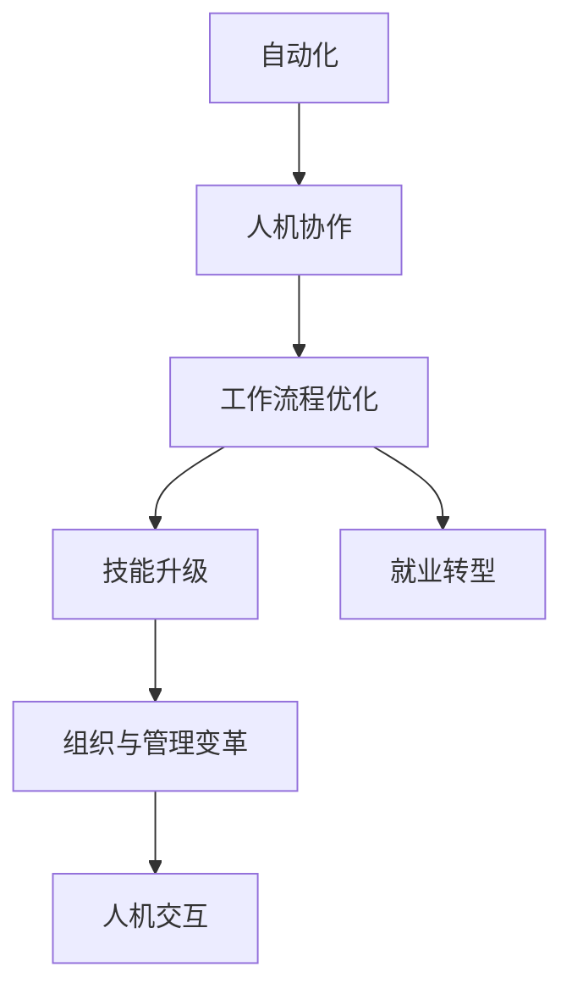

                 

# 人机协作管理：在自动化时代重新定义工作

## 1. 背景介绍

### 1.1 问题由来

在过去的几十年中，自动化技术迅猛发展，已经在制造业、物流、金融等多个行业得到了广泛应用。然而，这些技术大多专注于提高生产效率，自动化水平提升的同时，对人力资源的依赖却有所减轻。许多岗位被机器人和人工智能取代，造成了就业市场的结构性变化，同时也带来了劳动力供需失衡、技能升级等新的问题。

为了应对这些挑战，需要重新思考工作和管理的方式，探索在自动化时代人机协作的新模式，充分利用机器的效率和人的智慧，实现工作的优化与创新。本文旨在探讨如何在自动化时代，通过人机协作管理，重新定义工作。

### 1.2 问题核心关键点

人机协作管理在自动化时代的应用核心关键点如下：

1. **自动化与人工的有机结合**：实现机器与人的互补，使自动化系统能够执行高重复、高风险的任务，而人工负责策略决策、创新与监管。
2. **工作流程优化**：通过数据驱动和AI辅助，优化工作流程，提高生产效率与质量，同时减少人工错误和资源浪费。
3. **人机协同学习**：构建人机协同学习机制，使机器能够不断学习人工作业经验，提升系统的智能化水平。
4. **技能升级与就业转型**：通过人机协作，辅助员工进行技能升级，实现工作岗位的转型和再培训，减少自动化带来的就业冲击。
5. **组织与管理变革**：通过人机协作管理，推动组织结构、管理模式和管理方法的变革，构建新的企业治理框架。

## 2. 核心概念与联系

### 2.1 核心概念概述

为更好地理解人机协作管理在自动化时代的应用，本节将介绍几个密切相关的核心概念：

- **自动化(Automation)**：指使用机器或计算机系统代替人类执行重复性、低技能和危险的工作，以提高效率和准确性。
- **人机协作(Human-Machine Collaboration)**：指通过智能算法、协作工具和通信系统，使人类与机器协同工作，实现优势互补，提升整体绩效。
- **人机交互(Human-Computer Interaction, HCI)**：涉及用户如何与计算机系统进行互动的技术和设计。
- **工作流程优化(Workflow Optimization)**：指通过分析和优化工作流程，消除瓶颈，提高生产效率和质量的过程。
- **技能升级(Skilling Upgrading)**：指通过培训、教育和技术支持，提升员工技能以适应新工作要求的过程。
- **就业转型(Employment Transformation)**：指因技术进步导致的职业结构变化和岗位转型，涉及工作内容、工作方式和职业路径的根本性转变。

这些核心概念之间的逻辑关系可以通过以下Mermaid流程图来展示：



这个流程图展示的核心概念及其之间的关系：

1. 自动化通过提高效率和降低风险，为人机协作提供了基础。
2. 人机协作使机器和人在任务执行、决策制定、数据分析等方面实现互补，提高整体绩效。
3. 工作流程优化通过分析和优化，进一步提升生产效率和质量。
4. 技能升级使员工适应新环境，减少自动化带来的冲击。
5. 就业转型通过岗位转型，重新定义工作内容和要求。
6. 组织与管理变革推动企业治理框架的调整，促进人机协作的实施。

## 3. 核心算法原理 & 具体操作步骤

### 3.1 算法原理概述

在人机协作管理中，核心算法通常涉及以下几个关键步骤：

1. **任务分解与分配**：将复杂任务分解为多个简单子任务，并通过算法分配给不同的自动化系统和人工。
2. **协同决策**：构建协同决策模型，使机器和人在任务执行和策略决策中相互支持。
3. **智能学习**：利用机器学习算法，使系统能够不断学习人工作业经验，提升系统智能化水平。
4. **工作流程优化**：通过数据分析和算法优化，消除工作流程中的瓶颈，提高整体效率。
5. **技能升级与培训**：结合人机协作，设计培训方案，帮助员工掌握新技能，适应新的工作要求。

### 3.2 算法步骤详解

**步骤 1: 任务分解与自动化识别**

- **任务分解**：将复杂的业务流程分解为多个独立且可执行的子任务，如自动化检测、自动化响应、数据处理等。
- **自动化识别**：通过机器学习算法识别出适合自动化的任务，并对其进行自动化处理。

**步骤 2: 协同决策模型构建**

- **协同决策框架设计**：构建协同决策框架，明确自动化系统和人之间的职责和交互方式。
- **决策树与贝叶斯网络**：使用决策树和贝叶斯网络等算法，实现复杂的协同决策过程。

**步骤 3: 智能学习与知识提取**

- **知识提取**：利用NLP和机器学习技术，从历史数据中提取人工作业的知识和经验。
- **模型训练与更新**：使用监督学习或强化学习算法，训练模型以学习新的知识和经验，并不断更新。

**步骤 4: 工作流程优化**

- **数据分析**：收集工作流程中的数据，分析瓶颈和问题。
- **优化算法**：使用遗传算法、模拟退火等优化算法，优化工作流程。

**步骤 5: 技能升级与培训**

- **培训方案设计**：根据岗位要求，设计培训方案，包括在线课程、实践操作等。
- **技能评估与反馈**：使用KPI和绩效指标评估员工技能水平，并及时反馈，帮助其改进。

### 3.3 算法优缺点

人机协作管理算法具有以下优点：

1. **提高效率与质量**：通过自动化和协同决策，提高任务执行效率和质量，减少人为错误。
2. **灵活性与适应性**：能够快速适应新任务和新环境，提供灵活的工作流程和智能决策支持。
3. **知识积累与传承**：通过智能学习，积累和传承人工作业经验，提升系统智能化水平。

但同时，该算法也存在一些缺点：

1. **系统复杂度增加**：需要设计复杂的人机协作框架和优化算法，实施难度较大。
2. **数据依赖性强**：依赖于大量高质量的数据，数据收集和管理成本较高。
3. **技能培训成本高**：员工培训和技能提升需要投入大量时间和资源。
4. **人机冲突风险**：在复杂任务中，人机协同可能引发冲突，影响工作效率。

### 3.4 算法应用领域

人机协作管理算法在多个领域得到了应用，具体如下：

- **制造业**：自动化生产线和智能工厂的建设，实现生产过程的优化与质量控制。
- **物流与仓储**：自动化仓储系统和智能配送网络，提高物流效率与精确度。
- **金融服务**：智能客服和风险管理，提升服务质量和风险控制能力。
- **医疗健康**：智能诊断和辅助决策系统，提高诊断准确性和治疗效果。
- **客户服务**：智能客服和推荐系统，提升客户体验和满意度。
- **市场营销**：智能广告投放和客户行为分析，提高营销效果和用户黏性。

## 4. 数学模型和公式 & 详细讲解 & 举例说明

### 4.1 数学模型构建

在人机协作管理中，常见的数学模型包括决策树、贝叶斯网络、遗传算法等。以决策树为例，我们定义一个决策树模型 $T$，用于协同决策过程。

一个决策树模型 $T$ 由节点和边构成，每个节点表示一个决策点，每个边表示一个决策结果。我们定义决策树模型的结构为：

$$
T = \{N, E\}
$$

其中 $N$ 为节点集，$E$ 为边集。每个节点 $n_i \in N$ 表示一个决策点，包含 $k_i$ 个子节点 $n_{i1}, n_{i2}, ..., n_{ik_i}$。

决策树模型的构建过程如下：

1. 从根节点开始，根据当前节点的属性值，选择最合适的子节点作为下一个决策点。
2. 将数据集划分为多个子集，每个子集对应一个决策结果。
3. 对于每个子集，重复步骤1和步骤2，直到达到终止条件。

### 4.2 公式推导过程

以决策树为例，我们推导决策树模型的构建公式。

设决策树根节点为 $n_1$，包含 $k_1$ 个子节点 $n_{11}, n_{12}, ..., n_{1k_1}$。对于第 $i$ 个子节点，其对应的数据集为 $D_i$，包含 $n_i$ 个数据点。每个数据点 $d_j \in D_i$ 包含 $m$ 个属性值 $a_{j1}, a_{j2}, ..., a_{jm}$。

根据信息熵（entropy）和信息增益（information gain）定义决策树节点的分裂策略：

$$
\text{entropy}(D) = -\sum_{y} \frac{|D_y|}{|D|} \log \frac{|D_y|}{|D|}
$$

其中 $D$ 为数据集，$y$ 为数据集分类，$|D_y|$ 为数据集中属于类别 $y$ 的数据点数量，$|D|$ 为数据集总数量。

$$
\text{information gain}(D, a) = \text{entropy}(D_a) - \sum_{y} \frac{|D_y|}{|D|} \text{entropy}(D_y)
$$

其中 $a$ 为决策属性，$D_a$ 为按照属性 $a$ 划分后的子数据集。

根据信息增益选择最优的属性作为决策点，构建决策树模型。通过递归构建子树，最终形成完整的决策树模型。

### 4.3 案例分析与讲解

以一个简单的自动化仓库管理为例，说明如何构建决策树模型，实现人机协作管理。

假设仓库管理任务包括以下几个环节：入库管理、出库管理、库存盘点、异常处理等。通过对这些环节进行任务分解，使用决策树模型进行协同决策。

**入库管理**：
- **决策属性**：货物类型、货物来源、货物数量等。
- **决策结果**：自动化机械臂、人工搬运等。

**出库管理**：
- **决策属性**：出库数量、出库速度、订单类型等。
- **决策结果**：自动化配送系统、人工补货等。

**库存盘点**：
- **决策属性**：盘点周期、库存量、货物状态等。
- **决策结果**：人工盘点、自动化盘点等。

**异常处理**：
- **决策属性**：异常类型、异常位置、异常原因等。
- **决策结果**：自动化检测系统、人工处理等。

通过构建决策树模型，自动化的仓库管理系统能够根据当前的任务条件，选择最合适的决策路径，提升整体管理效率。

## 5. 项目实践：代码实例和详细解释说明

### 5.1 开发环境搭建

在进行人机协作管理项目的开发前，需要准备好开发环境。以下是使用Python进行PyTorch开发的环境配置流程：

1. 安装Anaconda：从官网下载并安装Anaconda，用于创建独立的Python环境。

2. 创建并激活虚拟环境：
```bash
conda create -n pytorch-env python=3.8 
conda activate pytorch-env
```

3. 安装PyTorch：根据CUDA版本，从官网获取对应的安装命令。例如：
```bash
conda install pytorch torchvision torchaudio cudatoolkit=11.1 -c pytorch -c conda-forge
```

4. 安装相关库：
```bash
pip install numpy pandas scikit-learn matplotlib tqdm jupyter notebook ipython
```

完成上述步骤后，即可在`pytorch-env`环境中开始开发。

### 5.2 源代码详细实现

以下是一个简单的仓库管理自动化系统的代码实现，用于说明人机协作管理的基本流程。

```python
import pandas as pd
from sklearn.tree import DecisionTreeClassifier
from sklearn.metrics import accuracy_score

# 构建决策树模型
def build_decision_tree(data):
    X = data.drop('outcome', axis=1)
    y = data['outcome']
    clf = DecisionTreeClassifier()
    clf.fit(X, y)
    return clf

# 测试决策树模型
def test_decision_tree(clf, data):
    X = data.drop('outcome', axis=1)
    y = data['outcome']
    y_pred = clf.predict(X)
    accuracy = accuracy_score(y, y_pred)
    print('Accuracy:', accuracy)

# 数据加载与处理
data = pd.read_csv('warehouse_data.csv')
data.head()

# 模型构建与测试
clf = build_decision_tree(data)
test_decision_tree(clf, data)
```

在这个代码示例中，我们使用了Scikit-learn库中的DecisionTreeClassifier类构建了一个简单的决策树模型。通过读取仓库管理数据集，并使用决策树模型对数据进行预测，计算模型的准确率。

### 5.3 代码解读与分析

让我们再详细解读一下关键代码的实现细节：

**build_decision_tree函数**：
- 该函数接收数据集作为输入，使用sklearn库中的DecisionTreeClassifier类构建决策树模型。
- 数据集分为特征集X和标签集y，其中特征集X包含所有除标签外的列，标签集y包含目标变量outcome。
- 使用fit方法训练模型，返回训练好的决策树模型。

**test_decision_tree函数**：
- 该函数接收训练好的决策树模型clf和测试数据集data。
- 使用数据集中的特征集X和标签集y，计算模型在测试数据集上的准确率。

**数据加载与处理**：
- 使用pandas库的read_csv方法读取仓库管理数据集，并展示数据集的前几行。
- 数据集包含入库管理、出库管理、库存盘点、异常处理等多个任务相关的信息。

**模型构建与测试**：
- 调用build_decision_tree函数构建决策树模型，并使用test_decision_tree函数计算模型的准确率。
- 通过模型构建和测试，实现了对仓库管理任务进行自动化决策的过程。

## 6. 实际应用场景

### 6.1 智能制造

在智能制造中，人机协作管理通过自动化生产线和大数据分析，实现生产过程的优化与质量控制。例如，在汽车制造中，自动化机器人负责零部件组装和质量检测，人工则负责生产计划制定和异常处理。

通过智能管理系统，机器人能够根据生产计划自动执行任务，并实时反馈生产数据给人工。人工则根据数据进行分析，优化生产流程，提高生产效率和质量。

### 6.2 智慧物流

智慧物流通过自动化仓储和智能配送系统，实现物流过程的优化。例如，在智能仓库中，自动化机械臂负责货物拣选和搬运，人工则负责库存管理和异常处理。

通过人机协作管理，自动化系统能够根据订单需求，自动调度机械臂进行货物搬运，并实时反馈状态给人工。人工则负责处理异常情况，优化仓储管理。

### 6.3 医疗健康

在医疗健康领域，人机协作管理通过智能诊断和辅助决策系统，提高诊断准确性和治疗效果。例如，在智能诊疗中，自动化诊断系统负责初步病历分析，人工则负责复核诊断结果，提出治疗方案。

通过人机协作管理，自动化系统能够快速处理大量病历数据，提取初步诊断结果，人工则负责进一步分析，提出最终诊断和治疗方案。

### 6.4 未来应用展望

随着技术的不断发展，人机协作管理的应用场景将更加广泛，未来前景广阔。

1. **智能建筑**：通过自动化控制系统和大数据分析，实现智能建筑的安全监控和能源管理。
2. **智能城市**：通过智能交通和物联网技术，实现城市交通的优化和管理。
3. **智能农业**：通过自动化设备和数据分析，实现农业生产的智能化和精准化。
4. **智能金融**：通过智能投资和风险管理系统，提高金融服务的效率和安全性。
5. **智能教育**：通过智能辅导和教学系统，提高教育质量和个性化学习体验。

## 7. 工具和资源推荐

### 7.1 学习资源推荐

为了帮助开发者系统掌握人机协作管理的技术基础和实践技巧，这里推荐一些优质的学习资源：

1. 《Human-Computer Interaction: Fundamentals, Development, and Evaluation》书籍：详细介绍了人机协作的基础理论和实践方法，适合初学者入门。
2. 《Human-Machine Collaboration: Technology and Design》课程：斯坦福大学开设的课程，涵盖人机协作的多个方面，包括技术、设计和管理。
3. 《Collaborative robots: Building the Robotic Workforce》书籍：介绍了协作机器人的原理、应用和设计方法，适合深入了解人机协作的工程实践。
4. 《The Design of Everyday Things》书籍：著名设计师唐纳德·诺曼的经典著作，探讨了人机交互设计的原则和方法，适合了解人机协作的设计基础。
5. 《Machine Learning for Human-Computer Interaction》课程：斯坦福大学开设的课程，结合机器学习和人机协作的理论和实践，适合进阶学习。

通过对这些资源的学习实践，相信你一定能够快速掌握人机协作管理的技术精髓，并用于解决实际的工程问题。

### 7.2 开发工具推荐

高效的开发离不开优秀的工具支持。以下是几款用于人机协作管理开发的常用工具：

1. Python：基于Python的开源深度学习框架，适合快速迭代研究和应用开发。
2. PyTorch：Google主导的深度学习框架，生产部署方便，适合大规模工程应用。
3. TensorFlow：由Google主导的深度学习框架，提供丰富的机器学习算法和工具。
4. Jupyter Notebook：支持多语言和多框架的交互式编程环境，方便快速实验和分享。
5. Visual Studio Code：功能强大的代码编辑器，支持多语言和扩展，适合编写复杂项目。

合理利用这些工具，可以显著提升人机协作管理项目的开发效率，加快创新迭代的步伐。

### 7.3 相关论文推荐

人机协作管理的研究源于学界的持续探索。以下是几篇奠基性的相关论文，推荐阅读：

1. "A Survey of Human-Machine Collaboration Technologies"：总结了人机协作技术的现状和未来趋势。
2. "Human-Machine Collaboration in Manufacturing: A Review"：讨论了人机协作在制造业中的应用和挑战。
3. "Collaborative Robots: Challenges and Opportunities"：介绍了协作机器人的发展现状和未来方向。
4. "Human-Machine Collaboration in Smart Healthcare"：探讨了人机协作在医疗健康中的应用和效果。
5. "Human-Machine Collaboration in Smart Cities"：研究了人机协作在智慧城市中的应用和实践。

这些论文代表了大规模自动化和智能系统的发展脉络。通过学习这些前沿成果，可以帮助研究者把握学科前进方向，激发更多的创新灵感。

## 8. 总结：未来发展趋势与挑战

### 8.1 总结

本文对人机协作管理在自动化时代的实践进行了全面系统的介绍。首先阐述了自动化技术对人机协作的影响，明确了人机协作管理在提升效率和质量、优化工作流程等方面的独特价值。其次，从原理到实践，详细讲解了协同决策、智能学习、工作流程优化等关键步骤，给出了人机协作管理的完整代码实现。同时，本文还广泛探讨了人机协作管理在智能制造、智慧物流、医疗健康等多个行业领域的应用前景，展示了人机协作管理的广阔前景。

通过本文的系统梳理，可以看到，人机协作管理在自动化时代具有巨大的潜力和应用价值，能够为提高生产效率、优化工作流程和提升用户体验提供新的解决方案。未来，伴随技术的不断进步，人机协作管理必将在更广泛的领域得到应用，推动人工智能技术向更深入、更全面的方向发展。

### 8.2 未来发展趋势

展望未来，人机协作管理将呈现以下几个发展趋势：

1. **智能化程度提升**：随着机器学习和人工智能技术的发展，人机协作管理将越来越智能化，能够更好地理解和适应复杂的工作环境。
2. **数据驱动决策**：通过大数据分析和机器学习，人机协作管理将更加依赖数据驱动的决策，提高决策的准确性和科学性。
3. **协作机制优化**：人机协作机制将不断优化，实现更高效的任务分配和协同决策。
4. **跨领域融合**：人机协作管理将更多地与其他技术和学科进行融合，如物联网、区块链、大数据等，实现更广泛的应用场景。
5. **安全性和隐私保护**：人机协作管理将更加注重安全性和隐私保护，确保数据和系统的安全可靠。
6. **伦理和社会影响**：人机协作管理将更加关注伦理和社会影响，推动技术的公平和透明。

### 8.3 面临的挑战

尽管人机协作管理在自动化时代的应用前景广阔，但在实现过程中仍面临诸多挑战：

1. **系统复杂性增加**：人机协作系统涉及多个子系统，系统设计和实现复杂度较高。
2. **数据质量和安全性**：数据质量和安全性问题仍然是技术应用的瓶颈，需要构建可靠的数据管理机制。
3. **技能差距**：技术应用过程中，员工需要掌握新的技能，培训和转型成本较高。
4. **伦理和法律问题**：人机协作管理涉及伦理和法律问题，如何确保系统的公平和透明，仍需深入探讨。
5. **跨领域集成**：跨领域集成和人机协作系统需要解决不同系统之间的协同和互操作问题。
6. **技术演进**：技术快速演进带来的系统更新和维护问题，需要持续的技术支持和更新。

### 8.4 研究展望

未来研究需要在以下几个方面寻求新的突破：

1. **跨领域协作机制**：研究如何构建跨领域的人机协作机制，实现不同系统之间的无缝协同。
2. **智能化决策支持**：研究如何构建更加智能的决策支持系统，提高决策的科学性和准确性。
3. **技能提升与培训**：研究如何设计有效的技能提升和培训方案，帮助员工掌握新技能，适应新技术。
4. **安全性和隐私保护**：研究如何确保数据和系统的安全性和隐私保护，构建可靠的技术框架。
5. **伦理和社会影响**：研究如何确保技术的公平和透明，避免技术应用带来的负面影响。

## 9. 附录：常见问题与解答

**Q1：人机协作管理是否适用于所有行业和场景？**

A: 人机协作管理适用于需要大量重复性任务和复杂决策的行业和场景，如制造、物流、金融、医疗等。但某些行业，如教育、艺术等，可能更依赖人的创新和创造力，人机协作管理需要结合实际情况进行定制。

**Q2：如何评估人机协作系统的性能？**

A: 人机协作系统的性能评估可以从多个方面进行，如准确率、效率、用户满意度等。可以使用定量指标（如精确度、召回率）和定性指标（如用户反馈、工作效率）综合评估系统性能。

**Q3：如何设计有效的人机协作流程？**

A: 设计人机协作流程需要考虑任务的复杂度、数据质量、系统可靠性等因素。可以参考以下步骤：
1. 明确任务目标和需求。
2. 识别自动化和人工处理的边界。
3. 设计任务分解和协同决策机制。
4. 构建智能学习系统，提取和应用人工作业经验。
5. 优化工作流程，消除瓶颈。
6. 设计技能培训和转型方案，提升员工技能。

**Q4：如何确保人机协作系统的安全性？**

A: 确保人机协作系统的安全性需要从多个方面进行：
1. 数据加密和传输安全，确保数据隐私。
2. 系统设计安全性，防止攻击和故障。
3. 定期安全审计和漏洞检测，及时修复问题。
4. 用户权限管理，限制系统访问权限。
5. 监控告警机制，及时发现和处理异常。

**Q5：如何提高人机协作系统的智能化水平？**

A: 提高人机协作系统的智能化水平需要不断优化模型和算法，参考以下方法：
1. 使用先进的机器学习算法，如深度学习、强化学习。
2. 引入多模态数据，如视觉、语音、文本等，丰富系统输入。
3. 构建大规模数据集，进行模型训练和优化。
4. 引入外部知识库和规则库，辅助系统决策。
5. 设计自适应和自学习能力，使系统能够不断学习和改进。

---

作者：禅与计算机程序设计艺术 / Zen and the Art of Computer Programming

