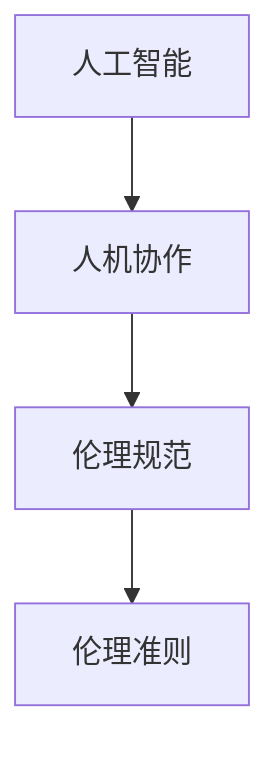

                 

# 人机协作：伦理规范与准则

## 1. 背景介绍

随着人工智能(AI)技术的飞速发展，人机协作成为现代社会的一项重要议题。机器的智能化和人性化使得它们在各个领域（医疗、教育、商业、工业等）中扮演了日益重要的角色，与人类共同完成各种复杂的任务。然而，与此同时，技术与人类的协作也引发了诸多伦理问题，如数据隐私、算法偏见、责任归属等。如何制定合理的伦理规范和行为准则，确保人机协作健康、公正地发展，成为当前科技和伦理领域的重大挑战。

### 1.1 问题由来
人工智能技术的进步使得机器能够执行各种复杂的任务，与人类协作更加紧密。然而，这种协作并非无懈可击。随着AI系统的广泛应用，其所带来的伦理问题也逐渐显现。这些问题不仅关系到技术发展本身，还涉及到社会公正、数据隐私、安全与责任等多个层面。为解决这些问题，全球各国和机构正在积极探索制定相关伦理规范和准则，以指导和规范AI系统的开发与应用。

### 1.2 问题核心关键点
在制定伦理规范和准则的过程中，以下关键点尤为值得关注：
1. **数据隐私与安全**：如何保护用户数据的隐私，防止数据滥用。
2. **算法公平性与透明性**：确保AI系统不产生算法偏见，并保持一定的透明度，使人类能够理解其决策过程。
3. **责任归属**：当AI系统发生错误或事故时，如何明确责任归属。
4. **人类监督与控制**：在AI与人类协作中，如何确保人类的主导地位。
5. **社会影响与效益**：评估AI技术对社会的影响，确保其带来的效益大于潜在的负面影响。

## 2. 核心概念与联系

### 2.1 核心概念概述

为更深入地理解人机协作中的伦理规范与准则，本节将介绍几个核心概念及其相互联系。

- **人工智能**：指通过计算机模拟人类智能的广义技术，涵盖机器学习、深度学习、自然语言处理等多个领域。
- **人机协作**：指人类与机器共同完成复杂任务的过程，机器在数据分析、决策支持等方面发挥作用，人类则在规划、监督等方面提供引导。
- **伦理规范**：指为确保技术发展的合理性与公正性，对人工智能系统的开发、使用、管理等方面提出的一系列道德要求。
- **伦理准则**：具体指导人工智能系统如何实现伦理规范的行动指南或原则。

这些概念共同构成人机协作的伦理基础，帮助制定规范和准则，确保技术的发展与人类社会的价值观相匹配。

### 2.2 核心概念原理和架构的 Mermaid 流程图



## 3. 核心算法原理 & 具体操作步骤
### 3.1 算法原理概述

人工智能系统的伦理规范与准则的制定，涉及多个方面的考量，包括但不限于数据处理、算法设计、系统部署等。其核心原理是通过一系列的原则和标准，确保技术开发与应用过程中的公正、透明、可控与安全。

具体来说，算法原理包括以下几个关键点：

1. **数据隐私保护**：确保数据在收集、存储、传输和处理过程中，严格遵守隐私保护法规，防止数据泄露和滥用。
2. **算法公平性**：设计算法时，应避免种族、性别、年龄等偏见，确保算法对所有人群的公平性。
3. **可解释性与透明性**：保证算法的决策过程透明，使人类能够理解其背后的逻辑和依据。
4. **责任归属**：明确AI系统在错误或事故中的责任，避免责任不清导致的法律和道德问题。
5. **人机协同**：确保机器的决策和操作在人类监督下进行，防止机器失控或错误决策。

### 3.2 算法步骤详解

制定人机协作的伦理规范与准则，需要遵循以下步骤：

**Step 1: 数据收集与处理**
- 定义数据收集范围，明确数据的来源和目的。
- 确保数据收集过程遵守隐私保护法规，如GDPR、CCPA等。
- 实施数据匿名化、加密等技术，保护数据隐私。

**Step 2: 算法设计与开发**
- 设计无偏见、公平的算法，采用对抗训练、数据扩充等方法消除潜在偏见。
- 确保算法具有可解释性，可包含特征重要性分析、决策路径图等工具。
- 实现透明度高的算法，使数据处理、模型训练和预测过程可视化。

**Step 3: 系统部署与监督**
- 在系统部署前进行安全测试和风险评估，确保系统安全性。
- 建立完整的监控体系，实时跟踪系统行为，及时发现和处理异常。
- 实施人机协同机制，确保机器的决策和操作在人类监督下进行。

**Step 4: 责任界定与问责机制**
- 明确系统的责任归属，如开发者、运营者、用户等。
- 制定明确的问责机制，确保在出现问题时能够迅速定位并处理。

### 3.3 算法优缺点

制定伦理规范与准则的算法具有以下优点：
1. 促进公正与透明：通过明确规定和约束，提高算法的公平性和可解释性。
2. 保障数据隐私：在数据处理过程中遵守隐私保护法规，防止数据滥用。
3. 降低责任风险：明确责任归属，减少法律和道德风险。

同时，该算法也存在一些缺点：
1. 实施难度大：需要跨学科合作，涵盖数据科学、伦理学、法律等多个领域。
2. 标准难以统一：不同国家和行业可能存在不同的伦理标准和法规，难以制定统一的规范和准则。
3. 实施成本高：制定和实施伦理规范与准则需要投入大量资源，增加企业成本。

### 3.4 算法应用领域

伦理规范与准则的制定和实施，已经广泛应用于多个领域，具体包括：

- **医疗**：确保AI在医疗诊断和治疗中的公平性和安全性，避免医疗数据滥用。
- **金融**：在信用评估、贷款审批等方面确保算法透明，避免歧视性。
- **教育**：在智能辅导、在线教育中确保数据隐私，防止学生隐私泄露。
- **司法**：在智能辅助审判、风险评估等方面确保算法公平，防止算法偏见。
- **制造业**：在智能制造、质量控制等方面确保数据安全，防止商业机密泄露。

## 4. 数学模型和公式 & 详细讲解 & 举例说明

### 4.1 数学模型构建

人机协作中的伦理规范与准则的制定，涉及多个方面的数学模型，包括数据隐私保护、算法公平性、责任归属等。

假设有一项基于人工智能的信用评估系统，该系统需要处理用户的财务数据。为了保护用户隐私，需要构建隐私保护模型，防止数据泄露。该模型的目标是确保数据在处理过程中不会泄露给未经授权的第三方。

### 4.2 公式推导过程

为了保护用户隐私，可以使用差分隐私（Differential Privacy）技术。差分隐私通过在查询结果中引入随机噪声，确保个体数据不泄露给第三方。具体来说，差分隐私模型的公式为：

$$
\epsilon\text{-}\text{差分隐私} = \text{(任意攻击者无法区分两个相邻数据集）}
$$

其中，$\epsilon$表示隐私保护程度，即引入的噪声的幅度。该模型通过在查询结果中引入随机噪声，保护个体数据，防止隐私泄露。

### 4.3 案例分析与讲解

以医疗领域为例，分析如何通过算法公平性模型，确保AI系统在医疗诊断中的公平性。

假设某医院使用AI系统对患者的病历进行疾病预测。为了确保系统的公平性，需要构建公平性模型，确保系统对不同性别、种族、年龄等人群的预测准确率一致。具体来说，可以通过训练数据集的代表性、消除特征选择偏差、对抗训练等方法，确保算法的公平性。

## 5. 项目实践：代码实例和详细解释说明
### 5.1 开发环境搭建

为了进行人机协作中的伦理规范与准则的实践，需要构建相应的开发环境。以下是使用Python进行开发的步骤：

1. 安装Python：从官网下载并安装Python，并确保版本为3.7或以上。
2. 安装必要的库：使用pip安装必要的Python库，如NumPy、SciPy、Pandas等。
3. 准备数据集：准备需要处理的数据集，并进行预处理，如去重、清洗、标准化等。

### 5.2 源代码详细实现

以下是一个简单的Python代码实例，用于实现差分隐私保护。

```python
import numpy as np
from differential_privacy import PrivacyEngine

# 假设有一组数据，需要保护用户隐私
data = np.array([1, 2, 3, 4, 5])

# 构建差分隐私引擎
privacy_engine = PrivacyEngine(epsilon=0.1)

# 进行差分隐私处理
privacy_engine.fit(data)
隐私保护的输出 = privacy_engine.transform(data)

print(隐私保护的输出)
```

### 5.3 代码解读与分析

上述代码实现了一个简单的差分隐私保护。具体来说，该代码使用了differential_privacy库，定义了差分隐私引擎，并设置了隐私保护程度$\epsilon=0.1$。在差分隐私引擎上训练模型后，对原始数据进行了差分隐私处理，并输出了隐私保护的输出。

需要注意的是，在实际应用中，差分隐私保护可能涉及更复杂的数学模型和算法，如拉普拉斯机制、高斯机制等。此外，还需要考虑如何平衡隐私保护程度和数据质量，确保隐私保护的效果与数据可用性之间的平衡。

## 6. 实际应用场景

人机协作中的伦理规范与准则，已经在多个实际应用场景中得到了应用，具体包括：

- **智能医疗**：在医疗影像诊断、疾病预测等方面，确保算法的公平性、透明性和可解释性，保护患者隐私。
- **金融服务**：在信用评估、贷款审批等方面，确保算法透明，防止歧视性，保护用户隐私。
- **在线教育**：在智能辅导、在线教育中，确保学生数据隐私，防止数据泄露。
- **智能制造**：在质量控制、生产优化等方面，确保数据安全，防止商业机密泄露。
- **智能司法**：在智能辅助审判、风险评估等方面，确保算法公平，防止算法偏见。

## 7. 工具和资源推荐

### 7.1 学习资源推荐

为帮助开发者系统掌握人机协作中的伦理规范与准则的理论基础和实践技巧，这里推荐一些优质的学习资源：

1. **《人工智能伦理规范与准则》**：该书籍系统介绍了人工智能伦理规范与准则的基本概念、主要问题和解决方案，是理解该领域的重要参考书。
2. **AI伦理课程**：斯坦福大学和麻省理工学院等名校开设的AI伦理课程，涵盖数据隐私、算法公平性、责任归属等多个主题，提供了深入的学术背景。
3. **伦理委员会指南**：如欧盟的GDPR、美国CCPA等法律法规，提供了详细的隐私保护和数据处理指导，是制定伦理规范的重要参考。

### 7.2 开发工具推荐

高效的工具可以显著提高开发效率，以下是一些常用的工具：

1. **Python编程语言**：Python以其简洁易用、生态丰富的特点，成为人工智能领域的主流编程语言。
2. **PyTorch框架**：基于Python的深度学习框架，支持动态计算图，适合快速迭代研究。
3. **TensorFlow框架**：由Google开发，支持分布式计算和高效的模型训练，适合大规模工程应用。
4. **Jupyter Notebook**：支持交互式编程和数据可视化，适合科学计算和数据分析。
5. **Git版本控制**：帮助团队协作，记录代码变化，确保版本管理的稳定性。

### 7.3 相关论文推荐

人机协作中的伦理规范与准则的制定，源于学界的持续研究。以下是几篇奠基性的相关论文，推荐阅读：

1. **《人工智能伦理：挑战与解决方案》**：该论文系统介绍了人工智能伦理的挑战与解决方案，提供了全面的理论指导。
2. **《差分隐私：一种保护数据隐私的新方法》**：该论文详细阐述了差分隐私的技术原理和应用场景，是数据隐私保护的重要文献。
3. **《人机协作的伦理规范与准则》**：该论文探讨了人机协作中的伦理规范与准则，提出了具体的实施建议。

## 8. 总结：未来发展趋势与挑战

### 8.1 总结

本文对人工智能系统中的伦理规范与准则进行了全面系统的介绍。首先阐述了人机协作中的伦理问题，明确了制定规范和准则的重要性和紧迫性。其次，从原理到实践，详细讲解了隐私保护、算法公平性等关键问题的算法原理和具体操作步骤。同时，本文还广泛探讨了伦理规范与准则在医疗、金融、教育等多个行业领域的应用前景，展示了其在构建人机协作系统中的巨大潜力。

通过本文的系统梳理，可以看到，人机协作中的伦理规范与准则，为人工智能技术的应用提供了重要的道德保障。这些规范和准则，通过确保技术发展的合理性与公正性，有助于构建安全、可靠、可解释、可控的智能系统，促进社会和谐与进步。

### 8.2 未来发展趋势

展望未来，人机协作中的伦理规范与准则将呈现以下几个发展趋势：

1. **隐私保护技术持续进步**：随着数据隐私保护法规的完善和技术的演进，差分隐私、同态加密等隐私保护技术将更加成熟，保障用户隐私的安全性。
2. **算法公平性研究深入**：未来将有更多研究关注算法的公平性问题，提出更有效的公平性算法，确保算法对所有人群的公正性。
3. **伦理框架体系完善**：国际上将逐渐形成统一的伦理框架体系，帮助各国和行业制定符合伦理标准的规范和准则。
4. **人工智能道德监管加强**：各国将加强对人工智能系统的道德监管，确保技术发展与人类价值观相匹配。
5. **人机协同机制优化**：未来的AI系统将更加注重人机协同机制的设计，确保机器的决策和操作在人类监督下进行。

以上趋势凸显了人机协作中伦理规范与准则的广阔前景。这些方向的探索发展，将为人机协作系统的安全、公正、可控与可持续性提供坚实保障，推动人工智能技术的健康发展。

### 8.3 面临的挑战

尽管人机协作中的伦理规范与准则已经取得了一定进展，但在迈向更加智能化、普适化应用的过程中，仍面临诸多挑战：

1. **跨领域合作困难**：制定和实施伦理规范与准则需要跨学科合作，涵盖数据科学、伦理学、法律等多个领域，协调难度大。
2. **数据隐私保护复杂**：不同国家和行业存在不同的隐私保护法规，如何协调不同法规要求，制定统一的规范和准则，是一大挑战。
3. **算法公平性挑战**：在算法设计和训练过程中，如何消除偏见，确保算法对所有人群的公正性，仍需更多研究和实践。
4. **责任归属模糊**：当AI系统发生错误或事故时，如何明确责任归属，避免法律和道德风险，是亟待解决的难题。
5. **人机协同机制需进一步完善**：如何设计更加高效、透明的人机协同机制，确保机器的决策和操作在人类监督下进行，需要更多实践和探索。

### 8.4 研究展望

面对人机协作中伦理规范与准则面临的挑战，未来的研究需要在以下几个方面寻求新的突破：

1. **跨学科合作**：加强数据科学、伦理学、法律等领域的合作，形成统一的伦理框架体系。
2. **隐私保护技术创新**：继续推动隐私保护技术的发展，如差分隐私、同态加密等，确保数据隐私的安全性。
3. **算法公平性优化**：开发更高效的公平性算法，确保算法对所有人群的公正性。
4. **责任归属明确化**：制定明确的责任归属机制，确保AI系统在错误或事故中的责任清晰。
5. **人机协同机制优化**：设计更加高效、透明的人机协同机制，确保机器的决策和操作在人类监督下进行。

这些研究方向的探索，将为人机协作系统的健康发展提供坚实的理论基础和实践指导，为构建更加安全、公正、可控的智能系统铺平道路。

## 9. 附录：常见问题与解答

**Q1：什么是差分隐私？**

A: 差分隐私是一种保护数据隐私的技术，通过在查询结果中引入随机噪声，确保个体数据不泄露给第三方。差分隐私的目标是在保护数据隐私的同时，最大化数据可用性。

**Q2：如何确保算法的公平性？**

A: 确保算法的公平性，可以从数据收集、特征选择、模型训练等多个环节入手。具体来说，可以采用对抗训练、数据扩充、特征重要性分析等方法，确保算法对所有人群的公正性。

**Q3：如何处理AI系统中的责任归属问题？**

A: 明确AI系统在错误或事故中的责任归属，需要从开发者、运营者、用户等多个角度考虑。制定明确的责任归属机制，确保在出现问题时能够迅速定位并处理。

**Q4：人机协作中的伦理规范与准则如何实施？**

A: 人机协作中的伦理规范与准则的实施，需要从数据隐私保护、算法公平性、责任归属等多个方面综合考虑。可以制定具体的实施指南和操作手册，确保各环节严格按照规范执行。

**Q5：如何构建高效、透明的人机协同机制？**

A: 构建高效、透明的人机协同机制，需要设计合理的监督机制、反馈机制和用户界面。可以采用可视化工具、智能助手等技术，帮助用户理解和操作AI系统，确保机器的决策和操作在人类监督下进行。

---

作者：禅与计算机程序设计艺术 / Zen and the Art of Computer Programming

