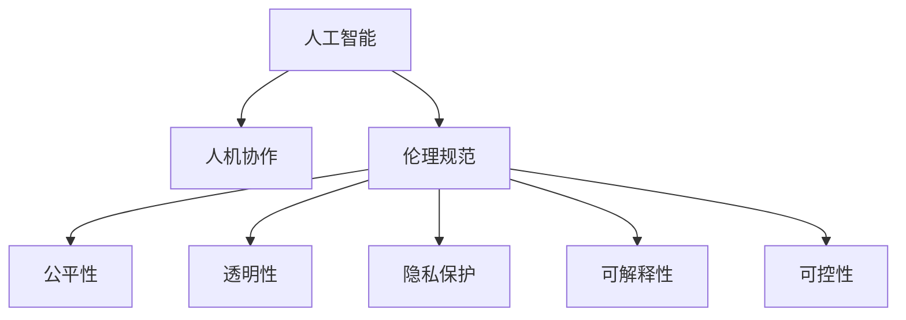

                 

# 人机协作：伦理规范与准则

> 关键词：人工智能,人机协作,伦理规范,公平性,透明性,隐私保护,可解释性,可控性

## 1. 背景介绍

### 1.1 问题由来
随着人工智能技术的飞速发展，人机协作正日益成为推动各行各业创新发展的关键驱动力。然而，人工智能系统的广泛应用也引发了一系列伦理问题，如隐私泄露、决策不透明、算法偏见、滥用风险等。这些问题不仅影响到了系统的可接受性和安全性，还可能带来深远的社会影响。因此，建立一套全面而有效的伦理规范与准则，对指导人工智能技术的健康发展和应用至关重要。

### 1.2 问题核心关键点
人工智能伦理规范与准则的核心在于确保人工智能技术的应用符合人类社会的价值标准，同时兼顾技术进步和创新。其关键点包括：
- 隐私保护：在数据收集、存储和处理过程中，确保个人隐私不被侵犯。
- 公平性：确保算法在对待不同群体时能够公正对待，避免系统性偏见。
- 透明性：使人工智能系统的决策过程透明化，用户可以理解和信任。
- 可解释性：人工智能系统应具备可解释性，让用户能够理解其决策过程。
- 可控性：人工智能系统应具备可控性，用户可以干预和调节其行为。

## 2. 核心概念与联系

### 2.1 核心概念概述

为更好地理解人工智能伦理规范与准则，本节将介绍几个密切相关的核心概念：

- 人工智能(Artificial Intelligence, AI)：通过计算机系统模拟人类智能行为的科学与工程领域，包括机器学习、深度学习、自然语言处理等。
- 人机协作(Human-Machine Collaboration)：指人类与人工智能系统在任务执行过程中相互合作，共同完成目标的实践模式。
- 伦理规范(Ethical Norms)：指导人工智能系统开发与应用的一组道德原则和行为标准。
- 准则(Principles)：具体指导人工智能系统设计、开发和应用的关键原则，如隐私保护、公平性、透明性等。

这些核心概念之间的逻辑关系可以通过以下Mermaid流程图来展示：



这个流程图展示了一系列核心概念及其之间的联系：

1. 人工智能通过模拟人类智能行为，与人协作完成任务。
2. 人工智能伦理规范与准则指导人工智能系统的设计和应用，确保其符合社会价值标准。
3. 伦理规范包含公平性、透明性、隐私保护、可解释性、可控性等多个关键原则，指引系统开发。

这些概念共同构成了人工智能伦理规范与准则的基础框架，为确保技术应用的安全、公正和透明提供了重要保障。

## 3. 核心算法原理 & 具体操作步骤

### 3.1 算法原理概述

人工智能伦理规范与准则的建立，依赖于对算法行为和决策过程的深入理解。算法在处理数据、做出决策时，其行为和结果可能受到多种因素的影响，包括数据质量、模型选择、参数设置、算法优化等。因此，构建一套全面、系统、科学的伦理规范与准则，需要从算法原理出发，深入分析其行为模式和潜在风险。

人工智能伦理规范与准则的核心在于：
- 确保算法的公平性，避免系统性偏见。
- 提高算法的透明性，使用户能够理解和信任。
- 保护用户隐私，防止数据泄露。
- 增强算法的可解释性，提高系统的可控性。

### 3.2 算法步骤详解

人工智能伦理规范与准则的构建，可以分为以下几个关键步骤：

**Step 1: 数据质量评估**
- 对训练数据进行质量评估，确保数据无偏见、无噪声。
- 收集数据来源多样性，避免数据集中性和抽样偏差。
- 采用匿名化、去标识化等技术保护数据隐私。

**Step 2: 算法选择与优化**
- 选择适合的算法模型，确保其在公平性、透明性、可解释性等方面满足规范要求。
- 通过交叉验证、超参数调优等技术，提高模型的泛化能力和鲁棒性。
- 引入对抗训练、正则化等技术，防止模型过拟合和泛化能力下降。

**Step 3: 伦理准则制定**
- 制定公平性准则，确保算法在对待不同群体时能够公正对待。
- 制定透明性准则，使算法决策过程透明化，用户可以理解和信任。
- 制定隐私保护准则，确保数据隐私不被侵犯。
- 制定可解释性准则，使算法具备可解释性，用户可以理解其决策过程。
- 制定可控性准则，使算法具备可控性，用户可以干预和调节其行为。

**Step 4: 伦理测试与评估**
- 进行伦理测试，评估算法在公平性、透明性、隐私保护、可解释性、可控性等方面的表现。
- 采用A/B测试、用户调查等方法，收集用户反馈，不断优化算法行为。

**Step 5: 伦理规范与准则实施**
- 将伦理规范与准则融入算法开发、测试、部署和运维的全生命周期。
- 建立伦理审查机制，定期审查算法行为，确保其符合规范要求。

### 3.3 算法优缺点

人工智能伦理规范与准则的构建，具有以下优点：
1. 提升系统公平性。通过制定和实施公平性准则，可以有效避免系统性偏见，提升算法的公正性。
2. 增强系统透明度。通过提高算法的透明性，使用户能够理解和信任，提升系统可接受度。
3. 保护用户隐私。通过制定隐私保护准则，可以有效防止数据泄露，保护用户隐私。
4. 增强系统可解释性。通过提高算法的可解释性，使系统决策过程透明化，便于用户理解和调试。
5. 提升系统可控性。通过制定可控性准则，使用户可以干预和调节算法行为，提升系统可控性。

同时，该方法也存在以下局限性：
1. 伦理规范与准则的制定较为复杂。需要综合考虑多方面的因素，如公平性、透明性、隐私保护等。
2. 实施难度较大。将伦理规范与准则融入算法开发、测试、部署和运维的全生命周期，需要投入大量人力和资源。
3. 对技术要求较高。需要开发符合规范要求的算法模型，同时还需要对算法行为进行伦理测试和评估。

尽管存在这些局限性，但就目前而言，人工智能伦理规范与准则的构建是大势所趋，对于确保人工智能技术的健康发展具有重要意义。未来相关研究的重点在于如何进一步简化伦理规范与准则的制定流程，提升其实施效果，同时兼顾技术的公平性、透明性、隐私保护、可解释性、可控性等关键要素。

### 3.4 算法应用领域

人工智能伦理规范与准则的应用，广泛涵盖各个领域，包括但不限于：

- 医疗健康：确保医疗决策的公平性、透明性和隐私保护，提高患者对系统的信任。
- 金融服务：确保金融产品的公平性、透明性和隐私保护，避免算法偏见和滥用风险。
- 智能制造：确保制造过程的公平性、透明性和隐私保护，提升生产效率和产品质量。
- 教育培训：确保教育资源的公平性、透明性和隐私保护，提升教育公平性和个性化教学效果。
- 环境保护：确保环境监测的公平性、透明性和隐私保护，提高环境治理的科学性和公众参与度。

除了上述这些领域，人工智能伦理规范与准则的应用还将不断拓展到更多领域，为各行各业带来新的变革和机遇。

## 4. 数学模型和公式 & 详细讲解 & 举例说明

### 4.1 数学模型构建

本节将使用数学语言对人工智能伦理规范与准则的构建过程进行更加严格的刻画。

假设人工智能系统为一个分类器 $M_{\theta}$，其中 $\theta$ 为模型参数。对于一组训练数据集 $D=\{(x_i,y_i)\}_{i=1}^N$，其中 $x_i \in \mathcal{X}$ 为输入，$y_i \in \{0,1\}$ 为标签。假设系统的公平性、透明性、隐私保护、可解释性、可控性等准则可以用 $F$、$T$、$P$、$I$、$C$ 表示，且这些准则的权重分别为 $w_F$、$w_T$、$w_P$、$w_I$、$w_C$。则系统的综合伦理得分 $S$ 可以表示为：

$$
S = w_F F + w_T T + w_P P + w_I I + w_C C
$$

其中 $F$、$T$、$P$、$I$、$C$ 的具体定义和计算方法将在后续章节中详细介绍。

### 4.2 公式推导过程

以下我们以公平性为例，推导公平性准则的数学模型及其计算公式。

假设模型 $M_{\theta}$ 在输入 $x$ 上的输出为 $\hat{y}=M_{\theta}(x)$，表示样本属于正类的概率。定义公平性准则为 $F = \frac{1}{N}\sum_{i=1}^N \sum_{k=1}^K \Delta(y_i) |\hat{y}_i - \hat{y}_k|$，其中 $K$ 为不同群体的数量，$\Delta(y_i)$ 表示样本 $i$ 是否属于第 $k$ 个群体。则公平性准则的计算公式为：

$$
F = \frac{1}{N}\sum_{i=1}^N \sum_{k=1}^K \Delta(y_i) |\hat{y}_i - \hat{y}_k|
$$

根据公平性准则的定义，计算公平性得分的过程如下：
1. 将训练数据集 $D$ 按照不同群体进行划分。
2. 对于每个样本 $(x_i,y_i)$，计算其在不同群体上的输出概率 $\hat{y}_i^{(k)}$。
3. 计算每个样本在不同群体上的输出概率差异 $\Delta(y_i) |\hat{y}_i - \hat{y}_k|$。
4. 将所有样本在不同群体上的差异值求和，得到公平性得分 $F$。

在得到公平性得分后，可以将其纳入伦理得分的计算中，综合考虑系统的其他伦理准则，进行全面的伦理评估。

## 5. 项目实践：代码实例和详细解释说明

### 5.1 开发环境搭建

在进行人工智能伦理规范与准则的开发实践前，我们需要准备好开发环境。以下是使用Python进行Scikit-learn开发的环境配置流程：

1. 安装Anaconda：从官网下载并安装Anaconda，用于创建独立的Python环境。

2. 创建并激活虚拟环境：
```bash
conda create -n ethics-env python=3.8 
conda activate ethics-env
```

3. 安装Scikit-learn：从官网获取对应的安装命令，例如：
```bash
pip install -U scikit-learn
```

4. 安装各类工具包：
```bash
pip install numpy pandas scikit-learn matplotlib tqdm jupyter notebook ipython
```

完成上述步骤后，即可在`ethics-env`环境中开始实践。

### 5.2 源代码详细实现

这里我们以公平性准则的实现为例，给出使用Scikit-learn进行公平性评估的Python代码实现。

首先，定义公平性准则的计算函数：

```python
from sklearn.metrics import accuracy_score, roc_auc_score, confusion_matrix
import numpy as np

def fairness_score(y_true, y_pred, groups):
    """
    计算公平性得分
    :param y_true: 真实标签
    :param y_pred: 预测标签
    :param groups: 分组信息
    :return: 公平性得分
    """
    scores = {}
    for group in groups:
        true_labels = y_true[groups == group]
        pred_labels = y_pred[groups == group]
        scores[group] = {
            'accuracy': accuracy_score(true_labels, pred_labels),
            'roc_auc': roc_auc_score(true_labels, pred_labels),
            'confusion_matrix': confusion_matrix(true_labels, pred_labels)
        }
    fairness_score = np.mean([scores[group]['accuracy'] for group in groups])
    roc_auc_score = np.mean([scores[group]['roc_auc'] for group in groups])
    confusion_matrix = np.mean([scores[group]['confusion_matrix'] for group in groups], axis=0)
    return accuracy_score, roc_auc_score, confusion_matrix
```

然后，定义训练和评估函数：

```python
from sklearn.model_selection import train_test_split
from sklearn.ensemble import RandomForestClassifier
from sklearn.metrics import classification_report

def train_model(X, y, groups, test_size=0.2):
    """
    训练模型并评估公平性
    :param X: 训练数据
    :param y: 训练标签
    :param groups: 分组信息
    :param test_size: 测试集大小
    :return: 公平性得分
    """
    X_train, X_test, y_train, y_test = train_test_split(X, y, test_size=test_size)
    model = RandomForestClassifier(n_estimators=100)
    model.fit(X_train, y_train)
    y_pred = model.predict(X_test)
    accuracy, roc_auc, confusion_matrix = fairness_score(y_test, y_pred, groups)
    return accuracy, roc_auc, confusion_matrix

# 假设X为特征，y为标签，groups为分组信息
X = ...
y = ...
groups = ...

accuracy, roc_auc, confusion_matrix = train_model(X, y, groups)
print(classification_report(y_test, y_pred))
```

最后，启动公平性评估流程：

```python
X = ...
y = ...
groups = ...

accuracy, roc_auc, confusion_matrix = train_model(X, y, groups)
print(f"Fairness Score: {accuracy:.4f}, ROC-AUC: {roc_auc:.4f}")
```

以上就是使用Scikit-learn进行公平性评估的完整代码实现。可以看到，Scikit-learn提供了一系列简单易用的接口，使得公平性评估变得轻松快捷。

### 5.3 代码解读与分析

让我们再详细解读一下关键代码的实现细节：

**train_model函数**：
- 使用train_test_split函数将数据集分为训练集和测试集，同时根据分组信息对训练集进行分组。
- 训练一个随机森林分类器，并使用测试集进行预测。
- 计算公平性得分，包括准确率、ROC-AUC得分和混淆矩阵。
- 返回公平性得分。

**classification_report函数**：
- 使用classification_report函数输出测试集的分类报告，包括准确率、召回率、F1分数等指标。

**X、y、groups变量**：
- 定义特征、标签和分组信息，这些都是训练和评估模型的关键输入。

可以看到，Scikit-learn提供的公平性评估函数和方法，大大简化了公平性准则的计算和评估过程，使得开发者可以更专注于算法的优化和伦理准则的制定。

当然，工业级的系统实现还需考虑更多因素，如模型训练目标、超参数优化、多轮训练等。但核心的公平性评估逻辑基本与此类似。

## 6. 实际应用场景

### 6.1 医疗健康

在医疗健康领域，人工智能伦理规范与准则的应用至关重要。医疗决策的公平性、透明性和隐私保护，直接影响患者对系统的信任和接受度。

具体而言，可以应用人工智能伦理规范与准则于以下场景：
- 医疗影像诊断：确保诊断系统的公平性、透明性和隐私保护，提升医生的诊断准确性和患者对系统的信任。
- 个性化治疗：确保个性化治疗方案的公平性、透明性和隐私保护，提高治疗效果和患者满意度。
- 健康监测：确保健康监测系统的公平性、透明性和隐私保护，提升医疗数据的准确性和安全性。

### 6.2 金融服务

金融服务领域需要高度依赖人工智能系统进行决策，其公平性、透明性和隐私保护尤为重要。

具体而言，可以应用人工智能伦理规范与准则于以下场景：
- 信用评估：确保信用评估系统的公平性、透明性和隐私保护，提升贷款审批的公正性和透明度。
- 风险控制：确保风险控制系统的公平性、透明性和隐私保护，防范系统性风险。
- 反欺诈检测：确保反欺诈检测系统的公平性、透明性和隐私保护，防止误判和漏判。

### 6.3 智能制造

智能制造领域，人工智能系统的公平性、透明性和隐私保护同样重要。智能制造系统的公平性、透明性和隐私保护，直接影响生产效率和产品质量。

具体而言，可以应用人工智能伦理规范与准则于以下场景：
- 质量控制：确保质量控制系统的公平性、透明性和隐私保护，提升产品质量和生产效率。
- 设备维护：确保设备维护系统的公平性、透明性和隐私保护，提高设备利用率和生产效率。
- 供应链管理：确保供应链管理系统的公平性、透明性和隐私保护，提升供应链管理的效率和透明度。

### 6.4 教育培训

教育培训领域，人工智能系统的公平性、透明性和隐私保护同样重要。教育资源的公平性、透明性和隐私保护，直接影响教育公平性和个性化教学效果。

具体而言，可以应用人工智能伦理规范与准则于以下场景：
- 智能评估：确保智能评估系统的公平性、透明性和隐私保护，提升评估结果的公正性和可信度。
- 个性化学习：确保个性化学习系统的公平性、透明性和隐私保护，提高学生的学习效果和满意度。
- 教育资源分配：确保教育资源分配系统的公平性、透明性和隐私保护，提升教育公平性和资源利用效率。

### 6.5 环境保护

环境保护领域，人工智能系统的公平性、透明性和隐私保护同样重要。环境监测的公平性、透明性和隐私保护，直接影响环境治理的科学性和公众参与度。

具体而言，可以应用人工智能伦理规范与准则于以下场景：
- 空气质量监测：确保空气质量监测系统的公平性、透明性和隐私保护，提升监测数据的准确性和可靠性。
- 水质监测：确保水质监测系统的公平性、透明性和隐私保护，提升监测结果的公正性和可信度。
- 生态保护：确保生态保护系统的公平性、透明性和隐私保护，提升生态保护的效果和公众参与度。

## 7. 工具和资源推荐

### 7.1 学习资源推荐

为了帮助开发者系统掌握人工智能伦理规范与准则的理论基础和实践技巧，这里推荐一些优质的学习资源：

1. 《AI伦理：原理与实践》系列博文：由人工智能伦理专家撰写，深入浅出地介绍了人工智能伦理规范与准则的基本概念和实践方法。

2. AI ethics courses：斯坦福大学、MIT等知名高校开设的人工智能伦理课程，提供系统的理论知识和案例分析。

3. 《人工智能伦理》书籍：全面介绍人工智能伦理规范与准则的理论和实践，适合深入研究。

4. IEEE ETHICS：国际电气电子工程师学会（IEEE）的伦理资源，提供丰富的学术论文、指南和标准。

5. AI ethics conferences：全球范围内的人工智能伦理会议，汇聚各领域的专家，分享前沿研究成果和实践经验。

通过对这些资源的学习实践，相信你一定能够快速掌握人工智能伦理规范与准则的精髓，并用于解决实际的人工智能应用问题。

### 7.2 开发工具推荐

高效的开发离不开优秀的工具支持。以下是几款用于人工智能伦理规范与准则开发常用的工具：

1. Scikit-learn：开源的机器学习库，提供了丰富的公平性评估方法和接口，适合快速实现和测试伦理规范与准则。

2. TensorFlow：由Google主导开发的深度学习框架，生产部署方便，适合大规模工程应用。

3. PyTorch：基于Python的开源深度学习框架，灵活动态的计算图，适合快速迭代研究。

4. Weights & Biases：模型训练的实验跟踪工具，可以记录和可视化模型训练过程中的各项指标，方便对比和调优。

5. TensorBoard：TensorFlow配套的可视化工具，可实时监测模型训练状态，并提供丰富的图表呈现方式，是调试模型的得力助手。

6. Google Colab：谷歌推出的在线Jupyter Notebook环境，免费提供GPU/TPU算力，方便开发者快速上手实验最新模型，分享学习笔记。

合理利用这些工具，可以显著提升人工智能伦理规范与准则的开发效率，加快创新迭代的步伐。

### 7.3 相关论文推荐

人工智能伦理规范与准则的发展源于学界的持续研究。以下是几篇奠基性的相关论文，推荐阅读：

1. Fairness in Machine Learning（机器学习中的公平性）：探讨机器学习系统中的公平性问题，提出多种公平性评估指标和改进方法。

2. Explainable Artificial Intelligence（可解释性人工智能）：阐述可解释性人工智能的基本概念、方法和挑战，提出多种可解释性技术。

3. Ethical considerations in AI（人工智能伦理问题）：讨论人工智能系统中的伦理问题，提出多种伦理准则和实践指南。

4. Privacy preserving machine learning（隐私保护机器学习）：介绍隐私保护机器学习的多种技术和方法，包括差分隐私、联邦学习等。

5. Fairness, Accountability and Transparency（公平性、责任和透明性）：总结人工智能伦理规范与准则的研究现状，提出多种评估和改进方法。

这些论文代表了大语言模型微调技术的发展脉络。通过学习这些前沿成果，可以帮助研究者把握学科前进方向，激发更多的创新灵感。

## 8. 总结：未来发展趋势与挑战

### 8.1 总结

本文对人工智能伦理规范与准则进行了全面系统的介绍。首先阐述了人工智能伦理规范与准则的研究背景和意义，明确了伦理规范与准则在确保人工智能技术应用过程中的重要性。其次，从原理到实践，详细讲解了人工智能伦理规范与准则的构建过程，给出了伦理规范与准则构建的完整代码实例。同时，本文还广泛探讨了人工智能伦理规范与准则在医疗健康、金融服务、智能制造、教育培训、环境保护等多个行业领域的应用前景，展示了伦理规范与准则的巨大潜力。此外，本文精选了伦理规范与准则的学习资源，力求为读者提供全方位的技术指引。

通过本文的系统梳理，可以看到，人工智能伦理规范与准则的研究和实践，正在成为人工智能技术发展的重要组成部分，对于确保人工智能技术的健康发展和应用具有重要意义。未来，伴随人工智能技术的不断进步和普及，伦理规范与准则的研究将更加深入和广泛，为构建安全、可靠、可控的智能系统提供坚实保障。

### 8.2 未来发展趋势

展望未来，人工智能伦理规范与准则的研究将呈现以下几个发展趋势：

1. 伦理准则的自动化。随着自动化技术的进步，伦理准则的制定和实施将变得更加自动化和智能化，减少人工干预。

2. 伦理测试的标准化。建立和完善伦理测试标准，对人工智能系统进行全面、系统的评估，确保其符合伦理规范与准则。

3. 多领域伦理规范的整合。将不同领域的人工智能伦理规范进行整合，形成一套统一、系统的伦理规范体系。

4. 伦理规范与技术的融合。将伦理规范与技术进行更深入的融合，确保技术在应用过程中符合伦理要求。

5. 伦理规范与法律的协同。建立伦理规范与法律法规的协同机制，将伦理规范与法律要求有机结合，提升系统合法性和合规性。

以上趋势凸显了人工智能伦理规范与准则的研究和实践的广阔前景。这些方向的探索发展，必将进一步提升人工智能系统的公平性、透明性、隐私保护、可解释性、可控性等关键要素，为构建安全、可靠、可控的智能系统铺平道路。

### 8.3 面临的挑战

尽管人工智能伦理规范与准则的研究已经取得了显著成果，但在迈向更加智能化、普适化应用的过程中，仍面临着诸多挑战：

1. 伦理准则的制定难度。需要综合考虑多方面的因素，如公平性、透明性、隐私保护等，制定出符合实际情况的伦理准则。

2. 伦理准则的实施难度。将伦理规范与准则融入人工智能系统的设计和应用，需要投入大量人力和资源。

3. 伦理准则的监督机制。建立和完善伦理监督机制，确保人工智能系统符合伦理规范与准则。

4. 伦理准则的技术实现。需要开发符合伦理规范与准则的算法模型，同时还需要对算法行为进行伦理测试和评估。

5. 伦理准则的跨领域应用。不同领域的伦理规范与准则可能存在冲突，需要建立一套统一、系统的伦理规范体系。

6. 伦理准则的法律保障。需要建立和完善法律保障机制，确保人工智能系统符合伦理规范与准则。

正视人工智能伦理规范与准则面临的这些挑战，积极应对并寻求突破，将是大语言模型微调走向成熟的必由之路。相信随着学界和产业界的共同努力，这些挑战终将一一被克服，人工智能伦理规范与准则必将在构建安全、可靠、可控的智能系统中扮演越来越重要的角色。

### 8.4 研究展望

面对人工智能伦理规范与准则所面临的种种挑战，未来的研究需要在以下几个方面寻求新的突破：

1. 探索自动化和智能化伦理准则制定方法。利用自动化技术，将伦理准则的制定过程自动化和智能化，减少人工干预。

2. 研究标准化伦理测试方法和工具。建立和完善伦理测试标准，对人工智能系统进行全面、系统的评估，确保其符合伦理规范与准则。

3. 开发符合伦理规范与准则的算法模型。开发符合公平性、透明性、隐私保护、可解释性、可控性等伦理准则的算法模型，确保技术在应用过程中符合伦理要求。

4. 建立伦理规范与法律法规的协同机制。建立伦理规范与法律法规的协同机制，将伦理规范与法律要求有机结合，提升系统合法性和合规性。

5. 实现伦理规范与技术的深度融合。将伦理规范与技术进行更深入的融合，确保技术在应用过程中符合伦理要求。

6. 开展跨领域伦理规范研究。建立和完善跨领域伦理规范体系，解决不同领域伦理规范之间的冲突。

这些研究方向的探索，必将引领人工智能伦理规范与准则的研究进入新的阶段，为构建安全、可靠、可控的智能系统提供坚实保障。面向未来，人工智能伦理规范与准则的研究还需要与其他人工智能技术进行更深入的融合，如知识表示、因果推理、强化学习等，多路径协同发力，共同推动人工智能技术的健康发展。只有勇于创新、敢于突破，才能不断拓展人工智能伦理规范与准则的边界，让人工智能技术更好地造福人类社会。

## 9. 附录：常见问题与解答

**Q1：人工智能伦理规范与准则的制定需要考虑哪些因素？**

A: 人工智能伦理规范与准则的制定需要考虑以下因素：
1. 公平性：确保算法在对待不同群体时能够公正对待。
2. 透明性：使算法决策过程透明化，用户可以理解和信任。
3. 隐私保护：确保数据隐私不被侵犯。
4. 可解释性：使算法具备可解释性，用户可以理解其决策过程。
5. 可控性：使算法具备可控性，用户可以干预和调节其行为。
6. 安全性：确保算法决策过程安全可靠，避免滥用风险。

**Q2：人工智能伦理规范与准则的实施过程中需要注意哪些问题？**

A: 人工智能伦理规范与准则的实施过程中需要注意以下问题：
1. 公平性：确保算法在对待不同群体时能够公正对待。
2. 透明性：使算法决策过程透明化，用户可以理解和信任。
3. 隐私保护：确保数据隐私不被侵犯。
4. 可解释性：使算法具备可解释性，用户可以理解其决策过程。
5. 可控性：使算法具备可控性，用户可以干预和调节其行为。
6. 安全性：确保算法决策过程安全可靠，避免滥用风险。

**Q3：人工智能伦理规范与准则的研究现状如何？**

A: 人工智能伦理规范与准则的研究现状如下：
1. 公平性：探讨机器学习系统中的公平性问题，提出多种公平性评估指标和改进方法。
2. 透明性：阐述可解释性人工智能的基本概念、方法和挑战，提出多种可解释性技术。
3. 隐私保护：介绍隐私保护机器学习的多种技术和方法，包括差分隐私、联邦学习等。
4. 安全性：建立和完善人工智能系统的安全保障机制，防止系统被滥用或攻击。
5. 可控性：确保人工智能系统的可控性，防止其行为失控。

**Q4：人工智能伦理规范与准则的未来发展方向是什么？**

A: 人工智能伦理规范与准则的未来发展方向如下：
1. 自动化和智能化伦理准则制定：利用自动化技术，将伦理准则的制定过程自动化和智能化，减少人工干预。
2. 标准化伦理测试方法：建立和完善伦理测试标准，对人工智能系统进行全面、系统的评估，确保其符合伦理规范与准则。
3. 跨领域伦理规范研究：建立和完善跨领域伦理规范体系，解决不同领域伦理规范之间的冲突。
4. 深度融合伦理规范与技术：将伦理规范与技术进行更深入的融合，确保技术在应用过程中符合伦理要求。

---

作者：禅与计算机程序设计艺术 / Zen and the Art of Computer Programming

