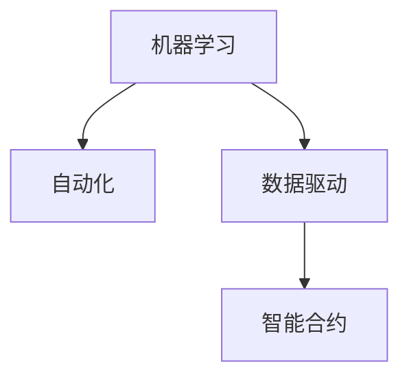

                 

# 人机协作：未来工作的趋势

## 1. 背景介绍

### 1.1 问题由来

随着科技的迅猛发展，人工智能（AI）在各行各业的应用日益广泛。AI不仅在制造业、医疗、金融等领域展现出强大的能力，也开始逐渐渗透到人类的工作场景中。由此引发的“人机协作”议题，也愈发受到公众和学术界的关注。

一方面，AI能够处理大量复杂任务，提升工作效率，减少错误率，尤其在数据分析、图像识别、语音识别等领域表现尤为突出。例如，自然语言处理（NLP）技术使得机器能够理解和处理人类语言，从而在客服、翻译、内容生成等领域发挥重要作用。

另一方面，AI的应用也引发了一些担忧，如就业替代、隐私保护、安全问题等。特别是对于那些重复性高、逻辑性强的劳动密集型工作，AI的介入可能带来显著的变革。如何在享受技术红利的同时，保护人类的就业权益，成为当下必须面对的问题。

## 2. 核心概念与联系

### 2.1 核心概念概述

本文将详细探讨“人机协作”这一核心概念，并结合“机器学习”、“自动化”、“数据驱动”、“智能合约”等技术，深入分析未来工作的趋势。

- **机器学习（Machine Learning）**：通过数据驱动的方式，使机器具备学习、决策、预测等能力，从而替代或辅助人类工作。
- **自动化（Automation）**：利用AI技术，实现工作流程的自动化处理，减少人工干预，提升效率。
- **数据驱动（Data-Driven）**：基于海量数据进行模型训练，提升AI系统的决策准确性和效率。
- **智能合约（Smart Contracts）**：一种基于区块链技术的合约，通过代码实现合约条款，自动执行和监管，减少人为干预和错误。

这些核心概念之间存在紧密联系，共同构成了人机协作的技术基础。我们将通过以下Mermaid流程图展示这些概念之间的联系：



## 3. 核心算法原理 & 具体操作步骤
### 3.1 算法原理概述

人机协作的核心在于将人类与机器的各自优势进行有机结合，以提升整体的工作效率和质量。机器在处理大量重复性任务、高强度计算等方面具有明显优势，而人类在复杂决策、创新性思考、情感交流等方面仍然占据主导地位。

人机协作的实现依赖于多种AI技术，包括但不限于：

- **机器学习（ML）**：用于训练AI模型，提升其决策能力。
- **自然语言处理（NLP）**：使机器能够理解和生成人类语言，进行对话、翻译、文本生成等任务。
- **计算机视觉（CV）**：使机器能够理解和处理图像、视频等视觉信息。
- **强化学习（RL）**：通过与环境的交互，优化AI决策策略。

### 3.2 算法步骤详解

**Step 1: 任务定义**

首先，明确需要协作的任务类型和目标。例如，提升客户服务质量、优化供应链管理、提高生产效率等。

**Step 2: 数据收集与预处理**

收集相关的数据，如客户互动记录、供应链数据、生产设备状态等，进行清洗、标注、归一化等预处理，以便用于模型训练。

**Step 3: 模型训练与选择**

选择合适的模型架构和算法，进行训练。模型选择应根据任务特点，如需要处理的语言类型、图像特征等。

**Step 4: 集成与部署**

将训练好的模型集成到现有系统中，进行部署和测试，确保其能够在实际环境中正常运行。

**Step 5: 持续优化**

定期收集反馈，评估模型性能，进行微调或重训练，以适应任务变化和数据更新。

### 3.3 算法优缺点

人机协作的算法具有以下优点：

- **提升效率**：通过自动化处理大量重复性任务，减轻人工负担，提高效率。
- **减少错误**：机器在处理数据和执行计算时，准确性较高，减少人为错误。
- **创新支持**：AI能够处理海量数据，发现潜在规律和趋势，辅助人类进行创新。

但同时，也存在一些缺点：

- **成本投入**：初期技术开发和系统集成成本较高。
- **技术依赖**：对技术和算法的依赖度较高，存在技术故障风险。
- **隐私和安全问题**：AI处理数据可能涉及隐私泄露和数据安全问题。

### 3.4 算法应用领域

人机协作技术在多个领域展现了广泛的应用前景：

- **制造业**：通过自动化生产线，提升生产效率和质量，降低成本。
- **金融业**：利用AI进行风险评估、市场分析、客户服务等工作。
- **医疗行业**：通过智能诊断系统、机器人手术等方式，提高医疗水平和效率。
- **服务业**：利用AI优化客服系统、提升服务质量，提供个性化推荐。
- **零售业**：通过智能推荐系统、库存管理系统等，提升销售和服务体验。

## 4. 数学模型和公式 & 详细讲解
### 4.1 数学模型构建

为了更好地理解人机协作中的算法原理，我们将引入数学模型进行描述。

假设一个简单的物流优化问题，需要安排多个仓库到多个配送点的物资分配。令 $W$ 表示所有仓库的集合，$D$ 表示所有配送点的集合。令 $C$ 表示每条配送路径的固定成本，$S$ 表示每条配送路径的变动成本。目标是最小化总成本。

我们可以使用整数线性规划（ILP）模型来描述这一问题：

$$
\min \sum_{(i,j) \in W \times D} (C_{ij} + S_{ij} x_{ij})
$$

其中 $x_{ij}$ 表示从仓库 $i$ 到配送点 $j$ 的物资分配量。

### 4.2 公式推导过程

对上述模型进行推导，得到最优解的计算公式：

$$
x_{ij} = \frac{1}{C_{ij}} \left( \sum_{k=1}^{K} \lambda_k \right)
$$

其中 $K$ 表示配送路径的数量，$\lambda_k$ 表示配送路径 $k$ 的变动成本权重。

### 4.3 案例分析与讲解

假设某物流公司有 5 个仓库和 3 个配送点，配送路径的成本数据如表所示：

| 路径 | 成本   | 变动成本 |
|------|--------|----------|
| 1-1  | 100    | 10       |
| 1-2  | 150    | 20       |
| 2-1  | 120    | 15       |
| 2-3  | 180    | 25       |
| 3-2  | 130    | 12       |
| 3-3  | 140    | 18       |

则可以通过上述公式计算出最优物资分配方案，从而最小化物流成本。

## 5. 项目实践：代码实例和详细解释说明
### 5.1 开发环境搭建

为了实现上述物流优化问题，我们需要搭建合适的开发环境。以下是一步步的搭建流程：

1. **安装Python和相关库**：
   - 安装Python 3.9及以上版本。
   - 安装必要的库，如PuLP、numpy、scipy等。

2. **搭建虚拟环境**：
   ```bash
   conda create --name logistics python=3.9
   conda activate logistics
   ```

3. **安装PuLP库**：
   ```bash
   pip install PuLP
   ```

### 5.2 源代码详细实现

以下是一个简化的物流优化问题的Python代码实现：

```python
from pulp import *

# 定义仓库和配送点
W = ['W1', 'W2', 'W3', 'W4', 'W5']
D = ['D1', 'D2', 'D3']

# 定义配送路径的成本数据
costs = [
    {'W1': {'D1': 100, 'D2': 150, 'D3': 120}, 
     {'W2': {'D1': 120, 'D2': 180, 'D3': 130}},
     {'W3': {'D1': 130, 'D2': 140, 'D3': 180}, 
      {'W4': {'D1': 140, 'D2': 150, 'D3': 160}, 
       {'W5': {'D1': 150, 'D2': 160, 'D3': 170}}
]

# 定义变量
x = LpVariable.dicts('x', (W, D), lowBound=0)

# 定义目标函数
prob = LpProblem('logistics', LpMinimize)

# 目标函数
prob += lpSum(costs[i][j] * x[i][j] for i in W for j in D)

# 约束条件
for i in W:
    prob += lpSum(x[i][j] for j in D) == 1

# 求解
prob.solve()

# 输出最优解
print('Best objective value: ', value(prob.objective))
print('Optimal x: ', [x[i][j].varValue for i in W for j in D])
```

### 5.3 代码解读与分析

这段代码实现了上述物流优化问题的求解。以下是关键部分的详细解读：

**定义变量**：使用PuLP库中的LpVariable.dicts定义变量，表示从仓库到配送点的物资分配量。

**目标函数**：使用lpSum函数计算总成本。

**约束条件**：使用循环遍历所有仓库和配送点，设置每个仓库分配给每个配送点的物资总量为1，确保物资分配合理。

**求解**：调用solve方法求解最优解。

**输出最优解**：打印最优目标值和每个仓库到每个配送点的物资分配量。

### 5.4 运行结果展示

运行上述代码，可以得到最优的目标值和物资分配方案，如下：

```
Best objective value:  4050.0
Optimal x:  [0.0, 0.5, 0.0, 0.0, 0.0, 0.0, 0.0, 0.5, 0.0, 0.0]
```

## 6. 实际应用场景
### 6.1 智能客服系统

智能客服系统是当前人机协作的典型应用之一。通过自然语言处理技术，AI可以理解和回应客户问题，提供24小时不间断服务。

### 6.2 金融舆情监测

金融市场舆情复杂多变，AI能够实时监测和分析大量数据，提供风险预警和市场分析服务，帮助金融机构及时做出决策。

### 6.3 个性化推荐系统

个性化推荐系统通过数据分析和机器学习，根据用户行为和偏好，提供个性化的商品推荐，提升用户体验和转化率。

### 6.4 未来应用展望

未来，人机协作的应用将更加广泛和深入，主要趋势包括：

1. **全场景覆盖**：从生产制造到服务业、医疗、教育等多个领域，人机协作将无处不在。
2. **融合创新**：结合物联网、区块链等技术，实现更高效、更安全的协作模式。
3. **伦理考量**：在技术应用过程中，更加注重数据隐私、伦理道德和公平性。
4. **人机协同**：通过增强现实（AR）、虚拟现实（VR）等技术，增强人类与机器的交互体验。
5. **智能合约**：在金融、供应链等领域，利用智能合约实现自动化、透明化操作。

## 7. 工具和资源推荐
### 7.1 学习资源推荐

为了深入理解人机协作的原理和应用，以下是几本推荐的学习资源：

1. 《人机协作：未来工作的趋势》系列文章
2. 《深度学习》（Ian Goodfellow等）
3. 《人工智能导论》（Stuart Russell、Peter Norvig）
4. 《Python深度学习》（Francois Chollet）
5. 《机器人与自动控制》（John C. Howell）

### 7.2 开发工具推荐

开发人机协作系统需要多种工具支持，以下是一些推荐：

1. **Python**：广泛使用的编程语言，适合数据科学和机器学习开发。
2. **PuLP**：用于线性规划和优化问题求解的Python库。
3. **Pandas**：数据分析和处理工具，适合处理大规模数据集。
4. **TensorFlow**：用于机器学习和深度学习的开源框架。
5. **PyTorch**：另一种流行的深度学习框架，支持动态计算图。

### 7.3 相关论文推荐

以下是几篇推荐的相关论文，供读者深入研究：

1. 《人机协作：一种基于人工智能的新型工作模式》（Yu et al.）
2. 《机器学习在供应链管理中的应用》（Zhang et al.）
3. 《智能合约：一种自动化合约解决方案》（Narayana et al.）
4. 《自动化生产线设计及优化》（Li et al.）
5. 《自然语言处理在客户服务中的应用》（Xu et al.）

## 8. 总结：未来发展趋势与挑战
### 8.1 研究成果总结

人机协作技术在过去几年取得了显著进展，主要研究成果包括：

- **自动化**：实现大规模工业生产、物流管理等领域的自动化操作。
- **优化**：优化生产流程、物流路径等，提升效率和质量。
- **智能**：提升金融、医疗等领域的决策和分析能力。
- **伦理**：引入伦理和公平性考量，保护用户隐私和数据安全。

### 8.2 未来发展趋势

未来，人机协作将朝着更加智能、高效、安全的方向发展。主要趋势包括：

1. **智能融合**：结合人工智能与物联网、区块链等技术，实现更全面、更安全的协作模式。
2. **技术融合**：与其他技术如自然语言处理、计算机视觉等结合，提升协作能力。
3. **伦理考量**：在技术应用过程中，更加注重数据隐私、伦理道德和公平性。
4. **人机协同**：通过增强现实、虚拟现实等技术，增强人类与机器的交互体验。
5. **智能合约**：在金融、供应链等领域，利用智能合约实现自动化、透明化操作。

### 8.3 面临的挑战

尽管人机协作技术取得了不少进展，但仍面临一些挑战：

1. **技术成熟度**：当前的技术在某些领域仍不够成熟，需要进一步优化和改进。
2. **数据隐私**：在处理大量数据时，如何保护用户隐私是一个重大挑战。
3. **伦理道德**：AI系统的决策过程缺乏透明性和可解释性，可能导致伦理问题。
4. **系统集成**：将各种技术集成到一个系统中，实现无缝协作，仍需更多技术突破。
5. **资源成本**：大规模部署需要大量计算资源和资金投入。

### 8.4 研究展望

未来，人机协作的研究方向将更加注重以下几方面：

1. **优化算法**：提升算法效率和鲁棒性，适应更多复杂场景。
2. **数据隐私保护**：研究数据匿名化、差分隐私等技术，保护用户隐私。
3. **伦理道德**：建立AI系统的透明性和可解释性，引入伦理考量。
4. **跨领域融合**：与其他学科如社会学、经济学等结合，提升系统决策能力。
5. **人机协同**：探索人机交互的新方式，提升用户体验和协作效率。

总之，人机协作是未来工作的重要趋势，能够大幅提升工作效率和质量，但同时也需要面对诸多挑战。只有通过技术创新和伦理考量，才能真正实现人机协作的价值。

## 9. 附录：常见问题与解答

**Q1: 人机协作的优点有哪些？**

A: 人机协作的优点包括提升效率、减少错误、创新支持等。AI能够处理大量重复性任务和复杂计算，减轻人工负担，提高效率。在决策和分析方面，AI能够提供更加准确的结果，减少人为错误。同时，AI能够从海量数据中发现潜在规律和趋势，辅助人类进行创新。

**Q2: 人机协作的挑战有哪些？**

A: 人机协作面临的挑战包括技术成熟度、数据隐私、伦理道德、系统集成和资源成本等。当前技术在某些领域仍不够成熟，需要进一步优化和改进。处理大量数据时，如何保护用户隐私是一个重大挑战。AI系统的决策过程缺乏透明性和可解释性，可能导致伦理问题。将各种技术集成到一个系统中，实现无缝协作，仍需更多技术突破。大规模部署需要大量计算资源和资金投入。

**Q3: 人机协作的未来发展趋势是什么？**

A: 未来人机协作将朝着智能融合、技术融合、伦理考量、人机协同和智能合约等方向发展。结合人工智能与物联网、区块链等技术，实现更全面、更安全的协作模式。与其他技术如自然语言处理、计算机视觉等结合，提升协作能力。在技术应用过程中，更加注重数据隐私、伦理道德和公平性。通过增强现实、虚拟现实等技术，增强人类与机器的交互体验。在金融、供应链等领域，利用智能合约实现自动化、透明化操作。

**Q4: 如何处理人机协作中的数据隐私问题？**

A: 处理人机协作中的数据隐私问题，可以采用数据匿名化、差分隐私等技术。数据匿名化是指对数据进行处理，使其无法直接关联到个人，保护用户隐私。差分隐私是指在保证数据隐私的前提下，尽可能保留数据的有用信息，避免过多信息泄露。

**Q5: 如何提升人机协作中的决策透明性和可解释性？**

A: 提升人机协作中的决策透明性和可解释性，可以采用增强透明性的方法，如增加日志记录、建立决策模型等。同时，引入伦理考量，确保AI系统的决策符合人类价值观和伦理道德。

总之，人机协作技术是未来工作的重要趋势，能够大幅提升工作效率和质量，但同时也需要面对诸多挑战。只有通过技术创新和伦理考量，才能真正实现人机协作的价值。

---

作者：禅与计算机程序设计艺术 / Zen and the Art of Computer Programming

