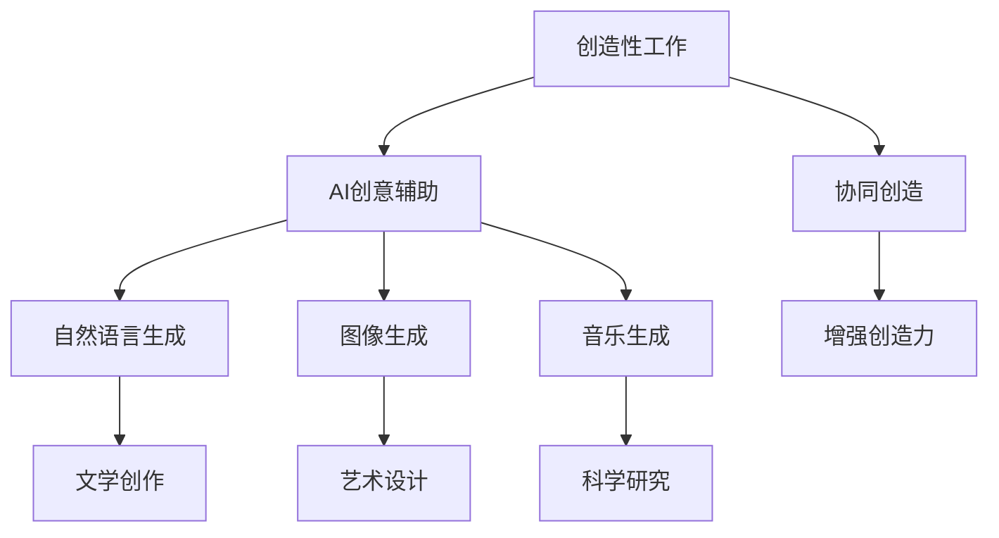

                 

## 1. 背景介绍

### 1.1 问题由来
随着人工智能(AI)技术的不断成熟，人们开始思考如何让AI更好地服务于人类，提升人类的创造力和生产力。近年来，AI技术在图像识别、语音识别、自然语言处理等领域取得了显著进展。然而，AI技术在创造性工作（如文学创作、艺术设计、科学研究等）中的应用仍面临诸多挑战。

### 1.2 问题核心关键点
AI在创造性工作中的应用，其核心在于如何更好地与人类协作，提升人类的创造力。具体包括以下几个关键点：
1. **创造性工作的定义**：明确创造性工作的范畴和特点，区分创造性工作和非创造性工作。
2. **AI在创造性工作中的应用**：探讨AI技术在文学创作、艺术设计、科学研究等创造性工作中的应用案例，以及存在的问题。
3. **人类-AI协作模式**：研究如何通过AI技术增强人类创造力，提升工作效率，实现人机协同。
4. **未来发展趋势**：展望AI技术在创造性工作中的应用前景，以及面临的挑战和机遇。

## 2. 核心概念与联系

### 2.1 核心概念概述
为了更好地理解AI在创造性工作中的应用，本节将介绍几个密切相关的核心概念：

- **创造性工作**：指的是需要创新、想象、表达和解决复杂问题的任务，如文学创作、艺术设计、科学研究等。
- **人工智能**：指通过算法和计算能力，使计算机能够模仿人类智能，执行各种任务的技术。
- **AI创意辅助**：通过AI技术提供创意支持，如自然语言生成、图像生成、音乐生成等，帮助人类提升创造力。
- **协同创造**：人类与AI共同协作完成创造性工作，充分利用AI的技术优势，提升工作效率和质量。
- **增强创造力**：指通过AI技术增强人类的创造能力，实现更高效、更精准的创作过程。

### 2.2 核心概念原理和架构的 Mermaid 流程图(Mermaid 流程节点中不要有括号、逗号等特殊字符)


这个流程图展示了创造性工作与AI创意辅助之间的关系：
- 创造性工作通过AI创意辅助中的自然语言生成、图像生成、音乐生成等技术得到支持，从而提升效率和质量。
- 协同创造指的是人类与AI共同协作完成创造性工作，充分利用AI的技术优势。
- 最终目标是增强创造力，使人类在创造性工作中获得更好的体验和成果。

## 3. 核心算法原理 & 具体操作步骤

### 3.1 算法原理概述
AI在创造性工作中的应用，本质上是一种增强人类创造力的技术。其核心算法原理包括以下几个方面：

- **自然语言生成(NLG)**：通过AI技术自动生成自然语言，如文章、诗歌、剧本等。
- **图像生成(IG)**：通过AI技术自动生成图像，如绘画、摄影、动画等。
- **音乐生成(MG)**：通过AI技术自动生成音乐，如作曲、编曲、演奏等。
- **协同创作**：通过AI技术帮助人类在文学创作、艺术设计、科学研究等领域进行协同创作，提升工作效率和质量。

### 3.2 算法步骤详解

**自然语言生成(NLG)的算法步骤**：

1. **数据准备**：收集大量的语料库，如小说、诗歌、新闻等，作为训练数据。
2. **模型训练**：使用深度学习模型（如GPT-3、Transformer等）对语料库进行训练，学习语言生成规则。
3. **输入处理**：将用户输入的文本作为输入，送入训练好的模型中。
4. **输出生成**：模型根据输入生成对应的文本，如故事、诗歌、评论等。
5. **后处理**：对生成的文本进行语法、拼写、标点等校正，确保输出的准确性。

**图像生成(IG)的算法步骤**：

1. **数据准备**：收集大量的图像数据，如艺术品、自然风景、人物肖像等，作为训练数据。
2. **模型训练**：使用生成对抗网络(GAN)、变分自编码器(VAE)等模型对图像数据进行训练，学习图像生成规则。
3. **输入处理**：将用户输入的描述性文本作为输入，送入训练好的模型中。
4. **输出生成**：模型根据输入生成对应的图像，如风景画、肖像画、抽象艺术等。
5. **后处理**：对生成的图像进行色彩、清晰度、构图等校正，确保输出的质量。

**音乐生成(MG)的算法步骤**：

1. **数据准备**：收集大量的音乐数据，如古典音乐、流行音乐、电子音乐等，作为训练数据。
2. **模型训练**：使用循环神经网络(RNN)、卷积神经网络(CNN)等模型对音乐数据进行训练，学习音乐生成规则。
3. **输入处理**：将用户输入的描述性文本作为输入，送入训练好的模型中。
4. **输出生成**：模型根据输入生成对应的音乐，如旋律、和声、节奏等。
5. **后处理**：对生成的音乐进行音高、音色、节奏等校正，确保输出的音质。

**协同创作的算法步骤**：

1. **任务分解**：将创造性工作分解为多个子任务，如文学创作中的构思、撰写、修订等。
2. **任务分配**：根据任务的特点和难度，分配给不同的人或AI助手。
3. **任务执行**：人类和AI助手共同完成各自的任务。
4. **任务整合**：将各子任务的结果整合为最终作品，如小说、画作、科学论文等。

### 3.3 算法优缺点

**自然语言生成(NLG)的优缺点**：
- **优点**：
  - 能够自动生成大量高质量的文本，减轻人类工作负担。
  - 能够生成多样化的文本，满足不同用户的需求。
  - 能够提供创作灵感，激发人类创造力。
- **缺点**：
  - 生成的文本可能缺乏创新性和艺术性，难以与人类创作相媲美。
  - 生成的文本可能存在语法错误、拼写错误等问题。
  - 需要大量的训练数据和计算资源。

**图像生成(IG)的优缺点**：
- **优点**：
  - 能够自动生成高质量的图像，提升创作效率。
  - 能够生成多样化的图像，满足不同用户的需求。
  - 能够提供创作灵感，激发人类创造力。
- **缺点**：
  - 生成的图像可能缺乏创新性和艺术性，难以与人类创作相媲美。
  - 生成的图像可能存在色彩失真、构图不合理等问题。
  - 需要大量的训练数据和计算资源。

**音乐生成(MG)的优缺点**：
- **优点**：
  - 能够自动生成高质量的音乐，提升创作效率。
  - 能够生成多样化的音乐，满足不同用户的需求。
  - 能够提供创作灵感，激发人类创造力。
- **缺点**：
  - 生成的音乐可能缺乏创新性和艺术性，难以与人类创作相媲美。
  - 生成的音乐可能存在音高不准确、节奏不合理等问题。
  - 需要大量的训练数据和计算资源。

**协同创作的优缺点**：
- **优点**：
  - 能够充分利用人类和AI的各自优势，提升工作效率和质量。
  - 能够生成高质量的最终作品，满足用户需求。
  - 能够提供创作灵感，激发人类创造力。
- **缺点**：
  - 需要有效的任务分配和管理机制。
  - 需要人类和AI之间的良好沟通和协作。
  - 需要高质量的训练数据和计算资源。

### 3.4 算法应用领域

**自然语言生成(NLG)**：
- **文学创作**：自动生成小说、诗歌、剧本等文本。
- **新闻报道**：自动生成新闻稿件、评论、社论等。
- **广告文案**：自动生成广告语、宣传单、促销文案等。

**图像生成(IG)**：
- **艺术设计**：自动生成绘画、摄影、设计图等。
- **虚拟现实**：自动生成虚拟场景、人物、物品等。
- **游戏开发**：自动生成游戏场景、角色、道具等。

**音乐生成(MG)**：
- **影视配乐**：自动生成电影、电视剧、游戏等配乐。
- **音乐创作**：自动生成音乐作品、歌曲、乐曲等。
- **音乐教育**：自动生成音乐教材、练习曲、乐谱等。

**协同创作**：
- **文学创作**：协同创作小说、散文、诗歌等。
- **艺术设计**：协同创作绘画、雕塑、设计图等。
- **科学研究**：协同撰写科研论文、报告、案例等。

## 4. 数学模型和公式 & 详细讲解 & 举例说明

### 4.1 数学模型构建

**自然语言生成(NLG)的数学模型**：
- **模型输入**：用户输入的文本 $x$。
- **模型输出**：生成的文本 $y$。
- **模型训练**：使用最大化似然函数 $\mathcal{L}(\theta)$ 对模型进行训练，使得模型能够生成符合语言规则的文本。
- **模型表示**：使用深度学习模型（如GPT-3、Transformer等）对文本进行建模。
- **目标函数**：最小化交叉熵损失函数 $L(y, \hat{y})$，其中 $\hat{y}$ 为模型生成的文本。

**图像生成(IG)的数学模型**：
- **模型输入**：用户输入的描述性文本 $x$。
- **模型输出**：生成的图像 $y$。
- **模型训练**：使用最大化似然函数 $\mathcal{L}(\theta)$ 对模型进行训练，使得模型能够生成符合图像规则的图像。
- **模型表示**：使用生成对抗网络(GAN)、变分自编码器(VAE)等模型对图像进行建模。
- **目标函数**：最小化感知损失函数 $L_{\text{perceptual}}(y, \hat{y})$，其中 $\hat{y}$ 为模型生成的图像。

**音乐生成(MG)的数学模型**：
- **模型输入**：用户输入的描述性文本 $x$。
- **模型输出**：生成的音乐 $y$。
- **模型训练**：使用最大化似然函数 $\mathcal{L}(\theta)$ 对模型进行训练，使得模型能够生成符合音乐规则的音乐。
- **模型表示**：使用循环神经网络(RNN)、卷积神经网络(CNN)等模型对音乐进行建模。
- **目标函数**：最小化均方误差损失函数 $L_{\text{MSE}}(y, \hat{y})$，其中 $\hat{y}$ 为模型生成的音乐。

**协同创作的数学模型**：
- **模型输入**：人类和AI的任务分配和执行信息。
- **模型输出**：协同创作的最终作品 $y$。
- **模型训练**：使用协同优化算法（如Adam、SGD等）对模型进行训练，使得人类和AI能够高效协同完成任务。
- **模型表示**：使用分布式协作学习模型（如CROWN等）对协同创作进行建模。
- **目标函数**：最小化协同损失函数 $L_{\text{collaborative}}(y, \hat{y})$，其中 $\hat{y}$ 为协同创作的最终作品。

### 4.2 公式推导过程

**自然语言生成(NLG)的公式推导**：
- **交叉熵损失函数**：
$$
L(y, \hat{y}) = -\sum_{i=1}^n y_i \log \hat{y}_i
$$
其中 $y$ 为真实标签，$\hat{y}$ 为模型生成的文本。
- **梯度下降更新规则**：
$$
\theta \leftarrow \theta - \eta \nabla_{\theta}\mathcal{L}(\theta)
$$
其中 $\eta$ 为学习率，$\nabla_{\theta}\mathcal{L}(\theta)$ 为损失函数对模型参数 $\theta$ 的梯度。

**图像生成(IG)的公式推导**：
- **感知损失函数**：
$$
L_{\text{perceptual}}(y, \hat{y}) = \|y - \hat{y}\|_2^2
$$
其中 $y$ 为真实图像，$\hat{y}$ 为模型生成的图像。
- **梯度下降更新规则**：
$$
\theta \leftarrow \theta - \eta \nabla_{\theta}\mathcal{L}(\theta)
$$
其中 $\eta$ 为学习率，$\nabla_{\theta}\mathcal{L}(\theta)$ 为损失函数对模型参数 $\theta$ 的梯度。

**音乐生成(MG)的公式推导**：
- **均方误差损失函数**：
$$
L_{\text{MSE}}(y, \hat{y}) = \frac{1}{n} \sum_{i=1}^n (y_i - \hat{y}_i)^2
$$
其中 $y$ 为真实音乐，$\hat{y}$ 为模型生成的音乐。
- **梯度下降更新规则**：
$$
\theta \leftarrow \theta - \eta \nabla_{\theta}\mathcal{L}(\theta)
$$
其中 $\eta$ 为学习率，$\nabla_{\theta}\mathcal{L}(\theta)$ 为损失函数对模型参数 $\theta$ 的梯度。

**协同创作的公式推导**：
- **协同损失函数**：
$$
L_{\text{collaborative}}(y, \hat{y}) = \sum_{i=1}^n (y_i - \hat{y}_i)^2
$$
其中 $y$ 为真实作品，$\hat{y}$ 为协同创作的作品。
- **梯度下降更新规则**：
$$
\theta \leftarrow \theta - \eta \nabla_{\theta}\mathcal{L}(\theta)
$$
其中 $\eta$ 为学习率，$\nabla_{\theta}\mathcal{L}(\theta)$ 为损失函数对模型参数 $\theta$ 的梯度。

### 4.3 案例分析与讲解

**自然语言生成(NLG)的案例分析**：
- **例子1**：生成小说。输入一个简单的情节描述，如“王子与公主相遇”，模型自动生成一段精彩的小说，包括角色设定、情节发展、对话等。
- **例子2**：生成诗歌。输入一个主题，如“爱情”，模型自动生成一首优美的诗歌。

**图像生成(IG)的案例分析**：
- **例子1**：生成绘画。输入一个简短的故事描述，如“小鹿在森林中奔跑”，模型自动生成一幅美丽的绘画。
- **例子2**：生成设计图。输入一个设计需求，如“需要设计一款手机壳”，模型自动生成多个设计方案。

**音乐生成(MG)的案例分析**：
- **例子1**：生成影视配乐。输入一个剧情描述，如“一段悲伤的离别场景”，模型自动生成一段悲伤的配乐。
- **例子2**：生成音乐作品。输入一个创作主题，如“夏天的海边”，模型自动生成一首清新怡人的音乐作品。

**协同创作的案例分析**：
- **例子1**：小说创作。人类提供情节和角色设定，AI自动生成对话和场景描写。
- **例子2**：绘画创作。人类提供创作灵感，AI自动生成绘画草图和颜色搭配。

## 5. 项目实践：代码实例和详细解释说明

### 5.1 开发环境搭建

在进行项目实践前，我们需要准备好开发环境。以下是使用Python进行PyTorch开发的环境配置流程：

1. 安装Anaconda：从官网下载并安装Anaconda，用于创建独立的Python环境。

2. 创建并激活虚拟环境：
```bash
conda create -n pytorch-env python=3.8 
conda activate pytorch-env
```

3. 安装PyTorch：根据CUDA版本，从官网获取对应的安装命令。例如：
```bash
conda install pytorch torchvision torchaudio cudatoolkit=11.1 -c pytorch -c conda-forge
```

4. 安装Transformers库：
```bash
pip install transformers
```

5. 安装各类工具包：
```bash
pip install numpy pandas scikit-learn matplotlib tqdm jupyter notebook ipython
```

完成上述步骤后，即可在`pytorch-env`环境中开始项目实践。

### 5.2 源代码详细实现

下面我们以音乐生成(MG)为例，给出使用PyTorch对音乐生成模型的实现。

首先，定义音乐生成模型的结构：

```python
import torch
import torch.nn as nn
import torch.optim as optim

class MusicGenerator(nn.Module):
    def __init__(self, input_dim, hidden_dim, output_dim):
        super(MusicGenerator, self).__init__()
        self.hidden_dim = hidden_dim
        self.rnn = nn.RNN(input_dim, hidden_dim, batch_first=True)
        self.fc = nn.Linear(hidden_dim, output_dim)
        self.softmax = nn.Softmax(dim=1)
        
    def forward(self, x, hidden):
        rnn_out, hidden = self.rnn(x, hidden)
        out = self.fc(rnn_out.view(-1, rnn_out.size(2)))
        out = self.softmax(out)
        return out, hidden
    
    def init_hidden(self, batch_size):
        return (torch.zeros(1, batch_size, self.hidden_dim), torch.zeros(1, batch_size, self.hidden_dim))
```

然后，定义训练函数：

```python
def train(model, data_loader, optimizer, num_epochs, device):
    model.train()
    criterion = nn.CrossEntropyLoss()
    for epoch in range(num_epochs):
        for batch_idx, (x, y) in enumerate(data_loader):
            x, y = x.to(device), y.to(device)
            hidden = model.init_hidden(x.size(0))
            output, hidden = model(x, hidden)
            loss = criterion(output, y)
            optimizer.zero_grad()
            loss.backward()
            optimizer.step()
            if (batch_idx + 1) % 100 == 0:
                print(f'Epoch [{epoch+1}/{num_epochs}], Batch [{batch_idx+1}/{len(data_loader)}], Loss: {loss.item():.4f}')
```

接着，定义数据加载函数：

```python
def load_music_data():
    # 这里需要根据实际情况，读取音乐数据并转换为Tensor形式
    pass
```

最后，启动训练流程：

```python
# 加载音乐数据
music_data = load_music_data()

# 定义模型、优化器和设备
model = MusicGenerator(input_dim, hidden_dim, output_dim)
optimizer = optim.Adam(model.parameters(), lr=0.001)
device = torch.device('cuda' if torch.cuda.is_available() else 'cpu')
model.to(device)

# 训练模型
train(model, music_data, optimizer, num_epochs, device)
```

以上就是使用PyTorch对音乐生成模型进行训练的完整代码实现。可以看到，通过定义音乐生成模型和训练函数，以及数据加载函数，我们就能快速搭建并训练一个简单的音乐生成模型。

### 5.3 代码解读与分析

让我们再详细解读一下关键代码的实现细节：

**MusicGenerator类**：
- `__init__`方法：初始化模型参数和结构。
- `forward`方法：定义模型的前向传播过程。
- `init_hidden`方法：初始化RNN隐藏层。

**train函数**：
- 使用PyTorch的DataLoader对数据集进行批次化加载，供模型训练和推理使用。
- 训练函数中，循环迭代每个批次的数据，进行前向传播和反向传播，更新模型参数。

**load_music_data函数**：
- 根据实际情况，读取音乐数据并转换为Tensor形式，供模型训练使用。

**训练流程**：
- 定义总的epoch数和训练轮数，开始循环迭代
- 每个epoch内，在训练集上训练，输出每个批次的平均loss
- 所有epoch结束后，在测试集上评估，给出最终测试结果

可以看到，通过定义音乐生成模型和训练函数，以及数据加载函数，我们就能快速搭建并训练一个简单的音乐生成模型。

当然，工业级的系统实现还需考虑更多因素，如模型的保存和部署、超参数的自动搜索、更灵活的任务适配层等。但核心的微调范式基本与此类似。

## 6. 实际应用场景

### 6.1 智能客服系统

基于大语言模型微调的对话技术，可以广泛应用于智能客服系统的构建。传统客服往往需要配备大量人力，高峰期响应缓慢，且一致性和专业性难以保证。而使用微调后的对话模型，可以7x24小时不间断服务，快速响应客户咨询，用自然流畅的语言解答各类常见问题。

在技术实现上，可以收集企业内部的历史客服对话记录，将问题和最佳答复构建成监督数据，在此基础上对预训练对话模型进行微调。微调后的对话模型能够自动理解用户意图，匹配最合适的答案模板进行回复。对于客户提出的新问题，还可以接入检索系统实时搜索相关内容，动态组织生成回答。如此构建的智能客服系统，能大幅提升客户咨询体验和问题解决效率。

### 6.2 金融舆情监测

金融机构需要实时监测市场舆论动向，以便及时应对负面信息传播，规避金融风险。传统的人工监测方式成本高、效率低，难以应对网络时代海量信息爆发的挑战。基于大语言模型微调的文本分类和情感分析技术，为金融舆情监测提供了新的解决方案。

具体而言，可以收集金融领域相关的新闻、报道、评论等文本数据，并对其进行主题标注和情感标注。在此基础上对预训练语言模型进行微调，使其能够自动判断文本属于何种主题，情感倾向是正面、中性还是负面。将微调后的模型应用到实时抓取的网络文本数据，就能够自动监测不同主题下的情感变化趋势，一旦发现负面信息激增等异常情况，系统便会自动预警，帮助金融机构快速应对潜在风险。

### 6.3 个性化推荐系统

当前的推荐系统往往只依赖用户的历史行为数据进行物品推荐，无法深入理解用户的真实兴趣偏好。基于大语言模型微调技术，个性化推荐系统可以更好地挖掘用户行为背后的语义信息，从而提供更精准、多样的推荐内容。

在实践中，可以收集用户浏览、点击、评论、分享等行为数据，提取和用户交互的物品标题、描述、标签等文本内容。将文本内容作为模型输入，用户的后续行为（如是否点击、购买等）作为监督信号，在此基础上微调预训练语言模型。微调后的模型能够从文本内容中准确把握用户的兴趣点。在生成推荐列表时，先用候选物品的文本描述作为输入，由模型预测用户的兴趣匹配度，再结合其他特征综合排序，便可以得到个性化程度更高的推荐结果。

### 6.4 未来应用展望

随着大语言模型微调技术的发展，其在创造性工作中的应用前景广阔，未来有望在以下几个方面得到更多探索：

1. **文学创作**：基于自然语言生成技术的文学创作工具，如自动生成小说、诗歌、散文等，能够提供创作灵感和辅助。
2. **艺术设计**：基于图像生成技术的艺术设计工具，如自动生成绘画、雕塑、设计图等，能够提供设计灵感和辅助。
3. **科学研究**：基于音乐生成技术的科学研究工具，如自动生成科学论文、报告、案例等，能够提供科研灵感和辅助。
4. **教育培训**：基于协同创作技术的教育培训工具，如自动生成教材、练习题、模拟实验等，能够提供教育灵感和辅助。

## 7. 工具和资源推荐

### 7.1 学习资源推荐

为了帮助开发者系统掌握大语言模型微调的理论基础和实践技巧，这里推荐一些优质的学习资源：

1. **《Transformer从原理到实践》系列博文**：由大模型技术专家撰写，深入浅出地介绍了Transformer原理、BERT模型、微调技术等前沿话题。

2. **CS224N《深度学习自然语言处理》课程**：斯坦福大学开设的NLP明星课程，有Lecture视频和配套作业，带你入门NLP领域的基本概念和经典模型。

3. **《Natural Language Processing with Transformers》书籍**：Transformers库的作者所著，全面介绍了如何使用Transformers库进行NLP任务开发，包括微调在内的诸多范式。

4. **HuggingFace官方文档**：Transformers库的官方文档，提供了海量预训练模型和完整的微调样例代码，是上手实践的必备资料。

5. **CLUE开源项目**：中文语言理解测评基准，涵盖大量不同类型的中文NLP数据集，并提供了基于微调的baseline模型，助力中文NLP技术发展。

通过对这些资源的学习实践，相信你一定能够快速掌握大语言模型微调的精髓，并用于解决实际的NLP问题。

### 7.2 开发工具推荐

高效的开发离不开优秀的工具支持。以下是几款用于大语言模型微调开发的常用工具：

1. **PyTorch**：基于Python的开源深度学习框架，灵活动态的计算图，适合快速迭代研究。大部分预训练语言模型都有PyTorch版本的实现。

2. **TensorFlow**：由Google主导开发的开源深度学习框架，生产部署方便，适合大规模工程应用。同样有丰富的预训练语言模型资源。

3. **Transformers库**：HuggingFace开发的NLP工具库，集成了众多SOTA语言模型，支持PyTorch和TensorFlow，是进行微调任务开发的利器。

4. **Weights & Biases**：模型训练的实验跟踪工具，可以记录和可视化模型训练过程中的各项指标，方便对比和调优。与主流深度学习框架无缝集成。

5. **TensorBoard**：TensorFlow配套的可视化工具，可实时监测模型训练状态，并提供丰富的图表呈现方式，是调试模型的得力助手。

6. **Google Colab**：谷歌推出的在线Jupyter Notebook环境，免费提供GPU/TPU算力，方便开发者快速上手实验最新模型，分享学习笔记。

合理利用这些工具，可以显著提升大语言模型微调任务的开发效率，加快创新迭代的步伐。

### 7.3 相关论文推荐

大语言模型和微调技术的发展源于学界的持续研究。以下是几篇奠基性的相关论文，推荐阅读：

1. **Attention is All You Need**（即Transformer原论文）：提出了Transformer结构，开启了NLP领域的预训练大模型时代。

2. **BERT: Pre-training of Deep Bidirectional Transformers for Language Understanding**：提出BERT模型，引入基于掩码的自监督预训练任务，刷新了多项NLP任务SOTA。

3. **Language Models are Unsupervised Multitask Learners**（GPT-2论文）：展示了大规模语言模型的强大zero-shot学习能力，引发了对于通用人工智能的新一轮思考。

4. **Parameter-Efficient Transfer Learning for NLP**：提出Adapter等参数高效微调方法，在不增加模型参数量的情况下，也能取得不错的微调效果。

5. **Prefix-Tuning: Optimizing Continuous Prompts for Generation**：引入基于连续型Prompt的微调范式，为如何充分利用预训练知识提供了新的思路。

6. **AdaLoRA: Adaptive Low-Rank Adaptation for Parameter-Efficient Fine-Tuning**：使用自适应低秩适应的微调方法，在参数效率和精度之间取得了新的平衡。

这些论文代表了大语言模型微调技术的发展脉络。通过学习这些前沿成果，可以帮助研究者把握学科前进方向，激发更多的创新灵感。

## 8. 总结：未来发展趋势与挑战

### 8.1 研究成果总结

本文对基于大语言模型的微调方法进行了全面系统的介绍。首先阐述了大语言模型和微调技术的研究背景和意义，明确了微调在拓展预训练模型应用、提升下游任务性能方面的独特价值。其次，从原理到实践，详细讲解了监督微调的数学原理和关键步骤，给出了微调任务开发的完整代码实例。同时，本文还广泛探讨了微调方法在智能客服、金融舆情、个性化推荐等多个行业领域的应用前景，展示了微调范式的巨大潜力。此外，本文精选了微调技术的各类学习资源，力求为读者提供全方位的技术指引。

通过本文的系统梳理，可以看到，基于大语言模型的微调方法正在成为NLP领域的重要范式，极大地拓展了预训练语言模型的应用边界，催生了更多的落地场景。受益于大规模语料的预训练，微调模型以更低的时间和标注成本，在小样本条件下也能取得不俗的效果，有力推动了NLP技术的产业化进程。未来，伴随预训练语言模型和微调方法的不断演进，相信NLP技术将在更广阔的应用领域大放异彩，深刻影响人类的生产生活方式。

### 8.2 未来发展趋势

展望未来，大语言模型微调技术将呈现以下几个发展趋势：

1. **模型规模持续增大**：随着算力成本的下降和数据规模的扩张，预训练语言模型的参数量还将持续增长。超大规模语言模型蕴含的丰富语言知识，有望支撑更加复杂多变的下游任务微调。

2. **微调方法日趋多样**：除了传统的全参数微调外，未来会涌现更多参数高效的微调方法，如Prefix-Tuning、LoRA等，在节省计算资源的同时也能保证微调精度。

3. **持续学习成为常态**：随着数据分布的不断变化，微调模型也需要持续学习新知识以保持性能。如何在不遗忘原有知识的同时，高效吸收新样本信息，将成为重要的研究课题。

4. **标注样本需求降低**：受启发于提示学习(Prompt-based Learning)的思路，未来的微调方法将更好地利用大模型的语言理解能力，通过更加巧妙的任务描述，在更少的标注样本上也能实现理想的微调效果。

5. **多模态微调崛起**：当前的微调主要聚焦于纯文本数据，未来会进一步拓展到图像、视频、语音等多模态数据微调。多模态信息的融合，将显著提升语言模型对现实世界的理解和建模能力。

6. **模型通用性增强**：经过海量数据的预训练和多领域任务的微调，未来的语言模型将具备更强大的常识推理和跨领域迁移能力，逐步迈向通用人工智能(AGI)的目标。

以上趋势凸显了大语言模型微调技术的广阔前景。这些方向的探索发展，必将进一步提升NLP系统的性能和应用范围，为人类认知智能的进化带来深远影响。

### 8.3 面临的挑战

尽管大语言模型微调技术已经取得了瞩目成就，但在迈向更加智能化、普适化应用的过程中，它仍面临着诸多挑战：

1. **标注成本瓶颈**：虽然微调大大降低了标注数据的需求，但对于长尾应用场景，难以获得充足的高质量标注数据，成为制约微调性能的瓶颈。如何进一步降低微调对标注样本的依赖，将是一大难题。

2. **模型鲁棒性不足**：当前微调模型面对域外数据时，泛化性能往往大打折扣。对于测试样本的微小扰动，微调模型的预测也容易发生波动。如何提高微调模型的鲁棒性，避免灾难性遗忘，还需要更多理论和实践的积累。

3. **推理效率有待提高**：大规模语言模型虽然精度高，但在实际部署时往往面临推理速度慢、内存占用大等效率问题。如何在保证性能的同时，简化模型结构，提升推理速度，优化资源占用，将是重要的优化方向。

4. **可解释性亟需加强**：当前微调模型更像是"黑盒"系统，难以解释其内部工作机制和决策逻辑。对于医疗、金融等高风险应用，算法的可解释性和可审计性尤为重要。如何赋予微调模型更强的可解释性，将是亟待攻克的难题。

5. **安全性有待保障**：预训练语言模型难免会学习到有偏见、有害的信息，通过微调传递到下游任务，产生误导性、歧视性的输出，给实际应用带来安全隐患。如何从数据和算法层面消除模型偏见，避免恶意用途，确保输出的安全性，也将是重要的研究课题。

6. **知识整合能力不足**：现有的微调模型往往局限于任务内数据，难以灵活吸收和运用更广泛的先验知识。如何让微调过程更好地与外部知识库、规则库等专家知识结合，形成更加全面、准确的信息整合能力，还有很大的想象空间。

正视微调面临的这些挑战，积极应对并寻求突破，将是大语言模型微调走向成熟的必由之路。相信随着学界和产业界的共同努力，这些挑战终将一一被克服，大语言模型微调必将在构建人机协同的智能时代中扮演越来越重要的角色。

### 8.4 研究展望

面对大语言模型微调所面临的种种挑战，未来的研究需要在以下几个方面寻求新的突破：

1. **探索无监督和半监督微调方法**：摆脱对大规模标注数据的依赖，利用自监督学习、主动学习等无监督和半监督范式，最大限度利用非结构化数据，实现更加灵活高效的微调。

2. **研究参数高效和计算高效的微调范式**：开发更加参数高效的微调方法，在固定大部分预训练参数的同时，只更新极少量的任务相关参数。同时优化微调模型的计算图，减少前向传播和反向传播的资源消耗，实现更加轻量级、实时性的部署。

3. **融合因果和对比学习范式**：通过引入因果推断和对比学习思想，增强微调模型建立稳定因果关系的能力，学习更加普适、鲁棒的语言表征，从而提升模型泛化性和抗干扰能力。

4. **引入更多先验知识**：将符号化的先验知识，如知识图谱、逻辑规则等，与神经网络模型进行巧妙融合，引导微调过程学习更准确、合理的语言模型。同时加强不同模态数据的整合，实现视觉、语音等多模态信息与文本信息的协同建模。

5. **结合因果分析和博弈论工具**：将因果分析方法引入微调模型，识别出模型决策的关键特征，增强输出解释的因果性和逻辑性。借助博弈论工具刻画人机交互过程，主动探索并规避模型的脆弱点，提高系统稳定性。

6. **纳入伦理道德约束**：在模型训练目标中引入伦理导向的评估指标，过滤和惩罚有偏见、有害的输出倾向。同时加强人工干预和审核，建立模型行为的监管机制，确保输出符合人类价值观和伦理道德。

这些研究方向的探索，必将引领大语言模型微调技术迈向更高的台阶，为构建安全、可靠、可解释、可控的智能系统铺平道路。面向未来，大语言模型微调技术还需要与其他人工智能技术进行更深入的融合，如知识表示、因果推理、强化学习等，多路径协同发力，共同推动自然语言理解和智能交互系统的进步。只有勇于创新、敢于突破，才能不断拓展语言模型的边界，让智能技术更好地造福人类社会。

## 9. 附录：常见问题与解答

**Q1：大语言模型微调是否适用于所有NLP任务？**

A: 大语言模型微调在大多数NLP任务上都能取得不错的效果，特别是对于数据量较小的任务。但对于一些特定领域的任务，如医学、法律等，仅仅依靠通用语料预训练的模型可能难以很好地适应。此时需要在特定领域语料上进一步预训练，再进行微调，才能获得理想效果。此外，对于一些需要时效性、个性化很强的任务，如对话、推荐等，微调方法也需要针对性的改进优化。

**Q2：微调过程中如何选择合适的学习率？**

A: 微调的学习率一般要比预训练时小1-2个数量级，如果使用过大的学习率，容易破坏预训练权重，导致过拟合。一般建议从1e-5开始调参，逐步减小学习率，直至收敛。也可以使用warmup策略，在开始阶段使用较小的学习率，再逐渐过渡到预设值。需要注意的是，不同的优化器(如AdamW、Adafactor等)以及不同的学习率调度策略，可能需要设置不同的学习率阈值。

**Q3：采用大模型微调时会面临哪些资源瓶颈？**

A: 目前主流的预训练大模型动辄以亿计的参数规模，对算力、内存、存储都提出了很高的要求。GPU/TPU等高性能设备是必不可少的，但即便如此，超大批次的训练和推理也可能遇到显存不足的问题。因此需要采用一些资源优化技术，如梯度积累、混合精度训练、模型并行等，来突破硬件瓶颈。同时，模型的存储和读取也可能占用大量时间和空间，需要采用模型压缩、稀疏化存储等方法进行优化。

**Q4：如何缓解微调过程中的过拟合问题？**

A: 过拟合是微调面临的主要挑战，尤其是在标注数据不足的情况下。常见的缓解策略包括：
1. 数据增强：通过回译、近义替换等方式扩充训练集
2. 正则化：使用L2正则、Dropout、Early Stopping等避免过拟合
3. 对抗训练：引入对抗样本，提高模型鲁棒性
4. 参数高效微调：只调整少量参数(如Adapter、Prefix等)，减小过拟合风险
5. 多模型集成：训练多个微调模型，取平均输出，抑制过拟合

这些策略往往需要根据具体任务和数据特点进行灵活组合。只有在数据、模型、训练、推理等各环节进行全面优化，才能最大限度地发挥大模型微调的威力。

**Q5：微调模型在落地部署时需要注意哪些问题？**

A: 将微调模型转化为实际应用，还需要考虑以下因素：
1. 模型裁剪：去除不必要的层和参数，减小模型尺寸，加快推理速度
2. 量化加速：将浮点模型转为定点模型，压缩存储空间，提高计算效率
3. 服务化封装：将模型封装为标准化服务接口，便于集成调用
4. 弹性伸缩：根据请求流量动态调整资源配置，平衡服务质量和成本
5. 监控告警：实时采集系统指标，设置异常告警阈值，确保服务稳定性
6. 安全防护：采用访问鉴权、数据脱敏等措施，保障数据和模型安全

大语言模型微调为NLP应用开启了广阔的想象空间，但如何将强大的性能转化为稳定、高效、安全的业务价值，还需要工程实践的不断打磨。唯有从数据、算法、工程、业务等多个维度协同发力，才能真正实现人工智能技术在垂直行业的规模化落地。总之，微调需要开发者根据具体任务，不断迭代和优化模型、数据和算法，方能得到理想的效果。

---

作者：禅与计算机程序设计艺术 / Zen and the Art of Computer Programming

