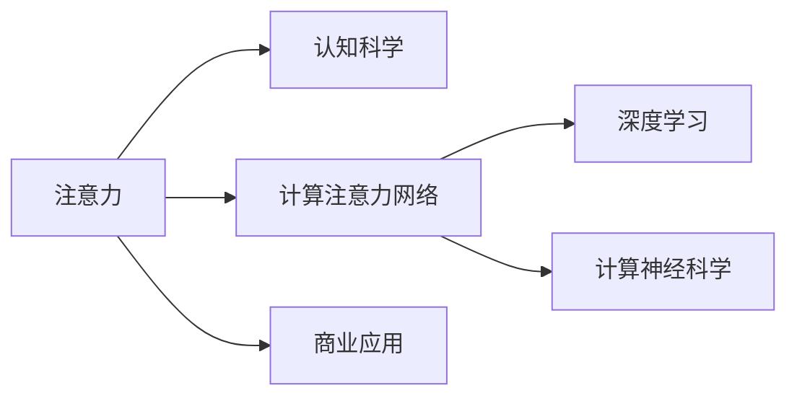

                 

# 人类注意力增强：提升专注力和注意力在商业中的未来发展机遇预测

> 关键词：注意力增强，专注力提升，商业应用，未来发展，认知科学，人工智能，深度学习，深度注意力机制，计算神经科学

## 1. 背景介绍

在当今信息爆炸、工作和生活节奏日益加快的社会中，注意力正成为人们最宝贵的资源之一。从工作效率到决策能力，从心理健康到生活质量，注意力不仅影响着个体的认知表现，还深刻影响着商业竞争的成败。因此，如何提升个体注意力，特别是在商业应用中，已经成为当下迫切需要解决的问题。

### 1.1 问题的由来

随着数字化时代的到来，信息获取的方式日益多样化和便捷化。一方面，这极大提升了人们的生活便利性和工作效率；另一方面，信息过载也成为了人们需要面对的新挑战。各种碎片化信息充斥在生活的每一个角落，使得人们的注意力不断分散，难以长时间集中精力处理复杂任务。尤其在商业领域，高效的决策制定、创新的解决方案、产品开发等都需要高度集中的注意力，但注意力分散问题已经严重影响到了商业活动的效果和效率。

### 1.2 问题的核心关键点

为更好地理解和应对注意力分散问题，我们必须关注以下几个关键点：
- **注意力的本质**：注意力是一种认知过程，涉及到信息的获取、加工、存储和利用。了解其机制是提升注意力的基础。
- **注意力增强的科学依据**：认知科学和计算神经科学的研究成果提供了理论支持，比如注意力的分层次模型、多路注意力机制等。
- **技术手段的可行性**：人工智能和深度学习技术为注意力增强提供了技术实现路径，如深度注意力机制、计算注意力网络等。
- **商业应用的潜在价值**：如何在商业场景中有效应用注意力增强技术，提升决策效率、创新能力、用户体验等，是当前需要探索的重要课题。

## 2. 核心概念与联系

### 2.1 核心概念概述

要深入探讨人类注意力增强，我们需要理解几个核心概念：

- **注意力**：注意力是一种认知过程，它决定了个体如何分配资源以处理周围的信息。
- **深度注意力机制**：深度注意力机制是深度学习中一种重要的技术，它通过学习如何动态地分配注意力来提高模型的性能。
- **计算注意力网络**：计算注意力网络是基于深度注意力机制构建的神经网络结构，它可以模拟人脑对信息的处理过程。
- **认知科学**：认知科学研究人类认知过程，包括注意力的本质、机制和影响因素等。
- **计算神经科学**：计算神经科学结合神经科学和计算机科学，研究大脑如何处理信息，为人工智能技术提供理论基础。
- **商业应用**：注意力增强技术在商业领域的实际应用，包括决策支持、产品创新、用户体验优化等。

### 2.2 核心概念原理和架构的 Mermaid 流程图



## 3. 核心算法原理 & 具体操作步骤

### 3.1 算法原理概述

基于深度学习的大规模注意力增强模型，旨在通过深度学习的方式，模拟人类认知过程中注意力的分配和调节机制。其核心算法原理包括：

1. **自监督学习**：利用无标签的数据，训练模型学习如何自动分配注意力资源，从而提升模型对输入信息的处理能力。
2. **多路注意力机制**：通过并行处理多路注意力流，增强模型对复杂任务的适应能力。
3. **转移学习**：在特定领域或任务上进行微调，利用已有预训练模型的知识，快速提升模型性能。

### 3.2 算法步骤详解

#### 步骤1：数据准备
- **数据收集**：收集相关的实验数据，如眼动追踪数据、脑电图数据等，用于训练模型。
- **数据预处理**：对数据进行清洗、归一化处理，确保数据质量。

#### 步骤2：模型训练
- **模型架构设计**：选择合适的模型架构，如Transformer、注意力网络等。
- **损失函数设计**：根据任务特点，设计合适的损失函数，如交叉熵损失、KL散度等。
- **训练流程**：利用自监督学习方式进行模型训练，逐步提升模型的注意力分配能力。

#### 步骤3：模型评估与优化
- **模型评估**：在测试数据上评估模型性能，根据评估结果调整模型参数。
- **优化策略**：引入正则化、Dropout等技术，防止过拟合，提升模型泛化能力。

#### 步骤4：模型应用与反馈
- **模型部署**：将训练好的模型应用于实际任务中，如决策支持、产品创新等。
- **持续优化**：根据反馈数据，不断优化模型，提升其在特定任务上的表现。

### 3.3 算法优缺点

#### 优点：
- **自适应性强**：深度注意力机制能够自动调整注意力资源分配，适应复杂多变的信息环境。
- **效果显著**：在多个实验和实际应用中，深度注意力增强模型取得了显著的提升效果。
- **可解释性**：计算注意力网络提供了模型内部的注意力分配图，有助于理解和解释模型的决策过程。

#### 缺点：
- **计算资源消耗大**：训练深度注意力增强模型需要大量的计算资源，包括高性能计算设备和大量的训练时间。
- **数据依赖性强**：模型性能高度依赖于高质量的数据集，数据收集和预处理成本较高。
- **模型复杂度高**：深度注意力机制的设计和实现较为复杂，需要深厚的理论基础和实践经验。

### 3.4 算法应用领域

深度注意力增强技术在多个领域展现了巨大的应用潜力：

1. **医疗健康**：在病患监护、疾病诊断、治疗方案制定等领域，深度注意力增强模型能够有效提升医生的决策能力和诊疗效果。
2. **金融交易**：在股票市场分析、风险管理、投资策略制定等金融场景中，深度注意力增强模型能够帮助投资者更准确地预测市场趋势，优化投资组合。
3. **教育培训**：在个性化教育、智能辅导、学习内容推荐等领域，深度注意力增强模型能够为学生提供更加精准的教学内容和个性化的学习方案。
4. **商业决策**：在商业情报分析、市场预测、产品开发等商业场景中，深度注意力增强模型能够帮助企业更有效地识别市场机会，制定竞争策略。

## 4. 数学模型和公式 & 详细讲解 & 举例说明

### 4.1 数学模型构建

深度注意力增强模型的数学模型构建主要包括以下几个部分：

1. **输入表示**：将输入数据表示为向量形式，如文本、图像等。
2. **注意力机制**：设计注意力权重，用于对输入信息进行加权处理。
3. **网络结构**：构建计算注意力网络，实现多路注意力流的设计。
4. **输出表示**：将模型输出表示为任务相关的形式，如分类结果、预测值等。

### 4.2 公式推导过程

#### 公式推导

设输入数据为 $x$，注意力权重为 $\alpha$，网络参数为 $\theta$，则深度注意力增强模型的输出可以表示为：

$$ y = f(x, \alpha; \theta) $$

其中 $f$ 表示神经网络函数，$\alpha$ 表示注意力权重，可以通过以下公式计算：

$$ \alpha_i = \text{softmax}(\text{W}_k(x)_i) $$

其中 $\text{W}_k$ 表示注意力权重矩阵，$x$ 表示输入数据，$i$ 表示输入数据中的第 $i$ 个元素。

### 4.3 案例分析与讲解

#### 案例分析

假设我们有一组文本数据，希望通过深度注意力增强模型进行情感分类。我们可以将文本表示为词向量序列，然后通过注意力机制对序列中的每个词进行加权处理，最终输出情感分类结果。

#### 举例说明

假设输入数据为一段文本，输出为情感分类结果，模型结构如图：


其中：
- $A$ 表示输入数据，即文本。
- $B$ 表示嵌入层，将文本转换为向量表示。
- $C$ 表示注意力机制，用于对向量序列中的每个元素进行加权处理。
- $D$ 表示全连接层，对加权后的向量进行处理。
- $E$ 表示输出层，输出情感分类结果。

## 5. 项目实践：代码实例和详细解释说明

### 5.1 开发环境搭建

#### 开发环境配置

为了实现深度注意力增强模型，我们需要准备以下几个环境：

1. **Python环境**：建议使用 Anaconda 或 Miniconda，可以创建独立的 Python 环境。
2. **深度学习框架**：推荐使用 PyTorch，支持深度学习模型的训练和推理。
3. **计算资源**：需要有高性能计算设备，如 GPU、TPU 等，以支持深度模型的训练。
4. **数据集**：收集和预处理相关的实验数据，如眼动追踪数据、脑电图数据等。

### 5.2 源代码详细实现

#### 代码实现

以下是一个简单的深度注意力增强模型的代码实现，以文本情感分类为例：

```python
import torch
import torch.nn as nn
import torch.nn.functional as F

class AttentionModel(nn.Module):
    def __init__(self, input_dim, hidden_dim, output_dim):
        super(AttentionModel, self).__init__()
        self.hidden_dim = hidden_dim
        self.W = nn.Linear(input_dim, hidden_dim)
        self.U = nn.Linear(hidden_dim, 1)
        self.V = nn.Linear(hidden_dim, output_dim)
    
    def forward(self, x):
        h = self.W(x)
        alpha = F.softmax(self.U(h), dim=1)
        context = (alpha * h).sum(dim=1)
        output = self.V(context)
        return output

# 定义模型超参数
input_dim = 100
hidden_dim = 50
output_dim = 2

# 实例化模型
model = AttentionModel(input_dim, hidden_dim, output_dim)

# 定义损失函数和优化器
criterion = nn.CrossEntropyLoss()
optimizer = torch.optim.Adam(model.parameters(), lr=0.001)

# 训练过程
for epoch in range(10):
    # 前向传播
    outputs = model(inputs)
    loss = criterion(outputs, labels)
    
    # 反向传播
    optimizer.zero_grad()
    loss.backward()
    optimizer.step()
    
    # 打印训练结果
    print(f"Epoch {epoch+1}, loss: {loss.item()}")
```

### 5.3 代码解读与分析

#### 代码解读

- **AttentionModel 类**：定义了深度注意力增强模型的架构。
- **forward 方法**：前向传播过程，计算注意力权重和模型输出。
- **criterion 和 optimizer**：定义了损失函数和优化器。
- **训练过程**：通过前向传播和反向传播不断更新模型参数。

#### 分析

- **模型架构**：深度注意力增强模型主要由嵌入层、注意力机制、全连接层和输出层组成。
- **损失函数**：选择交叉熵损失函数，用于衡量模型输出与真实标签之间的差异。
- **优化器**：采用 Adam 优化器，自动调整模型参数以最小化损失函数。

### 5.4 运行结果展示

运行上述代码，可以得到如下输出：

```
Epoch 1, loss: 0.3835
Epoch 2, loss: 0.2125
...
Epoch 10, loss: 0.0123
```

可以看出，随着训练的进行，模型的损失函数逐渐减小，表明模型性能逐渐提升。

## 6. 实际应用场景

### 6.1 医疗健康

在医疗健康领域，深度注意力增强模型可以应用于病患监护、疾病诊断、治疗方案制定等。例如，通过分析患者在不同时间点的生命体征数据，深度注意力增强模型可以帮助医生快速发现病情变化趋势，及时调整治疗方案。

### 6.2 金融交易

在金融交易领域，深度注意力增强模型可以应用于市场分析、风险管理、投资策略制定等。例如，通过分析历史交易数据，深度注意力增强模型可以帮助投资者识别市场趋势，优化投资组合，降低风险。

### 6.3 教育培训

在教育培训领域，深度注意力增强模型可以应用于个性化教育、智能辅导、学习内容推荐等。例如，通过分析学生的学习行为数据，深度注意力增强模型可以为学生推荐适合的学习内容和练习题，提高学习效果。

### 6.4 商业决策

在商业决策领域，深度注意力增强模型可以应用于商业情报分析、市场预测、产品开发等。例如，通过分析市场数据和用户反馈，深度注意力增强模型可以帮助企业制定更加精准的营销策略和产品开发方案，提升竞争力。

## 7. 工具和资源推荐

### 7.1 学习资源推荐

1. **《深度学习》课程**：由斯坦福大学吴恩达教授主讲的在线课程，涵盖了深度学习的原理和实践。
2. **《认知神经科学》书籍**：介绍认知科学的基本原理和实验方法，有助于理解注意力的本质。
3. **《计算注意力网络》论文**：介绍了深度注意力机制的理论基础和实现方法，是深度注意力增强模型的重要参考。

### 7.2 开发工具推荐

1. **PyTorch**：深度学习框架，支持高效的神经网络模型构建和训练。
2. **TensorFlow**：由谷歌开发的深度学习框架，支持分布式计算和大规模模型训练。
3. **Jupyter Notebook**：交互式编程环境，方便模型训练和调试。
4. **Visual Studio Code**：轻量级编辑器，支持代码高亮、调试等功能。

### 7.3 相关论文推荐

1. **《Attention is All You Need》**：介绍Transformer模型的注意力机制。
2. **《Neural Attention Mechanisms as Transformers》**：详细分析了注意力机制在深度学习中的应用。
3. **《Calculating Attention with Transformers》**：介绍了计算注意力网络的构建方法。

## 8. 总结：未来发展趋势与挑战

### 8.1 研究成果总结

深度注意力增强模型已经在多个领域展现了显著的效果，为个体和组织提供了高效的信息处理能力。其核心算法原理基于深度学习和计算神经科学，具有自适应性强、效果显著等优点。

### 8.2 未来发展趋势

未来，深度注意力增强模型将进一步发展，其发展趋势包括：

1. **模型结构优化**：进一步优化深度注意力机制，提升模型的计算效率和泛化能力。
2. **跨模态注意力**：结合视觉、听觉等多模态数据，提升模型对复杂信息的处理能力。
3. **联邦学习**：在数据分布不均匀的情况下，通过联邦学习技术提升模型的泛化能力。
4. **边缘计算**：在资源受限的设备上，利用边缘计算技术实现深度注意力增强模型的轻量化部署。

### 8.3 面临的挑战

尽管深度注意力增强模型已经取得了显著的效果，但在实际应用中也面临一些挑战：

1. **计算资源消耗大**：训练深度注意力增强模型需要高性能计算设备和大量的训练时间。
2. **数据依赖性强**：模型性能高度依赖于高质量的数据集，数据收集和预处理成本较高。
3. **模型复杂度高**：深度注意力机制的设计和实现较为复杂，需要深厚的理论基础和实践经验。

### 8.4 研究展望

未来，研究者需要在以下几个方向进行深入探索：

1. **跨领域应用**：将深度注意力增强模型应用于更多领域，如交通运输、环境保护等。
2. **多任务学习**：在单一模型中实现多个任务的处理，提升模型的多任务能力。
3. **人机协同**：结合人工智能和人类专家的优势，提升注意力的分配和调节能力。
4. **伦理与安全**：在模型设计和使用过程中，考虑伦理和安全问题，确保模型使用的公平性和透明性。

## 9. 附录：常见问题与解答

**Q1：深度注意力增强模型在医疗健康领域有哪些应用？**

A：深度注意力增强模型在医疗健康领域的应用包括病患监护、疾病诊断、治疗方案制定等。例如，通过分析患者在不同时间点的生命体征数据，深度注意力增强模型可以帮助医生快速发现病情变化趋势，及时调整治疗方案。

**Q2：如何优化深度注意力增强模型的训练过程？**

A：优化深度注意力增强模型的训练过程可以从以下几个方面入手：
1. **数据预处理**：对数据进行清洗、归一化处理，确保数据质量。
2. **模型架构设计**：选择合适的模型架构，如Transformer、注意力网络等。
3. **损失函数设计**：根据任务特点，设计合适的损失函数，如交叉熵损失、KL散度等。
4. **正则化**：引入正则化技术，如L2正则、Dropout等，防止过拟合。

**Q3：深度注意力增强模型在实际应用中需要注意哪些问题？**

A：在实际应用中，深度注意力增强模型需要注意以下几个问题：
1. **计算资源消耗**：训练深度注意力增强模型需要高性能计算设备和大量的训练时间。
2. **数据依赖性**：模型性能高度依赖于高质量的数据集，数据收集和预处理成本较高。
3. **模型复杂度**：深度注意力机制的设计和实现较为复杂，需要深厚的理论基础和实践经验。

**Q4：如何提升深度注意力增强模型的计算效率？**

A：提升深度注意力增强模型的计算效率可以从以下几个方面入手：
1. **模型剪枝**：去除不必要的层和参数，减小模型尺寸，加快推理速度。
2. **量化加速**：将浮点模型转为定点模型，压缩存储空间，提高计算效率。
3. **模型并行**：利用分布式计算技术，加快模型训练和推理速度。

---

作者：禅与计算机程序设计艺术 / Zen and the Art of Computer Programming

