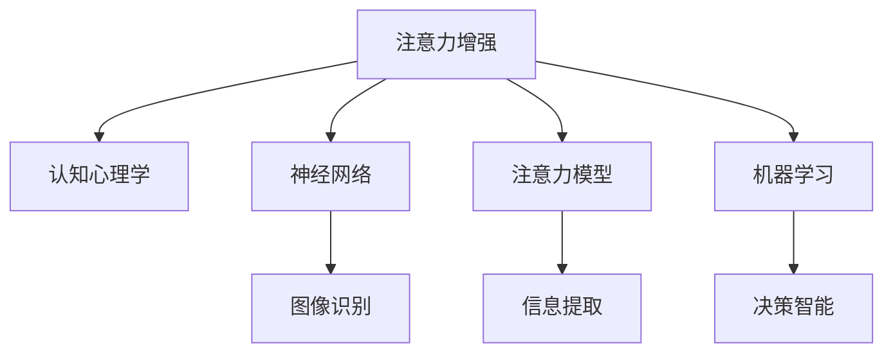

                 

# 人类注意力增强：提升专注力和注意力在商业中的未来趋势

> 关键词：人类注意力增强, 商业应用, 专注力提升, 认知心理学, 神经网络, 注意力模型, 机器学习, 人工智能

## 1. 背景介绍

### 1.1 问题由来

在当今信息爆炸的时代，人们的注意力被各种信息流所分散，注意力资源变得稀缺且难以管理。如何在商业环境中提升个人或组织的注意力集中度和效率，成为一个亟待解决的挑战。

### 1.2 问题核心关键点

这个问题的核心在于如何通过技术手段，帮助人类在信息过载的环境中，提高注意力集中度和使用效率。目前主流的方法包括应用认知心理学原理，设计符合人脑运作习惯的交互界面，以及利用人工智能技术构建注意力增强模型。

## 2. 核心概念与联系

### 2.1 核心概念概述

为更好地理解注意力增强的概念及其应用，本节将介绍几个密切相关的核心概念：

- **注意力增强**：通过技术手段，提升人类对信息的专注力和处理效率，包括但不限于应用程序的优化、信息检索的改进、学习平台的个性化等。

- **认知心理学**：研究人类思维、感知和记忆过程的科学，为设计高效、友好的用户界面提供了理论依据。

- **神经网络**：一种可以模拟人脑神经元活动的网络结构，广泛应用于图像识别、自然语言处理等领域。

- **注意力模型**：一种模拟人类注意力机制的模型，用于计算输入信息的权重，从而更好地提取关键信息。

- **机器学习与人工智能**：通过数据驱动的方法，使计算机具备类似于人类的学习能力和决策能力。

这些概念之间的逻辑关系可以通过以下Mermaid流程图来展示：



这个流程图展示了注意力增强的关键要素及其相互关系：

1. 注意力增强基于认知心理学的理论，设计符合人类认知习惯的用户界面。
2. 神经网络模拟人类大脑的运作，用于处理复杂的数据结构。
3. 注意力模型捕捉并计算信息的重要性，用于指导后续处理。
4. 机器学习和人工智能技术通过学习用户的反馈和行为，优化模型的表现。

## 3. 核心算法原理 & 具体操作步骤

### 3.1 算法原理概述

注意力增强的本质是通过提升信息处理过程中的选择性注意，使人们能够更高效地利用有限的信息资源。其核心算法原理包括：

- **选择机制**：从输入信息中选择部分内容进行重点处理，忽略不相关的信息。
- **权重计算**：通过计算每个输入的权重，指导后续的计算和推理。
- **反馈机制**：根据用户行为和反馈，不断调整信息选择和权重计算的策略。

### 3.2 算法步骤详解

注意力增强的算法步骤如下：

**Step 1: 数据预处理**
- 收集用户行为数据，包括点击、浏览、搜索等行为。
- 对数据进行清洗、标注和分类，为后续处理做准备。

**Step 2: 构建注意力模型**
- 选择适合的注意力模型，如基于Transformer的注意力机制。
- 对模型进行初始化，设置注意力参数和权重。

**Step 3: 训练模型**
- 使用用户行为数据对模型进行监督训练，调整注意力机制的参数。
- 定期在验证集上进行评估，根据性能调整模型。

**Step 4: 应用模型**
- 在应用中集成训练好的模型，对新输入进行注意力计算。
- 根据计算结果，对输入进行筛选和处理，优先处理权重高的信息。

**Step 5: 持续优化**
- 根据用户反馈和新数据，不断优化模型的参数和策略。
- 定期重新训练模型，确保其适应性。

### 3.3 算法优缺点

注意力增强算法的优点包括：
- 高效性：通过选择性地处理信息，显著提升了信息处理的效率。
- 个性化：根据用户行为和偏好，提供定制化的信息处理方案。
- 动态适应：能够根据用户反馈和新数据，持续优化模型。

其缺点主要在于：
- 数据依赖：算法的性能高度依赖于高质量的数据。
- 模型复杂度：构建和训练高效的注意力模型需要较高的计算资源。
- 用户习惯的易变性：用户的注意力模式可能随时变化，模型需要持续更新以适应。

### 3.4 算法应用领域

注意力增强算法已经被广泛应用于多个领域，包括但不限于：

- **电商推荐系统**：通过对用户浏览和购买行为进行分析，推荐感兴趣的商品。
- **社交媒体**：通过分析用户的互动行为，推荐相关内容和用户。
- **在线教育**：根据学生的学习行为，推荐适合的课程和学习资源。
- **内容聚合平台**：通过提取关键信息，自动生成摘要和推荐。
- **智能客服**：通过对用户问题的分析，自动分配给合适的客服人员。

## 4. 数学模型和公式 & 详细讲解 & 举例说明

### 4.1 数学模型构建

注意力增强的数学模型包括注意力计算和权重计算两部分。以Transformer模型为例，其注意力机制可以表示为：

$$
A_{i,j} = \text{softmax}(\frac{E_i \cdot E_j}{\sqrt{d}})
$$

其中，$E_i$和$E_j$分别为输入和输出向量的嵌入表示，$d$为嵌入维度。注意力矩阵$A$表示输入中每个位置对输出中每个位置的关注程度。

### 4.2 公式推导过程

通过上述公式，可以推导出注意力计算的具体过程。对于每个输入位置$i$，其对输出位置$j$的注意力权重为：

$$
w_{i,j} = \text{softmax}(\frac{E_i \cdot E_j}{\sqrt{d}})
$$

其中，$\text{softmax}$表示归一化指数函数，确保权重总和为1。权重向量$w_{i,j}$表示输入位置$i$对输出位置$j$的关注程度，用于指导后续的计算。

### 4.3 案例分析与讲解

以电商平台推荐系统为例，假设用户A浏览了以下商品列表：
```
商品1：T恤
商品2：裤子
商品3：鞋子
商品4：帽子
```

通过训练好的注意力模型，可以计算出每个商品对用户A的吸引力权重。假设模型计算出：
- 商品1的权重为0.8
- 商品2的权重为0.6
- 商品3的权重为0.7
- 商品4的权重为0.5

那么，模型会优先推荐商品1，因为其权重最高，最有可能被用户A购买。

## 5. 项目实践：代码实例和详细解释说明

### 5.1 开发环境搭建

在进行注意力增强的实践前，我们需要准备好开发环境。以下是使用Python进行TensorFlow开发的例子：

1. 安装Anaconda：从官网下载并安装Anaconda，用于创建独立的Python环境。

2. 创建并激活虚拟环境：
```bash
conda create -n tf-env python=3.7 
conda activate tf-env
```

3. 安装TensorFlow：
```bash
pip install tensorflow==2.7.0
```

4. 安装相关工具包：
```bash
pip install numpy pandas scikit-learn
```

完成上述步骤后，即可在`tf-env`环境中开始注意力增强的实践。

### 5.2 源代码详细实现

以下是使用TensorFlow实现注意力模型的Python代码示例：

```python
import tensorflow as tf
import numpy as np

# 构建注意力模型
def build_attention_model(input_size, output_size, embedding_dim):
    input_embeddings = tf.keras.layers.Embedding(input_size, embedding_dim, input_length=1)
    output_embeddings = tf.keras.layers.Embedding(output_size, embedding_dim, input_length=1)
    attention_weights = tf.keras.layers.Dense(1)
    
    model = tf.keras.Sequential([
        input_embeddings,
        attention_weights,
        tf.keras.layers.Dense(1, activation='softmax')
    ])
    
    return model

# 训练注意力模型
def train_model(model, train_data, validation_data, epochs=10):
    model.compile(optimizer='adam', loss='mse')
    model.fit(train_data, epochs=epochs, validation_data=validation_data)
    return model

# 预测和应用模型
def predict(model, input_data):
    attention_weights = model.predict(input_data)
    return attention_weights

# 示例数据
train_data = np.array([[0, 1, 2, 3], [1, 2, 3, 4]])
validation_data = np.array([[0, 1, 2, 3], [2, 3, 4, 5]])
input_data = np.array([[1, 2]])

# 构建模型
attention_model = build_attention_model(4, 4, 2)

# 训练模型
trained_model = train_model(attention_model, train_data, validation_data)

# 应用模型
attention_weights = predict(trained_model, input_data)

print(attention_weights)
```

### 5.3 代码解读与分析

让我们详细解读一下关键代码的实现细节：

**build_attention_model函数**：
- 定义了模型结构，包括嵌入层、注意力层和输出层。
- 嵌入层的输入维度为4，输出维度为2。
- 注意力层的权重计算部分，使用了`Dense`层。
- 输出层的激活函数为`softmax`，用于归一化权重。

**train_model函数**：
- 定义了模型的优化器和损失函数。
- 使用`fit`函数进行模型的监督训练，`epochs`参数指定训练轮数。
- 返回训练好的模型。

**predict函数**：
- 使用训练好的模型进行预测，返回每个输入位置的注意力权重。

**示例数据**：
- 定义了训练数据和验证数据，分别表示用户对不同商品的关注程度。
- 定义了一个输入数据，用于测试模型。

**模型构建与训练**：
- 构建了一个简单的注意力模型，并使用示例数据进行训练。
- 训练轮数为10，使用`mse`损失函数。

**应用模型**：
- 使用训练好的模型对输入数据进行预测，并输出注意力权重。

通过这些代码示例，可以看到TensorFlow构建和训练注意力模型的过程。实际应用中，模型的复杂度和训练数据的规模都会影响其效果。

## 6. 实际应用场景

### 6.1 智能推荐系统

智能推荐系统是注意力增强在电商、社交媒体等领域的重要应用之一。通过对用户行为数据的分析，推荐系统可以生成个性化的商品和内容推荐，提升用户满意度。

以电商推荐系统为例，假设某用户在浏览网页时，点击了以下商品：
- 商品1：T恤
- 商品2：裤子
- 商品3：鞋子
- 商品4：帽子

推荐系统通过训练好的注意力模型，计算出每个商品对用户的吸引力权重，然后按照权重排序，推荐最可能被用户购买或喜欢的商品。

### 6.2 内容聚合与摘要

在内容聚合和摘要生成场景中，注意力增强可以帮助自动提取关键信息，生成简洁的摘要。例如，对于一篇新闻文章，可以通过注意力机制自动识别文章中的关键段落和词汇，生成自动摘要。

假设一篇新闻文章包含以下内容：
```
标题：科技公司推出新产品
正文：科技公司XYZ公司近日推出了一款革命性的新软件。该软件集成了最新的AI技术，旨在提高用户的工作效率。
```

通过训练好的注意力模型，可以计算出每个段落和词汇的重要性权重，然后按照权重排序，提取关键信息。最终生成的自动摘要可能为：
```
标题：科技公司推出新产品
正文：科技公司XYZ公司近日推出了一款革命性的新软件。该软件集成了最新的AI技术，旨在提高用户的工作效率。
```

### 6.3 学习平台个性化

在在线教育和学习平台中，注意力增强可以帮助根据学生的学习行为和偏好，推荐适合的课程和学习资源。

假设某学生在某个学习平台上学习了以下课程：
- 课程1：Python基础
- 课程2：数据结构
- 课程3：机器学习

通过训练好的注意力模型，可以计算出每个课程对学生的吸引力权重，然后按照权重排序，推荐最感兴趣的课程。例如，如果课程3的权重最高，系统会推荐学生学习更多关于机器学习的课程。

## 7. 工具和资源推荐

### 7.1 学习资源推荐

为帮助开发者系统掌握注意力增强的理论基础和实践技巧，这里推荐一些优质的学习资源：

1. TensorFlow官方文档：提供详尽的TensorFlow使用指南和教程，适合初学者和进阶开发者。

2. Attention is All You Need（即Transformer原论文）：介绍了注意力机制的基本原理和应用场景，是理解注意力增强的核心论文。

3. Building Efficient Attention Models（构建高效注意力模型）：详细讲解了注意力机制的数学原理和模型优化策略，是深入理解注意力增强的必读文章。

4. Deep Learning with Attention（深度学习与注意力）：由深度学习专家撰写，系统介绍了注意力机制在深度学习中的应用。

5. AI Explained（人工智能图解）：使用可视化工具帮助理解深度学习和注意力增强的基本概念和应用。

通过对这些资源的学习实践，相信你一定能够快速掌握注意力增强的精髓，并用于解决实际的商业问题。

### 7.2 开发工具推荐

高效的开发离不开优秀的工具支持。以下是几款用于注意力增强开发的常用工具：

1. TensorFlow：基于Python的开源深度学习框架，灵活高效，适合构建注意力增强模型。

2. PyTorch：另一个流行的开源深度学习框架，提供了更灵活的动态图和动态模块。

3. Jupyter Notebook：提供交互式编程环境，方便开发者进行模型实验和调试。

4. Visual Studio Code：轻量级代码编辑器，支持Python开发环境，提供了丰富的插件和扩展。

5. Google Colab：谷歌提供的在线Jupyter Notebook环境，免费提供GPU算力，适合进行深度学习实验。

合理利用这些工具，可以显著提升注意力增强任务的开发效率，加快创新迭代的步伐。

### 7.3 相关论文推荐

注意力增强技术的发展源于学界的持续研究。以下是几篇奠基性的相关论文，推荐阅读：

1. Attention is All You Need（即Transformer原论文）：提出了注意力机制，开启了深度学习领域的Transformer时代。

2. Sequence to Sequence Learning with Neural Networks（序列到序列学习）：介绍了神经网络在自然语言处理中的应用，为注意力机制的应用提供了理论基础。

3. The Transformer Architecture（Transformer架构）：详细介绍了Transformer模型的结构和注意力机制的原理。

4. Attention and Memory in Deep Learning（注意力与深度学习中的记忆）：探讨了注意力机制在深度学习中的作用和应用。

5. Building Efficient Attention Models（构建高效注意力模型）：研究了注意力机制的优化策略，提出了一些提升模型效率的方法。

这些论文代表了大语言模型微调技术的发展脉络。通过学习这些前沿成果，可以帮助研究者把握学科前进方向，激发更多的创新灵感。

## 8. 总结：未来发展趋势与挑战

### 8.1 总结

本文对基于注意力增强技术提升商业应用中的人类专注力和注意力进行了全面系统的介绍。首先阐述了注意力增强在商业应用中的重要性和应用背景，明确了注意力增强在提升信息处理效率和用户体验方面的独特价值。其次，从原理到实践，详细讲解了注意力增强的数学原理和关键步骤，给出了注意力增强任务开发的完整代码实例。同时，本文还探讨了注意力增强在多个实际场景中的应用，展示了注意力增强范式的巨大潜力。此外，本文精选了注意力增强技术的各类学习资源，力求为读者提供全方位的技术指引。

通过本文的系统梳理，可以看到，注意力增强技术正在成为商业应用的重要范式，极大地提升了大规模数据处理和信息推荐的效率。未来，伴随注意力增强技术的持续演进，商业智能和信息推荐系统必将迎来新的突破。

### 8.2 未来发展趋势

展望未来，注意力增强技术将呈现以下几个发展趋势：

1. 模型规模持续增大。随着算力成本的下降和数据规模的扩张，注意力增强模型的参数量还将持续增长。超大批次的训练和推理也将成为可能。

2. 注意力机制的复杂化。未来的模型将加入更多维度，如时空注意力、多层次注意力等，以应对更复杂的商业应用场景。

3. 强化学习与注意力增强结合。通过强化学习技术，优化注意力机制的选择策略，进一步提升模型的个性化和智能性。

4. 多模态注意力增强。未来的模型将融合视觉、语音、文本等多模态信息，提供更全面、丰富的用户体验。

5. 实时注意力增强。通过构建低延迟的计算图和高效的模型压缩技术，实现实时处理和响应，满足高要求的商业应用需求。

6. 跨领域注意力增强。未来的模型将能够跨领域、跨模态进行信息处理，提升综合决策能力。

以上趋势凸显了注意力增强技术的广阔前景。这些方向的探索发展，必将进一步提升商业智能和信息推荐系统的性能和应用范围，为商业决策提供更强大的数据支持。

### 8.3 面临的挑战

尽管注意力增强技术已经取得了显著成果，但在迈向更加智能化、普适化应用的过程中，它仍面临着诸多挑战：

1. 数据依赖性强。注意力增强的效果高度依赖于高质量的数据，如何获取、清洗和标注大规模数据，成为挑战之一。

2. 模型复杂度高。构建和训练高效的注意力模型需要较高的计算资源，如何平衡模型复杂度和性能，是另一个重要问题。

3. 用户习惯的易变性。用户的注意力模式可能随时变化，模型需要持续更新以适应。

4. 算力成本高。注意力增强模型的训练和推理都需要较大的算力支持，如何降低算力成本，提高模型效率，是一个需要解决的问题。

5. 用户隐私和安全。在处理用户数据时，如何保护用户隐私和数据安全，是必须解决的问题。

6. 模型公平性和可解释性。注意力增强模型可能存在偏见和歧视，如何构建公平、透明的模型，解释模型的决策过程，是未来的研究方向。

7. 模型解释性和可控性。注意力增强模型的决策过程缺乏可解释性，如何构建可解释、可控的模型，是未来的挑战之一。

这些挑战需要研究者不断探索和解决，才能使注意力增强技术真正落地应用，发挥其商业价值。

### 8.4 研究展望

面对注意力增强技术面临的挑战，未来的研究需要在以下几个方面寻求新的突破：

1. 探索高效、低成本的数据采集和预处理技术，降低数据依赖性。

2. 研究更高效、更轻量级的模型结构和训练方法，提高模型效率。

3. 融合多模态数据，提升模型的综合感知能力。

4. 结合强化学习技术，优化注意力机制的选择策略，提升个性化和智能性。

5. 引入跨领域、跨模态的信息融合技术，提升模型的泛化能力和综合决策能力。

6. 引入更多的先验知识，提升模型的解释性和可控性。

7. 构建公平、透明的模型，确保模型的公平性和可解释性。

这些研究方向的探索，必将引领注意力增强技术迈向更高的台阶，为构建智能、可靠、高效的商业系统铺平道路。面向未来，注意力增强技术还需要与其他人工智能技术进行更深入的融合，共同推动商业智能和信息推荐系统的进步。只有勇于创新、敢于突破，才能不断拓展注意力增强技术的边界，让智能技术更好地造福人类社会。

## 9. 附录：常见问题与解答

**Q1: 注意力增强技术是否适用于所有商业应用？**

A: 注意力增强技术在许多商业应用中具有广泛的应用前景，特别是在信息处理、推荐系统等领域。然而，对于一些高度定制化的应用场景，可能需要结合具体的业务逻辑进行定制化设计。

**Q2: 如何平衡注意力增强模型的计算复杂度和性能？**

A: 为了平衡注意力增强模型的计算复杂度和性能，可以采取以下策略：
1. 选择合适的注意力机制，如自注意力、多头注意力等，减少计算量。
2. 使用模型压缩和剪枝技术，减少模型参数量，提高计算效率。
3. 采用分布式训练和推理，利用多台机器分担计算任务。

**Q3: 如何提高注意力增强模型的公平性和可解释性？**

A: 提高注意力增强模型的公平性和可解释性，可以采取以下策略：
1. 引入更多的先验知识，如逻辑规则、常识等，减少模型的偏见和歧视。
2. 构建可解释的注意力机制，如使用可解释的Attention Head等，解释模型的决策过程。
3. 结合用户反馈，不断优化模型的选择策略，提高模型的公平性。

**Q4: 如何降低注意力增强模型的算力成本？**

A: 降低注意力增强模型的算力成本，可以采取以下策略：
1. 使用低精度计算，如8位、16位等，减少计算资源消耗。
2. 使用模型压缩和剪枝技术，减少模型参数量，提高计算效率。
3. 采用分布式训练和推理，利用多台机器分担计算任务。
4. 结合硬件加速技术，如GPU、TPU等，提高计算效率。

通过这些常见问题的解答，可以帮助读者更好地理解和应用注意力增强技术，解决实际商业应用中的挑战。

---

作者：禅与计算机程序设计艺术 / Zen and the Art of Computer Programming

