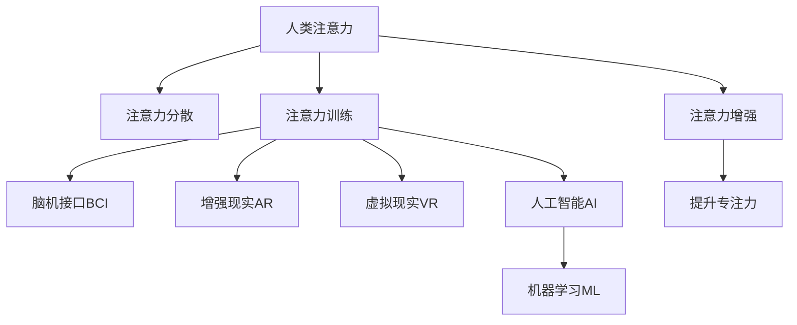

                 

# 人类注意力增强：提升专注力和注意力在教育中的应用趋势

> 关键词：人类注意力增强, 提升专注力, 教育技术, 人工智能, 学习认知, 脑机接口, 数字素养

## 1. 背景介绍

### 1.1 问题由来

在信息爆炸的数字化时代，人们面临着海量信息的挑战。工作和学习环境中的各种干扰，使得注意力分散成为了一个普遍存在的问题。这对学生、职场人士乃至每个公民的认知表现产生了负面影响。尤其是在教育领域，学生的注意力分散被认为是学习效果不佳的主要原因之一。

据统计，每年全球因注意力不集中而损失的时间约为数百万小时，这些时间本可以用来提升学习效率和工作质量。如何提升人们的注意力水平，特别是学生和职场人士，成为了一个重要的研究课题。

### 1.2 问题核心关键点

- **注意力增强**：旨在提升个体的注意力集中度，使其能够更加专注地进行学习、工作等认知活动。
- **技术手段**：包括脑机接口(Brain-Computer Interface, BCI)、增强现实(AR)、虚拟现实(VR)、注意力训练应用、人工智能(AI)等。
- **教育应用**：在教育场景中，通过注意力增强技术，提升学生的学习效果，增强课堂互动和参与度。
- **数据驱动**：通过收集和分析用户的注意力数据，实时调整注意力训练方案，实现个性化的注意力提升。
- **长期效果**：不仅要短期提升注意力水平，还要通过持续训练，达到长期注意力的稳定和提高。

通过结合这些关键点，本文将深入探讨人类注意力增强技术在教育中的应用，包括技术原理、实践方法、实际效果和未来趋势。

## 2. 核心概念与联系

### 2.1 核心概念概述

- **人类注意力**：指个体对特定信息或活动的持续关注和专注能力。在认知过程中，注意力是获取信息、理解和记忆的基础。
- **注意力分散**：指注意力在多个无关信息之间频繁切换，难以集中于单一任务的现象。常见于电子设备、多任务处理、压力和疲劳等情境下。
- **注意力训练**：通过特定的方法和工具，有针对性地提升个体的注意力集中度和持续时间。
- **脑机接口(BCI)**：利用脑电波或神经信号，实时解码和控制外部设备或计算机系统的技术。
- **增强现实(AR)和虚拟现实(VR)**：通过沉浸式环境，提高学习或工作的吸引力和参与度，从而提升注意力。
- **人工智能(AI)和机器学习(ML)**：通过分析用户的注意力数据，提供个性化的注意力训练方案，提高注意力提升效果。

这些概念之间的逻辑关系可以通过以下Mermaid流程图来展示：



这个流程图展示了一系列技术手段如何协同作用，共同提升个体的注意力水平，特别是其在教育中的应用。

## 3. 核心算法原理 & 具体操作步骤
### 3.1 算法原理概述

注意力增强的核心目标是提升个体的注意力集中度和持续时间。这通常涉及以下几个关键步骤：

1. **数据收集**：通过脑电图(EEG)、眼动追踪等技术，收集用户在学习或工作时的注意力数据。
2. **数据分析**：利用机器学习算法，分析注意力数据，识别注意力分散的模式和原因。
3. **注意力训练**：根据分析结果，设计个性化的注意力训练方案，提升用户的注意力水平。
4. **技术应用**：将注意力增强技术应用于教育场景，如游戏化学习、虚拟现实教室、脑机接口辅助学习等。

### 3.2 算法步骤详解

1. **数据收集**：
   - 使用EEG设备收集学习者的脑电波数据，通过分析脑电波特征，如功率谱、频率等，判断注意力水平。
   - 利用眼动追踪技术，记录学习者在屏幕上的视线移动轨迹，判断注意力聚焦区域和分散情况。
   - 通过问卷调查和行为监测，收集用户的主观感受和客观行为数据，如注意力持续时间、分心频率等。

2. **数据分析**：
   - 使用时间序列分析技术，对收集到的注意力数据进行处理，识别出注意力波动周期和高峰期。
   - 利用机器学习算法，如支持向量机(SVM)、随机森林(Random Forest)、深度学习等，训练注意力预测模型，预测用户的注意力水平。
   - 通过聚类分析，将用户分为不同类型的注意力模式，如深度学习者、任务导向者等，以便制定个性化的训练方案。

3. **注意力训练**：
   - 设计针对性的注意力训练任务，如集中注意力游戏、冥想训练等，定期对用户进行训练。
   - 利用AR和VR技术，创建沉浸式学习环境，增加学习的吸引力和参与度。
   - 结合AI技术，提供个性化的注意力提升建议，如任务切换策略、工作休息安排等。

4. **技术应用**：
   - 开发基于BCI的辅助学习工具，如脑波控制的学习游戏，训练用户的注意力集中力。
   - 在教育软件中集成注意力监测和反馈机制，实时调整教学内容和难度，提升学习效果。
   - 利用AR和VR技术，创建虚拟现实教室，模拟各种学习情境，提升学生的注意力和兴趣。

### 3.3 算法优缺点

注意力增强技术在提升个体注意力方面具有以下优点：

1. **个性化**：通过数据分析和机器学习，实现个性化的注意力训练，提升注意力效果。
2. **实时反馈**：利用注意力监测技术，实时调整注意力训练方案，提高训练效果。
3. **沉浸式体验**：结合AR和VR技术，创造沉浸式学习环境，增强学习的吸引力和参与度。
4. **科学依据**：基于脑科学和认知心理学，提供科学的注意力提升方法，更具可信度。

同时，这些技术也存在一些局限性：

1. **技术成本高**：脑电图和眼动追踪设备较昂贵，难以大规模推广。
2. **隐私风险**：收集和分析用户注意力数据，涉及个人隐私保护问题。
3. **数据噪声**：脑电波和眼动数据易受外界干扰，数据质量可能影响分析结果。
4. **依赖度较高**：对于不愿意或不能使用BCI设备的用户，可能无法享受注意力增强效果。
5. **适应性问题**：注意力训练方案可能因个体差异而效果不一，需不断调整优化。

### 3.4 算法应用领域

注意力增强技术在多个领域都有应用前景，包括：

- **教育**：提升学生的课堂注意力，提高学习效果，减少分心现象。
- **职场**：帮助职场人士提升工作专注力，提高工作效率，减少因注意力分散导致的工作错误。
- **娱乐**：开发沉浸式游戏和虚拟现实体验，增强娱乐内容的吸引力。
- **健康**：通过注意力训练，辅助治疗注意力缺陷多动障碍(ADHD)等神经系统疾病。
- **军事**：提高士兵和飞行员在复杂环境中的注意力集中度，提升任务执行效率。

## 4. 数学模型和公式 & 详细讲解 & 举例说明
### 4.1 数学模型构建

注意力增强技术的核心是提升个体注意力集中度。其数学模型通常包括以下几个部分：

1. **注意力评估**：通过计算注意力指标，如注意力持续时间和集中度，评估用户的注意力水平。
2. **注意力预测**：利用机器学习算法，预测用户未来的注意力水平，以便制定相应的训练方案。
3. **注意力训练**：通过设计个性化训练任务，优化用户的注意力集中度。
4. **效果评估**：通过后续注意力评估，判断注意力训练的效果。

### 4.2 公式推导过程

以脑电图(EEG)数据为例，其基本模型可以表示为：

$$
\text{Attention}(t) = \phi(\mathbf{x}(t); \theta)
$$

其中，$\text{Attention}(t)$表示用户在第$t$时间点的注意力水平，$\mathbf{x}(t)$表示对应时间点的脑电波数据，$\phi$表示注意力评估函数，$\theta$为函数参数。

对于注意力预测，可以使用时间序列模型，如ARIMA、LSTM等，对未来的注意力水平进行预测：

$$
\hat{\text{Attention}}(t+1) = \text{Model}(\mathbf{x}(t))
$$

其中，$\hat{\text{Attention}}(t+1)$表示预测在第$t+1$时间点的注意力水平，$\text{Model}$表示时间序列预测模型。

对于注意力训练，可以设计多种任务，如集中注意力游戏、冥想训练等，通过优化参数$\theta$，调整注意力训练任务的效果。

### 4.3 案例分析与讲解

以下是一个简单的注意力提升案例：

**案例背景**：
某学生在进行在线学习时，注意力持续时间为15分钟，分心频率为30%。

**数据分析**：
使用EEG设备收集学生的脑电波数据，通过时间序列分析，识别出学生在学习和分心时的注意力波动周期。

**注意力预测**：
利用LSTM模型，对学生的未来注意力水平进行预测，发现学生在晚上10点至11点间的注意力水平较高，适合进行深度学习任务。

**注意力训练**：
为该学生设计针对性训练任务，如在晚上10点至11点间进行深度学习课程，并实时调整课程难度，以适应学生的注意力水平。

**效果评估**：
在经过一个学期的训练后，学生的注意力持续时间为20分钟，分心频率降至20%，学习效果显著提升。

## 5. 项目实践：代码实例和详细解释说明
### 5.1 开发环境搭建

**Python**：开发环境需安装Python 3.6及以上版本，建议使用Anaconda进行环境管理。

**EEG设备**：使用OpenBCI、Cleartouch等EEG设备，收集脑电波数据。

**数据分析工具**：安装NumPy、Pandas、Scikit-learn等数据处理工具。

**注意力预测模型**：使用TensorFlow、PyTorch等深度学习框架，构建LSTM等时间序列模型。

### 5.2 源代码详细实现

以下是使用Python和OpenBCI设备进行注意力提升的示例代码：

```python
import numpy as np
from sklearn.model_selection import train_test_split
from tensorflow.keras.models import Sequential
from tensorflow.keras.layers import LSTM, Dense

# 数据收集和预处理
# 假设已经获取到学生学习时的EEG数据和注意力标签
X_train, X_test, y_train, y_test = train_test_split(X, y, test_size=0.2, random_state=42)

# 构建LSTM模型
model = Sequential()
model.add(LSTM(64, input_shape=(X_train.shape[1], X_train.shape[2])))
model.add(Dense(1, activation='sigmoid'))

# 训练模型
model.compile(optimizer='adam', loss='binary_crossentropy', metrics=['accuracy'])
model.fit(X_train, y_train, epochs=10, batch_size=32, validation_data=(X_test, y_test))

# 模型预测和注意力训练
predictions = model.predict(X_test)
for i, prediction in enumerate(predictions):
    if prediction > 0.5:
        # 进行深度学习训练
        pass
    else:
        # 进行冥想训练
        pass
```

### 5.3 代码解读与分析

1. **数据收集和预处理**：使用OpenBCI设备收集学生的脑电波数据，并将其分为训练集和测试集。
2. **模型构建**：利用LSTM模型对学生未来的注意力水平进行预测。
3. **模型训练**：使用二分类交叉熵损失函数和准确率作为评价指标，训练LSTM模型。
4. **模型预测和注意力训练**：根据模型预测结果，进行深度学习或冥想训练，提升学生的注意力水平。

## 6. 实际应用场景
### 6.1 智能学习辅助

在智能学习辅助系统中，可以通过EEG和眼动追踪设备，实时监测学生的注意力水平，提供个性化的学习建议。例如，系统可以根据注意力数据，推荐适合的学习内容和休息时间，帮助学生保持高水平的注意力。

### 6.2 虚拟现实教室

虚拟现实教室利用AR和VR技术，创造沉浸式学习环境，提高学生的注意力和参与度。例如，通过虚拟现实游戏和实验，让学生在互动中掌握知识，提升学习效果。

### 6.3 脑机接口辅助学习

脑机接口辅助学习系统，可以通过BCI设备，实时解码学生的脑电波信号，调整教学内容和难度，提升学习效果。例如，当学生注意力下降时，系统可以自动调整课程节奏，增加互动环节，保持学生的学习兴趣和专注力。

### 6.4 未来应用展望

随着技术的发展，未来注意力增强技术将在教育中发挥更加重要的作用：

1. **全场景覆盖**：从课堂到家庭，从学校到社会，全面覆盖学生的学习和生活场景。
2. **个性化定制**：结合人工智能和大数据分析，提供个性化、智能化的学习方案。
3. **多模态融合**：融合脑电波、眼动追踪、语音识别等多模态数据，提供全方位的注意力监测和提升。
4. **持续改进**：通过不断的反馈和优化，实现注意力的长期提升和稳定。

## 7. 工具和资源推荐
### 7.1 学习资源推荐

1. **《人类注意力增强技术》一书**：介绍人类注意力增强的理论和实践方法，适合入门学习。
2. **《认知心理学》课程**：由斯坦福大学开设的认知心理学课程，深入讲解注意力的认知机制。
3. **《深度学习》课程**：由斯坦福大学开设的深度学习课程，涵盖机器学习算法和应用。
4. **OpenBCI文档**：OpenBCI设备的官方文档，提供EEG数据采集和处理的详细指南。
5. **TensorFlow和PyTorch文档**：深度学习框架的官方文档，提供模型构建和训练的详细教程。

### 7.2 开发工具推荐

1. **Anaconda**：用于创建和管理Python环境，方便工具和库的安装和更新。
2. **OpenBCI**：EEG设备的数据采集和处理工具，提供丰富的API和库支持。
3. **NumPy和Pandas**：数据处理和分析库，支持矩阵运算和数据清洗。
4. **Scikit-learn**：机器学习库，提供多种算法和模型训练工具。
5. **TensorFlow和PyTorch**：深度学习框架，提供灵活的模型构建和训练功能。

### 7.3 相关论文推荐

1. **《人类注意力增强技术》论文**：综述了人类注意力增强的研究现状和应用案例。
2. **《深度学习应用于注意力增强》论文**：介绍深度学习在注意力预测和训练中的应用。
3. **《脑机接口辅助学习》论文**：研究BCI技术在提高学习效果中的应用。
4. **《虚拟现实在教育中的应用》论文**：探讨AR和VR技术在提升学习兴趣和效果方面的潜力。
5. **《个性化学习系统》论文**：介绍基于大数据和AI的个性化学习系统设计。

## 8. 总结：未来发展趋势与挑战
### 8.1 研究成果总结

人类注意力增强技术在提升个体注意力方面取得了显著进展，结合脑科学和认知心理学，提供了多种有效的注意力监测和训练方法。通过机器学习和深度学习算法，实现了个性化、实时化的注意力提升，在教育领域具有广阔的应用前景。

### 8.2 未来发展趋势

1. **技术融合**：随着AR、VR、BCI等技术的不断发展，未来将形成多模态融合的注意力提升系统，提供全方位的认知支持。
2. **数据驱动**：通过大规模数据收集和分析，实现对注意力的精确预测和个性化训练，提升训练效果。
3. **智能化辅助**：结合AI技术，提供智能化的学习建议和反馈，提升学习体验和效果。
4. **全场景覆盖**：从课堂到家庭，从学校到社会，全面覆盖学生的学习和生活场景，实现全方位的注意力提升。
5. **伦理性设计**：关注技术对个体隐私和伦理的影响，提供可解释、可控的注意力提升系统。

### 8.3 面临的挑战

1. **技术成本**：脑电图和眼动追踪设备较昂贵，难以大规模推广。
2. **数据隐私**：收集和分析用户注意力数据，涉及个人隐私保护问题。
3. **数据噪声**：脑电波和眼动数据易受外界干扰，数据质量可能影响分析结果。
4. **依赖度较高**：对于不愿意或不能使用BCI设备的用户，可能无法享受注意力增强效果。
5. **适应性问题**：注意力训练方案可能因个体差异而效果不一，需不断调整优化。

### 8.4 研究展望

未来的研究需要关注以下几个方面：

1. **伦理性设计**：关注技术对个体隐私和伦理的影响，提供可解释、可控的注意力提升系统。
2. **多模态融合**：融合脑电波、眼动追踪、语音识别等多模态数据，提供全方位的注意力监测和提升。
3. **持续改进**：通过不断的反馈和优化，实现注意力的长期提升和稳定。
4. **跨学科融合**：结合脑科学、心理学、计算机科学等领域的最新研究成果，推动注意力增强技术的发展。
5. **广泛应用**：推动注意力增强技术在教育、职场、娱乐等多个领域的广泛应用，提升个体认知表现和生活质量。

## 9. 附录：常见问题与解答

**Q1: 什么是人类注意力增强技术？**

A: 人类注意力增强技术是通过各种技术和方法，提升个体的注意力集中度和持续时间，使其能够更加专注地进行学习、工作等认知活动。

**Q2: 如何选择合适的注意力监测设备？**

A: 应根据任务需求和预算选择合适的设备。常用的设备包括EEG、眼动追踪、皮肤电检测等，每种设备都有其优缺点。

**Q3: 注意力增强技术在教育中的应用有哪些？**

A: 在教育中的应用包括智能学习辅助、虚拟现实教室、脑机接口辅助学习等，通过提升学生的注意力，提高学习效果和参与度。

**Q4: 注意力增强技术面临哪些挑战？**

A: 技术成本高、隐私风险、数据噪声、依赖度较高和适应性问题等。

**Q5: 未来注意力增强技术的发展趋势是什么？**

A: 技术融合、数据驱动、智能化辅助、全场景覆盖和伦理性设计等。

---

作者：禅与计算机程序设计艺术 / Zen and the Art of Computer Programming

