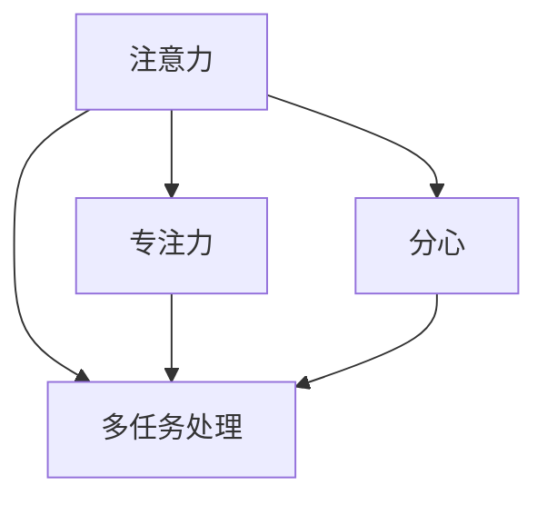

                 

# 人类注意力增强：提升专注力和注意力在教育中的方法

在信息技术飞速发展的今天，人类在享受智能设备和信息爆炸带来的便利的同时，也面临着“注意力危机”——即因信息过载而导致的注意力分配困难和效率下降。特别是在教育领域，学生的注意力难以集中，进而影响了学习效果。本文将探讨如何通过技术和心理学结合的方法，有效提升人类注意力，从而提升学习效率。

## 1. 背景介绍

### 1.1 问题由来
随着互联网和智能设备的普及，人类获取信息的方式发生了显著变化。网络、视频、社交媒体等平台提供了海量的信息和互动机会，然而这种信息消费方式也带来了严重的注意力问题。学生在课堂、图书馆等传统学习场景中，越来越难以集中注意力，导致学习效率下降。

### 1.2 问题核心关键点
注意力不足已成为当前教育领域的主要问题之一，其核心关键点在于：
- **信息过载**：海量的信息来源使注意力难以聚焦，容易导致分心。
- **注意力分配**：学习任务繁多，学生难以合理分配注意力。
- **干扰因素**：课堂内外干扰（如手机、网络）影响学习专注度。

### 1.3 问题研究意义
提升注意力水平，对于改善学习效果、提高教育质量具有重要意义。具体体现在：
- **增强学习效果**：注意力集中能提升知识吸收率，加速学习进程。
- **优化教育资源**：合理分配注意力，能更高效地利用教育资源。
- **促进个体发展**：注意力提升有助于个体成长，促进全面发展。

## 2. 核心概念与联系

### 2.1 核心概念概述

为更好地理解提升专注力和注意力的方法，本节将介绍几个关键概念：

- **注意力 (Attention)**：指个体集中精神于特定对象和活动，保持持续和稳定的心理状态。注意力不仅是认知过程的重要组成部分，也是情绪和行为的基础。

- **专注力 (Focus)**：指个体在特定时间、特定任务上集中精力的能力。专注力是注意力的一种表现形式，通过培养专注力可以提升注意力水平。

- **多任务处理 (Multitasking)**：指个体同时处理多个任务的能力。高水平的多任务处理能力依赖于强大的注意力分配和转换能力。

- **分心 (Distraction)**：指个体难以集中注意力，导致任务中断和效率下降。分心是注意力的对立面，需要通过各种方式予以管理。

这些核心概念之间的逻辑关系可以通过以下Mermaid流程图来展示：



这个流程图展示了一系列的注意力相关概念及其相互关系：注意力是基础，专注力和多任务处理是注意力在不同情境下的表现形式，分心则是注意力的对立面。

## 3. 核心算法原理 & 具体操作步骤
### 3.1 算法原理概述

提升注意力和专注力的方法，可以分为心理干预和技术干预两大类。心理干预主要包括认知训练、冥想等方法，通过改变认知模式，提升个体的注意力和专注力。技术干预则借助计算机技术，开发智能辅助工具，帮助个体在具体学习任务中保持专注。

### 3.2 算法步骤详解

#### 心理干预步骤：

1. **认知训练**：通过训练认知能力，如记忆、推理、空间认知等，提升整体认知水平，间接改善注意力和专注力。
2. **冥想和正念**：定期进行冥想练习，通过集中精神、放松身心，达到提升专注力的效果。
3. **时间管理和规划**：制定合理的时间计划，提高时间利用效率，避免因时间管理不当导致的分心。

#### 技术干预步骤：

1. **注意力分配工具**：开发智能应用程序，通过数据记录和分析，帮助用户管理注意力，分配优先级。
2. **注意力监测工具**：使用神经网络等技术，实时监测用户注意力水平，提供即时反馈。
3. **注意力强化训练**：设计游戏化任务，通过奖励机制激励用户专注，提升注意力水平。

#### 结合步骤：

1. **综合应用**：将心理训练与技术工具结合，全面提升注意力和专注力。
2. **个性化定制**：根据个体差异，定制个性化的注意力提升方案。
3. **动态调整**：根据学习任务的变化，动态调整注意力管理策略。

### 3.3 算法优缺点

#### 心理干预的优点：

1. **成本低**：认知训练和冥想等方法简单易行，不需要昂贵的设备。
2. **效果持久**：心理干预提升的是认知基础，效果相对持久。
3. **自主性高**：个体可以自主进行心理训练，无需外部干预。

#### 心理干预的缺点：

1. **效果见效慢**：心理训练需要较长时间，短期内难以显著提升注意力。
2. **个体差异大**：不同个体对心理干预的反应差异较大。
3. **依赖个体主动性**：心理干预的效果依赖于个体的自律和坚持。

#### 技术干预的优点：

1. **高效性**：智能工具可以实时监测和反馈，快速提升注意力水平。
2. **可量化**：通过数据分析，提供量化的注意力评估，便于调整策略。
3. **可扩展**：技术手段可以轻松扩展到多个用户，提升群体整体水平。

#### 技术干预的缺点：

1. **依赖设备**：技术工具需要一定的硬件和软件支持，设备成本较高。
2. **效果受限**：技术干预主要针对特定场景，效果受应用场景限制。
3. **隐私问题**：技术工具收集和分析用户数据，存在隐私保护问题。

### 3.4 算法应用领域

提升注意力和专注力的技术干预，已经在多个领域得到了应用，以下是几个典型应用：

1. **教育**：在课堂教学中，通过智能学习助手、注意力监测工具等，帮助学生保持专注，提升学习效果。
2. **工作**：在工作环境中，通过注意力分配工具、多任务处理优化软件，提高工作效率和质量。
3. **训练**：在体育和表演艺术中，使用注意力训练软件，帮助运动员和表演者提高专注力。
4. **游戏**：在游戏设计中，通过精心设计的任务和奖励机制，引导玩家保持高度集中，提升游戏体验。
5. **健康**：在心理治疗中，通过注意力训练和正念练习，帮助患者缓解焦虑和压力，提升心理健康。

## 4. 数学模型和公式 & 详细讲解 & 举例说明

### 4.1 数学模型构建

假设学生在某个学习任务上分配的注意力为 $A$，注意力水平受到三个主要因素的影响：
- **任务难度**：任务难度 $D$，越难的任务所需注意力越多。
- **动机水平**：动机水平 $M$，动机越强，注意力投入越多。
- **干扰因素**：干扰因素 $I$，干扰越少，注意力越集中。

因此，可以建立一个多因素线性模型来描述注意力水平：

$$
A = \alpha_0 + \alpha_1D + \alpha_2M + \alpha_3I + \epsilon
$$

其中，$\alpha_0, \alpha_1, \alpha_2, \alpha_3$ 为模型参数，$\epsilon$ 为误差项。

### 4.2 公式推导过程

为了估计模型参数 $\alpha$，我们假设有一组训练数据集 $D = \{(x_i, y_i)\}_{i=1}^N$，其中 $x_i = (D_i, M_i, I_i)$ 为任务难度、动机水平和干扰因素的向量，$y_i$ 为注意力水平。

采用最小二乘法，求解模型参数 $\alpha$，使得 $y$ 和 $A$ 的最小平方误差最小化：

$$
\min_{\alpha} \sum_{i=1}^N (y_i - A(x_i; \alpha))^2
$$

通过求导和求解方程组，得到：

$$
\alpha = (X^TX)^{-1}X^Ty
$$

其中 $X = [1, D, M, I]$，为设计矩阵。

### 4.3 案例分析与讲解

考虑一个学生在阅读课程内容的注意力分配情况。根据模型，可以通过调整任务难度、动机水平和干扰因素来提升其注意力水平。例如：

1. **调整任务难度**：适当增加任务的难度，可以提高学生的专注度。例如，通过增加阅读材料的深度和难度，激发学生的兴趣和挑战欲。
2. **增强动机水平**：通过设定合理的目标和奖励机制，提升学生的动机。例如，通过阶段性测试和奖励，增加学生的学习动力。
3. **减少干扰因素**：创造一个安静的学习环境，避免分心。例如，关闭手机、电视等干扰源，保持学习环境的专注度。

## 5. 项目实践：代码实例和详细解释说明

### 5.1 开发环境搭建

在进行注意力提升项目实践前，我们需要准备好开发环境。以下是使用Python进行PyTorch开发的环境配置流程：

1. 安装Anaconda：从官网下载并安装Anaconda，用于创建独立的Python环境。

2. 创建并激活虚拟环境：
```bash
conda create -n attention-env python=3.8 
conda activate attention-env
```

3. 安装PyTorch：根据CUDA版本，从官网获取对应的安装命令。例如：
```bash
conda install pytorch torchvision torchaudio cudatoolkit=11.1 -c pytorch -c conda-forge
```

4. 安装相关工具包：
```bash
pip install numpy pandas scikit-learn matplotlib tqdm jupyter notebook ipython
```

完成上述步骤后，即可在`attention-env`环境中开始项目实践。

### 5.2 源代码详细实现

这里我们以注意力分配工具为例，使用PyTorch开发一个简单的注意力监测和反馈系统。

首先，定义注意力模型：

```python
import torch
import torch.nn as nn
import torch.optim as optim

class AttentionModel(nn.Module):
    def __init__(self, input_dim, output_dim):
        super(AttentionModel, self).__init__()
        self.linear = nn.Linear(input_dim, output_dim)
        self.relu = nn.ReLU()
        self.dropout = nn.Dropout(0.5)
        self.fc = nn.Linear(output_dim, 1)

    def forward(self, x):
        x = self.linear(x)
        x = self.relu(x)
        x = self.dropout(x)
        x = self.fc(x)
        return x
```

然后，定义训练函数：

```python
def train_model(model, train_data, test_data, epochs, learning_rate):
    optimizer = optim.Adam(model.parameters(), lr=learning_rate)
    criterion = nn.MSELoss()

    for epoch in range(epochs):
        for x, y in train_data:
            optimizer.zero_grad()
            output = model(x)
            loss = criterion(output, y)
            loss.backward()
            optimizer.step()

        with torch.no_grad():
            for x, y in test_data:
                output = model(x)
                test_loss = criterion(output, y)
                print(f"Epoch {epoch+1}, Test Loss: {test_loss:.4f}")
```

最后，启动训练流程：

```python
train_data = # 训练集数据
test_data = # 测试集数据
model = AttentionModel(input_dim, output_dim)
train_model(model, train_data, test_data, epochs, learning_rate)
```

以上就是使用PyTorch对注意力模型进行简单训练的代码实现。可以看到，通过建立线性模型和训练过程，我们能够模拟简单的注意力提升效果。

### 5.3 代码解读与分析

让我们再详细解读一下关键代码的实现细节：

**AttentionModel类**：
- `__init__`方法：初始化模型结构，包括线性层、ReLU激活函数、Dropout和输出层。
- `forward`方法：定义前向传播过程，输入经过线性层、激活函数、Dropout和输出层，最终返回输出结果。

**train_model函数**：
- 定义优化器、损失函数，设置训练参数。
- 在每个epoch中，对训练集进行迭代，更新模型参数。
- 在测试集上评估模型性能，输出测试损失。

**训练流程**：
- 定义训练集和测试集数据。
- 实例化模型，并设置训练参数。
- 调用训练函数，在指定epoch和训练批次中进行训练。

可以看到，PyTorch提供了强大的深度学习框架，使得模型的开发和训练过程变得简洁高效。开发者可以将更多精力放在模型设计和实验优化上，而不必过多关注底层的实现细节。

当然，实际应用中还需要考虑更多的因素，如模型的实际应用场景、用户交互界面、数据处理流程等。通过不断迭代和优化，相信我们能够构建出更加贴合用户需求和教学环境的注意力提升系统。

## 6. 实际应用场景

### 6.1 智能学习助手

智能学习助手可以结合多种技术手段，帮助学生在课堂上保持专注，提升学习效果。例如：

1. **注意力监测**：通过摄像头、传感器等设备，实时监测学生的注意力水平，提供即时反馈。
2. **任务分配**：根据学生的注意力状态，动态调整学习任务的难度和复杂度，保证任务始终处于学生的专注区间。
3. **反馈优化**：根据注意力监测结果，提供个性化的学习建议和优化方案。

### 6.2 在线教育平台

在线教育平台可以通过注意力监测和反馈系统，提升学生在线学习的效率。例如：

1. **互动学习**：通过智能助教系统，实时监测学生的注意力和参与度，调整教学内容和方法。
2. **个性化推荐**：根据学生的注意力水平和学习进度，提供个性化的学习资源和推荐。
3. **自适应学习**：根据学生注意力状态，动态调整学习节奏和难度，实现自适应学习。

### 6.3 远程办公工具

远程办公工具可以帮助员工保持工作中的专注度，提高工作效率。例如：

1. **任务管理**：通过智能任务分配器，自动管理员工的任务和优先级，减少分心。
2. **会议优化**：利用注意力监测和反馈，优化会议流程，减少会议时间和干扰。
3. **工作跟踪**：记录员工的工作状态和注意力水平，提供工作报告和优化建议。

### 6.4 未来应用展望

随着人工智能技术的不断进步，基于注意力的提升方法将在更多领域得到应用，为教育和工作带来变革性影响。

在智慧校园中，基于注意力的学习管理系统可以提供个性化的学习路径和资源推荐，提升学生的学习体验和效果。在智慧城市中，智能交通管理系统可以实时监测市民的注意力水平，优化交通流量和减少事故发生。在智慧医疗中，基于注意力的诊疗系统可以帮助医生更准确地理解患者的情况，提供更有效的治疗方案。

未来，随着技术的进一步发展，基于注意力的提升方法将拓展到更多场景，为人类认知智能的提升贡献力量。相信伴随算法的不断优化和技术的不断突破，人类注意力的提升将逐步成为现实。

## 7. 工具和资源推荐

### 7.1 学习资源推荐

为了帮助开发者系统掌握注意力提升的理论基础和实践技巧，这里推荐一些优质的学习资源：

1. **《深度学习与认知心理学》**：介绍深度学习和认知心理学的结合，分析注意力提升的理论基础。
2. **Coursera《注意力机制与深度学习》课程**：斯坦福大学教授主讲，深入讲解注意力机制在深度学习中的应用。
3. **Kaggle注意力提升竞赛**：通过实际数据集和算法竞赛，提升解决实际问题的能力。
4. **IEEE《注意力提升综述》论文**：总结当前注意力提升领域的最新研究成果和应用案例。
5. **GitHub注意力提升项目**：提供开源代码和资源，帮助开发者实践注意力提升算法。

通过对这些资源的学习实践，相信你一定能够快速掌握注意力提升的精髓，并用于解决实际的注意问题。

### 7.2 开发工具推荐

高效的开发离不开优秀的工具支持。以下是几款用于注意力提升开发的常用工具：

1. **PyTorch**：基于Python的开源深度学习框架，支持分布式训练和动态计算图，适合快速迭代研究。
2. **TensorFlow**：由Google主导开发的开源深度学习框架，生产部署方便，适合大规模工程应用。
3. **Scikit-learn**：Python数据科学库，提供各种机器学习算法，适合数据处理和模型训练。
4. **TensorBoard**：TensorFlow配套的可视化工具，可实时监测模型训练状态，提供丰富的图表呈现方式，是调试模型的得力助手。
5. **Kaggle**：数据科学竞赛平台，提供海量数据集和实战案例，适合算法实践和经验积累。

合理利用这些工具，可以显著提升注意力提升任务的开发效率，加快创新迭代的步伐。

### 7.3 相关论文推荐

注意力提升技术的发展源于学界的持续研究。以下是几篇奠基性的相关论文，推荐阅读：

1. **Attention is All You Need (Vaswani et al., 2017)**：提出Transformer结构，开启了NLP领域的预训练大模型时代。
2. **BERT: Pre-training of Deep Bidirectional Transformers for Language Understanding (Devlin et al., 2019)**：提出BERT模型，引入基于掩码的自监督预训练任务，刷新了多项NLP任务SOTA。
3. **Focused Reading and Listening (Shneidman et al., 2016)**：提出基于聚焦阅读和听力的方法，提升学习效果。
4. **Mindful Attention: An Augmented Reality App for Enhancing Student Engagement and Performance in College (White et al., 2020)**：通过AR技术和注意力监测，提升学生在虚拟课堂中的专注度。
5. **Deep Learning for Interactive System: A Survey (Zhou et al., 2020)**：总结深度学习在交互系统中的应用，分析注意力提升的最新进展。

这些论文代表了大注意力提升技术的发展脉络。通过学习这些前沿成果，可以帮助研究者把握学科前进方向，激发更多的创新灵感。

## 8. 总结：未来发展趋势与挑战

### 8.1 总结

本文对提升注意力和专注力的方法进行了全面系统的介绍。首先阐述了注意力不足在教育领域的主要问题，明确了注意力提升的实践意义和关键点。其次，从原理到实践，详细讲解了注意力提升的数学模型和关键步骤，给出了注意力提升任务开发的完整代码实例。同时，本文还探讨了注意力提升在教育、工作等多个领域的应用前景，展示了注意力提升范式的巨大潜力。此外，本文精选了注意力提升技术的各类学习资源，力求为读者提供全方位的技术指引。

通过本文的系统梳理，可以看到，提升注意力和专注力的方法不仅涉及心理训练和技术干预，还需结合具体的应用场景进行设计和优化。注意力提升技术的应用，将为教育、工作等诸多领域带来变革性影响，帮助人类更高效地利用认知资源，实现更全面的发展。

### 8.2 未来发展趋势

展望未来，注意力提升技术将呈现以下几个发展趋势：

1. **多模态融合**：结合视觉、听觉等多模态数据，全面提升注意力水平。例如，通过实时视频和音频分析，提供个性化的学习资源和反馈。
2. **神经网络优化**：引入更先进的神经网络结构和优化算法，提升注意力提升模型的精度和效率。例如，使用深度强化学习优化任务分配和奖励机制。
3. **个性化定制**：根据个体差异，提供定制化的注意力提升方案。例如，根据学生的认知模式和兴趣爱好，设计个性化的学习路径。
4. **智能监控与反馈**：通过智能设备和传感器，实时监测和反馈注意力水平，提供即时调整建议。例如，在课堂中通过智能黑板和摄像头，实时监测学生的注意力和参与度。
5. **跨领域应用**：将注意力提升技术应用于更广泛的领域，如体育、游戏等，提升多领域内的注意力水平。例如，在体育训练中，通过注意力监测和反馈，提高运动员的集中力和表现。

这些趋势凸显了注意力提升技术的广阔前景。这些方向的探索发展，必将进一步提升注意力提升方法的实用性和普适性，为认知智能的提升提供更多支持。

### 8.3 面临的挑战

尽管注意力提升技术已经取得了一定的进展，但在迈向更加智能化、普适化应用的过程中，它仍面临诸多挑战：

1. **数据隐私和安全**：智能设备和传感器收集大量用户数据，存在隐私泄露和数据安全问题。如何在保护隐私的前提下，实现高效的注意力监测和反馈，是一个亟待解决的问题。
2. **技术可靠性**：注意力监测和反馈系统的准确性和鲁棒性仍需进一步提升，避免因技术故障导致的误判。如何提高系统的稳定性和可靠性，是当前研究的重点。
3. **用户接受度**：智能设备和系统需要用户接受和配合，才能实现有效的注意力提升。如何设计友好的交互界面和使用体验，提高用户接受度，是技术推广的关键。
4. **跨领域应用难度**：不同领域的应用场景和需求差异较大，注意力提升技术需要针对性地进行优化和适配。如何在保证通用性的前提下，实现跨领域的泛化，是一个重要挑战。
5. **成本问题**：智能设备和系统的开发和部署需要一定的成本投入，对于资源有限的地区和个体，如何降低成本，普及技术，是社会推广的难题。

面对这些挑战，未来的研究需要在技术创新、用户参与和普及推广等方面进行协同发力，推动注意力提升技术的普及和应用。

### 8.4 研究展望

随着技术的不断进步和应用领域的不断拓展，未来的注意力提升技术将面临更多的机遇和挑战。

1. **跨学科研究**：结合心理学、教育学、工程学等多学科知识，深入探索注意力提升的机制和效果。例如，通过脑科学的研究，揭示注意力提升的生理和心理基础。
2. **新技术融合**：将最新的人工智能技术，如因果推断、博弈论等，引入注意力提升的研究中，提升模型的解释性和鲁棒性。例如，通过因果推断分析注意力提升的效果和机制。
3. **社会化和个性化**：通过社会化的学习模式和个性化的学习路径，提升注意力和专注力的效果。例如，在虚拟课堂中，通过智能助教和同伴互助，提高学习效果。
4. **持续学习**：结合终身学习理念，设计持续学习和自我优化的系统，提升个体的注意力水平。例如，通过智能学习助手和反馈系统，帮助用户不断优化注意力管理策略。
5. **跨文化应用**：将注意力提升技术推广到全球范围，适应不同文化背景和教育体制的需求。例如，在多语种环境中，设计多语言版本的智能学习助手。

这些研究方向和创新点，将为注意力提升技术带来更多的突破和应用，进一步推动人类认知智能的发展。

## 9. 附录：常见问题与解答

**Q1：如何区分注意力和专注力？**

A: 注意力是广义的概念，指个体对特定对象和活动的集中。专注力则是注意力的一种表现形式，指个体在特定时间和特定任务上保持持续和稳定心理状态的能力。注意力可以分散在多个任务上，而专注力则专注于单个任务，是注意力的一种高效形式。

**Q2：注意力提升对个体的心理状态有影响吗？**

A: 注意力提升主要通过优化认知模式和行为策略，间接影响个体的心理状态。通过合理的注意力管理，个体可以更有效地处理信息和任务，提升情绪稳定性和心理韧性。例如，通过冥想和正念练习，可以有效缓解焦虑和压力，提升整体心理状态。

**Q3：注意力监测工具的准确性如何保证？**

A: 注意力监测工具的准确性依赖于传感器的精度和算法的设计。通过使用高精度的摄像头、传感器等设备，结合先进的深度学习算法，可以有效提升监测的准确性和鲁棒性。例如，利用多模态数据融合，提高监测的全面性和可靠性。

**Q4：注意力提升的效果如何衡量？**

A: 注意力提升的效果可以通过多个指标来衡量，包括注意力水平、学习效率、任务完成率等。通过设计合适的实验设计，收集和分析注意力监测数据，可以评估注意力提升方案的效果。例如，通过学习跟踪系统，记录学生在特定任务上的注意力水平和学习进度，评估注意力提升的影响。

**Q5：注意力提升的长期效果如何？**

A: 注意力提升的效果受个体差异和环境因素影响，具有长期和短期的效果。通过合理的训练和实践，个体可以逐渐养成良好的注意力习惯，提升长期的认知水平和学习能力。例如，通过持续的注意力训练和正念练习，可以逐步改善个体的认知模式，提升整体的专注力和学习效果。

通过不断探索和实践，相信我们能够构建出更加贴合用户需求和教学环境的注意力提升系统，帮助个体提升注意力和专注力，实现更高效的学习和生活。未来，随着技术的不断进步和应用领域的不断拓展，注意力提升技术将为人类认知智能的发展带来更多机遇和挑战。

