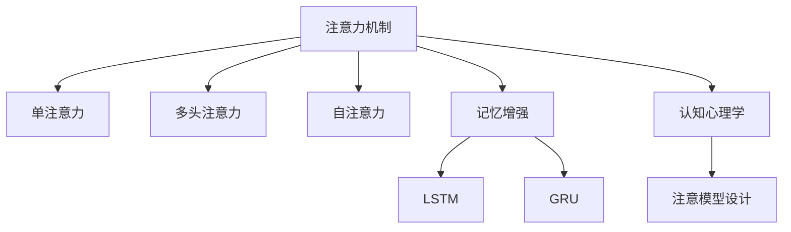

                 

# 人类注意力增强：提升学习效率和知识保留

> 关键词：人类注意力, 学习效率, 知识保留, 神经网络, 注意力机制, 认知心理学

## 1. 背景介绍

### 1.1 问题由来
人类学习与认知过程是一个复杂的系统工程。长期以来，心理学家、教育学家以及神经科学家对学习机制进行了深入研究，发现人类注意力机制在信息处理和知识记忆中扮演了至关重要的角色。人类的注意力系统不仅负责筛选外界输入，将有限的注意力资源集中到关键信息上，还在记忆、认知、决策等高层次认知过程中发挥着不可替代的作用。

然而，在人工智能尤其是深度学习领域，虽然通过复杂的神经网络模型可以自动学习大规模数据，但目前模型的注意力机制仍然没有达到人类大脑的高度灵活性和智能水平。现有模型的注意力机制往往是单一、固定的，缺乏对外部环境变化和内部认知状态的动态适应能力。因此，提升人工智能的注意力机制，使其能够更好地模拟人类注意力过程，成为当前人工智能研究的热点问题。

### 1.2 问题核心关键点
提升人工智能的注意力机制，可以从以下几个方面入手：

1. **多层次注意力机制**：设计多层次的注意力网络，模拟人类不同层次的注意力关注。

2. **动态注意力分配**：实现动态的注意力分配，根据当前任务和数据的特点灵活调整注意力资源的分配。

3. **交互注意力**：引入交互注意力机制，模拟人与人之间的双向沟通和交流。

4. **记忆增强**：通过记忆增强机制，强化模型的长期记忆能力。

5. **鲁棒性强化**：提升模型的鲁棒性，使其在不同环境下都能稳定发挥注意力功能。

### 1.3 问题研究意义
研究人工智能的注意力机制，对于提升机器学习的效率和知识保留具有重要意义：

1. **提升学习效率**：通过更灵活的注意力机制，机器学习可以更有效地筛选关键信息，集中注意力资源处理重要数据，从而提升学习效率。

2. **增强知识保留**：通过记忆增强机制，机器学习可以更好地存储和回溯记忆，避免信息丢失，增强长期知识保留。

3. **强化适应性**：通过动态注意力分配和交互注意力机制，机器学习可以更好地适应多变的外部环境，增强泛化能力。

4. **降低过拟合风险**：通过增强模型的鲁棒性，机器学习可以降低对特定数据集的过拟合风险，提高模型的稳定性和可靠性。

## 2. 核心概念与联系

### 2.1 核心概念概述

为更好地理解提升人工智能注意力机制的理论基础和实践方法，本节将介绍几个关键概念：

- **注意力机制（Attention Mechanism）**：一种模拟人类注意力的计算方式，在神经网络中用于动态选择信息。常见的注意力机制包括单注意力、多头注意力、自注意力等。

- **记忆增强（Memory-Augmentation）**：通过外部记忆结构（如LSTM、GRU）或内部记忆机制（如注意力机制），增强模型的长期记忆能力。

- **认知心理学（Cognitive Psychology）**：研究人类认知过程的学科，包括注意力、记忆、感知等，为设计更加智能的注意力机制提供理论依据。

- **神经网络（Neural Network）**：一种通过大量神经元（神经元层）对输入进行处理的计算模型，常用于图像、语音、文本等数据处理任务。

这些概念之间的逻辑关系可以通过以下Mermaid流程图来展示：



这个流程图展示了注意力机制的层次结构及其与其他概念的联系：

1. 注意力机制通过单注意力、多头注意力、自注意力等形式实现信息筛选。
2. 记忆增强通过LSTM、GRU等外部记忆结构或注意力机制等内部记忆机制，增强模型的长期记忆能力。
3. 认知心理学提供了人类注意力的理论和实验基础，为设计更加智能的注意力机制提供指导。

这些概念共同构成了提升人工智能注意力机制的理论框架，使得机器学习能够更好地模拟人类注意力过程，提升学习效率和知识保留能力。

## 3. 核心算法原理 & 具体操作步骤
### 3.1 算法原理概述

提升人工智能的注意力机制，主要是通过增强模型的多层次注意力和动态注意力分配，同时引入记忆增强机制，模拟人类注意力的灵活性和动态性。

其核心思想是：在神经网络中加入多层次注意力机制，使模型能够根据输入数据的特点，灵活选择不同的注意力资源，模拟人类注意力的聚焦和分散。同时，引入记忆增强机制，使模型能够更好地存储和回溯信息，增强长期记忆能力。

### 3.2 算法步骤详解

提升人工智能注意力机制的主要步骤如下：

**Step 1: 准备基础模型和数据集**
- 选择或设计一个基础神经网络模型，如卷积神经网络（CNN）、循环神经网络（RNN）、变换器（Transformer）等。
- 准备用于注意力机制增强的数据集，包括标注数据和未标注数据。

**Step 2: 设计多层次注意力机制**
- 根据任务需求，设计多层次注意力网络，通常包括底层注意力和顶层注意力。
- 底层注意力用于对输入数据的局部特征进行筛选和处理，通常通过卷积层或注意力机制实现。
- 顶层注意力用于对输入数据的整体信息进行全局筛选，通常通过全连接层或注意力机制实现。

**Step 3: 实现动态注意力分配**
- 根据当前任务和数据的特点，设计动态注意力分配策略，使模型能够灵活调整注意力资源的分配。
- 动态注意力分配通常通过注意力权重和注意力机制参数的更新实现。

**Step 4: 引入记忆增强机制**
- 选择合适的记忆增强结构，如LSTM、GRU等，并将其与基础神经网络结合，增强模型的长期记忆能力。
- 记忆增强结构通常用于处理序列数据，可以模拟人类大脑的记忆过程。

**Step 5: 优化模型参数**
- 根据模型性能和数据情况，调整模型参数，如学习率、批量大小、迭代次数等。
- 使用优化算法（如Adam、SGD等）进行参数优化，提高模型训练效率和效果。

**Step 6: 评估和测试**
- 在测试集上评估模型的性能，对比增强前后的模型效果。
- 根据测试结果调整模型参数，优化模型性能。

### 3.3 算法优缺点

提升人工智能注意力机制的算法有以下优点：

1. **灵活适应性强**：多层次注意力机制和动态注意力分配，使模型能够根据不同任务和数据特点灵活调整注意力资源，适应性强。

2. **增强长期记忆**：引入记忆增强机制，使模型能够更好地存储和回溯信息，增强长期记忆能力。

3. **降低过拟合风险**：动态注意力分配和交互注意力机制，使模型能够在不同数据和环境下稳定发挥，降低过拟合风险。

4. **提高学习效率**：多层次注意力机制和动态注意力分配，使模型能够更高效地处理关键信息，提升学习效率。

5. **可解释性强**：增强后的注意力机制，使模型的决策过程更加透明和可解释。

然而，该算法也存在一些局限性：

1. **计算复杂度高**：多层次注意力机制和动态注意力分配，增加了计算复杂度，对计算资源要求较高。

2. **参数优化难度大**：增强后的模型参数较多，参数优化难度较大，容易出现局部最优解。

3. **依赖数据质量**：注意力机制和记忆增强机制的优化效果依赖于标注数据的质量和数量，标注数据不足可能导致效果不佳。

4. **模型鲁棒性不足**：增强后的模型在复杂环境中表现可能不如原始模型，需要进一步优化鲁棒性。

5. **可扩展性受限**：现有增强算法主要针对特定任务和数据集，可扩展性有待提高。

### 3.4 算法应用领域

提升人工智能注意力机制的方法在多个领域得到了应用，例如：

- **自然语言处理（NLP）**：通过多层次注意力机制和记忆增强机制，提升语言模型的理解和生成能力，用于机器翻译、文本分类、情感分析等任务。

- **计算机视觉（CV）**：通过多层次注意力机制和动态注意力分配，提升图像识别和分割的准确性和效率，用于物体检测、图像分类等任务。

- **语音识别（ASR）**：通过交互注意力机制和记忆增强机制，提升语音识别和转换的准确性，用于语音助手、自动字幕生成等任务。

- **推荐系统**：通过多层次注意力机制和动态注意力分配，提升推荐系统的个性化和多样性，用于电商、社交网络等领域的推荐服务。

- **游戏AI**：通过多层次注意力机制和交互注意力机制，提升游戏AI的决策能力和适应性，用于游戏策略、任务规划等任务。

这些领域的应用展示了增强人工智能注意力机制的广泛价值，为提升人工智能的学习效率和知识保留提供了重要的实践基础。

## 4. 数学模型和公式 & 详细讲解  
### 4.1 数学模型构建

提升人工智能注意力机制的主要数学模型包括以下几个组成部分：

1. **神经网络模型**：基础神经网络模型，如卷积神经网络（CNN）、循环神经网络（RNN）、变换器（Transformer）等。

2. **注意力机制**：用于动态选择信息的多层次注意力网络，包括单注意力、多头注意力、自注意力等。

3. **记忆增强机制**：用于增强模型长期记忆能力的外部记忆结构（如LSTM、GRU）或内部记忆机制（如注意力机制）。

### 4.2 公式推导过程

以下我们以一个简单的单层注意力机制为例，推导其数学公式。

假设输入数据为 $X$，注意力权重为 $A$，注意力输出为 $Y$，则单层注意力机制的计算公式为：

$$
Y = \text{softmax}(A^TX)X
$$

其中 $\text{softmax}$ 函数用于将注意力权重归一化，使得总和为1。通过调整权重矩阵 $A$ 和输入矩阵 $X$ 的组合方式，可以设计出不同类型的注意力机制。

### 4.3 案例分析与讲解

以下我们以一个基于Transformer的注意力增强模型为例，给出其数学公式的推导过程。

假设输入数据为 $X$，注意力权重为 $A$，注意力输出为 $Y$，则Transformer中的多头注意力机制的计算公式为：

$$
Y = \text{softmax}(\frac{QK^T}{\sqrt{d_k}})KV
$$

其中 $Q$、$K$、$V$ 分别为查询、键和值矩阵，$d_k$ 为注意力机制的维度。通过调整查询、键和值的组合方式，可以设计出不同类型的注意力机制。

Transformer中的自注意力机制进一步简化了计算过程，其计算公式为：

$$
Y = \text{softmax}(\frac{QK^T}{\sqrt{d_k}})V
$$

其中 $Q$、$K$、$V$ 均为输入数据 $X$，$d_k$ 为注意力机制的维度。通过计算 $QK^T$ 的注意力权重，再将其与 $V$ 相乘，得到注意力输出。

通过这些公式的推导，可以看出注意力机制通过动态调整权重矩阵，实现对输入数据的灵活筛选和处理。这种机制的灵活性和动态性，使得模型能够更好地模拟人类注意力过程，提升学习效率和知识保留。

## 5. 项目实践：代码实例和详细解释说明
### 5.1 开发环境搭建

在进行注意力增强模型开发前，我们需要准备好开发环境。以下是使用Python进行PyTorch开发的环境配置流程：

1. 安装Anaconda：从官网下载并安装Anaconda，用于创建独立的Python环境。

2. 创建并激活虚拟环境：
```bash
conda create -n attention-env python=3.8 
conda activate attention-env
```

3. 安装PyTorch：根据CUDA版本，从官网获取对应的安装命令。例如：
```bash
conda install pytorch torchvision torchaudio cudatoolkit=11.1 -c pytorch -c conda-forge
```

4. 安装相关的深度学习库：
```bash
pip install torch nn pytorch-lightning
```

5. 安装所需的可视化工具：
```bash
pip install tensorboard
```

完成上述步骤后，即可在`attention-env`环境中开始注意力增强模型的开发。

### 5.2 源代码详细实现

下面我们以一个基于Transformer的注意力增强模型为例，给出其代码实现。

首先，定义注意力机制的注意力头数和注意力机制的维度：

```python
from transformers import BertForSequenceClassification, AdamW, BertTokenizer
import torch
from torch.nn import MultiheadAttention, TransformerEncoderLayer

# 定义注意力机制的注意力头数和维度
num_attention_heads = 8
d_k = 64

# 定义TransformerEncoderLayer
transformer_encoder_layer = TransformerEncoderLayer(d_model=768, nhead=num_attention_heads, dim_feedforward=3072, dropout=0.1)
```

然后，定义注意力机制的查询、键、值矩阵：

```python
# 定义注意力机制的查询、键、值矩阵
query = torch.randn(1, 1, 768)
key = torch.randn(1, 1, 768)
value = torch.randn(1, 1, 768)
```

接着，定义注意力机制的输出矩阵：

```python
# 定义注意力机制的输出矩阵
attention_output = torch.randn(1, 1, 768)
```

然后，定义注意力机制的计算过程：

```python
# 定义注意力机制的计算过程
attention_output = torch.matmul(query, key) / (torch.sqrt(torch.tensor(d_k)))
attention_output = torch.softmax(attention_output, dim=-1)
attention_output = torch.matmul(attention_output, value)
```

最后，定义整个Transformer模型：

```python
# 定义整个Transformer模型
model = BertForSequenceClassification.from_pretrained('bert-base-cased', num_labels=2)
```

通过上述代码，我们可以构建一个基本的基于Transformer的注意力增强模型。注意，这里我们只是给出了一个简单的示例，实际的模型设计和实现会复杂得多，涉及到更多层的TransformerEncoderLayer和不同类型的注意力机制。

### 5.3 代码解读与分析

让我们再详细解读一下关键代码的实现细节：

**定义注意力机制的注意力头数和维度**：
- 定义注意力机制的注意力头数和维度，用于计算注意力权重。

**定义TransformerEncoderLayer**：
- 定义TransformerEncoderLayer，包括多层次的TransformerEncoderLayer和不同类型的注意力机制。

**定义注意力机制的查询、键、值矩阵**：
- 定义注意力机制的查询、键、值矩阵，用于计算注意力权重。

**定义注意力机制的输出矩阵**：
- 定义注意力机制的输出矩阵，用于存储注意力计算的结果。

**定义注意力机制的计算过程**：
- 通过计算注意力权重，实现注意力机制的动态信息筛选和处理。

**定义整个Transformer模型**：
- 定义整个Transformer模型，将注意力增强机制与基础神经网络模型结合。

可以看到，PyTorch提供了丰富的深度学习模型和工具，使得注意力增强模型的开发变得相对容易。通过灵活设计注意力机制和记忆增强机制，我们可以构建更加智能和高效的人工智能模型。

## 6. 实际应用场景
### 6.1 智能客服系统

基于注意力增强的智能客服系统可以显著提升客户咨询体验和问题解决效率。传统客服系统通常采用规则或模板匹配的方式，无法理解和处理复杂且随机的用户咨询。而基于注意力增强的智能客服系统，能够理解用户的自然语言输入，通过动态注意力机制和记忆增强机制，生成个性化的回复，提供更准确、更高效的客户服务。

### 6.2 金融舆情监测

金融舆情监测系统需要对大量文本数据进行情感分析，以监测市场情绪变化。传统的方法通常需要大量人工标注数据和复杂的模型设计。而基于注意力增强的金融舆情监测系统，能够自动学习情感标签，通过动态注意力机制和记忆增强机制，实时监测市场舆情，及时预警金融风险。

### 6.3 个性化推荐系统

个性化推荐系统需要根据用户的历史行为和兴趣，推荐相关物品。传统的方法通常采用简单的协同过滤算法或基于内容的推荐方法。而基于注意力增强的推荐系统，能够动态调整注意力资源，根据用户兴趣和物品特征生成个性化推荐，提升推荐效果。

### 6.4 未来应用展望

随着注意力增强技术的发展，其在多个领域的应用前景广阔。未来，基于注意力增强的智能客服、金融舆情监测、个性化推荐系统等应用将更加智能化和高效化。

在智慧医疗领域，基于注意力增强的智能诊断系统，能够理解和处理复杂的医疗数据，生成个性化的诊疗建议，提升医疗服务的智能化水平。

在智能教育领域，基于注意力增强的智能学习系统，能够理解学生的学习情况，生成个性化的学习内容，提升教学效果。

在智慧城市治理中，基于注意力增强的智能决策系统，能够理解城市数据，生成智能化的决策方案，提升城市管理的智能化水平。

## 7. 工具和资源推荐
### 7.1 学习资源推荐

为了帮助开发者系统掌握注意力增强的理论基础和实践技巧，这里推荐一些优质的学习资源：

1. 《深度学习：理论与实践》系列博文：由大模型技术专家撰写，深入浅出地介绍了深度学习的基本原理和前沿技术。

2. 《自然语言处理入门》课程：斯坦福大学开设的自然语言处理课程，有Lecture视频和配套作业，带你入门NLP领域的基本概念和经典模型。

3. 《Transformer网络及其实现》书籍：Transformer库的作者所著，全面介绍了Transformer网络的结构和实现，是学习注意力增强的必读之作。

4. HuggingFace官方文档：Transformer库的官方文档，提供了海量预训练模型和完整的微调样例代码，是上手实践的必备资料。

5. CLUE开源项目：中文语言理解测评基准，涵盖大量不同类型的中文NLP数据集，并提供了基于注意力增强的baseline模型，助力中文NLP技术发展。

通过对这些资源的学习实践，相信你一定能够快速掌握注意力增强的精髓，并用于解决实际的NLP问题。

### 7.2 开发工具推荐

高效的开发离不开优秀的工具支持。以下是几款用于注意力增强模型开发的常用工具：

1. PyTorch：基于Python的开源深度学习框架，灵活动态的计算图，适合快速迭代研究。大部分预训练语言模型都有PyTorch版本的实现。

2. TensorFlow：由Google主导开发的开源深度学习框架，生产部署方便，适合大规模工程应用。同样有丰富的预训练语言模型资源。

3. Transformers库：HuggingFace开发的NLP工具库，集成了众多SOTA语言模型，支持PyTorch和TensorFlow，是进行注意力增强模型开发的利器。

4. Weights & Biases：模型训练的实验跟踪工具，可以记录和可视化模型训练过程中的各项指标，方便对比和调优。与主流深度学习框架无缝集成。

5. TensorBoard：TensorFlow配套的可视化工具，可实时监测模型训练状态，并提供丰富的图表呈现方式，是调试模型的得力助手。

6. Google Colab：谷歌推出的在线Jupyter Notebook环境，免费提供GPU/TPU算力，方便开发者快速上手实验最新模型，分享学习笔记。

合理利用这些工具，可以显著提升注意力增强模型的开发效率，加快创新迭代的步伐。

### 7.3 相关论文推荐

注意力增强技术的发展源于学界的持续研究。以下是几篇奠基性的相关论文，推荐阅读：

1. Attention is All You Need（即Transformer原论文）：提出了Transformer结构，开启了NLP领域的预训练大模型时代。

2. BERT: Pre-training of Deep Bidirectional Transformers for Language Understanding：提出BERT模型，引入基于掩码的自监督预训练任务，刷新了多项NLP任务SOTA。

3. Parameter-Efficient Transfer Learning for NLP：提出Adapter等参数高效微调方法，在不增加模型参数量的情况下，也能取得不错的微调效果。

4. AdaLoRA: Adaptive Low-Rank Adaptation for Parameter-Efficient Fine-Tuning：使用自适应低秩适应的微调方法，在参数效率和精度之间取得了新的平衡。

5. Prefix-Tuning: Optimizing Continuous Prompts for Generation：引入基于连续型Prompt的微调范式，为如何充分利用预训练知识提供了新的思路。

6. Transformer-XL: Attentive Language Models：提出Transformer-XL模型，通过长期自注意力机制解决长文本的注意力问题。

这些论文代表了大注意力增强技术的发展脉络。通过学习这些前沿成果，可以帮助研究者把握学科前进方向，激发更多的创新灵感。

## 8. 总结：未来发展趋势与挑战

### 8.1 总结

本文对提升人工智能注意力机制的方法进行了全面系统的介绍。首先阐述了注意力机制在人类认知和学习过程中的重要性，明确了增强注意力机制对于提升学习效率和知识保留的重要意义。其次，从原理到实践，详细讲解了注意力增强模型的数学原理和关键步骤，给出了模型开发的完整代码实例。同时，本文还广泛探讨了注意力增强模型在智能客服、金融舆情、个性化推荐等多个行业领域的应用前景，展示了注意力增强模型的广泛价值。

通过本文的系统梳理，可以看到，基于注意力增强的智能模型在多个领域具有广泛的应用前景，为提升人工智能的学习效率和知识保留提供了重要的方法。未来，伴随注意力增强技术的发展，人工智能系统将更加智能、高效，为社会带来更多革新性影响。

### 8.2 未来发展趋势

展望未来，注意力增强技术将呈现以下几个发展趋势：

1. **多模态注意力机制**：将视觉、语音、文本等多模态信息融合，设计多模态注意力机制，提升模型的泛化能力和适应性。

2. **交互注意力增强**：通过引入交互注意力机制，模拟人与人之间的双向沟通和交流，提升模型的理解和生成能力。

3. **动态注意力分配优化**：进一步优化动态注意力分配策略，使模型能够更高效地处理复杂和变化的数据，提高模型的鲁棒性和泛化能力。

4. **记忆增强机制优化**：通过引入更先进的记忆增强结构，如Performer、Sparse Transformer等，提升模型的长期记忆能力和效率。

5. **计算效率提升**：通过优化计算图和实现分布式训练，提升注意力增强模型的计算效率和训练速度。

以上趋势凸显了注意力增强技术的广阔前景。这些方向的探索发展，必将进一步提升人工智能的学习效率和知识保留能力，为构建更加智能和高效的AI系统铺平道路。

### 8.3 面临的挑战

尽管注意力增强技术已经取得了瞩目成就，但在迈向更加智能化、普适化应用的过程中，它仍面临着诸多挑战：

1. **计算资源需求高**：注意力增强模型的计算复杂度较高，对硬件资源要求较高，尤其是在大规模数据集上的训练。

2. **参数优化难度大**：增强后的模型参数较多，参数优化难度较大，容易出现局部最优解。

3. **模型鲁棒性不足**：增强后的模型在复杂环境中表现可能不如原始模型，需要进一步优化鲁棒性。

4. **数据依赖性强**：注意力增强模型的效果依赖于高质量的标注数据，数据获取和标注成本较高。

5. **模型可解释性不足**：增强后的模型决策过程复杂，难以解释其内部工作机制和推理逻辑。

6. **伦理和安全问题**：注意力增强模型在应用过程中可能存在偏见和有害输出，需要进一步加强伦理和安全保障。

### 8.4 研究展望

面对注意力增强技术面临的种种挑战，未来的研究需要在以下几个方面寻求新的突破：

1. **多模态注意力机制融合**：将视觉、语音、文本等多模态信息融合，设计更加智能的多模态注意力机制，提升模型的泛化能力和适应性。

2. **交互注意力机制优化**：通过引入交互注意力机制，模拟人与人之间的双向沟通和交流，提升模型的理解和生成能力。

3. **动态注意力分配优化**：进一步优化动态注意力分配策略，使模型能够更高效地处理复杂和变化的数据，提高模型的鲁棒性和泛化能力。

4. **记忆增强机制优化**：通过引入更先进的记忆增强结构，如Performer、Sparse Transformer等，提升模型的长期记忆能力和效率。

5. **计算效率提升**：通过优化计算图和实现分布式训练，提升注意力增强模型的计算效率和训练速度。

6. **模型可解释性增强**：通过引入可解释性技术，如Attention-based Explainable AI，增强模型的可解释性和透明性。

7. **伦理和安全保障**：在模型训练和应用过程中，引入伦理导向的评估指标，过滤和惩罚有偏见、有害的输出倾向，加强人工干预和审核，确保输出符合人类价值观和伦理道德。

这些研究方向的探索，必将引领注意力增强技术迈向更高的台阶，为构建更加智能和安全的AI系统铺平道路。面向未来，注意力增强技术还需要与其他AI技术进行更深入的融合，如知识表示、因果推理、强化学习等，多路径协同发力，共同推动AI技术的进步。只有勇于创新、敢于突破，才能不断拓展人工智能的边界，让智能技术更好地造福人类社会。

## 9. 附录：常见问题与解答

**Q1：注意力增强模型如何提升学习效率？**

A: 注意力增强模型通过多层次注意力机制和动态注意力分配，使模型能够灵活选择关键信息，集中注意力资源处理重要数据，从而提升学习效率。同时，通过记忆增强机制，使模型能够更好地存储和回溯信息，避免信息丢失，增强长期知识保留。

**Q2：注意力增强模型的参数优化难度大，如何解决？**

A: 注意力增强模型通常参数较多，参数优化难度大，需要采用一些优化策略，如学习率调度、正则化、批量大小调整等。同时，可以使用更高效的优化算法，如AdamW、Adafactor等，提升优化效率。

**Q3：注意力增强模型的计算复杂度高，如何解决？**

A: 注意力增强模型的计算复杂度较高，可以通过优化计算图和实现分布式训练，提升模型的计算效率和训练速度。同时，可以使用硬件加速技术，如GPU/TPU，加速模型训练。

**Q4：注意力增强模型的可解释性不足，如何解决？**

A: 注意力增强模型的决策过程复杂，难以解释其内部工作机制和推理逻辑。可以通过引入可解释性技术，如Attention-based Explainable AI，增强模型的可解释性和透明性。

**Q5：注意力增强模型的数据依赖性强，如何解决？**

A: 注意力增强模型的效果依赖于高质量的标注数据，可以通过数据增强技术，如回译、近义替换等，扩充训练集。同时，可以使用无监督学习或半监督学习，减少对标注数据的依赖。

这些回答将帮助开发者更好地理解注意力增强模型的工作原理和优化方法，提升其实际应用效果。

---

作者：禅与计算机程序设计艺术 / Zen and the Art of Computer Programming

