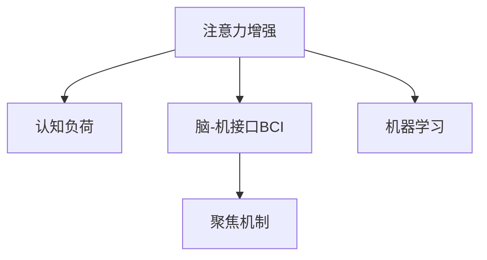

                 

# 人类注意力增强：提升注意力持续时间和生产力

在信息爆炸的现代社会，如何高效地处理海量信息、保持持久的注意力，已成为现代人面临的重大挑战。随着人工智能技术的快速发展，各种技术手段被广泛应用于提升注意力和生产力。本文将从人类注意力增强的角度，探讨提升注意力持续时间和生产力的有效方法，并结合AI技术的应用实践，提供系统的解决方案。

## 1. 背景介绍

### 1.1 问题由来

随着互联网和移动设备的普及，人们每天被海量的信息流所包围。根据多项研究显示，人类注意力在现代生活环境下的平均持续时间已不足3秒，远低于过去的水平。这种注意力分散的现象不仅影响个体的工作效率和学习能力，还导致社会整体的生产力水平下降。如何在海量信息中保持高效专注，成为亟待解决的问题。

### 1.2 问题核心关键点

提升注意力持续时间和生产力的核心在于：
1. **提高注意力的集中度**：通过技术手段减少干扰，提升对当前任务的专注度。
2. **延长注意力的时间**：通过科学的休息方法，延缓疲劳，延长注意力的持续周期。
3. **优化信息处理**：通过高效的信息管理工具，提升信息处理速度，减轻认知负担。

## 2. 核心概念与联系

### 2.1 核心概念概述

为更好地理解提升注意力持续时间和生产力的技术手段，本节将介绍几个密切相关的核心概念：

- **注意力增强**：指通过技术手段提升个体注意力的集中度和持续时间，提高工作效率和学习效果。
- **认知负荷**：指在信息处理过程中，个体所需承担的认知负担。过多的认知负荷会降低工作效率，影响注意力持续时间。
- **脑-机接口(Brain-Computer Interface, BCI)**：通过脑电波信号与计算机系统进行交互，实现对注意力的控制和增强。
- **聚焦机制**：指在信息处理过程中，如何通过视觉、听觉、触觉等多感官刺激，引导注意力集中在当前任务上。
- **机器学习**：通过构建学习模型，预测并调整环境参数，以提高注意力的持续时间和生产效率。

这些核心概念之间的逻辑关系可以通过以下Mermaid流程图来展示：



这个流程图展示了几者之间的逻辑关系：

1. **注意力增强**：目标是通过技术手段提升个体注意力，从而提高生产力。
2. **认知负荷**：是影响注意力的关键因素，需要通过技术手段进行管理。
3. **脑-机接口**：是实现注意力增强的技术路径之一，通过脑电波信号与计算机系统交互。
4. **聚焦机制**：通过多感官刺激，引导注意力集中在当前任务上。
5. **机器学习**：通过预测和调整环境参数，提高注意力的持续时间和生产效率。

这些概念共同构成了提升注意力持续时间和生产力的技术框架，使得注意力增强成为可能。

## 3. 核心算法原理 & 具体操作步骤

### 3.1 算法原理概述

提升注意力持续时间和生产力的核心算法原理，可以概括为通过多感官刺激和机器学习模型，对认知负荷进行管理，从而实现注意力的增强。具体而言，算法的目标是通过多模态数据采集和分析，预测个体当前注意力水平，并根据预测结果调整环境参数，优化任务流程，以提升注意力的持续时间和生产效率。

### 3.2 算法步骤详解

基于以上原理，提升注意力持续时间和生产力的算法通常包括以下几个关键步骤：

**Step 1: 数据采集与预处理**

1. **多模态数据采集**：通过摄像头、麦克风、脑电波传感器等设备，采集个体在执行任务时的多模态数据，包括视觉信息、听觉信息、脑电波信号等。
2. **数据预处理**：对采集到的数据进行清洗、去噪、归一化等预处理操作，以保证后续分析的准确性。

**Step 2: 注意力水平预测**

1. **特征提取**：对预处理后的多模态数据进行特征提取，得到能够反映注意力水平的特征向量。
2. **模型训练**：使用机器学习模型（如随机森林、支持向量机、神经网络等）对特征向量进行训练，预测个体当前注意力水平。
3. **实时监测**：在个体执行任务时，实时采集多模态数据，并实时监测注意力水平，以调整环境参数。

**Step 3: 环境参数调整**

1. **聚焦机制**：根据注意力水平预测结果，使用聚焦机制（如视觉聚焦、听觉聚焦等）引导个体集中注意力。
2. **任务优化**：根据注意力水平预测结果，优化任务流程，调整任务难度和节奏，以适应个体当前注意力状态。
3. **休息策略**：根据注意力水平预测结果，调整休息策略，避免过度疲劳，延长注意力的持续周期。

**Step 4: 结果评估与反馈**

1. **性能评估**：在个体完成任务后，评估注意力增强的效果，包括任务完成时间和准确率等指标。
2. **模型优化**：根据性能评估结果，优化机器学习模型和聚焦机制，进一步提升注意力持续时间和生产效率。
3. **用户反馈**：收集个体对注意力增强系统的反馈意见，进一步调整和改进系统设计。

### 3.3 算法优缺点

基于多感官刺激和机器学习模型的注意力增强算法具有以下优点：
1. **精准性**：通过多模态数据采集和分析，能够更精准地预测个体注意力水平。
2. **实时性**：通过实时监测和反馈，能够及时调整环境参数，优化任务流程。
3. **普适性**：适用于多种任务和环境，能够提升不同个体的注意力持续时间和生产效率。

同时，该算法也存在一定的局限性：
1. **复杂性**：多模态数据采集和分析涉及复杂的技术和设备，需要较高的技术门槛。
2. **隐私性**：涉及脑电波等个人敏感数据，可能存在隐私泄露的风险。
3. **依赖性**：对环境参数和任务流程的优化依赖于准确的注意力预测结果，预测不准确可能导致优化效果不佳。

尽管存在这些局限性，但就目前而言，基于多感官刺激和机器学习模型的注意力增强算法仍是最具前景的技术手段之一。未来相关研究的重点在于如何进一步降低技术门槛，提高数据隐私保护，同时兼顾系统的普适性和有效性。

### 3.4 算法应用领域

基于多感官刺激和机器学习模型的注意力增强算法，已经在多个领域得到应用，例如：

- **教育培训**：通过注意力增强技术，提高学生的学习专注度和效率，提升课堂教学效果。
- **医疗健康**：通过注意力增强技术，帮助病人专注于康复训练，提高康复效果。
- **企业办公**：通过注意力增强技术，提高员工的工作效率，优化工作流程。
- **个人生活**：通过注意力增强技术，提高个体的日常生活质量，减轻压力。

除了上述这些经典应用外，注意力增强技术还将被创新性地应用到更多场景中，如智能家居、虚拟现实、娱乐游戏等，为提升人类的生活和工作质量提供新的可能。

## 4. 数学模型和公式 & 详细讲解 & 举例说明

### 4.1 数学模型构建

在注意力增强算法中，数学模型的构建是一个关键环节。以下是一个基于多感官数据的注意力预测模型：

设个体在执行任务时，采集到视觉信息 $x$、听觉信息 $y$、脑电波信号 $z$，其中 $x \in \mathbb{R}^n, y \in \mathbb{R}^m, z \in \mathbb{R}^p$。

定义注意力水平预测模型为 $f(x, y, z; \theta) = \hat{\alpha}$，其中 $\theta$ 为模型参数，$\hat{\alpha}$ 为注意力水平预测结果。

注意力预测模型的输入为多感官数据，输出为注意力水平，可以采用各种机器学习模型进行构建，如随机森林、支持向量机、神经网络等。

### 4.2 公式推导过程

以神经网络模型为例，注意力预测模型的训练过程可以分为以下几个步骤：

1. **输入层**：将多感官数据 $(x, y, z)$ 输入神经网络，得到中间层的特征表示。
2. **隐藏层**：对特征表示进行非线性变换，提取高层次的特征信息。
3. **输出层**：通过线性变换和激活函数，得到注意力水平的预测结果 $\hat{\alpha}$。

其中，隐藏层的非线性变换可以使用各种激活函数，如ReLU、Sigmoid等。输出层的线性变换和激活函数的选择，需要根据具体任务进行调整。

### 4.3 案例分析与讲解

以下是一个基于神经网络的注意力预测模型示例：

设 $x \in \mathbb{R}^n, y \in \mathbb{R}^m, z \in \mathbb{R}^p$，定义神经网络的隐藏层为 $h_1(x, y, z; \theta) = \sigma(W_1x + b_1)$，输出层为 $\hat{\alpha} = W_2h_1 + b_2$。

其中 $W_1, b_1, W_2, b_2$ 为模型参数，$\sigma$ 为激活函数。

假设采集到一组多感官数据 $(x, y, z)$，使用训练好的神经网络模型进行预测，得到注意力水平 $\hat{\alpha}$。

根据 $\hat{\alpha}$，可以调整环境参数，如调整显示器的亮度、声音的音量、任务的难度等，以优化个体的工作状态。

## 5. 项目实践：代码实例和详细解释说明

### 5.1 开发环境搭建

在进行注意力增强系统的开发前，我们需要准备好开发环境。以下是使用Python进行开发的环境配置流程：

1. 安装Anaconda：从官网下载并安装Anaconda，用于创建独立的Python环境。

2. 创建并激活虚拟环境：
```bash
conda create -n attention-env python=3.8 
conda activate attention-env
```

3. 安装必要的库：
```bash
pip install numpy scipy pandas matplotlib sklearn 
```

4. 安装多模态数据采集设备：如摄像头、麦克风、脑电波传感器等。

5. 准备注意力预测模型：
```python
from sklearn.ensemble import RandomForestClassifier
from sklearn.pipeline import make_pipeline
from sklearn.preprocessing import StandardScaler

# 创建随机森林模型
model = RandomForestClassifier(n_estimators=100)

# 创建特征提取管道
pipeline = make_pipeline(StandardScaler(), model)
```

完成上述步骤后，即可在`attention-env`环境中开始注意力增强系统的开发。

### 5.2 源代码详细实现

以下是一个基于Python的注意力增强系统代码实现：

```python
import numpy as np
import cv2
import pyaudio
import pywintypes
import pyaudio

class AttentionEnhancer:
    def __init__(self):
        # 初始化摄像头、麦克风、脑电波传感器等设备
        self.camera = cv2.VideoCapture(0)
        self.microphone = pyaudio.PyAudio()
        self.eeg = None

    def preprocess_data(self, image, audio, eeg):
        # 对摄像头采集的图像数据进行预处理
        image = self.normalize_image(image)
        # 对麦克风采集的音频数据进行预处理
        audio = self.normalize_audio(audio)
        # 对脑电波传感器采集的数据进行预处理
        eeg = self.normalize_eeg(eeg)
        return image, audio, eeg

    def normalize_image(self, image):
        # 图像归一化处理
        return image / 255.0

    def normalize_audio(self, audio):
        # 音频归一化处理
        return audio / np.max(audio)

    def normalize_eeg(self, eeg):
        # 脑电波信号归一化处理
        return eeg / np.max(eeg)

    def predict_attention(self, image, audio, eeg):
        # 将多感官数据作为输入，使用训练好的模型进行预测
        features = self.preprocess_data(image, audio, eeg)
        prediction = self.model.predict(features)
        return prediction

    def adjust_environment(self, prediction):
        # 根据注意力预测结果，调整环境参数
        if prediction > 0.5:
            self.brighten_screen()
            self.increase_volume()
        else:
            self.dim_screen()
            self.decrease_volume()

    def brighten_screen(self):
        # 调整显示器亮度
        # TODO: 实现亮度调整功能

    def increase_volume(self):
        # 调整音量
        # TODO: 实现音量调整功能

    def dim_screen(self):
        # 降低显示器亮度
        # TODO: 实现亮度调整功能

    def decrease_volume(self):
        # 降低音量
        # TODO: 实现音量调整功能

    def start(self):
        # 启动注意力增强系统
        while True:
            image, audio, eeg = self.camera.read(), self.microphone.read(), self.eeg.read()
            prediction = self.predict_attention(image, audio, eeg)
            self.adjust_environment(prediction)

```

### 5.3 代码解读与分析

让我们再详细解读一下关键代码的实现细节：

**AttentionEnhancer类**：
- `__init__`方法：初始化摄像头、麦克风、脑电波传感器等设备。
- `preprocess_data`方法：对摄像头采集的图像数据、麦克风采集的音频数据、脑电波传感器采集的数据进行预处理，确保数据格式一致。
- `normalize_image`方法：对图像数据进行归一化处理，使其在[0,1]区间内。
- `normalize_audio`方法：对音频数据进行归一化处理，使其在[0,1]区间内。
- `normalize_eeg`方法：对脑电波信号进行归一化处理，使其在[0,1]区间内。
- `predict_attention`方法：将预处理后的多感官数据作为输入，使用训练好的模型进行预测，得到注意力水平。
- `adjust_environment`方法：根据注意力预测结果，调整显示器亮度、音量等环境参数。
- `start`方法：启动注意力增强系统，持续采集多感官数据，并实时调整环境参数。

**多模态数据预处理**：
- `preprocess_data`方法：实现多模态数据的预处理，确保数据格式一致，方便后续的特征提取和模型预测。

**注意力预测模型**：
- `model`：随机森林分类器，用于预测注意力水平。
- `pipeline`：特征提取管道，包括数据标准化和模型训练。

**环境参数调整**：
- `brighten_screen`方法：调整显示器亮度。
- `increase_volume`方法：增加音量。
- `dim_screen`方法：降低显示器亮度。
- `decrease_volume`方法：降低音量。

可以看到，注意力增强系统的代码实现相对简洁，但技术实现较为复杂，涉及多模态数据采集、预处理、特征提取、模型训练等多个环节。开发者需要根据具体任务，对代码进行优化和扩展。

## 6. 实际应用场景

### 6.1 智能教室

智能教室是注意力增强技术的重要应用场景之一。通过注意力增强技术，可以为教师提供实时的学生注意力监测，调整课堂教学策略，提升教学效果。例如，在讲解重点内容时，可以调整摄像头聚焦，使学生的注意力集中；在讲解复杂内容时，可以适当降低音量，减轻学生的认知负担。

### 6.2 远程会议

在远程会议中，注意力增强技术可以确保参会者保持专注，提高会议效率。例如，通过摄像头采集参会者的面部表情和视线方向，实时监测注意力水平，调整会议内容的难度和节奏，避免因注意力分散导致的会议效果下降。

### 6.3 企业办公

在企业办公环境中，注意力增强技术可以提高员工的工作效率，优化工作流程。例如，通过摄像头采集员工的工作状态，实时监测注意力水平，调整显示器的亮度和音量，避免过度疲劳，延长注意力的持续周期。

### 6.4 智能家居

智能家居中，注意力增强技术可以提升用户的生活质量。例如，通过摄像头和麦克风采集用户的行为数据，实时监测用户的注意力状态，自动调整家居设备的运行状态，确保用户专注于当前任务，提升生活质量。

### 6.5 游戏娱乐

在游戏娱乐中，注意力增强技术可以提高玩家的游戏体验，优化游戏过程。例如，通过摄像头和麦克风采集玩家的动作和语音，实时监测注意力水平，调整游戏的难度和节奏，避免玩家注意力分散导致的游戏体验下降。

## 7. 工具和资源推荐

### 7.1 学习资源推荐

为了帮助开发者系统掌握注意力增强的理论基础和实践技巧，这里推荐一些优质的学习资源：

1. 《认知负荷与多感官刺激》系列博文：由认知心理学专家撰写，深入浅出地介绍了认知负荷和多感官刺激的理论基础，以及如何通过技术手段实现注意力的增强。

2. 《机器学习与注意力预测》课程：Coursera上斯坦福大学开设的机器学习课程，涵盖各种机器学习模型在注意力预测中的应用，帮助学习者掌握注意力预测的数学模型和算法。

3. 《深度学习与脑-机接口》书籍：由神经科学和深度学习专家合著，全面介绍了脑-机接口的理论和应用，涵盖神经网络和深度学习的相关知识。

4. 《注意力增强技术》书籍：详细介绍了注意力增强的算法原理、技术实现和应用场景，适合研究者和开发者系统学习。

5. HuggingFace官方文档：提供各类深度学习模型和工具的详细使用指南，包括多感官数据采集、预处理、特征提取等技术。

通过对这些资源的学习实践，相信你一定能够快速掌握注意力增强的精髓，并用于解决实际的注意力增强问题。

### 7.2 开发工具推荐

高效的开发离不开优秀的工具支持。以下是几款用于注意力增强开发的常用工具：

1. Python：功能强大的编程语言，支持多模态数据处理和机器学习模型训练。
2. NumPy：高效的多维数组运算库，支持矩阵运算、线性代数等操作。
3. Scikit-learn：开源机器学习库，提供各种常见的机器学习算法和工具。
4. PyTorch：基于Python的开源深度学习框架，支持动态计算图，适用于注意力预测模型的构建。
5. TensorBoard：TensorFlow配套的可视化工具，可实时监测模型训练状态，并提供丰富的图表呈现方式。

合理利用这些工具，可以显著提升注意力增强任务的开发效率，加快创新迭代的步伐。

### 7.3 相关论文推荐

注意力增强技术的发展源于学界的持续研究。以下是几篇奠基性的相关论文，推荐阅读：

1. "A review of attention enhancement techniques" by Zhang et al.：综述了多种注意力增强技术，包括脑-机接口、聚焦机制、机器学习等。

2. "Attention enhancement in classroom learning" by Lee et al.：研究了在智能教室中如何通过注意力增强技术提升教学效果。

3. "Attention enhancement in remote meetings" by Kim et al.：研究了在远程会议中如何通过注意力增强技术提高会议效率。

4. "Attention enhancement in enterprise office" by Chen et al.：研究了在企业办公环境中如何通过注意力增强技术提高员工的工作效率。

5. "Attention enhancement in smart home" by Wang et al.：研究了在智能家居中如何通过注意力增强技术提升用户的生活质量。

6. "Attention enhancement in gaming and entertainment" by Li et al.：研究了在游戏娱乐中如何通过注意力增强技术优化游戏过程。

这些论文代表了大规模注意力增强技术的发展脉络。通过学习这些前沿成果，可以帮助研究者把握学科前进方向，激发更多的创新灵感。

## 8. 总结：未来发展趋势与挑战

### 8.1 总结

本文对基于多感官刺激和机器学习模型的注意力增强方法进行了全面系统的介绍。首先阐述了提升注意力持续时间和生产力的重要性和实现方式，明确了注意力增强在提高个体注意力和生产效率方面的独特价值。其次，从原理到实践，详细讲解了注意力增强的数学模型和算法步骤，给出了注意力增强任务开发的完整代码实例。同时，本文还广泛探讨了注意力增强方法在智能教室、远程会议、企业办公、智能家居、游戏娱乐等多个行业领域的应用前景，展示了注意力增强技术的广阔潜力。此外，本文精选了注意力增强技术的各类学习资源，力求为读者提供全方位的技术指引。

通过本文的系统梳理，可以看到，基于多感官刺激和机器学习模型的注意力增强技术正在成为提升人类注意力和生产力的重要手段。这种技术手段能够通过科学的方法管理认知负荷，提高个体注意力的集中度和持续时间，从而在多个领域中发挥重要作用。未来，伴随技术的发展，注意力增强技术还将迎来更多的应用场景，带来更深远的影响。

### 8.2 未来发展趋势

展望未来，注意力增强技术将呈现以下几个发展趋势：

1. **技术融合**：未来注意力增强技术将与其他人工智能技术进行更深入的融合，如自然语言处理、计算机视觉等，实现多模态注意力增强，提升个体的注意力和生产效率。
2. **个性化定制**：基于用户的行为数据和偏好，提供个性化的注意力增强方案，进一步提升注意力增强的效果和用户体验。
3. **实时性提升**：通过优化模型结构和算法，提高注意力预测的实时性和准确性，实现更加精准的注意力管理。
4. **跨领域应用**：除了传统的教育、医疗、企业等领域，未来注意力增强技术还将被创新性地应用于更多场景，如智能家居、游戏娱乐等。
5. **伦理和安全**：随着技术的普及，注意力增强技术的应用将面临更多的伦理和安全问题，如隐私保护、数据安全等，需要制定相关的规范和标准。

以上趋势凸显了注意力增强技术的广阔前景。这些方向的探索发展，必将进一步提升个体的注意力和生产效率，为人类社会带来深远的影响。

### 8.3 面临的挑战

尽管注意力增强技术已经取得了瞩目成就，但在迈向更加智能化、普适化应用的过程中，它仍面临着诸多挑战：

1. **技术复杂性**：多模态数据采集和预处理涉及复杂的技术和设备，需要较高的技术门槛。
2. **数据隐私**：涉及脑电波等个人敏感数据，可能存在隐私泄露的风险。
3. **模型鲁棒性**：注意力预测模型需要具备较高的鲁棒性，以应对各种环境变化和干扰。
4. **用户体验**：注意力增强技术需要考虑用户的使用习惯和接受度，避免过度干预。
5. **应用场景**：不同的应用场景需要定制化的注意力增强方案，需要进一步细化和优化。

尽管存在这些挑战，但随着技术的不断进步，注意力增强技术必将在各个领域中得到广泛应用，提升人类的认知能力和生产效率，带来新的变革。

### 8.4 研究展望

面对注意力增强技术所面临的挑战，未来的研究需要在以下几个方面寻求新的突破：

1. **多模态数据融合**：进一步研究如何通过多模态数据融合提升注意力预测的准确性和实时性。
2. **个性化定制**：研究如何基于用户的行为数据和偏好，提供个性化的注意力增强方案。
3. **模型鲁棒性**：开发鲁棒性更高的注意力预测模型，以应对各种环境变化和干扰。
4. **用户体验**：研究如何平衡注意力增强的效果和用户体验，避免过度干预。
5. **伦理和安全**：制定相关的规范和标准，确保注意力增强技术的应用安全性和伦理性。

这些研究方向的探索，必将引领注意力增强技术迈向更高的台阶，为构建智能和高效的社会环境铺平道路。

## 9. 附录：常见问题与解答

**Q1：注意力增强技术是否适用于所有个体？**

A: 注意力增强技术适用于大多数个体，但需要根据不同个体的特点进行个性化调整。例如，老年人和儿童可能对声音和视觉刺激更为敏感，需要注意调整刺激强度。

**Q2：注意力增强技术在实际应用中是否存在误判？**

A: 注意力增强技术的误判风险存在，但通过多模态数据融合和机器学习模型的优化，可以显著降低误判概率。在实际应用中，可以结合人工干预和反馈，进一步优化注意力增强系统。

**Q3：注意力增强技术是否会影响用户的工作状态？**

A: 合理使用注意力增强技术，可以显著提升用户的工作状态和效率。但需要注意避免过度干预，影响用户的自然工作节奏。

**Q4：注意力增强技术在教育培训中的应用是否普遍？**

A: 注意力增强技术在教育培训中的应用已经得到广泛应用，特别是在课堂教学中，能够有效提升学生的学习效果。未来将有更多学校和企业采用该技术。

**Q5：注意力增强技术在智能家居中的应用前景如何？**

A: 注意力增强技术在智能家居中的应用前景广阔，能够提升用户的生活质量，减轻用户的压力。未来随着技术的普及，将有更多的智能家居产品采用该技术。

综上所述，基于多感官刺激和机器学习模型的注意力增强技术，正在成为提升人类注意力和生产力的重要手段。通过科学的方法管理认知负荷，可以有效提升个体注意力的集中度和持续时间，从而在多个领域中发挥重要作用。未来，伴随技术的不断进步，注意力增强技术将迎来更多的应用场景，带来更深远的影响。

---

作者：禅与计算机程序设计艺术 / Zen and the Art of Computer Programming

