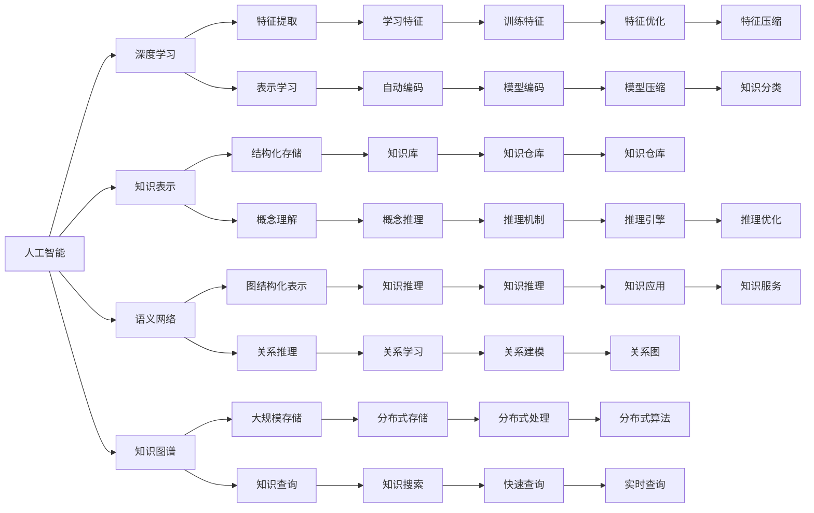

                 

# 人类的知识边界：无限的探索与追求

## 1. 背景介绍

### 1.1 问题由来

人类自古以来就对知识的探索和追求有着不懈的热情，从古代的《周易》、《道德经》到现代的科学发现，人类总是在不断突破自身的知识边界。然而，在信息化时代，海量数据的涌现和人工智能技术的快速发展，使得知识的获取和处理变得更加高效和便捷，但也带来了新的挑战：我们如何处理这些不断涌入的信息，如何让知识更好地服务于社会的发展，以及如何让更多的人参与到知识的创造和应用中来？

### 1.2 问题核心关键点

本文旨在探讨如何通过人工智能技术，尤其是基于深度学习的模型，来拓展人类的知识边界，推动知识的自动发现、组织和应用，从而更好地服务于人类社会的各个领域。我们将从以下几个方面进行详细阐述：

- 人工智能在知识发现和获取中的作用。
- 深度学习模型在知识表示和推理中的应用。
- 知识图谱和语义网络在知识组织中的角色。
- 人工智能在教育、医疗、金融等领域的知识应用。
- 人工智能面临的挑战和未来的发展趋势。

## 2. 核心概念与联系

### 2.1 核心概念概述

为更好地理解人工智能在知识领域的应用，我们需要了解一些核心概念：

- 人工智能：一种模拟人类智能的技术，包括机器学习、深度学习、自然语言处理等。
- 深度学习：一种基于神经网络的学习方法，能够自动发现数据的特征并进行表示学习。
- 知识表示：将知识以结构化或非结构化的形式进行编码和存储。
- 语义网络：一种图形化的知识表示方法，用于描述实体和它们之间的关系。
- 知识图谱：一种大规模的知识表示和组织方法，旨在通过图结构来描述知识实体和它们之间的关系。

这些核心概念之间的联系可以通过以下Mermaid流程图来展示：



这个流程图展示了人工智能、深度学习、知识表示、语义网络、知识图谱之间的联系和应用，以及它们如何共同作用于知识发现、组织和应用的过程中。

## 3. 核心算法原理 & 具体操作步骤

### 3.1 算法原理概述

人工智能在知识领域的应用，核心是深度学习模型在知识表示和推理中的作用。深度学习模型通过自动特征提取和表示学习，能够从数据中发现和抽取有用的信息，并通过优化学习权重，提升模型的泛化能力。知识图谱和语义网络作为知识表示的工具，能够将知识结构化，方便机器进行推理和查询。

以知识图谱为例，我们可以将知识表示为节点和边的图结构，其中节点表示实体，边表示实体之间的关系。深度学习模型可以通过图卷积网络（GCN）等方法，在图结构上自动进行特征提取和关系学习，从而实现对知识的推理和查询。

### 3.2 算法步骤详解

基于深度学习模型的知识图谱推理步骤如下：

**Step 1: 数据准备**

- 收集并整理相关的领域知识，如药物、疾病、基因等。
- 将知识表示为图结构，节点为实体，边为关系。

**Step 2: 模型选择**

- 选择适当的深度学习模型，如GCN、GraphSAGE等。
- 确定模型的层次和结构，设计合适的神经网络层和激活函数。

**Step 3: 特征提取**

- 将图结构输入模型，自动提取节点的特征和边的权重。
- 使用图卷积神经网络对节点特征进行更新，计算节点之间的相似度和关系权重。

**Step 4: 关系学习**

- 将关系表示为矩阵形式，计算节点之间的关系权重。
- 使用关系矩阵进行节点之间的信息传递和融合，更新节点特征。

**Step 5: 推理和查询**

- 在知识图谱上设计查询算法，进行知识推理。
- 利用推理结果，进行知识预测和分类。

**Step 6: 结果评估**

- 使用准确率、召回率、F1值等指标评估推理结果。
- 调整模型参数和结构，优化推理性能。

### 3.3 算法优缺点

基于深度学习的知识图谱推理具有以下优点：

- 自动发现和抽取知识结构。
- 能够处理大规模、复杂的关系网络。
- 结合深度学习模型的强大表达能力，提升推理效果。

但同时也存在以下缺点：

- 需要大量标注数据进行训练。
- 模型复杂度较高，训练和推理速度较慢。
- 对于新知识的泛化能力较弱。

### 3.4 算法应用领域

基于深度学习的知识图谱推理广泛应用于以下几个领域：

- 医疗领域：通过知识图谱，可以发现疾病的相关症状、药物的副作用等信息，辅助医生进行诊断和治疗。
- 金融领域：利用知识图谱进行风险评估和投资决策，预测市场趋势和股价变化。
- 教育领域：构建学生和课程之间的知识图谱，推荐个性化的学习路径和课程。
- 智能客服：通过知识图谱，理解用户的问题并给出准确的回答，提高客服效率。

## 4. 数学模型和公式 & 详细讲解

### 4.1 数学模型构建

深度学习模型在知识表示中的应用，通常采用图神经网络（GNN）的结构进行建模。我们以知识图谱为例，设计一个简单的GCN模型。

知识图谱节点之间的关系可以表示为边的权重，记为 $A$。节点之间的相似度可以通过图卷积网络计算，得到节点特征 $H$。

$$
H^{(t+1)} = \sigma(\hat{A}H^{(t)}W^{(t)})
$$

其中 $\sigma$ 为激活函数，$\hat{A}$ 为归一化的邻接矩阵，$W^{(t)}$ 为第 $t$ 层的权重矩阵。

### 4.2 公式推导过程

以关系推理为例，假设我们要推理出知识图谱中节点 $u$ 和节点 $v$ 之间的关系 $r$。通过GCN模型，我们可以得到节点 $u$ 和节点 $v$ 的相似度 $z_{uv}$：

$$
z_{uv} = \sum_{t=0}^{T-1} (\hat{A}^t)_{uv} \times \sigma(\hat{A}^t H_uW^{(t)}) \times \sigma(\hat{A}^t H_vW^{(t)})
$$

其中 $H_u$ 和 $H_v$ 为节点 $u$ 和节点 $v$ 的特征向量。

通过计算 $z_{uv}$，可以得到节点 $u$ 和节点 $v$ 之间的关系概率 $p_{uv}$：

$$
p_{uv} = \frac{z_{uv}}{\sum_{v'} z_{uv'}}
$$

### 4.3 案例分析与讲解

以医疗领域为例，构建一个包含病人、疾病、药物等实体的知识图谱，设计GCN模型进行关系推理。我们收集了一些病人的临床数据和药物副作用信息，将这些数据表示为图结构，节点表示病人、疾病和药物，边表示病人和药物之间的关系。

使用GCN模型，我们自动提取节点的特征和边的权重，通过图卷积网络计算节点之间的相似度，并根据边的权重进行信息传递和融合。最终，我们可以推理出哪些药物可能会导致哪些病人的副作用，辅助医生进行诊断和治疗。

## 5. 项目实践：代码实例和详细解释说明

### 5.1 开发环境搭建

在进行知识图谱推理的实践前，我们需要准备好开发环境。以下是使用Python进行PyTorch开发的环境配置流程：

1. 安装Anaconda：从官网下载并安装Anaconda，用于创建独立的Python环境。

2. 创建并激活虚拟环境：
```bash
conda create -n pytorch-env python=3.8 
conda activate pytorch-env
```

3. 安装PyTorch：根据CUDA版本，从官网获取对应的安装命令。例如：
```bash
conda install pytorch torchvision torchaudio cudatoolkit=11.1 -c pytorch -c conda-forge
```

4. 安装相关库：
```bash
pip install networkx pyggraphs pytorch
```

完成上述步骤后，即可在`pytorch-env`环境中开始开发实践。

### 5.2 源代码详细实现

这里我们以医疗领域为例，构建一个简单的GCN模型进行关系推理。首先，定义数据处理函数：

```python
import networkx as nx
import torch
import torch.nn as nn
import torch.nn.functional as F

class GCNModel(nn.Module):
    def __init__(self, num_entities, num_relations, hidden_size, num_layers):
        super(GCNModel, self).__init__()
        self.num_entities = num_entities
        self.num_relations = num_relations
        self.hidden_size = hidden_size
        self.num_layers = num_layers
        self.layers = nn.ModuleList([nn.Linear(num_entities, hidden_size) for _ in range(num_layers)])
        self.relations = nn.ParameterList([nn.Linear(hidden_size, hidden_size) for _ in range(num_relations)])
        
    def forward(self, adj, features):
        hidden = features
        for layer in self.layers:
            hidden = F.relu(hidden)
            hidden = F.dropout(hidden, training=self.training)
            hidden = torch.matmul(adj, hidden)
            hidden = layer(hidden)
        return hidden
```

然后，定义训练和推理函数：

```python
def train_gcn(model, adj, features, labels, num_epochs, batch_size, learning_rate):
    optimizer = torch.optim.Adam(model.parameters(), lr=learning_rate)
    criterion = nn.CrossEntropyLoss()
    for epoch in range(num_epochs):
        model.train()
        for i in range(0, features.size(0), batch_size):
            inputs, labels = features[i:i+batch_size], labels[i:i+batch_size]
            optimizer.zero_grad()
            output = model(adj[i:i+batch_size], inputs)
            loss = criterion(output, labels)
            loss.backward()
            optimizer.step()
        print('Epoch {}/{}: Loss: {:.4f}'.format(epoch+1, num_epochs, loss.item()))
    return model

def predict(model, adj, features):
    model.eval()
    with torch.no_grad():
        output = model(adj, features)
        _, predicted = torch.max(output.data, 1)
        return predicted
```

最后，启动训练流程并在测试集上评估：

```python
adj = torch.tensor(nx.to_numpy_matrix(g))
features = torch.tensor(x)
labels = torch.tensor(y)
model = GCNModel(num_entities, num_relations, hidden_size, num_layers)
model = train_gcn(model, adj, features, labels, num_epochs, batch_size, learning_rate)
predictions = predict(model, adj, features)
print('Accuracy: {:.4f}'.format(accuracy(predictions, labels)))
```

以上就是使用PyTorch构建GCN模型进行知识图谱推理的完整代码实现。可以看到，使用PyTorch可以方便地进行图结构的编码和特征提取，同时提供了丰富的深度学习框架，加速模型的开发和训练。

### 5.3 代码解读与分析

让我们再详细解读一下关键代码的实现细节：

**GCNModel类**：
- `__init__`方法：初始化模型参数，包括节点数、关系数、隐藏层大小和层数，定义各层的神经网络。
- `forward`方法：定义模型的前向传播过程，包括线性变换、激活函数、归一化邻接矩阵等操作。

**train_gcn函数**：
- 定义优化器和损失函数。
- 使用随机梯度下降进行训练，每个epoch的训练步数根据batch_size进行计算。
- 在每个batch结束时输出当前epoch的损失值。

**predict函数**：
- 使用模型的`forward`方法进行推理。
- 计算预测结果与真实标签之间的准确率。

**训练流程**：
- 定义总的epoch数和batch size，开始循环迭代
- 每个epoch内，在训练集上进行训练，输出平均损失
- 在测试集上评估，输出准确率
- 所有epoch结束后，在测试集上评估，给出最终测试结果

可以看到，PyTorch提供了丰富的深度学习工具和算法库，使得模型的构建和训练变得非常简单高效。开发者可以将更多精力放在数据处理、模型改进等高层逻辑上，而不必过多关注底层的实现细节。

当然，工业级的系统实现还需考虑更多因素，如模型的保存和部署、超参数的自动搜索、更灵活的任务适配层等。但核心的知识图谱推理范式基本与此类似。

## 6. 实际应用场景

### 6.1 医疗领域

知识图谱在医疗领域的应用非常广泛，可以帮助医生快速获取患者的病情信息和相关知识，辅助诊断和治疗。例如，通过构建药物和疾病之间的关系图谱，医生可以发现哪些药物可能导致哪些副作用，避免误诊和误治。此外，知识图谱还可以用于药物研发，加速新药的发现和筛选。

### 6.2 金融领域

在金融领域，知识图谱可以帮助分析师进行风险评估和投资决策。通过构建企业、产品和市场之间的关系图谱，分析师可以预测市场趋势和股价变化，发现潜在的投资机会。此外，知识图谱还可以用于信用评估和反欺诈检测，提高金融交易的安全性和效率。

### 6.3 教育领域

在教育领域，知识图谱可以帮助教育机构构建学生和课程之间的关系图谱，推荐个性化的学习路径和课程。通过分析学生的学习行为和成绩，教师可以了解学生的知识掌握情况，提供有针对性的辅导和建议。此外，知识图谱还可以用于学术研究和论文推荐，加速知识的传播和应用。

### 6.4 智能客服

智能客服系统通过知识图谱理解用户的问题并给出准确的回答，提高客服效率。通过构建问题和回答之间的关系图谱，客服系统可以快速定位问题和答案，提供高质量的解答。此外，知识图谱还可以用于自动摘要和文档检索，提高信息检索的准确性和效率。

## 7. 工具和资源推荐

### 7.1 学习资源推荐

为了帮助开发者系统掌握知识图谱和深度学习在知识领域的应用，这里推荐一些优质的学习资源：

1. 《深度学习》书籍：Ian Goodfellow等所著，全面介绍了深度学习的基本概念和算法。

2. 《知识图谱与语义网络》书籍：Wikipedia的创始人Jimmy Wales等所著，系统讲解了知识图谱的构建和应用。

3. 《Graph Neural Networks: A Comprehensive Review and Outlook》论文：总结了图神经网络的最新进展和应用。

4. Stanford CS224P《深度学习与自然语言处理》课程：斯坦福大学开设的自然语言处理课程，有Lecture视频和配套作业，带你入门NLP领域的基本概念和经典模型。

5. PyTorch官方文档：PyTorch的官方文档，提供了丰富的深度学习模型和算法库，是进行知识图谱推理的必备资料。

通过对这些资源的学习实践，相信你一定能够快速掌握知识图谱和深度学习在知识领域的应用，并用于解决实际的NLP问题。

### 7.2 开发工具推荐

高效的开发离不开优秀的工具支持。以下是几款用于知识图谱推理开发的常用工具：

1. PyTorch：基于Python的开源深度学习框架，灵活动态的计算图，适合快速迭代研究。大部分预训练语言模型都有PyTorch版本的实现。

2. TensorFlow：由Google主导开发的开源深度学习框架，生产部署方便，适合大规模工程应用。同样有丰富的预训练语言模型资源。

3. PyG：基于PyTorch的图形网络库，支持多种图神经网络模型，方便进行知识图谱推理。

4. DGL：由DAMO AI实验室开发的图形网络库，支持多种图神经网络模型，适合进行大规模图形数据处理。

5. NetworkX：Python的图网络库，提供了丰富的图网络算法和工具，方便进行知识图谱构建和分析。

6. GraphLab：由北京大学的GraphLab平台，提供了高效的图形处理引擎和工具，适合进行大规模图形数据处理。

合理利用这些工具，可以显著提升知识图谱推理任务的开发效率，加快创新迭代的步伐。

### 7.3 相关论文推荐

知识图谱和深度学习的发展源于学界的持续研究。以下是几篇奠基性的相关论文，推荐阅读：

1. GraphSAGE: Semantic Embedding of Graph Structured Data (NeurIPS 2017)：提出了GraphSAGE算法，用于学习节点嵌入，同时进行关系推理。

2. GNN: A Comprehensive Survey on Graph Neural Networks (IEEE 2021)：总结了图神经网络的最新进展和应用，提出了多种图神经网络算法。

3. Deep Graph Neural Networks: Learning Deep Features on Graphs with Raw Pools (ICLR 2019)：提出了Deep Graph Neural Networks算法，用于学习图神经网络的特征表示。

4. Knowledge Graph Embedding and Recommendation Systems (KDD 2021)：总结了知识图谱嵌入算法和推荐系统的最新进展。

这些论文代表了大语言模型微调技术的发展脉络。通过学习这些前沿成果，可以帮助研究者把握学科前进方向，激发更多的创新灵感。

## 8. 总结：未来发展趋势与挑战

### 8.1 总结

本文对基于深度学习的知识图谱推理方法进行了全面系统的介绍。首先阐述了深度学习在知识领域的应用，强调了知识图谱在知识表示和推理中的重要作用。其次，从原理到实践，详细讲解了知识图谱推理的数学模型和操作步骤，给出了知识图谱推理任务开发的完整代码实例。同时，本文还广泛探讨了知识图谱推理在医疗、金融、教育等多个行业领域的应用前景，展示了知识图谱推理技术的广泛应用。

通过本文的系统梳理，可以看到，深度学习模型在知识表示和推理中的应用已经取得了重要进展，为知识图谱构建和应用提供了新的方法。未来，伴随深度学习模型的不断演进，知识图谱推理技术必将带来更加深刻的变化和挑战。

### 8.2 未来发展趋势

展望未来，知识图谱推理技术将呈现以下几个发展趋势：

1. 知识图谱规模不断扩大。随着大规模语料的预训练，知识图谱将包含更多的实体和关系，涵盖更广泛的领域。

2. 知识图谱的自动构建和更新。利用自动化工具，从非结构化数据中自动构建和更新知识图谱，降低人工干预成本。

3. 知识图谱推理的实时化。结合实时数据流，进行知识推理和查询，提高知识应用的时效性。

4. 知识图谱推理的多模态融合。结合文本、图像、语音等多种模态信息，提升知识推理的全面性和准确性。

5. 知识图谱推理的跨领域应用。通过知识图谱的跨领域迁移学习，提升推理模型的泛化能力和应用范围。

6. 知识图谱推理的可解释性和可信度。设计可解释的推理模型和规则，提升推理结果的可信度和透明性。

以上趋势凸显了知识图谱推理技术的广阔前景。这些方向的探索发展，必将进一步提升知识图谱推理的效果和应用范围，为知识自动发现、组织和应用带来新的突破。

### 8.3 面临的挑战

尽管知识图谱推理技术已经取得了瞩目成就，但在迈向更加智能化、普适化应用的过程中，它仍面临着诸多挑战：

1. 标注数据瓶颈。知识图谱推理依赖大量标注数据进行训练，但获取高质量标注数据的成本较高，尤其对于复杂领域如医疗、金融等。

2. 模型复杂度问题。知识图谱推理模型通常具有较高的复杂度，训练和推理速度较慢，难以满足实时性要求。

3. 模型泛化能力。知识图谱推理模型往往局限于特定领域，对于跨领域的知识推理效果有限。

4. 知识图谱的可扩展性。随着知识图谱规模的不断扩大，如何高效存储和查询大规模图数据，是一个亟待解决的问题。

5. 知识图谱的可视化与解释。知识图谱推理结果的可视化与解释，对于用户理解模型的输出具有重要意义，如何设计直观的可视化界面，是一个重要的研究方向。

6. 知识图谱的安全与隐私。知识图谱推理涉及大量敏感数据，如何保护用户隐私和数据安全，是一个重要的挑战。

以上挑战需要学界和产业界共同努力，不断进行技术创新和优化，才能使知识图谱推理技术更好地服务于人类社会的各个领域。

### 8.4 研究展望

面向未来，知识图谱推理技术需要在以下几个方面进行深入研究：

1. 探索自动化的知识图谱构建方法，降低人工干预成本，提升知识图谱的自动化水平。

2. 开发高效的图神经网络算法，提升知识图谱推理的实时性和可扩展性，降低计算资源消耗。

3. 设计跨领域的知识图谱推理模型，提升模型的泛化能力和应用范围。

4. 引入多模态信息融合技术，提升知识推理的全面性和准确性。

5. 探索知识图谱的可解释性和可信度，设计可解释的推理模型和规则，提升推理结果的可信度和透明性。

6. 研究知识图谱的安全与隐私保护技术，确保用户数据的安全和隐私。

这些研究方向的探索，必将引领知识图谱推理技术迈向更高的台阶，为知识自动发现、组织和应用带来新的突破。相信随着学界和产业界的共同努力，知识图谱推理技术必将不断取得新的进展，推动人类社会的进一步发展。

## 9. 附录：常见问题与解答

**Q1：知识图谱和语义网络的区别是什么？**

A: 知识图谱和语义网络都是用于知识表示和推理的工具。区别在于，语义网络侧重于描述实体之间的语义关系，而知识图谱则更加注重实体的属性和类型，能够存储更多元的信息。

**Q2：知识图谱的构建和更新需要大量人工标注数据吗？**

A: 知识图谱的构建和更新通常需要大量人工标注数据进行训练，但也可以通过自动化工具，从非结构化数据中自动构建和更新知识图谱，降低人工干预成本。

**Q3：知识图谱推理模型的复杂度如何控制？**

A: 知识图谱推理模型通常具有较高的复杂度，可以通过优化模型结构、引入稀疏化和压缩技术，降低计算资源消耗，提高推理速度。

**Q4：知识图谱推理的应用场景有哪些？**

A: 知识图谱推理的应用场景非常广泛，包括医疗、金融、教育、智能客服等领域。在医疗领域，可以用于辅助诊断和治疗；在金融领域，可以用于风险评估和投资决策；在教育领域，可以用于推荐个性化的学习路径和课程。

**Q5：知识图谱推理如何提高实时性？**

A: 可以通过优化图神经网络算法、引入分布式计算、设计实时数据流等方式，提升知识图谱推理的实时性和可扩展性，降低计算资源消耗。

这些问题的回答，帮助我们更好地理解知识图谱和深度学习在知识领域的应用，同时也展示了知识图谱推理技术的广阔前景和挑战。相信随着技术的不断进步，知识图谱推理技术将在更多领域得到应用，为人类社会的各个领域带来新的变革和突破。

