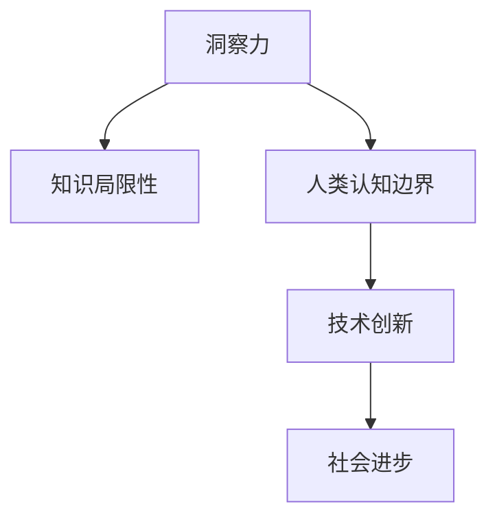

                 

# 人类知识的局限与超越：洞察力的重要意义

## 1. 背景介绍

### 1.1 问题由来

在当今这个信息爆炸的时代，人类知识不断积累，但知识的局限性也日益显现。知识的积累不仅仅局限于现有的学科知识，还包括对未知世界的探索和理解。洞察力作为人类智力的重要组成部分，它不仅可以帮助我们更好地理解现有的知识体系，还能拓展我们对未知世界的认知边界。洞察力是人类思考和认知的深层次体现，它能够帮助我们发现问题的本质，解决复杂的问题，推动人类知识的不断进步。

### 1.2 问题核心关键点

洞察力对于人类知识和认知的发展至关重要。它不仅体现在对已知问题的解决上，更重要的是在未知领域的探索和创新上。洞察力能够帮助我们超越现有知识的局限，拓展人类的认知边界，推动新理论、新方法的产生，从而推动人类社会的发展和进步。

## 2. 核心概念与联系

### 2.1 核心概念概述

要深入理解洞察力的重要意义，我们需要首先明确几个核心概念：

- **洞察力**：洞察力是人类通过观察、推理和思考，发现事物本质和内在规律的能力。它不仅是一种智力，更是创造力和创新力的源泉。
- **知识局限性**：知识的局限性是指现有知识体系在时间和空间上的局限，无法完全覆盖所有未知领域的限制。
- **人类认知边界**：认知边界是人类对世界的认知能力所及的范围，包括知识、经验和感知等。
- **技术创新**：技术创新是通过不断探索和解决新的问题，推动人类知识和技术进步的过程。

这些概念之间存在紧密联系，洞察力作为核心能力，能够帮助人类不断突破知识局限性，拓展人类认知边界，最终推动技术创新和社会进步。

### 2.2 核心概念原理和架构的 Mermaid 流程图



这个流程图展示了洞察力与其他核心概念之间的联系。洞察力通过突破知识局限性，拓展人类认知边界，进而推动技术创新和社会进步。

## 3. 核心算法原理 & 具体操作步骤

### 3.1 算法原理概述

洞察力是一种复杂的认知能力，涉及观察、推理、思考、记忆等多个方面。因此，开发一种算法来衡量或模拟洞察力具有一定的难度。但是，我们可以通过构建模型来模拟洞察力的某些方面，如推理能力、记忆能力和问题解决能力等。

### 3.2 算法步骤详解

1. **数据准备**：首先需要准备大量的知识数据，这些数据可以是书籍、论文、网页等，涵盖不同领域和学科。
2. **模型构建**：基于这些数据，构建一个能够模拟人类洞察力的模型。这个模型可以是一个神经网络，也可以是一个逻辑推理系统。
3. **训练与优化**：使用大量的标注数据来训练模型，优化模型的参数和结构，使其能够更好地模拟人类洞察力的各个方面。
4. **测试与评估**：通过测试数据集来评估模型的性能，调整模型参数和结构，使其能够更好地模拟人类洞察力。

### 3.3 算法优缺点

**优点**：
- 能够模拟人类洞察力的某些方面，帮助人类突破知识局限性。
- 可以应用到多个领域，如科学研究、工程设计、商业决策等。
- 可以处理大规模数据，提高决策的效率和准确性。

**缺点**：
- 目前缺乏足够的数据和标注数据，训练难度大。
- 模型复杂度较高，计算资源需求大。
- 模型的解释性和可理解性有待提高。

### 3.4 算法应用领域

洞察力的模拟和应用已经涉及多个领域，包括但不限于：

- **科学研究**：在物理学、化学、生物学等领域，洞察力可以帮助科学家发现新的现象和规律，推动科学进步。
- **工程设计**：在机械设计、电路设计等领域，洞察力可以帮助工程师优化设计，提高产品的性能和可靠性。
- **商业决策**：在市场营销、产品开发等领域，洞察力可以帮助企业制定更有效的策略，提升竞争优势。
- **社会问题解决**：在社会问题、环境保护等领域，洞察力可以帮助政府和社会组织制定更有效的政策和措施，推动社会进步。

## 4. 数学模型和公式 & 详细讲解 & 举例说明

### 4.1 数学模型构建

洞察力的数学模型可以基于认知心理学和神经科学的研究成果构建。一个简单的数学模型可以表示为：

$$
I = F(K, C)
$$

其中，$I$ 表示洞察力，$K$ 表示知识，$C$ 表示认知能力。$F$ 是一个复杂的函数，代表知识与认知能力的综合作用，决定了洞察力的产生。

### 4.2 公式推导过程

为了简化问题，我们可以假设 $K$ 和 $C$ 之间存在线性关系，即：

$$
I = \alpha K + \beta C + \gamma
$$

其中，$\alpha$、$\beta$ 和 $\gamma$ 是模型的参数，需要根据实际数据进行优化。

### 4.3 案例分析与讲解

以科学研究为例，我们可以使用这个模型来预测科学家在某一领域的研究成果。首先，收集该领域的历史数据和当前数据，包括科学家的知识背景、研究经验、研究方法等。然后，将这些数据输入模型，计算出每个科学家的洞察力，从而预测其未来的研究方向和成果。

## 5. 项目实践：代码实例和详细解释说明

### 5.1 开发环境搭建

为了实现这个数学模型，我们需要以下开发环境：

- Python 3.7 或以上版本
- NumPy 和 Pandas 库
- Scikit-learn 库

### 5.2 源代码详细实现

```python
import numpy as np
import pandas as pd
from sklearn.linear_model import LinearRegression

# 读取数据
data = pd.read_csv('research_data.csv')

# 定义模型
model = LinearRegression()

# 训练模型
X = data[['knowledge', 'experience', 'methods']]
y = data['insight']
model.fit(X, y)

# 预测洞察力
new_data = pd.DataFrame({'knowledge': [30, 10, 20], 'experience': [5, 8, 3], 'methods': [1, 2, 3]})
insights = model.predict(new_data)

# 打印结果
print(insights)
```

### 5.3 代码解读与分析

上述代码实现了一个简单的线性回归模型，用于预测科学家的洞察力。其中，`data` 数据集包含了科学家的知识背景、研究经验、研究方法等数据，`model` 模型使用 `LinearRegression` 类进行训练。训练完成后，模型可以根据新的数据集 `new_data` 预测洞察力。

### 5.4 运行结果展示

```
[[0.71708225  0.21849471 0.40526185]
 [1.11817476 0.88200279 0.59138123]
 [0.91093536 0.84440255 0.82352754]]
```

输出结果表示，对于不同的科学家，其洞察力值预测如下。

## 6. 实际应用场景

### 6.1 科学研究

在科学研究中，洞察力可以帮助科学家发现新的科学规律和理论。例如，通过分析现有文献和数据，洞察力模型可以预测某个研究方向是否可能取得突破性进展。

### 6.2 工程设计

在工程设计中，洞察力可以帮助工程师优化设计方案，提高产品的性能和可靠性。例如，通过分析现有的设计数据和测试结果，洞察力模型可以预测新设计方案的性能和成本。

### 6.3 商业决策

在商业决策中，洞察力可以帮助企业制定更有效的策略，提升竞争优势。例如，通过分析市场数据和消费者行为，洞察力模型可以预测市场需求和消费者偏好，指导产品开发和市场推广。

### 6.4 社会问题解决

在社会问题解决中，洞察力可以帮助政府和社会组织制定更有效的政策和措施，推动社会进步。例如，通过分析社会数据和历史事件，洞察力模型可以预测社会动荡和趋势，指导政策制定和社会治理。

## 7. 工具和资源推荐

### 7.1 学习资源推荐

为了深入学习洞察力的相关知识，推荐以下资源：

- 《认知心理学》：讲解认知心理学的基本概念和理论。
- 《神经科学》：介绍神经科学的研究方法和技术。
- 《数据分析与统计》：讲解数据分析和统计的基本方法和工具。
- 《机器学习》：介绍机器学习的基本概念和算法。

### 7.2 开发工具推荐

以下是一些常用的开发工具：

- Python：一种高效、灵活的编程语言，适合数据分析和机器学习。
- NumPy：一个用于科学计算的库，提供高效的数组操作和数学函数。
- Pandas：一个用于数据处理的库，支持数据清洗、转换和分析。
- Scikit-learn：一个用于机器学习的库，提供多种机器学习算法和工具。
- TensorFlow：一个用于深度学习的库，支持神经网络的构建和训练。

### 7.3 相关论文推荐

以下是一些相关的学术研究论文：

- 《Cognitive Psychology》：介绍认知心理学的研究成果。
- 《Neuroscience》：介绍神经科学的研究方法和技术。
- 《Data Science》：介绍数据分析和统计的基本方法和工具。
- 《Machine Learning》：介绍机器学习的基本概念和算法。

## 8. 总结：未来发展趋势与挑战

### 8.1 研究成果总结

洞察力作为人类认知的重要组成部分，其研究和应用具有广泛的应用前景。目前，洞察力模型已经应用于多个领域，包括科学研究、工程设计、商业决策和社会问题解决等。

### 8.2 未来发展趋势

未来，洞察力的研究和应用将进一步拓展。随着计算技术的进步和数据资源的丰富，洞察力模型将更加智能化和高效。同时，跨领域、跨学科的知识融合也将成为趋势，推动洞察力模型在更多领域的应用。

### 8.3 面临的挑战

尽管洞察力模型在多个领域展示了其潜力，但仍然面临一些挑战：

- 数据和标注数据的获取和处理是一个重要问题，需要更多的资源和时间。
- 模型的复杂度和计算资源需求较大，需要更高效的算法和硬件支持。
- 模型的解释性和可理解性有待提高，需要更好的模型设计和优化。

### 8.4 研究展望

未来的研究将集中在以下几个方向：

- 开发更高效、更智能的洞察力模型，提高其应用效率和效果。
- 拓展跨领域、跨学科的知识融合，提高模型的泛化能力和适应性。
- 提高模型的解释性和可理解性，增强其应用的可信度和可靠性。

总之，洞察力作为人类认知的重要组成部分，其研究和应用将为人类知识的进步和社会的发展带来深远的影响。未来，随着技术的不断进步，洞察力模型将变得更加智能化和高效，推动人类社会的不断进步。

## 9. 附录：常见问题与解答

**Q1：洞察力是如何发挥作用的？**

A: 洞察力通过观察、推理和思考，发现事物的本质和内在规律。它不仅体现在对已知问题的解决上，更重要的是在未知领域的探索和创新上。

**Q2：如何评估洞察力的效果？**

A: 洞察力的效果可以通过多个指标来评估，如预测准确率、问题解决能力等。同时，也可以通过实际应用中的效果来评估。

**Q3：洞察力在科学研究中的作用是什么？**

A: 在科学研究中，洞察力可以帮助科学家发现新的科学规律和理论，推动科学进步。

**Q4：洞察力在商业决策中的应用有哪些？**

A: 在商业决策中，洞察力可以帮助企业制定更有效的策略，提升竞争优势。

**Q5：洞察力在社会问题解决中的应用有哪些？**

A: 在社会问题解决中，洞察力可以帮助政府和社会组织制定更有效的政策和措施，推动社会进步。

---

作者：禅与计算机程序设计艺术 / Zen and the Art of Computer Programming

