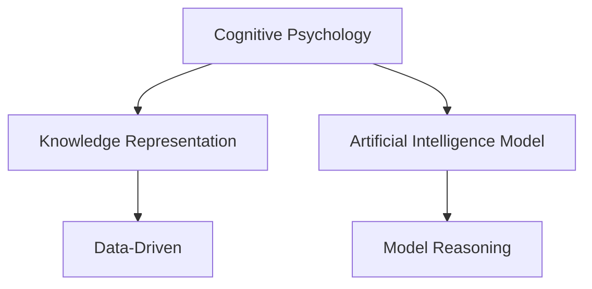

                 

# 人类知识的局限性：承认与尊重未知

> 关键词：认知局限性,知识边界,未知探索,人工智能,数据驱动,模型推理

## 1. 背景介绍

### 1.1 问题由来
人类知识的局限性是一个古老而又深刻的问题，也是所有哲学、科学与艺术共同关心的话题。在人工智能飞速发展的今天，这一话题更显重要。面对愈发复杂的现实世界，如何更好地理解、描述和应用知识，成为推动科技和社会进步的关键。

### 1.2 问题核心关键点
本文旨在探讨人类知识的局限性，讨论如何通过技术手段（如人工智能）来辅助理解和尊重未知。首先，我们需明确几个关键点：

- 认知局限性：人类在获取、处理和应用知识的过程中，存在诸多限制，包括感知的局限、认知的局限、记忆的局限等。
- 知识边界：知识的边界即人类目前已知和未知的界限，涉及已知领域和未知领域的相互转化。
- 未知探索：面对未知，人类需要主动探索，通过研究未知领域的特征和规律，以推动知识的扩展和技术的进步。
- 人工智能：人工智能作为模拟人类智能的工具，能够在数据驱动下进行模式识别、预测和推理，辅助人类理解未知。
- 数据驱动：人工智能的核心在于数据，通过大量数据训练模型，使其具备自主学习和推理的能力。
- 模型推理：人工智能模型通过预测和推理，在一定程度上模拟人类的判断和决策。

这些关键点共同构成了本文的核心议题，即通过技术手段，尤其是人工智能，来辅助人类更好地理解和尊重未知。

### 1.3 问题研究意义
研究人类知识的局限性，对于理解人工智能技术的本质、拓展知识的边界、推动科技和社会的进步具有重要意义：

1. 辅助理解未知：人工智能能够处理和分析大量数据，辅助人类识别未知领域的关键特征，为探索未知提供支持。
2. 尊重未知：通过认识到自己知识的局限性，人类能够更加谦虚地对待未知，避免盲目自信和偏见，促进科学和艺术的创新。
3. 科技进步：人工智能在未知领域的探索，可以带来新的技术突破，推动科学和工程领域的发展。
4. 社会进步：对未知的尊重和探索，有助于构建更加包容和进步的社会，推动人类文明的进步。

## 2. 核心概念与联系

### 2.1 核心概念概述

为更好地理解本文的主题，本节将介绍几个密切相关的核心概念：

- 认知心理学：研究人类认知过程的科学，探讨感知的局限、认知的机制和记忆的方式。
- 知识表示：指如何用形式化方法来描述和组织知识，以支持人工智能模型的推理和学习。
- 人工智能模型：如神经网络、决策树、逻辑回归等，通过学习数据，进行模式识别和推理。
- 数据驱动：指基于大量数据进行训练和推断的模型学习方式，避免人类主观偏见。
- 模型推理：指人工智能模型基于已有数据进行预测和推断的过程。

这些核心概念之间的逻辑关系可以通过以下Mermaid流程图来展示：



这个流程图展示了几大核心概念及其之间的关系：

1. 认知心理学研究人类认知过程，提出知识的表示方法。
2. 知识表示方法用于构建人工智能模型。
3. 人工智能模型通过数据驱动进行训练和推理。
4. 模型推理帮助人类更好地理解和尊重未知。

## 3. 核心算法原理 & 具体操作步骤
### 3.1 算法原理概述

人工智能模型通过数据驱动进行训练和推理，其核心原理基于统计学习理论。我们以深度学习模型为例，其基本过程包括数据预处理、模型训练、模型推理和结果评估。

1. **数据预处理**：数据清洗、特征工程、数据划分等，将原始数据转化为模型训练所需的格式。
2. **模型训练**：通过反向传播算法优化模型参数，最小化预测与真实标签的差异。
3. **模型推理**：将新数据输入模型，进行预测和推断。
4. **结果评估**：通过评估指标（如准确率、召回率、F1分数等）评估模型性能。

### 3.2 算法步骤详解

深度学习模型训练的步骤通常包括以下几个关键步骤：

**Step 1: 数据准备**
- 收集和清洗数据集，进行特征工程，如数据标准化、归一化、编码等。
- 将数据集划分为训练集、验证集和测试集。

**Step 2: 模型构建**
- 选择合适的模型架构，如卷积神经网络（CNN）、循环神经网络（RNN）、深度神经网络（DNN）等。
- 定义模型的输入和输出层，设置超参数（如学习率、批大小、迭代次数等）。

**Step 3: 模型训练**
- 对训练集数据进行批处理，前向传播计算预测值。
- 反向传播计算梯度，使用优化算法更新模型参数。
- 周期性在验证集上评估模型性能，根据性能指标调整超参数。

**Step 4: 模型推理**
- 将新数据输入模型，进行前向传播计算预测值。
- 根据预测结果进行结果评估，判断模型的适用性。

### 3.3 算法优缺点

人工智能模型的优点包括：

- 自动化处理数据：能够高效处理大量数据，自动提取特征。
- 泛化能力强：通过大量数据训练，模型具备较强的泛化能力。
- 可解释性强：部分模型（如决策树、逻辑回归）具有较好的可解释性，便于理解和调试。

但同时，也存在一些缺点：

- 数据依赖性强：模型性能高度依赖数据质量和数量，数据偏差可能带来模型偏差。
- 黑盒性质：部分模型（如深度神经网络）的决策过程复杂，难以解释。
- 过拟合风险：模型容易过拟合训练数据，泛化能力受限。

### 3.4 算法应用领域

人工智能模型广泛应用于各个领域，包括：

- 图像识别：如人脸识别、物体检测等。通过模型训练，识别图像中的关键特征。
- 自然语言处理：如文本分类、情感分析、机器翻译等。通过模型训练，理解文本含义。
- 语音识别：如语音转换、语音合成等。通过模型训练，转换语音信号。
- 推荐系统：如商品推荐、内容推荐等。通过模型训练，预测用户兴趣。
- 医疗诊断：如疾病诊断、药物推荐等。通过模型训练，辅助医生决策。
- 自动驾驶：如目标检测、行为预测等。通过模型训练，实现车辆自主驾驶。

以上仅是人工智能模型应用的冰山一角，随着技术的进步，其应用领域将不断扩展。

## 4. 数学模型和公式 & 详细讲解 & 举例说明

### 4.1 数学模型构建

以深度学习中的卷积神经网络（CNN）为例，其数学模型可以表示为：

$$
\hat{y} = f(x; W)
$$

其中 $x$ 为输入样本，$y$ 为真实标签，$W$ 为模型参数，$f(x; W)$ 为模型的非线性映射函数。

### 4.2 公式推导过程

以二分类问题为例，假设模型输出为 $0-1$ 类别的概率 $p(x; W)$，则损失函数可以表示为交叉熵损失：

$$
\ell(\hat{y}, y) = -[y\log(\hat{y}) + (1-y)\log(1-\hat{y})]
$$

模型的目标是最小化平均损失：

$$
\mathcal{L}(W) = \frac{1}{N} \sum_{i=1}^N \ell(\hat{y}_i, y_i)
$$

其中 $N$ 为样本数量，$\hat{y}_i$ 为第 $i$ 个样本的预测结果。

### 4.3 案例分析与讲解

以手写数字识别为例，假设数据集为 $M \times N$ 矩阵，每个样本为 $N$ 维向量。模型架构为 $L$ 层，每层 $D$ 个神经元。

- **数据预处理**：将原始图片转化为灰度图像，归一化到 $[0, 1]$ 区间，进行One-Hot编码。
- **模型构建**：选择卷积层、池化层和全连接层，设置激活函数和优化算法。
- **模型训练**：使用随机梯度下降（SGD）算法，最小化交叉熵损失。
- **模型推理**：将新图像输入模型，输出预测结果，并通过决策阈值转换为类别标签。

## 5. 项目实践：代码实例和详细解释说明

### 5.1 开发环境搭建

在进行项目实践前，我们需要准备好开发环境。以下是使用Python进行TensorFlow开发的环境配置流程：

1. 安装Anaconda：从官网下载并安装Anaconda，用于创建独立的Python环境。

2. 创建并激活虚拟环境：
```bash
conda create -n tf-env python=3.7 
conda activate tf-env
```

3. 安装TensorFlow：根据CUDA版本，从官网获取对应的安装命令。例如：
```bash
conda install tensorflow -c conda-forge -c pytorch-nightly
```

4. 安装各类工具包：
```bash
pip install numpy pandas scikit-learn matplotlib tqdm jupyter notebook ipython
```

完成上述步骤后，即可在`tf-env`环境中开始项目实践。

### 5.2 源代码详细实现

下面我们以手写数字识别为例，给出使用TensorFlow进行模型训练和预测的Python代码实现。

```python
import tensorflow as tf
import numpy as np
import matplotlib.pyplot as plt

# 加载手写数字数据集
mnist = tf.keras.datasets.mnist
(x_train, y_train), (x_test, y_test) = mnist.load_data()

# 数据预处理
x_train, x_test = x_train / 255.0, x_test / 255.0

# 构建模型
model = tf.keras.models.Sequential([
    tf.keras.layers.Flatten(input_shape=(28, 28)),
    tf.keras.layers.Dense(128, activation='relu'),
    tf.keras.layers.Dense(10, activation='softmax')
])

# 定义损失函数和优化器
loss_fn = tf.keras.losses.SparseCategoricalCrossentropy(from_logits=True)
optimizer = tf.keras.optimizers.Adam(learning_rate=0.001)

# 编译模型
model.compile(optimizer=optimizer, loss=loss_fn, metrics=['accuracy'])

# 训练模型
model.fit(x_train, y_train, epochs=10, validation_data=(x_test, y_test))

# 评估模型
test_loss, test_acc = model.evaluate(x_test, y_test, verbose=2)

# 预测并可视化结果
predictions = model.predict(x_test)
fig, axs = plt.subplots(2, 5, figsize=(5, 3))
for i in range(10):
    axs.ravel()[i].imshow(x_test[i].reshape(28, 28))
    axs.ravel()[i].set_title(f"Prediction: {np.argmax(predictions[i])}")
plt.show()
```

以上就是使用TensorFlow进行手写数字识别任务模型训练和预测的完整代码实现。可以看到，TensorFlow提供了强大的框架和工具支持，能够快速搭建和训练模型。

### 5.3 代码解读与分析

让我们再详细解读一下关键代码的实现细节：

**数据加载**：
```python
mnist = tf.keras.datasets.mnist
(x_train, y_train), (x_test, y_test) = mnist.load_data()
```
使用`tf.keras.datasets`加载MNIST数据集，将训练集和测试集分为$(x_{train}, y_{train})$和$(x_{test}, y_{test})$两部分。

**数据预处理**：
```python
x_train, x_test = x_train / 255.0, x_test / 255.0
```
将原始图像数据归一化到$[0,1]$区间，以加速模型训练。

**模型构建**：
```python
model = tf.keras.models.Sequential([
    tf.keras.layers.Flatten(input_shape=(28, 28)),
    tf.keras.layers.Dense(128, activation='relu'),
    tf.keras.layers.Dense(10, activation='softmax')
])
```
构建一个包含两个Dense层的序列模型，其中输入层为28x28像素的图像，输出层为10类数字的预测概率。

**模型编译**：
```python
loss_fn = tf.keras.losses.SparseCategoricalCrossentropy(from_logits=True)
optimizer = tf.keras.optimizers.Adam(learning_rate=0.001)
model.compile(optimizer=optimizer, loss=loss_fn, metrics=['accuracy'])
```
定义交叉熵损失函数，并编译模型，设置优化器和损失函数。

**模型训练**：
```python
model.fit(x_train, y_train, epochs=10, validation_data=(x_test, y_test))
```
在训练集上训练模型，每轮10个epoch，并使用测试集验证模型性能。

**模型评估**：
```python
test_loss, test_acc = model.evaluate(x_test, y_test, verbose=2)
```
在测试集上评估模型性能，输出损失和准确率。

**结果可视化**：
```python
predictions = model.predict(x_test)
fig, axs = plt.subplots(2, 5, figsize=(5, 3))
for i in range(10):
    axs.ravel()[i].imshow(x_test[i].reshape(28, 28))
    axs.ravel()[i].set_title(f"Prediction: {np.argmax(predictions[i])}")
plt.show()
```
绘制预测结果的可视化图像，展示了模型对测试集的前10个样本的预测结果。

## 6. 实际应用场景
### 6.1 图像识别

图像识别是人工智能在计算机视觉领域的重要应用，如人脸识别、物体检测等。通过模型训练，图像识别技术可以自动识别和分类图像中的物体和场景，广泛应用于安防监控、自动驾驶、智能家居等领域。

在技术实现上，可以使用CNN、RNN等深度学习模型对图像数据进行训练，实现对图像的识别和分类。在实际应用中，可以结合图像预处理、数据增强、模型微调等技术手段，进一步提升识别精度。

### 6.2 自然语言处理

自然语言处理是人工智能在语言学领域的重要应用，如文本分类、情感分析、机器翻译等。通过模型训练，NLP技术可以理解自然语言，生成自然语言，广泛应用于智能客服、自动摘要、智能推荐等领域。

在技术实现上，可以使用RNN、Transformer等深度学习模型对文本数据进行训练，实现对文本的分类、情感分析和翻译。在实际应用中，可以结合预训练模型、迁移学习、参数高效微调等技术手段，进一步提升NLP模型的性能和应用范围。

### 6.3 语音识别

语音识别是人工智能在音频处理领域的重要应用，如语音转换、语音合成等。通过模型训练，语音识别技术可以自动识别和转换语音信号，广泛应用于智能音箱、语音助手、智能翻译等领域。

在技术实现上，可以使用RNN、CNN等深度学习模型对语音数据进行训练，实现对语音的转换和合成。在实际应用中，可以结合声学模型、语言模型、注意力机制等技术手段，进一步提升语音识别的精度和流畅度。

### 6.4 未来应用展望

随着人工智能技术的不断发展，基于深度学习模型的应用场景将不断扩展。未来，人工智能将在更多领域发挥重要作用，包括：

- 医疗领域：如疾病诊断、药物推荐等。通过模型训练，AI可以辅助医生进行诊断和治疗决策，提高医疗服务的质量和效率。
- 金融领域：如风险评估、信用评分等。通过模型训练，AI可以分析海量数据，预测市场趋势和风险，帮助金融机构做出更明智的决策。
- 智能制造：如质量检测、设备维护等。通过模型训练，AI可以实时监控生产过程，预测设备故障，提高生产效率和质量。
- 智慧城市：如交通管理、环境监测等。通过模型训练，AI可以优化城市管理，提升公共服务水平。
- 教育领域：如智能辅导、考试评估等。通过模型训练，AI可以提供个性化的教育和辅导服务，提高教育质量和效率。

## 7. 工具和资源推荐
### 7.1 学习资源推荐

为了帮助开发者系统掌握人工智能技术的理论基础和实践技巧，这里推荐一些优质的学习资源：

1. 《深度学习》（Ian Goodfellow等著）：详细介绍了深度学习的基本概念、模型设计和训练方法，是入门深度学习的经典书籍。
2. 《Python深度学习》（Francois Chollet著）：介绍了TensorFlow和Keras的使用，涵盖深度学习模型的构建和训练。
3. 《自然语言处理综论》（Daniel Jurafsky等著）：介绍了NLP的基本概念、技术和应用，是NLP领域的权威教材。
4. 《机器学习实战》（Peter Harrington著）：介绍了机器学习的基本算法和实现方法，适合实践学习。
5. 《人工智能：一种现代方法》（Stuart Russell等著）：介绍了人工智能的基本概念、算法和应用，是AI领域的经典教材。

通过对这些资源的学习实践，相信你一定能够快速掌握人工智能技术的精髓，并用于解决实际的NLP问题。

### 7.2 开发工具推荐

高效的开发离不开优秀的工具支持。以下是几款用于人工智能模型开发常用的工具：

1. TensorFlow：由Google主导开发的开源深度学习框架，生产部署方便，适合大规模工程应用。提供了丰富的深度学习模型库和优化器，易于使用。
2. PyTorch：基于Python的开源深度学习框架，灵活动态的计算图，适合快速迭代研究。提供了丰富的深度学习模型库和优化器，支持多种硬件加速。
3. Scikit-learn：Python机器学习库，提供了大量的经典机器学习算法和工具，易于上手。
4. OpenCV：计算机视觉库，提供了丰富的图像处理和计算机视觉算法，适合图像识别和分析。
5. NLTK：Python自然语言处理库，提供了大量的NLP工具和算法，适合文本处理和分析。

合理利用这些工具，可以显著提升人工智能模型的开发效率，加快创新迭代的步伐。

### 7.3 相关论文推荐

人工智能技术的发展离不开学界的持续研究。以下是几篇奠基性的相关论文，推荐阅读：

1. LeCun, Y., Bottou, L., Bengio, Y., & Haffner, P. (1998). Gradient-based learning applied to document recognition. Proceedings of the IEEE, 86(11), 2278-2324.
2. Goodfellow, I., Bengio, Y., & Courville, A. (2016). Deep learning. MIT Press.
3. Sutskever, I., Vinyals, O., & Le, Q. (2014). Sequence to sequence learning with neural networks. Advances in Neural Information Processing Systems, 27(5), 3104-3112.
4. Hinton, G. E., Osindero, S., & Teh, Y. W. (2006). A fast learning algorithm for deep belief nets. Neural Computation, 18(7), 1527-1554.
5. Long, J., Shelhamer, E., & Darrell, T. (2015). Fully convolutional networks for semantic segmentation. IEEE Conference on Computer Vision and Pattern Recognition, 2290-2298.

这些论文代表了大语言模型微调技术的发展脉络。通过学习这些前沿成果，可以帮助研究者把握学科前进方向，激发更多的创新灵感。

## 8. 总结：未来发展趋势与挑战

### 8.1 总结

本文对人工智能模型的核心概念、算法原理和具体操作步骤进行了全面系统的介绍。首先阐述了人类认知局限性的问题由来，明确了人工智能技术辅助理解和尊重未知的意义。其次，从原理到实践，详细讲解了深度学习模型的数学模型和训练过程，给出了模型训练和推理的完整代码实例。同时，本文还广泛探讨了人工智能模型在图像识别、自然语言处理、语音识别等各个领域的应用前景，展示了人工智能技术的广泛前景。

通过本文的系统梳理，可以看到，人工智能模型在各个领域的应用前景广阔，能够帮助人类更好地理解和尊重未知。未来，伴随技术的不断进步，人工智能模型必将在更多领域发挥重要作用，推动科技和社会的进步。

### 8.2 未来发展趋势

展望未来，人工智能模型将呈现以下几个发展趋势：

1. 模型规模持续增大。随着算力成本的下降和数据规模的扩张，深度学习模型的参数量还将持续增长。超大规模模型蕴含的丰富知识，有望支撑更加复杂多变的任务。
2. 模型泛化能力增强。通过更强大的数据驱动，深度学习模型的泛化能力将进一步提升，能够更好地适应各种现实场景。
3. 模型推理速度提升。通过模型压缩、量化加速等技术，深度学习模型的推理速度将进一步提升，能够实现实时推理。
4. 模型可解释性增强。通过可解释性模型（如LIME、SHAP等），深度学习模型的决策过程将更加透明，便于理解和调试。
5. 多模态融合技术发展。将视觉、语音、文本等多模态数据融合，实现更为全面的智能推理。
6. 模型与知识图谱结合。将深度学习模型与知识图谱结合，提升模型的推理和决策能力。

以上趋势凸显了人工智能模型的广阔前景。这些方向的探索发展，必将进一步提升人工智能模型的性能和应用范围，为构建智能社会提供新的动力。

### 8.3 面临的挑战

尽管深度学习模型已经取得了瞩目成就，但在迈向更加智能化、普适化应用的过程中，仍面临诸多挑战：

1. 数据依赖性强。深度学习模型的性能高度依赖于数据质量和数量，数据偏差可能带来模型偏差。
2. 模型复杂度高。深度学习模型结构复杂，难以解释其内部工作机制。
3. 模型泛化能力受限。模型容易过拟合训练数据，泛化能力受限。
4. 模型可解释性差。深度学习模型的决策过程复杂，难以解释。
5. 模型推理速度慢。深度学习模型的推理速度较慢，难以实现实时推理。

### 8.4 研究展望

面对深度学习模型面临的挑战，未来的研究需要在以下几个方面寻求新的突破：

1. 探索无监督和半监督学习。摆脱对大规模标注数据的依赖，利用自监督学习、主动学习等方法，最大限度利用非结构化数据。
2. 研究参数高效和计算高效的模型。开发更加参数高效和计算高效的模型，避免过拟合和资源消耗。
3. 引入因果推断和对比学习。通过引入因果推断和对比学习，增强模型的稳定性和泛化能力。
4. 融合多模态数据。将视觉、语音、文本等多模态数据融合，实现更为全面的智能推理。
5. 结合知识图谱。将深度学习模型与知识图谱结合，提升模型的推理和决策能力。
6. 提高模型可解释性。通过可解释性模型和工具，提高模型的决策透明性。

这些研究方向的发展，必将推动深度学习模型的性能和应用范围，为构建智能社会提供新的动力。面向未来，深度学习模型还需要与其他人工智能技术进行更深入的融合，如知识表示、因果推理、强化学习等，多路径协同发力，共同推动智能技术的发展。

## 9. 附录：常见问题与解答

**Q1：深度学习模型是否适用于所有NLP任务？**

A: 深度学习模型在大多数NLP任务上都能取得不错的效果，特别是对于数据量较大的任务。但对于一些特定领域的任务，如医学、法律等，仅仅依靠通用语料预训练的模型可能难以很好地适应。此时需要在特定领域语料上进一步预训练，再进行微调，才能获得理想效果。

**Q2：深度学习模型在推理时是否需要标注数据？**

A: 深度学习模型在推理时通常需要标注数据，以确保推理结果的准确性。对于某些任务，如文本分类、情感分析等，可以通过标注数据进行监督训练，获得较好的推理结果。但对于一些任务，如对话系统、推荐系统等，可以通过未标注数据进行无监督或半监督训练，提升模型的泛化能力。

**Q3：深度学习模型是否容易过拟合？**

A: 深度学习模型容易过拟合，特别是在训练数据较少或模型复杂度过高的情况下。为避免过拟合，可以采用正则化技术，如L2正则、Dropout等，控制模型复杂度。同时，可以通过数据增强、对抗训练等技术手段，提升模型的泛化能力。

**Q4：深度学习模型是否需要持续学习？**

A: 深度学习模型需要持续学习，以保持其性能和泛化能力。随着数据分布的变化，模型需要不断学习新知识，以适应新的场景和任务。可以通过增量学习、在线学习等方法，实现模型的持续更新。

**Q5：深度学习模型是否容易受到攻击？**

A: 深度学习模型可能容易受到攻击，如对抗样本攻击、模型误用等。为提高模型的安全性，可以采用对抗训练、模型鲁棒性评估等技术手段，增强模型的抗干扰能力。

综上所述，深度学习模型在NLP领域有着广泛的应用前景，但也面临着诸多挑战。通过深入研究和学习，相信能够更好地理解和尊重未知，推动人工智能技术的发展和应用。

