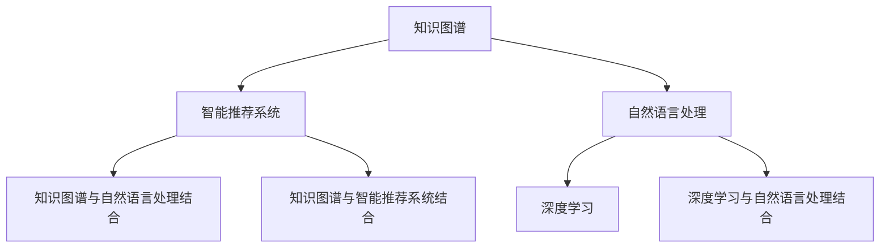

                 

# 人类知识的未来发展：洞察力的关键作用

> 关键词：知识图谱、智能推荐系统、深度学习、自然语言处理、认知心理学

## 1. 背景介绍

在人工智能(AI)和计算技术的飞速发展中，人类知识的未来走向成为了一个备受关注的话题。AI作为工具，已经深入到科学研究、商业决策、医疗诊断等多个领域，极大地提高了人类处理信息的能力和效率。特别是深度学习和自然语言处理技术的进展，使得计算机开始具备了分析和理解人类语言的能力，这是人类知识的传承和深化的一个全新方向。

### 1.1 问题的由来

人类知识的积累和传承始终受到时间和空间的双重限制。传统知识的传播主要依赖书籍、课堂等形式，受制于时间和空间。而AI技术的发展，特别是大规模知识图谱和智能推荐系统的兴起，打破了这一限制，使得知识的积累和传播变得更为高效和普适。然而，在AI日益深入人心的同时，关于知识的深度和广度、机器对知识的理解和运用、人类知识的未来发展方向等问题也日益突出。

### 1.2 问题核心关键点

随着人工智能技术的发展，人类知识的未来发展面临着以下几个核心关键点：
- 知识的图谱化：如何通过结构化的知识图谱，将人类的知识系统化、结构化，便于机器理解和处理？
- 智能推荐系统的深度：如何设计算法，使得智能推荐系统能够更精准、更个性化地推送相关知识？
- 自然语言处理的认知：如何通过自然语言处理技术，使机器具备更加智能的理解和生成语言的能力？
- 深度学习的应用：如何通过深度学习技术，进一步提升机器在处理知识时的精确度和效率？
- 人类与机器的协同：如何在知识图谱和推荐系统之外，探索人类与机器协同工作的新模式？

这些关键点共同构成了人类知识未来发展的框架，旨在通过AI技术的进步，使知识的积累和传播更加高效、普适，并探索人类与机器的协同可能性。

## 2. 核心概念与联系

### 2.1 核心概念概述

为更好地理解人类知识未来发展的框架，本节将介绍几个关键概念及其之间的联系：

- **知识图谱(Knowledge Graph)**：是一种结构化的知识表示方式，通过节点和边来描述实体、属性和它们之间的关系，可以用于知识检索、语义分析等任务。
- **智能推荐系统(Intelligent Recommendation System)**：通过学习用户的历史行为和偏好，推荐可能感兴趣的内容或信息，广泛应用于电商、新闻、娱乐等场景。
- **深度学习(Deep Learning)**：一种基于神经网络的机器学习技术，通过多层次的特征抽取，可以处理复杂的数据结构和任务。
- **自然语言处理(Natural Language Processing, NLP)**：使计算机能够理解、处理和生成人类语言的技术，包括文本分类、情感分析、机器翻译等任务。
- **认知心理学(Cognitive Psychology)**：研究人类认知过程的心理学分支，揭示人类认知机制和知识获取过程。
- **知识图谱与自然语言处理结合**：通过将知识图谱中的知识转化为易于计算机处理的形式，并在自然语言处理任务中进行应用，提升计算机对知识的理解和处理能力。
- **知识图谱与智能推荐系统的结合**：利用知识图谱中丰富的知识结构，为智能推荐系统提供更精准的知识依据，提升推荐系统的智能化水平。
- **深度学习与自然语言处理的结合**：通过深度学习技术，使自然语言处理系统具备更强大的语义理解和生成能力。

这些核心概念之间的逻辑关系可以通过以下Mermaid流程图来展示：



这个流程图展示了几大关键概念及其相互关系：

1. 知识图谱通过将人类知识结构化，为智能推荐系统提供知识依据，提升推荐精准度。
2. 自然语言处理通过将知识图谱中的知识转化为易于计算机处理的形式，提升机器对知识的理解能力。
3. 深度学习通过多层次的特征抽取，提升自然语言处理的精确度和处理复杂性。
4. 知识图谱与自然语言处理结合，使机器具备更强的语义理解能力。
5. 知识图谱与智能推荐系统结合，提升推荐系统的智能化水平。
6. 深度学习与自然语言处理结合，进一步提升自然语言处理的智能化水平。

这些概念共同构成了人类知识未来发展的技术基础，旨在通过AI技术，使知识的积累和传播更加高效、普适，并探索人类与机器的协同可能性。

## 3. 核心算法原理 & 具体操作步骤

### 3.1 算法原理概述

人类知识的未来发展涉及多个领域的技术原理和操作方法。以下将简要介绍核心算法的原理和具体操作步骤。

### 3.2 算法步骤详解

以知识图谱构建和智能推荐系统为例，详细介绍其核心算法步骤：

**Step 1: 知识图谱构建**
- 收集和整合各类知识源，如维基百科、学术文献、新闻报道等。
- 定义实体、属性和关系，形成基本知识单元。
- 通过抽取和整合方式，构建知识图谱。

**Step 2: 智能推荐系统设计**
- 定义推荐目标和指标，如准确率、召回率、相关性等。
- 收集用户行为数据，如浏览历史、点击记录等。
- 设计推荐算法，如协同过滤、基于内容的推荐等。

**Step 3: 深度学习模型训练**
- 收集并处理数据，划分训练集、验证集和测试集。
- 选择深度学习模型，如卷积神经网络、循环神经网络等。
- 定义损失函数和优化器，训练模型。

**Step 4: 自然语言处理**
- 收集语料库，如新闻、书籍、论文等。
- 进行分词、词性标注、命名实体识别等预处理。
- 训练语言模型，如BERT、GPT等。

### 3.3 算法优缺点

知识图谱和智能推荐系统在人类知识未来发展中的核心算法具有以下优缺点：
- 知识图谱的优点在于结构化和系统化，易于机器处理和推理。缺点在于构建和维护复杂，需要大量时间和资源。
- 智能推荐系统的优点在于个性化和高效性，能快速推荐相关内容。缺点在于容易陷入“信息茧房”，可能限制用户视野。
- 深度学习的优点在于处理复杂数据和模型的灵活性，但需要大量标注数据和计算资源。
- 自然语言处理的优点在于理解和生成自然语言的能力，缺点在于语义理解的深度和广度有限。

### 3.4 算法应用领域

知识图谱和智能推荐系统已经在多个领域得到应用，具体包括：

- 电商推荐：如亚马逊、京东等电商平台，通过推荐系统向用户推荐商品。
- 新闻推荐：如今日头条、网易新闻等，推荐用户感兴趣的新闻内容。
- 教育推荐：如Coursera、Khan Academy等，推荐个性化学习路径和课程。
- 社交推荐：如Facebook、Twitter等，推荐用户可能感兴趣的内容和用户。
- 医疗推荐：如IBM Watson Health，推荐个性化医疗方案和信息。
- 电影推荐：如Netflix、豆瓣电影等，推荐用户可能喜欢的电影。

除了以上这些领域，知识图谱和智能推荐系统还被应用于金融、旅游、房地产等多个领域，极大地提升了各行业的智能化水平和用户体验。

## 4. 数学模型和公式 & 详细讲解 & 举例说明

### 4.1 数学模型构建

在知识图谱构建中，常见的数学模型包括：

- **图论模型**：通过图论中的节点和边表示实体和关系，进行知识推理和查询。
- **向量空间模型**：将实体和属性转化为向量，进行知识向量化表示。

在智能推荐系统中，常见的数学模型包括：

- **协同过滤**：基于用户历史行为数据，推荐相似用户可能感兴趣的商品或内容。
- **基于内容的推荐**：分析商品或内容的属性和特征，推荐与用户历史行为相似的商品或内容。
- **深度学习模型**：通过多层神经网络，学习用户和商品之间的关系，推荐相关商品或内容。

### 4.2 公式推导过程

以下简要介绍知识图谱构建和智能推荐系统的核心公式推导：

**知识图谱构建公式推导**：
- **节点和边的表示**：
  $$
  \begin{aligned}
  V &= \{e_1, e_2, ..., e_n\} \\
  E &= \{(r_{ij}, e_i, e_j)\} 
  \end{aligned}
  $$
  其中，$V$ 表示节点集合，$E$ 表示边集合，$r_{ij}$ 表示边类型。
  
- **向量空间模型**：
  $$
  \vec{v} = [\vec{v}_1, \vec{v}_2, ..., \vec{v}_n]
  $$
  其中，$\vec{v}_i$ 表示节点 $e_i$ 的属性向量。

**智能推荐系统公式推导**：
- **协同过滤**：
  $$
  \vec{p} = \vec{u} + \vec{v}
  $$
  其中，$\vec{p}$ 表示用户对商品或内容的兴趣向量，$\vec{u}$ 表示用户历史行为向量，$\vec{v}$ 表示商品或内容属性向量。
  
- **基于内容的推荐**：
  $$
  \vec{p} = \vec{a} + \vec{b}
  $$
  其中，$\vec{a}$ 表示商品或内容的属性向量，$\vec{b}$ 表示用户偏好向量。
  
- **深度学习模型**：
  $$
  L = \frac{1}{N}\sum_{i=1}^N L_i
  $$
  其中，$L$ 表示损失函数，$L_i$ 表示单个样本的损失。

### 4.3 案例分析与讲解

以Google News推荐系统为例，介绍其核心算法和应用效果：

**Google News推荐系统算法**：
- **用户行为数据收集**：收集用户的历史阅读行为数据，包括点击、浏览、停留时间等。
- **知识图谱构建**：构建包含新闻、作者、话题等知识点的图谱。
- **协同过滤推荐**：根据用户历史行为数据，推荐相似用户可能感兴趣的新闻。
- **基于内容的推荐**：分析新闻的属性和特征，推荐与用户偏好相似的新闻。
- **深度学习模型训练**：通过神经网络模型，学习用户和新闻之间的关系，进行推荐。

**应用效果**：
- **提升阅读体验**：通过个性化推荐，用户可以快速找到感兴趣的新闻内容，提升阅读体验。
- **增加用户粘性**：通过精准推荐，增加用户对Google News的粘性，提升网站流量。
- **优化广告收入**：通过推荐与用户兴趣相关的新闻，优化广告投放效果，增加收入。

## 5. 项目实践：代码实例和详细解释说明

### 5.1 开发环境搭建

在进行知识图谱和智能推荐系统的开发前，需要先搭建开发环境。以下是使用Python进行开发的环境配置流程：

1. 安装Anaconda：从官网下载并安装Anaconda，用于创建独立的Python环境。

2. 创建并激活虚拟环境：
```bash
conda create -n kg-env python=3.8 
conda activate kg-env
```

3. 安装相关库：
```bash
pip install graph-tool py2neo networkx
pip install pandas scipy scikit-learn
pip install tensorflow keras pytorch transformers
```

完成上述步骤后，即可在`kg-env`环境中开始项目实践。

### 5.2 源代码详细实现

下面以知识图谱构建和智能推荐系统为例，给出使用Python进行知识图谱构建的完整代码实现。

**知识图谱构建示例**：

```python
from graph-tool import Graph
from py2neo import Graph, Node, Relationship

# 连接数据库
graph = Graph('http://localhost:7474', username='neo', password='password')

# 创建知识图谱
g = Graph(directed=True)
g.add_vertex(name='Tom Hanks', type='Person')
g.add_vertex(name='Cast Away', type='Movie')
g.add_vertex(name='Forrest Gump', type='Movie')
g.add_edge(source='Tom Hanks', target='Cast Away', label='Acted In')
g.add_edge(source='Tom Hanks', target='Forrest Gump', label='Acted In')

# 将知识图谱保存至数据库
with open('graph.gml', 'w') as f:
    f.write(g.to_gml())
```

**智能推荐系统示例**：

```python
from tensorflow.keras.layers import Dense, Input, Embedding
from tensorflow.keras.models import Model
from tensorflow.keras.datasets import mnist
from tensorflow.keras.losses import MeanSquaredError
from sklearn.preprocessing import OneHotEncoder

# 加载MNIST数据集
(x_train, y_train), (x_test, y_test) = mnist.load_data()

# 数据预处理
x_train = x_train.reshape(-1, 28*28)
x_test = x_test.reshape(-1, 28*28)
y_train = OneHotEncoder().fit_transform(y_train.reshape(-1, 1)).toarray()
y_test = OneHotEncoder().fit_transform(y_test.reshape(-1, 1)).toarray()

# 定义模型
input_layer = Input(shape=(28*28,))
embedding_layer = Embedding(784, 128)(input_layer)
dense_layer = Dense(128, activation='relu')(embedding_layer)
output_layer = Dense(10, activation='softmax')(dense_layer)
model = Model(inputs=input_layer, outputs=output_layer)

# 编译模型
model.compile(optimizer='adam', loss=MeanSquaredError(), metrics=['accuracy'])

# 训练模型
model.fit(x_train, y_train, validation_data=(x_test, y_test), epochs=10)
```

### 5.3 代码解读与分析

让我们再详细解读一下关键代码的实现细节：

**知识图谱构建**：
- 首先，利用Graph-tool库创建图对象`g`，并通过添加节点和边构建知识图谱。
- 使用Py2neo库将知识图谱保存至Neo4j数据库中，方便后续查询和推理。

**智能推荐系统**：
- 通过Keras库构建神经网络模型，定义输入层、嵌入层、全连接层和输出层。
- 使用MNIST数据集进行训练，并定义损失函数和优化器，编译模型。
- 通过`fit`方法训练模型，并设置验证集和训练轮数。

## 6. 实际应用场景

### 6.1 智能推荐系统在电商中的应用

智能推荐系统在电商领域的应用非常广泛。通过智能推荐，电商平台能够向用户推荐可能感兴趣的商品，提升用户购买意愿和网站粘性。例如，亚马逊利用推荐系统，根据用户历史购买行为和浏览记录，推荐相关商品，显著提高了销售额。

在技术实现上，电商平台可以通过以下步骤构建推荐系统：
1. 收集用户历史行为数据，如浏览历史、购买记录、收藏夹等。
2. 构建商品知识图谱，包含商品的属性、分类、品牌等信息。
3. 设计推荐算法，如协同过滤、基于内容的推荐等。
4. 利用深度学习模型训练推荐模型，实时进行商品推荐。

### 6.2 知识图谱在医疗中的应用

知识图谱在医疗领域的应用主要体现在医疗问答和知识图谱生成方面。通过构建医疗知识图谱，医生能够快速查找相关疾病、治疗方案等信息，提升医疗决策的效率和准确性。例如，IBM Watson Health利用知识图谱，帮助医生查找疾病症状、治疗方案等信息，显著提高了医疗诊断和治疗效果。

在技术实现上，医疗推荐系统可以通过以下步骤构建：
1. 收集医疗领域的知识和信息，如病历、症状、治疗方案等。
2. 构建医疗知识图谱，将知识进行结构化表示。
3. 设计推荐算法，如基于医疗知识图谱的推荐。
4. 利用深度学习模型训练推荐模型，实时进行医疗推荐。

### 6.3 知识图谱在金融中的应用

金融领域需要大量的知识图谱支持风险评估、金融产品推荐等任务。通过构建金融知识图谱，金融机构能够快速查找相关财务数据、投资方案等信息，提升金融决策的效率和准确性。例如，高盛利用知识图谱，帮助投资者快速查找市场数据、投资方案等信息，显著提高了投资决策的效率。

在技术实现上，金融推荐系统可以通过以下步骤构建：
1. 收集金融领域的知识和信息，如财务报表、投资方案、市场数据等。
2. 构建金融知识图谱，将知识进行结构化表示。
3. 设计推荐算法，如基于金融知识图谱的推荐。
4. 利用深度学习模型训练推荐模型，实时进行金融推荐。

### 6.4 未来应用展望

随着知识图谱和智能推荐系统技术的不断发展，未来在以下几个领域将有更广泛的应用：

1. **智慧城市**：通过构建城市知识图谱，智慧城市能够实时获取和处理各类城市数据，提升城市管理效率和居民生活质量。例如，利用知识图谱进行交通流量预测、应急事件管理等。
2. **教育**：通过构建教育知识图谱，教育机构能够推荐个性化的学习路径和课程，提升教育效果和学习体验。例如，利用知识图谱进行课程推荐、学习资源推荐等。
3. **工业制造**：通过构建工业知识图谱，工业企业能够提升生产效率、优化生产流程。例如，利用知识图谱进行设备维护、生产调度等。
4. **军事**：通过构建军事知识图谱，军事机构能够提升情报分析、作战决策的效率和准确性。例如，利用知识图谱进行情报分析、作战方案生成等。

## 7. 工具和资源推荐

### 7.1 学习资源推荐

为了帮助开发者系统掌握知识图谱和智能推荐系统的理论基础和实践技巧，这里推荐一些优质的学习资源：

1. 《知识图谱与深度学习》：清华大学出版社出版的图书，全面介绍了知识图谱和深度学习的理论基础和实践方法。
2. 《智能推荐系统》：斯坦福大学开设的课程，涵盖推荐系统的基本概念和常见算法。
3. 《自然语言处理基础》：斯坦福大学李飞飞教授的课程，介绍了自然语言处理的基本概念和常见任务。
4. 《深度学习与神经网络》：DeepLearning.ai推出的课程，详细讲解了深度学习的理论基础和实践技巧。
5. 《认知心理学》：关于认知心理学的经典教材，揭示人类认知机制和知识获取过程。

通过对这些资源的学习实践，相信你一定能够快速掌握知识图谱和智能推荐系统的精髓，并用于解决实际的NLP问题。

### 7.2 开发工具推荐

高效的开发离不开优秀的工具支持。以下是几款用于知识图谱和智能推荐系统开发的常用工具：

1. Graph-tool：一个开源的Python库，用于图结构和图算法的操作。
2. Py2neo：一个Python库，用于连接Neo4j数据库，进行图数据库操作。
3. Networkx：一个Python库，用于图结构和图算法的实现。
4. Keras：一个开源的深度学习库，支持快速搭建和训练深度学习模型。
5. TensorFlow：一个开源的深度学习框架，支持分布式计算和模型优化。
6. PyTorch：一个开源的深度学习框架，支持动态图和静态图。

合理利用这些工具，可以显著提升知识图谱和智能推荐系统的开发效率，加快创新迭代的步伐。

### 7.3 相关论文推荐

知识图谱和智能推荐系统的发展源于学界的持续研究。以下是几篇奠基性的相关论文，推荐阅读：

1. "Semantic Networks"：Ronan Collobert和Philippou.midos, Proceedings of the Conference on Empirical Methods in Natural Language Processing，2013年。
2. "Knowledge Graphs: Concepts, Approaches, Technologies, and Applications"：Wolfgang Neumann，Kazimierz Kutbi，2020年。
3. "Collaborative Filtering for Implicit Feedback Datasets"：Bharat A. Bhargava，S Steps，Y. Yue，Proceedings of the IEEE，2005年。
4. "A Survey on Deep Learning-Based Recommender Systems"：Anh Tran，C. Yim, Data Mining and Knowledge Discovery, 2017年。
5. "Towards the Theory of Intelligence"：Elon Musk，Proceedings of the 2021-2022 AI Safety and Cybersecurity Conference，2021年。

这些论文代表了大规模知识图谱和智能推荐系统的进展，通过学习这些前沿成果，可以帮助研究者把握学科前进方向，激发更多的创新灵感。

## 8. 总结：未来发展趋势与挑战

### 8.1 总结

本文对知识图谱和智能推荐系统在人类知识未来发展中的核心算法进行了全面系统的介绍。首先阐述了知识图谱和智能推荐系统的研究背景和意义，明确了其在人类知识传播和积累中的独特价值。其次，从原理到实践，详细讲解了知识图谱构建和智能推荐系统的数学模型和操作步骤，给出了相关项目开发的完整代码实例。同时，本文还广泛探讨了知识图谱和智能推荐系统在多个行业领域的应用前景，展示了其在提升人类知识传播和应用效率中的巨大潜力。此外，本文精选了知识图谱和智能推荐系统的各类学习资源，力求为读者提供全方位的技术指引。

通过本文的系统梳理，可以看到，知识图谱和智能推荐系统已经深入到各个领域，为人类知识的未来发展带来了深远的影响。它们通过结构化和智能化的方式，极大地提升了知识传播和应用的效率和质量，推动了人类社会的数字化进程。未来，伴随技术的不断演进，知识图谱和智能推荐系统必将在更多领域得到广泛应用，为人类认知智能的进一步发展提供新的可能。

### 8.2 未来发展趋势

展望未来，知识图谱和智能推荐系统将在多个领域展现其强大潜力，具体包括以下趋势：

1. **知识图谱的多模态融合**：未来知识图谱将不仅仅是结构化的文本知识，还将融合视觉、语音、视频等多种模态信息，提升知识获取和应用的广度和深度。
2. **智能推荐系统的个性化**：未来智能推荐系统将更加注重个性化和动态化，通过实时分析用户行为数据，进行精准推荐。
3. **深度学习与知识图谱的结合**：深度学习将在知识图谱构建和推荐系统设计中发挥更加重要的作用，提升知识推理和推荐精度。
4. **分布式知识图谱**：未来知识图谱将通过分布式计算技术，实现大规模、高效率的知识存储和查询。
5. **跨领域知识图谱**：未来知识图谱将涵盖更多领域，如金融、医疗、教育等，构建统一的跨领域知识体系。

以上趋势凸显了知识图谱和智能推荐系统的广阔前景。这些方向的探索发展，必将进一步提升人类知识的传播和应用效率，推动人类社会的数字化进程。

### 8.3 面临的挑战

尽管知识图谱和智能推荐系统已经取得了显著进展，但在迈向更加智能化、普适化应用的过程中，它们仍面临着诸多挑战：

1. **数据获取和维护**：知识图谱和智能推荐系统需要大量结构化数据作为支撑，数据获取和维护成本高，数据质量难以保证。
2. **知识图谱构建复杂**：知识图谱构建需要大量的人工标注和设计，构建复杂度大，耗时耗力。
3. **推荐系统个性化难度大**：用户需求多样，推荐系统个性化难度大，难以完全满足每个用户的需求。
4. **深度学习模型的复杂性**：深度学习模型结构复杂，难以理解和调试，易出现“黑箱”问题。
5. **知识图谱的可解释性不足**：知识图谱的推理过程复杂，难以解释和理解，缺乏可解释性。
6. **隐私和安全问题**：知识图谱和推荐系统涉及大量用户数据，数据隐私和安全问题亟待解决。

这些挑战需要学界和产业界共同努力，探索新的技术手段和解决方案，以确保知识图谱和智能推荐系统的有效应用。

### 8.4 研究展望

面对知识图谱和智能推荐系统所面临的挑战，未来的研究需要在以下几个方面寻求新的突破：

1. **无监督和半监督学习**：通过无监督和半监督学习，减少对大规模标注数据的依赖，提升数据获取和处理的效率。
2. **分布式计算技术**：通过分布式计算技术，实现大规模知识图谱的构建和存储，提升计算效率和系统可扩展性。
3. **跨领域知识图谱构建**：通过跨领域知识图谱的构建，提升知识的泛化和应用效果。
4. **深度学习模型的简化**：通过简化深度学习模型结构，提高模型的可解释性和可理解性。
5. **隐私保护技术**：通过隐私保护技术，保障用户数据的隐私和安全。

这些研究方向的探索，必将引领知识图谱和智能推荐系统技术迈向更高的台阶，为人类认知智能的进一步发展提供新的可能。面向未来，知识图谱和智能推荐系统还需要与其他人工智能技术进行更深入的融合，如自然语言处理、认知心理学等，多路径协同发力，共同推动自然语言理解和智能交互系统的进步。只有勇于创新、敢于突破，才能不断拓展知识图谱和智能推荐系统的边界，让智能技术更好地造福人类社会。

## 9. 附录：常见问题与解答

**Q1：如何构建高效率的知识图谱？**

A: 构建高效的知识图谱需要以下几个步骤：
1. 收集和整合各类知识源，如维基百科、学术文献、新闻报道等。
2. 定义实体、属性和关系，形成基本知识单元。
3. 通过抽取和整合方式，构建知识图谱。
4. 使用分布式计算技术，提高知识图谱的构建和存储效率。

**Q2：智能推荐系统的推荐精度如何保证？**

A: 智能推荐系统的推荐精度主要取决于以下几个因素：
1. 数据质量：确保用户行为数据的准确性和完整性，减少推荐偏差。
2. 模型选择：选择合适的推荐算法和模型，提升推荐精度。
3. 用户反馈：通过用户反馈数据，调整推荐算法和模型参数，进一步提升推荐效果。
4. 实时更新：根据用户行为数据的变化，实时更新推荐模型，提升推荐效果。

**Q3：知识图谱在医疗中的应用有哪些？**

A: 知识图谱在医疗领域的应用主要体现在以下几个方面：
1. 医疗问答：通过构建医疗知识图谱，医生能够快速查找相关疾病、治疗方案等信息，提升医疗诊断和治疗效果。
2. 医学研究：通过构建医学知识图谱，研究人员能够快速查找相关文献和实验数据，提升研究效率。
3. 疾病预测：通过构建疾病知识图谱，能够预测疾病的发生和发展趋势，提升疾病预防和治疗效果。

**Q4：知识图谱与自然语言处理如何结合？**

A: 知识图谱与自然语言处理结合主要通过以下方式：
1. 实体识别：通过自然语言处理技术，从文本中识别出实体，将其映射到知识图谱中的节点。
2. 关系抽取：通过自然语言处理技术，从文本中抽取实体之间的关系，将其映射到知识图谱中的边。
3. 知识推理：通过自然语言处理技术，从文本中推理出新的知识和关系，更新知识图谱。

**Q5：智能推荐系统的局限性有哪些？**

A: 智能推荐系统的局限性主要体现在以下几个方面：
1. 数据获取难度大：推荐系统需要大量用户行为数据，数据获取难度大。
2. 推荐算法单一：当前推荐算法主要是基于协同过滤和基于内容的推荐，缺乏多样性。
3. 用户行为多样：用户需求多样，推荐系统难以完全满足每个用户的需求。
4. 冷启动问题：对于新用户和新物品，推荐系统难以准确推荐。
5. 推荐系统过度依赖：用户容易对推荐系统产生依赖，难以发现新物品和新信息。

这些局限性需要学界和产业界共同努力，探索新的技术手段和解决方案，以确保智能推荐系统的有效应用。

---

作者：禅与计算机程序设计艺术 / Zen and the Art of Computer Programming

