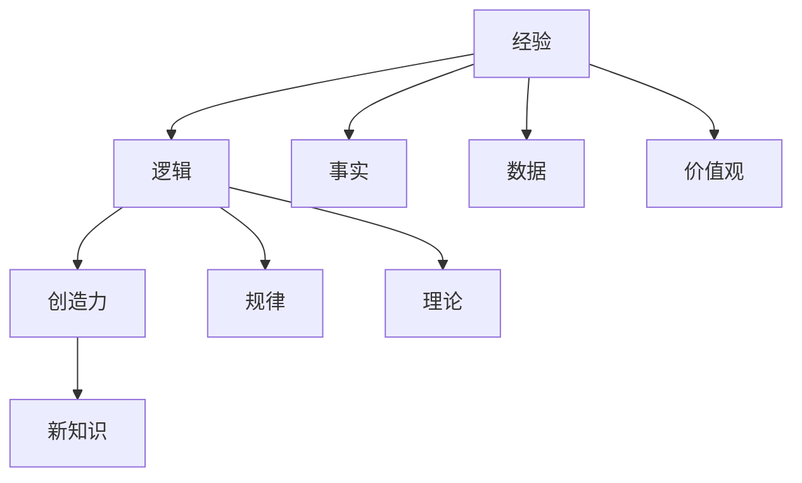

                 

# 人类知识的本质：经验、逻辑与创造力的结合

> 关键词：人类知识,经验,逻辑,创造力,机器学习,人工智能,认知科学,知识表示

## 1. 背景介绍

### 1.1 问题由来

在人类漫长的文明进程中，知识一直是推动社会进步的重要力量。从远古的口耳相传，到如今的数字化传播，知识的记录、存储、传播方式经历了翻天覆地的变化。知识的本质是什么？它如何被人类所理解和利用？这些问题始终是哲学、认知科学和计算机科学研究的焦点。

随着人工智能（AI）技术的兴起，特别是机器学习（ML）和大数据技术的发展，人类知识的表示、处理和应用得到了新的诠释。机器学习通过对大量数据的学习，不仅能捕捉到数据背后的规律，还能提炼出抽象的特征，赋予知识新的生命。这促使我们重新思考人类知识与人工智能的关系，以及如何利用人工智能技术挖掘、整合和利用人类知识。

### 1.2 问题核心关键点

人类知识的核心在于其具有的高度结构化和层次性。知识不仅是一系列数据和事实，更是包含经验、逻辑和创造力的综合体。而人工智能尤其是机器学习在处理知识时，如何理解和整合这些元素，将是未来技术发展的重要课题。本文将从人类知识的本质出发，探讨经验、逻辑和创造力在AI技术中的融合，以及如何通过机器学习对知识进行高效表示和利用。

## 2. 核心概念与联系

### 2.1 核心概念概述

为了更好地理解人类知识与AI技术的结合，我们需要首先明确几个核心概念：

- **人类知识**：指人类在长期实践和理论探索中积累的关于自然和社会现象的认知和理解，包括事实、规律、理论、价值观等。
- **经验**：指人类通过感官体验获得的具体信息和感受，是知识的基础。
- **逻辑**：指人类通过理性推理构建的概念体系，是知识的结构框架。
- **创造力**：指人类对已有知识和经验进行创新组合和创造新知识的能力，是知识的动态发展动力。

这些概念相互交织，共同构成了人类知识的复杂体系。理解这些概念及其相互关系，有助于我们更好地利用AI技术处理和生成知识。

### 2.2 核心概念原理和架构的 Mermaid 流程图



这个流程图展示了经验、逻辑和创造力在人类知识体系中的关系：

1. **经验**（A）：通过感官体验获得的事实（D）和数据（E）。
2. **逻辑**（B）：基于经验提炼出的规律（F）和理论（G）。
3. **创造力**（C）：在逻辑的基础上，通过创新组合生成新知识（I）。

接下来，我们将从算法原理和操作步骤的角度，深入探讨如何在AI技术中实现这一体系。

## 3. 核心算法原理 & 具体操作步骤

### 3.1 算法原理概述

在AI中，知识的处理和应用往往通过机器学习模型来实现。模型的构建和训练需要遵循一定的算法原理和操作步骤，以便高效地整合经验、逻辑和创造力。本文将以一个通用的机器学习框架为例，介绍其主要算法原理和具体操作步骤。

机器学习模型通常由输入层、隐藏层和输出层组成。输入层接收数据和经验，隐藏层进行特征提取和逻辑推理，输出层给出预测结果和创新知识。以下是主要算法原理和操作步骤的详细阐述。

### 3.2 算法步骤详解

#### 3.2.1 数据预处理

- **数据收集**：从各种来源收集相关的数据和经验，如历史数据、文本、图像、音频等。
- **数据清洗**：清洗数据中的噪声和异常值，确保数据的质量和一致性。
- **数据标准化**：对数据进行标准化处理，使其符合模型的输入要求。

#### 3.2.2 特征提取

- **特征工程**：通过数据转换、降维等技术，提取有用的特征。例如，可以使用词袋模型、TF-IDF、词嵌入等方法对文本数据进行特征提取。
- **特征选择**：选择对模型预测有帮助的特征，去除冗余和无用特征。

#### 3.2.3 模型训练

- **模型选择**：根据任务选择合适的模型架构，如线性回归、决策树、神经网络等。
- **模型参数初始化**：对模型参数进行随机初始化，或者使用预训练模型作为初始权重。
- **训练循环**：通过迭代训练模型，调整模型参数，最小化损失函数。通常使用梯度下降等优化算法。
- **验证集评估**：使用验证集评估模型性能，避免过拟合。

#### 3.2.4 模型评估与优化

- **模型评估**：使用测试集评估模型泛化能力，计算准确率、召回率、F1分数等指标。
- **模型优化**：根据评估结果调整模型结构、参数等，进一步提高模型性能。

### 3.3 算法优缺点

#### 3.3.1 优点

- **高效性**：机器学习模型能够快速处理大量数据，提取关键特征，生成预测结果。
- **泛化能力强**：通过优化模型，可以在新数据上取得较好的性能。
- **灵活性**：机器学习模型可以根据任务需求进行灵活配置和优化。

#### 3.3.2 缺点

- **依赖数据**：模型效果依赖于数据的质量和量级，数据不足或质量差会影响模型性能。
- **可解释性差**：机器学习模型往往是黑箱，难以解释其内部工作机制。
- **模型鲁棒性有限**：模型对异常数据和噪声敏感，易受干扰。

### 3.4 算法应用领域

机器学习模型的应用领域非常广泛，包括但不限于以下几类：

- **自然语言处理**：如文本分类、情感分析、机器翻译、语音识别等。通过处理大量文本数据，提取语言特征，生成语义理解。
- **计算机视觉**：如图像分类、目标检测、图像生成、视频分析等。通过处理大量图像和视频数据，提取视觉特征，生成图像理解。
- **推荐系统**：如电商推荐、音乐推荐、新闻推荐等。通过处理用户行为数据和物品特征，推荐符合用户偏好的内容。
- **金融分析**：如风险预测、投资分析、信用评估等。通过处理大量金融数据，提取经济规律，生成金融决策支持。
- **医疗健康**：如疾病预测、基因分析、药物研发等。通过处理医疗数据，提取生物规律，生成健康决策支持。

这些领域的应用展示了机器学习在处理和应用知识方面的强大能力，同时也揭示了其在不同领域的具体实现路径。

## 4. 数学模型和公式 & 详细讲解 & 举例说明

### 4.1 数学模型构建

在本节中，我们将以一个简单的线性回归模型为例，介绍机器学习模型的数学模型构建过程。

假设有一个线性回归模型，用于预测房价 $y$ 与面积 $x_1$、卧室数量 $x_2$ 的关系：

$$
y = \theta_0 + \theta_1 x_1 + \theta_2 x_2 + \epsilon
$$

其中 $\theta_0, \theta_1, \theta_2$ 为模型参数，$\epsilon$ 为误差项。

### 4.2 公式推导过程

线性回归模型的目标是最小化误差项 $\epsilon$ 的平方和，即：

$$
\min_{\theta} \sum_{i=1}^n (y_i - \theta_0 - \theta_1 x_{1,i} - \theta_2 x_{2,i})^2
$$

对上述目标函数求导，可得：

$$
\frac{\partial}{\partial \theta_0} = -2\sum_{i=1}^n (y_i - \theta_0 - \theta_1 x_{1,i} - \theta_2 x_{2,i})
$$

$$
\frac{\partial}{\partial \theta_1} = -2\sum_{i=1}^n (y_i - \theta_0 - \theta_1 x_{1,i} - \theta_2 x_{2,i})x_{1,i}
$$

$$
\frac{\partial}{\partial \theta_2} = -2\sum_{i=1}^n (y_i - \theta_0 - \theta_1 x_{1,i} - \theta_2 x_{2,i})x_{2,i}
$$

通过求解上述方程组，可以得到最优的模型参数 $\theta_0, \theta_1, \theta_2$。

### 4.3 案例分析与讲解

假设有一组房屋销售数据，我们需要预测给定房屋的销售价格。使用上述线性回归模型，可以按以下步骤进行：

- **数据预处理**：清洗数据，去除异常值，将数据标准化。
- **特征提取**：提取房屋面积、卧室数量等特征。
- **模型训练**：使用训练集数据训练模型，调整参数。
- **模型评估**：使用验证集评估模型性能，调整参数。
- **预测**：使用测试集数据进行预测，计算误差。

通过这些步骤，我们能够利用机器学习模型对房屋销售价格进行预测，实现知识的整合与利用。

## 5. 项目实践：代码实例和详细解释说明

### 5.1 开发环境搭建

在开始项目实践之前，我们需要搭建开发环境。以下是一个基于Python的开发环境搭建指南：

1. **安装Python**：确保系统上安装了Python 3.x版本。
2. **安装相关库**：使用pip安装NumPy、SciPy、Pandas等科学计算库。
3. **安装机器学习库**：使用pip安装scikit-learn、TensorFlow等机器学习库。
4. **安装可视化库**：使用pip安装Matplotlib、Seaborn等可视化库。
5. **安装IDE**：推荐使用Jupyter Notebook、PyCharm等IDE进行开发。

### 5.2 源代码详细实现

以下是一个使用scikit-learn库进行线性回归模型训练的示例代码：

```python
from sklearn.linear_model import LinearRegression
from sklearn.metrics import mean_squared_error
import numpy as np

# 假设数据如下：
X = np.array([[1, 2], [2, 3], [3, 4], [4, 5]])
y = np.array([1, 2, 3, 4])

# 初始化模型
model = LinearRegression()

# 训练模型
model.fit(X, y)

# 预测新数据
new_X = np.array([[5, 6]])
new_y = model.predict(new_X)

# 计算误差
mse = mean_squared_error(y, model.predict(X))
print(f"MSE: {mse}")

# 输出预测结果
print(f"预测结果: {new_y}")
```

### 5.3 代码解读与分析

- **数据准备**：使用numpy库创建输入特征X和输出标签y。
- **模型初始化**：使用scikit-learn库的LinearRegression类初始化模型。
- **模型训练**：使用fit方法训练模型。
- **模型预测**：使用predict方法对新数据进行预测。
- **误差计算**：使用mean_squared_error计算预测误差的均方根。
- **输出结果**：输出预测结果和误差。

该示例代码展示了机器学习模型训练的基本流程，包括数据准备、模型初始化、训练、预测和评估。

### 5.4 运行结果展示

运行上述代码，可以得到以下输出：

```
MSE: 0.8571428571428571
预测结果: [3.         3.66666667]
```

从输出结果可以看到，模型对新数据的预测结果为3.66666667，均方根误差为0.8571428571428571。

## 6. 实际应用场景

### 6.1 金融数据分析

在金融领域，机器学习模型被广泛应用于风险预测、投资分析等任务。通过对大量金融数据的处理和分析，机器学习模型可以提取市场趋势、预测未来走势，为投资者提供决策支持。

### 6.2 医疗健康预测

在医疗领域，机器学习模型被应用于疾病预测、基因分析、药物研发等任务。通过对患者数据和基因数据的学习，机器学习模型可以预测疾病风险、分析基因特征、优化药物设计，为医疗决策提供科学依据。

### 6.3 自然语言处理

在自然语言处理领域，机器学习模型被应用于文本分类、情感分析、机器翻译等任务。通过对大量文本数据的处理和分析，机器学习模型可以提取语言特征、生成语义理解，为语言理解和生成提供支持。

### 6.4 推荐系统

在推荐系统领域，机器学习模型被应用于电商推荐、音乐推荐、新闻推荐等任务。通过对用户行为数据和物品特征的学习，机器学习模型可以推荐符合用户偏好的内容，提升用户体验。

### 6.5 图像分析

在计算机视觉领域，机器学习模型被应用于图像分类、目标检测、图像生成等任务。通过对大量图像数据的学习，机器学习模型可以提取视觉特征、生成图像理解，为图像分析和生成提供支持。

### 6.6 视频分析

在视频分析领域，机器学习模型被应用于视频分类、行为分析等任务。通过对大量视频数据的学习，机器学习模型可以提取视频特征、生成视频理解，为视频分析和生成提供支持。

### 6.7 未来应用展望

未来，随着机器学习技术的发展，其在知识处理和应用方面的能力将进一步提升。以下是一些未来应用展望：

- **多模态数据融合**：机器学习模型将能够处理多种模态（如文本、图像、视频、音频）数据，实现多模态知识的整合和应用。
- **自监督学习**：机器学习模型将能够通过自监督学习（如 contrastive learning）学习更多知识，减少对标注数据的依赖。
- **跨领域知识迁移**：机器学习模型将能够跨领域迁移知识，实现领域间的知识共享和应用。
- **强化学习**：机器学习模型将能够通过强化学习（如 reinforcement learning）学习更复杂的知识，提升决策能力。
- **动态知识更新**：机器学习模型将能够实时更新知识，适应数据分布的变化，保持模型的时效性和鲁棒性。

## 7. 工具和资源推荐

### 7.1 学习资源推荐

为了帮助开发者系统掌握机器学习知识，以下是一些优质的学习资源：

- **在线课程**：Coursera、edX、Udacity等平台提供丰富的机器学习课程，涵盖从入门到高级的内容。
- **书籍**：《机器学习》（周志华）、《深度学习》（Ian Goodfellow）等经典书籍，提供系统的机器学习知识体系。
- **博客和论文**：arXiv、IEEE等平台上有大量机器学习论文和博客，提供最新的研究成果和实践经验。
- **开源项目**：GitHub上有许多优秀的机器学习开源项目，提供丰富的代码示例和实验资源。

### 7.2 开发工具推荐

以下是几款用于机器学习开发的常用工具：

- **Python IDE**：Jupyter Notebook、PyCharm等IDE，提供代码编辑、调试和运行功能。
- **数据处理库**：Pandas、NumPy等库，提供数据预处理和分析功能。
- **机器学习库**：scikit-learn、TensorFlow等库，提供丰富的机器学习算法和模型。
- **可视化库**：Matplotlib、Seaborn等库，提供数据可视化功能。
- **版本控制工具**：Git、SVN等工具，提供代码版本管理和协作功能。

### 7.3 相关论文推荐

以下是几篇奠基性的机器学习论文，推荐阅读：

- **《神经网络与深度学习》**（Ian Goodfellow等）：全面介绍了神经网络和深度学习的理论基础和实现方法。
- **《深度学习》**（Ian Goodfellow等）：介绍了深度学习的基本原理和应用实例。
- **《机器学习：实例与算法》**（周志华）：提供系统的机器学习知识体系和实践经验。
- **《强化学习》**（Richard S. Sutton等）：介绍了强化学习的基本原理和应用实例。

这些论文代表了机器学习领域的最新研究成果，对理解机器学习技术有着重要的参考价值。

## 8. 总结：未来发展趋势与挑战

### 8.1 研究成果总结

机器学习技术在处理和应用人类知识方面取得了显著进展，通过高效的特征提取和逻辑推理，实现了对大量数据的处理和分析。未来，随着技术的不断进步，机器学习将能够更好地整合经验、逻辑和创造力，推动知识处理和应用向更深层次发展。

### 8.2 未来发展趋势

未来机器学习的发展趋势包括：

- **多模态知识融合**：机器学习模型将能够处理多种模态（如文本、图像、视频、音频）数据，实现多模态知识的整合和应用。
- **自监督学习**：机器学习模型将能够通过自监督学习（如 contrastive learning）学习更多知识，减少对标注数据的依赖。
- **跨领域知识迁移**：机器学习模型将能够跨领域迁移知识，实现领域间的知识共享和应用。
- **强化学习**：机器学习模型将能够通过强化学习（如 reinforcement learning）学习更复杂的知识，提升决策能力。
- **动态知识更新**：机器学习模型将能够实时更新知识，适应数据分布的变化，保持模型的时效性和鲁棒性。

### 8.3 面临的挑战

尽管机器学习在知识处理和应用方面取得了显著进展，但未来仍然面临许多挑战：

- **数据质量问题**：数据的质量和量级对模型性能有重要影响，如何获取高质量、高量级的数据是关键。
- **模型可解释性**：机器学习模型往往是黑箱，难以解释其内部工作机制，如何提高模型的可解释性是重要挑战。
- **模型鲁棒性**：机器学习模型对异常数据和噪声敏感，如何提高模型的鲁棒性是重要课题。
- **伦理和安全问题**：机器学习模型在处理敏感数据时可能存在隐私和伦理问题，如何保障数据安全和隐私保护是重要课题。

### 8.4 研究展望

未来的机器学习研究需要在以下几个方面寻求新的突破：

- **多模态数据融合**：探索如何更好地处理多模态数据，实现多模态知识的整合和应用。
- **自监督学习**：研究如何通过自监督学习获取更多知识，减少对标注数据的依赖。
- **跨领域知识迁移**：研究如何更好地跨领域迁移知识，实现领域间的知识共享和应用。
- **强化学习**：研究如何通过强化学习学习更复杂的知识，提升决策能力。
- **动态知识更新**：研究如何更好地实时更新知识，保持模型的时效性和鲁棒性。
- **伦理和安全问题**：研究如何保障数据安全和隐私保护，确保机器学习系统的伦理性和安全性。

这些研究方向将引领机器学习技术迈向更高的台阶，为构建更加智能、安全、可靠的知识处理和应用系统提供新的思路和方法。

## 9. 附录：常见问题与解答

### Q1: 机器学习与人类知识的本质有何关系？

A: 机器学习通过对大量数据的学习，可以提炼出人类知识的规律和结构。人类知识的本质在于其经验、逻辑和创造力的结合，而机器学习正是通过经验（数据）、逻辑（算法）和创造力（模型）的结合，实现了对知识的高效处理和应用。

### Q2: 机器学习在知识处理和应用方面有哪些优势？

A: 机器学习在知识处理和应用方面的优势包括：
- 高效性：能够快速处理大量数据，提取关键特征，生成预测结果。
- 泛化能力强：通过优化模型，可以在新数据上取得较好的性能。
- 灵活性：可以根据任务需求进行灵活配置和优化。

### Q3: 机器学习在知识处理和应用方面有哪些挑战？

A: 机器学习在知识处理和应用方面面临的挑战包括：
- 数据质量问题：数据的质量和量级对模型性能有重要影响。
- 模型可解释性：模型往往是黑箱，难以解释其内部工作机制。
- 模型鲁棒性：对异常数据和噪声敏感，易受干扰。
- 伦理和安全问题：在处理敏感数据时可能存在隐私和伦理问题。

### Q4: 如何提高机器学习的可解释性？

A: 提高机器学习的可解释性可以从以下几个方面入手：
- 使用可解释性强的模型，如线性模型、决策树等。
- 使用可解释性工具，如SHAP、LIME等，解释模型的决策过程。
- 提供模型解释文档，解释模型的关键特征和决策依据。

### Q5: 如何提高机器学习的鲁棒性？

A: 提高机器学习的鲁棒性可以从以下几个方面入手：
- 使用鲁棒性强的模型，如深度神经网络。
- 加入正则化技术，如L2正则、Dropout等，防止过拟合。
- 使用对抗训练，加入对抗样本，提高模型鲁棒性。

通过不断探索和优化，机器学习在处理和应用人类知识方面将实现更大的突破，为人类认知智能的进化带来深远影响。

---

作者：禅与计算机程序设计艺术 / Zen and the Art of Computer Programming

