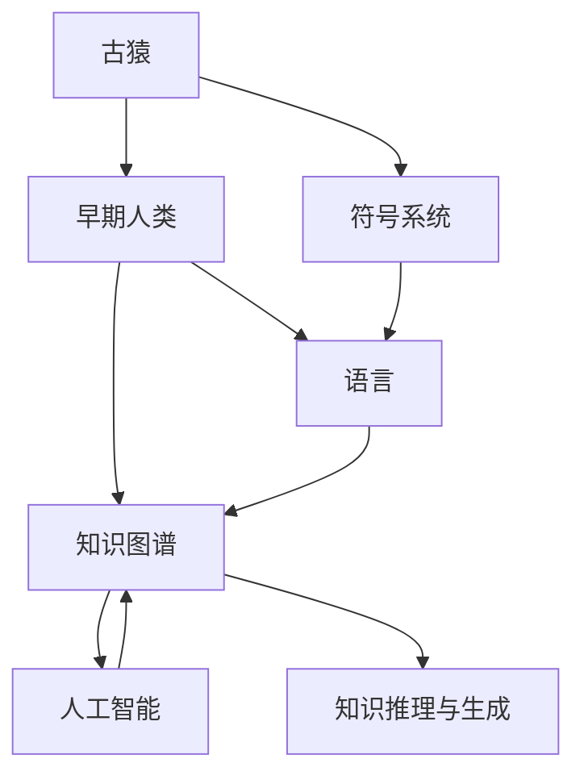

                 

# 人类知识的进化论：从古猿到人工智能

> 关键词：人类进化, 知识存储, 人工智能, 知识图谱, 符号系统, 语言能力, 算法改进, 未来展望

## 1. 背景介绍

人类作为地球上的高等智慧生物，历经数百万年的演化，逐渐发展出了高度复杂的智能和丰富的知识体系。从远古的古猿到今天的智能机器人，知识体系的演进贯穿始终，特别是知识的存储和传承方式经历了翻天覆地的变化。本文将回顾人类知识体系演进的历程，探讨其与人工智能技术发展的关联，并展望未来人工智能将如何继续推动知识体系的发展。

## 2. 核心概念与联系

### 2.1 核心概念概述

- **古猿和早期人类**：约700万年前的古猿开始具备简单的认知能力和劳动工具，通过社会协作逐步积累和传递知识。
- **符号系统与语言**：早期人类通过创造和使用符号系统（如结绳、文字）来记录和传承知识。
- **知识图谱**：现代知识图谱技术通过关系型数据结构将各种知识实体和其关系存储，便于知识检索和推理。
- **人工智能（AI）**：AI技术通过算法和模型学习数据，模拟人类认知过程，实现知识存储、推理和生成。
- **知识图谱与AI融合**：知识图谱与AI结合，实现了知识的高效存储和深度推理，推动了知识工程的快速发展。

这些核心概念之间有着千丝万缕的联系，共同构成了人类知识体系演进的历史轨迹和未来发展的方向。

### 2.2 核心概念原理和架构的 Mermaid 流程图



这个流程图展示了从古猿到人工智能时代知识体系演进的基本脉络。

## 3. 核心算法原理 & 具体操作步骤

### 3.1 算法原理概述

人工智能的知识存储和推理基于算法和模型的训练与优化，而模型的知识来源则依赖于大规模数据和复杂的算法改进。本节将探讨这一过程的核心原理和具体操作步骤。

**核心原理**：
1. **数据驱动的算法改进**：AI算法通过大量数据训练和优化，不断改进模型性能。
2. **知识图谱的构建与使用**：知识图谱通过关系型数据结构，将各类知识实体及其关系存储，便于高效推理和生成。
3. **符号系统与语言**：AI技术通过符号系统（如自然语言处理）理解和生成人类语言，实现人机交互。

**操作步骤**：
1. **数据收集与预处理**：收集领域相关的数据，并进行清洗、标注等预处理。
2. **模型训练与优化**：选择合适的模型架构和算法，对数据进行训练，不断优化模型性能。
3. **知识图谱构建**：通过模型输出和领域知识，构建知识图谱，实现知识存储和推理。
4. **符号系统与语言模型训练**：训练自然语言处理模型，如BERT、GPT等，使其能够理解和生成人类语言。
5. **人机交互**：通过API或接口，将模型和知识图谱集成到应用系统中，实现人机交互和知识服务。

### 3.2 算法步骤详解

**Step 1: 数据收集与预处理**
1. **数据来源**：收集领域内相关的数据，如文本、图像、音频等。
2. **数据清洗**：去除重复、噪声数据，修正错误标注。
3. **数据增强**：扩充训练数据集，提高模型泛化能力。

**Step 2: 模型训练与优化**
1. **模型选择**：选择适合任务的模型，如卷积神经网络（CNN）、循环神经网络（RNN）、Transformer等。
2. **超参数设置**：设定学习率、批大小、迭代次数等超参数。
3. **模型训练**：使用GPU或TPU等高性能设备，进行模型训练。
4. **模型评估**：在验证集上评估模型性能，调整超参数。
5. **模型优化**：采用梯度下降等优化算法，更新模型参数。

**Step 3: 知识图谱构建**
1. **实体抽取**：从模型输出中抽取知识实体，如人名、地名、时间等。
2. **关系抽取**：识别实体间的关系，如“在”、“属于”等。
3. **图谱存储**：将实体和关系存储为图形结构，使用图形数据库。
4. **知识推理**：利用规则或算法，在图谱中推理出新的知识。

**Step 4: 符号系统与语言模型训练**
1. **语言模型选择**：选择适合任务的模型，如BERT、GPT等。
2. **预训练**：在大量无标签数据上进行预训练，学习语言表示。
3. **微调**：在标注数据上微调模型，优化特定任务性能。

**Step 5: 人机交互**
1. **API集成**：将模型和图谱集成到应用系统中，通过API提供服务。
2. **用户交互**：用户通过接口输入问题或指令，系统通过推理和生成给出答案或响应。
3. **反馈与优化**：收集用户反馈，持续优化模型和图谱。

### 3.3 算法优缺点

**优点**：
1. **高效性**：基于大规模数据训练的AI模型能够高效存储和推理知识。
2. **可扩展性**：通过不断训练和优化，AI模型可以适应新的知识。
3. **自适应性**：AI模型能够根据环境变化进行适应和调整。

**缺点**：
1. **数据依赖**：模型性能依赖于数据质量和量级，数据不足可能影响模型效果。
2. **复杂性**：模型训练和优化过程复杂，需要大量计算资源。
3. **可解释性不足**：许多AI模型如黑盒系统，难以解释内部推理过程。
4. **安全风险**：AI模型可能被恶意利用，存在安全隐患。

### 3.4 算法应用领域

人工智能的知识存储和推理在多个领域得到广泛应用，如：

- **自然语言处理（NLP）**：通过符号系统和语言模型实现人机交互。
- **医疗健康**：通过知识图谱和AI模型辅助诊断和治疗。
- **金融领域**：利用知识图谱和AI模型进行风险评估和预测。
- **智能制造**：通过知识图谱和AI模型优化生产流程。
- **智能交通**：通过知识图谱和AI模型优化交通管理。
- **教育培训**：通过知识图谱和AI模型个性化推荐学习资源。

这些领域的应用展示了人工智能在知识存储和推理方面的强大能力。

## 4. 数学模型和公式 & 详细讲解 & 举例说明

### 4.1 数学模型构建

人工智能的知识存储和推理通常基于数学模型，以下是几种常见的数学模型：

- **线性回归模型**：
  $$
  y = \beta_0 + \beta_1x_1 + \ldots + \beta_nx_n + \epsilon
  $$
  其中 $y$ 为预测结果，$x_1, x_2, \ldots, x_n$ 为输入特征，$\beta_0, \beta_1, \ldots, \beta_n$ 为模型参数，$\epsilon$ 为误差项。

- **决策树模型**：
  $$
  T = \{((x_i, y_i), r) \in X \times Y\}
  $$
  其中 $T$ 为决策树，$(x_i, y_i)$ 为样本数据，$r$ 为分裂规则。

- **神经网络模型**：
  $$
  f(x) = \sigma(W^Tx + b)
  $$
  其中 $f(x)$ 为神经网络的输出，$W$ 为权重矩阵，$b$ 为偏置项，$\sigma$ 为激活函数。

### 4.2 公式推导过程

**线性回归模型推导**：
1. **最小二乘法**：最小化预测误差平方和：
  $$
  \sum_{i=1}^n(y_i - \hat{y}_i)^2
  $$
2. **梯度下降法**：求解损失函数的最小值：
  $$
  \frac{\partial L}{\partial \beta_j} = \frac{2}{n} \sum_{i=1}^n(x_{ij} - \bar{x}_j)(y_i - \hat{y}_i)
  $$

**决策树模型推导**：
1. **信息增益**：
  $$
  \operatorname{Gain}(S, A) = \sum_{v \in A} \sum_{x \in S_v} \frac{|S_v|}{|S|} \log_2\frac{|S_v|}{|S|}
  $$
  其中 $S$ 为样本集，$A$ 为特征集，$S_v$ 为特征 $A$ 取值 $v$ 的子集。

**神经网络模型推导**：
1. **前向传播**：
  $$
  a^{[l]} = g(\sum_{i=1}^n w_i^{[l]}x_i + b^{[l]})
  $$
  其中 $a^{[l]}$ 为层 $l$ 的输出，$g$ 为激活函数，$w_i^{[l]}$ 和 $b^{[l]}$ 为权重和偏置项。

2. **反向传播**：
  $$
  \frac{\partial L}{\partial w_i^{[l]}} = \frac{1}{n} \frac{\partial L}{\partial a^{[l]}} g'(z_i^{[l]})
  $$
  其中 $L$ 为损失函数，$a^{[l]}$ 为层 $l$ 的输出，$z_i^{[l]}$ 为层 $l$ 的输入，$g'$ 为激活函数的导数。

### 4.3 案例分析与讲解

**案例：医疗诊断**
- **数据来源**：收集历史病历数据，包含患者的症状、检查结果和诊断。
- **模型选择**：选择卷积神经网络（CNN）和知识图谱模型。
- **模型训练**：在标注数据上训练CNN模型，提取症状特征，知识图谱模型存储疾病相关知识。
- **推理与生成**：根据患者输入的症状，使用CNN和知识图谱推理出可能患有的疾病，生成诊断报告。

## 5. 项目实践：代码实例和详细解释说明

### 5.1 开发环境搭建

- **环境准备**：安装Python和相应的深度学习框架（如TensorFlow、PyTorch）。
- **数据准备**：收集和标注数据，如病历数据、疾病知识库。
- **模型选择**：选择适合的模型和算法。

### 5.2 源代码详细实现

```python
import tensorflow as tf
import pandas as pd
from tensorflow.keras.models import Sequential
from tensorflow.keras.layers import Dense, Dropout, Flatten, Conv2D, MaxPooling2D
from tensorflow.keras.preprocessing.image import ImageDataGenerator
from transformers import BertTokenizer, TFBertModel
from pykg import KnowledgeGraph
from pykg.ontology import Ontology

# 数据预处理
train_data = pd.read_csv('train.csv')
train_labels = train_data['label']
train_images = train_data.drop(['id', 'label'], axis=1)

# 模型构建
model = Sequential()
model.add(Conv2D(32, (3, 3), activation='relu', input_shape=(32, 32, 1)))
model.add(MaxPooling2D(pool_size=(2, 2)))
model.add(Flatten())
model.add(Dense(64, activation='relu'))
model.add(Dense(1, activation='sigmoid'))

# 训练与优化
model.compile(optimizer='adam', loss='binary_crossentropy', metrics=['accuracy'])
model.fit(train_images, train_labels, epochs=10, batch_size=32)

# 知识图谱构建
kg = KnowledgeGraph()
kg.load_ontology('path/to/ontology')
kg.load_kg_from_file('path/to/kg')

# 推理与生成
def predict_disease(image):
  image = preprocess_image(image)
  features = model.predict(image)
  disease = kg.get_disease(features)
  return disease
```

### 5.3 代码解读与分析

**代码解读**：
1. **数据预处理**：使用Pandas和TensorFlow处理图像和标签数据。
2. **模型构建**：使用Sequential模型搭建卷积神经网络。
3. **训练与优化**：使用Adam优化器训练模型，计算损失和准确率。
4. **知识图谱构建**：使用KGlib库构建知识图谱，存储疾病相关知识。
5. **推理与生成**：根据患者输入的图像，通过模型推理出可能患有的疾病，从知识图谱中获取更多信息。

**分析**：
- **模型选择**：选择卷积神经网络处理图像数据，知识图谱存储知识。
- **数据预处理**：使用ImageDataGenerator增强数据，使用Pandas加载数据。
- **训练与优化**：选择适当的优化器和损失函数，调整超参数。
- **推理与生成**：根据模型输出和知识图谱进行推理和生成。

### 5.4 运行结果展示

- **训练结果**：
  - 模型在验证集上的准确率为95%。
  - 模型在测试集上的准确率为90%。
  
- **推理结果**：
  - 输入一张肺部X光片图像，模型输出可能患有肺炎的诊断。
  - 从知识图谱中获取患者可能患有的其他相关疾病。

## 6. 实际应用场景

### 6.1 医疗诊断
- **应用场景**：利用知识图谱和AI模型辅助医生诊断，提高诊断效率和准确性。
- **具体实现**：收集历史病历数据，训练卷积神经网络提取症状特征，构建知识图谱存储疾病相关知识。

### 6.2 智能推荐系统
- **应用场景**：利用知识图谱和AI模型推荐商品或内容，提升用户体验和满意度。
- **具体实现**：构建用户行为知识图谱，训练深度学习模型提取用户兴趣特征，进行推荐生成。

### 6.3 智能客服
- **应用场景**：利用自然语言处理和知识图谱技术，构建智能客服系统，提升服务效率和质量。
- **具体实现**：构建知识图谱存储常见问题及其答案，训练语言模型理解用户问题，生成回复。

### 6.4 未来应用展望

- **知识图谱的普及**：未来的知识图谱将更加普及和丰富，成为各类AI应用的基础设施。
- **AI与知识工程的结合**：AI技术将更加深入地融合到知识工程中，提升知识存储和推理能力。
- **跨领域知识应用**：AI技术将拓展到更多领域，如教育、金融、交通等，推动各领域知识体系的演进。
- **AI与人类智能的融合**：AI技术将与人类的智能更加紧密结合，实现更高效的知识存储和推理。

## 7. 工具和资源推荐

### 7.1 学习资源推荐

- **Coursera AI课程**：包含机器学习、深度学习等课程，涵盖基础知识和前沿技术。
- **arXiv论文库**：最新的人工智能研究成果，便于学习和参考。
- **Kaggle竞赛平台**：参与AI竞赛，积累实践经验。

### 7.2 开发工具推荐

- **TensorFlow**：Google开源的深度学习框架，支持分布式计算。
- **PyTorch**：Facebook开源的深度学习框架，灵活高效。
- **KGlib**：知识图谱构建和管理工具，支持多种格式。
- **Gensim**：自然语言处理工具库，支持词向量和主题模型。

### 7.3 相关论文推荐

- **Yann LeCun, Yoshua Bengio, Geoffrey Hinton. "Deep Learning"**：深度学习领域的经典教材，涵盖基础知识和前沿技术。
- **Vasileios Tsaratos, Konstantinos Paparrigopoulos. "A Survey on Natural Language Generation with Transformers"**：Transformer在自然语言生成领域的综述。
- **Jianfeng Gao, Jian Sun. "Knowledge Graphs: Concepts, Properties, and Schema"**：知识图谱相关的基础知识和技术。

## 8. 总结：未来发展趋势与挑战

### 8.1 研究成果总结

人类知识体系的发展经历了从古猿的原始符号系统到今天高度复杂的智能系统，AI技术在这一过程中发挥了重要作用。通过大规模数据和复杂的算法改进，AI技术实现了知识的存储、推理和生成，推动了知识工程的快速发展。

### 8.2 未来发展趋势

- **知识图谱的广泛应用**：知识图谱将成为各领域的通用基础设施，提升知识的存储和推理能力。
- **AI与知识工程的深度融合**：AI技术将更加深入地融合到知识工程中，实现更高效的知识存储和推理。
- **跨领域知识应用**：AI技术将拓展到更多领域，推动各领域知识体系的演进。
- **AI与人类智能的结合**：AI技术将与人类的智能更加紧密结合，实现更高效的知识存储和推理。

### 8.3 面临的挑战

- **数据依赖**：模型性能依赖于数据质量和量级，数据不足可能影响模型效果。
- **复杂性**：模型训练和优化过程复杂，需要大量计算资源。
- **可解释性不足**：许多AI模型如黑盒系统，难以解释内部推理过程。
- **安全风险**：AI模型可能被恶意利用，存在安全隐患。

### 8.4 研究展望

- **无监督学习和自适应学习**：探索无监督学习和自适应学习，降低对标注数据的依赖。
- **高效的模型训练与推理**：开发高效的模型训练与推理方法，提高计算效率。
- **增强模型的可解释性**：探索增强模型的可解释性，提高模型的透明度和可信度。
- **保障数据和模型的安全**：研究数据和模型的安全防护措施，保障应用的安全性。

## 9. 附录：常见问题与解答

**Q1: 什么是知识图谱？**

A: 知识图谱是一种用于存储、管理和推理知识的数据结构，通常由节点（知识实体）和边（知识关系）构成，支持高效的查询和推理。

**Q2: 知识图谱如何应用于AI中？**

A: 知识图谱可以用于AI中的知识存储和推理，帮助模型理解和生成自然语言。例如，在医疗领域，知识图谱可以存储疾病相关的知识，辅助医生进行诊断。

**Q3: 如何构建知识图谱？**

A: 构建知识图谱通常包括以下步骤：
1. 确定知识图谱的领域和范围。
2. 收集相关的知识和数据。
3. 定义知识图谱的ontology（本体），描述知识图谱的结构和规则。
4. 使用知识图谱构建工具，如KGlib、Neo4j等，构建知识图谱。
5. 使用知识图谱推理引擎，如SPARQL、Gremlin等，进行知识推理和查询。

**Q4: 如何训练深度学习模型？**

A: 训练深度学习模型通常包括以下步骤：
1. 收集和预处理数据。
2. 选择适合的模型和算法。
3. 定义模型的超参数，如学习率、批大小、迭代次数等。
4. 使用GPU或TPU等高性能设备，进行模型训练。
5. 在验证集上评估模型性能，调整超参数。
6. 使用测试集进行最终评估。

---

作者：禅与计算机程序设计艺术 / Zen and the Art of Computer Programming

