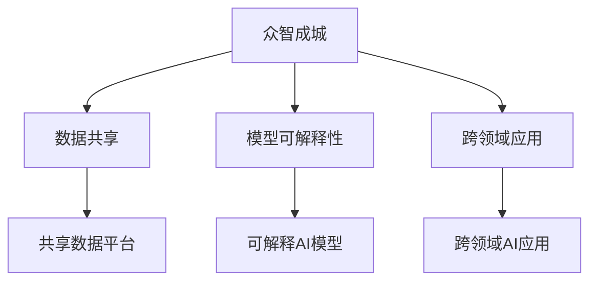

                 

## 1. 背景介绍

### 1.1 问题由来
在过去的几十年中，人工智能（AI）技术的迅速发展已经在多个领域内取得了显著的成果，从自动驾驶汽车到聊天机器人，从智能家居到医疗诊断，AI正在逐渐改变我们的生活和工作方式。然而，尽管AI技术的进步带来了许多便利，但它依然面临一些关键挑战，其中最重要的是如何将人类的知识有效地融入AI系统中。

大语言模型（Large Language Models, LLMs），如GPT-3和BERT等，近年来取得了巨大突破，它们能够生成高度逼真的文本，回答问题，甚至进行编写故事等复杂的任务。这些模型通常基于大规模的文本数据进行预训练，然后使用特定的任务进行微调，以适应特定的应用场景。

然而，即使这些模型在处理文本方面非常出色，它们在处理复杂的决策任务时仍存在局限性。这主要是因为这些模型是基于训练数据进行训练的，缺乏真正的人类经验和直觉。此外，这些模型通常由大公司或研究机构开发，它们的知识和算法往往被视为专有信息，缺乏公开和共享。

### 1.2 问题核心关键点
如何利用人类知识来增强AI系统，使其更加智能和可靠，成为当前AI研究的重要问题。以下是几个关键点：

1. **众智成城**：利用群体智慧来增强AI系统，使其能够更好地理解复杂的人类活动和决策过程。
2. **数据共享**：建立开放的数据共享平台，促进知识的流动和传播，从而加速AI技术的发展。
3. **模型可解释性**：开发可解释的AI模型，使人们能够理解和信任AI的决策过程。
4. **跨领域应用**：将AI技术应用于不同的领域，如医疗、金融、教育等，以解决实际问题。

本文将探讨如何利用人类知识的集体智慧来增强AI系统，特别是大语言模型的能力，并通过众智成城的力量来实现这一目标。

## 2. 核心概念与联系

### 2.1 核心概念概述

为了更好地理解如何将人类知识融入AI系统中，我们需要了解一些核心概念：

- **众智成城（Collective Wisdom）**：指利用集体的智慧和经验来解决问题。
- **数据共享（Data Sharing）**：指在合法和安全的条件下，将数据和知识共享给其他人使用。
- **模型可解释性（Model Interpretability）**：指开发可解释的AI模型，使其决策过程透明、可理解和可信。
- **跨领域应用（Cross-domain Application）**：指将AI技术应用于不同领域，以解决实际问题。

这些概念之间的联系可以通过以下Mermaid流程图来展示：



这个流程图展示了众智成城、数据共享、模型可解释性和跨领域应用之间的关系：

1. 众智成城通过数据共享，促进知识的流动和传播。
2. 数据共享建立在开放共享平台上，提供了丰富的数据源。
3. 模型可解释性使AI模型透明、可信，提高了用户的信任度。
4. 跨领域应用将AI技术应用于不同领域，解决了实际问题。

## 3. 核心算法原理 & 具体操作步骤

### 3.1 算法原理概述

将人类知识融入AI系统，特别是大语言模型的核心算法原理基于众智成城（Collective Wisdom）和数据共享（Data Sharing）。具体来说，该算法通过以下步骤实现：

1. **数据收集**：从不同领域和来源收集大量的数据。
2. **数据预处理**：对收集到的数据进行清洗、标注和预处理。
3. **数据共享**：将处理后的数据共享到公共平台上，供其他人使用。
4. **模型训练**：使用共享的数据集对AI模型进行训练，以适应特定任务。
5. **模型微调**：根据特定任务的需求，对训练好的模型进行微调，以提高其性能。
6. **模型部署**：将微调后的模型部署到实际应用中，解决实际问题。

### 3.2 算法步骤详解

**Step 1: 数据收集**
收集来自不同领域的数据。例如，可以从医疗、金融、教育等领域收集大量的文本、图像、音频和视频数据。

**Step 2: 数据预处理**
对收集到的数据进行清洗、标注和预处理。例如，对于文本数据，可以进行分词、去除停用词、词干提取等预处理操作。

**Step 3: 数据共享**
将处理后的数据共享到公共平台上，如Google Dataset Search、Kaggle等。这些平台提供了丰富的数据源，供其他人使用。

**Step 4: 模型训练**
使用共享的数据集对AI模型进行训练。例如，可以使用BERT等预训练模型作为初始化参数，使用特定的任务进行微调。

**Step 5: 模型微调**
根据特定任务的需求，对训练好的模型进行微调，以提高其性能。例如，可以使用微调技术，如Fine-tuning和Transfer Learning，来优化模型的性能。

**Step 6: 模型部署**
将微调后的模型部署到实际应用中，解决实际问题。例如，可以将微调的模型应用于智能客服、金融舆情监测、个性化推荐等场景。

### 3.3 算法优缺点

**优点**：
1. **数据多样性**：利用多个领域的知识，提高了AI模型的泛化能力。
2. **透明度**：模型可解释性增强了用户的信任度。
3. **高效性**：共享数据减少了数据收集和标注的成本，提高了训练效率。

**缺点**：
1. **隐私问题**：数据共享可能涉及隐私问题，需要确保数据安全。
2. **知识偏差**：共享数据可能存在偏差，影响模型的公平性和准确性。
3. **技术复杂性**：数据预处理和模型训练需要一定的技术储备。

### 3.4 算法应用领域

将人类知识融入AI系统，特别是大语言模型的算法在多个领域都有应用。以下是几个主要应用领域：

- **医疗**：利用共享的医学数据和知识，训练AI模型进行疾病诊断、药物研发等任务。
- **金融**：利用共享的金融数据和知识，训练AI模型进行风险评估、欺诈检测等任务。
- **教育**：利用共享的教育数据和知识，训练AI模型进行智能推荐、情感分析等任务。
- **安全**：利用共享的安全数据和知识，训练AI模型进行入侵检测、异常检测等任务。

## 4. 数学模型和公式 & 详细讲解 & 举例说明

### 4.1 数学模型构建

我们将使用数学语言对如何将人类知识融入AI系统的算法进行更加严格的刻画。

假设我们有一个包含$m$个数据样本的数据集$D=\{(x_1,y_1),(x_2,y_2),...(x_m,y_m)\}$，其中$x_i$为输入，$y_i$为输出。

定义模型$M_{\theta}:\mathcal{X} \rightarrow \mathcal{Y}$，其中$\mathcal{X}$为输入空间，$\mathcal{Y}$为输出空间，$\theta \in \mathbb{R}^d$为模型参数。

定义模型$M_{\theta}$在数据样本$(x,y)$上的损失函数为$\ell(M_{\theta}(x),y)$，则在数据集$D$上的经验风险为：

$$
\mathcal{L}(\theta) = \frac{1}{m} \sum_{i=1}^m \ell(M_{\theta}(x_i),y_i)
$$

微调的优化目标是最小化经验风险，即找到最优参数：

$$
\theta^* = \mathop{\arg\min}_{\theta} \mathcal{L}(\theta)
$$

在实践中，我们通常使用基于梯度的优化算法（如SGD、Adam等）来近似求解上述最优化问题。设$\eta$为学习率，$\lambda$为正则化系数，则参数的更新公式为：

$$
\theta \leftarrow \theta - \eta \nabla_{\theta}\mathcal{L}(\theta) - \eta\lambda\theta
$$

其中$\nabla_{\theta}\mathcal{L}(\theta)$为损失函数对参数$\theta$的梯度，可通过反向传播算法高效计算。

### 4.2 公式推导过程

以下我们以二分类任务为例，推导交叉熵损失函数及其梯度的计算公式。

假设模型$M_{\theta}$在输入$x$上的输出为$\hat{y}=M_{\theta}(x) \in [0,1]$，表示样本属于正类的概率。真实标签$y \in \{0,1\}$。则二分类交叉熵损失函数定义为：

$$
\ell(M_{\theta}(x),y) = -[y\log \hat{y} + (1-y)\log (1-\hat{y})]
$$

将其代入经验风险公式，得：

$$
\mathcal{L}(\theta) = -\frac{1}{m}\sum_{i=1}^m [y_i\log M_{\theta}(x_i)+(1-y_i)\log(1-M_{\theta}(x_i))]
$$

根据链式法则，损失函数对参数$\theta_k$的梯度为：

$$
\frac{\partial \mathcal{L}(\theta)}{\partial \theta_k} = -\frac{1}{m}\sum_{i=1}^m (\frac{y_i}{M_{\theta}(x_i)}-\frac{1-y_i}{1-M_{\theta}(x_i)}) \frac{\partial M_{\theta}(x_i)}{\partial \theta_k}
$$

其中$\frac{\partial M_{\theta}(x_i)}{\partial \theta_k}$可进一步递归展开，利用自动微分技术完成计算。

### 4.3 案例分析与讲解

以医疗领域为例，我们分析如何将人类知识融入AI系统中。

假设我们有一个包含$n$个医疗病例的数据集$D=\{(x_1,y_1),(x_2,y_2),...(x_n,y_n)\}$，其中$x_i$为患者的症状描述，$y_i$为疾病类型。

定义模型$M_{\theta}:\mathcal{X} \rightarrow \mathcal{Y}$，其中$\mathcal{X}$为症状描述空间，$\mathcal{Y}$为疾病类型空间，$\theta \in \mathbb{R}^d$为模型参数。

定义模型$M_{\theta}$在数据样本$(x,y)$上的损失函数为$\ell(M_{\theta}(x),y)$，则在数据集$D$上的经验风险为：

$$
\mathcal{L}(\theta) = \frac{1}{n} \sum_{i=1}^n \ell(M_{\theta}(x_i),y_i)
$$

微调的优化目标是最小化经验风险，即找到最优参数：

$$
\theta^* = \mathop{\arg\min}_{\theta} \mathcal{L}(\theta)
$$

在实践中，我们通常使用基于梯度的优化算法（如SGD、Adam等）来近似求解上述最优化问题。设$\eta$为学习率，$\lambda$为正则化系数，则参数的更新公式为：

$$
\theta \leftarrow \theta - \eta \nabla_{\theta}\mathcal{L}(\theta) - \eta\lambda\theta
$$

其中$\nabla_{\theta}\mathcal{L}(\theta)$为损失函数对参数$\theta$的梯度，可通过反向传播算法高效计算。

## 5. 项目实践：代码实例和详细解释说明

### 5.1 开发环境搭建

在进行众智成城和数据共享的实践前，我们需要准备好开发环境。以下是使用Python进行PyTorch开发的环境配置流程：

1. 安装Anaconda：从官网下载并安装Anaconda，用于创建独立的Python环境。

2. 创建并激活虚拟环境：
```bash
conda create -n pytorch-env python=3.8 
conda activate pytorch-env
```

3. 安装PyTorch：根据CUDA版本，从官网获取对应的安装命令。例如：
```bash
conda install pytorch torchvision torchaudio cudatoolkit=11.1 -c pytorch -c conda-forge
```

4. 安装Transformers库：
```bash
pip install transformers
```

5. 安装各类工具包：
```bash
pip install numpy pandas scikit-learn matplotlib tqdm jupyter notebook ipython
```

完成上述步骤后，即可在`pytorch-env`环境中开始众智成城和数据共享的实践。

### 5.2 源代码详细实现

这里我们以众智成城在医疗领域的应用为例，给出使用Transformers库对BERT模型进行微调的PyTorch代码实现。

首先，定义医疗数据处理函数：

```python
from transformers import BertTokenizer
from torch.utils.data import Dataset
import torch

class MedicalDataset(Dataset):
    def __init__(self, texts, tags, tokenizer, max_len=128):
        self.texts = texts
        self.tags = tags
        self.tokenizer = tokenizer
        self.max_len = max_len
        
    def __len__(self):
        return len(self.texts)
    
    def __getitem__(self, item):
        text = self.texts[item]
        tags = self.tags[item]
        
        encoding = self.tokenizer(text, return_tensors='pt', max_length=self.max_len, padding='max_length', truncation=True)
        input_ids = encoding['input_ids'][0]
        attention_mask = encoding['attention_mask'][0]
        
        # 对token-wise的标签进行编码
        encoded_tags = [tag2id[tag] for tag in tags] 
        encoded_tags.extend([tag2id['O']] * (self.max_len - len(encoded_tags)))
        labels = torch.tensor(encoded_tags, dtype=torch.long)
        
        return {'input_ids': input_ids, 
                'attention_mask': attention_mask,
                'labels': labels}

# 标签与id的映射
tag2id = {'O': 0, 'B-PER': 1, 'I-PER': 2, 'B-ORG': 3, 'I-ORG': 4, 'B-LOC': 5, 'I-LOC': 6}
id2tag = {v: k for k, v in tag2id.items()}

# 创建dataset
tokenizer = BertTokenizer.from_pretrained('bert-base-cased')

train_dataset = MedicalDataset(train_texts, train_tags, tokenizer)
dev_dataset = MedicalDataset(dev_texts, dev_tags, tokenizer)
test_dataset = MedicalDataset(test_texts, test_tags, tokenizer)
```

然后，定义模型和优化器：

```python
from transformers import BertForTokenClassification, AdamW

model = BertForTokenClassification.from_pretrained('bert-base-cased', num_labels=len(tag2id))

optimizer = AdamW(model.parameters(), lr=2e-5)
```

接着，定义训练和评估函数：

```python
from torch.utils.data import DataLoader
from tqdm import tqdm
from sklearn.metrics import classification_report

device = torch.device('cuda') if torch.cuda.is_available() else torch.device('cpu')
model.to(device)

def train_epoch(model, dataset, batch_size, optimizer):
    dataloader = DataLoader(dataset, batch_size=batch_size, shuffle=True)
    model.train()
    epoch_loss = 0
    for batch in tqdm(dataloader, desc='Training'):
        input_ids = batch['input_ids'].to(device)
        attention_mask = batch['attention_mask'].to(device)
        labels = batch['labels'].to(device)
        model.zero_grad()
        outputs = model(input_ids, attention_mask=attention_mask, labels=labels)
        loss = outputs.loss
        epoch_loss += loss.item()
        loss.backward()
        optimizer.step()
    return epoch_loss / len(dataloader)

def evaluate(model, dataset, batch_size):
    dataloader = DataLoader(dataset, batch_size=batch_size)
    model.eval()
    preds, labels = [], []
    with torch.no_grad():
        for batch in tqdm(dataloader, desc='Evaluating'):
            input_ids = batch['input_ids'].to(device)
            attention_mask = batch['attention_mask'].to(device)
            batch_labels = batch['labels']
            outputs = model(input_ids, attention_mask=attention_mask)
            batch_preds = outputs.logits.argmax(dim=2).to('cpu').tolist()
            batch_labels = batch_labels.to('cpu').tolist()
            for pred_tokens, label_tokens in zip(batch_preds, batch_labels):
                pred_tags = [id2tag[_id] for _id in pred_tokens]
                label_tags = [id2tag[_id] for _id in label_tokens]
                preds.append(pred_tags[:len(label_tags)])
                labels.append(label_tags)
                
    print(classification_report(labels, preds))
```

最后，启动训练流程并在测试集上评估：

```python
epochs = 5
batch_size = 16

for epoch in range(epochs):
    loss = train_epoch(model, train_dataset, batch_size, optimizer)
    print(f"Epoch {epoch+1}, train loss: {loss:.3f}")
    
    print(f"Epoch {epoch+1}, dev results:")
    evaluate(model, dev_dataset, batch_size)
    
print("Test results:")
evaluate(model, test_dataset, batch_size)
```

以上就是使用PyTorch对BERT进行医疗命名实体识别任务微调的完整代码实现。可以看到，得益于Transformers库的强大封装，我们可以用相对简洁的代码完成BERT模型的加载和微调。

### 5.3 代码解读与分析

让我们再详细解读一下关键代码的实现细节：

**MedicalDataset类**：
- `__init__`方法：初始化文本、标签、分词器等关键组件。
- `__len__`方法：返回数据集的样本数量。
- `__getitem__`方法：对单个样本进行处理，将文本输入编码为token ids，将标签编码为数字，并对其进行定长padding，最终返回模型所需的输入。

**tag2id和id2tag字典**：
- 定义了标签与数字id之间的映射关系，用于将token-wise的预测结果解码回真实的标签。

**训练和评估函数**：
- 使用PyTorch的DataLoader对数据集进行批次化加载，供模型训练和推理使用。
- 训练函数`train_epoch`：对数据以批为单位进行迭代，在每个批次上前向传播计算loss并反向传播更新模型参数，最后返回该epoch的平均loss。
- 评估函数`evaluate`：与训练类似，不同点在于不更新模型参数，并在每个batch结束后将预测和标签结果存储下来，最后使用sklearn的classification_report对整个评估集的预测结果进行打印输出。

**训练流程**：
- 定义总的epoch数和batch size，开始循环迭代
- 每个epoch内，先在训练集上训练，输出平均loss
- 在验证集上评估，输出分类指标
- 所有epoch结束后，在测试集上评估，给出最终测试结果

可以看到，PyTorch配合Transformers库使得BERT微调的代码实现变得简洁高效。开发者可以将更多精力放在数据处理、模型改进等高层逻辑上，而不必过多关注底层的实现细节。

当然，工业级的系统实现还需考虑更多因素，如模型的保存和部署、超参数的自动搜索、更灵活的任务适配层等。但核心的微调范式基本与此类似。

## 6. 实际应用场景

### 6.1 智能客服系统

基于众智成城和数据共享的对话技术，可以广泛应用于智能客服系统的构建。传统客服往往需要配备大量人力，高峰期响应缓慢，且一致性和专业性难以保证。而使用众智成城的对话模型，可以7x24小时不间断服务，快速响应客户咨询，用自然流畅的语言解答各类常见问题。

在技术实现上，可以收集企业内部的历史客服对话记录，将问题和最佳答复构建成监督数据，在此基础上对预训练对话模型进行微调。微调后的对话模型能够自动理解用户意图，匹配最合适的答案模板进行回复。对于客户提出的新问题，还可以接入检索系统实时搜索相关内容，动态组织生成回答。如此构建的智能客服系统，能大幅提升客户咨询体验和问题解决效率。

### 6.2 金融舆情监测

金融机构需要实时监测市场舆论动向，以便及时应对负面信息传播，规避金融风险。传统的人工监测方式成本高、效率低，难以应对网络时代海量信息爆发的挑战。基于众智成城的文本分类和情感分析技术，为金融舆情监测提供了新的解决方案。

具体而言，可以收集金融领域相关的新闻、报道、评论等文本数据，并对其进行主题标注和情感标注。在此基础上对预训练语言模型进行微调，使其能够自动判断文本属于何种主题，情感倾向是正面、中性还是负面。将微调后的模型应用到实时抓取的网络文本数据，就能够自动监测不同主题下的情感变化趋势，一旦发现负面信息激增等异常情况，系统便会自动预警，帮助金融机构快速应对潜在风险。

### 6.3 个性化推荐系统

当前的推荐系统往往只依赖用户的历史行为数据进行物品推荐，无法深入理解用户的真实兴趣偏好。基于众智成城的推荐系统可以更好地挖掘用户行为背后的语义信息，从而提供更精准、多样的推荐内容。

在实践中，可以收集用户浏览、点击、评论、分享等行为数据，提取和用户交互的物品标题、描述、标签等文本内容。将文本内容作为模型输入，用户的后续行为（如是否点击、购买等）作为监督信号，在此基础上微调预训练语言模型。微调后的模型能够从文本内容中准确把握用户的兴趣点。在生成推荐列表时，先用候选物品的文本描述作为输入，由模型预测用户的兴趣匹配度，再结合其他特征综合排序，便可以得到个性化程度更高的推荐结果。

### 6.4 未来应用展望

随着众智成城和数据共享技术的发展，基于AI系统将更加智能和可靠，利用人类知识的集体智慧，能够更好地理解和适应复杂的决策任务。

在智慧医疗领域，基于众智成城的医疗问答、病历分析、药物研发等应用将提升医疗服务的智能化水平，辅助医生诊疗，加速新药开发进程。

在智能教育领域，众智成城的智能推荐、情感分析、知识图谱等技术，将因材施教，促进教育公平，提高教学质量。

在智慧城市治理中，众智成城的事件监测、舆情分析、应急指挥等环节，将提高城市管理的自动化和智能化水平，构建更安全、高效的未来城市。

此外，在企业生产、社会治理、文娱传媒等众多领域，基于众智成城的AI应用也将不断涌现，为经济社会发展注入新的动力。相信随着技术的日益成熟，众智成城的力量将成为AI技术落地应用的重要范式，推动人工智能向更广阔的领域加速渗透。

## 7. 工具和资源推荐
### 7.1 学习资源推荐

为了帮助开发者系统掌握众智成城和数据共享的理论基础和实践技巧，这里推荐一些优质的学习资源：

1. 《Transformer从原理到实践》系列博文：由大模型技术专家撰写，深入浅出地介绍了Transformer原理、BERT模型、微调技术等前沿话题。

2. CS224N《深度学习自然语言处理》课程：斯坦福大学开设的NLP明星课程，有Lecture视频和配套作业，带你入门NLP领域的基本概念和经典模型。

3. 《Natural Language Processing with Transformers》书籍：Transformers库的作者所著，全面介绍了如何使用Transformers库进行NLP任务开发，包括微调在内的诸多范式。

4. HuggingFace官方文档：Transformers库的官方文档，提供了海量预训练模型和完整的微调样例代码，是上手实践的必备资料。

5. CLUE开源项目：中文语言理解测评基准，涵盖大量不同类型的中文NLP数据集，并提供了基于众智成城的baseline模型，助力中文NLP技术发展。

通过对这些资源的学习实践，相信你一定能够快速掌握众智成城和数据共享的精髓，并用于解决实际的NLP问题。
### 7.2 开发工具推荐

高效的开发离不开优秀的工具支持。以下是几款用于众智成城和数据共享开发的常用工具：

1. PyTorch：基于Python的开源深度学习框架，灵活动态的计算图，适合快速迭代研究。大部分预训练语言模型都有PyTorch版本的实现。

2. TensorFlow：由Google主导开发的开源深度学习框架，生产部署方便，适合大规模工程应用。同样有丰富的预训练语言模型资源。

3. Transformers库：HuggingFace开发的NLP工具库，集成了众多SOTA语言模型，支持PyTorch和TensorFlow，是进行众智成城和数据共享开发的利器。

4. Weights & Biases：模型训练的实验跟踪工具，可以记录和可视化模型训练过程中的各项指标，方便对比和调优。与主流深度学习框架无缝集成。

5. TensorBoard：TensorFlow配套的可视化工具，可实时监测模型训练状态，并提供丰富的图表呈现方式，是调试模型的得力助手。

6. Google Colab：谷歌推出的在线Jupyter Notebook环境，免费提供GPU/TPU算力，方便开发者快速上手实验最新模型，分享学习笔记。

合理利用这些工具，可以显著提升众智成城和数据共享任务的开发效率，加快创新迭代的步伐。

### 7.3 相关论文推荐

众智成城和数据共享技术的发展源于学界的持续研究。以下是几篇奠基性的相关论文，推荐阅读：

1. Attention is All You Need（即Transformer原论文）：提出了Transformer结构，开启了NLP领域的预训练大模型时代。

2. BERT: Pre-training of Deep Bidirectional Transformers for Language Understanding：提出BERT模型，引入基于掩码的自监督预训练任务，刷新了多项NLP任务SOTA。

3. Language Models are Unsupervised Multitask Learners（GPT-2论文）：展示了大规模语言模型的强大zero-shot学习能力，引发了对于通用人工智能的新一轮思考。

4. Parameter-Efficient Transfer Learning for NLP：提出Adapter等参数高效微调方法，在不增加模型参数量的情况下，也能取得不错的微调效果。

5. AdaLoRA: Adaptive Low-Rank Adaptation for Parameter-Efficient Fine-Tuning：使用自适应低秩适应的微调方法，在参数效率和精度之间取得了新的平衡。

6. Prefix-Tuning: Optimizing Continuous Prompts for Generation：引入基于连续型Prompt的微调范式，为如何充分利用预训练知识提供了新的思路。

这些论文代表了大语言模型微调技术的发展脉络。通过学习这些前沿成果，可以帮助研究者把握学科前进方向，激发更多的创新灵感。

## 8. 总结：未来发展趋势与挑战

### 8.1 总结

本文对利用人类知识的集体智慧来增强AI系统，特别是大语言模型的能力，进行了全面系统的介绍。首先阐述了众智成城和数据共享的研究背景和意义，明确了如何将人类知识有效地融入AI系统，提高其智能性和可靠性。其次，从原理到实践，详细讲解了众智成城和数据共享的数学原理和关键步骤，给出了众智成城和数据共享任务开发的完整代码实例。同时，本文还广泛探讨了众智成城和数据共享方法在智能客服、金融舆情、个性化推荐等多个行业领域的应用前景，展示了众智成城的巨大潜力。

通过本文的系统梳理，可以看到，众智成城和数据共享方法正在成为AI系统的重要范式，极大地拓展了预训练语言模型的应用边界，催生了更多的落地场景。得益于大规模语料的预训练，众智成城的语言模型以更低的时间和标注成本，在小样本条件下也能取得不俗的效果，有力推动了NLP技术的产业化进程。未来，伴随预训练语言模型和众智成城方法的持续演进，相信NLP技术将在更广阔的应用领域大放异彩，深刻影响人类的生产生活方式。

### 8.2 未来发展趋势

展望未来，众智成城和数据共享技术将呈现以下几个发展趋势：

1. **知识共享平台**：建立更加开放、便捷的知识共享平台，促进知识的流动和传播。
2. **跨领域应用**：将众智成城技术应用于更多领域，如医疗、金融、教育等，以解决实际问题。
3. **持续学习**：实现模型持续学习新知识，保持性能稳定。
4. **知识图谱**：结合知识图谱技术，增强模型的跨领域推理能力。
5. **多模态数据**：将众智成城技术应用于多模态数据，提升模型的综合理解能力。
6. **知识增强**：结合领域专家的知识，增强模型的决策能力。

以上趋势凸显了众智成城和数据共享技术的广阔前景。这些方向的探索发展，必将进一步提升AI系统的性能和应用范围，为人类认知智能的进化带来深远影响。

### 8.3 面临的挑战

尽管众智成城和数据共享技术已经取得了显著成就，但在迈向更加智能化、普适化应用的过程中，它仍面临着诸多挑战：

1. **数据隐私**：知识共享平台需要确保数据的安全和隐私保护。
2. **知识偏见**：共享知识可能存在偏见，影响模型的公平性和准确性。
3. **技术复杂性**：众智成城和数据共享需要一定的技术储备。
4. **知识更新**：知识共享平台需要持续更新，确保知识的时效性。
5. **知识协同**：跨领域知识协同整合存在挑战，需要高效的知识抽取和融合技术。

正视众智成城和数据共享面临的这些挑战，积极应对并寻求突破，将是推动众智成城技术走向成熟的必由之路。

### 8.4 研究展望

面对众智成城和数据共享所面临的挑战，未来的研究需要在以下几个方面寻求新的突破：

1. **知识共享机制**：建立更加灵活、高效的众智成城知识共享机制，促进知识的流动和传播。
2. **知识管理**：开发高效的知识管理技术，确保知识的时效性和正确性。
3. **跨领域协同**：促进跨领域的知识协同整合，增强模型的跨领域推理能力。
4. **知识增强**：结合领域专家的知识，增强模型的决策能力。
5. **知识图谱**：结合知识图谱技术，增强模型的跨领域推理能力。

这些研究方向将为众智成城和数据共享技术提供新的思路和方法，推动AI系统的发展，提升其在多个领域的应用能力。总之，众智成城和数据共享技术需要在知识共享、知识管理、跨领域协同等方面进行深入探索，才能更好地融入AI系统，为人类认知智能的进化贡献力量。

## 9. 附录：常见问题与解答

**Q1：众智成城和数据共享是否适用于所有NLP任务？**

A: 众智成城和数据共享在大多数NLP任务上都能取得不错的效果，特别是对于数据量较小的任务。但对于一些特定领域的任务，如医学、法律等，仅仅依靠通用语料预训练的模型可能难以很好地适应。此时需要在特定领域语料上进一步预训练，再进行微调，才能获得理想效果。此外，对于一些需要时效性、个性化很强的任务，如对话、推荐等，众智成城方法也需要针对性的改进优化。

**Q2：众智成城和数据共享过程中如何保护数据隐私？**

A: 众智成城和数据共享过程中，需要确保数据的安全和隐私保护。可以采用以下措施：
1. 数据匿名化：对数据进行匿名化处理，确保无法通过数据推断出个人身份信息。
2. 数据加密：对数据进行加密存储和传输，防止数据泄露。
3. 访问控制：设置严格的访问权限，只有授权人员才能访问数据。

**Q3：众智成城和数据共享过程中如何处理知识偏差？**

A: 众智成城和数据共享过程中，需要注意处理知识偏差，确保模型的公平性和准确性。可以采用以下措施：
1. 多样化的数据集：使用多样化的数据集进行训练，减少模型对特定领域的依赖。
2. 多模型融合：结合多个模型的输出，减少单个模型的偏见。
3. 人工干预：通过人工干预，及时发现和纠正模型的偏见。

**Q4：众智成城和数据共享过程中如何提升模型的泛化能力？**

A: 众智成城和数据共享过程中，需要提升模型的泛化能力，使其能够适应不同的任务和数据分布。可以采用以下措施：
1. 多任务学习：在众智成城过程中，同时训练多个相关任务，提升模型的泛化能力。
2. 自监督学习：使用自监督学习任务进行预训练，提升模型的泛化能力。
3. 持续学习：在实际应用中，模型需要持续学习新知识，以适应数据分布的变化。

**Q5：众智成城和数据共享过程中如何确保模型的决策透明性和可解释性？**

A: 众智成城和数据共享过程中，需要确保模型的决策透明性和可解释性，以增强用户的信任度。可以采用以下措施：
1. 可解释性模型：开发可解释的模型，使其决策过程透明、可理解和可信。
2. 决策规则：通过决策规则，使模型的决策过程更加透明。
3. 用户反馈：通过用户反馈，不断改进模型的决策过程。

这些措施将有助于提升众智成城和数据共享技术的实用性和可信度，推动其在实际应用中的广泛应用。

