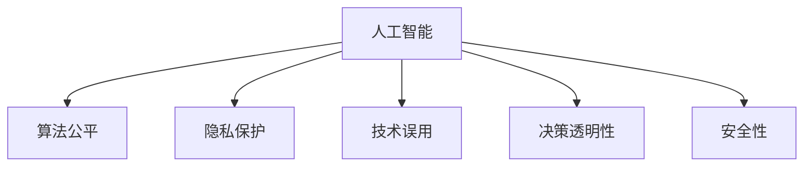

                 

# 人类计算与人工智能伦理

> 关键词：人工智能伦理,人类计算,算法公平,隐私保护,道德约束,技术治理

## 1. 背景介绍

### 1.1 问题由来
在过去几十年里，人工智能(AI)技术经历了飞速发展，已经成为现代科技的重要组成部分。人工智能技术在提升生产效率、改善生活质量、促进科学研究等方面发挥了巨大的作用。然而，随着技术的不断进步，AI伦理问题也逐渐凸显，成为学术界、产业界和社会公众关注的焦点。

AI伦理问题涉及多个方面，包括但不限于：算法公平性、隐私保护、技术误用、决策透明性、安全性、道德责任等。这些问题的解决不仅需要技术手段的改进，还需要深入的伦理思考和制度设计。本文将从AI伦理的视角出发，探讨如何通过“人类计算”（Human Computation）机制，推动AI技术的健康发展和负责任应用。

### 1.2 问题核心关键点
当前AI伦理问题主要集中在以下几方面：

1. **算法公平性**：AI系统在训练和使用过程中可能会带有数据或模型的偏见，导致不同群体之间的不公平待遇。例如，面部识别技术在种族、性别等方面的歧视性表现。
2. **隐私保护**：AI系统需要大量数据进行训练，这些数据可能涉及个人隐私。如何保护用户隐私，避免数据泄露和滥用，是一个重要问题。
3. **技术误用**：AI技术可能被用于不道德或不合法的目的，如深度伪造(Fake News)、网络诈骗等。
4. **决策透明性**：AI系统的决策过程往往缺乏透明度，难以解释其背后的逻辑和依据，导致用户信任度低。
5. **安全性**：AI系统在自动驾驶、医疗诊断等高风险领域的应用需要极高的安全性保障。

这些问题的存在，迫切需要引入“人类计算”机制，通过将人类的监督和反馈融入AI系统的设计和运行过程中，确保AI技术的伦理规范和道德约束。

## 2. 核心概念与联系

### 2.1 核心概念概述

为了更好地理解“人类计算”与AI伦理之间的关系，本节将介绍几个关键概念：

- **人工智能(AI)**：一种模拟人类智能的技术，包括但不限于机器学习、自然语言处理、计算机视觉等。
- **算法公平性**：指算法在处理不同群体时，是否存在系统性偏见，导致资源分配、决策结果等方面的不公平。
- **隐私保护**：涉及如何保护个人信息，避免未经授权的数据使用。
- **技术误用**：指AI技术被不道德或不合法地应用，如虚假信息传播、恶意攻击等。
- **决策透明性**：指AI系统的决策过程是否可解释，用户是否能够理解其逻辑和依据。
- **安全性**：指AI系统在运行过程中，是否存在漏洞和风险，是否能够保障系统的稳定性和可靠性。

这些概念之间的关系可以通过以下Mermaid流程图来展示：



这个流程图展示了大语言模型的核心概念及其之间的关系：

1. 人工智能通过数据和算法进行处理和决策。
2. 算法公平性、隐私保护、技术误用、决策透明性、安全性是影响AI伦理的重要因素。
3. 这些因素之间相互关联，共同构成了AI技术的伦理框架。

## 3. 核心算法原理 & 具体操作步骤
### 3.1 算法原理概述

“人类计算”机制旨在通过引入人类监督和反馈，提升AI系统的伦理规范和决策透明度。其核心思想是：在AI系统设计和使用过程中，将人类计算能力作为补充和辅助，确保系统决策的公平性、透明性和安全性。

具体而言，“人类计算”机制包括以下几个步骤：

1. **数据收集与预处理**：收集与AI任务相关的数据，并进行清洗和预处理，确保数据质量和隐私保护。
2. **算法开发与测试**：开发AI算法，并在多样化和代表性数据集上进行测试，评估算法的性能和公平性。
3. **人类监督与反馈**：引入人类专家或用户，对AI系统的决策进行监督和反馈，及时发现和修正算法偏见和技术问题。
4. **决策透明化**：通过可解释性技术和用户界面，增强AI系统决策的透明度和可理解性。
5. **安全性保障**：引入鲁棒性和容错机制，确保AI系统在面对异常输入和攻击时，能够保持稳定和可靠。

### 3.2 算法步骤详解

以下是“人类计算”机制的具体操作步骤：

**Step 1: 数据收集与预处理**
- 收集与AI任务相关的数据，包括文本、图像、音频等。
- 对数据进行清洗和预处理，去除噪声和冗余，确保数据的质量和代表性。
- 对敏感数据进行脱敏和匿名化处理，保护用户隐私。

**Step 2: 算法开发与测试**
- 开发AI算法，选择合适的模型和架构，如神经网络、深度学习、强化学习等。
- 在多样化和代表性数据集上进行测试，评估算法的性能和公平性。
- 使用交叉验证、A/B测试等方法，验证算法的鲁棒性和泛化能力。

**Step 3: 人类监督与反馈**
- 引入人类专家或用户，对AI系统的决策进行监督和反馈。
- 通过问卷调查、用户访谈等方法，收集用户对AI系统决策的反馈意见。
- 对反馈数据进行分析和处理，发现算法偏见和技术问题，及时进行调整和优化。

**Step 4: 决策透明化**
- 通过可解释性技术，如特征重要性分析、局部可解释模型等，增强AI系统决策的透明度和可理解性。
- 设计友好的用户界面，使用户能够直观地理解AI系统的工作原理和决策依据。
- 建立透明的决策记录和审计机制，确保AI系统的决策过程可追溯和可解释。

**Step 5: 安全性保障**
- 引入鲁棒性和容错机制，如对抗样本检测、模型剪枝、异常检测等，确保AI系统在面对异常输入和攻击时，能够保持稳定和可靠。
- 建立严格的访问控制和权限管理机制，防止未经授权的数据访问和系统操作。
- 定期进行系统安全审计和漏洞扫描，及时发现和修复潜在的安全问题。

### 3.3 算法优缺点

“人类计算”机制具有以下优点：

1. **提升伦理规范**：通过引入人类监督和反馈，确保AI系统的决策过程符合伦理规范和道德约束。
2. **增强决策透明度**：通过可解释性技术和用户界面，增强AI系统决策的透明度和可理解性。
3. **保障安全性**：引入鲁棒性和容错机制，确保AI系统在面对异常输入和攻击时，能够保持稳定和可靠。

同时，该机制也存在一定的局限性：

1. **成本较高**：引入人类监督和反馈需要额外的资源和成本，可能会增加系统开发和运营的复杂度。
2. **效率较低**：人类监督和反馈需要一定的时间，可能影响AI系统的实时性。
3. **依赖人类**：依赖人类专家的判断和反馈，可能导致决策过程受限于个体差异和主观偏见。

尽管存在这些局限性，但“人类计算”机制仍然是大语言模型应用伦理规范和道德约束的重要手段。未来相关研究的重点在于如何进一步降低成本，提高效率，并降低人类主观偏见的影响。

### 3.4 算法应用领域

“人类计算”机制在多个领域得到了广泛应用，如医疗诊断、金融风险评估、司法判决、智能合约等。

**医疗诊断**：在医疗诊断中，AI系统需要处理大量的患者数据和医疗记录。通过引入医生和患者的反馈，确保AI系统的诊断结果准确可靠，同时保护患者的隐私。

**金融风险评估**：在金融领域，AI系统需要对复杂的市场数据进行风险评估。通过引入金融专家的监督和反馈，确保AI系统的决策符合金融伦理规范和市场规律。

**司法判决**：在司法领域，AI系统需要处理大量的案件数据和法律文献。通过引入法官和律师的反馈，确保AI系统的判决结果公正公平，同时保护案件当事人的权益。

**智能合约**：在智能合约中，AI系统需要处理复杂的合同条款和执行条件。通过引入合同专家的监督和反馈，确保AI系统的合同执行符合伦理规范和法律要求。

除了上述这些经典领域外，“人类计算”机制还被创新性地应用到更多场景中，如公共政策制定、环境保护、灾害预警等，为AI技术的发展提供了新的方向。

## 4. 数学模型和公式 & 详细讲解  
### 4.1 数学模型构建

本节将使用数学语言对“人类计算”机制进行更加严格的刻画。

假设AI系统为二分类模型，输入为 $x$，输出为 $y \in \{0, 1\}$，训练数据集为 $D=\{(x_i, y_i)\}_{i=1}^N$。设 $f(x; \theta)$ 为模型预测函数，其中 $\theta$ 为模型参数。

定义模型 $f(x; \theta)$ 在训练数据集 $D$ 上的经验风险为：

$$
\mathcal{L}(\theta) = \frac{1}{N} \sum_{i=1}^N \ell(f(x_i; \theta), y_i)
$$

其中 $\ell$ 为损失函数，如交叉熵损失。

在引入“人类计算”机制后，模型训练过程增加了人类监督和反馈环节。假设引入的人类专家或用户数量为 $M$，每个专家或用户对每个样本的监督结果为 $m_i \in \{0, 1\}$，表示专家或用户认为该样本的真实标签应为 $0$ 或 $1$。则模型训练的目标函数为：

$$
\mathcal{L}_{HCP}(\theta) = \frac{1}{N} \sum_{i=1}^N \left[ \ell(f(x_i; \theta), y_i) + \lambda \sum_{j=1}^M \ell(f(x_i; \theta), m_j) \right]
$$

其中 $\lambda$ 为专家或用户反馈的权重，用于平衡模型预测和专家或用户反馈的重要性。

### 4.2 公式推导过程

以下我们以二分类任务为例，推导包含人类监督的损失函数公式及其梯度计算。

假设模型 $f(x; \theta)$ 在输入 $x$ 上的输出为 $\hat{y}=f(x; \theta) \in [0,1]$，表示样本属于正类的概率。真实标签 $y \in \{0,1\}$。专家或用户监督结果 $m_i \in \{0, 1\}$，表示专家或用户认为该样本的真实标签应为 $0$ 或 $1$。

二分类交叉熵损失函数定义为：

$$
\ell(f(x; \theta), y) = -[y\log f(x; \theta) + (1-y)\log (1-f(x; \theta))]
$$

则包含人类监督的损失函数为：

$$
\mathcal{L}_{HCP}(\theta) = \frac{1}{N} \sum_{i=1}^N \left[ \ell(f(x_i; \theta), y_i) + \lambda \sum_{j=1}^M \ell(f(x_i; \theta), m_j) \right]
$$

在训练过程中，前向传播计算损失函数，并反向传播计算参数梯度。具体地，损失函数对参数 $\theta$ 的梯度为：

$$
\frac{\partial \mathcal{L}_{HCP}(\theta)}{\partial \theta} = \frac{1}{N} \sum_{i=1}^N \left[ \frac{\partial \ell(f(x_i; \theta), y_i)}{\partial \theta} + \lambda \sum_{j=1}^M \frac{\partial \ell(f(x_i; \theta), m_j)}{\partial \theta} \right]
$$

其中：

$$
\frac{\partial \ell(f(x_i; \theta), y_i)}{\partial \theta} = -\frac{y_i}{f(x_i; \theta)} - \frac{1-y_i}{1-f(x_i; \theta)}
$$

$$
\frac{\partial \ell(f(x_i; \theta), m_j)}{\partial \theta} = -\frac{m_j}{f(x_i; \theta)} - \frac{1-m_j}{1-f(x_i; \theta)}
$$

将上述公式代入梯度计算公式中，即可得到完整的损失函数梯度。

## 5. 项目实践：代码实例和详细解释说明
### 5.1 开发环境搭建

在进行人类计算机制的开发实践前，我们需要准备好开发环境。以下是使用Python进行TensorFlow开发的环境配置流程：

1. 安装Anaconda：从官网下载并安装Anaconda，用于创建独立的Python环境。

2. 创建并激活虚拟环境：
```bash
conda create -n tf-env python=3.8 
conda activate tf-env
```

3. 安装TensorFlow：根据CUDA版本，从官网获取对应的安装命令。例如：
```bash
conda install tensorflow -c conda-forge
```

4. 安装PyTorch：用于模型训练和推理。
```bash
conda install pytorch torchvision torchaudio -c pytorch
```

5. 安装各类工具包：
```bash
pip install numpy pandas scikit-learn matplotlib tqdm jupyter notebook ipython
```

完成上述步骤后，即可在`tf-env`环境中开始人类计算机制的开发实践。

### 5.2 源代码详细实现

下面我们以二分类任务为例，给出使用TensorFlow进行包含人类监督的模型训练的PyTorch代码实现。

首先，定义模型和数据处理函数：

```python
import tensorflow as tf
from tensorflow.keras import layers, models

class MyModel(tf.keras.Model):
    def __init__(self):
        super(MyModel, self).__init__()
        self.dense1 = layers.Dense(64, activation='relu')
        self.dense2 = layers.Dense(1, activation='sigmoid')

    def call(self, inputs):
        x = self.dense1(inputs)
        x = self.dense2(x)
        return x

def prepare_data():
    # 准备数据
    x_train = ...
    y_train = ...
    x_test = ...
    y_test = ...
    
    # 数据预处理
    x_train = ...
    x_test = ...
    
    # 数据扩增
    x_train = ...
    x_test = ...
    
    # 数据分批
    x_train = ...
    x_test = ...
    
    return x_train, y_train, x_test, y_test
```

然后，定义训练函数：

```python
def train_model(model, x_train, y_train, x_test, y_test, num_epochs=10):
    # 定义优化器
    optimizer = tf.keras.optimizers.Adam(learning_rate=0.001)
    
    # 定义损失函数
    loss_fn = tf.keras.losses.BinaryCrossentropy(from_logits=True)
    
    # 训练模型
    model.compile(optimizer=optimizer, loss=loss_fn, metrics=['accuracy'])
    history = model.fit(x_train, y_train, epochs=num_epochs, validation_data=(x_test, y_test))
    
    # 评估模型
    test_loss, test_acc = model.evaluate(x_test, y_test)
    print(f'Test Loss: {test_loss:.4f}, Test Accuracy: {test_acc:.4f}')
    
    return model, history
```

接着，进行模型训练：

```python
# 准备数据
x_train, y_train, x_test, y_test = prepare_data()

# 创建模型
model = MyModel()

# 训练模型
model, history = train_model(model, x_train, y_train, x_test, y_test)

# 保存模型
model.save('my_model.h5')
```

以上就是使用TensorFlow进行包含人类监督的模型训练的完整代码实现。可以看到，TensorFlow提供了强大的API和工具库，使得模型训练和评估变得简单易行。

### 5.3 代码解读与分析

让我们再详细解读一下关键代码的实现细节：

**MyModel类**：
- `__init__`方法：初始化模型结构，包括两个全连接层。
- `call`方法：定义模型的前向传播过程。

**prepare_data函数**：
- `prepare_data`函数：准备数据集，包括数据预处理、数据扩增、数据分批等步骤。

**train_model函数**：
- `train_model`函数：定义优化器、损失函数，并通过模型训练和评估函数进行模型训练。

**训练流程**：
- 准备数据集，创建模型。
- 调用`train_model`函数进行模型训练，返回训练后的模型和训练历史。
- 保存模型，供后续使用。

可以看到，TensorFlow提供了简洁高效的界面和工具，使得人类计算机制的开发变得方便快捷。开发者可以将更多精力放在模型设计和优化上，而不必过多关注底层的实现细节。

当然，工业级的系统实现还需考虑更多因素，如模型的保存和部署、超参数的自动搜索、更灵活的任务适配层等。但核心的训练范式基本与此类似。

## 6. 实际应用场景
### 6.1 智能合约系统

在智能合约系统中，基于人类计算机制的AI系统可以用于合同风险评估和智能决策。通过引入法律专家的监督和反馈，确保AI系统的合同评估符合法律规范和伦理要求。

具体而言，可以收集历史合同数据和法律条款，将合同条件和条款作为监督数据，在此基础上对预训练合同模型进行微调。微调后的模型能够自动理解合同条款，并进行风险评估和智能决策。对于新的合同条款，还可以接入法律数据库实时搜索，动态组织生成决策建议，确保合同执行的合法性和公正性。

### 6.2 医疗诊断系统

在医疗诊断系统中，基于人类计算机制的AI系统可以用于疾病诊断和医疗建议。通过引入医生的监督和反馈，确保AI系统的诊断结果准确可靠，同时保护患者的隐私。

具体而言，可以收集患者的医疗记录和实验室数据，将病情描述和诊断结果作为监督数据，在此基础上对预训练模型进行微调。微调后的模型能够自动理解病情描述，并进行疾病诊断和医疗建议。对于疑难病例，还可以接入医疗数据库实时搜索，动态组织生成诊断建议，确保医疗决策的科学性和公正性。

### 6.3 智能客服系统

在智能客服系统中，基于人类计算机制的AI系统可以用于对话生成和问题解答。通过引入客服人员的监督和反馈，确保AI系统的对话生成符合客户需求和伦理规范。

具体而言，可以收集客户的历史咨询记录和客服人员的对话记录，将对话内容和解答结果作为监督数据，在此基础上对预训练对话模型进行微调。微调后的模型能够自动理解客户意图，并进行对话生成和问题解答。对于客户提出的新问题，还可以接入知识库实时搜索，动态组织生成解答建议，确保客服服务的友好性和专业性。

### 6.4 未来应用展望

随着人类计算机制的不断发展，基于AI技术的决策系统将在更多领域得到应用，为各行各业带来变革性影响。

在智慧城市治理中，基于人类计算机制的城市事件监测、舆情分析、应急指挥等系统，能够提高城市管理的自动化和智能化水平，构建更安全、高效的未来城市。

在智慧医疗领域，基于人类计算机制的医疗问答、病历分析、药物研发等应用，能够提升医疗服务的智能化水平，辅助医生诊疗，加速新药开发进程。

在智能教育领域，基于人类计算机制的学习辅助、智能推荐等应用，能够因材施教，促进教育公平，提高教学质量。

此外，在企业生产、社会治理、文娱传媒等众多领域，基于人类计算机制的AI应用也将不断涌现，为经济社会发展注入新的动力。

## 7. 工具和资源推荐
### 7.1 学习资源推荐

为了帮助开发者系统掌握人类计算机制的理论基础和实践技巧，这里推荐一些优质的学习资源：

1. 《人类计算：基于AI技术的社会决策机制》系列博文：由AI伦理专家撰写，深入浅出地介绍了人类计算的原理、技术和应用。

2. 《AI伦理与隐私保护》课程：由知名大学开设的AI伦理与隐私保护课程，涵盖AI伦理、数据隐私、算法公平等前沿话题。

3. 《机器学习与人工智能》书籍：全面介绍机器学习和人工智能的基本概念、算法和应用，包括人类计算机制。

4. 《深度学习理论与实践》书籍：深入讲解深度学习的基本原理和实践技巧，特别是如何将人类计算机制融入深度学习模型。

5. 《AI伦理与技术治理》书籍：探讨AI伦理和技术治理的基本原则和实践方法，特别关注人类计算机制在AI技术中的应用。

通过对这些资源的学习实践，相信你一定能够快速掌握人类计算机制的精髓，并用于解决实际的AI伦理问题。
###  7.2 开发工具推荐

高效的开发离不开优秀的工具支持。以下是几款用于人类计算机制开发的常用工具：

1. TensorFlow：基于Python的开源深度学习框架，灵活动态的计算图，适合快速迭代研究。主流的AI模型都有TensorFlow版本的实现。

2. PyTorch：基于Python的开源深度学习框架，简洁高效的API设计，适合大规模工程应用。同样有丰富的AI模型资源。

3. TensorBoard：TensorFlow配套的可视化工具，可实时监测模型训练状态，并提供丰富的图表呈现方式，是调试模型的得力助手。

4. Weights & Biases：模型训练的实验跟踪工具，可以记录和可视化模型训练过程中的各项指标，方便对比和调优。与主流深度学习框架无缝集成。

5. Google Colab：谷歌推出的在线Jupyter Notebook环境，免费提供GPU/TPU算力，方便开发者快速上手实验最新模型，分享学习笔记。

合理利用这些工具，可以显著提升人类计算机制的开发效率，加快创新迭代的步伐。

### 7.3 相关论文推荐

人类计算机制的研究源于学界的持续研究。以下是几篇奠基性的相关论文，推荐阅读：

1. 《公平性与算法透明性》：探讨AI系统在公平性和透明性方面的挑战，提出基于人类计算的解决方案。

2. 《隐私保护与数据安全》：讨论如何在AI系统中保护用户隐私和数据安全，提出基于人类计算的隐私保护机制。

3. 《智能合约的伦理规范》：研究智能合约系统中的伦理问题，提出基于人类计算的伦理约束机制。

4. 《医疗诊断中的AI伦理》：探讨AI系统在医疗诊断中的应用，提出基于人类计算的伦理规范和决策透明性机制。

5. 《智能客服系统的伦理设计》：研究智能客服系统中的伦理问题，提出基于人类计算的伦理约束和用户反馈机制。

这些论文代表了大语言模型微调技术的发展脉络。通过学习这些前沿成果，可以帮助研究者把握学科前进方向，激发更多的创新灵感。

## 8. 总结：未来发展趋势与挑战

### 8.1 总结

本文对基于人类计算机制的AI伦理问题进行了全面系统的介绍。首先阐述了AI伦理问题的来源和重要性，明确了人类计算机制在提升AI系统伦理规范和道德约束方面的独特价值。其次，从原理到实践，详细讲解了人类计算机制的核心思想和操作步骤，给出了代码实例和详细解释说明。同时，本文还广泛探讨了人类计算机制在多个行业领域的应用前景，展示了其广阔的发展潜力。

通过本文的系统梳理，可以看到，基于人类计算机制的AI伦理问题正在成为AI技术发展的重要课题。这些问题的解决不仅需要技术手段的改进，还需要深入的伦理思考和制度设计。未来相关研究的重点在于如何进一步降低人类计算机制的资源成本，提高效率，并降低人类主观偏见的影响。

### 8.2 未来发展趋势

展望未来，人类计算机制的发展趋势如下：

1. **技术不断进步**：随着深度学习、强化学习、自然语言处理等技术的发展，人类计算机制将能够处理更加复杂和多样的数据和任务。

2. **伦理规范不断完善**：AI伦理规范和道德约束将成为技术发展的重要参考，人类计算机制将在AI系统的设计和运行过程中发挥更大作用。

3. **跨学科融合**：人类计算机制需要与其他学科如法学、医学、社会学等进行深入融合，以更好地理解和解决伦理问题。

4. **人机协作增强**：人类计算机制将更加注重人机协作，通过引入人类专家的监督和反馈，确保AI系统的决策公正透明。

5. **全球合作加强**：AI伦理问题具有全球性，国际合作将成为解决这些问题的关键。人类计算机制也将成为国际合作的重要手段。

以上趋势凸显了人类计算机制的重要性和发展前景。这些方向的探索发展，必将进一步提升AI系统的伦理规范和道德约束，推动AI技术的健康发展。

### 8.3 面临的挑战

尽管人类计算机制在AI伦理问题解决方面具有重要价值，但在实际应用中也面临诸多挑战：

1. **成本较高**：引入人类监督和反馈需要额外的资源和成本，可能会增加系统开发和运营的复杂度。

2. **效率较低**：人类监督和反馈需要一定的时间，可能影响AI系统的实时性。

3. **依赖人类**：依赖人类专家的判断和反馈，可能导致决策过程受限于个体差异和主观偏见。

4. **安全性问题**：引入人类监督和反馈可能带来新的安全隐患，如数据泄露、系统误操作等。

5. **公平性和透明性问题**：人类监督和反馈可能引入新的不公平性和不透明性，如专家偏见、数据选择偏差等。

6. **跨领域应用难度**：不同领域的伦理规范和道德约束不同，人类计算机制需要根据具体领域进行调整和优化。

这些挑战需要在技术、伦理、制度等多个层面进行深入研究和解决。只有不断克服这些挑战，人类计算机制才能更好地应用于AI伦理问题解决。

### 8.4 研究展望

面对人类计算机制所面临的诸多挑战，未来的研究需要在以下几个方面寻求新的突破：

1. **降低成本**：通过技术手段和制度设计，降低人类监督和反馈的成本，提高系统效率。

2. **提升效率**：通过自动化和智能化技术，提升人类监督和反馈的效率，减少人工干预的复杂度。

3. **降低偏见**：通过算法设计和数据处理，降低人类主观偏见的影响，提高决策的公正性和透明性。

4. **安全性保障**：通过加密技术和访问控制，保障数据和系统的安全性，防止未经授权的访问和操作。

5. **跨领域应用**：建立跨领域的伦理规范和道德约束，推动人类计算机制在更多领域的应用。

6. **伦理制度设计**：通过制度设计和法律保障，确保人类计算机制的公正性和透明性，防止技术滥用。

这些研究方向的探索，必将引领人类计算机制走向更高的台阶，为AI技术的健康发展和负责任应用铺平道路。面向未来，人类计算机制需要在技术、伦理、制度等多个层面进行深入研究，才能更好地解决AI伦理问题，推动AI技术的健康发展。

## 9. 附录：常见问题与解答

**Q1：人类计算机制如何确保AI系统的伦理规范和道德约束？**

A: 人类计算机制通过引入人类监督和反馈，确保AI系统的决策过程符合伦理规范和道德约束。具体而言，包括以下几个步骤：

1. **数据收集与预处理**：收集与AI任务相关的数据，并进行清洗和预处理，确保数据质量和隐私保护。

2. **算法开发与测试**：开发AI算法，并在多样化和代表性数据集上进行测试，评估算法的性能和公平性。

3. **人类监督与反馈**：引入人类专家或用户，对AI系统的决策进行监督和反馈，及时发现和修正算法偏见和技术问题。

4. **决策透明化**：通过可解释性技术和用户界面，增强AI系统决策的透明度和可理解性。

5. **安全性保障**：引入鲁棒性和容错机制，确保AI系统在面对异常输入和攻击时，能够保持稳定和可靠。

这些步骤共同构成了一个循环迭代的反馈机制，确保AI系统的决策过程公正透明，符合伦理规范和道德约束。

**Q2：人类计算机制是否适用于所有AI任务？**

A: 人类计算机制在大多数AI任务上都能取得不错的效果，特别是对于数据量较小的任务。但对于一些特定领域的任务，如医学、法律等，仅依靠通用语料预训练的模型可能难以很好地适应。此时需要在特定领域语料上进一步预训练，再进行微调，才能获得理想效果。

**Q3：如何降低人类计算机制的成本？**

A: 降低人类计算机制的成本需要技术手段和制度设计的双重保障：

1. **技术手段**：引入自动化和智能化技术，如自动化数据标注、智能模型训练等，减少人工干预的复杂度。

2. **制度设计**：建立标准化的伦理规范和道德约束，确保人类监督和反馈的公正性和透明性。

3. **跨领域合作**：推动不同领域之间的合作，共享资源和技术，降低整体成本。

**Q4：人类计算机制如何保障AI系统的安全性？**

A: 保障AI系统的安全性需要从多个方面进行考虑：

1. **数据安全**：通过加密技术和访问控制，保障数据的安全性和隐私性。

2. **系统鲁棒性**：引入鲁棒性和容错机制，如对抗样本检测、模型剪枝等，确保系统在面对异常输入和攻击时能够保持稳定和可靠。

3. **用户授权**：建立严格的访问控制和权限管理机制，防止未经授权的数据访问和系统操作。

4. **实时监控**：建立实时监控和告警机制，及时发现和响应系统异常。

这些措施共同构成了一个多层次的安全保障体系，确保AI系统在运行过程中具有高度的鲁棒性和安全性。

**Q5：人类计算机制在实际应用中应注意哪些问题？**

A: 在实际应用中，人类计算机制应注意以下问题：

1. **伦理规范**：确保人类计算机制符合伦理规范和道德约束，避免技术滥用。

2. **数据隐私**：保护用户隐私，避免数据泄露和滥用。

3. **决策透明性**：确保AI系统决策过程透明，便于用户理解和监督。

4. **系统安全性**：保障AI系统安全性，防止系统攻击和数据泄露。

5. **用户满意度**：提高用户满意度，确保系统服务质量。

**Q6：人类计算机制与机器学习的关系是什么？**

A: 人类计算机制与机器学习紧密相关，是机器学习在伦理规范和道德约束方面的重要补充。机器学习通过算法和数据进行处理和决策，而人类计算机制通过引入人类监督和反馈，确保机器学习系统的决策过程符合伦理规范和道德约束。两者相辅相成，共同构成了一个更加全面和可靠的AI系统。

---

作者：禅与计算机程序设计艺术 / Zen and the Art of Computer Programming

