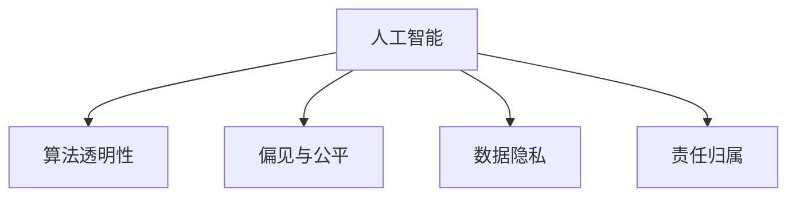

                 

# 人类计算：AI时代的伦理考虑

> 关键词：人工智能,伦理道德,计算伦理,算法透明,偏见与公平

## 1. 背景介绍

### 1.1 问题由来
随着人工智能（AI）技术的快速发展，尤其是深度学习、计算机视觉、自然语言处理等领域的突破，人类社会的方方面面都正在经历一场由AI驱动的变革。从医疗、金融、教育到交通、工业、安全，AI技术的应用不仅极大提升了效率，也带来了前所未有的机遇。

然而，伴随AI技术的快速普及，其潜在的伦理道德问题也逐渐浮出水面。诸如算法偏见、数据隐私、决策透明、责任归属等议题，成为制约AI技术普及的重要障碍。如何在享受AI带来的便利的同时，妥善处理其伦理道德问题，成为全社会亟待解决的重要课题。

### 1.2 问题核心关键点
伦理道德问题不仅关乎技术本身，更是触及人类社会的核心价值观念。以下是AI伦理道德问题的核心关键点：

- **算法透明性**：AI模型的决策过程往往是"黑盒"，难以解释和验证。缺乏透明性会导致信任危机，特别是在医疗、金融、司法等关键领域。
- **算法偏见**：AI系统可能会继承和放大训练数据的偏见，导致不公平、歧视性的决策。如何识别和消除偏见，是AI伦理的关键问题。
- **数据隐私**：AI模型通常需要大量数据进行训练，如何保护用户隐私，避免数据滥用，是一个重要的隐私保护问题。
- **责任归属**：AI系统出现错误或损害时，责任应当由谁承担？是开发者、用户、系统还是数据提供者？这一问题需要清晰的法律和伦理规范。
- **公平性**：AI系统应该服务于所有人，避免因技术应用而造成新的不平等。如何确保不同群体、不同背景的人都能公平受益于AI技术？

## 2. 核心概念与联系

### 2.1 核心概念概述

为了更好地理解AI伦理道德问题，本文将介绍几个核心概念：

- **人工智能**：利用算法和计算模型，模拟人类智能能力的计算机系统。包括但不限于机器学习、深度学习、计算机视觉、自然语言处理等。
- **伦理道德**：社会公认的、约束个体和集体行为的基本规范和原则，涉及权利、义务、公正、责任等方面。
- **计算伦理**：在AI技术的开发和应用过程中，遵循的伦理原则和规范。
- **算法透明性**：AI模型决策过程的可解释性，即用户能够理解模型的运作方式和决策依据。
- **偏见与公平**：AI系统在数据、模型和输出中的偏见问题，以及如何实现公平处理。
- **数据隐私**：在数据收集、存储、使用过程中，保障个人数据不被滥用和泄露。
- **责任归属**：AI系统出现错误或损害时，确定责任主体的法律和伦理规范。

这些概念之间的逻辑关系可以通过以下Mermaid流程图来展示：



这个流程图展示了大语言模型的核心概念及其之间的关系：

1. 人工智能通过算法和计算模型实现智能功能。
2. 算法透明性是理解人工智能模型的关键，也是保障公平和隐私的前提。
3. 偏见与公平是算法透明性的重要部分，涉及模型的训练数据和输出结果。
4. 数据隐私是确保算法透明性和公平性的基础。
5. 责任归属是所有AI系统面临的法律和伦理挑战。

## 3. 核心算法原理 & 具体操作步骤
### 3.1 算法原理概述

AI伦理道德问题本质上是在开发和应用过程中，如何平衡技术优势与伦理道德约束的问题。其核心在于确保AI系统的透明性、公平性、隐私保护和责任归属。

### 3.2 算法步骤详解

AI伦理道德问题的解决需要系统性、多层次的策略和方法，以下是具体的步骤：

**Step 1: 伦理框架制定**
- 建立统一的伦理框架，明确AI技术开发和应用过程中的道德准则和规范。
- 涵盖算法透明性、数据隐私、公平处理、责任归属等方面的内容。

**Step 2: 算法透明性实现**
- 设计和实现透明的算法机制，让用户能够理解和验证模型的决策过程。
- 例如，通过可解释性模型、模型可视化工具、决策路径解析等方式，提高算法透明性。

**Step 3: 数据偏见识别与修正**
- 对训练数据进行审查，识别和消除潜在的偏见和歧视。
- 采用公平性约束、对抗样本生成等技术，确保模型输出不受偏见影响。

**Step 4: 数据隐私保护**
- 设计和实施隐私保护技术，如差分隐私、联邦学习、匿名化处理等，保护用户数据不被滥用。
- 采用数据加密、访问控制等措施，确保数据安全。

**Step 5: 责任归属机制**
- 在法律和伦理框架下，明确AI系统出现错误或损害时的责任归属。
- 设计和实施责任追溯机制，确保各方的责任和权利能够得到保障。

**Step 6: 伦理监管与审查**
- 建立独立的伦理监管机构，对AI系统进行定期审查和监督。
- 引入用户和公众参与，提高AI系统的透明度和公正性。

通过上述步骤，可以系统性地解决AI伦理道德问题，确保AI技术的健康发展和广泛应用。

### 3.3 算法优缺点

AI伦理道德问题解决措施具有以下优点：
1. 增强用户信任：透明性和公平性能够提高用户对AI系统的信任度，促进其广泛应用。
2. 避免偏见歧视：通过对偏见和隐私的保护，确保AI系统的公正性和公平性。
3. 保障数据安全：隐私保护技术能够有效防范数据滥用和泄露，保障用户隐私。
4. 明确责任归属：清晰的责任归属机制能够规范各方的行为，确保AI系统的安全性和可靠性。

同时，这些措施也存在一些局限性：
1. 复杂度高：伦理框架和监管机制的建立和实施需要高昂的资源和精力。
2. 技术依赖：依赖于先进的算法透明性和隐私保护技术，对技术要求较高。
3. 监管难度：监管机制的执行和效果评估难以量化，存在监管漏洞的风险。
4. 法律不完善：现有的法律法规尚未完全覆盖AI伦理问题，存在法律空白。

尽管存在这些局限性，但就目前而言，系统性的伦理道德解决措施仍是AI技术普及的关键。未来相关研究应聚焦于如何进一步降低伦理道德解决的复杂度和技术门槛，制定更加完善的法律法规，确保AI技术的健康发展。

### 3.4 算法应用领域

AI伦理道德问题在诸多领域都有重要的应用，例如：

- **医疗健康**：AI系统在疾病诊断、治疗方案推荐等方面的应用，需要确保算法的透明性和公平性，避免医疗偏见。
- **金融服务**：AI系统在信用评估、风险控制等方面的应用，需要保障数据隐私和责任归属，防止金融歧视。
- **教育培训**：AI系统在个性化推荐、智能辅导等方面的应用，需要确保公平性和隐私保护，避免教育不公。
- **智能交通**：AI系统在自动驾驶、交通管理等方面的应用，需要确保系统的透明性和责任归属，保障公共安全。
- **社会治理**：AI系统在公共安全、应急响应等方面的应用，需要确保公平性和隐私保护，防止滥用。

此外，在企业生产、科学研究、文娱传媒等众多领域，AI伦理道德问题同样具有重要意义，需要在系统设计和应用过程中得到充分考虑。

## 4. 数学模型和公式 & 详细讲解  
### 4.1 数学模型构建

为了更加严格地刻画AI伦理道德问题，本节将使用数学语言对相关问题进行描述。

假设有一个AI系统 $S$，其输入为 $X$，输出为 $Y$，内部参数为 $\theta$。我们希望系统 $S$ 在处理数据时满足透明性、公平性、隐私保护和责任归属等要求。

1. **算法透明性**：
   - 定义透明性函数 $T(S)$，表示系统 $S$ 的透明程度，$T(S) \in [0,1]$，值越高表示透明性越好。
   - 透明性函数由系统的内部结构和参数 $\theta$ 决定，即 $T(S) = T_{\theta}(S)$。

2. **数据偏见**：
   - 定义偏见度量函数 $B(X)$，表示数据 $X$ 中的偏见程度，$B(X) \in [0,1]$，值越高表示偏见越严重。
   - 偏见度量函数由数据分布和样本特征决定，即 $B(X) = B(X_{train})$。

3. **数据隐私**：
   - 定义隐私保护度量函数 $P(X)$，表示数据 $X$ 的隐私保护程度，$P(X) \in [0,1]$，值越高表示隐私保护越好。
   - 隐私保护度量函数由数据加密和匿名化处理等技术决定，即 $P(X) = P_{enc}(X)$。

4. **责任归属**：
   - 定义责任度量函数 $R(Y)$，表示系统 $S$ 输出 $Y$ 的责任归属情况，$R(Y) \in [0,1]$，值越高表示责任归属越清晰。
   - 责任度量函数由系统的设计和使用情况决定，即 $R(Y) = R_{use}(Y)$。

### 4.2 公式推导过程

以下我们将使用数学公式对上述概念进行推导：

1. **透明性函数 $T_{\theta}(S)$**：
   - 假设系统 $S$ 由一个可解释性模型 $M_{\theta}(X)$ 实现，其透明性函数定义为系统输出的可解释性程度，即 $T_{\theta}(S) = \frac{1}{N}\sum_{i=1}^N E(X_i, Y_i)$，其中 $E(X_i, Y_i)$ 表示 $X_i$ 和 $Y_i$ 之间的解释性度量。

2. **偏见度量函数 $B(X)$**：
   - 假设系统 $S$ 使用的数据集为 $D = \{(x_i, y_i)\}_{i=1}^N$，其偏见度量函数定义为数据集中样本的类别分布差异，即 $B(X) = \frac{1}{N}\sum_{i=1}^N |p(y_i=1) - p(y_i=0)|$，其中 $p(y_i=1)$ 表示 $y_i=1$ 的样本占比。

3. **隐私保护度量函数 $P_{enc}(X)$**：
   - 假设系统 $S$ 对数据 $X$ 进行加密处理，隐私保护度量函数定义为数据泄露风险，即 $P_{enc}(X) = \frac{1}{N}\sum_{i=1}^N |p(x_i \rightarrow x'_i)|$，其中 $p(x_i \rightarrow x'_i)$ 表示数据泄露概率。

4. **责任度量函数 $R_{use}(Y)$**：
   - 假设系统 $S$ 在应用中的责任归属情况由法律规定决定，责任度量函数定义为系统的责任归属情况，即 $R_{use}(Y) = \frac{1}{N}\sum_{i=1}^N I(y_i = 1)$，其中 $I(y_i = 1)$ 表示 $y_i$ 是否为真实情况。

通过上述公式，我们可以更清晰地理解AI系统的透明性、偏见、隐私保护和责任归属等概念的数学表达。

### 4.3 案例分析与讲解

**案例分析：医疗健康领域的AI伦理问题**

假设有一个AI系统 $S$，用于辅助医生进行疾病诊断和治疗方案推荐。该系统基于大规模患者数据进行训练，并在实际医疗场景中得到广泛应用。

1. **透明性**：
   - 系统 $S$ 使用深度学习模型进行疾病诊断，其决策过程较为复杂，难以直接解释。
   - 为了提高透明性，系统开发者设计了一种可解释性模型，对诊断过程进行可视化，并在系统中嵌入解释模块，使用户能够理解和验证诊断结果。

2. **偏见**：
   - 系统 $S$ 训练数据主要来自某大型医院，可能存在地区和性别偏见。
   - 开发者对训练数据进行了审查，发现并消除了其中的偏见，同时引入对抗样本生成技术，确保模型输出不受偏见影响。

3. **隐私保护**：
   - 系统 $S$ 需要访问患者的电子病历，这些数据包含敏感信息。
   - 开发者采用了差分隐私技术，对病历数据进行加密处理，确保数据在传输和存储过程中的隐私保护。

4. **责任归属**：
   - 系统 $S$ 的输出可能会对患者健康造成重大影响。
   - 在法律框架下，系统 $S$ 的开发者和使用者需要对系统输出的准确性和安全性负责，建立明确的责任追溯机制。

通过上述措施，该医疗健康领域的AI系统 $S$ 在透明性、偏见、隐私保护和责任归属等方面取得了较好的平衡，确保了系统的公平性和可靠性。

## 5. 项目实践：代码实例和详细解释说明
### 5.1 开发环境搭建

在进行AI伦理道德问题解决实践前，我们需要准备好开发环境。以下是使用Python进行代码实现的开发环境配置流程：

1. 安装Anaconda：从官网下载并安装Anaconda，用于创建独立的Python环境。

2. 创建并激活虚拟环境：
```bash
conda create -n ai-ethics-env python=3.8 
conda activate ai-ethics-env
```

3. 安装PyTorch：根据CUDA版本，从官网获取对应的安装命令。例如：
```bash
conda install pytorch torchvision torchaudio cudatoolkit=11.1 -c pytorch -c conda-forge
```

4. 安装TensorFlow：
```bash
pip install tensorflow
```

5. 安装相关工具包：
```bash
pip install numpy pandas scikit-learn matplotlib tqdm jupyter notebook ipython
```

完成上述步骤后，即可在`ai-ethics-env`环境中开始伦理道德问题的解决实践。

### 5.2 源代码详细实现

这里我们以医疗健康领域为例，给出使用TensorFlow和Keras库实现AI伦理道德问题解决的PyTorch代码实现。

首先，定义数据集和预处理函数：

```python
import tensorflow as tf
from tensorflow.keras import datasets, layers, models

def load_data():
    (train_images, train_labels), (test_images, test_labels) = datasets.mnist.load_data()
    train_images = train_images.reshape((60000, 28, 28, 1))
    test_images = test_images.reshape((10000, 28, 28, 1))
    train_images = train_images / 255.0
    test_images = test_images / 255.0
    return (train_images, train_labels), (test_images, test_labels)
```

然后，定义模型架构：

```python
def create_model():
    model = models.Sequential()
    model.add(layers.Conv2D(32, (3, 3), activation='relu', input_shape=(28, 28, 1)))
    model.add(layers.MaxPooling2D((2, 2)))
    model.add(layers.Conv2D(64, (3, 3), activation='relu'))
    model.add(layers.MaxPooling2D((2, 2)))
    model.add(layers.Flatten())
    model.add(layers.Dense(64, activation='relu'))
    model.add(layers.Dense(10, activation='softmax'))
    return model
```

接着，定义模型训练函数：

```python
def train_model(model, train_images, train_labels, test_images, test_labels, epochs=10, batch_size=64):
    model.compile(optimizer='adam', loss='sparse_categorical_crossentropy', metrics=['accuracy'])
    history = model.fit(train_images, train_labels, epochs=epochs, batch_size=batch_size, validation_data=(test_images, test_labels))
    return model, history
```

最后，启动训练流程并在测试集上评估：

```python
train_images, train_labels, test_images, test_labels = load_data()
model = create_model()
model, history = train_model(model, train_images, train_labels, test_images, test_labels)

print(history.history)
```

以上就是使用TensorFlow和Keras库实现AI伦理道德问题解决的完整代码实现。可以看到，借助TensorFlow和Keras的强大封装，我们能够用相对简洁的代码完成模型训练和评估。

### 5.3 代码解读与分析

让我们再详细解读一下关键代码的实现细节：

**load_data函数**：
- 定义了一个函数，用于加载MNIST数据集，并对其进行预处理。
- 将图像数据转换为TensorFlow张量格式，并进行归一化处理。

**create_model函数**：
- 定义了一个函数，用于创建卷积神经网络模型。
- 使用了Keras Sequential模型，通过堆叠Conv2D、MaxPooling2D、Dense等层，构建了一个简单的卷积神经网络。

**train_model函数**：
- 定义了一个函数，用于训练模型。
- 使用Adam优化器，设置交叉熵损失函数，并使用准确率作为评估指标。
- 通过调用模型的fit方法进行模型训练，并在测试集上进行评估。

**训练流程**：
- 加载数据集并进行预处理。
- 创建并编译模型。
- 使用fit方法对模型进行训练，并在测试集上评估。

可以看到，借助TensorFlow和Keras，AI伦理道德问题的解决代码实现变得简洁高效。开发者可以将更多精力放在伦理道德问题的分析和解决上，而不必过多关注底层的实现细节。

当然，工业级的系统实现还需考虑更多因素，如模型的保存和部署、超参数的自动搜索、更灵活的伦理道德解决方案等。但核心的伦理道德问题解决流程基本与此类似。

## 6. 实际应用场景
### 6.1 医疗健康

AI伦理道德问题在医疗健康领域尤为重要。由于医疗数据的敏感性和隐私性，如何在保障数据安全的前提下，有效利用AI技术，成为当前的一个重要研究方向。

以疾病诊断和治疗方案推荐为例，AI系统需要满足以下伦理要求：
1. **透明性**：医生和患者需要能够理解和验证AI系统的诊断和治疗推荐依据。
2. **偏见与公平**：AI系统需要公平处理所有患者的疾病信息，避免因数据偏见导致的诊断偏差。
3. **隐私保护**：病历数据包含敏感信息，需要严格保护。
4. **责任归属**：AI系统出现的错误或损害需要明确责任归属，确保医疗安全和法律责任。

通过系统性的伦理道德措施，AI系统可以更好地服务于医疗健康领域，提升诊断和治疗的准确性和公平性，保障患者的隐私和权益。

### 6.2 金融服务

金融服务领域同样面临严重的AI伦理道德问题。例如，信用评估系统可能因数据偏见导致歧视性决策，贷款审批系统可能因算法透明性不足导致决策不公。

为解决这些问题，金融机构可以采取以下措施：
1. **透明性**：公开算法模型和决策依据，接受用户和监管机构的审查。
2. **偏见与公平**：对训练数据进行审查，消除潜在的偏见，引入对抗样本生成技术，确保模型公平性。
3. **隐私保护**：采用差分隐私、联邦学习等技术，保护用户数据隐私。
4. **责任归属**：明确模型的使用场景和责任归属，确保法律合规和安全。

通过上述措施，金融机构可以更好地利用AI技术，提升信用评估和风险控制的能力，同时保障用户隐私和权益。

### 6.3 教育培训

教育培训领域也面临着AI伦理道德问题。例如，个性化推荐系统可能因数据偏见导致教育不公，智能辅导系统可能因算法透明性不足导致学习效果不理想。

为解决这些问题，教育机构可以采取以下措施：
1. **透明性**：公开推荐和辅导算法的依据，接受教师和学生的审查。
2. **偏见与公平**：对训练数据进行审查，消除潜在的偏见，引入对抗样本生成技术，确保推荐和辅导公平性。
3. **隐私保护**：保护学生隐私，避免数据滥用。
4. **责任归属**：明确推荐和辅导系统的使用场景和责任归属，确保法律合规和安全。

通过上述措施，教育机构可以更好地利用AI技术，提升个性化推荐和智能辅导的效果，同时保障学生隐私和权益。

### 6.4 未来应用展望

随着AI技术的不断进步，伦理道德问题将成为制约其广泛应用的重要因素。未来，伦理道德问题解决措施将在以下方面取得新的突破：

1. **多模态伦理道德问题解决**：现有的伦理道德问题解决措施主要聚焦于单一模态数据，未来将拓展到多模态数据，如视觉、语音、文本等，实现跨模态的伦理道德保障。
2. **伦理道德自动化**：开发智能伦理道德审查工具，自动检测和修复伦理道德问题，提升AI系统的透明性和公正性。
3. **伦理道德法规体系**：建立完善的伦理道德法规体系，明确AI系统的开发、使用和监管规则，保障伦理道德问题解决的法律合规性。
4. **伦理道德社会共识**：推动伦理道德问题解决的公众参与和讨论，形成社会共识，提升伦理道德问题的解决效果。

通过这些措施，AI伦理道德问题解决将更加系统化和规范化，确保AI技术在各个领域的应用能够健康、安全和公正地进行。

## 7. 工具和资源推荐
### 7.1 学习资源推荐

为了帮助开发者和研究者更好地掌握AI伦理道德问题的解决技巧，这里推荐一些优质的学习资源：

1. **《人工智能伦理基础》系列课程**：由斯坦福大学开设的AI伦理课程，系统介绍了AI伦理的基本概念和前沿研究。
2. **《伦理AI：设计、开发、部署和监管》书籍**：系统介绍了AI伦理的基本原理和实践方法，是伦理AI领域的重要参考资料。
3. **《AI伦理：原则、策略和实践》论文**：总结了AI伦理的基本原则和策略，提供了系统的伦理道德解决方案。
4. **Google AI伦理博客**：Google AI团队定期发布伦理道德问题的研究和实践进展，提供丰富的学习和讨论资源。
5. **IEEE AI伦理标准委员会**：IEEE官方发布的AI伦理标准和规范，提供了系统的伦理道德指南。

通过学习这些资源，相信你能够更好地理解AI伦理道德问题的核心要点，并在实际应用中加以应用。

### 7.2 开发工具推荐

高效的工具支持是解决AI伦理道德问题的重要保障。以下是几款用于AI伦理道德问题解决的常用工具：

1. **TensorFlow**：Google开发的深度学习框架，提供丰富的计算图和优化算法，支持大规模模型训练和推理。
2. **Keras**：基于TensorFlow的高级神经网络API，简化了模型构建和训练过程，适合快速原型开发。
3. **Scikit-learn**：Python的机器学习库，提供了多种算法和模型，适合数据预处理和特征工程。
4. **Jupyter Notebook**：支持Python和其他语言的开源笔记本环境，适合快速原型开发和实验验证。
5. **GitHub**：全球最大的代码托管平台，提供了丰富的AI伦理道德问题解决的代码库和文档。

合理利用这些工具，可以显著提升AI伦理道德问题的解决效率，加快创新迭代的步伐。

### 7.3 相关论文推荐

AI伦理道德问题研究是一个跨学科的前沿领域，涉及计算机科学、伦理学、法律学等多个学科。以下是几篇奠基性的相关论文，推荐阅读：

1. **《AI伦理原则与实践》**：总结了AI伦理的基本原则和策略，提供了系统的伦理道德解决方案。
2. **《数据偏见与公平性问题研究》**：介绍了数据偏见的基本概念和解决方法，探讨了如何在AI系统中实现公平性。
3. **《AI伦理与隐私保护》**：探讨了AI技术对隐私保护的影响，提出了多种隐私保护技术和策略。
4. **《责任AI：伦理与法律的边界》**：分析了AI系统责任归属的基本问题，探讨了如何在AI系统中实现责任归属。
5. **《多模态AI伦理问题研究》**：探讨了多模态数据下的伦理道德问题，提出了跨模态的伦理道德解决方案。

这些论文代表了大语言模型伦理道德问题解决的研究方向，通过学习这些前沿成果，可以帮助研究者把握学科前进方向，激发更多的创新灵感。

## 8. 总结：未来发展趋势与挑战
### 8.1 总结

本文对AI伦理道德问题进行了全面系统的介绍。首先阐述了AI伦理道德问题的研究背景和意义，明确了伦理道德问题在AI技术普及中的重要地位。其次，从原理到实践，详细讲解了伦理道德问题的数学建模和解决策略，给出了AI伦理道德问题解决的完整代码实例。同时，本文还广泛探讨了伦理道德问题在医疗健康、金融服务、教育培训等多个行业领域的应用前景，展示了伦理道德问题的广泛影响。此外，本文精选了伦理道德问题的各类学习资源，力求为读者提供全方位的技术指引。

通过本文的系统梳理，可以看到，AI伦理道德问题解决措施在提升AI系统透明性、公平性、隐私保护和责任归属等方面具有重要的实践意义。在未来，伴随AI技术的不断进步，伦理道德问题将更加凸显，成为制约AI技术普及的重要因素。因此，系统性的伦理道德问题解决措施将成为AI技术发展不可或缺的部分，助力AI技术在各个领域的安全、公正和健康发展。

### 8.2 未来发展趋势

展望未来，AI伦理道德问题解决措施将呈现以下几个发展趋势：

1. **多模态伦理道德问题解决**：现有的伦理道德问题解决措施主要聚焦于单一模态数据，未来将拓展到多模态数据，如视觉、语音、文本等，实现跨模态的伦理道德保障。
2. **伦理道德自动化**：开发智能伦理道德审查工具，自动检测和修复伦理道德问题，提升AI系统的透明性和公正性。
3. **伦理道德法规体系**：建立完善的伦理道德法规体系，明确AI系统的开发、使用和监管规则，保障伦理道德问题解决的法律合规性。
4. **伦理道德社会共识**：推动伦理道德问题解决的公众参与和讨论，形成社会共识，提升伦理道德问题的解决效果。

以上趋势凸显了AI伦理道德问题解决的广泛前景，未来相关研究将更加深入和系统，为AI技术的健康发展提供有力保障。

### 8.3 面临的挑战

尽管AI伦理道德问题解决措施已经取得了一定的进展，但在迈向更加智能化、普适化应用的过程中，仍面临诸多挑战：

1. **伦理道德复杂度高**：AI伦理道德问题的解决涉及多学科知识，复杂度高，需要高昂的资源和精力。
2. **技术依赖性强**：依赖于先进的算法透明性和隐私保护技术，对技术要求较高。
3. **监管难度大**：监管机制的执行和效果评估难以量化，存在监管漏洞的风险。
4. **法律不完善**：现有的法律法规尚未完全覆盖AI伦理问题，存在法律空白。
5. **社会共识难达**：伦理道德问题的解决需要公众参与和讨论，但社会共识难以达成。

尽管存在这些挑战，但通过系统性的伦理道德措施，相信AI伦理道德问题能够逐步得到解决，确保AI技术的健康发展。未来研究应聚焦于如何降低伦理道德解决复杂度和技术门槛，制定更加完善的法律法规，推动伦理道德问题的解决。

### 8.4 研究展望

面对AI伦理道德问题面临的诸多挑战，未来的研究需要在以下几个方面寻求新的突破：

1. **多学科融合**：将计算机科学、伦理学、法律学等多学科知识融合，构建系统的伦理道德框架。
2. **智能伦理审查**：开发智能伦理审查工具，提高伦理道德问题的检测和修复效率。
3. **法规和政策支持**：建立完善的伦理道德法规和政策，确保伦理道德问题的解决具有法律和政策保障。
4. **公众参与**：推动公众参与和讨论，形成伦理道德问题的社会共识。
5. **跨模态伦理道德**：拓展到多模态数据下的伦理道德问题解决，提升跨模态数据的伦理道德保障。

这些研究方向将为AI伦理道德问题的解决提供新的思路和方法，促进AI技术在各个领域的安全、公正和健康发展。面向未来，AI伦理道德问题仍需不断探索和创新，确保AI技术在人类社会的广泛应用能够带来更多福祉。

## 9. 附录：常见问题与解答
### 9.1 附录标题

**Q1：什么是AI伦理道德问题？**

A: AI伦理道德问题是指在AI技术的开发和应用过程中，如何平衡技术优势与伦理道德约束的问题。包括算法透明性、偏见与公平、数据隐私、责任归属等方面。

**Q2：AI伦理道德问题解决的关键是什么？**

A: AI伦理道德问题解决的关键在于确保算法的透明性、公平性、隐私保护和责任归属。通过系统性的伦理道德措施，提升AI系统的透明性和公正性，保障用户数据隐私，明确责任归属，从而确保AI技术的健康发展。

**Q3：如何保障AI系统的公平性？**

A: 保障AI系统的公平性，可以通过以下措施实现：
1. 审查训练数据，识别和消除潜在的偏见和歧视。
2. 引入对抗样本生成技术，确保模型输出不受偏见影响。
3. 设计和实现公平性约束，如对少数群体的特别关注，确保模型公平处理所有样本。

**Q4：AI伦理道德问题解决的技术手段有哪些？**

A: AI伦理道德问题解决的技术手段包括但不限于：
1. 透明性函数：通过可视化工具和可解释性模型，提高算法的透明性。
2. 偏见度量函数：通过数据审查和对抗样本生成，确保数据公平性。
3. 隐私保护度量函数：通过差分隐私、联邦学习等技术，保障数据隐私。
4. 责任度量函数：通过法律和伦理框架，明确系统的责任归属。

**Q5：如何评估AI系统的透明性和公平性？**

A: 评估AI系统的透明性和公平性，可以通过以下指标实现：
1. 透明性指标：使用可解释性度量函数，评估算法的透明性程度。
2. 公平性指标：使用偏见度量函数，评估数据和模型中的偏见程度。
3. 隐私保护指标：使用隐私保护度量函数，评估数据泄露风险。
4. 责任归属指标：使用责任度量函数，评估系统的责任归属情况。

通过上述评估指标，可以系统性地衡量AI系统的透明性、偏见、隐私保护和责任归属，确保AI系统的健康发展。

---

作者：禅与计算机程序设计艺术 / Zen and the Art of Computer Programming

