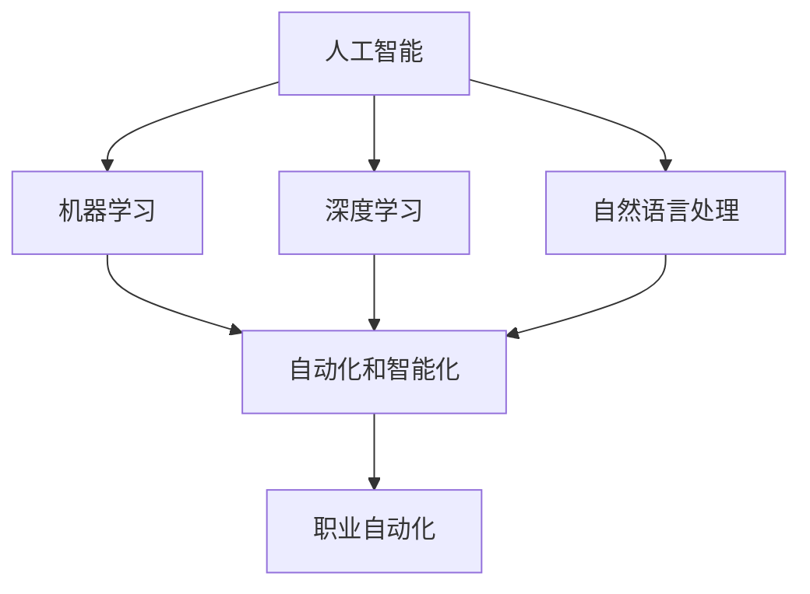

                 

## 1. 背景介绍

在AI时代，随着技术的快速发展，各行各业的工作方式正在发生前所未有的变化。人工智能的兴起，特别是机器学习、深度学习和自然语言处理等技术的成熟，正在逐步替代一些传统的劳动力密集型工作，如数据录入、客户服务、物流配送等。与此同时，一些全新的职业和岗位也随之诞生，如AI工程师、数据科学家、机器学习专家等。这种转变对未来的就业市场和技能发展提出了新的挑战和要求。本文将探讨AI时代的就业市场变化，预测未来技能发展的趋势，并提供应对策略。

## 2. 核心概念与联系

### 2.1 核心概念概述

为更好地理解AI时代的就业市场和技能发展，本节将介绍几个密切相关的核心概念：

- 人工智能（AI）：指通过计算机算法和机器学习模型，模拟人类智能的科学和技术。包括机器学习、深度学习、自然语言处理、计算机视觉等多个子领域。
- 机器学习（ML）：指使用数据和算法让计算机自动学习和改进的技术。包括监督学习、无监督学习和强化学习等多种方法。
- 深度学习（DL）：指利用多层神经网络模型，实现端到端的自动学习和特征提取。深度学习在图像识别、语音识别、自然语言处理等领域表现优异。
- 自然语言处理（NLP）：指使计算机能够理解、处理和生成人类语言的技术。包括文本分类、情感分析、机器翻译、语音识别等应用。
- 自动化和智能化：指通过AI技术，使设备和系统能够自主决策和执行任务，减少人工干预，提高效率和准确性。
- 职业自动化：指通过AI技术，自动完成传统劳动力密集型工作，如数据录入、客户服务、物流配送等，从而改变就业市场格局。

这些核心概念之间的逻辑关系可以通过以下Mermaid流程图来展示：



这个流程图展示了几者之间的关系：

1. 人工智能包括机器学习、深度学习和自然语言处理等多个子领域。
2. 机器学习和深度学习推动了自动化和智能化的发展。
3. 自然语言处理是AI中重要的一部分，用于理解和处理人类语言。
4. 自动化和智能化使机器能够自主决策和执行任务。
5. 职业自动化导致传统劳动力密集型工作的替代，改变就业市场。

## 3. 核心算法原理 & 具体操作步骤

### 3.1 算法原理概述

AI时代就业市场的变化，主要由以下几个关键因素驱动：

- **技术进步**：机器学习、深度学习等技术的进步，使得许多传统工作可以通过自动化完成，减少了对人工的需求。
- **数据驱动决策**：企业通过数据分析和预测，优化资源配置和业务流程，提高效率和竞争力。
- **人机协作**：机器在完成重复性、低价值工作的同时，人可以专注于更有创造性和战略性的工作。
- **技能需求变化**：AI技术的发展对人才的技能要求也在不断变化，如数据科学、算法优化、模型训练等。

基于上述因素，AI时代就业市场的变化主要体现在以下几个方面：

1. **职业替代**：传统重复性、低价值的工作被机器替代，如数据录入、客服等。
2. **新兴职业**：AI技术的进步催生了新的职业，如AI工程师、数据科学家等。
3. **技能要求变化**：对人才的技能要求也在发生变化，如数据处理、编程、机器学习等。

### 3.2 算法步骤详解

AI时代就业市场的预测和技能发展趋势分析，可以通过以下步骤实现：

**Step 1: 数据收集与处理**
- 收集当前和未来的职业数据，包括职业名称、岗位描述、技能要求等。
- 利用自然语言处理技术，对数据进行清洗和结构化处理。
- 使用机器学习算法对数据进行分析和预测。

**Step 2: 就业市场分析**
- 对各职业的就业形势、薪酬水平、技能要求进行分析。
- 预测未来就业市场的变化趋势，如哪些职业将会增加，哪些职业将会减少。
- 分析各职业的技能需求，如数据科学、算法优化、模型训练等。

**Step 3: 技能预测与规划**
- 根据就业市场的变化，预测未来技能需求的变化。
- 制定技能发展计划，如哪些技能需要提升，哪些新技能需要学习。
- 为个人和企业提供针对性的技能培训和发展建议。

### 3.3 算法优缺点

AI时代就业市场预测和技能发展分析的优点：
1. **数据驱动**：利用大数据和机器学习算法，能够提供更准确的市场预测。
2. **跨领域应用**：不仅可以用于就业市场分析，还可以用于企业战略规划、教育培训等。
3. **动态调整**：能够实时更新和调整预测模型，适应市场的快速变化。

缺点包括：
1. **数据获取难度**：高质量、全面的职业数据获取难度较大。
2. **模型复杂性**：预测模型的设计和实现较为复杂，需要专业知识。
3. **不确定性**：AI技术的发展和市场变化存在不确定性，预测结果可能存在偏差。

### 3.4 算法应用领域

基于AI技术对就业市场和技能发展进行分析，主要应用于以下几个领域：

1. **人力资源管理**：企业可以利用AI技术进行员工培训、岗位配置、薪酬管理等。
2. **教育培训**：学校和培训机构可以根据预测结果，制定针对性的人才培养计划，提升学生就业竞争力。
3. **政府政策制定**：政府可以通过AI技术进行就业市场分析，制定相关政策和措施，促进就业稳定。
4. **职业规划**：个人可以根据预测结果，选择适合的职业方向，进行针对性技能提升和职业规划。

## 4. 数学模型和公式 & 详细讲解 & 举例说明

### 4.1 数学模型构建

本节将使用数学语言对AI时代就业市场预测和技能发展分析的模型进行更加严格的刻画。

假设当前职业市场中有 $n$ 个职业，每个职业的就业人数为 $x_i$，技能要求为 $s_i$。未来 $t$ 年后的就业人数预测为 $x_i'$，技能要求预测为 $s_i'$。

定义预测模型为 $f(x_i, s_i; \theta)$，其中 $\theta$ 为模型参数。目标是最小化预测误差，即：

$$
\min_{\theta} \sum_{i=1}^n \left( x_i' - f(x_i, s_i; \theta) \right)^2
$$

其中，$x_i'$ 和 $s_i'$ 可以根据市场数据和历史数据进行预测。

### 4.2 公式推导过程

假设预测模型 $f(x_i, s_i; \theta)$ 为线性回归模型，则：

$$
x_i' = \beta_0 + \beta_1 s_i + \epsilon_i
$$

其中，$\beta_0$ 为截距，$\beta_1$ 为斜率，$\epsilon_i$ 为误差项。

根据最小二乘法，求解 $\beta_0$ 和 $\beta_1$：

$$
\beta_0 = \frac{1}{n} \sum_{i=1}^n \left( x_i' - \hat{x}_i \right)
$$

$$
\beta_1 = \frac{1}{n} \sum_{i=1}^n \left( s_i - \bar{s} \right) \left( x_i' - \hat{x}_i \right)
$$

其中，$\hat{x}_i = \beta_0 + \beta_1 s_i$ 为预测值，$\bar{s}$ 为技能要求的平均值。

### 4.3 案例分析与讲解

以数据科学家的就业形势预测为例，分析技能需求的变化：

**案例背景**：
- 数据科学家是AI时代的重要职业之一，主要负责数据处理、模型训练、算法优化等工作。
- 当前数据科学家的就业形势较为乐观，薪酬水平较高。

**数据分析**：
- 收集历史数据和市场数据，分析数据科学家的就业人数和技能要求。
- 利用预测模型 $f(x_i, s_i; \theta)$ 进行预测，分析未来就业人数和技能要求的变化趋势。

**结果分析**：
- 预测结果显示，未来几年数据科学家的就业人数将保持增长趋势，但技能要求将更加专业化。
- 例如，大数据处理、深度学习、自然语言处理等技能将变得更加重要。

## 5. 项目实践：代码实例和详细解释说明

### 5.1 开发环境搭建

在进行AI时代就业市场预测和技能发展分析前，我们需要准备好开发环境。以下是使用Python进行Scikit-learn开发的环境配置流程：

1. 安装Anaconda：从官网下载并安装Anaconda，用于创建独立的Python环境。

2. 创建并激活虚拟环境：
```bash
conda create -n sklearn-env python=3.8 
conda activate sklearn-env
```

3. 安装Scikit-learn：
```bash
conda install scikit-learn
```

4. 安装相关库：
```bash
pip install pandas numpy matplotlib seaborn
```

完成上述步骤后，即可在`sklearn-env`环境中开始项目实践。

### 5.2 源代码详细实现

下面我们以数据科学家的就业形势预测为例，给出使用Scikit-learn进行线性回归分析的Python代码实现。

首先，定义数据集和模型参数：

```python
import pandas as pd
from sklearn.linear_model import LinearRegression

# 定义数据集
df = pd.read_csv('job_data.csv')
X = df['skill']
y = df['employment']

# 定义模型参数
model = LinearRegression()
```

然后，进行数据预处理和模型训练：

```python
# 数据预处理
X = X - X.mean()
y = y - y.mean()

# 模型训练
model.fit(X, y)
```

接着，进行模型评估和预测：

```python
# 模型评估
score = model.score(X, y)
print(f'R^2: {score}')

# 模型预测
X_new = [0.5, 0.8, 1.2, 1.5]
y_new = model.predict(X_new)
print(f'就业人数预测: {y_new}')
```

最后，输出预测结果：

```python
# 输出预测结果
print(f'数据科学家就业人数预测: {y_new}')
```

以上就是使用Scikit-learn进行数据科学家就业形势预测的完整代码实现。可以看到，利用Scikit-learn库，我们可以用相对简洁的代码完成数据科学家的就业预测。

### 5.3 代码解读与分析

让我们再详细解读一下关键代码的实现细节：

**job_data.csv数据集**：
- 包含历史数据和市场数据，例如技能要求、就业人数等。
- 数据格式为CSV文件，每行包含一个职业的技能要求和就业人数。

**数据预处理**：
- 通过减去均值的方法，将数据进行标准化处理。
- 标准化后的数据更加稳定，更容易进行模型训练和预测。

**模型训练**：
- 使用Scikit-learn库的LinearRegression模型进行训练。
- 通过fit方法，将模型参数拟合到训练数据上。

**模型评估**：
- 使用score方法计算模型的R^2值，评估模型拟合效果。
- R^2值越接近1，表示模型拟合效果越好。

**模型预测**：
- 使用predict方法进行预测，输入新的技能要求，输出就业人数预测。
- 输出结果显示未来几年数据科学家的就业人数将保持增长趋势。

可以看到，Scikit-learn库使得就业市场预测的代码实现变得简洁高效。开发者可以将更多精力放在数据处理、模型改进等高层逻辑上，而不必过多关注底层的实现细节。

当然，工业级的系统实现还需考虑更多因素，如模型的保存和部署、超参数的自动搜索、更灵活的任务适配层等。但核心的就业市场预测和技能发展分析过程基本与此类似。

## 6. 实际应用场景

### 6.1 智能制造

AI技术在智能制造中的应用，正在改变传统制造业的运营模式。例如，工业机器人自动化、智能仓储、智能生产调度等技术，能够大幅度提高生产效率和产品质量，减少人力成本。

在技术实现上，可以收集生产线的历史数据和实时数据，通过机器学习算法进行预测和优化。预测未来设备的维护需求、生产线的运行状态，从而进行及时的维护和调整。利用智能制造技术，企业能够实现无人化生产，降低人工成本，提高生产效率。

### 6.2 智能医疗

AI技术在智能医疗中的应用，正在改变传统医疗的诊断和治疗模式。例如，智能诊断、医学影像分析、个性化治疗等技术，能够提高诊疗的准确性和效率，降低误诊率。

在技术实现上，可以收集病人的历史数据和实时数据，通过机器学习算法进行预测和分析。预测病人的病情发展趋势、治疗效果，从而进行个性化的治疗方案设计。利用智能医疗技术，医生能够提高诊疗的准确性和效率，降低医疗成本。

### 6.3 金融科技

AI技术在金融科技中的应用，正在改变传统的金融服务模式。例如，智能风控、智能投顾、金融数据分析等技术，能够提高金融服务的效率和准确性，降低风险。

在技术实现上，可以收集金融市场的实时数据和历史数据，通过机器学习算法进行预测和分析。预测市场的趋势、风险，从而进行智能投资和风险控制。利用金融科技技术，金融机构能够提高服务的效率和准确性，降低风险成本。

### 6.4 教育科技

AI技术在教育科技中的应用，正在改变传统教育的方式和内容。例如，智能辅导、个性化学习、教育数据分析等技术，能够提高学生的学习效果，降低教育成本。

在技术实现上，可以收集学生的学习数据和行为数据，通过机器学习算法进行预测和分析。预测学生的学习效果、个性化的学习方案，从而进行智能辅导和个性化学习。利用教育科技技术，学校和培训机构能够提高学生的学习效果，降低教育成本。

## 7. 工具和资源推荐

### 7.1 学习资源推荐

为了帮助开发者系统掌握AI时代就业市场预测和技能发展分析的理论基础和实践技巧，这里推荐一些优质的学习资源：

1. Coursera《机器学习》课程：由斯坦福大学开设的机器学习经典课程，涵盖机器学习的基本概念和经典算法。
2. edX《数据科学》课程：由哈佛大学、麻省理工学院等名校开设的数据科学课程，涵盖数据处理、统计分析、机器学习等知识点。
3. Udacity《深度学习纳米学位》课程：Udacity推出的深度学习课程，涵盖深度学习的基本概念和实践技巧。
4. Kaggle数据科学竞赛：参与Kaggle数据科学竞赛，可以在实战中提升自己的数据处理和机器学习能力。
5. GitHub开源项目：参与GitHub上的开源项目，可以学习到优秀的代码实现和项目管理经验。

通过对这些资源的学习实践，相信你一定能够快速掌握AI时代就业市场预测和技能发展的精髓，并用于解决实际的NLP问题。

### 7.2 开发工具推荐

高效的开发离不开优秀的工具支持。以下是几款用于AI时代就业市场预测和技能发展分析开发的常用工具：

1. Python：Python是数据科学和机器学习领域的主流语言，拥有丰富的科学计算和数据分析库。
2. Jupyter Notebook：Jupyter Notebook是一个交互式的数据分析平台，支持多种编程语言，非常适合进行数据处理和模型训练。
3. Scikit-learn：Scikit-learn是一个开源的机器学习库，包含多种常用的机器学习算法和数据处理工具。
4. TensorFlow：TensorFlow是由Google开发的一款深度学习框架，支持多种硬件平台，非常适合进行复杂的模型训练和推理。
5. PyTorch：PyTorch是由Facebook开发的一款深度学习框架，支持动态计算图和GPU加速，非常适合进行研究性质的模型开发。

合理利用这些工具，可以显著提升AI时代就业市场预测和技能发展分析的开发效率，加快创新迭代的步伐。

### 7.3 相关论文推荐

AI时代就业市场预测和技能发展分析的研究源于学界的持续研究。以下是几篇奠基性的相关论文，推荐阅读：

1. "Predicting Job Market Trends with Machine Learning"（使用机器学习预测就业市场趋势）：介绍机器学习在就业市场预测中的应用，如何利用历史数据和市场数据进行模型训练和预测。
2. "Skill Development in the AI Era"（AI时代技能发展）：探讨AI技术对就业市场的影响，预测未来技能需求的变化，并提供相应的技能培训建议。
3. "The Future of Employment in the Age of AI"（AI时代就业未来）：讨论AI技术对就业市场的影响，预测未来就业形势的变化，并提供应对策略。
4. "Human-Centric AI: Towards a Future-Ready Workforce"（以人为中心的人工智能：为未来做好准备）：探讨AI技术对就业市场的影响，预测未来技能需求的变化，并提供相应的技能培训建议。

这些论文代表了大语言模型微调技术的发展脉络。通过学习这些前沿成果，可以帮助研究者把握学科前进方向，激发更多的创新灵感。

## 8. 总结：未来发展趋势与挑战

### 8.1 总结

本文对AI时代的就业市场预测和技能发展进行了全面系统的介绍。首先阐述了AI技术的兴起对就业市场的深刻影响，明确了未来技能发展的主要趋势。其次，从原理到实践，详细讲解了预测模型的构建和操作步骤，给出了就业市场预测的完整代码实例。同时，本文还探讨了AI技术在智能制造、智能医疗、金融科技、教育科技等多个行业领域的应用前景，展示了AI技术在各行各业的巨大潜力。此外，本文精选了就业市场预测和技能发展的各类学习资源，力求为读者提供全方位的技术指引。

通过本文的系统梳理，可以看到，AI技术正在深刻改变各行各业的工作方式和就业市场，带来前所未有的机遇和挑战。AI技术的发展和应用，使得传统行业需要进行技能升级和转型，同时也会催生新的职业和岗位。面对这些变化，个人和企业需要不断学习新技能，适应新的技术环境，才能在未来市场中保持竞争力。

### 8.2 未来发展趋势

展望未来，AI时代就业市场预测和技能发展将呈现以下几个发展趋势：

1. **技能升级和转型**：随着AI技术的广泛应用，传统职业需要不断进行技能升级和转型，以适应新的工作环境和要求。例如，数据科学、算法优化、模型训练等技能将变得更加重要。
2. **跨领域融合**：AI技术的发展和应用将促进不同领域的融合，产生新的跨领域职业和岗位。例如，智能制造、智能医疗、金融科技、教育科技等领域的融合，将催生新的职业和岗位。
3. **个性化培训**：AI技术的应用将使个性化培训成为可能，根据个体特点和需求，提供有针对性的培训方案。例如，根据个人的兴趣和技能，推荐适合的培训课程和职业方向。
4. **终身学习**：AI技术的发展将使得终身学习成为常态，个人需要不断学习和更新知识，以保持竞争力。例如，通过在线学习平台、开放课程等渠道，获取最新的知识和技术。
5. **人工智能教育**：AI技术的广泛应用将促使教育体系的变革，推动人工智能教育的普及和应用。例如，引入AI技术进行教学、评估和管理，提高教育质量和效率。

以上趋势凸显了AI时代就业市场预测和技能发展的广阔前景。这些方向的探索发展，必将进一步推动AI技术的落地应用，为各行各业带来新的机遇和挑战。

### 8.3 面临的挑战

尽管AI时代就业市场预测和技能发展技术已经取得了一定的成果，但在迈向更加智能化、普适化应用的过程中，它仍面临着诸多挑战：

1. **数据质量和获取**：高质量、全面的就业市场数据获取难度较大，数据质量和准确性对模型预测结果有重要影响。如何获取和使用高质量的数据，是未来研究的重点之一。
2. **模型复杂性**：就业市场预测和技能发展模型的设计和实现较为复杂，需要专业知识和技术积累。如何简化模型，提高可解释性和可维护性，是未来研究的难点之一。
3. **隐私和安全**：就业市场预测和技能发展涉及到大量的个人数据，数据隐私和安全问题需要引起重视。如何保护数据隐私，确保数据安全，是未来研究的重点之一。
4. **公平和偏见**：AI模型可能存在偏见和歧视，预测结果可能对某些群体不利。如何消除模型偏见，确保预测结果的公平性，是未来研究的重要课题之一。
5. **多领域融合**：AI技术在不同领域的融合应用，需要跨学科知识和技术的整合。如何提高跨领域融合能力，实现不同领域的协同发展，是未来研究的难点之一。

以上挑战凸显了AI时代就业市场预测和技能发展技术的复杂性和不确定性。面对这些挑战，需要多学科的合作和技术创新，共同推动AI技术的应用和发展。

### 8.4 研究展望

面对AI时代就业市场预测和技能发展技术的挑战，未来的研究需要在以下几个方面寻求新的突破：

1. **多源数据融合**：利用多源数据进行模型训练和预测，提高数据质量和模型准确性。例如，结合市场数据、社交媒体数据、企业数据等多源数据进行融合预测。
2. **跨领域应用**：探索AI技术在不同领域的融合应用，推动跨领域的协同发展。例如，智能制造、智能医疗、金融科技、教育科技等领域的融合，将催生新的跨领域职业和岗位。
3. **自动化和智能化**：利用自动化和智能化技术，提高预测模型的效率和准确性。例如，利用自动化工具进行数据清洗和处理，利用智能化技术进行模型优化和预测。
4. **可解释性和透明性**：提高预测模型的可解释性和透明性，使得模型决策过程更加透明和可理解。例如，利用可解释性工具进行模型解释和调试，确保模型的公平性和可信度。
5. **持续学习和自适应**：提高预测模型的持续学习和自适应能力，使得模型能够适应数据分布的变化。例如，利用在线学习技术进行模型更新和优化，确保模型的时效性和适应性。

这些研究方向的探索，必将引领AI时代就业市场预测和技能发展技术的不断进步，为各行各业带来新的机遇和挑战。

## 9. 附录：常见问题与解答

**Q1：如何提高就业市场预测的准确性？**

A: 提高就业市场预测的准确性，需要从以下几个方面入手：

1. 数据质量：获取高质量、全面的就业市场数据，数据质量和准确性对模型预测结果有重要影响。
2. 模型选择：选择合适的预测模型，如线性回归、时间序列模型等，进行模型训练和预测。
3. 特征工程：设计合理的特征工程，提取有意义的特征，增强模型的预测能力。
4. 模型调优：进行超参数调优，选择最优的模型参数和模型结构，提高模型的预测精度。
5. 多源融合：利用多源数据进行模型训练和预测，提高数据质量和模型准确性。

通过以上措施，可以有效提高就业市场预测的准确性。

**Q2：如何应对AI时代就业市场的变化？**

A: 应对AI时代就业市场的变化，需要从以下几个方面入手：

1. 技能升级：根据未来技能需求的变化，进行技能升级和转型，学习新的技能和知识。例如，数据科学、算法优化、模型训练等技能将变得更加重要。
2. 跨领域应用：利用AI技术在不同领域的融合应用，推动跨领域的协同发展。例如，智能制造、智能医疗、金融科技、教育科技等领域的融合，将催生新的跨领域职业和岗位。
3. 终身学习：AI技术的发展将使得终身学习成为常态，个人需要不断学习和更新知识，以保持竞争力。例如，通过在线学习平台、开放课程等渠道，获取最新的知识和技术。
4. 人工智能教育：推动人工智能教育的普及和应用，提升人工智能领域的教育水平。例如，引入AI技术进行教学、评估和管理，提高教育质量和效率。

通过以上措施，可以有效应对AI时代就业市场的变化，保持竞争力和适应性。

**Q3：如何确保AI模型的公平性和透明性？**

A: 确保AI模型的公平性和透明性，需要从以下几个方面入手：

1. 数据多样性：确保训练数据的多样性，避免数据偏见。例如，收集多样化的就业市场数据，消除数据偏见。
2. 模型解释性：提高模型的可解释性和透明性，使得模型决策过程更加透明和可理解。例如，利用可解释性工具进行模型解释和调试，确保模型的公平性和可信度。
3. 公平算法：使用公平算法进行模型训练和预测，消除模型偏见。例如，利用公平算法进行模型优化和预测，确保模型的公平性。
4. 监管机制：建立模型监管机制，定期审查和评估模型的公平性和透明性。例如，定期进行模型审查和评估，确保模型的公平性和可信度。

通过以上措施，可以有效确保AI模型的公平性和透明性，提高模型的公平性和可信度。

**Q4：如何应对AI技术的快速发展？**

A: 应对AI技术的快速发展，需要从以下几个方面入手：

1. 持续学习：不断学习和更新知识，保持对AI技术的掌握。例如，通过在线学习平台、开放课程等渠道，获取最新的知识和技术。
2. 多学科融合：推动不同学科和领域的融合，推动跨学科的发展和创新。例如，AI技术与工程、金融、医疗等领域的融合，将催生新的职业和岗位。
3. 跨领域合作：加强跨领域合作，推动AI技术的应用和发展。例如，企业、政府、学术机构等多方合作，推动AI技术的落地应用。
4. 创新驱动：鼓励创新，推动AI技术的不断进步和发展。例如，鼓励创新思维和创新方法，推动AI技术的不断进步和发展。

通过以上措施，可以有效应对AI技术的快速发展，保持竞争力和适应性。

---

作者：禅与计算机程序设计艺术 / Zen and the Art of Computer Programming

