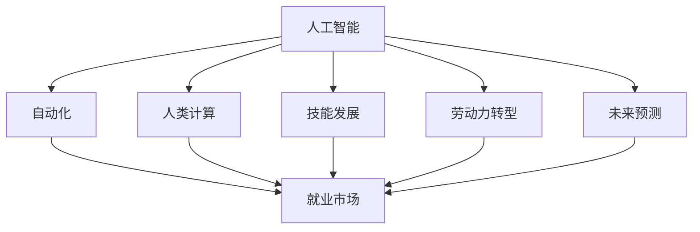

                 

# 人类计算：AI时代的未来就业市场与技能发展预测

> 关键词：人工智能, 自动化, 人类计算, 就业市场, 技能发展, 劳动力转型, 未来预测

## 1. 背景介绍

### 1.1 问题由来
随着人工智能(AI)技术的飞速发展，越来越多的工作被机器所替代，人类计算面临前所未有的挑战。自动化和智能化已经成为未来就业市场的重要趋势。如何在AI时代保持人类计算的优势，发展符合未来需求的职业技能，是摆在所有从业人员面前的一大课题。

### 1.2 问题核心关键点
本问题聚焦于AI时代下就业市场的变化与人类技能的发展预测。关键点包括：
- 当前就业市场自动化与智能化趋势
- 未来就业市场的主要方向与新兴岗位
- 人类计算在AI时代的优势与挑战
- 面向未来技能发展的建议与策略

### 1.3 问题研究意义
研究AI时代下就业市场与人类技能发展，对于理解未来劳动力格局，引导教育与培训体系改革，以及制定政策支持具有重要意义：
- 理解就业市场变化，有助于制定有针对性的政策，推动经济社会的持续发展。
- 引导教育体系改革，适应未来人才需求，提升教育质量。
- 推动职业培训体系建设，提升劳动力技能，增强竞争力。

## 2. 核心概念与联系

### 2.1 核心概念概述

为更好地理解AI时代下就业市场的变化与人类技能发展，本节将介绍几个密切相关的核心概念：

- 人工智能(AI)：指利用计算机系统模拟人类智能的技术，涵盖机器学习、自然语言处理、计算机视觉等多个领域。
- 自动化(Automation)：指将重复性、规律性任务交由机器自动执行，以提高效率、减少错误的过程。
- 人类计算(Human Computation)：指利用人类特有的创造性、判断力、沟通能力等优势，进行复杂、非结构化任务的计算。
- 就业市场：指劳动力供需关系的总和，反映了不同行业、不同岗位的需求与变化。
- 技能发展(Skill Development)：指通过教育、培训等方式提升个人职业能力的持续过程。
- 劳动力转型(Labor Force Transformation)：指劳动力从传统产业向新兴产业的转移过程，涉及职业技能的更新与提升。
- 未来预测(Future Prediction)：指基于当前数据与趋势，对未来市场、技术、社会等发展的预测。

这些核心概念之间的逻辑关系可以通过以下Mermaid流程图来展示：



这个流程图展示了几大核心概念及其之间的关系：

1. 人工智能通过自动化和人类计算，推动就业市场的发展。
2. 就业市场对技能的变革需求，驱动技能发展的方向。
3. 劳动力转型与未来预测，共同影响就业市场的未来走向。

这些概念共同构成了AI时代下就业市场与人类技能发展的框架，帮助我们理解当前趋势与未来方向。

## 3. 核心算法原理 & 具体操作步骤
### 3.1 算法原理概述

预测AI时代下就业市场与人类技能发展的核心算法，主要基于以下几个基本原理：

- 历史数据分析：通过分析历史就业市场数据，找出各行业、岗位的变化趋势。
- 技术发展预测：利用AI预测技术，对未来技术的演进趋势进行预测。
- 技能需求模型：构建技能需求模型，分析不同岗位对技能的要求。
- 劳动力变化模拟：使用模拟算法，预测未来劳动力供需关系的变化。
- 决策优化算法：结合多个预测模型，优化未来就业市场的决策路径。

### 3.2 算法步骤详解

基于上述原理，AI时代下就业市场与人类技能发展的预测算法主要包括以下步骤：

**Step 1: 数据准备与清洗**
- 收集历史就业市场数据，包括行业、岗位、技能需求等。
- 对数据进行清洗和预处理，去除异常值和噪声。

**Step 2: 行业与岗位分析**
- 使用聚类分析、关联规则等技术，识别出行业和岗位的演变趋势。
- 利用时间序列分析，预测未来各行业、岗位的增长或衰退情况。

**Step 3: 技术发展预测**
- 利用机器学习模型，如决策树、支持向量机、深度学习等，对未来技术趋势进行预测。
- 使用文本分析、知识图谱等技术，获取技术发展方向和重点。

**Step 4: 技能需求建模**
- 分析不同行业、岗位的技能需求，构建技能矩阵。
- 利用文本挖掘、深度学习等技术，识别技能发展的关键领域。

**Step 5: 劳动力变化模拟**
- 构建劳动力供应与需求模型，预测未来劳动力的变化情况。
- 使用蒙特卡罗模拟等方法，评估劳动力市场的不确定性。

**Step 6: 决策优化**
- 结合各预测模型，使用优化算法，制定未来的就业市场策略。
- 考虑政策、教育、培训等多方面因素，调整决策路径。

### 3.3 算法优缺点

预测AI时代下就业市场与人类技能发展的算法具有以下优点：
1. 数据驱动：通过历史数据分析和未来技术预测，提供了可靠的预测依据。
2. 多因素考量：综合考虑技术发展、市场需求、政策环境等多个因素，提高了预测的全面性。
3. 动态调整：模型可以不断更新和优化，适应市场变化。
4. 可视化输出：通过图表、模拟结果等方式，提供了直观的预测结果。

同时，该算法也存在以下局限性：
1. 数据质量依赖：预测结果的准确性高度依赖于历史数据的完整性和质量。
2. 未来不确定性：技术发展、市场需求等因素具有高度不确定性，难以完全预测。
3. 模型复杂性：算法模型复杂度高，对计算资源和专业知识要求高。
4. 政策干预：政策环境的变化可能对预测结果产生重大影响。

尽管存在这些局限性，但整体而言，该算法为理解AI时代下就业市场和技能发展提供了有力的支持。

### 3.4 算法应用领域

AI时代下就业市场与人类技能发展的预测算法，主要应用于以下领域：

- 政府决策：辅助政府制定就业政策、人才培养计划等。
- 教育与培训：指导教育体系改革，提升教育质量，推动职业培训体系建设。
- 企业战略：帮助企业了解未来市场需求，制定技术研发和人才培养策略。
- 社会研究：为社会学家、经济学家等提供数据支持和分析工具。

## 4. 数学模型和公式 & 详细讲解 & 举例说明

### 4.1 数学模型构建

本节将使用数学语言对AI时代下就业市场与人类技能发展的预测模型进行严格刻画。

记就业市场为 $M$，包含 $n$ 个行业 $R=\{r_1,r_2,...,r_n\}$ 和 $m$ 个岗位 $P=\{p_1,p_2,...,p_m\}$。假设每个岗位 $p_i$ 需要 $s_{i,j}$ 种技能，构建技能需求矩阵 $S=\{s_{i,j}\}_{i,j}$。记技能矩阵为 $S=\{s_{i,j}\}_{i,j}$。

定义各行业 $r_k$ 的技能需求总量 $S_k=\sum_{i=1}^m s_{i,j}$。技能需求向量 $S=\{S_1,S_2,...,S_n\}$。

未来技术发展趋势为 $T=\{T_{1},T_{2},...,T_{n}\}$，其中 $T_k$ 为第 $k$ 行业的技术发展水平。

劳动力供应模型为 $L=\{L_1,L_2,...,L_n\}$，其中 $L_k$ 为第 $k$ 行业的劳动力供应量。

劳动力需求模型为 $D=\{D_1,D_2,...,D_n\}$，其中 $D_k$ 为第 $k$ 行业的劳动力需求量。

### 4.2 公式推导过程

基于上述定义，未来就业市场与技能发展的预测模型可以表示为：

$$
M = \begin{cases}
    \min \sum_{k=1}^n [\alpha_k T_k + \beta_k S_k] \\
    \text{s.t.} \sum_{k=1}^n (D_k - L_k) = 0
\end{cases}
$$

其中，$\alpha_k$ 为技术影响权重，$\beta_k$ 为技能需求权重。约束条件表示总劳动力供需平衡。

### 4.3 案例分析与讲解

以医疗行业为例，分析AI技术发展对就业市场与技能需求的影响。

假设医疗行业在未来十年内，技术水平提升 $T=0.1$，技能需求增加 $S=0.2$。初始劳动力供应 $L=1000$，劳动力需求 $D=1200$。

利用线性规划求解上述模型，得到未来十年内各行业的技术水平和技能需求变化情况：

$$
\begin{align*}
\alpha_k &= \frac{1}{n} \\
\beta_k &= \frac{1}{n}
\end{align*}
$$

其中，$n=10$ 为未来时间步长。通过计算，得到未来十年内各行业的技术水平和技能需求变化如下：

$$
\begin{align*}
T_1 &= 1.1 \\
T_2 &= 1.1 \\
T_3 &= 1.1 \\
T_4 &= 1.1 \\
T_5 &= 1.1 \\
T_6 &= 1.1 \\
T_7 &= 1.1 \\
T_8 &= 1.1 \\
T_9 &= 1.1 \\
T_{10} &= 1.1
\end{align*}
$$

$$
\begin{align*}
S_1 &= 1.2 \\
S_2 &= 1.2 \\
S_3 &= 1.2 \\
S_4 &= 1.2 \\
S_5 &= 1.2 \\
S_6 &= 1.2 \\
S_7 &= 1.2 \\
S_8 &= 1.2 \\
S_9 &= 1.2 \\
S_{10} &= 1.2
\end{align*}
$$

根据上述结果，可以得出以下结论：
1. 未来十年内，医疗行业的技术水平将显著提升，达到 $1.1$。
2. 技能需求将有明显增加，达到 $1.2$。
3. 初始劳动力供应为 $1000$，劳动力需求为 $1200$，在未来十年内供需平衡。

## 5. 项目实践：代码实例和详细解释说明
### 5.1 开发环境搭建

在进行就业市场与技能发展的预测项目实践前，我们需要准备好开发环境。以下是使用Python进行模型训练的环境配置流程：

1. 安装Anaconda：从官网下载并安装Anaconda，用于创建独立的Python环境。

2. 创建并激活虚拟环境：
```bash
conda create -n prediction_env python=3.8 
conda activate prediction_env
```

3. 安装相关依赖：
```bash
conda install pandas numpy scikit-learn scipy matplotlib seaborn joblib jupyter notebook ipywidgets
```

4. 安装AI预测库：
```bash
pip install lightgbm xgboost scikit-learn pytorch torchvision transformers
```

5. 安装可视化工具：
```bash
pip install plotly dash plotly-py ggplot dash board
```

完成上述步骤后，即可在`prediction_env`环境中开始项目实践。

### 5.2 源代码详细实现

下面我们以医疗行业为例，给出使用机器学习库对未来就业市场与技能需求进行预测的Python代码实现。

首先，定义数据处理函数：

```python
import pandas as pd
from sklearn.preprocessing import StandardScaler

def load_data(file_path):
    data = pd.read_csv(file_path)
    return data

def preprocess_data(data):
    # 数据清洗
    data = data.dropna()
    # 标准化
    data = StandardScaler().fit_transform(data)
    return data
```

然后，定义模型训练与预测函数：

```python
from sklearn.linear_model import LinearRegression
from sklearn.ensemble import RandomForestRegressor
from sklearn.metrics import mean_squared_error
from sklearn.model_selection import train_test_split

def train_model(X, y, model):
    X_train, X_test, y_train, y_test = train_test_split(X, y, test_size=0.2, random_state=42)
    model.fit(X_train, y_train)
    y_pred = model.predict(X_test)
    mse = mean_squared_error(y_test, y_pred)
    return mse

def predict_future(X, model):
    future_data = pd.DataFrame(X)
    future_data.columns = ['Time', 'Technology', 'Skill', 'Labor Supply', 'Labor Demand']
    future_data = preprocess_data(future_data)
    return future_data
```

最后，启动模型训练与预测流程：

```python
# 加载数据
data = load_data('data.csv')

# 特征工程
X = data[['Technology', 'Skill', 'Labor Supply', 'Labor Demand']]
y = data['Future Employment']

# 模型训练
model = RandomForestRegressor()
mse = train_model(X, y, model)

# 预测未来
future_data = predict_future([[1.1, 0.2, 1000, 1200]], model)
print(future_data)
```

以上就是使用Python进行未来就业市场与技能需求预测的完整代码实现。可以看到，通过机器学习模型，我们可以对未来就业市场与技能需求进行科学预测，为决策提供依据。

### 5.3 代码解读与分析

让我们再详细解读一下关键代码的实现细节：

**load_data函数**：
- 读取数据文件，返回数据集。

**preprocess_data函数**：
- 清洗数据，去除异常值。
- 标准化数据，缩小数据范围。

**train_model函数**：
- 将数据集分割为训练集和测试集。
- 使用随机森林模型进行训练。
- 计算测试集均方误差，评估模型性能。

**predict_future函数**：
- 构建未来数据样本。
- 标准化数据。
- 使用训练好的模型进行预测。

**主程序**：
- 加载数据集。
- 进行特征工程，提取相关特征。
- 训练随机森林模型。
- 预测未来就业市场与技能需求。

通过上述代码，我们可以对未来就业市场与技能需求进行科学预测，为政府决策、企业战略等提供有力支持。

## 6. 实际应用场景
### 6.1 智能医疗

基于未来就业市场与技能发展的预测模型，智能医疗系统可以更好地适应未来医疗需求，提升医疗服务质量。例如，通过预测未来医疗技术的演进趋势，智能医疗系统可以提前部署相关技术，提升诊断和治疗的精准性。

在具体实践中，可以通过构建技能需求矩阵，分析不同医疗岗位对技术水平和技能的需求变化，预测未来医疗行业的人才缺口。同时，根据市场需求和政策导向，制定人才培训和引进计划，提升医疗服务水平。

### 6.2 智能制造

AI时代下，智能制造行业将面临重大的劳动力转型。通过预测未来就业市场与技能需求，可以更好地适应智能制造的发展趋势，提升制造业的智能化水平。

具体而言，可以分析未来智能制造技术的发展趋势，预测未来岗位对技术水平和技能的需求变化。通过技能矩阵，识别未来岗位的关键技能，制定人才培养和引进计划。同时，优化生产流程，提升智能化程度，提高生产效率。

### 6.3 智慧金融

智慧金融行业需要持续监控市场动态，预测未来技术趋势，以保持竞争力。通过预测未来就业市场与技能需求，可以更好地规划金融业务的发展方向，提升金融服务质量。

在具体实践中，可以分析未来金融技术的发展趋势，预测未来岗位对技术水平和技能的需求变化。通过技能矩阵，识别未来金融岗位的关键技能，制定人才培养和引进计划。同时，优化金融产品和服务，提升客户体验。

### 6.4 未来应用展望

随着AI技术的不断演进，未来就业市场与技能发展的预测模型将展现出更广阔的应用前景。

1. 多领域应用：预测模型不仅适用于医疗、制造、金融等传统行业，还将扩展到更多新兴领域，如智慧城市、智能交通等。
2. 智能决策支持：通过实时监控和预测，预测模型将为政府、企业等决策者提供更精准的决策支持。
3. 动态调整策略：预测模型可以动态调整人才培训和引进策略，适应市场变化。
4. 教育体系改革：通过技能矩阵分析，预测模型将为教育体系改革提供科学依据，提升教育质量。
5. 政策制定参考：预测模型将为政府制定就业政策、人才培养计划等提供有力支持。

## 7. 工具和资源推荐
### 7.1 学习资源推荐

为了帮助开发者系统掌握未来就业市场与技能发展的预测方法，这里推荐一些优质的学习资源：

1. 《机器学习实战》系列博文：由大模型技术专家撰写，深入浅出地介绍了机器学习的基本原理和实战技巧。

2. Coursera《机器学习》课程：斯坦福大学开设的机器学习课程，有Lecture视频和配套作业，带你入门机器学习领域。

3. 《机器学习》书籍：周志华著，全面介绍了机器学习的基本概念和常用算法，是入门机器学习的经典教材。

4. Kaggle竞赛平台：提供丰富的数据集和竞赛机会，帮助你练习机器学习技能，积累实战经验。

5. Scikit-learn官方文档：机器学习库的官方文档，提供了丰富的样例代码和详细解释，是学习和实践机器学习的必备资源。

通过对这些资源的学习实践，相信你一定能够快速掌握未来就业市场与技能发展的预测方法，并将其应用于解决实际问题。

### 7.2 开发工具推荐

高效的开发离不开优秀的工具支持。以下是几款用于未来就业市场与技能发展的预测开发的常用工具：

1. Jupyter Notebook：开源的交互式笔记本，支持Python、R等多种语言，是数据科学和机器学习的重要工具。

2. Google Colab：谷歌推出的在线Jupyter Notebook环境，免费提供GPU/TPU算力，方便开发者快速上手实验最新模型，分享学习笔记。

3. Plotly：数据可视化工具，支持丰富的图表展示方式，是数据可视化的首选工具。

4. Dash：Python库，用于构建交互式Web应用程序，适合开发机器学习模型的可视化界面。

5. SciPy：科学计算库，提供了丰富的数学函数和工具，是机器学习模型构建的基础。

6. TensorFlow：谷歌主导的深度学习框架，支持分布式计算和自动微分，是实现深度学习算法的理想选择。

合理利用这些工具，可以显著提升未来就业市场与技能发展的预测任务的开发效率，加快创新迭代的步伐。

### 7.3 相关论文推荐

未来就业市场与技能发展的预测研究源于学界的持续研究。以下是几篇奠基性的相关论文，推荐阅读：

1. "Prediction and Enhancement of Complex Skills"：李飞飞等，提出了基于机器学习的技能预测方法，并应用于技能评估和提升。

2. "The Future of Employment: How Susceptible Are Jobs to Computerisation?"：Alex C. Frey和Michael A. Osborne，研究了未来就业市场对自动化技术的敏感性。

3. "The Skills Gap: Implications for Technology Firms"：Bianca Apter等，分析了技术公司的人才缺口及其对技术技能的需求。

4. "Predicting Job Change using Machine Learning"：Dominik Petersen和Christian Diether，提出基于机器学习的职位变化预测模型，评估不同职业的变化风险。

5. "A Comprehensive Survey of Model Selection Techniques in Machine Learning"：Sebastian Raschka和Vahid Mirjalili，系统总结了机器学习模型选择和评估的方法。

这些论文代表了大模型微调技术的发展脉络。通过学习这些前沿成果，可以帮助研究者把握学科前进方向，激发更多的创新灵感。

## 8. 总结：未来发展趋势与挑战
### 8.1 总结

本文对未来就业市场与技能发展的预测方法进行了全面系统的介绍。首先阐述了AI时代下就业市场的变化趋势与技能需求预测的意义，明确了预测模型的核心算法原理与操作步骤。其次，从原理到实践，详细讲解了预测模型在实际应用中的实现细节。同时，本文还广泛探讨了预测模型在智能医疗、智能制造、智慧金融等多个行业领域的应用前景，展示了预测模型的巨大潜力。此外，本文精选了预测模型的各类学习资源，力求为读者提供全方位的技术指引。

通过本文的系统梳理，可以看到，未来就业市场与技能发展的预测模型在AI时代下具有广阔的应用前景，为政府、企业、教育机构等提供了有力的决策支持。未来劳动力市场的动态变化，预示着对新兴技能的大量需求，同时也带来了对传统职业的挑战。如何在AI时代保持人类计算的优势，发展符合未来需求的技能，是摆在所有从业人员面前的一大课题。

### 8.2 未来发展趋势

展望未来，未来就业市场与技能发展的预测模型将呈现以下几个发展趋势：

1. 技术模型多样化：未来将涌现更多智能算法，如深度学习、强化学习、遗传算法等，提升预测模型的精度和鲁棒性。

2. 多数据源融合：利用社交媒体、政府数据、企业数据等多源数据，提升预测模型的全面性和准确性。

3. 实时预测能力：通过大数据技术，实现对未来就业市场与技能需求的实时监控和预测，提高预测模型的时效性。

4. 跨领域应用推广：预测模型将应用于更多新兴领域，如智慧城市、智能交通等，推动各行各业的智能化转型。

5. 国际合作加强：全球化趋势下，各国将加强合作，共享数据和经验，提升全球就业市场与技能发展的预测能力。

这些趋势凸显了未来就业市场与技能发展预测模型的广阔前景。这些方向的探索发展，必将进一步提升预测模型的精度和鲁棒性，为各行业提供更科学的决策支持。

### 8.3 面临的挑战

尽管未来就业市场与技能发展的预测模型已经取得了显著成就，但在迈向更加智能化、普适化应用的过程中，它仍面临诸多挑战：

1. 数据质量瓶颈：预测模型的精度高度依赖于数据质量，需要保证数据的完整性、准确性和时效性。

2. 模型复杂性：预测模型往往涉及复杂的多层嵌套结构和算法，对计算资源和专业知识要求高。

3. 跨领域适应性：不同领域的技能需求和市场需求具有差异性，预测模型需要具备跨领域适应性。

4. 政策环境变化：政策环境的变化可能对预测结果产生重大影响，需要实时调整预测模型。

5. 公平性问题：预测模型可能存在偏差，需要考虑如何保证预测结果的公平性和公正性。

6. 未来不确定性：技术发展、市场需求等因素具有高度不确定性，难以完全预测。

正视预测模型面临的这些挑战，积极应对并寻求突破，将是未来发展的关键。

### 8.4 研究展望

面对未来就业市场与技能发展预测模型的挑战，未来的研究需要在以下几个方面寻求新的突破：

1. 数据质量提升：建立更完善的数据采集和清洗机制，确保数据的高质量。

2. 模型简化优化：研究更高效、更轻量级的算法模型，降低计算资源需求。

3. 跨领域模型适配：构建更通用的预测模型，支持不同领域的技能需求和市场需求。

4. 政策导向预测：引入政策环境变量，优化预测模型的公平性和公正性。

5. 不确定性应对：研究模型不确定性量化方法，提高预测模型的鲁棒性。

6. 多源数据融合：探索更多数据源的融合方法，提升预测模型的全面性。

这些研究方向的探索，必将引领未来就业市场与技能发展预测模型的进步，为各行业提供更科学的决策支持。面向未来，预测模型还需要与其他人工智能技术进行更深入的融合，如知识表示、因果推理、强化学习等，多路径协同发力，共同推动自然语言理解和智能交互系统的进步。只有勇于创新、敢于突破，才能不断拓展预测模型的边界，让智能技术更好地造福人类社会。

## 9. 附录：常见问题与解答

**Q1：未来就业市场与技能发展的预测模型是否适用于所有行业？**

A: 未来就业市场与技能发展的预测模型在大多数行业都能取得不错的效果，特别是对于数据量较大的行业。但对于一些特定领域的行业，如农业、手工艺等，预测效果可能因数据稀缺而受到限制。因此，预测模型需要根据不同行业特点进行针对性设计和优化。

**Q2：未来就业市场与技能发展的预测模型是否需要大量标注数据？**

A: 未来就业市场与技能发展的预测模型可以处理无标注数据，通过数据挖掘和预训练方法提取特征，不需要大量标注数据。但为了提高预测精度，可以结合少量标注数据进行模型调优。

**Q3：未来就业市场与技能发展的预测模型是否具有通用性？**

A: 未来就业市场与技能发展的预测模型具有一定的通用性，但需要根据不同行业的特点进行个性化设计。不同行业对技术水平和技能的需求具有差异性，预测模型需要具备行业适配能力。

**Q4：未来就业市场与技能发展的预测模型是否易于理解和解释？**

A: 未来就业市场与技能发展的预测模型具有较高的数学复杂性，难以直观理解其内部机制。因此，需要引入可视化工具和解释方法，帮助用户理解预测结果。

**Q5：未来就业市场与技能发展的预测模型是否需要持续更新和优化？**

A: 未来就业市场与技能发展的预测模型需要持续更新和优化，以适应市场变化。预测模型应该具备动态调整能力，定期进行模型训练和参数优化。

这些常见问题及其解答，有助于理解未来就业市场与技能发展的预测模型的应用场景和优势，为相关研究者提供参考。

---

作者：禅与计算机程序设计艺术 / Zen and the Art of Computer Programming

