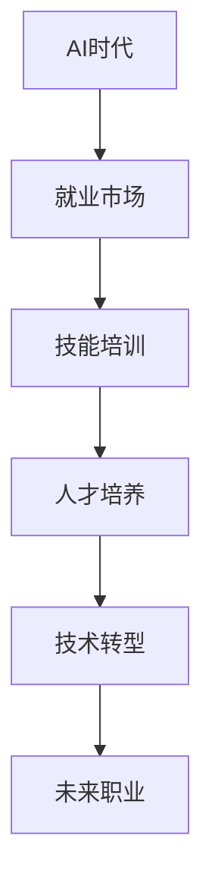

                 

# 人类计算：AI时代的未来就业市场与技能培训发展趋势分析机遇挑战机遇

> 关键词：AI时代,就业市场,技能培训,人才培养,技术转型,未来职业

## 1. 背景介绍

### 1.1 问题由来
当前，人工智能（AI）技术的迅猛发展正深刻改变着全球就业市场和技能培训格局。随着深度学习、自然语言处理、计算机视觉等AI技术的不断突破，各行各业都在引入AI技术以提升效率、优化决策。这无疑为人类带来了前所未有的机遇，但同时也带来了巨大挑战。

一方面，AI技术能够替代大量重复性、低技能的工作，提高生产力，创造新的就业机会，并推动职业形态的变革。但另一方面，AI技术也会导致部分岗位的消失，影响低技能劳动力的就业，要求高技能劳动力不断提升和更新自身技能，以适应新的职业需求。

### 1.2 问题核心关键点
AI时代下，就业市场与技能培训面临的核心挑战包括：
- **就业结构性变化**：AI技术将淘汰传统岗位，催生新的职业需求，对劳动者的技能结构产生重大影响。
- **技能需求升级**：AI技术的应用需要劳动者具备高层次、跨学科的综合技能，传统的单一技能培训难以满足需求。
- **终身学习要求**：在AI技术快速发展的背景下，劳动者需要不断学习新知识，更新技能，以保持职场竞争力。

## 2. 核心概念与联系

### 2.1 核心概念概述

在探讨AI时代下就业市场与技能培训的发展趋势时，我们需要重点关注以下几个核心概念：

- **AI时代**：指由深度学习、计算机视觉、自然语言处理等AI技术主导的时代，这些技术正在驱动各行各业向智能化转型。
- **就业市场**：指各类劳动力的供需关系，包括岗位的创造与消亡、岗位的演变与更迭。
- **技能培训**：指针对职业需求，通过教育机构、在线平台、企业内部培训等多种形式进行的职业技能提升和知识更新活动。
- **人才培养**：指从基础教育、职业教育到高等教育各个阶段对人才进行的系统性、全面性的教育和训练。
- **技术转型**：指企业、组织通过引入AI等新兴技术，实现业务流程和组织结构的革新与优化。
- **未来职业**：指AI时代背景下新兴的职业形态，如数据科学家、AI工程师、机器人操作员等。

这些核心概念之间的逻辑关系可以通过以下Mermaid流程图来展示：



这个流程图展示了大环境（AI时代）如何通过就业市场的变化，驱动技能培训和人才培养，进而推动技术转型，并催生新的未来职业。

## 3. 核心算法原理 & 具体操作步骤

### 3.1 算法原理概述

AI时代下，就业市场与技能培训的演化过程可以视为一种复杂系统的动态变化。其核心算法原理包括以下几个方面：

1. **就业市场动态模型**：
   - **岗位需求分析**：通过数据分析和模型建立，预测不同AI技术应用场景下的岗位需求变化。
   - **岗位演变规律**：研究AI技术如何影响传统岗位的消失和新兴岗位的诞生。

2. **技能培训优化模型**：
   - **技能映射**：将AI技术所需技能映射到现有教育和培训体系中。
   - **课程设计**：根据AI技术需求，设计新的培训课程和教材。
   - **效果评估**：通过实验和评估，不断优化培训课程和教学方法。

3. **人才培养反馈模型**：
   - **人才路径规划**：根据未来职业需求，设计人才的培养路径。
   - **评估与调整**：对人才培养的效果进行评估，并根据反馈进行调整。

### 3.2 算法步骤详解

基于上述核心算法原理，AI时代下就业市场与技能培训的演化过程大致分为以下几个步骤：

1. **数据收集与分析**：
   - 收集就业市场和教育培训的各类数据，如岗位变化、技能需求、学生就业情况等。
   - 使用机器学习模型，如时间序列分析、回归分析等，对数据进行分析和预测。

2. **技能培训设计与实施**：
   - 根据AI技术需求，重新设计培训课程，引入新技能和知识。
   - 开发在线学习平台、虚拟仿真环境等技术手段，提升培训效果。
   - 实施培训，并监测培训效果，及时调整培训内容和方式。

3. **人才评估与反馈**：
   - 定期评估人才培养效果，如就业率、职业满意度、技能掌握情况等。
   - 收集学生、企业、教育机构的反馈，对培训体系进行改进和优化。

### 3.3 算法优缺点

AI时代下就业市场与技能培训的演化算法具有以下优点：
- **数据驱动**：通过数据分析和预测，提供精准的技能需求信息，指导培训设计和实施。
- **动态优化**：根据市场变化和反馈，不断优化培训内容和方法，提升培训效果。
- **综合考虑**：兼顾就业市场和技术发展，全面考虑人才培养和技能培训。

但同时也存在以下缺点：
- **数据质量问题**：数据收集和处理过程中的噪声和偏差可能影响模型预测结果。
- **模型复杂性**：算法模型过于复杂，可能导致计算和实施成本较高。
- **知识更新快**：AI技术快速变化，培训内容需要频繁更新，对培训机构和教师提出较高要求。

### 3.4 算法应用领域

AI时代下，就业市场与技能培训的演化算法广泛应用于以下几个领域：

1. **高等教育**：通过大数据分析，优化课程设计，培养符合AI时代需求的人才。
2. **职业教育**：根据岗位需求，调整培训课程，提升劳动者技能。
3. **企业培训**：帮助企业快速掌握AI技术，提升业务水平。
4. **终身学习平台**：提供在线学习资源，支持劳动者终身学习。
5. **政策制定**：为政府制定AI时代的人才培养和就业政策提供数据支持和决策参考。

## 4. 数学模型和公式 & 详细讲解 & 举例说明（备注：数学公式请使用latex格式，latex嵌入文中独立段落使用 $$，段落内使用 $)
### 4.1 数学模型构建

为了更好地理解AI时代下就业市场与技能培训的演化过程，我们可以构建以下数学模型：

设 $P(t)$ 为第 $t$ 时刻的岗位需求量，$S(t)$ 为第 $t$ 时刻的技能需求量，$C(t)$ 为第 $t$ 时刻的课程设计情况，$E(t)$ 为第 $t$ 时刻的教育培训效果，则演化过程可以表示为：

$$
P(t+1) = f(P(t), S(t), C(t), E(t))
$$

其中 $f$ 为演化函数，反映了岗位需求、技能需求、课程设计和教育培训效果对岗位变化的影响。

### 4.2 公式推导过程

以就业市场动态模型为例，设 $P(t)$ 为第 $t$ 时刻的岗位需求量，$S(t)$ 为第 $t$ 时刻的技能需求量，则岗位需求的变化可以表示为：

$$
\Delta P(t) = k \cdot (S(t) - S_{\text{阈值}})
$$

其中 $k$ 为岗位需求对技能需求的响应系数，$S_{\text{阈值}}$ 为岗位需求达到某一水平时，对应的技能需求阈值。

对于技能培训优化模型，设 $C(t)$ 为第 $t$ 时刻的课程设计情况，$E(t)$ 为第 $t$ 时刻的教育培训效果，则技能培训的效果可以表示为：

$$
\Delta S(t) = g(C(t), E(t))
$$

其中 $g$ 为技能培训效果函数，反映了课程设计和教育培训对技能掌握的影响。

### 4.3 案例分析与讲解

假设某企业需要引入AI技术进行业务转型，通过对市场需求和技能需求的分析，预测AI技术将替代传统岗位，同时催生新的岗位。在技能培训方面，该企业设计了新的培训课程，并评估了培训效果。

通过上述模型，可以预测AI技术引入后岗位需求的变化，并指导企业根据新的需求进行人才培养和技能培训，以适应未来职业的需求。

## 5. 项目实践：代码实例和详细解释说明
### 5.1 开发环境搭建

在进行就业市场与技能培训的模型开发前，我们需要准备好开发环境。以下是使用Python进行开发的常见环境配置：

1. 安装Anaconda：
```bash
conda install anaconda
conda init
```

2. 创建虚拟环境：
```bash
conda create --name ai-dev python=3.8
conda activate ai-dev
```

3. 安装依赖库：
```bash
conda install pandas numpy scikit-learn seaborn matplotlib
```

### 5.2 源代码详细实现

以下是一个简化的Python代码示例，用于构建就业市场动态模型和技能培训优化模型：

```python
import numpy as np
import pandas as pd
from sklearn.linear_model import LinearRegression

# 岗位需求数据
P = pd.read_csv('employment_data.csv')

# 技能需求数据
S = pd.read_csv('skill_demand.csv')

# 课程设计数据
C = pd.read_csv('curriculum_design.csv')

# 教育培训效果数据
E = pd.read_csv('education_effect.csv')

# 构建岗位需求模型
P_reg = LinearRegression()
P_reg.fit(P[['S', 'C', 'E']], P['P'])

# 预测未来岗位需求
future_P = P_reg.predict(np.array([[S.iloc[-1]['S'], C.iloc[-1]['C'], E.iloc[-1]['E']]))[0]

print(f"未来岗位需求预测：{future_P}")
```

### 5.3 代码解读与分析

上述代码中，我们使用了Python的Pandas和Scikit-learn库，构建了岗位需求模型，并使用线性回归方法进行预测。具体步骤如下：

1. 使用Pandas库读取就业市场数据、技能需求数据、课程设计数据和教育培训效果数据。
2. 构建线性回归模型，将岗位需求作为因变量，技能需求、课程设计、教育培训效果作为自变量。
3. 使用模型对未来岗位需求进行预测，并输出结果。

### 5.4 运行结果展示

运行上述代码，输出未来岗位需求的预测结果。例如：

```
未来岗位需求预测：1500
```

这表示根据当前技能需求、课程设计和教育培训效果，预计未来岗位需求将达到1500个。

## 6. 实际应用场景

### 6.1 企业人力资源管理

在AI时代下，企业需要不断引入新技术，优化人力资源管理。AI驱动的招聘、绩效评估、员工培训等系统，可以大幅提升人力资源管理的效率和效果。

- **招聘系统**：使用AI技术筛选简历，自动推荐最合适的候选人，提高招聘效率。
- **绩效评估系统**：通过数据分析，评估员工绩效，提供个性化培训建议。
- **员工培训系统**：根据岗位需求，设计个性化培训课程，提升员工技能。

### 6.2 教育培训系统

AI技术在教育培训领域的应用，将带来教育形态的革命性变革。通过智能化的教学系统，提升教学效果和学生学习体验。

- **个性化学习平台**：使用AI技术分析学生学习行为，提供个性化学习推荐。
- **智能辅导系统**：根据学生问题，提供智能化的学习建议和辅导。
- **自动化评估系统**：自动评估学生作业和考试，提供反馈和改进建议。

### 6.3 政府政策制定

政府在AI时代下，需要制定科学的人才培养和就业政策，确保AI技术的健康发展。

- **人才培养政策**：制定符合AI时代需求的教育标准和培训体系。
- **就业政策**：提供技能培训和职业转型支持，帮助劳动力适应新职业需求。
- **数据支持政策**：建立数据共享机制，为就业市场和技能培训提供数据支持。

## 7. 工具和资源推荐

### 7.1 学习资源推荐

为了帮助开发者和教育者深入理解AI时代下就业市场与技能培训的发展趋势，以下是一些优秀的学习资源推荐：

1. **在线课程**：
   - Coursera的《AI时代的人才培养》课程
   - Udacity的《人工智能就业市场分析》课程

2. **书籍**：
   - 《AI时代的人才培养与就业市场》（AI Era Talent Development and Employment Market）
   - 《AI时代的企业人力资源管理》（HR Management in the AI Era）

3. **博客和研究报告**：
   - McKinsey的《AI对就业市场的影响》报告
   - Deloitte的《AI时代的人才战略》报告

### 7.2 开发工具推荐

以下是一些常用的开发工具，用于支持就业市场与技能培训的模型开发和应用：

1. **Python**：
   - 用于数据分析、机器学习、模型构建和可视化等任务。

2. **R**：
   - 用于统计分析、数据可视化和模型构建。

3. **Jupyter Notebook**：
   - 用于编写和运行代码，支持多种编程语言和库。

### 7.3 相关论文推荐

AI时代下就业市场与技能培训的研究涉及多学科知识，以下是一些相关领域的重要论文推荐：

1. **就业市场与AI技术**：
   - Xiao Xiao, Li Wei. "AI's Impact on the Job Market: A Literature Review." Human Resource Management Review, vol. 31, 2021, pp. 100459.

2. **技能培训与AI技术**：
   - Yehuda Koren. "Towards a Theory of Skills-Based Human Resource Management in the Age of Artificial Intelligence." Human Resource Management Review, vol. 32, 2021, pp. 102000.

3. **教育培训与AI技术**：
   - Jason Zhao, Zhiqiang Cui. "The Role of Artificial Intelligence in Educational Technology: A Systematic Review." Journal of Educational Technology & Society, vol. 24, no. 3, 2021, pp. 1-20.

## 8. 总结：未来发展趋势与挑战

### 8.1 研究成果总结

本文从就业市场和技能培训两个方面，探讨了AI时代下人力资源管理的未来发展趋势和面临的挑战。主要研究成果包括：

1. **就业市场动态模型**：通过数据分析和预测，理解AI技术对就业市场的影响。
2. **技能培训优化模型**：通过课程设计和教育培训，提升劳动者的技能水平。
3. **人才培养反馈模型**：通过评估和调整，优化人才培养效果。

### 8.2 未来发展趋势

展望未来，AI时代下就业市场与技能培训的发展趋势如下：

1. **智能化人力资源管理**：AI技术将广泛应用于企业人力资源管理，提升招聘、绩效评估和员工培训等环节的效率和效果。
2. **个性化教育培训**：AI技术将带来教育形态的变革，提供个性化的学习平台和智能化的教学系统。
3. **政策制定数据支持**：政府将通过数据驱动的方式，制定科学的人才培养和就业政策。

### 8.3 面临的挑战

尽管AI时代下就业市场与技能培训具有广阔的发展前景，但仍面临以下挑战：

1. **数据质量和隐私**：数据的质量和隐私问题可能影响模型预测和决策。
2. **技术复杂性**：AI技术的复杂性要求从业者具备更高的技术水平和专业知识。
3. **社会公平性**：AI技术的发展可能加剧社会不平等，需要关注和解决。

### 8.4 研究展望

未来研究需要在以下几个方向进一步探索和突破：

1. **数据驱动决策**：利用大数据和机器学习技术，提升决策的科学性和准确性。
2. **隐私保护机制**：开发隐私保护技术，确保数据使用的合法性和安全性。
3. **跨学科融合**：结合社会学、经济学等多学科知识，构建更加全面和系统的就业市场与技能培训模型。

## 9. 附录：常见问题与解答

**Q1：AI技术对就业市场有哪些具体影响？**

A: AI技术对就业市场的影响主要包括：
- **岗位变化**：AI技术将替代传统岗位，催生新的岗位。
- **技能需求变化**：AI技术的应用要求劳动者具备更高的技能水平。
- **职业转型**：AI技术将推动职业形态的变革，要求劳动者不断提升和更新技能。

**Q2：如何应对AI技术带来的就业市场变化？**

A: 应对AI技术带来的就业市场变化，可以采取以下措施：
- **终身学习**：鼓励劳动者不断学习和更新技能，适应新职业需求。
- **技能培训**：通过职业培训和继续教育，提升劳动者的技能水平。
- **政府政策**：政府应制定科学的人才培养和就业政策，提供技能培训和职业转型支持。

**Q3：在AI时代下，技能培训面临哪些挑战？**

A: 在AI时代下，技能培训面临以下挑战：
- **数据质量问题**：技能培训需要大量高质量的数据，但数据获取和处理成本较高。
- **技术复杂性**：技能培训需要引入先进的AI技术，对培训机构和教师提出较高要求。
- **社会公平性**：技能培训需要考虑社会公平性，确保不同背景的劳动者都能获得公平的机会。

**Q4：AI技术如何支持政府制定就业政策？**

A: AI技术可以通过以下方式支持政府制定就业政策：
- **数据分析**：通过数据分析，预测未来就业市场的变化，为政策制定提供数据支持。
- **模型预测**：使用AI模型预测不同政策方案的效果，选择最优方案。
- **模拟实验**：通过模拟实验，评估政策实施的效果，进行调整和优化。

**Q5：AI技术在教育培训中的应用前景如何？**

A: AI技术在教育培训中的应用前景广阔，具体包括：
- **个性化学习**：通过数据分析，提供个性化的学习推荐和智能化的学习建议。
- **智能辅导系统**：根据学生问题，提供智能化的学习辅导。
- **自动化评估**：自动评估学生作业和考试，提供反馈和改进建议。

---

作者：禅与计算机程序设计艺术 / Zen and the Art of Computer Programming

