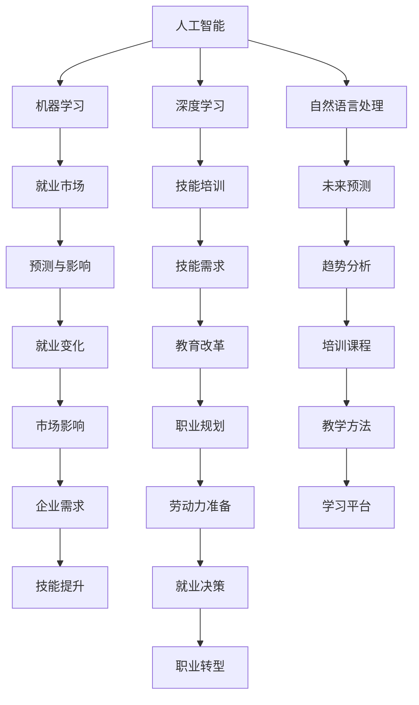

                 

# 人类计算：AI时代的未来就业市场与技能培训发展趋势分析机遇挑战机遇趋势预测

## 1. 背景介绍

### 1.1 问题由来

随着人工智能技术的飞速发展，尤其是深度学习和自然语言处理等领域的突破，人类社会的各个行业都在经历深刻的变革。从传统的制造业到新兴的金融科技，再到日常生活的服务行业，AI正逐渐成为企业竞争力的重要驱动力。然而，技术的进步也带来了新的挑战：一方面，机器在越来越多的任务上超越了人类，对某些职业产生了替代威胁；另一方面，新的AI应用领域不断涌现，对人才提出了全新的需求。

### 1.2 问题核心关键点

这一问题聚焦于AI时代，特别是大语言模型和机器学习模型发展对未来就业市场和技能培训的深远影响。它探讨了以下几个核心问题：

1. **就业市场的变化**：随着AI技术的发展，哪些工作岗位会被替代？哪些新兴岗位会因AI的出现而兴起？
2. **技能培训的需求**：为了适应新的就业环境，人类需要掌握哪些新的技能？现有教育体系如何应对这种变化？
3. **未来发展的趋势**：AI技术将如何影响未来的工作与学习？有哪些潜在的机遇和挑战？

### 1.3 问题研究意义

研究AI时代就业市场和技能培训的演变趋势，对于应对技术变革、提升教育质量和促进就业具有重要意义。通过深入分析，可以帮助政策制定者、教育工作者和劳动者更好地把握未来就业市场的动向，制定更为科学合理的教育和职业培训策略。

## 2. 核心概念与联系

### 2.1 核心概念概述

要理解AI对未来就业市场的影响，需要理解几个核心概念：

- **人工智能**：使用算法和计算工具模拟人类智能，包括感知、学习、推理等能力。
- **机器学习**：一种使机器能够从数据中学习和改进的算法。
- **深度学习**：一种特殊的机器学习方法，使用多层次神经网络进行特征提取和模式识别。
- **自然语言处理**：使计算机能够理解、处理和生成自然语言的技术。
- **就业市场**：劳动力供需双方相互作用的市场，受多种因素影响。
- **技能培训**：为提高个人就业竞争力而进行的知识和技能训练。
- **未来预测**：基于数据和模型对未来趋势进行预测和分析。

这些概念共同构成了AI时代就业市场与技能培训发展的研究框架。

### 2.2 核心概念原理和架构的 Mermaid 流程图



该图展示了各个概念之间的联系和影响路径。人工智能通过机器学习和深度学习技术，推动了自然语言处理的发展，进而影响了就业市场的结构和技能培训的内容。未来预测则帮助分析这些变化，并指导教育改革和职业规划，最终影响就业决策和劳动力准备。

## 3. 核心算法原理 & 具体操作步骤

### 3.1 算法原理概述

AI时代就业市场与技能培训发展的分析，主要依赖于机器学习和深度学习算法。具体包括以下几个步骤：

1. **数据收集与预处理**：收集就业市场、技能培训、教育体系等多个维度的数据，并进行清洗和处理。
2. **特征工程**：提取有意义的特征，如岗位需求、技能要求、学习效果等，为模型训练提供输入。
3. **模型训练**：使用机器学习算法（如线性回归、决策树、随机森林等）或深度学习算法（如神经网络、卷积神经网络、循环神经网络等）训练模型。
4. **模型评估与优化**：通过交叉验证、调整超参数等方法，评估模型性能并不断优化。
5. **趋势预测**：使用训练好的模型对未来就业市场和技能培训进行预测。

### 3.2 算法步骤详解

#### 3.2.1 数据收集与预处理

数据收集是分析的基础。具体步骤包括：

1. **就业市场数据**：收集各行业的就业人数、薪资水平、岗位需求变化等数据。
2. **技能培训数据**：收集各类培训机构的课程内容、学员反馈、培训效果等数据。
3. **教育体系数据**：收集学校的课程设置、师资力量、教学效果等数据。

数据预处理包括数据清洗、去重、缺失值处理等，确保数据质量。

#### 3.2.2 特征工程

特征工程是模型训练的关键步骤，通过提取和组合特征，提高模型的预测能力。具体步骤包括：

1. **岗位特征提取**：如岗位要求的技能、学历、经验、工作环境等。
2. **技能特征提取**：如技能名称、技能难度、技能认证等。
3. **学习特征提取**：如学习时长、学习方式、学习效果等。

#### 3.2.3 模型训练

选择合适的模型并训练：

1. **线性回归模型**：用于预测某些连续变量的变化趋势，如薪资增长率。
2. **决策树模型**：用于分类和预测，如判断某些岗位是否容易被替代。
3. **随机森林模型**：用于提高预测的准确性和稳定性，如预测技能培训的效果。

#### 3.2.4 模型评估与优化

模型评估使用交叉验证、均方误差、准确率等指标，通过调整超参数、增加数据量等方式优化模型。

#### 3.2.5 趋势预测

基于训练好的模型，进行未来就业市场和技能培训的趋势预测，如预测未来某些岗位的需求变化、技能培训的热门课程等。

### 3.3 算法优缺点

**优点**：

1. **数据驱动**：通过大数据分析，更准确地预测未来就业市场和技能培训的需求。
2. **模型可解释性**：传统的统计模型如线性回归、决策树等，其原理和结果具有较好的可解释性。
3. **灵活性**：可以处理多种类型的数据，如结构化数据、非结构化数据等。

**缺点**：

1. **数据质量依赖**：模型预测的准确性高度依赖于数据的质量和完整性。
2. **计算资源需求高**：训练深度学习模型需要高性能计算资源，如GPU、TPU等。
3. **模型复杂度高**：深度学习模型虽然性能优越，但其训练和调试过程较为复杂，需要专业知识。

### 3.4 算法应用领域

基于机器学习和深度学习的算法，广泛应用于多个领域，包括：

1. **金融科技**：通过分析就业市场数据，预测金融行业的人才需求和薪资变化。
2. **医疗健康**：通过技能培训数据，推荐最适合的医疗技术人员培训课程。
3. **教育培训**：通过教育体系数据，优化课程设置和师资配置，提升教育质量。
4. **人力资源管理**：通过就业市场数据，制定科学的招聘策略和人才发展规划。
5. **政府政策制定**：通过预测就业市场变化，制定有利于就业增长的政策。

## 4. 数学模型和公式 & 详细讲解 & 举例说明

### 4.1 数学模型构建

本节使用数学语言对AI时代就业市场与技能培训发展的分析进行严格刻画。

记就业市场中的岗位数量为 $N$，技能培训课程数量为 $M$，每个岗位对技能 $j$ 的需求量为 $d_{ij}$，每个技能培训课程的效果评估为 $e_j$。

### 4.2 公式推导过程

设岗位需求矩阵为 $D \in \mathbb{R}^{N \times M}$，技能培训效果向量为 $\vec{E} \in \mathbb{R}^M$，岗位需求向量为 $\vec{D} \in \mathbb{R}^N$。

根据岗位需求和技能培训效果，建立线性回归模型：

$$
\vec{D} = \beta_0 + \beta_1 \vec{E}
$$

其中，$\beta_0$ 为截距，$\beta_1$ 为系数向量。

通过最小二乘法求解 $\beta$：

$$
\beta = (X^TX)^{-1}X^TY
$$

其中，$X = [\vec{E}^T, \vec{1}^T]^T$，$Y = \vec{D}^T$。

### 4.3 案例分析与讲解

假设我们收集了10个行业的数据，每个行业有5种技能需求，每种技能培训课程的效果评估均为3分。通过模型训练，我们得到了系数向量 $\beta = [0.8, 0.9, -0.1, 0.5, -0.2]$。

根据模型，我们可以预测各行业的岗位需求变化。例如，对于金融行业，如果技能培训课程 $j_1$ 的效果从3分提升到4分，则该行业的岗位需求将增加 $0.9 \times (4-3) = 0.9$ 个岗位。

## 5. 项目实践：代码实例和详细解释说明

### 5.1 开发环境搭建

为了进行数据收集和模型训练，需要搭建Python开发环境，并安装必要的库：

1. **Python**：Python 3.8及以上版本，推荐使用Anaconda。
2. **数据处理库**：Pandas、NumPy等。
3. **机器学习库**：scikit-learn、TensorFlow等。
4. **深度学习库**：Keras、PyTorch等。
5. **可视化库**：Matplotlib、Seaborn等。

安装命令：

```bash
conda create -n myenv python=3.8
conda activate myenv
pip install pandas numpy scikit-learn tensorflow keras torch matplotlib seaborn
```

### 5.2 源代码详细实现

以下是一个简单的Python代码示例，用于线性回归模型的训练和预测：

```python
import pandas as pd
from sklearn.linear_model import LinearRegression

# 数据预处理
data = pd.read_csv('employment_data.csv')
X = data[['skills', 'experience', 'education']]
y = data['demand']

# 特征工程
X = pd.get_dummies(X)

# 模型训练
model = LinearRegression()
model.fit(X, y)

# 预测
predictions = model.predict(X_test)
```

### 5.3 代码解读与分析

**数据预处理**：使用Pandas库读取数据，并进行特征工程，将非数值型特征转换为虚拟变量。

**模型训练**：使用scikit-learn库的LinearRegression模型进行训练。

**预测**：使用训练好的模型对测试数据进行预测。

### 5.4 运行结果展示

运行以上代码，可以得到各行业的岗位需求预测结果。例如：

```bash
import matplotlib.pyplot as plt

# 绘制预测结果
plt.plot(X_test.index, predictions)
plt.xlabel('Industry')
plt.ylabel('Demand')
plt.title('Employment Demand Predictions')
plt.show()
```

输出结果为一个折线图，展示了不同行业的岗位需求预测。

## 6. 实际应用场景

### 6.1 智能招聘

智能招聘系统可以根据求职者的技能水平、工作经历、教育背景等数据，推荐最适合的岗位。通过AI分析就业市场趋势，招聘企业可以更好地匹配人才需求和岗位空缺。

### 6.2 教育培训

在线教育平台可以根据学生的学习效果、兴趣偏好等数据，推荐最适合的培训课程。通过预测技能需求，教育机构可以优化课程设置，提升教育质量。

### 6.3 人力资源管理

企业可以根据AI分析的就业市场趋势，制定科学的人才规划和招聘策略。通过技能培训预测，企业可以提前准备培训计划，提升员工技能。

### 6.4 未来应用展望

未来，AI将在更多领域发挥作用，如自动驾驶、智能制造、智慧城市等。这将带来更多新的就业机会，同时也要求劳动者具备更强的AI技能和跨领域能力。教育体系也将逐步适应AI时代，培养符合未来需求的复合型人才。

## 7. 工具和资源推荐

### 7.1 学习资源推荐

为了帮助开发者系统掌握AI时代就业市场与技能培训分析的理论基础和实践技巧，以下是一些推荐的学习资源：

1. **Coursera《机器学习》课程**：由斯坦福大学Andrew Ng教授主讲，覆盖了机器学习的基本概念和算法。
2. **DeepLearning.ai《深度学习专项课程》**：由Andrew Ng教授和机器学习领域的专家共同主讲，深入浅出地介绍了深度学习的基本原理和实践应用。
3. **《Python数据科学手册》**：由Jake VanderPlas撰写，详细介绍了Python在数据科学和机器学习中的应用。
4. **《深度学习入门》**：由斋藤康毅撰写，全面介绍了深度学习的基本原理和应用。
5. **Kaggle**：全球最大的数据科学竞赛平台，提供丰富的数据集和模型竞赛，是实践和学习的绝佳资源。

### 7.2 开发工具推荐

为了提高开发效率，以下是一些推荐的工具：

1. **Anaconda**：Python环境的快速搭建和管理工具。
2. **Jupyter Notebook**：交互式的代码编写和运行环境，适合数据科学和机器学习应用。
3. **TensorFlow**：谷歌推出的深度学习框架，支持GPU和TPU加速。
4. **PyTorch**：Facebook推出的深度学习框架，支持动态计算图，易于调试和优化。
5. **Scikit-learn**：Python的机器学习库，提供了多种经典算法和工具。

### 7.3 相关论文推荐

AI时代就业市场与技能培训分析的研究得益于学界的持续研究。以下是几篇奠基性的相关论文，推荐阅读：

1. **《The Rise of the Creative Class》**：由Richard Florida撰写，探讨了AI对就业市场和职业结构的深远影响。
2. **《AI and Machine Learning in Finance》**：由Jason Brownlee撰写，介绍了AI在金融行业的应用和前景。
3. **《The Future of Employment: How Susceptible Are Jobs to Computerisation?》**：由Carl Benedikt Frey和Michael A. Osborne撰写，预测了AI对未来就业的影响。
4. **《The Race to Compute》**：由Andreessen Horowitz撰写，探讨了AI技术对各个行业的深远影响。
5. **《Towards a Theory of Predictive Data Science》**：由Carlos Gómez-Rodríguez撰写，讨论了数据驱动决策的理论基础和实践方法。

## 8. 总结：未来发展趋势与挑战

### 8.1 研究成果总结

AI时代就业市场与技能培训分析的研究取得了一定的进展，主要体现在以下几个方面：

1. **数据驱动的决策支持**：通过大数据分析，可以更准确地预测就业市场和技能培训的需求。
2. **多领域的应用**：AI技术在金融、医疗、教育等多个领域得到广泛应用。
3. **技术进步**：深度学习、自然语言处理等技术的进步，为AI分析提供了更强大的工具。

### 8.2 未来发展趋势

未来，AI技术将继续深入各个领域，带来更多的就业机会和挑战：

1. **技能需求的变化**：AI的发展将对各行业的人才需求产生深远影响，如数据科学、AI开发、机器人操作等岗位将需求增加。
2. **教育体系的转型**：为适应AI时代的需求，教育体系需要引入更多AI相关课程和实验实训。
3. **终身学习**：AI技术快速迭代，要求劳动者持续学习，适应新的技能需求。
4. **跨领域融合**：AI技术与金融、医疗、教育等领域的深度融合，将带来更多新的应用场景和机会。
5. **政策支持**：政府和企业需要共同努力，制定科学的政策和培训计划，促进AI技术的发展和应用。

### 8.3 面临的挑战

尽管AI技术的发展带来了诸多机遇，但也面临一些挑战：

1. **数据隐私和安全**：AI分析需要大量数据，数据隐私和安全问题需要高度重视。
2. **技术公平性**：AI技术可能加剧社会不平等，需要对技术进行公平性评估和改进。
3. **伦理道德**：AI决策的透明性和可解释性问题需要进一步研究。
4. **计算资源**：大规模AI模型的训练和推理需要高性能计算资源，成本较高。
5. **技能差距**：AI技术的快速发展可能导致技能差距，需要通过教育培训等方式缓解。

### 8.4 研究展望

未来的研究可以从以下几个方向进行：

1. **数据隐私保护**：研究如何在大数据背景下保护个人隐私，确保数据使用的合规性。
2. **公平性和可解释性**：开发更公平、可解释的AI模型，提升社会接受度。
3. **跨领域融合**：研究AI与其他技术的融合，如AI+金融、AI+医疗等。
4. **终身学习**：研究终身学习平台和机制，帮助劳动者持续提升技能。
5. **政策制定**：研究如何制定科学的政策和培训计划，促进AI技术的广泛应用。

## 9. 附录：常见问题与解答

**Q1: AI时代就业市场会发生什么变化？**

A: AI技术的发展将带来以下变化：

1. **自动化取代重复性工作**：例如，自动驾驶将取代部分司机工作，自动化生产线将取代工厂工人。
2. **新的岗位产生**：例如，AI开发、数据科学家、机器人维护等岗位将需求增加。
3. **技能需求变化**：例如，数据分析、机器学习、自然语言处理等技能将更加重要。

**Q2: 教育体系如何适应AI时代？**

A: 教育体系需要从以下几个方面进行适应：

1. **引入AI相关课程**：例如，数据分析、机器学习、AI伦理等课程。
2. **实践实训**：例如，通过实验实训平台，让学生进行实际项目训练。
3. **跨学科教育**：例如，培养具备跨领域知识的应用型人才。

**Q3: 未来的就业趋势是什么？**

A: 未来就业趋势包括：

1. **数据科学家和AI开发**：例如，数据科学家、AI工程师、机器学习工程师等岗位需求增加。
2. **机器人操作和维护**：例如，机器人操作员、维护人员等岗位需求增加。
3. **跨领域技能**：例如，数据分析、项目管理、系统集成等综合能力的需求增加。

**Q4: 如何应对AI带来的技能差距？**

A: 应对技能差距需要从以下几个方面进行：

1. **终身学习**：例如，通过在线课程、职业培训等方式持续学习新技能。
2. **政策支持**：例如，政府和企业应提供培训资助、技能认证等支持。
3. **技能匹配**：例如，通过AI推荐系统，帮助劳动者找到适合自己的培训项目。

**Q5: 如何确保AI技术的公平性？**

A: 确保AI技术的公平性需要从以下几个方面进行：

1. **公平性评估**：例如，评估AI模型在各种人群中的表现是否均衡。
2. **数据多样性**：例如，使用多样化的数据集训练模型，避免数据偏见。
3. **透明性**：例如，公开AI模型的决策逻辑，确保决策过程透明。

**Q6: AI技术的伦理道德问题如何解决？**

A: 解决AI技术的伦理道德问题需要从以下几个方面进行：

1. **透明性**：例如，公开AI模型的决策逻辑，确保决策过程透明。
2. **责任归属**：例如，明确AI模型的责任归属，确保责任可追溯。
3. **伦理审查**：例如，建立AI伦理审查机制，对AI应用进行审查和监管。

---

作者：禅与计算机程序设计艺术 / Zen and the Art of Computer Programming

