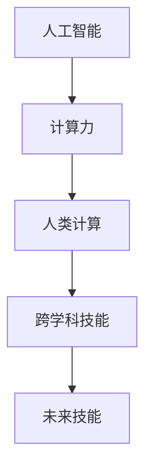
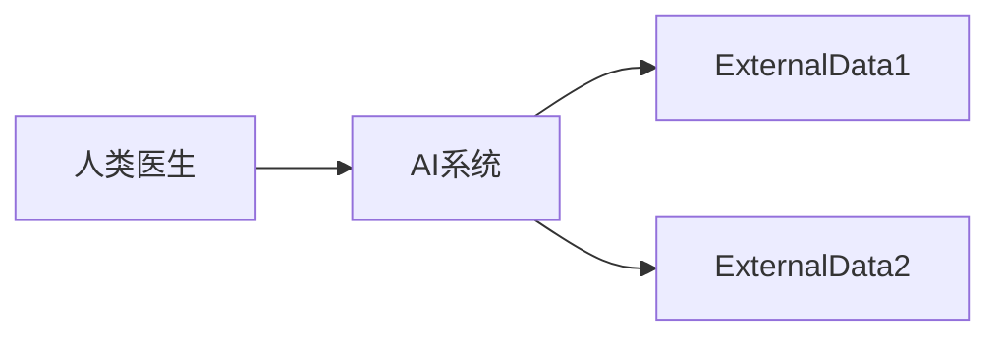

                 

# 人类计算：AI时代的未来技能发展与培训

> 关键词：人工智能,计算力,未来技能,培训,人工智能教育,技术普及

## 1. 背景介绍

随着人工智能(AI)技术的飞速发展，计算已经成为人类社会最核心的生产力要素之一。特别是在AI时代，计算不再仅仅局限于数据处理、算法优化等技术层面，更成为人类智慧与机器智能融合的重要桥梁。

### 1.1 计算力与人机协同

计算力的发展，显著提升了人类处理复杂问题的能力。AI模型如深度学习、自然语言处理等，依赖于庞大的计算资源支持。计算力不仅决定了机器学习算法的精度和效率，更决定了AI系统能够承载的任务复杂度和泛化能力。

未来，随着量子计算、分布式计算等新技术的不断突破，计算力将进一步指数级提升，为人类社会带来革命性的变革。但与此同时，AI时代对人类的计算力也提出了更高的要求，推动了跨学科技能和跨领域协同的发展趋势。

### 1.2 AI教育与技能培训

AI教育已成为全球教育体系的新热点。从儿童启蒙到成人职业培训，从基础教育到继续教育，AI相关的计算力培训正在全面铺开。计算力不仅仅是编程、算法等专业技能，更是跨学科融合、跨领域协同的通用能力。

在AI时代，计算力的提升将激发人类智慧的新维度，推动科学、技术、工程、艺术等多领域协同创新。计算力的普及与提升，不仅是产业升级的必由之路，更是人类文明进步的必然选择。

## 2. 核心概念与联系

### 2.1 核心概念概述

本节将介绍几个密切相关的核心概念：

- 人工智能(Artificial Intelligence, AI)：指通过计算机模拟人类智能行为的技术。主要包括机器学习、深度学习、自然语言处理、计算机视觉等子领域。

- 计算力(Computational Power)：指硬件和软件结合，以计算速度和精度为指标的综合能力。是人工智能系统高效运行的基础。

- 人类计算(Human Computing)：指利用人类智慧和认知能力，与AI系统协同完成任务的计算方式。人类计算强调人机协同、跨学科融合。

- 跨学科技能(Interdisciplinary Skills)：指结合多学科知识的通用计算能力。如数据科学、计算机科学、心理学等领域的综合应用。

- 未来技能(Future Skills)：指适应未来技术发展趋势，需要掌握的新技能。如机器学习、自然语言处理、人工智能伦理等。

这些核心概念之间的逻辑关系可以通过以下Mermaid流程图来展示：



这个流程图展示了一系列概念之间的内在联系：

1. 人工智能依赖于强大的计算力支持。
2. 人类计算将人类智慧与AI系统相结合，实现更高效、更灵活的计算。
3. 跨学科技能是人工智能发展的基础，也是未来技能的重要组成部分。
4. 未来技能则是推动人工智能技术普及和应用的关键。

这些概念共同构成了AI时代技能发展与培训的基础框架，使我们能够更好地理解和应用人工智能技术。

## 3. 核心算法原理 & 具体操作步骤

### 3.1 算法原理概述

人类计算的核心在于人机协同。通过将复杂的计算任务分解为人类能够理解和处理的子任务，并结合AI系统的高效计算能力，实现整个任务的协同完成。

形式化地，假设有一个计算任务 $T$，将其分解为若干子任务 $T_1, T_2, \dots, T_n$。每个子任务 $T_i$ 由人类 $H$ 和AI系统 $A$ 共同完成。其中 $H$ 负责理解任务要求，规划计算路径，并根据计算结果生成最终输出。$A$ 则负责执行具体的计算操作，快速处理大量数据。任务完成的过程可以表示为：

$$
\text{Output} = H \times (A \times T_1) \times (A \times T_2) \times \dots \times (A \times T_n)
$$

其中 $\times$ 表示协同计算的过程，$H$ 和 $A$ 通过协同工作，共同完成整个计算任务。

### 3.2 算法步骤详解

基于人机协同的计算原理，人类计算的实际操作步骤如下：

**Step 1: 任务分解与子任务设计**
- 将复杂任务分解为若干子任务，每个子任务需要人类和AI系统协同完成。
- 设计每个子任务的执行流程，明确人类和AI系统的职责和交互方式。

**Step 2: 人工智能系统选择**
- 选择合适的AI系统，如深度学习模型、自然语言处理工具等，作为计算的核心组件。
- 根据任务特点，选择合适的预训练模型和算法，准备相关数据集。

**Step 3: 人类计算环境搭建**
- 搭建适合人类操作的计算环境，包括用户界面、交互工具等。
- 设计易于理解的任务说明和操作流程，降低人类计算的难度。

**Step 4: 人机协同计算**
- 将任务描述输入AI系统，进行初始计算。
- 人类根据AI系统的计算结果，进行二次判断和调整。
- 重复上述过程，直至计算任务完成。

**Step 5: 结果输出与反馈**
- 将计算结果输出，提供给用户或进一步的下游任务处理。
- 根据用户反馈和计算结果，对AI系统进行优化，提升计算效率和精度。

### 3.3 算法优缺点

基于人机协同的计算方法具有以下优点：
1. 高效协同：人类和AI系统各司其职，优势互补，实现高效计算。
2. 灵活适应：人类可以根据任务需要进行灵活调整，快速应对复杂问题。
3. 跨学科融合：结合多学科知识，提升计算任务的综合能力。

同时，该方法也存在一些局限性：
1. 对人类操作要求高：需要人类具备一定的计算理解和判断能力，培训成本较高。
2. 任务适应性差：复杂任务可能需要更复杂的协同流程，易出现瓶颈。
3. 计算过程复杂：多层次协同计算增加了过程的复杂性，可能导致理解和操作难度增加。

尽管存在这些局限性，但人机协同计算仍是AI时代高效、灵活计算的重要手段，尤其适用于需要高度定制化、复杂化计算的任务场景。

### 3.4 算法应用领域

基于人机协同的计算方法，已经在多个领域得到了应用，例如：

- 医疗诊断：通过AI系统初步分析医疗影像、基因数据等，人类医生再结合经验进行诊断和治疗。
- 金融分析：AI系统处理海量交易数据，人类分析师再结合市场动态进行决策。
- 工业制造：AI系统控制生产线设备，人类工程师再根据反馈进行调整和优化。
- 教育培训：AI系统提供个性化学习路径，人类教师再结合教学经验进行指导。
- 艺术创作：AI系统生成创作素材，人类艺术家再结合创作灵感进行创作。

此外，人机协同计算还广泛应用于智能家居、智慧城市、环保监测等新兴领域，推动了智能社会的建设。

## 4. 数学模型和公式 & 详细讲解 & 举例说明

### 4.1 数学模型构建

人机协同计算的数学模型可以抽象为一个计算网络。其中，人类计算节点和AI计算节点通过通信链路连接，共同完成计算任务。

假设任务 $T$ 需要 $n$ 个子任务 $T_1, T_2, \dots, T_n$ 协同完成，每个子任务由人类节点 $H_i$ 和AI节点 $A_i$ 协同计算。其中 $H_i$ 负责对 $A_i$ 的计算结果进行分析和调整。整个计算网络可以表示为：

$$
G = (V,E)
$$

其中 $V = \{H_1, H_2, \dots, H_n, A_1, A_2, \dots, A_n\}$ 表示所有节点集合，$E$ 表示节点之间的通信链路集合。每个节点 $H_i$ 和 $A_i$ 都有一个唯一的标识符 $i$，用于标识其在计算网络中的位置。

### 4.2 公式推导过程

以医疗诊断为例，推导人机协同计算的数学模型。

假设医生和AI系统共同处理一个患者病例，涉及多个医学指标的分析和判断。医生负责理解病情描述，设计计算路径，并结合AI系统的结果进行诊断。AI系统负责处理医学图像、基因数据等，输出初步的诊断结果。

首先，将问题抽象为一个有向图 $G = (V,E)$，其中 $V = \{H, A\}$，$E$ 表示 $H$ 和 $A$ 之间的通信链路。假设 $H$ 通过 $E_1$ 和 $A$ 连接，$A$ 通过 $E_2$ 和 $E_3$ 分别与 $H$ 和外部数据源连接，具体如下图所示：



医生将病情描述输入AI系统，AI系统进行初步分析并输出结果。医生根据AI系统的结果，进一步分析判断并生成诊断报告。整个过程可以表示为：

$$
\text{Report} = H \times (A \times Report_1) \times (A \times Report_2)
$$

其中 $Report_1$ 和 $Report_2$ 分别表示AI系统输出的初步分析和外部数据源的处理结果。

### 4.3 案例分析与讲解

考虑一个复杂的计算任务：金融市场数据处理和分析。

金融市场数据量大、实时性强，需要高效的计算支持。AI系统可以处理历史数据和实时数据，提取市场趋势和异常信号。人类分析师则负责根据市场动态，结合AI系统的分析结果，进行投资决策。

将任务分解为多个子任务，每个子任务由人类和AI系统协同完成。具体步骤如下：

**Step 1: 任务分解**
- 历史数据预处理：AI系统进行数据清洗、归一化等预处理操作。
- 实时数据监控：AI系统实时监控市场动态，提取异常信号。
- 市场分析：人类分析师结合AI系统的分析结果，进行趋势预测和风险评估。
- 投资决策：人类分析师根据市场分析和风险评估，做出投资决策。

**Step 2: 人工智能系统选择**
- 选择合适的AI系统，如TensorFlow、PyTorch等，进行数据处理和分析。
- 设计合适的算法，如卷积神经网络、循环神经网络等，进行市场趋势和异常信号的提取。

**Step 3: 人类计算环境搭建**
- 搭建适合人类操作的界面，如Tableau、Excel等，提供数据可视化工具。
- 设计易于理解的任务说明，指导人类分析师进行数据处理和分析。

**Step 4: 人机协同计算**
- 将市场数据输入AI系统，进行初步处理和分析。
- 人类分析师根据AI系统的结果，进行二次判断和调整。
- 重复上述过程，直至完成投资决策。

**Step 5: 结果输出与反馈**
- 将投资决策输出，提供给投资团队。
- 根据投资效果和市场动态，对AI系统进行优化，提升计算效率和精度。

## 5. 项目实践：代码实例和详细解释说明

### 5.1 开发环境搭建

在进行人机协同计算项目实践前，我们需要准备好开发环境。以下是使用Python进行TensorFlow开发的示例环境配置流程：

1. 安装Anaconda：从官网下载并安装Anaconda，用于创建独立的Python环境。

2. 创建并激活虚拟环境：
```bash
conda create -n tf-env python=3.8 
conda activate tf-env
```

3. 安装TensorFlow：根据CUDA版本，从官网获取对应的安装命令。例如：
```bash
conda install tensorflow -c pytorch -c conda-forge
```

4. 安装TensorBoard：TensorFlow配套的可视化工具，实时监测模型训练状态。
```bash
conda install tensorboard
```

5. 安装相关依赖包：
```bash
pip install numpy pandas matplotlib scikit-learn tqdm
```

完成上述步骤后，即可在`tf-env`环境中开始项目实践。

### 5.2 源代码详细实现

下面以金融市场数据处理和分析为例，给出使用TensorFlow和TensorBoard进行人机协同计算的代码实现。

首先，定义数据处理函数：

```python
import tensorflow as tf
import numpy as np
import pandas as pd

def preprocess_data(df):
    # 数据清洗、归一化等预处理操作
    df = df.dropna()
    df = df / df.max()
    return df

# 加载历史数据
history_data = pd.read_csv('history_data.csv')

# 数据预处理
processed_data = preprocess_data(history_data)
```

然后，定义AI系统模型：

```python
class MarketAnalysisModel(tf.keras.Model):
    def __init__(self, input_shape):
        super(MarketAnalysisModel, self).__init__()
        self.fc1 = tf.keras.layers.Dense(64, activation='relu', input_shape=input_shape)
        self.fc2 = tf.keras.layers.Dense(32, activation='relu')
        self.fc3 = tf.keras.layers.Dense(1, activation='sigmoid')

    def call(self, x):
        x = self.fc1(x)
        x = self.fc2(x)
        x = self.fc3(x)
        return x
```

接着，定义人类计算的交互界面：

```python
from IPython.display import display

def human_computing_interface(df, model):
    # 显示数据可视化
    display(df)
    
    # 获取用户输入
    user_input = input("请输入您的市场分析结果: ")
    
    # 进行市场分析
    analyzed_result = model.predict(np.array(user_input).reshape(1, -1))
    print("AI系统分析结果: ", analyzed_result)
    
    # 生成投资决策
    decision = '买入' if analyzed_result > 0.5 else '卖出'
    print("投资决策: ", decision)
    
    # 显示最终决策
    display(pd.DataFrame({'市场分析结果': user_input, 'AI系统分析结果': analyzed_result, '投资决策': decision}))
```

最后，启动计算流程：

```python
model = MarketAnalysisModel(input_shape=(processed_data.shape[1],))
model.compile(optimizer='adam', loss='binary_crossentropy', metrics=['accuracy'])

# 训练AI系统模型
model.fit(processed_data.drop('target', axis=1), processed_data['target'], epochs=100, batch_size=32)

# 进行市场分析
human_computing_interface(processed_data, model)
```

以上代码实现了基于TensorFlow的人机协同计算系统。通过TensorBoard，可以实时监测模型训练过程，评估计算结果。最终，系统将用户输入的市场分析结果和AI系统的分析结果输出，帮助人类分析师进行投资决策。

### 5.3 代码解读与分析

让我们再详细解读一下关键代码的实现细节：

**preprocess_data函数**：
- 对输入的原始数据进行清洗、归一化等预处理操作，确保数据符合模型输入的要求。

**MarketAnalysisModel类**：
- 定义了AI系统模型的架构，包括两个全连接层和一个输出层，用于处理市场数据并输出分析结果。

**human_computing_interface函数**：
- 通过IPython.display展示数据可视化，获取用户输入的市场分析结果。
- 调用AI系统模型进行市场分析，输出结果。
- 根据分析结果，生成投资决策并展示。

**主函数**：
- 创建AI系统模型并编译，准备训练数据。
- 训练AI系统模型，确保其准确性。
- 调用人类计算接口，进行市场分析和投资决策。

可以看到，TensorFlow提供了强大的计算能力和可视化工具，使得人机协同计算的实现变得简单高效。

## 6. 实际应用场景

### 6.1 智慧城市治理

智慧城市治理是未来城市管理的重要方向。通过AI技术，可以实现对城市事件的实时监测、智能分析和应急响应。

人机协同计算可以应用于城市事件的监测和分析。AI系统可以实时监控城市中的摄像头、传感器等设备，提取异常信号。人类管理者再结合AI系统的分析结果，进行事件判断和应急响应。

**应用流程**：
- AI系统实时监控城市事件，提取异常信号。
- 人类管理者根据AI系统的分析结果，进行事件判断和应急响应。
- 根据事件处理效果，对AI系统进行优化，提升监测精度和响应效率。

### 6.2 智慧医疗诊断

智慧医疗诊断是医疗健康的重要方向。通过AI技术，可以实现对医疗影像、基因数据等复杂信息的快速处理和分析。

人机协同计算可以应用于医疗影像诊断和基因数据分析。AI系统可以处理海量医疗数据，提取诊断特征。人类医生再结合AI系统的分析结果，进行疾病诊断和治疗。

**应用流程**：
- AI系统处理医疗影像、基因数据等，提取诊断特征。
- 人类医生结合AI系统的分析结果，进行疾病诊断和治疗。
- 根据诊断效果，对AI系统进行优化，提升诊断精度和效率。

### 6.3 智能教育培训

智能教育培训是教育领域的重要方向。通过AI技术，可以实现对学生学习行为和兴趣的个性化分析和推荐。

人机协同计算可以应用于学生学习行为的分析和推荐。AI系统可以处理学生学习数据，提取学习特征。人类教师再结合AI系统的分析结果，进行个性化推荐和辅导。

**应用流程**：
- AI系统处理学生学习数据，提取学习特征。
- 人类教师结合AI系统的分析结果，进行个性化推荐和辅导。
- 根据学习效果，对AI系统进行优化，提升推荐精度和效率。

### 6.4 未来应用展望

随着人机协同计算技术的不断进步，其在更多领域的应用前景将更加广阔：

- 工业制造：通过人机协同，提升生产线的智能化水平，实现精确控制和优化。
- 农业生产：通过人机协同，提升农业机械的智能水平，优化种植和收割过程。
- 环境保护：通过人机协同，提升环境监测的智能化水平，实现实时预警和应急响应。
- 艺术创作：通过人机协同，提升艺术创作的多样性和创意性，推动艺术创新。
- 军事应用：通过人机协同，提升军事决策的智能化水平，实现战场智能分析和战略优化。

未来，人机协同计算将在更多领域大放异彩，为人类社会带来革命性的变革。

## 7. 工具和资源推荐

### 7.1 学习资源推荐

为了帮助开发者系统掌握人机协同计算的理论基础和实践技巧，这里推荐一些优质的学习资源：

1. 《人工智能与计算力》系列博文：由AI领域专家撰写，深入浅出地介绍了AI技术的计算力驱动原理，以及人机协同计算的基本概念和实现方法。

2. 《深度学习基础》课程：斯坦福大学开设的深度学习入门课程，包含Lecture视频和配套作业，帮助你掌握深度学习的基础知识和应用技能。

3. 《Human-Computer Interaction》书籍：介绍了人机交互的基础理论和技术方法，有助于理解人机协同计算的交互设计。

4. 《Human Computing: From Analog to Digital》文章：探讨了人类计算的历史和未来发展趋势，有助于理解人机协同计算的演变和应用。

5. Coursera《AI for Everyone》课程：由斯坦福大学教授Andrew Ng主讲，介绍了AI技术的基本原理和应用场景，适合对AI感兴趣的初学者。

通过对这些资源的学习实践，相信你一定能够快速掌握人机协同计算的精髓，并用于解决实际的计算问题。

### 7.2 开发工具推荐

高效的开发离不开优秀的工具支持。以下是几款用于人机协同计算开发的常用工具：

1. TensorFlow：由Google主导开发的深度学习框架，适合大规模工程应用，支持分布式计算。

2. PyTorch：由Facebook开发的深度学习框架，灵活动态，适合研究和实验。

3. TensorBoard：TensorFlow配套的可视化工具，实时监测模型训练状态，评估计算结果。

4. Tableau：数据可视化工具，支持多维度数据展示，帮助人类理解计算结果。

5. Microsoft Power BI：商业智能工具，支持大规模数据处理和分析，帮助人类进行决策支持。

6. Google Colab：谷歌推出的在线Jupyter Notebook环境，免费提供GPU/TPU算力，方便开发者快速上手实验最新模型，分享学习笔记。

合理利用这些工具，可以显著提升人机协同计算的开发效率，加快创新迭代的步伐。

### 7.3 相关论文推荐

人机协同计算的研究源于学界的持续研究。以下是几篇奠基性的相关论文，推荐阅读：

1. "Human-Computer Interaction in Situated Learning"（Situated Learning）：探讨了人机协同计算在情境学习中的应用，强调了人与环境、任务的协同关系。

2. "Human-Computer Interaction: Cooperative Computing"：详细介绍了人机协同计算的实现方法，包括任务分解、人机交互、协同计算等。

3. "Human Computing and Multimodal Interaction"：介绍了人机协同计算在多模态交互中的应用，强调了人机协同计算在多模态信息处理中的优势。

4. "Human-Computer Collaboration in Machine Learning"：探讨了人机协同计算在机器学习中的应用，强调了人机协同计算在提升模型性能和可解释性中的作用。

5. "Human-Machine Collaboration in Real-time Decision Making"：介绍了人机协同计算在实时决策中的应用，强调了人机协同计算在提升决策效率和精度中的作用。

这些论文代表了大计算时代协同计算的研究方向，通过学习这些前沿成果，可以帮助研究者把握学科前进方向，激发更多的创新灵感。

## 8. 总结：未来发展趋势与挑战

### 8.1 总结

本文对基于人机协同的计算方法进行了全面系统的介绍。首先阐述了计算力与人机协同的计算背景和意义，明确了人机协同在提升计算效率和智能化水平中的独特价值。其次，从原理到实践，详细讲解了人机协同计算的数学模型和关键步骤，给出了实际应用场景下的代码实例。同时，本文还广泛探讨了人机协同计算在多个行业领域的应用前景，展示了其巨大的潜力。此外，本文精选了协同计算相关的学习资源，力求为读者提供全方位的技术指引。

通过本文的系统梳理，可以看到，人机协同计算方法正在成为未来计算的核心范式，极大地拓展了计算力的应用边界，催生了更多的技术创新。未来，伴随计算力的不断提升和应用场景的不断拓展，人机协同计算必将在更广阔的领域大放异彩。

### 8.2 未来发展趋势

展望未来，人机协同计算技术将呈现以下几个发展趋势：

1. 计算力持续增长：随着量子计算、分布式计算等新技术的不断突破，计算力将进一步指数级提升，为人类社会带来革命性的变革。

2. 人机协同深入融合：人机协同计算将更加深入地应用于各个行业，提升计算任务的综合能力和智能化水平。

3. 多模态协同计算：结合视觉、语音、文本等多模态信息的协同计算，提升计算任务的复杂性和多样性。

4. 实时计算能力提升：通过人机协同计算，提升计算任务的实时性，实现实时决策和响应。

5. 计算结果可解释性增强：通过人机协同计算，增强计算结果的可解释性，提升系统的透明度和可信度。

6. 跨领域协同优化：通过人机协同计算，提升不同领域之间的协同优化能力，实现更高层次的智能化水平。

这些趋势凸显了人机协同计算技术的广阔前景。这些方向的探索发展，必将进一步提升计算任务的性能和应用范围，为智能社会的建设提供新的技术路径。

### 8.3 面临的挑战

尽管人机协同计算技术已经取得了瞩目成就，但在迈向更加智能化、普适化应用的过程中，它仍面临着诸多挑战：

1. 数据隐私和安全性问题：在协同计算过程中，涉及大量数据共享，数据隐私和安全性问题变得尤为突出。如何保护数据隐私，防范数据泄露，将是一大难题。

2. 人机协同效率问题：复杂任务的人机协同计算需要更多的时间和资源，效率问题成为制约协同计算普及的重要因素。如何优化协同流程，提升计算效率，将是一大挑战。

3. 协同计算的通用性和普适性：不同的应用场景和任务，需要不同形式的人机协同计算方法，如何设计通用性的协同计算框架，将是一大难题。

4. 跨学科知识和技能问题：协同计算需要综合应用多学科知识和技能，涉及计算机科学、人工智能、心理学等，知识融合和技能培训成为协同计算的重要环节。如何培养跨学科人才，提升协同计算的实践能力，将是一大挑战。

5. 计算结果的可靠性问题：人机协同计算的输出结果需要具备高可靠性，避免计算过程中的误差和偏差。如何设计可靠的协同计算方法，提高计算结果的准确性，将是一大挑战。

6. 协同计算的可解释性问题：协同计算的结果需要具备可解释性，便于用户理解和应用。如何增强计算结果的可解释性，提升系统的透明度和可信度，将是一大挑战。

这些挑战凸显了人机协同计算技术的复杂性和多样性，需要更多的技术创新和实践探索。相信随着学界和产业界的共同努力，这些挑战终将一一被克服，人机协同计算必将在构建智能社会中发挥更加重要的作用。

### 8.4 研究展望

面对人机协同计算所面临的种种挑战，未来的研究需要在以下几个方面寻求新的突破：

1. 探索更加高效的数据处理和存储技术：利用新兴技术如量子计算、分布式计算等，提升数据处理和存储的效率，降低计算成本。

2. 设计更加灵活多变的协同计算框架：根据不同应用场景和任务，设计灵活多变的协同计算框架，提升计算任务的普适性和可扩展性。

3. 结合更多先验知识进行协同计算：将符号化的先验知识，如知识图谱、逻辑规则等，与神经网络模型进行巧妙融合，提升协同计算的智能化水平。

4. 开发更加智能化的协同计算工具：利用自然语言处理、知识图谱等技术，开发更加智能化、易于使用的协同计算工具，提升协同计算的普及度。

5. 加强跨学科知识的融合与培训：通过跨学科知识和技能培训，提升协同计算的实践能力，培养更多跨学科人才，推动协同计算的深入应用。

6. 引入伦理道德约束：在协同计算的各个环节引入伦理道德约束，确保计算过程的公正性和透明性，提升协同计算的可靠性。

这些研究方向的探索，必将引领人机协同计算技术迈向更高的台阶，为构建智能社会提供新的技术路径。面向未来，人机协同计算技术还需要与其他人工智能技术进行更深入的融合，如知识表示、因果推理、强化学习等，多路径协同发力，共同推动计算力的普及和应用。

## 9. 附录：常见问题与解答

**Q1：人机协同计算是否适用于所有计算任务？**

A: 人机协同计算在大多数计算任务上都能取得不错的效果，特别是对于数据量较小或复杂度较高的任务。但对于一些简单的、标准化的计算任务，直接使用AI系统进行计算可能更为高效。

**Q2：如何选择合适的协同计算节点和任务？**

A: 选择合适的协同计算节点和任务，需要根据具体应用场景和任务特点进行综合考虑。一般来说，复杂任务和数据量大的任务适合人机协同计算，简单任务和数据量小的任务适合AI系统直接计算。

**Q3：人机协同计算的效率如何提升？**

A: 提升人机协同计算的效率，可以从以下几个方面进行优化：
1. 数据预处理：对输入数据进行预处理，减少计算量。
2. 任务分解：将复杂任务分解为更小的子任务，并行处理，提高计算效率。
3. 协同流程设计：优化协同流程，减少交互时间和资源消耗。
4. 计算资源优化：利用分布式计算、混合精度计算等技术，提升计算效率。

**Q4：协同计算过程中如何保护数据隐私？**

A: 保护数据隐私，可以从以下几个方面进行优化：
1. 数据加密：对敏感数据进行加密处理，防止数据泄露。
2. 权限控制：严格控制协同计算过程中的数据访问权限，确保数据安全性。
3. 数据匿名化：对数据进行匿名化处理，减少数据泄露风险。
4. 安全审计：定期进行安全审计，确保数据处理和存储的安全性。

**Q5：人机协同计算的结果如何评估？**

A: 人机协同计算的结果评估可以从以下几个方面进行：
1. 准确性评估：通过精度、召回率等指标评估计算结果的准确性。
2. 可解释性评估：通过可视化、解释性模型等方法，评估计算结果的可解释性。
3. 可靠性评估：通过多轮实验和对比，评估计算结果的可靠性。
4. 用户满意度评估：通过用户反馈，评估计算结果的实用性。

通过这些评估方法，可以帮助评估人机协同计算的性能和效果，提升协同计算的实用性和可靠性。

---

作者：禅与计算机程序设计艺术 / Zen and the Art of Computer Programming

