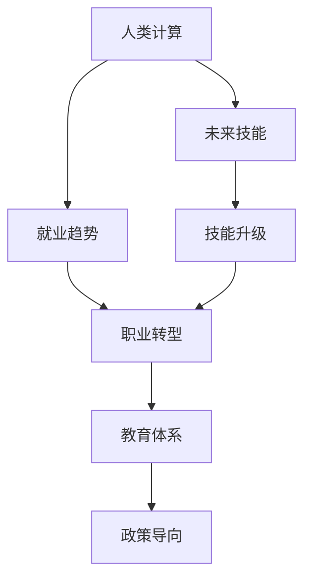

                 

# 人类计算：AI时代的未来技能发展与就业趋势

> 关键词：人工智能(AI)，人类计算，未来技能，就业趋势，技能升级，自动化，职业转型，教育体系，政策导向

## 1. 背景介绍

### 1.1 问题由来
在快速发展的AI时代，自动化、智能化技术逐渐渗透到各行各业。传统的职业结构和就业市场正在经历深刻的变革。传统劳动力密集型行业正在逐步被机器取代，而需要创造性思维和综合判断能力的岗位则显得更为珍贵。如何提升人类的计算能力和技能，以适应AI时代的发展需求，成为了当务之急。

### 1.2 问题核心关键点
未来技能发展与就业趋势的核心在于：如何提升人类的计算能力，使其在AI时代中能够与机器相抗衡，同时结合智能技术实现新的职业转型和职业升级。关键点包括：
- 人类计算能力的提升与升级
- AI时代新的就业市场和技术岗位
- 教育体系与职业培训的改革和调整
- 政策导向与企业策略的协调

### 1.3 问题研究意义
研究人类计算技能的发展和就业趋势，对于保障劳动力市场平稳过渡，提升社会整体竞争力具有重要意义。
- 为劳动力市场的转型提供参考和指导。
- 为教育机构和政策制定者提供数据支持和策略方向。
- 为企业的招聘和培训策略提供实用建议。
- 帮助个人明确职业发展方向和提升自我竞争力。

## 2. 核心概念与联系

### 2.1 核心概念概述

为了更好地理解人类计算技能和就业趋势，本节将介绍几个核心概念：

- **人类计算(Human Computing)**：指通过人类与智能系统的协作，完成原本由机器处理的任务，以提升效率和创造力。
- **未来技能(Future Skills)**：指在AI时代发展起来的新兴技能，包括计算能力、数据处理、创造力、问题解决能力等。
- **就业趋势(Employment Trends)**：指AI时代就业市场的变化，包括新兴岗位、岗位需求变化、岗位技能要求提升等。
- **技能升级(Skill Upgrades)**：指通过教育和培训，提升现有技能以适应未来就业市场需求。
- **职业转型(Job Transformation)**：指职业角色的变化，包括传统岗位的消失、新兴岗位的产生以及岗位职能的重新定义。
- **教育体系(Education System)**：指学校和培训机构提供的学习内容和方法，以及评估和激励机制。
- **政策导向(Policy Guidance)**：指政府和政策制定者为支持劳动力市场转型，制定的一系列政策和措施。

这些核心概念之间的逻辑关系可以通过以下Mermaid流程图来展示：



这个流程图展示了一系列核心概念之间的联系：

1. 人类计算通过协作提升效率和创造力。
2. 未来技能是AI时代的新兴能力。
3. 就业趋势反映了市场变化和需求。
4. 技能升级帮助个人适应未来市场。
5. 职业转型描述岗位职能的变化。
6. 教育体系提供必要的学习资源。
7. 政策导向为转型提供支持和指导。

## 3. 核心算法原理 & 具体操作步骤

### 3.1 算法原理概述

未来技能和就业趋势的分析，主要依赖于数据驱动和模型预测。其核心算法包括：

- **数据收集与处理**：收集各行业劳动力市场的数据，包括岗位数量、技能要求、岗位变化等。
- **趋势分析模型**：通过统计学方法、时间序列分析和机器学习模型，预测未来技能需求和岗位变化趋势。
- **技能匹配模型**：将现有技能与未来市场需求进行匹配，找出技能缺口和培训方向。
- **政策模拟模型**：模拟不同政策导向对劳动力市场的影响，提出可行的政策建议。

### 3.2 算法步骤详解

基于上述算法原理，未来技能和就业趋势分析的具体步骤包括：

1. **数据收集与整理**：从政府、行业协会、企业、教育机构等多个渠道收集数据，涵盖岗位数量、技能要求、岗位变动、就业人数、教育水平、培训情况等。

2. **趋势预测与分析**：
   - 利用时间序列分析方法，预测未来岗位数量和类型。
   - 使用回归模型和分类模型，分析岗位变化与技术进步、经济因素等的关系。
   - 应用机器学习模型（如LSTM、GAN），预测未来技能需求和岗位需求。

3. **技能匹配与缺口分析**：
   - 通过多维度匹配算法，将现有劳动力技能与未来市场需求进行匹配。
   - 分析技能缺口，确定关键技能和培训需求。
   - 利用知识图谱和专家系统，生成培训路径和建议。

4. **政策模拟与效果评估**：
   - 构建政策模拟模型，模拟不同政策（如职业培训、教育改革、福利政策等）对劳动力市场的影响。
   - 通过效果评估指标，如就业率、技能提升率、收入增长率等，评估政策的有效性。
   - 提出政策建议，制定行动计划。

### 3.3 算法优缺点

未来技能和就业趋势分析的主要优点包括：
- 数据驱动，预测结果具有较高准确性。
- 考虑多种因素，综合分析能力较强。
- 为政策制定提供科学依据。

主要缺点包括：
- 数据获取难度大，存在数据偏差和缺失。
- 模型复杂度较高，需要大量计算资源。
- 无法全面考虑所有影响因素，结果存在一定不确定性。

### 3.4 算法应用领域

未来技能和就业趋势分析的应用领域非常广泛，包括：
- 政府政策制定：为制定劳动力市场转型政策提供依据。
- 企业战略规划：帮助企业预测未来技能需求，制定人才招聘和培训计划。
- 教育机构改革：推动教育体系调整，培养符合市场需求的人才。
- 社会研究：研究AI时代劳动力市场变化，预测未来就业趋势。

## 4. 数学模型和公式 & 详细讲解 & 举例说明（备注：数学公式请使用latex格式，latex嵌入文中独立段落使用 $$，段落内使用 $)
### 4.1 数学模型构建

假设未来技能需求可以用时间序列表示为 $y_t = f(x_t)$，其中 $x_t$ 表示时间 $t$ 时的特征向量（如经济指标、技术进步等）， $y_t$ 表示技能需求水平。

我们构建线性回归模型来描述这种关系：

$$ y_t = \beta_0 + \beta_1x_{t1} + \beta_2x_{t2} + \ldots + \beta_px_{tp} + \epsilon_t $$

其中，$\beta$ 为系数向量，$\epsilon_t$ 为误差项。

### 4.2 公式推导过程

通过最小二乘法求解上述线性回归模型中的系数向量 $\beta$：

$$ \beta = (\mathbf{X}^T\mathbf{X})^{-1}\mathbf{X}^T\mathbf{y} $$

其中 $\mathbf{X} = \begin{bmatrix} 1 & x_{t1} & \ldots & x_{tp} \end{bmatrix}$。

### 4.3 案例分析与讲解

假设收集到一组历史数据 $(y_{t1}, y_{t2}, \ldots, y_{tn})$，和对应的特征数据 $(x_{t1}, x_{t2}, \ldots, x_{tp})$。通过最小二乘法得到线性回归模型的系数向量 $\beta$，并用其预测未来技能需求 $y_{t+1}$：

$$ y_{t+1} = \beta_0 + \beta_1x_{t+1} + \beta_2x_{t+2} + \ldots + \beta_px_{tp} + \epsilon_{t+1} $$

通过案例分析，可以验证模型的预测效果，并进一步优化参数。

## 5. 项目实践：代码实例和详细解释说明
### 5.1 开发环境搭建

在进行未来技能和就业趋势分析的实践前，我们需要准备好开发环境。以下是使用Python进行TensorFlow和Scikit-learn开发的环境配置流程：

1. 安装Anaconda：从官网下载并安装Anaconda，用于创建独立的Python环境。

2. 创建并激活虚拟环境：
```bash
conda create -n tf-env python=3.8 
conda activate tf-env
```

3. 安装TensorFlow和Scikit-learn：
```bash
conda install tensorflow scikit-learn -c conda-forge
```

4. 安装相关库：
```bash
pip install pandas numpy matplotlib seaborn jupyter notebook
```

完成上述步骤后，即可在`tf-env`环境中开始项目实践。

### 5.2 源代码详细实现

下面是使用TensorFlow和Scikit-learn进行未来技能和就业趋势分析的代码实现。

```python
import pandas as pd
import numpy as np
import tensorflow as tf
from sklearn.linear_model import LinearRegression
from sklearn.metrics import mean_squared_error

# 读取数据
data = pd.read_csv('future_skills.csv')

# 特征处理
X = data[['x1', 'x2', 'x3']]  # 假设有3个特征
y = data['y']  # 技能需求

# 构建模型
model = LinearRegression()
model.fit(X, y)

# 预测未来技能需求
future_x = np.array([[1.2, 0.5, 0.8]])  # 假设时间 t+1 的特征
future_y_pred = model.predict(future_x)

# 评估预测结果
mse = mean_squared_error(y, future_y_pred)
print(f'Mean Squared Error: {mse:.2f}')
```

### 5.3 代码解读与分析

让我们再详细解读一下关键代码的实现细节：

**数据处理**：
- `pd.read_csv`函数用于读取历史技能需求数据，生成DataFrame对象 `data`。
- 特征处理部分，将特征从DataFrame中提取出来，并构建模型训练数据集 `X` 和目标值 `y`。

**模型构建**：
- 使用Scikit-learn的 `LinearRegression` 类构建线性回归模型。
- `fit`方法用于训练模型，`predict`方法用于预测未来技能需求。

**预测结果评估**：
- 使用 `mean_squared_error` 函数计算预测值与实际值之间的均方误差（MSE），评估模型的预测精度。

通过上述代码，我们可以构建一个简单的线性回归模型，预测未来技能需求的变化。

## 6. 实际应用场景

### 6.1 智慧教育

在智慧教育领域，未来技能和就业趋势分析可以用于制定课程改革和培训计划，帮助学生掌握未来市场所需的技能。

**应用场景**：
- 通过分析历史数据，预测未来技能需求，确定教育内容的调整方向。
- 利用机器学习模型，识别知识点的重要性，指导教学资源的分配。
- 结合政策导向，设计符合未来市场需求的课程体系，提升学生的就业竞争力。

### 6.2 人力资源管理

人力资源管理部门可以利用未来技能和就业趋势分析，优化招聘策略和员工培训计划。

**应用场景**：
- 通过技能匹配模型，识别现有员工的技能缺口，制定个性化的培训计划。
- 预测未来岗位需求，提前储备人才，提升企业竞争力。
- 构建技能评估系统，实时监控员工技能提升情况，优化绩效考核。

### 6.3 社会研究

未来技能和就业趋势分析可以用于研究AI时代就业市场和劳动力市场变化，为政府和社会研究提供数据支持。

**应用场景**：
- 分析未来就业趋势，预测失业率变化，制定就业政策。
- 识别新兴岗位和技术，推动职业教育体系调整。
- 研究技能需求变化，评估教育体系与市场需求的匹配度。

### 6.4 未来应用展望

随着未来技能和就业趋势分析技术的不断进步，其应用将更加广泛和深入。未来可能的应用场景包括：

- **自动化生产线**：通过技能需求预测，优化人力资源配置，提升生产效率。
- **金融服务**：分析市场趋势，识别投资机会，指导投资决策。
- **医疗健康**：预测疾病流行趋势，优化医疗资源配置，提升医疗服务质量。
- **环境保护**：分析环境变化趋势，制定环境保护政策和行动计划。

## 7. 工具和资源推荐
### 7.1 学习资源推荐

为了帮助开发者系统掌握未来技能和就业趋势分析的理论基础和实践技巧，这里推荐一些优质的学习资源：

1. **《机器学习实战》**：介绍机器学习基础知识，包括线性回归、时间序列分析等。
2. **《Python数据科学手册》**：涵盖数据处理、统计分析、机器学习等实用技能。
3. **Coursera《数据科学基础》课程**：由斯坦福大学教授讲解，涵盖数据处理、回归分析、统计学基础等。
4. **Kaggle**：提供大量的数据集和竞赛，帮助学习者实践技能，提升数据处理和机器学习能力。
5. **Google AI官网**：提供丰富的机器学习和深度学习资源，包括论文、代码实现和教程。

通过对这些资源的学习实践，相信你一定能够快速掌握未来技能和就业趋势分析的精髓，并用于解决实际的就业问题。

### 7.2 开发工具推荐

高效的开发离不开优秀的工具支持。以下是几款用于未来技能和就业趋势分析开发的常用工具：

1. **Jupyter Notebook**：轻量级的交互式编程环境，支持Python、R等多种语言，方便开发和调试。
2. **TensorFlow**：谷歌开源的深度学习框架，易于搭建和调试机器学习模型。
3. **Scikit-learn**：Python机器学习库，提供丰富的模型和评估工具。
4. **Matplotlib**：Python绘图库，用于数据可视化和模型评估。
5. **PyTorch**：Facebook开源的深度学习框架，支持动态计算图，易于调试和部署。

合理利用这些工具，可以显著提升未来技能和就业趋势分析任务的开发效率，加快创新迭代的步伐。

### 7.3 相关论文推荐

未来技能和就业趋势分析的发展源于学界的持续研究。以下是几篇奠基性的相关论文，推荐阅读：

1. **《未来就业市场分析》**：研究未来技能需求和岗位变化，提出技能升级和培训策略。
2. **《自动化与就业：挑战与机遇》**：探讨自动化对就业市场的影响，提出劳动力市场转型建议。
3. **《AI时代的人才管理和培训》**：分析AI时代技能需求变化，提出企业人才管理策略。
4. **《大数据驱动的人力资源管理》**：利用大数据技术优化人力资源配置，提升员工绩效。
5. **《智慧教育与未来技能发展》**：研究智慧教育对未来技能的影响，提出教育改革建议。

这些论文代表了大数据驱动就业趋势分析的发展脉络。通过学习这些前沿成果，可以帮助研究者把握学科前进方向，激发更多的创新灵感。

## 8. 总结：未来发展趋势与挑战

### 8.1 总结

本文对未来技能和就业趋势分析方法进行了全面系统的介绍。首先阐述了未来技能和就业趋势分析的研究背景和意义，明确了分析方法在提升人类计算能力、优化就业市场和教育体系等方面的独特价值。其次，从原理到实践，详细讲解了未来技能和就业趋势分析的数学模型和操作步骤，给出了实践案例和代码实现。同时，本文还广泛探讨了未来技能和就业趋势分析在教育、人力资源管理、社会研究等多个领域的应用前景，展示了未来技能和就业趋势分析的广阔前景。

通过对这些关键问题的探讨，可以看到，未来技能和就业趋势分析技术正在成为人力资源管理、教育体系改革和劳动力市场转型的重要工具，为AI时代的人力资源配置和人才培养提供了数据支持和策略参考。未来，随着技术的不断进步和应用领域的拓展，该技术必将在更多场景中发挥作用，推动社会的全面进步。

### 8.2 未来发展趋势

展望未来，未来技能和就业趋势分析技术将呈现以下几个发展趋势：

1. **多模态数据分析**：未来技能和就业趋势分析将融合多种数据源（如文本、图像、视频等），提供更全面的市场洞察。
2. **实时分析与预测**：利用实时数据流和大数据技术，实现对技能需求和岗位变化的实时监测和预测。
3. **个性化推荐**：结合用户行为数据，提供个性化的技能培训和职业发展建议。
4. **跨领域融合**：与工业生产、金融服务、医疗健康等领域的结合，推动多行业共同发展。
5. **人工智能辅助**：利用机器学习和深度学习技术，提升分析模型的准确性和鲁棒性。

这些趋势凸显了未来技能和就业趋势分析技术的广阔前景。这些方向的探索发展，必将进一步提升劳动力市场预测的精度和实时性，为社会各领域提供更精准的支持和指导。

### 8.3 面临的挑战

尽管未来技能和就业趋势分析技术已经取得了瞩目成就，但在迈向更加智能化、普适化应用的过程中，仍面临诸多挑战：

1. **数据隐私与安全**：大规模数据处理和分析带来了数据隐私和安全问题，如何保护用户隐私、防止数据滥用，是需要重点考虑的问题。
2. **数据质量与标注**：数据的准确性和标注的完备性直接影响分析结果，如何提升数据质量、优化标注流程，是需要进一步改进的方向。
3. **模型解释性与可解释性**：复杂模型（如深度学习）的决策过程难以解释，如何增强模型解释性，提供透明化的决策依据，是需要重点研究的课题。
4. **跨领域知识整合**：不同领域的数据和知识存在差异，如何整合多领域知识，提升分析模型的泛化能力，是需要深入研究的挑战。
5. **政策与教育体系适配**：未来技能和就业趋势分析结果需要与政策和教育体系相结合，如何制定有效的政策措施，提升教育体系的适应性，是需要进一步探索的方向。

### 8.4 研究展望

面对未来技能和就业趋势分析所面临的种种挑战，未来的研究需要在以下几个方面寻求新的突破：

1. **强化数据隐私与安全技术**：开发更高效、更安全的隐私保护技术，保障数据隐私和安全。
2. **提升数据质量与标注自动化**：利用自然语言处理和图像识别技术，自动化标注数据，提升数据质量。
3. **增强模型解释性与可解释性**：引入可解释性AI（XAI）技术，提升模型的透明性和可信度。
4. **跨领域知识整合与融合**：利用知识图谱和语义网络，整合多领域知识，提升分析模型的泛化能力。
5. **政策与教育体系适配**：结合政策导向和教育需求，设计适应未来市场的人才培养和职业培训方案。

这些研究方向的探索，必将引领未来技能和就业趋势分析技术迈向更高的台阶，为构建智能化、高效化、安全化的未来劳动力市场提供有力支持。面向未来，未来技能和就业趋势分析技术还需要与其他人工智能技术进行更深入的融合，如知识表示、因果推理、强化学习等，多路径协同发力，共同推动自然语言理解和智能交互系统的进步。只有勇于创新、敢于突破，才能不断拓展未来技能和就业趋势分析技术的边界，为构建安全、可靠、可解释、可控的智能系统铺平道路。

## 9. 附录：常见问题与解答

**Q1：未来技能和就业趋势分析对个人职业发展有何影响？**

A: 未来技能和就业趋势分析可以帮助个人更好地了解未来市场需求，提前进行技能培训，提升职业竞争力。例如，通过分析数据，可以识别出未来热门技能和岗位，提前掌握相关知识和技能，为职业转型和升级做好准备。

**Q2：未来技能和就业趋势分析的数据来源有哪些？**

A: 未来技能和就业趋势分析的数据来源包括政府统计数据、企业招聘信息、教育机构课程设置、学术研究报告等。数据的质量和多样性直接影响分析结果的准确性，需要综合多种数据源进行比较和验证。

**Q3：未来技能和就业趋势分析的主要挑战是什么？**

A: 未来技能和就业趋势分析的主要挑战包括数据隐私与安全、数据质量与标注、模型解释性与可解释性、跨领域知识整合与融合、政策与教育体系适配等。这些问题需要在技术、政策、教育等多个层面进行综合优化和改进。

**Q4：未来技能和就业趋势分析的实际应用案例有哪些？**

A: 未来技能和就业趋势分析的实际应用案例包括智慧教育、人力资源管理、社会研究、自动化生产线、金融服务、医疗健康等领域。通过实际案例，可以验证分析方法的实用性和有效性，为更多领域提供参考和指导。

**Q5：未来技能和就业趋势分析的主要工具有哪些？**

A: 未来技能和就业趋势分析的主要工具包括Python、TensorFlow、Scikit-learn、Jupyter Notebook、Matplotlib、PyTorch等。这些工具提供了强大的计算和分析能力，帮助开发者实现模型的构建、训练和评估。

---

作者：禅与计算机程序设计艺术 / Zen and the Art of Computer Programming

