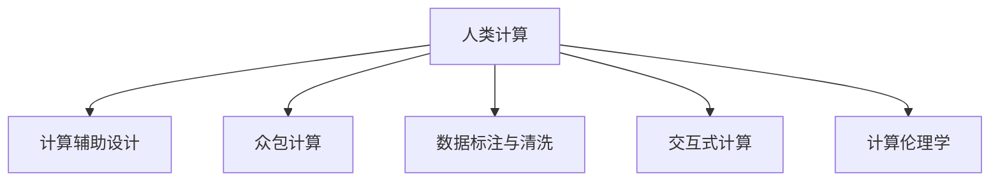

                 

# 人类计算：AI时代的道德和社会影响

## 1. 背景介绍

### 1.1 问题由来
随着人工智能（AI）技术的迅速发展，人类计算（Human Computation）的概念正逐渐兴起，成为AI时代的一个关键议题。人类计算，即利用人类的智能和创造力来辅助、优化、甚至替代机器计算的过程，深刻地影响着社会的各个方面。从自动化决策、机器人设计、数据标注到艺术创作、游戏设计等，人类计算的应用遍及各行各业。然而，人类计算的广泛应用也带来了诸如道德伦理、数据隐私、工作就业、公平性等一系列复杂的社会问题。本文旨在深入探讨AI时代人类计算的道德和社会影响，为未来的技术发展和应用提供有益的启示。

### 1.2 问题核心关键点
人类计算的核心在于如何平衡机器与人类在计算和决策过程中的作用，并确保其在道德和社会层面的公平与公正。关键点包括：

- **计算与决策的融合**：机器如何辅助人类进行计算，以及人类如何监督和干预机器决策。
- **数据隐私与安全性**：在利用人类计算过程中如何保护个人隐私和数据安全。
- **工作就业与公平性**：人类计算对就业市场的影响，以及如何确保计算过程的公平性与包容性。
- **伦理道德与社会责任**：在人类计算中如何处理伦理道德问题，并承担相应的社会责任。

## 2. 核心概念与联系

### 2.1 核心概念概述

为更好地理解人类计算的道德和社会影响，本节将介绍几个密切相关的核心概念：

- **人类计算（Human Computation）**：指利用人类的智能和创造力进行计算、决策、设计等活动的概念，涵盖了从传统的数据标注、编程到艺术创作、游戏设计等各个方面。

- **计算辅助设计（Computational Design）**：利用计算机辅助设计软件进行创意和设计工作，如建筑设计、工业设计等。

- **众包计算（Crowdsourcing Computation）**：通过网络平台将计算任务分配给全球的志愿者或工作者，如Google的ReCAPTCHA、Amazon的Turk等。

- **数据标注与清洗**：利用人类标注数据进行机器学习模型的训练和优化，如ImageNet图片分类任务的标注工作。

- **交互式计算（Interactive Computation）**：指用户通过交互界面参与计算过程，如在线游戏、交互式模拟等。

- **计算伦理学（Computational Ethics）**：涉及计算过程中涉及到的伦理道德问题，如隐私保护、公平性、安全性等。

这些概念之间的逻辑关系可以通过以下Mermaid流程图来展示：



这个流程图展示了几大核心概念之间的逻辑关系：

1. 人类计算通过各种方式辅助、优化计算过程。
2. 计算辅助设计、众包计算、数据标注与清洗等都是人类计算的重要形式。
3. 交互式计算强调用户参与的计算过程。
4. 计算伦理学关注计算过程中涉及到的伦理道德问题。

## 3. 核心算法原理 & 具体操作步骤

### 3.1 算法原理概述

人类计算的算法原理与机器学习算法有所不同，其核心在于利用人类的智能和创造力进行计算和决策。一般而言，人类计算包括以下步骤：

1. **任务定义**：明确需要人类计算的任务，如设计一个机械臂，优化一个算法等。
2. **任务分解**：将任务分解为可执行的小任务，以便人类能够理解和执行。
3. **任务执行**：将小任务分配给不同的人类工作者或志愿者，进行计算、设计、标注等。
4. **数据整合**：将不同人类工作者的结果进行整合，形成最终输出。

### 3.2 算法步骤详解

以众包计算为例，具体算法步骤包括：

1. **任务发布**：将需要计算的任务上传到众包平台，描述任务的具体要求、预期结果等。
2. **任务分配**：平台将任务分配给不同工作者，根据工作者的资质、经验等进行匹配。
3. **任务执行**：工作者根据任务要求进行计算、标注等工作。
4. **结果反馈**：工作者将结果提交给平台，平台进行初步审核。
5. **数据整合**：平台对通过审核的结果进行整合，形成最终的输出。
6. **质量控制**：平台进行质量控制，如果发现错误或异常结果，则要求工作者重新执行或联系其他工作者。

### 3.3 算法优缺点

人类计算的优点在于：

- **灵活性高**：能够适应各种复杂的计算任务，尤其适合创意和设计类的工作。
- **创新性强**：人类工作者能够带来新的创意和思路，推动技术创新。
- **社会影响力大**：能够广泛利用社会资源，提高工作效率。

缺点在于：

- **质量不稳定**：不同工作者的质量不稳定，可能导致结果不一致。
- **工作环境复杂**：工作环境可能缺乏标准化，影响结果一致性。
- **道德风险**：涉及到数据隐私和伦理问题，可能存在数据滥用风险。

### 3.4 算法应用领域

人类计算在多个领域都有广泛应用，包括：

- **数据标注与清洗**：如ImageNet图片分类任务的标注工作，是机器学习训练的基础。
- **创意和设计**：如建筑设计、工业设计等，需要大量人类的创造力和经验。
- **游戏设计**：游戏开发过程中需要大量人类的创意和测试。
- **交互式计算**：如在线游戏、交互式模拟等，需要用户与计算机互动。
- **科学研究**：在物理学、化学等领域的计算和模拟中，人类计算也发挥着重要作用。

## 4. 数学模型和公式 & 详细讲解

### 4.1 数学模型构建

在人类计算中，数学模型主要用于描述任务的数学特性和求解方法。例如，在数据标注任务中，可以将标注结果表示为向量形式，并通过机器学习算法进行优化。在创意设计任务中，可以使用进化算法、遗传算法等优化设计方案。

### 4.2 公式推导过程

以数据标注为例，假设有一个训练集 $D=\{(x_i,y_i)\}_{i=1}^N$，其中 $x_i$ 是输入，$y_i$ 是标注结果。我们可以定义一个损失函数 $L$ 来衡量模型输出与真实标签的差异。假设模型输出的概率分布为 $p(y|x)$，则损失函数可以表示为：

$$
L(y,p(y|x)) = \sum_{i=1}^N L(y_i,p(y_i|x_i))
$$

其中，$L(y,p(y|x))$ 可以是交叉熵损失、均方误差损失等。模型的优化目标是最小化损失函数，即：

$$
\min_{\theta} L(y,p(y|x))
$$

通过反向传播算法计算梯度，更新模型参数 $\theta$，即可实现模型的优化。

### 4.3 案例分析与讲解

以众包计算为例，假设有一个需要计算的任务 $T$，需要将任务 $T$ 分解为若干子任务 $T_1, T_2, \dots, T_m$，并将子任务分配给不同工作者 $W_1, W_2, \dots, W_n$。设每个工作者完成子任务的概率为 $p_{i,j}$，则任务 $T$ 完成的概率为：

$$
P(T) = \prod_{i=1}^n \prod_{j=1}^m p_{i,j}
$$

其中，$p_{i,j}$ 可以通过历史数据或模型训练得到。平台可以根据 $P(T)$ 评估任务完成的可靠性，并根据 $p_{i,j}$ 进行任务分配和质量控制。

## 5. 项目实践：代码实例和详细解释说明

### 5.1 开发环境搭建

在进行人类计算的实践前，我们需要准备好开发环境。以下是使用Python进行开发的环境配置流程：

1. 安装Anaconda：从官网下载并安装Anaconda，用于创建独立的Python环境。

2. 创建并激活虚拟环境：
```bash
conda create -n human-computation python=3.8 
conda activate human-computation
```

3. 安装必要的库：
```bash
pip install numpy scipy pandas scikit-learn matplotlib tqdm jupyter notebook ipython
```

4. 准备数据集和任务定义：收集需要计算的数据集，定义任务的详细要求和输出格式。

### 5.2 源代码详细实现

下面以众包计算为例，给出使用Python进行人类计算的代码实现。

```python
import numpy as np
from scipy import stats
from sklearn.metrics import precision_recall_curve

# 定义任务分解
def task_decomposition(task):
    # 将任务分解为若干子任务
    subtasks = []
    for i in range(1, len(task)):
        subtask = task[:i]
        subtasks.append(subtask)
    return subtasks

# 定义任务分配
def task_allocation(subtasks, workers):
    # 将子任务分配给不同工作者
    allocation = []
    for subtask in subtasks:
        # 随机分配子任务给工作者
        allocation.append(np.random.choice(workers))
    return allocation

# 定义任务执行
def task_execution(subtasks, allocation, results):
    # 工作者执行子任务
    for subtask, worker in zip(subtasks, allocation):
        results[worker] += subtask
    return results

# 定义数据整合
def data_integration(results):
    # 对不同工作者的结果进行整合
    integrated_result = []
    for worker, result in results.items():
        integrated_result.append(result)
    return integrated_result

# 定义质量控制
def quality_control(results, threshold):
    # 对结果进行初步审核，筛选出合格结果
    qualified_results = []
    for result in results:
        if stats.scoreatpercentile(result, 95) >= threshold:
            qualified_results.append(result)
    return qualified_results

# 定义最终输出
def final_output(qualified_results):
    # 将合格结果整合为最终输出
    final_result = []
    for result in qualified_results:
        final_result.append(result)
    return final_result
```

### 5.3 代码解读与分析

让我们再详细解读一下关键代码的实现细节：

**task_decomposition函数**：
- 将一个任务分解为若干个子任务。

**task_allocation函数**：
- 将子任务分配给不同的工作者。

**task_execution函数**：
- 工作者执行子任务，并将结果保存。

**data_integration函数**：
- 对不同工作者的结果进行整合。

**quality_control函数**：
- 对结果进行质量控制，筛选出合格的结果。

**final_output函数**：
- 将合格的结果整合为最终输出。

这些函数构建了一个完整的人类计算流程，涵盖了任务分解、任务分配、任务执行、数据整合和质量控制等关键步骤。通过这些函数的组合使用，可以实现对各种计算任务的自动化处理。

## 6. 实际应用场景

### 6.1 智慧城市治理

智慧城市治理中，利用人类计算可以显著提升城市管理的智能化水平。通过收集城市交通、环境、安全等各类数据，利用众包计算进行数据分析和处理，可以实时监测城市运行状态，预测和应对各类突发事件。例如，可以通过众包计算进行交通流量分析，为交通管理提供决策支持；通过众包计算进行环境监测，为环境保护提供数据支撑。

### 6.2 科学研究

在科学研究中，人类计算可以辅助进行复杂的计算和模拟。例如，在物理学、化学等领域，利用众包计算进行模拟实验和数据分析，可以大幅提升研究效率。通过众包计算，科学家可以迅速获取大量计算资源，加速科学发现和创新。

### 6.3 游戏设计

游戏设计过程中，利用人类计算可以生成大量的创意和设计方案。例如，利用众包计算进行游戏角色设计、故事情节创作等，可以快速生成大量设计方案，并通过用户反馈进行优化。这种众包设计模式不仅降低了游戏开发成本，还能激发更多创意和灵感。

### 6.4 未来应用展望

随着技术的不断进步，人类计算在更多领域将得到应用，为社会带来深远影响。

在智慧医疗领域，利用人类计算进行医疗数据分析和诊断，可以显著提升医疗服务的智能化水平，辅助医生诊疗，提高诊疗准确率。

在智能教育领域，利用人类计算进行个性化教育设计，可以根据学生兴趣和能力，定制化教学方案，提高教育效果。

在智慧农业领域，利用人类计算进行农业数据分析和决策，可以提高农业生产效率，实现精准农业。

在智慧旅游领域，利用人类计算进行旅游资源推荐和路线规划，可以提升游客体验，促进旅游业发展。

## 7. 工具和资源推荐

### 7.1 学习资源推荐

为了帮助开发者系统掌握人类计算的理论基础和实践技巧，这里推荐一些优质的学习资源：

1. 《Human Computation: From Data to Intelligence》一书：全面介绍了人类计算的基本概念和前沿技术，适合深入学习。

2. 《Computational Design in Architecture》一书：详细介绍了计算机辅助设计在建筑设计中的应用，提供了大量实际案例。

3. 《Crowdsourcing: A Data Scientists' Approach》一书：介绍了众包计算的理论基础和应用案例，提供了实用的数据分析和建模方法。

4. Coursera上的《Human-Centered Computing》课程：由MIT开设，介绍了人类计算的基本概念和应用案例，适合入门学习。

5. Udacity上的《Crowdsourcing Engineering》课程：介绍了众包计算的工程实践和优化方法，适合进阶学习。

通过对这些资源的学习实践，相信你一定能够快速掌握人类计算的精髓，并用于解决实际的计算问题。

### 7.2 开发工具推荐

高效的开发离不开优秀的工具支持。以下是几款用于人类计算开发的常用工具：

1. Python：作为人类计算的主要编程语言，Python具有丰富的库和工具支持，便于数据处理和计算。

2. Jupyter Notebook：一个交互式计算平台，支持实时显示计算结果，便于调试和分享。

3. Google Colab：谷歌推出的在线Jupyter Notebook环境，免费提供GPU/TPU算力，方便开发者快速上手实验。

4. TensorFlow：谷歌主导开发的深度学习框架，生产部署方便，支持分布式计算和模型优化。

5. PyTorch：Facebook开源的深度学习框架，灵活动态，适合研究和原型开发。

合理利用这些工具，可以显著提升人类计算的开发效率，加快创新迭代的步伐。

### 7.3 相关论文推荐

人类计算的快速发展离不开学界的持续研究。以下是几篇奠基性的相关论文，推荐阅读：

1. "Human Computation: A Framework for Optimizing Human and Computer Roles in Complex Problem Solving" - 详细介绍了人类计算的基本框架和理论基础。

2. "Crowdsourcing in Computing: Human Computation, Online Labor, and Gathered Expertise" - 讨论了众包计算的基本原理和应用案例，提供了丰富的实践经验。

3. "Data Science for Social Good: A Survey" - 介绍了数据科学在社会公益中的应用，提供了大量的实际案例和经验总结。

4. "Human Computation: Empowering Individuals to Solve Big Problems" - 讨论了人类计算的伦理和社会影响，提供了深入的思考和探讨。

这些论文代表了人类计算领域的最新进展，通过学习这些前沿成果，可以帮助研究者把握学科前进方向，激发更多的创新灵感。

## 8. 总结：未来发展趋势与挑战

### 8.1 总结

本文对人类计算的道德和社会影响进行了全面系统的探讨。首先阐述了人类计算的基本概念和应用场景，明确了其在AI时代的重要性和复杂性。其次，从原理到实践，详细讲解了人类计算的核心步骤和关键技术，给出了代码实例和详细解释说明。同时，本文还广泛探讨了人类计算在多个领域的应用前景，展示了其广泛的影响力。

通过本文的系统梳理，可以看到，人类计算在各个行业中都具有重要的应用价值，其道德和社会影响也引发了广泛的关注和讨论。未来，随着技术的不断进步和应用场景的不断扩展，人类计算必将在更多领域发挥更大的作用，成为推动社会进步的重要力量。

### 8.2 未来发展趋势

展望未来，人类计算的发展趋势将呈现以下几个方面：

1. **计算与决策的融合**：人类计算将更加注重计算与决策的融合，通过智能辅助和人工干预，提升计算的智能性和准确性。

2. **数据隐私与安全**：随着数据量的不断增大，数据隐私和安全问题将更加凸显。未来需要更加严格的隐私保护和数据安全机制，确保数据的合理使用。

3. **工作就业与公平性**：人类计算将对就业市场产生深远影响，需要关注工作就业和公平性问题，确保计算过程的透明和公正。

4. **伦理道德与社会责任**：人类计算中涉及的伦理道德问题将更加复杂，需要制定更为严格的行为准则和监管机制，确保计算过程的伦理性和责任性。

5. **技术创新与应用拓展**：人类计算将推动更多的技术创新和应用拓展，如自动编程、智能设计、科学计算等，为各行各业带来新的发展机遇。

6. **国际合作与标准制定**：随着人类计算的全球化发展，国际合作和标准制定将更加重要，需要建立统一的标准和规范，促进技术交流和应用推广。

这些趋势凸显了人类计算的广阔前景，其未来的发展将深刻影响社会的各个方面。

### 8.3 面临的挑战

尽管人类计算在许多领域都取得了显著进展，但在其发展过程中也面临着诸多挑战：

1. **质量与效率**：如何平衡人类计算的质量和效率，确保结果的一致性和可靠性，是需要解决的首要问题。

2. **隐私与安全**：在利用人类计算过程中，如何保护数据隐私和安全，避免数据滥用和泄露，是亟待解决的重要问题。

3. **工作就业与公平性**：人类计算对就业市场的影响，如何确保计算过程的公平性和包容性，也是未来需要关注的问题。

4. **伦理道德与社会责任**：在人类计算中如何处理伦理道德问题，确保计算过程的伦理性和责任性，需要建立更加严格的行为准则和监管机制。

5. **国际合作与标准制定**：在人类计算的国际合作中，如何制定统一的标准和规范，促进技术交流和应用推广，也需要更多的国际合作和协调。

这些挑战需要我们不断探索和解决，才能实现人类计算的可持续发展。

### 8.4 研究展望

面向未来，人类计算的研究方向将集中在以下几个方面：

1. **计算与决策的优化**：研究如何更好地融合计算与决策，提升计算过程的智能性和准确性，减少人类工作者的负担。

2. **数据隐私与安全的保护**：研究如何更好地保护数据隐私和安全，确保数据的合理使用，避免数据滥用和泄露。

3. **工作就业与公平性的保障**：研究如何确保人类计算的公平性和包容性，保障工作者的合法权益，促进就业市场的健康发展。

4. **伦理道德与社会责任的建立**：研究如何制定更为严格的行为准则和监管机制，确保人类计算的伦理性和责任性，推动社会公正与和谐。

5. **国际合作与标准制定的推进**：研究如何推动国际合作与标准制定，促进技术交流和应用推广，实现人类计算的全球化发展。

这些研究方向将引领人类计算的持续进步，为构建安全、可靠、公平、公正的计算环境提供有力支持。

## 9. 附录：常见问题与解答

**Q1：人类计算的计算效率如何？**

A: 人类计算的效率通常较低，依赖于人工工作的速度和质量。在需要快速计算的任务中，人类计算可能不够高效，需要结合机器计算来提升效率。

**Q2：人类计算的准确性如何？**

A: 人类计算的准确性依赖于工作者的专业水平和经验，可能存在个体差异。在需要高精度计算的任务中，人类计算可能需要多次验证和校正。

**Q3：如何保护人类计算中的数据隐私？**

A: 在人类计算中，数据隐私保护是至关重要的。可以通过数据匿名化、加密传输、访问控制等措施，保护数据隐私。同时，需要制定严格的数据使用规范，确保数据使用的合法性和合规性。

**Q4：人类计算中的伦理道德问题如何处理？**

A: 在人类计算中，伦理道德问题需要引起高度重视。需要制定严格的行为准则和监管机制，确保计算过程的透明和公正。同时，需要建立伦理审查机制，对计算过程进行监督和评估。

**Q5：人类计算的应用前景如何？**

A: 人类计算的应用前景非常广阔，涉及多个行业领域。从科学研究、游戏设计到智慧城市治理、智慧农业等，人类计算都有广泛的应用。未来，随着技术的不断进步和应用场景的不断扩展，人类计算必将在更多领域发挥更大的作用。

通过对这些问题的回答，希望能为你更好地理解和应用人类计算提供帮助。未来，随着技术的不断进步和社会需求的不断变化，人类计算将在更多领域发挥更大的作用，为社会的可持续发展做出重要贡献。

