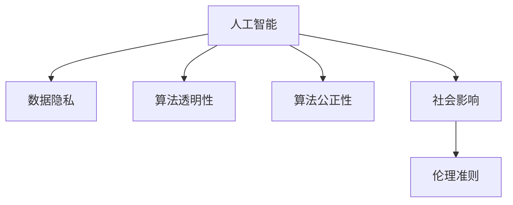

                 

# 人类计算：科技与伦理的平衡

> 关键词：科技,伦理,人工智能,数据,隐私,计算,平衡,未来

## 1. 背景介绍

### 1.1 问题由来
随着科技的迅猛发展，人工智能(AI)技术逐渐渗透到各行各业。从自动驾驶汽车到智能医疗诊断，从虚拟助理到智能推荐系统，AI技术正在深刻改变我们的生活方式。然而，科技进步带来的不仅是便利，也伴随着一系列伦理道德问题。

科技与伦理之间的平衡一直是技术发展中备受关注的话题。AI技术的广泛应用，尤其是深度学习等神经网络模型的兴起，让人们对于数据的使用、隐私保护、算法决策的透明性等伦理问题有了更深的认识。这些问题的解决，不仅需要技术手段的支持，更需要伦理道德的引导和约束。

### 1.2 问题核心关键点
科技与伦理的平衡是AI发展中的一大挑战。科技的进步往往以数据的收集和处理为基础，但数据的使用过程可能涉及隐私问题。同时，算法决策的透明性、算法的公正性、科技对社会的影响等问题也亟需解决。

具体而言，AI领域面临的伦理问题包括但不限于：
- 数据隐私：如何合理收集和使用数据，避免侵犯个人隐私。
- 算法透明性：如何解释算法的决策过程，确保其透明性和可解释性。
- 算法公正性：如何避免算法的偏见和歧视，保证公平公正。
- 社会影响：如何评估AI技术对社会、经济、文化等各方面的影响，避免造成负面效应。

这些伦理问题不仅涉及技术层面，更需要从制度、法律、社会规范等多个维度进行全面考虑和解决。

### 1.3 问题研究意义
研究科技与伦理的平衡，对于确保AI技术的健康发展具有重要意义：

1. 保护用户隐私：合理使用数据，确保用户隐私不被侵犯。
2. 提升算法透明性：通过透明化的决策过程，增强公众对AI的信任。
3. 避免算法偏见：确保算法不带有任何偏见，公正地对待所有人。
4. 评估社会影响：对AI技术的应用进行伦理评估，确保其有益于社会整体。
5. 指导规范制定：为制定AI相关法律法规和伦理准则提供参考。

## 2. 核心概念与联系

### 2.1 核心概念概述

为更好地理解科技与伦理的平衡，本节将介绍几个关键概念：

- 人工智能(AI)：利用算法和大数据，使机器具有智能行为的计算机技术。
- 数据隐私：指个人数据在使用过程中的保护问题，避免未经授权的获取和使用。
- 算法透明性：指算法决策过程的可解释性和可理解性。
- 算法公正性：指算法在数据处理和决策过程中不带有任何偏见和歧视，确保公正公平。
- 社会影响：指AI技术应用对社会、经济、文化等各方面的影响。
- 伦理准则：指指导AI技术应用的一整套规范和道德原则。

这些核心概念之间的逻辑关系可以通过以下Mermaid流程图来展示：



这个流程图展示了几大核心概念之间的联系：

1. AI技术以数据为基础，数据隐私是AI应用的关键问题。
2. AI决策过程需要透明，算法透明性是伦理准则的一部分。
3. AI算法需要公正，避免偏见和歧视。
4. AI技术对社会有深远影响，伦理准则指导AI应用的规范。

## 3. 核心算法原理 & 具体操作步骤

### 3.1 算法原理概述

科技与伦理的平衡，从根本上说，是要在技术应用中实现数据合理利用和伦理道德约束之间的平衡。

在AI技术应用中，数据隐私保护是关键。合理的数据使用策略可以避免对用户隐私的侵犯，同时保证AI技术的高效运行。算法透明性和公正性也是平衡伦理道德的重要方面，通过透明化的决策过程和公正的算法设计，可以提升公众对AI的信任和接受度。

### 3.2 算法步骤详解

基于科技与伦理的平衡，AI技术的开发和应用可以遵循以下步骤：

**Step 1: 数据收集与处理**
- 收集数据时，遵循相关法律法规，如欧盟的GDPR（通用数据保护条例），确保数据收集的合法性。
- 对数据进行去标识化处理，如脱敏、匿名化，保护用户隐私。
- 对数据进行清洗和预处理，去除噪音和无关信息，确保数据质量。

**Step 2: 模型训练与验证**
- 选择合适的算法和模型，确保其符合伦理准则，如公平性和透明性。
- 对模型进行训练，评估其在数据集上的表现。
- 在验证集上测试模型，确保其泛化能力，避免过拟合。

**Step 3: 模型部署与监控**
- 将训练好的模型部署到生产环境中，进行实际应用。
- 对模型应用过程中的数据处理、决策过程进行监控，确保其合规性和公正性。
- 对模型结果进行审计，确保其透明性和可解释性。

**Step 4: 持续改进与反馈**
- 根据模型在生产环境中的表现，不断优化模型和算法。
- 收集用户反馈，评估AI技术对社会的影响，确保其有益于社会整体。
- 更新伦理准则，确保AI技术的应用符合最新的伦理标准。

### 3.3 算法优缺点

基于科技与伦理的平衡的AI技术开发，具有以下优点：
1. 保护用户隐私：通过合理的数据使用策略，确保用户隐私不被侵犯。
2. 提升算法透明性：通过透明化的决策过程，增强公众对AI的信任。
3. 避免算法偏见：确保算法不带有任何偏见，公正地对待所有人。
4. 评估社会影响：对AI技术的应用进行伦理评估，确保其有益于社会整体。

同时，该方法也存在一定的局限性：
1. 数据收集困难：在一些场景下，难以获得高质量的数据，可能影响模型性能。
2. 算法复杂度高：设计符合伦理准则的算法可能需要复杂的算法设计，增加了技术难度。
3. 社会影响评估困难：评估AI技术对社会的影响是一个复杂的过程，涉及多方面的考量。

尽管存在这些局限性，但就目前而言，基于科技与伦理的平衡的AI技术开发仍是大数据和AI应用的重要范式。未来相关研究的重点在于如何进一步降低数据收集难度，提高算法的透明性和公正性，同时兼顾可解释性和伦理安全性等因素。

### 3.4 算法应用领域

基于科技与伦理的平衡的AI技术开发，在多个领域已经得到了广泛的应用：

- 医疗健康：AI在医学影像分析、疾病预测、个性化医疗等领域的应用，需要确保数据的隐私保护和算法的公正性。
- 金融服务：AI在风险控制、信用评估、投资决策等领域的应用，需要评估其对金融市场的潜在影响。
- 教育领域：AI在智能教学、学习推荐、作业批改等领域的应用，需要确保算法的透明性和对学生的公平对待。
- 公共安全：AI在犯罪预防、交通管理、灾害预警等领域的应用，需要评估其对公共安全的影响。
- 媒体娱乐：AI在内容推荐、智能编辑、版权保护等领域的应用，需要考虑其对文化多样性和言论自由的潜在影响。

## 4. 数学模型和公式 & 详细讲解 & 举例说明

### 4.1 数学模型构建

本节将使用数学语言对基于科技与伦理的平衡的AI技术开发过程进行更加严格的刻画。

假设有一个AI系统，用于根据用户数据进行决策。系统的输入为 $x \in \mathcal{X}$，输出为 $y \in \mathcal{Y}$。系统中包含一个深度学习模型 $M_{\theta}:\mathcal{X} \rightarrow \mathcal{Y}$，其中 $\theta$ 为模型参数。系统的决策过程包括数据收集、模型训练、模型部署和持续改进等步骤。

系统的目标是在确保数据隐私、算法透明性和公正性的基础上，最大化系统的性能。数学上，可以定义系统的目标函数为：

$$
\mathcal{L}(\theta) = \max_{\theta} \{ \mathcal{P}(\theta) - \lambda \mathcal{E}(\theta) \}
$$

其中 $\mathcal{P}(\theta)$ 为系统的性能指标，如准确率、召回率等；$\mathcal{E}(\theta)$ 为系统的伦理指标，如隐私保护程度、算法公正性等；$\lambda$ 为平衡系数，用于平衡性能和伦理指标。

### 4.2 公式推导过程

以下我们以医疗领域的应用为例，推导一个简单的医疗诊断模型的公式推导过程。

假设医疗数据集包含 $n$ 个样本 $(x_i, y_i)$，其中 $x_i$ 为病人的症状描述，$y_i$ 为诊断结果。模型的目标是根据症状 $x$ 预测诊断结果 $y$。

定义模型的损失函数为交叉熵损失函数：

$$
\ell(x_i, y_i; \theta) = -[y_i\log M_{\theta}(x_i)+(1-y_i)\log(1-M_{\theta}(x_i))]
$$

在训练过程中，需要最小化损失函数：

$$
\mathcal{L}(\theta) = \frac{1}{n} \sum_{i=1}^n \ell(x_i, y_i; \theta)
$$

通过梯度下降等优化算法，更新模型参数 $\theta$，最小化损失函数。同时，需要引入隐私保护和算法公正性等伦理指标，确保模型的伦理合规性。

### 4.3 案例分析与讲解

以医疗领域为例，医疗诊断模型的设计和应用需要特别关注隐私保护和算法公正性。在数据收集阶段，需要确保数据来源的合法性和隐私保护，如使用差分隐私技术对数据进行匿名化处理。在模型设计阶段，需要确保算法不带有任何偏见，公正地对待所有病人。在模型应用阶段，需要评估模型对不同病人群体的诊断效果，避免出现系统性偏见。

## 5. 项目实践：代码实例和详细解释说明

### 5.1 开发环境搭建

在进行科技与伦理的平衡的AI技术开发前，我们需要准备好开发环境。以下是使用Python进行TensorFlow开发的环境配置流程：

1. 安装Anaconda：从官网下载并安装Anaconda，用于创建独立的Python环境。

2. 创建并激活虚拟环境：
```bash
conda create -n tf-env python=3.8 
conda activate tf-env
```

3. 安装TensorFlow：根据CUDA版本，从官网获取对应的安装命令。例如：
```bash
conda install tensorflow tensorflow-estimator tensorflow-addons -c tf -c conda-forge
```

4. 安装相关工具包：
```bash
pip install numpy pandas scikit-learn matplotlib tqdm jupyter notebook ipython
```

完成上述步骤后，即可在`tf-env`环境中开始开发。

### 5.2 源代码详细实现

这里我们以医疗领域的应用为例，使用TensorFlow构建一个简单的医疗诊断模型。

首先，定义医疗诊断任务的数据处理函数：

```python
import tensorflow as tf
from tensorflow.keras.preprocessing.text import Tokenizer
from tensorflow.keras.preprocessing.sequence import pad_sequences
from tensorflow.keras.layers import Embedding, LSTM, Dense

def preprocess_data(texts, labels):
    tokenizer = Tokenizer()
    tokenizer.fit_on_texts(texts)
    sequences = tokenizer.texts_to_sequences(texts)
    padded_sequences = pad_sequences(sequences, maxlen=50, padding='post')
    return padded_sequences, labels
```

然后，定义模型和优化器：

```python
model = tf.keras.Sequential([
    Embedding(input_dim=10000, output_dim=64, input_length=50),
    LSTM(64),
    Dense(1, activation='sigmoid')
])

optimizer = tf.keras.optimizers.Adam(lr=0.001)
```

接着，定义训练和评估函数：

```python
def train_epoch(model, dataset, batch_size, optimizer):
    model.compile(optimizer=optimizer, loss='binary_crossentropy', metrics=['accuracy'])
    model.fit(dataset['input'], dataset['label'], batch_size=batch_size, epochs=10, validation_data=(val_input, val_label))
```

最后，启动训练流程并在测试集上评估：

```python
train_input, train_label = preprocess_data(train_texts, train_labels)
val_input, val_label = preprocess_data(val_texts, val_labels)
test_input, test_label = preprocess_data(test_texts, test_labels)

train_epoch(model, train_input, batch_size, optimizer)
evaluate(model, test_input, test_label)
```

以上就是使用TensorFlow对医疗诊断模型进行科技与伦理的平衡的AI技术开发的完整代码实现。可以看到，得益于TensorFlow的强大封装，我们可以用相对简洁的代码完成模型的构建和训练。

### 5.3 代码解读与分析

让我们再详细解读一下关键代码的实现细节：

**preprocess_data函数**：
- `Tokenizer`类：用于将文本转化为数字序列。
- `pad_sequences`函数：对数字序列进行定长padding，确保输入长度一致。

**模型定义**：
- `Sequential`模型：定义了一个顺序的神经网络结构。
- `Embedding`层：将输入的文本转化为向量表示。
- `LSTM`层：处理序列数据。
- `Dense`层：输出诊断结果。

**训练函数train_epoch**：
- `compile`方法：定义模型和优化器，设置损失函数和评价指标。
- `fit`方法：对模型进行训练，在验证集上评估性能。

**训练流程**：
- 将文本数据进行预处理，转换为模型需要的输入格式。
- 训练模型，并评估其性能。

可以看到，TensorFlow使得AI模型的构建和训练过程变得简洁高效。开发者可以将更多精力放在数据处理、模型改进等高层逻辑上，而不必过多关注底层的实现细节。

当然，工业级的系统实现还需考虑更多因素，如模型的保存和部署、超参数的自动搜索、更加灵活的任务适配层等。但核心的科技与伦理的平衡的AI技术开发基本与此类似。

## 6. 实际应用场景

### 6.1 智能医疗健康

基于科技与伦理的平衡的AI技术，可以广泛应用于智能医疗健康领域。传统医疗体系需要耗费大量人力物力进行诊断和治疗，准确性和效率都难以保证。AI技术通过收集和分析患者数据，可以辅助医生进行疾病预测、诊断和治疗决策，提高医疗服务的智能化水平。

在技术实现上，可以收集医院的历史病例、检查报告、诊断结果等数据，对预训练模型进行微调。微调后的模型能够自动理解病人的症状描述，预测可能患有的疾病，并提供相应的治疗建议。通过这种方式，AI系统可以辅助医生快速准确地进行诊断，提高医疗服务的效率和质量。

### 6.2 金融风险控制

AI技术在金融领域的应用，主要集中在风险控制、信用评估、投资决策等方面。传统的金融风险控制方法依赖于大量专家经验，无法处理复杂多变的金融市场。基于科技与伦理的平衡的AI技术，可以通过分析大量的金融数据，预测市场的波动和风险，帮助金融机构进行风险控制。

在技术实现上，可以收集金融市场的交易数据、新闻报道、社交媒体等数据，训练预测模型。模型通过分析市场趋势、新闻情绪、社交舆情等，预测市场的波动和风险，帮助金融机构制定风险控制策略，避免潜在的金融风险。

### 6.3 个性化教育推荐

AI技术在教育领域的应用，主要集中在智能推荐、学习分析、作业批改等方面。传统的教育体系无法实现个性化教学，难以满足不同学生的学习需求。基于科技与伦理的平衡的AI技术，可以通过分析学生的学习行为和反馈，提供个性化的学习推荐和作业批改，提高教学效果。

在技术实现上，可以收集学生的学习数据、行为数据、作业数据等，训练推荐模型。模型通过分析学生的学习兴趣、知识掌握情况、学习习惯等，推荐适合的学习资源和练习题，辅助教师进行个性化教学。同时，AI技术还可以自动批改学生的作业，提供即时反馈，帮助学生提高学习效果。

### 6.4 未来应用展望

随着科技与伦理的平衡的AI技术的发展，其在更多领域的应用前景广阔：

1. 智慧城市治理：AI技术可以应用于城市事件监测、舆情分析、应急指挥等环节，提高城市管理的自动化和智能化水平，构建更安全、高效的未来城市。
2. 智能家居生活：AI技术可以应用于智能家电、智能安防、智能健康等场景，提升家居生活的便利性和安全性。
3. 智能交通系统：AI技术可以应用于交通流量预测、交通事件监测、智能驾驶等领域，提高交通系统的运行效率和安全。
4. 智能制造行业：AI技术可以应用于智能制造、质量控制、设备维护等领域，提高制造行业的生产效率和产品质量。

未来，伴随着AI技术的不断进步，科技与伦理的平衡的AI技术将在更多领域得到应用，为人类社会的各个方面带来深远影响。

## 7. 工具和资源推荐

### 7.1 学习资源推荐

为了帮助开发者系统掌握科技与伦理的平衡的AI技术的理论基础和实践技巧，这里推荐一些优质的学习资源：

1. 《深度学习》系列博文：由深度学习专家撰写，深入浅出地介绍了深度学习的基本概念和前沿技术。
2. 《机器学习》课程：斯坦福大学开设的机器学习明星课程，有Lecture视频和配套作业，带你入门机器学习领域。
3. 《人工智能伦理》书籍：介绍了人工智能技术的伦理问题和发展趋势，帮助理解科技与伦理的关系。
4. 《自然语言处理》书籍：介绍了自然语言处理的基本概念和技术，帮助理解AI在语言处理中的应用。
5. 《TensorFlow官方文档》：TensorFlow的官方文档，提供了丰富的API和样例代码，是TensorFlow学习的必备资料。

通过对这些资源的学习实践，相信你一定能够快速掌握科技与伦理的平衡的AI技术的精髓，并用于解决实际的AI问题。

### 7.2 开发工具推荐

高效的开发离不开优秀的工具支持。以下是几款用于科技与伦理的平衡的AI技术开发常用的工具：

1. TensorFlow：由Google主导开发的开源深度学习框架，生产部署方便，适合大规模工程应用。
2. PyTorch：基于Python的开源深度学习框架，灵活动态的计算图，适合快速迭代研究。
3. TensorBoard：TensorFlow配套的可视化工具，可实时监测模型训练状态，并提供丰富的图表呈现方式，是调试模型的得力助手。
4. Weights & Biases：模型训练的实验跟踪工具，可以记录和可视化模型训练过程中的各项指标，方便对比和调优。
5. Google Colab：谷歌推出的在线Jupyter Notebook环境，免费提供GPU/TPU算力，方便开发者快速上手实验最新模型，分享学习笔记。

合理利用这些工具，可以显著提升科技与伦理的平衡的AI技术开发的效率，加快创新迭代的步伐。

### 7.3 相关论文推荐

科技与伦理的平衡的AI技术的发展源于学界的持续研究。以下是几篇奠基性的相关论文，推荐阅读：

1. 《深度学习在医疗健康中的应用》：介绍了深度学习在医疗健康领域的应用，并讨论了数据隐私保护和算法透明性等问题。
2. 《AI在金融风险控制中的应用》：介绍了AI在金融领域的应用，并讨论了算法公正性和社会影响等问题。
3. 《AI在教育推荐系统中的应用》：介绍了AI在教育推荐系统中的应用，并讨论了算法透明性和用户隐私保护等问题。
4. 《AI伦理准则的发展》：介绍了AI伦理准则的发展历程，并讨论了伦理准则的制定和应用等问题。
5. 《隐私保护技术的发展》：介绍了隐私保护技术的发展现状，并讨论了隐私保护技术的未来趋势。

这些论文代表了大语言模型微调技术的发展脉络。通过学习这些前沿成果，可以帮助研究者把握学科前进方向，激发更多的创新灵感。

## 8. 总结：未来发展趋势与挑战

### 8.1 总结

本文对基于科技与伦理的平衡的AI技术开发进行了全面系统的介绍。首先阐述了科技与伦理的平衡在AI发展中的重要意义，明确了科技与伦理平衡在大数据和AI应用中的关键作用。其次，从原理到实践，详细讲解了科技与伦理的平衡的AI技术开发的数学原理和关键步骤，给出了科技与伦理的平衡的AI技术开发的完整代码实例。同时，本文还广泛探讨了科技与伦理的平衡的AI技术在医疗、金融、教育等多个领域的应用前景，展示了科技与伦理的平衡的AI技术的广阔前景。

通过本文的系统梳理，可以看到，基于科技与伦理的平衡的AI技术正在成为大数据和AI应用的重要范式，极大地拓展了AI技术的边界，催生了更多的落地场景。得益于大数据和AI技术的不断进步，科技与伦理的平衡的AI技术将在更多领域得到应用，为人类社会的各个方面带来深远影响。

### 8.2 未来发展趋势

展望未来，科技与伦理的平衡的AI技术将呈现以下几个发展趋势：

1. 数据隐私保护技术的发展：随着数据隐私保护技术的发展，AI技术的隐私保护将更加完善，用户数据的安全将得到更好的保障。
2. 算法透明性和可解释性的提升：通过引入更多的可解释性技术，如因果推断、对比学习等，AI算法的透明性和可解释性将进一步提升，用户对AI的信任将增强。
3. 算法公正性的改进：通过引入更多公正性评估方法和数据多样性技术，AI算法的公正性将得到进一步保障，避免算法偏见和歧视。
4. 社会影响评估的完善：通过引入更多的社会影响评估方法和伦理准则，AI技术的应用将更加符合社会价值观和伦理道德，避免负面影响。
5. 多模态AI技术的发展：通过引入更多的多模态数据和跨领域融合技术，AI技术的应用范围将更加广泛，系统能力将更加全面。

以上趋势凸显了科技与伦理的平衡的AI技术的广阔前景。这些方向的探索发展，必将进一步提升AI技术的性能和应用范围，为人类社会的各个方面带来深远影响。

### 8.3 面临的挑战

尽管科技与伦理的平衡的AI技术已经取得了显著进展，但在迈向更加智能化、普适化应用的过程中，它仍面临着诸多挑战：

1. 数据收集瓶颈：在一些场景下，难以获得高质量的数据，可能影响模型性能。
2. 算法复杂度高：设计符合伦理准则的算法可能需要复杂的算法设计，增加了技术难度。
3. 社会影响评估困难：评估AI技术对社会的影响是一个复杂的过程，涉及多方面的考量。
4. 算法透明性和公正性不足：当前算法的透明性和公正性仍有待提高，难以完全满足伦理需求。
5. 社会接受度低：公众对AI技术的理解和接受度不足，可能影响其应用推广。

尽管存在这些挑战，但通过不断的技术创新和制度建设，科技与伦理的平衡的AI技术将逐步克服这些困难，走向更加成熟和广泛的应用。

### 8.4 研究展望

面向未来，科技与伦理的平衡的AI技术的研究方向需要在以下几个方面进行深入探索：

1. 数据隐私保护技术：进一步研究和开发高效的数据隐私保护技术，确保用户数据的隐私和安全。
2. 算法透明性和公正性：进一步研究和开发符合伦理准则的算法，确保算法的透明性和公正性。
3. 社会影响评估方法：研究和开发多维度的社会影响评估方法，全面评估AI技术的应用影响。
4. 多模态AI技术：研究和开发多模态数据融合技术，提升AI系统的多领域协同能力。
5. 社会伦理准则：研究和制定符合社会伦理的AI技术应用准则，确保AI技术的发展符合社会价值观和伦理道德。

这些研究方向的探索，必将引领科技与伦理的平衡的AI技术走向更高的台阶，为人类社会的各个方面带来深远影响。只有勇于创新、敢于突破，才能不断拓展AI技术的边界，让科技更好地造福人类社会。

## 9. 附录：常见问题与解答

**Q1：如何在科技与伦理的平衡中确保数据隐私保护？**

A: 确保数据隐私保护是科技与伦理的平衡中至关重要的一环。以下是一些常用的隐私保护技术：
- 差分隐私：通过添加噪声，确保数据集的隐私性，避免个人信息的泄露。
- 数据脱敏：对敏感信息进行匿名化处理，如姓名、身份证号等，确保数据集的可逆性。
- 联邦学习：在不共享数据的前提下，通过分布式计算实现模型训练，保护数据隐私。

通过这些技术的应用，可以在科技与伦理的平衡中有效保护数据隐私。

**Q2：如何确保算法的透明性和公正性？**

A: 确保算法的透明性和公正性，是科技与伦理的平衡中的关键。以下是一些常用的方法：
- 透明性：通过可视化工具展示算法决策过程，确保算法的透明性。
- 公正性：通过多样性数据集和公平性指标评估算法的公正性。
- 公平性：使用公平性评估方法和数据多样性技术，确保算法不带有任何偏见和歧视。

通过这些方法的应用，可以在科技与伦理的平衡中确保算法的透明性和公正性。

**Q3：AI技术对社会的影响评估如何进行？**

A: AI技术对社会的影响评估是一个复杂的过程，需要从多个维度进行考量。以下是一些常用的评估方法：
- 社会影响评估：通过社会调查和问卷调查，评估AI技术对社会的综合影响。
- 伦理准则：制定符合社会价值观和伦理道德的AI技术应用准则，确保AI技术的应用符合社会规范。
- 多方参与：在AI技术的开发和应用过程中，多方参与和监督，确保其公正性和透明度。

通过这些方法的应用，可以在科技与伦理的平衡中全面评估AI技术对社会的影响。

**Q4：未来AI技术的发展方向是什么？**

A: 未来AI技术的发展方向包括以下几个方面：
- 数据隐私保护技术：进一步研究和开发高效的数据隐私保护技术，确保用户数据的隐私和安全。
- 算法透明性和公正性：进一步研究和开发符合伦理准则的算法，确保算法的透明性和公正性。
- 社会影响评估方法：研究和开发多维度的社会影响评估方法，全面评估AI技术的应用影响。
- 多模态AI技术：研究和开发多模态数据融合技术，提升AI系统的多领域协同能力。
- 社会伦理准则：研究和制定符合社会伦理的AI技术应用准则，确保AI技术的发展符合社会价值观和伦理道德。

通过这些方向的探索，AI技术将在未来更加智能化、普适化，为人类社会的各个方面带来深远影响。

---

作者：禅与计算机程序设计艺术 / Zen and the Art of Computer Programming

