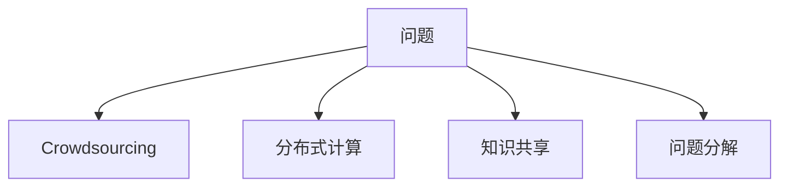
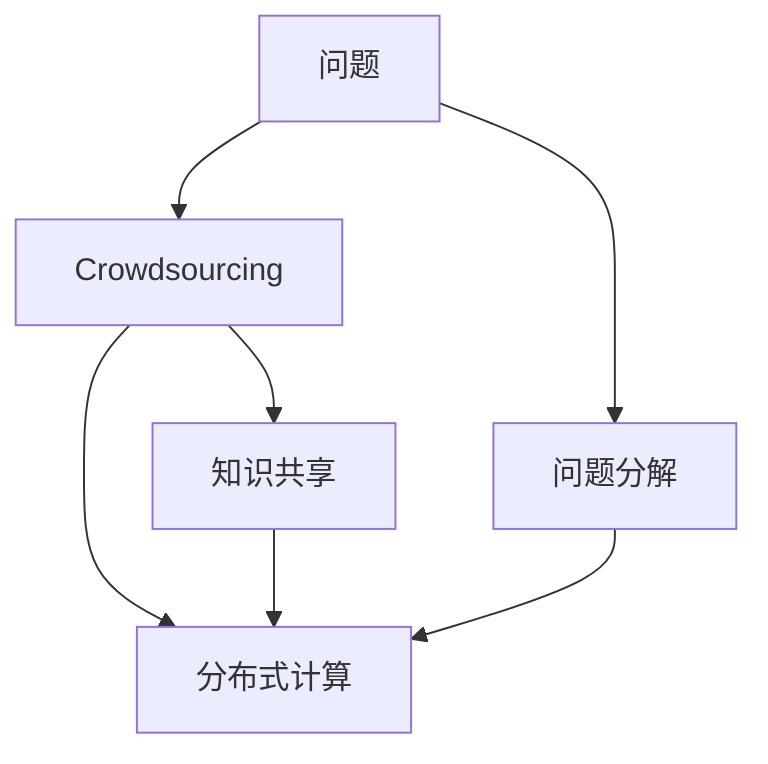

                 

# 人类计算：解决复杂问题的新方法

## 1. 背景介绍

### 1.1 问题由来

随着数字化和信息化的不断深入，人们日常生活中的数据量和计算量呈爆炸式增长。传统基于个体计算力的方式，无法应对这种复杂度的大幅提升。数据计算的需求越来越迫切，从企业到个人，从科研到娱乐，都在寻求更高效、更经济的计算方法。在此背景下，“人类计算”应运而生，它利用大量人类的智慧和知识，来辅助解决复杂问题，提升计算效率。

### 1.2 问题核心关键点

人类计算方法的核心在于将人类智慧与机器计算结合起来，通过大规模分布式协作，在解决高难度、高复杂度问题时发挥出更大的作用。其关键点包括：

- **大规模协作**：广泛动员全球人群参与问题解决，利用各自的智慧和经验。
- **知识共享**：建立一个知识库，供所有人参考和使用，促进信息交流。
- **问题分解**：将大问题拆解成小问题，由个体或小团队独立解决。
- **协同融合**：通过交流和合作，将个人和团队的知识汇集成整体解决方案。

### 1.3 问题研究意义

人类计算方法结合了人的智慧和计算能力，具有传统计算方法无法替代的优势。它不仅能加速问题解决，还能丰富科学知识，提升人类创新能力。这一方法在科研、教育、工业、农业、医疗等多个领域具有广泛的应用前景，能够帮助人类更好地理解世界、改造世界。

## 2. 核心概念与联系

### 2.1 核心概念概述

为更好地理解人类计算方法，本节将介绍几个关键概念：

- **人类计算（Human Computing）**：利用大量人类的智慧和知识来解决复杂计算问题。
- **众包（Crowdsourcing）**：通过互联网平台，将任务分解为小的子任务，分发给志愿者完成。
- **分布式计算（Distributed Computing）**：将任务分布在多台计算机上并行处理，提升计算效率。
- **知识共享（Knowledge Sharing）**：建立知识库，供人们获取和使用。
- **问题分解（Problem Decomposition）**：将复杂问题拆解为可解决的小问题。

这些概念之间的联系可以通过以下Mermaid流程图来展示：



### 2.2 核心概念原理和架构的 Mermaid 流程图



这个流程图展示了人类计算方法中各个概念之间的联系和作用。问题通过问题分解、知识共享、众包和分布式计算的协同作用，被逐步解决。

## 3. 核心算法原理 & 具体操作步骤

### 3.1 算法原理概述

人类计算方法的核心算法原理基于“分解-计算-合并”的模式。首先，将复杂问题拆解成若干个小的子问题，然后利用众包方式，将每个子问题分配给不同的个体或团队解决。各个计算单元将结果汇总后，再通过协同合并，得到整体问题的解决方案。

该方法主要涉及以下几个步骤：

1. **问题分解**：将问题拆解成独立的子问题。
2. **任务分配**：将子问题分配给个体或团队。
3. **计算执行**：每个计算单元独立解决问题。
4. **结果汇总**：将各个计算单元的结果汇总，得到整体解决方案。

### 3.2 算法步骤详解

以下是人类计算方法的具体操作步骤：

**Step 1: 问题定义和分解**

- 确定问题的核心目标和关键指标。
- 将问题拆解成若干个独立的子问题。

**Step 2: 任务分配**

- 根据每个子问题的复杂度，将任务分配给不同的个体或团队。
- 为每个计算单元提供必要的工具和指导，确保任务顺利完成。

**Step 3: 计算执行**

- 每个计算单元独立解决问题，采用适当的方法和工具。
- 记录每个计算单元的计算过程和结果。

**Step 4: 结果汇总**

- 汇总各计算单元的结果，进行协同合并。
- 对合并后的结果进行评估和验证，确保其正确性和一致性。

### 3.3 算法优缺点

人类计算方法的优点在于：

1. **高效性**：利用大量人类智慧，可以在较短时间内解决复杂问题。
2. **可扩展性**：通过分布式计算，可以处理大规模的数据和计算任务。
3. **灵活性**：各个计算单元可以根据自身情况独立工作，灵活性强。

然而，人类计算方法也存在一些局限性：

1. **质量控制**：个体和团队的计算质量难以统一，需要严格的质量控制机制。
2. **知识共享**：需要建立高效的知识共享平台，促进信息流通。
3. **协同难度**：团队协作过程中可能存在沟通不畅、信息不对称等问题。
4. **法律和伦理问题**：数据和知识共享可能涉及隐私和版权问题。

### 3.4 算法应用领域

人类计算方法已经在多个领域得到了广泛应用，包括但不限于：

- **科研**：利用众包平台进行科学实验设计、数据标注、理论验证等。
- **教育**：通过学生协作完成作业、论文写作、课程设计等。
- **工业**：解决生产线优化、质量检测、故障诊断等问题。
- **农业**：进行土壤分析、作物生长监测、农业决策支持等。
- **医疗**：进行病例分析、疾病预测、药物研发等。

## 4. 数学模型和公式 & 详细讲解

### 4.1 数学模型构建

在人类计算方法中，可以将问题分解为多个子问题，并建立相应的数学模型。假设原始问题为 $P$，分解为 $N$ 个子问题 $\{P_i\}$，每个子问题可以用函数 $f_i(x)$ 表示，其中 $x$ 为输入参数。则整体问题的解为：

$$
P(x) = \sum_{i=1}^N f_i(x)
$$

### 4.2 公式推导过程

以一个简单问题为例，假设需要计算一个多维数据集 $D$ 的平均值，可以将其拆解为 $N$ 个子问题，每个问题计算一个维度上的平均值。设 $D = (x_1, x_2, ..., x_n)$，则每个子问题 $f_i(x)$ 计算 $x_i$ 的平均值：

$$
f_i(x) = \frac{1}{m} \sum_{j=1}^m x_i^j
$$

其中 $m$ 为样本数量。整体问题的解为：

$$
P(D) = \left( \frac{1}{m} \sum_{j=1}^m x_1^j, \frac{1}{m} \sum_{j=1}^m x_2^j, ..., \frac{1}{m} \sum_{j=1}^m x_n^j \right)
$$

### 4.3 案例分析与讲解

假设我们需要计算一个大型矩阵的逆矩阵，可以将矩阵拆解为若干个小的子矩阵，每个子矩阵计算其逆矩阵。然后对所有子矩阵的逆矩阵进行加权平均，得到整体矩阵的逆矩阵。

假设原始矩阵为 $A$，拆分为 $N$ 个子矩阵 $\{A_i\}$，每个子矩阵的大小为 $n_i \times n_i$。设子矩阵的逆矩阵为 $B_i$，整体矩阵的逆矩阵为 $B$，则有：

$$
B = \frac{1}{\sum_{i=1}^N n_i} \sum_{i=1}^N \frac{n_i}{n_i} B_i
$$

例如，对于一个 $500 \times 500$ 的矩阵 $A$，可以将其拆分为 $50 \times 50$ 的子矩阵 $A_1, A_2, ..., A_{25}$。计算每个子矩阵的逆矩阵 $B_1, B_2, ..., B_{25}$，再对 $B_1, B_2, ..., B_{25}$ 进行加权平均，得到整体矩阵的逆矩阵 $B$。

## 5. 项目实践：代码实例和详细解释说明

### 5.1 开发环境搭建

在开始实践前，我们需要准备开发环境。以下是使用Python进行分布式计算的开发环境配置流程：

1. 安装Anaconda：从官网下载并安装Anaconda，用于创建独立的Python环境。
2. 创建并激活虚拟环境：
```bash
conda create -n distributed-env python=3.8 
conda activate distributed-env
```

3. 安装分布式计算库：
```bash
conda install distributed
```

4. 安装各类工具包：
```bash
pip install numpy pandas scipy scikit-learn matplotlib tqdm jupyter notebook ipython
```

完成上述步骤后，即可在`distributed-env`环境中开始分布式计算实践。

### 5.2 源代码详细实现

下面我们以计算一个多维数据集平均值为例，给出使用distributed库进行分布式计算的PyTorch代码实现。

首先，定义计算平均值的任务：

```python
import torch.distributed as dist
import torch
from torch.distributed._tensor import DTensor

def average(data):
    avg_tensor = torch.mean(data)
    return avg_tensor.item()

# 创建分布式计算环境
world_size = torch.cuda.device_count()
dist.init_process_group("gloo", rank=dist.get_rank(), world_size=world_size)

# 定义数据分布
dist_data = DTensor(data)
```

然后，定义分布式计算函数：

```python
def distributed_average(data):
    # 计算每个子矩阵的平均值
    local_data = dist_data.to_local()
    local_avg = torch.mean(local_data)
    
    # 将所有子矩阵的平均值汇总
    global_avg = local_avg
    for i in range(world_size-1):
        dist.barrier()
        local_data = dist_data.to_local()
        local_avg = torch.mean(local_data)
        dist.barrier()
        global_avg += local_avg
        
    # 计算整体平均值
    total_avg = global_avg / world_size
    
    # 广播结果到所有进程
    dist.barrier()
    torch.distributed.barrier()
    return total_avg.item()

# 启动分布式计算
distributed_average(data)
```

最后，启动分布式计算环境，运行计算任务：

```python
if __name__ == '__main__':
    world_size = torch.cuda.device_count()
    dist.init_process_group("gloo", rank=dist.get_rank(), world_size=world_size)
    
    # 定义数据分布
    dist_data = DTensor(data)
    
    # 计算平均值
    avg = distributed_average(dist_data)
    print(f'Average: {avg}')
    
    # 关闭分布式环境
    dist.destroy_process_group()
```

### 5.3 代码解读与分析

让我们再详细解读一下关键代码的实现细节：

**average函数**：
- `torch.mean`函数计算数据集的平均值。

**distributed_average函数**：
- `dist_data.to_local()`将分布式张量转换为本地张量，方便在各个进程间传递数据。
- 在每个进程中计算本地张量的平均值，并将结果存储在`local_avg`变量中。
- 使用`dist.barrier()`确保所有进程同步完成计算。
- 将所有进程的平均值累加，得到全局平均值`global_avg`。
- 将全局平均值广播到所有进程，计算出最终的平均值`total_avg`。

**启动分布式计算环境**：
- `dist.init_process_group`初始化分布式计算环境，设置进程编号和总进程数。
- `dist_data`定义了数据在所有进程中的分布。
- 在主进程中启动计算任务，每个进程独立计算局部平均值，然后将结果汇总得到全局平均值。

## 6. 实际应用场景

### 6.1 科学计算

科学计算是人类计算的重要应用场景之一。传统科学计算需要大量高性能计算资源，而人类计算方法可以通过众包方式，将计算任务分解为可管理的小任务，有效降低计算成本。

例如，天文学中的天体运动模拟，可以拆分为求解多个小卫星的轨迹方程。每个子任务通过并行计算，可以显著提升计算速度，加速问题解决。

### 6.2 地理信息系统（GIS）

地理信息系统需要将海量地理数据进行处理和分析，人类计算方法可以通过分布式计算和知识共享，提升GIS系统的计算效率和准确性。

例如，遥感图像的处理和分析，可以拆分为数据预处理、特征提取、分类等子任务。每个子任务通过分布式计算，可以并行处理海量数据，加速GIS应用。

### 6.3 金融风险管理

金融风险管理需要处理大量复杂的数据和计算任务。人类计算方法可以通过众包方式，进行数据标注、模型训练、风险评估等任务。

例如，信用评分模型的训练，可以拆分为数据收集、特征工程、模型训练等子任务。每个子任务通过众包方式，快速收集和处理数据，提升模型训练效率。

### 6.4 生物医药

生物医药领域的数据分析和处理任务，具有高度的复杂性和多样性。人类计算方法可以通过众包方式，进行数据分析、药物筛选、基因序列分析等任务。

例如，大规模基因序列分析，可以拆分为序列比对、功能预测、基因表达分析等子任务。每个子任务通过分布式计算，加速基因组学研究。

## 7. 工具和资源推荐

### 7.1 学习资源推荐

为了帮助开发者系统掌握人类计算的方法和应用，这里推荐一些优质的学习资源：

1. **《分布式计算原理与实践》**：这本书详细介绍了分布式计算的基本原理和实现方法，涵盖数据分布、任务分配、协同合并等关键技术。

2. **《Crowdsourcing: A Manifesto》**：这篇文章系统介绍了众包的理论基础和应用场景，提供了大量实际案例和实践指南。

3. **《分布式机器学习：系统设计和算法实现》**：这本书详细介绍了分布式机器学习的基本原理和实现方法，涵盖数据并行、模型并行、参数服务器等技术。

4. **《知识共享与协同创新》**：这本书探讨了知识共享的理论基础和实践方法，提供了大量成功案例和应用经验。

5. **Coursera的分布式计算课程**：由斯坦福大学开设的分布式计算课程，系统介绍了分布式计算的理论基础和实践方法，适合初学者和进阶者学习。

通过对这些资源的学习实践，相信你一定能够快速掌握人类计算的方法和应用，并用于解决实际的计算问题。

### 7.2 开发工具推荐

高效的开发离不开优秀的工具支持。以下是几款用于人类计算开发的常用工具：

1. **PyTorch Distributed**：由PyTorch提供的分布式计算框架，支持多GPU/TPU并行计算，简单易用，适合快速迭代研究。

2. **Apache Spark**：Apache基金会开发的分布式计算框架，支持大数据处理和计算任务，功能丰富，适合大规模工程应用。

3. **Dask**：Python的分布式计算框架，支持多CPU/GPU并行计算，易于集成和扩展，适合轻量级计算任务。

4. **Ray**：Ray提供了分布式计算和机器学习框架，支持多节点并行计算，性能优异，适合高性能计算任务。

5. **AWS SageMaker**：亚马逊提供的云平台，支持分布式计算和机器学习，提供了丰富的预训练模型和工具，适合生产部署。

6. **Google Cloud AI**：谷歌提供的云平台，支持分布式计算和机器学习，提供了丰富的API和工具，适合生产部署。

合理利用这些工具，可以显著提升人类计算任务的开发效率，加快创新迭代的步伐。

### 7.3 相关论文推荐

人类计算技术的发展源于学界的持续研究。以下是几篇奠基性的相关论文，推荐阅读：

1. **《Human Calculus》**：这篇文章探讨了人类计算的理论基础和方法，提出了许多创新思路和实现方案。

2. **《Crowdsourced Recommendation Systems》**：这篇文章介绍了基于众包的推荐系统设计，提供了大量实际案例和实践经验。

3. **《Collaborative Science》**：这篇文章探讨了科学计算中的协同创新方法，提出了许多成功案例和应用经验。

4. **《Distributed Machine Learning with TensorFlow》**：这篇文章介绍了基于TensorFlow的分布式机器学习实现方法，提供了大量实际案例和实践经验。

5. **《Knowledge Sharing in Online Collaborative Communities》**：这篇文章探讨了知识共享的理论基础和方法，提出了许多创新思路和实现方案。

这些论文代表了大规模计算方法和技术的发展脉络。通过学习这些前沿成果，可以帮助研究者把握学科前进方向，激发更多的创新灵感。

## 8. 总结：未来发展趋势与挑战

### 8.1 总结

本文对人类计算方法进行了全面系统的介绍。首先阐述了人类计算方法的研究背景和意义，明确了该方法在处理复杂计算任务中的独特价值。其次，从原理到实践，详细讲解了人类计算的数学模型和具体操作步骤，给出了分布式计算的代码实现。同时，本文还广泛探讨了人类计算方法在科研、教育、工业、农业、医疗等多个领域的应用前景，展示了该方法的广阔应用空间。此外，本文精选了人类计算技术的各类学习资源，力求为读者提供全方位的技术指引。

通过本文的系统梳理，可以看到，人类计算方法正在成为计算技术的重要组成部分，在处理复杂计算任务中发挥出越来越重要的作用。伴随技术的发展，未来人类计算方法将展现出更大的潜力和应用前景。

### 8.2 未来发展趋势

展望未来，人类计算方法将呈现以下几个发展趋势：

1. **智能化水平提升**：随着AI技术的不断发展，人类计算系统将具备更高的智能化水平，能够更加灵活地处理复杂计算任务。

2. **跨学科融合**：人类计算将与其他学科领域进行更深层次的融合，如数学、物理、化学等，形成更加综合的计算能力。

3. **多模态数据处理**：人类计算将能够处理文本、图像、声音等多模态数据，提升对复杂场景的理解和分析能力。

4. **自动化和智能化**：未来人类计算系统将具备更强的自动化和智能化能力，能够自主选择计算策略、优化计算路径。

5. **分布式计算框架**：随着云计算和大数据技术的发展，分布式计算框架将更加成熟和完善，能够支持更大规模的计算任务。

6. **知识图谱和语义网**：人类计算将与知识图谱和语义网技术结合，提升对复杂知识的理解和推理能力。

这些趋势表明，人类计算方法将在未来的计算技术中占据重要地位，成为处理复杂计算任务的重要手段。

### 8.3 面临的挑战

尽管人类计算方法已经取得了重要进展，但在实际应用中仍面临诸多挑战：

1. **质量控制**：众包计算中的数据和计算质量难以统一，需要建立严格的质量控制机制。

2. **协同难度**：多团队协作过程中可能存在沟通不畅、信息不对称等问题。

3. **隐私和版权**：数据和知识共享可能涉及隐私和版权问题，需要建立有效的保护机制。

4. **计算资源管理**：分布式计算过程中需要有效的资源管理机制，防止计算资源浪费。

5. **系统复杂性**：分布式计算系统往往结构复杂，需要专业的技术和管理能力。

6. **跨领域融合**：不同领域之间的数据和知识共享可能存在障碍，需要建立统一的标准和规范。

这些挑战需要在实践中不断克服，才能使人类计算方法更加成熟和稳定。

### 8.4 研究展望

未来，人类计算方法的研究需要在以下几个方面寻求新的突破：

1. **自动化和智能化**：开发更加自动化和智能化的计算系统，提升人类计算的效率和效果。

2. **分布式计算框架**：开发更加高效和灵活的分布式计算框架，支持更大规模的计算任务。

3. **跨学科融合**：将人类计算与其他学科领域进行更深层次的融合，提升综合计算能力。

4. **知识图谱和语义网**：结合知识图谱和语义网技术，提升对复杂知识的理解和推理能力。

5. **隐私和版权保护**：建立有效的隐私和版权保护机制，确保数据和知识共享的安全。

这些研究方向将引领人类计算方法迈向新的高度，为解决复杂计算问题提供更强大的技术支持。

## 9. 附录：常见问题与解答

**Q1：人类计算是否适用于所有计算任务？**

A: 人类计算方法适用于那些计算量大、数据复杂、需要高度专业知识的计算任务。对于一些简单、标准化的计算任务，直接使用高性能计算设备更加高效。

**Q2：人类计算的优势是什么？**

A: 人类计算的优势在于能够充分发挥人类智慧，快速处理复杂计算任务，适应多样化的计算需求。同时，通过分布式计算，可以并行处理海量数据，提升计算效率。

**Q3：如何评估人类计算的计算质量？**

A: 评估人类计算的计算质量，需要建立严格的质量控制机制，如数据检查、结果验证、任务审核等。同时，利用自动化工具和算法进行评估，确保计算结果的准确性和一致性。

**Q4：人类计算在工业应用中有哪些案例？**

A: 人类计算在工业应用中广泛存在，如航空航天、电子制造、能源管理等领域。例如，在航空航天设计中，利用分布式计算进行复杂系统模拟和优化，提高设计效率。

**Q5：人类计算在科研中有哪些应用？**

A: 人类计算在科研中具有广泛应用，如天文观测、基因组学研究、材料科学等领域。例如，在天文观测中，利用分布式计算进行海量数据处理和分析，加速科学发现。

---

作者：禅与计算机程序设计艺术 / Zen and the Art of Computer Programming

