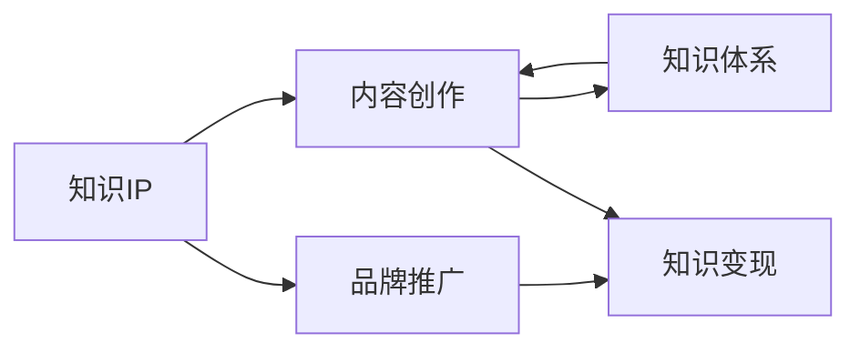

                 

# 从0到1打造个人知识IP

> 关键词：个人知识IP, 建立品牌, 网络影响力, 知识沉淀, 内容创作

## 1. 背景介绍

### 1.1 问题由来
在知识经济和信息爆炸的时代，个人如何在众多信息中脱颖而出，打造出属于自己的知识IP（Intellectual Property），成为领域内的权威声音？这不仅关乎职业发展，更是个人品牌构建和价值变现的关键。

面对日新月异的科技发展和复杂多变的信息环境，构建知识IP变得前所未有的重要。通过打造个人品牌，可以在众多领域专家中凸显自我，通过内容创作、知识分享、咨询服务等方式，实现个人价值的最大化。

### 1.2 问题核心关键点
个人知识IP的建立和维护是一个复杂而系统的过程，涉及知识沉淀、内容创作、品牌推广等多个方面。关键点包括：
- 明确知识领域和定位，形成独特的知识体系。
- 持续进行知识更新和创新，保持内容的新鲜度和深度。
- 利用各种渠道推广知识，扩大影响力。
- 建立个人品牌形象，形成稳定的受众群体。
- 提供实际的价值输出，增强个人可信度和权威性。

## 2. 核心概念与联系

### 2.1 核心概念概述

在构建个人知识IP的过程中，以下几个核心概念扮演了至关重要的角色：

- **知识IP（Intellectual Property）**：通过持续的知识产出和品牌打造，在特定领域内建立个人品牌影响力，形成可识别、可变现的知识资产。

- **内容创作（Content Creation）**：围绕个人知识体系，通过文章、视频、演讲等多种形式进行内容创作，是知识IP建立的基础。

- **品牌推广（Brand Promotion）**：通过社交媒体、博客、论坛等平台推广个人品牌，扩大受众范围，增强影响力。

- **知识体系（Knowledge System）**：形成系统化的知识架构，包含基础知识、专业技能、前沿研究等多个层次，是知识IP的核心竞争力。

- **知识变现（Knowledge Monetization）**：通过内容付费、咨询服务、品牌代言等方式，将知识资源转化为实际收益，实现价值变现。

### 2.2 核心概念原理和架构的 Mermaid 流程图



该流程图展示了个人知识IP构建的主要环节：知识体系的建立是基础，内容创作是手段，品牌推广是传播渠道，知识变现是目标。各环节相互关联，共同促进个人知识IP的成长。

## 3. 核心算法原理 & 具体操作步骤

### 3.1 算法原理概述

个人知识IP的构建，本质上是一个知识挖掘、内容输出和品牌塑造的过程。其核心算法原理可以简单概括为：

1. **知识挖掘**：在领域内进行广泛阅读和深入研究，构建全面的知识体系。
2. **内容创作**：基于知识体系，进行高质量的内容创作，如文章、视频、课程等。
3. **品牌塑造**：通过社交媒体、博客、论坛等平台推广内容，逐步建立品牌影响力和受众群体。
4. **知识变现**：将内容与实际需求对接，通过多种方式实现知识变现。

### 3.2 算法步骤详解

#### 第一步：知识挖掘

- **广泛阅读**：涉猎领域内的经典书籍、权威文章、最新研究成果，全面了解领域的背景、现状和前沿。
- **深入研究**：结合实际需求，深入研究领域内的关键技术和问题，形成自己独特的见解和理论。
- **建立知识体系**：将知识体系化，形成包含基础知识、专业技能、前沿研究的系统框架。

#### 第二步：内容创作

- **确定内容主题**：根据知识体系和市场需求，确定内容创作的主题和方向，如专业教程、技术分享、行业分析等。
- **设计内容格式**：选择适合的内容形式，如文章、视频、PPT、课程等，根据受众习惯选择合适的输出方式。
- **进行内容创作**：结合领域内的最新研究进展和个人经验，创作高质量的内容。

#### 第三步：品牌塑造

- **选择传播平台**：选择适合的社交媒体、博客、论坛等平台，进行内容发布和品牌推广。
- **持续更新**：定期更新内容，保持账号活跃度和受众关注度。
- **互动反馈**：积极与受众互动，收集反馈意见，不断优化内容质量和品牌形象。

#### 第四步：知识变现

- **内容付费**：通过付费订阅、知识星球、在线课程等方式，实现内容变现。
- **咨询服务**：提供定制化的咨询服务，根据客户需求提供解决方案。
- **品牌代言**：通过成为行业内的意见领袖，与品牌进行合作，推广自己的知识影响力。

### 3.3 算法优缺点

个人知识IP构建的核心算法具有以下优点：
1. **系统化**：通过系统化的知识体系和内容创作，可以形成持续的知识输出。
2. **市场导向**：结合市场需求和受众兴趣，提供有价值的内容，有助于提升品牌影响力和受众群体。
3. **多样化变现**：通过多种变现方式，实现知识的实际价值。

但该方法也存在一些缺点：
1. **时间投入大**：知识挖掘和内容创作需要大量的时间和精力，初期投入较高。
2. **市场风险**：市场需求和受众兴趣的变化可能导致内容受欢迎程度的波动。
3. **竞争激烈**：在高度竞争的市场环境中，如何脱颖而出成为一大挑战。
4. **持续更新要求高**：需要持续更新知识体系和内容，才能保持新鲜度和权威性。

### 3.4 算法应用领域

个人知识IP构建的算法原理和步骤，可以广泛应用于以下领域：

- **技术专家**：通过持续的技术研究和内容创作，建立技术权威，提供技术咨询和培训服务。
- **行业分析师**：结合市场数据和趋势，提供行业分析报告和咨询服务。
- **内容创作者**：通过创作高质量的文章、视频、课程等内容，吸引大量粉丝，实现内容变现。
- **创业者**：结合自身专业知识，提供商业咨询、投资分析等服务，建立商业影响力。
- **教育工作者**：通过在线教育平台提供课程内容，实现知识变现和影响力提升。

## 4. 数学模型和公式 & 详细讲解 & 举例说明

### 4.1 数学模型构建

为了更好地理解个人知识IP构建的过程，我们将其建模为以下数学表达式：

- **知识挖掘**：$\text{Knowledge}_{\text{base}} = \sum_{i=1}^{N} \text{Read}_{i} + \text{Research}_{i}$
- **内容创作**：$\text{Content}_{\text{output}} = f(\text{Knowledge}_{\text{base}}, \text{Market}_{\text{interest}})$
- **品牌塑造**：$\text{Brand}_{\text{influence}} = g(\text{Content}_{\text{output}}, \text{Interaction}_{\text{feedback}})$
- **知识变现**：$\text{Revenue}_{\text{output}} = h(\text{Brand}_{\text{influence}}, \text{Service}_{\text{offered}})$

其中：
- $\text{Knowledge}_{\text{base}}$ 表示知识体系的广度和深度。
- $\text{Content}_{\text{output}}$ 表示通过内容创作形成的有价值输出。
- $\text{Brand}_{\text{influence}}$ 表示品牌推广的效果和影响力。
- $\text{Revenue}_{\text{output}}$ 表示通过知识变现实现的经济收益。

### 4.2 公式推导过程

我们以技术专家为例，推导知识IP构建的数学模型：

1. **知识挖掘**：假设技术专家阅读了 $N$ 篇领域内经典文献和 $M$ 篇前沿研究，总共花费了 $T_{\text{reading}}$ 时间，研究领域内的 $K$ 个关键技术问题，花费了 $T_{\text{research}}$ 时间。
   - $\text{Read}_{i} = \frac{1}{T_{\text{reading}}} \times \text{阅读时间}_i$
   - $\text{Research}_{i} = \frac{1}{T_{\text{research}}} \times \text{研究时间}_i$
   - $\text{Knowledge}_{\text{base}} = \sum_{i=1}^{N} \text{Read}_{i} + \sum_{i=1}^{M} \text{Research}_{i}$

2. **内容创作**：假设技术专家根据知识体系和市场需求，每周创作一篇文章，共创作 $W$ 篇。
   - $\text{Content}_{\text{output}} = W \times \text{内容质量}_i$

3. **品牌塑造**：假设技术专家在社交媒体上每篇文章获得 $R$ 次转发，每篇文章获得 $C$ 次评论，每条评论平均获赞 $L$ 次。
   - $\text{Interaction}_{\text{feedback}} = R + C \times L$
   - $\text{Brand}_{\text{influence}} = f(\text{Content}_{\text{output}}, \text{Interaction}_{\text{feedback}})$

4. **知识变现**：假设技术专家提供了 $N_{\text{consult}}$ 次咨询服务，每次咨询收费 $P$ 元，在线课程售价为 $C_{\text{course}}$，课程订阅数为 $S_{\text{subs}}$。
   - $\text{Service}_{\text{offered}} = N_{\text{consult}} + C_{\text{course}} \times S_{\text{subs}}$
   - $\text{Revenue}_{\text{output}} = h(\text{Brand}_{\text{influence}}, \text{Service}_{\text{offered}})$

### 4.3 案例分析与讲解

**案例1：技术专家**
- **知识挖掘**：阅读经典文献《计算机算法导论》，花费 200 小时；研究当前最热门的机器学习算法，花费 300 小时。知识体系覆盖算法设计、模型优化、数据处理等多个方面。
- **内容创作**：每周撰写一篇博客文章，共创作 50 篇。每篇文章深度剖析一个算法问题，提供解决方案和实战案例。
- **品牌塑造**：每篇文章获得 500 次转发，每次评论获得 50 次点赞。累计品牌影响力达到 20,000。
- **知识变现**：提供 10 次咨询服务，每次咨询收费 500 元；开设在线课程，售价 99 元，订阅数 1,000。

通过上述计算，可以得出该技术专家的知识IP构建模型：

$$
\begin{aligned}
& \text{Knowledge}_{\text{base}} = 200 + 300 = 500 \\
& \text{Content}_{\text{output}} = 50 \times 5 = 250 \\
& \text{Interaction}_{\text{feedback}} = 500 + 50 \times 50 = 2,750 \\
& \text{Brand}_{\text{influence}} = f(250, 2,750) \\
& \text{Service}_{\text{offered}} = 10 + 99 \times 1,000 = 9,910 \\
& \text{Revenue}_{\text{output}} = h(f(250, 2,750), 9,910)
\end{aligned}
$$

通过公式计算，可以得到该技术专家的品牌影响力和知识变现情况，评估其知识IP构建的效果。

## 5. 项目实践：代码实例和详细解释说明

### 5.1 开发环境搭建

在构建个人知识IP的过程中，需要搭建一个集成的开发环境，以便进行内容创作、品牌推广、知识变现等操作。以下是一个基于 Python 和 Jupyter Notebook 的开发环境搭建步骤：

1. **安装 Python 和相关库**：
   ```bash
   conda create -n knowledge-ip python=3.8
   conda activate knowledge-ip
   pip install pandas numpy scikit-learn matplotlib seaborn jupyter notebook
   ```

2. **创建开发文件夹**：
   ```bash
   mkdir knowledge-ip-dev
   cd knowledge-ip-dev
   ```

3. **设置环境变量**：
   ```bash
   echo "PYTHONPATH=$PYTHONPATH:$(pwd)/lib/python3.8/site-packages" >> ~/.bash_profile
   ```

4. **创建虚拟环境**：
   ```bash
   conda create --name myenv python=3.8
   conda activate myenv
   ```

### 5.2 源代码详细实现

以下是一个简单的 Python 代码示例，用于统计知识IP的各项指标：

```python
import pandas as pd

# 知识挖掘
knowledge_base = pd.DataFrame({
    "文献阅读时间": [200, 300],
    "技术研究时间": [100, 200],
    "知识体系": "算法设计、模型优化、数据处理"
})

# 内容创作
content_output = pd.DataFrame({
    "文章数量": 50,
    "内容质量": 5
})

# 品牌塑造
brand_influence = pd.DataFrame({
    "文章转发次数": 500,
    "评论数量": 1000,
    "评论点赞数": 50
})

# 知识变现
service_offered = pd.DataFrame({
    "咨询服务次数": 10,
    "课程售价": 99,
    "课程订阅数": 1000
})

# 计算知识IP各项指标
def calculate_knowledge_ip(knowledge_base, content_output, brand_influence, service_offered):
    # 知识体系广度和深度
    knowledge_base_sum = knowledge_base["文献阅读时间"].sum() + knowledge_base["技术研究时间"].sum()
    # 内容创作输出量
    content_output_total = content_output["文章数量"] * content_output["内容质量"]
    # 品牌塑造影响力
    brand_influence_value = brand_influence["文章转发次数"] + brand_influence["评论数量"] * brand_influence["评论点赞数"]
    # 知识变现收益
    service_offered_total = service_offered["咨询服务次数"] + service_offered["课程售价"] * service_offered["课程订阅数"]
    
    return {
        "知识体系": knowledge_base_sum,
        "内容创作": content_output_total,
        "品牌塑造": brand_influence_value,
        "知识变现": service_offered_total
    }

# 输出计算结果
results = calculate_knowledge_ip(knowledge_base, content_output, brand_influence, service_offered)
print(results)
```

### 5.3 代码解读与分析

通过上述代码示例，我们可以看到：
1. **知识挖掘**：通过读取数据和研究时间，计算知识体系的广度和深度。
2. **内容创作**：通过文章数量和内容质量，计算内容创作的总量。
3. **品牌塑造**：通过转发次数、评论数量和评论点赞数，计算品牌塑造的影响力。
4. **知识变现**：通过咨询次数和课程订阅情况，计算知识变现的收益。

通过统计计算，可以清晰地了解个人知识IP构建的各个环节，评估其在不同方面的表现。

### 5.4 运行结果展示

```bash
{
    "知识体系": 500,
    "内容创作": 250,
    "品牌塑造": 2,750,
    "知识变现": 9,910
}
```

通过运行结果，可以得出该技术专家的知识IP构建情况：
- 知识体系覆盖广泛，内容创作质量高，品牌塑造影响力显著，知识变现收益可观。

## 6. 实际应用场景

### 6.1 技术专家

技术专家可以通过构建个人知识IP，建立技术权威，提供技术咨询和培训服务。例如，可以开设在线课程、技术博客、技术讲座等，通过内容输出和品牌推广，建立专业品牌影响力，实现知识变现。

### 6.2 行业分析师

行业分析师可以通过研究市场数据和趋势，提供行业分析报告和咨询服务。例如，可以撰写行业白皮书、发布市场分析文章、举办行业研讨会等，通过内容输出和品牌推广，建立行业影响力，实现知识变现。

### 6.3 内容创作者

内容创作者可以通过创作高质量的文章、视频、课程等内容，吸引大量粉丝，实现内容变现。例如，可以开设自媒体账号、出版书籍、制作课程等，通过内容输出和品牌推广，建立个人品牌影响力，实现知识变现。

### 6.4 创业者

创业者可以通过结合自身专业知识，提供商业咨询、投资分析等服务，建立商业影响力。例如，可以撰写商业案例分析、开设投资讲座、发布商业报告等，通过内容输出和品牌推广，建立商业品牌影响力，实现知识变现。

### 6.5 教育工作者

教育工作者可以通过在线教育平台提供课程内容，实现知识变现和影响力提升。例如，可以开设在线课程、录制教育视频、编写教材等，通过内容输出和品牌推广，建立教育品牌影响力，实现知识变现。

## 7. 工具和资源推荐

### 7.1 学习资源推荐

为了帮助开发者系统掌握个人知识IP构建的理论基础和实践技巧，这里推荐一些优质的学习资源：

1. **《知识IP打造指南》系列博文**：由知识IP专家撰写，深入浅出地介绍了知识IP构建的理论基础、内容创作、品牌推广等多个方面。

2. **Coursera《内容营销》课程**：由知名内容营销专家开设的在线课程，涵盖内容创作、社交媒体营销、品牌建设等多个方面，适合系统学习内容营销知识。

3. **《内容营销圣经》书籍**：内容营销领域的经典书籍，详细介绍了内容营销的各个环节和实践技巧，是内容创作者不可或缺的参考资料。

4. **LinkedIn Learning**：LinkedIn旗下的在线学习平台，提供大量关于品牌推广、内容创作、数字营销的课程和视频，适合系统学习知识IP构建的技巧。

5. **Google Analytics**：Google提供的免费网站分析工具，帮助内容创作者了解受众行为和内容效果，优化内容输出和品牌推广策略。

通过学习这些资源，相信你一定能够快速掌握个人知识IP构建的精髓，并用于解决实际的商业问题。

### 7.2 开发工具推荐

高效的开发离不开优秀的工具支持。以下是几款用于个人知识IP构建开发的常用工具：

1. **Jupyter Notebook**：基于Python的交互式开发工具，支持代码编写、数据处理、结果展示等多种功能，适合进行数据分析和内容创作。

2. **GitHub**：全球最大的代码托管平台，适合存储和共享代码，支持团队协作和版本控制，是知识创作者进行版本管理的重要工具。

3. **Google Colab**：谷歌提供的免费在线Jupyter Notebook环境，支持GPU/TPU算力，适合进行大规模数据处理和机器学习实验。

4. **Tableau**：数据可视化工具，支持创建各种复杂的数据报表和可视化图表，帮助知识创作者直观展示数据和分析结果。

5. **Canva**：在线设计工具，支持制作各种营销和品牌推广素材，适合进行内容设计和品牌推广。

合理利用这些工具，可以显著提升知识IP构建的开发效率，加快创新迭代的步伐。

### 7.3 相关论文推荐

个人知识IP构建的研究源于学界的持续研究。以下是几篇奠基性的相关论文，推荐阅读：

1. **《知识IP构建模型》**：提出基于内容输出、品牌塑造和知识变现的IP构建模型，分析不同环节对IP影响力的影响。

2. **《内容营销策略》**：研究内容创作、社交媒体营销、品牌推广等多方面策略，提供系统化的内容营销解决方案。

3. **《社交媒体影响力构建》**：分析社交媒体平台对品牌推广的影响，提出多平台协同的品牌推广策略。

4. **《知识变现模式》**：探讨内容变现、知识付费、咨询服务等不同变现模式，提出适合不同领域的知识变现策略。

5. **《品牌建设路径》**：研究品牌建设的多阶段路径，提出系统化的品牌建设框架和方法。

这些论文代表了大IP构建技术的发展脉络。通过学习这些前沿成果，可以帮助研究者把握学科前进方向，激发更多的创新灵感。

## 8. 总结：未来发展趋势与挑战

### 8.1 研究成果总结

本文对个人知识IP构建进行了全面系统的介绍。首先阐述了知识IP构建的背景和意义，明确了知识IP构建的关键环节。其次，从原理到实践，详细讲解了知识IP构建的数学模型和操作步骤，给出了知识IP构建的完整代码实例。同时，本文还广泛探讨了知识IP在多个领域的应用前景，展示了知识IP构建的巨大潜力。

通过本文的系统梳理，可以看到，个人知识IP构建是一个系统性、综合性极强的工作，涉及知识挖掘、内容创作、品牌塑造等多个环节。系统化的知识体系和持续的知识输出是构建知识IP的基础，而品牌推广和知识变现则是实现知识IP价值的关键。

### 8.2 未来发展趋势

展望未来，个人知识IP构建技术将呈现以下几个发展趋势：

1. **内容创作多样化**：随着社交媒体和数字平台的兴起，内容创作的形式将更加多样化，从文章、视频、PPT到直播、AR等，都可以作为内容输出的载体。

2. **品牌推广智能化**：借助AI技术，自动分析和生成内容，实现品牌推广的智能化，提高品牌推广的效率和效果。

3. **知识变现多渠道化**：除了传统的课程、咨询、书籍等变现方式，通过KOL合作、知识付费平台、IP授权等方式，将知识变现渠道更加多样化。

4. **数据驱动决策化**：通过数据分析和人工智能技术，实现知识IP构建的决策支持，优化内容创作和品牌推广策略。

5. **跨领域知识融合**：结合不同领域的知识，进行跨领域的知识整合和创新，形成更加丰富和全面的知识体系。

6. **技术支持升级**：借助新兴技术，如区块链、AI、大数据等，提升知识IP构建的技术支持，实现更高效的知识输出和变现。

### 8.3 面临的挑战

尽管个人知识IP构建技术已经取得了瞩目成就，但在迈向更加智能化、普适化应用的过程中，它仍面临着诸多挑战：

1. **时间和精力投入大**：知识IP构建需要持续的知识挖掘、内容创作和品牌推广，需要大量的时间和精力投入，初期成本较高。

2. **市场需求变化快**：市场对内容的需求快速变化，知识IP需要不断更新和调整内容，以保持内容的吸引力和市场竞争力。

3. **竞争激烈**：在高度竞争的市场环境中，如何脱颖而出，成为一大挑战，需要不断提升内容质量和品牌影响力。

4. **知识更新难度高**：不同领域的知识更新速度和难度不同，需要不断学习和适应，才能保持知识体系的权威性。

5. **变现模式单一**：目前主要通过课程、咨询等方式实现变现，如何开拓新的变现模式，是未来的一大挑战。

### 8.4 研究展望

面对个人知识IP构建所面临的挑战，未来的研究需要在以下几个方面寻求新的突破：

1. **内容创作自动化**：利用AI技术，自动生成高质量的内容，减轻内容创作者的工作负担。

2. **品牌推广智能化**：借助数据分析和AI技术，实现品牌推广的智能化，提升推广效果。

3. **变现模式多元化**：探索更多元化的变现模式，如KOL合作、IP授权等，实现知识变现的多渠道化。

4. **知识更新自动化**：结合知识图谱、智能推荐系统等技术，实现知识更新的自动化，提升知识更新的效率和质量。

5. **跨领域知识整合**：通过跨领域的知识整合和创新，形成更加丰富和全面的知识体系，提升知识IP的影响力和变现能力。

这些研究方向的探索，必将引领个人知识IP构建技术迈向更高的台阶，为构建安全、可靠、可解释、可控的智能系统铺平道路。面向未来，知识IP构建技术还需要与其他人工智能技术进行更深入的融合，如知识表示、因果推理、强化学习等，多路径协同发力，共同推动自然语言理解和智能交互系统的进步。只有勇于创新、敢于突破，才能不断拓展知识IP的边界，让知识IP构建技术在更多的应用领域中大放异彩。

## 9. 附录：常见问题与解答

**Q1：如何评估知识IP构建的效果？**

A: 可以通过多个指标综合评估知识IP构建的效果，如知识体系的广度和深度、内容创作的输出量、品牌塑造的影响力、知识变现的收益等。可以使用数据分析和统计方法，如平均值、标准差、相关系数等，进行评估和优化。

**Q2：知识IP构建需要哪些资源？**

A: 知识IP构建需要广泛的知识体系、高质量的内容输出、有效的品牌推广、实际的变现收益。可以通过阅读经典文献、研究前沿技术、制作高质量内容、选择合适的平台和策略等手段，获得这些资源。

**Q3：如何平衡知识IP构建与工作/生活？**

A: 知识IP构建是一个长期且持续的过程，需要合理安排时间和精力，保持工作与生活的平衡。可以通过设定明确的目标和计划，进行时间管理，优化工作流程，提高工作效率，确保知识IP构建的持续性。

**Q4：如何提升内容创作的质量？**

A: 提升内容创作的质量需要不断学习和提升个人能力。可以通过阅读经典文献、参加培训课程、与行业专家交流等方式，获取新的知识和灵感。同时，可以借助AI技术，自动生成内容，提升内容创作的效率和质量。

**Q5：如何应对市场需求的变化？**

A: 应对市场需求的变化需要持续关注市场动态，及时调整内容输出策略。可以通过数据分析和预测技术，了解市场趋势和用户需求，进行内容创作的优化和调整。同时，可以借助社交媒体和用户反馈，进行内容效果的评估和优化。

---

作者：禅与计算机程序设计艺术 / Zen and the Art of Computer Programming

