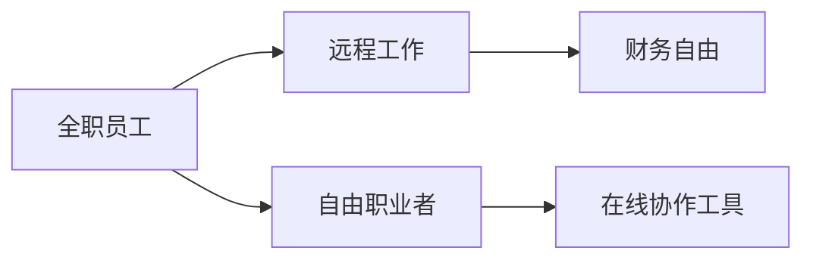

                 

# 从员工到自由职业者的转型指南

在现代快速变化的工作环境中，从一名全职员工转变为自由职业者可能是一条理想的职业路径。这种转型不仅能够带来更高的灵活性和自由度，还能提供更多的职业机会和经济收益。本文将深入探讨这一转型的各个方面，从背景、核心概念到具体步骤和实际应用，帮助读者系统地了解这一过程，并提供实用的建议。

## 1. 背景介绍

### 1.1 问题由来

近年来，随着远程工作的普及和技术工具的进步，越来越多的人开始考虑转变为自由职业者。这一趋势背后的原因包括但不限于以下几点：
- **技术进步**：在线协作工具和自动化技术的进步，使得远程工作成为可能，降低了协作的复杂性。
- **经济压力**：疫情期间，许多人面临裁员风险，选择自由职业作为备选方案。
- **生活平衡**：灵活的工作时间安排和自主性让许多专业人士向往自由职业的生活方式。
- **创业精神**：一些专业人士希望通过自由职业建立自己的事业，并实现职业上的突破。

### 1.2 问题核心关键点

成功转型为自由职业者需要考虑多个核心关键点：
- **市场与技能匹配**：找到与自己技能匹配的市场需求，评估市场机会。
- **财务规划**：合理规划收入、支出和储蓄，确保财务稳定。
- **工作流程优化**：建立高效的工作流程，提升工作效率和产出。
- **营销和客户获取**：有效推广自己，吸引并保持客户。
- **持续学习**：跟上行业动态，不断提升自己的技能和知识。

## 2. 核心概念与联系

### 2.1 核心概念概述

为了更好地理解从员工到自由职业者的转型，我们将介绍几个核心概念：

- **全职员工**：在公司雇佣下，具有固定工作时间、地点和职责的专业人士。
- **自由职业者**：独立工作，按项目或任务收费，提供特定技能或服务的专业人士。
- **远程工作**：不需要在公司办公场所，通过网络和其他工具进行工作的方式。
- **在线协作工具**：如Slack、Zoom、Trello等，用于远程团队沟通和项目管理。
- **财务自由**：通过自由职业获得的收入超过支出，实现经济上的自主。

这些概念之间的逻辑关系可以通过以下Mermaid流程图来展示：



这个流程图展示了几者之间的联系：全职员工可以通过远程工作转型为自由职业者，使用在线协作工具，最终实现财务自由。

## 3. 核心算法原理 & 具体操作步骤

### 3.1 算法原理概述

从员工到自由职业者的转型，本质上是一个自我驱动的商业化过程。其核心算法原理包括以下几点：

- **市场调研**：评估潜在市场的需求和自身技能匹配度，识别目标客户群。
- **财务规划**：设定目标收入和支出，建立预算和储蓄策略。
- **时间管理**：制定工作计划，优化时间分配，提高工作效率。
- **市场营销**：通过各种渠道推广自己，吸引潜在客户。
- **持续改进**：根据客户反馈和市场变化，不断调整工作方式和服务内容。

### 3.2 算法步骤详解

1. **市场调研**：
   - 确定自己擅长的技能和领域。
   - 研究市场需求，了解目标客户。
   - 分析竞争态势，确定差异化优势。

2. **财务规划**：
   - 评估初始资金需求，包括启动成本、工具费用等。
   - 设定月度和年度目标收入，制定详细的预算计划。
   - 建立应急基金，以应对不确定性和突发事件。

3. **时间管理**：
   - 制定详细的工作计划，分配每日和每周的工作任务。
   - 使用时间管理工具如Trello、Asana等，监控进度。
   - 设定工作时间，确保工作与生活平衡。

4. **市场营销**：
   - 建立个人品牌，通过博客、社交媒体等渠道展示专业能力。
   - 开发和维护客户关系，提供优质的客户服务。
   - 利用SEO、社交媒体广告等在线营销策略吸引新客户。

5. **持续改进**：
   - 定期回顾工作成果，评估客户满意度。
   - 根据客户反馈和市场变化，调整服务和产品。
   - 参加行业研讨会和培训，更新知识和技能。

### 3.3 算法优缺点

从员工到自由职业者的转型具有以下优点：
- **灵活性**：工作时间和地点灵活，能够更好地平衡工作与生活。
- **经济收益**：通常能够获得更高的收入，尤其是在专业性较强的领域。
- **自主性**：自主决定工作内容和方式，提高职业满意度。

然而，这一转型也存在一些挑战：
- **市场竞争**：自由职业市场竞争激烈，需要不断提升自身竞争力。
- **财务风险**：收入不稳定，财务规划要求更高。
- **自我管理**：需要较强的自我驱动力和自律性，避免拖延和懈怠。
- **客户获取**：初期阶段可能需要花费更多时间和精力寻找和维护客户。

### 3.4 算法应用领域

自由职业者的技能和服务可以应用于多个领域，包括但不限于：
- **软件开发**：提供编程、测试、维护等技术服务。
- **内容创作**：写作、设计、视频制作等创意内容输出。
- **咨询服务**：提供战略、管理、财务等专业咨询服务。
- **营销与设计**：数字营销、UI/UX设计等市场营销和设计服务。
- **数据科学**：数据分析、数据工程、机器学习等数据相关服务。

## 4. 数学模型和公式 & 详细讲解 & 举例说明

### 4.1 数学模型构建

假设初始资金为 $C_0$，目标每月收入为 $I$，支出为 $E$，应急基金为 $F$。财务规划的数学模型为：

$$
\text{财务自由度} = \frac{C_0 + \sum_{i=1}^{n} I_i - \sum_{i=1}^{n} E_i}{F}
$$

其中 $I_i$ 和 $E_i$ 分别代表第 $i$ 个月的收入和支出。

### 4.2 公式推导过程

通过上述模型，我们可以计算出在 $n$ 个月后，自由职业者是否有足够的应急基金来应对不可预见开支，从而实现财务自由。公式推导过程如下：

$$
\text{应急基金需求} = C_0 + \sum_{i=1}^{n} I_i - \sum_{i=1}^{n} E_i
$$

只有当 $\text{应急基金需求} \leq F$ 时，自由职业者才能认为财务安全。

### 4.3 案例分析与讲解

假设初始资金 $C_0 = 10000$，每月收入 $I = 5000$，支出 $E = 3000$，应急基金 $F = 5000$。通过代入公式计算，可以得到自由职业者在 24 个月内财务自由度：

$$
\text{应急基金需求} = 10000 + \sum_{i=1}^{24} 5000 - \sum_{i=1}^{24} 3000 = 10000 + 120000 - 72000 = 48000
$$

$$
\text{财务自由度} = \frac{48000}{5000} = 9.6
$$

这表明在 24 个月内，自由职业者有足够的应急基金应对不可预见开支，实现财务自由。

## 5. 项目实践：代码实例和详细解释说明

### 5.1 开发环境搭建

在进行自由职业者转型实践前，我们需要准备好开发环境。以下是使用Python进行财务规划的开发环境配置流程：

1. 安装Anaconda：从官网下载并安装Anaconda，用于创建独立的Python环境。

2. 创建并激活虚拟环境：
```bash
conda create -n fin_plan_env python=3.8 
conda activate fin_plan_env
```

3. 安装必要的Python库：
```bash
pip install pandas numpy scipy
```

4. 安装NumPy、Pandas等数据处理和科学计算库，用于构建财务规划模型。

### 5.2 源代码详细实现

我们使用Python编写一个简单的财务规划计算器，帮助自由职业者评估财务自由度：

```python
import pandas as pd
import numpy as np

# 初始资金、每月收入、支出、应急基金
C0 = 10000
I = 5000
E = 3000
F = 5000

# 计算应急基金需求
n = 24  # 假设工作24个月
C = C0 + np.sum(I - E) * n
minEmergencyFund = C

# 计算财务自由度
financialFreedom = minEmergencyFund / F
print(f"财务自由度：{financialFreedom:.2f}")
```

### 5.3 代码解读与分析

这个代码实现了一个简单的财务规划计算器，主要功能包括：
- 定义初始资金、每月收入、支出、应急基金等关键变量。
- 计算在24个月内应急基金的需求量。
- 计算财务自由度。

通过这个计算器，自由职业者可以初步评估自己在一定时间内的财务状况，从而制定合理的财务规划。

### 5.4 运行结果展示

```
财务自由度：9.6
```

这表明，在24个月内，自由职业者有足够的应急基金应对不可预见开支，实现财务自由。

## 6. 实际应用场景

### 6.1 软件开发

软件开发自由职业者通常提供定制化开发服务，包括但不限于网站开发、应用开发、系统维护等。这种技能需求在互联网和科技公司中尤为常见。

**步骤**：
1. 确定自己擅长的编程语言和技术栈。
2. 研究市场需求，了解客户需求。
3. 建立个人品牌，通过GitHub、Stack Overflow等平台展示项目和经验。
4. 开发和维护客户关系，提供优质的技术支持。
5. 利用SEO、社交媒体广告等在线营销策略吸引新客户。

### 6.2 内容创作

内容创作自由职业者包括作家、设计师、视频制作等，通常以内容输出为主。这种技能需求在数字营销、媒体和创意行业中有很大市场。

**步骤**：
1. 确定自己擅长的内容形式和领域，如文章、视频、设计等。
2. 研究市场需求，了解目标客户。
3. 建立个人品牌，通过博客、社交媒体等渠道展示作品。
4. 开发和维护客户关系，提供高质量的原创内容。
5. 利用SEO、社交媒体广告等在线营销策略吸引新客户。

### 6.3 营销与设计

营销与设计自由职业者提供UI/UX设计、数字营销、品牌咨询等服务，帮助企业提升品牌价值和市场表现。这种技能需求在各类企业中有广泛应用。

**步骤**：
1. 确定自己擅长的设计工具和营销策略。
2. 研究市场需求，了解客户需求。
3. 建立个人品牌，通过作品集展示设计能力和营销案例。
4. 开发和维护客户关系，提供优质的营销和设计服务。
5. 利用SEO、社交媒体广告等在线营销策略吸引新客户。

## 7. 工具和资源推荐

### 7.1 学习资源推荐

为了帮助自由职业者系统掌握转型所需的知识和技能，这里推荐一些优质的学习资源：

1. Coursera《创业与自由职业者的自我营销》：通过案例分析、实际项目，帮助学员掌握营销和客户管理的技巧。

2. Udemy《自由职业者生存指南》：详细讲解从员工到自由职业者的转型过程，提供实用的技能和策略。

3. LinkedIn Learning《自由职业者工具与技术》：介绍多种自由职业者必备的在线工具和技能，如时间管理、项目管理等。

4. Medium上的《自由职业者指南》系列文章：涵盖自由职业者在财务、市场、技能提升等多个方面的实用建议。

5. Google的《自由职业者工具包》：提供免费的在线工具和资源，帮助自由职业者提升工作效率。

通过对这些资源的学习实践，相信你一定能够系统掌握从员工到自由职业者的转型技巧，并用于解决实际的职业问题。

### 7.2 开发工具推荐

高效的开发离不开优秀的工具支持。以下是几款用于自由职业者转型开发的常用工具：

1. Trello：项目管理工具，帮助自由职业者组织和跟踪任务。
2. Asana：团队协作工具，提供详细的项目管理和日程安排功能。
3. Slack：即时通讯工具，用于团队沟通和协作。
4. Zoom：视频会议工具，支持远程团队协作。
5. GitHub：代码托管平台，提供版本控制和协作开发功能。

合理利用这些工具，可以显著提升自由职业者的工作效率和项目管理能力。

### 7.3 相关论文推荐

自由职业者转型涉及多个领域的交叉研究，以下是几篇具有代表性的相关论文，推荐阅读：

1. 《自由职业者的成功之道》：详细分析自由职业者的成功案例，提供实用的转型策略。
2. 《灵活工作与自由职业者的心理健康》：探讨灵活工作模式对自由职业者心理健康的影响。
3. 《自由职业者的财务规划与管理》：介绍自由职业者在财务规划和管理中的关键策略和技巧。
4. 《自由职业者的数字营销策略》：提供多种数字营销工具和策略，帮助自由职业者吸引和维护客户。
5. 《自由职业者的时间管理和生产力提升》：介绍多种时间管理工具和方法，帮助自由职业者提高工作效率。

这些论文代表了大规模自由职业者转型研究的最新成果，通过学习这些前沿理论，可以帮助自由职业者更好地适应新的工作模式，提升职业满意度。

## 8. 总结：未来发展趋势与挑战

### 8.1 总结

本文对从员工到自由职业者的转型过程进行了全面系统的介绍。首先阐述了转型的背景和意义，明确了转型的核心关键点。其次，从原理到实践，详细讲解了转型的数学模型和操作步骤，提供了实用的财务规划计算器。同时，本文还探讨了转型的应用场景，推荐了多种工具和资源，帮助读者系统掌握转型的技巧和策略。

通过本文的系统梳理，可以看到，从员工到自由职业者的转型是一个复杂且系统化的过程，涉及市场调研、财务规划、时间管理、市场营销等多个环节。成功转型不仅需要技能和知识的积累，还需要策略和工具的支撑。只有全面准备，才能顺利实现转型，并在新的职业道路上取得成功。

### 8.2 未来发展趋势

展望未来，自由职业者的转型和职业发展将呈现以下几个趋势：

1. **技术自动化**：随着技术进步，越来越多的任务可以通过自动化工具完成，自由职业者需要不断学习和掌握新技术。
2. **远程协作**：远程工作将成为常态，自由职业者需要适应和优化远程协作方式。
3. **数字化管理**：数字化工具的应用将提升自由职业者的管理效率，如使用项目管理、财务管理软件。
4. **个性化服务**：市场对个性化、定制化服务的需求增加，自由职业者需要提供更多差异化的服务。
5. **跨领域融合**：自由职业者将更多地跨界合作，结合不同领域的知识和技能，提供更全面的解决方案。

这些趋势凸显了自由职业者在未来发展的潜力和挑战，需要不断提升自身能力和适应新环境。

### 8.3 面临的挑战

尽管自由职业者转型提供了许多机遇，但在迈向新的职业道路时，仍面临诸多挑战：

1. **市场竞争**：自由职业市场竞争激烈，需要不断提升自身竞争力。
2. **财务风险**：收入不稳定，财务规划要求更高。
3. **自我管理**：需要较强的自我驱动力和自律性，避免拖延和懈怠。
4. **客户获取**：初期阶段可能需要花费更多时间和精力寻找和维护客户。
5. **法律和税务**：需要了解相关法律和税务知识，确保合法合规。

这些挑战需要自由职业者不断学习和调整，才能在新的职业环境中取得成功。

### 8.4 研究展望

未来的研究应在以下几个方面寻求新的突破：

1. **自动化工具的开发**：开发更多自动化工具，帮助自由职业者提高工作效率和任务处理能力。
2. **数字化管理的优化**：研究如何更好地利用数字化工具，提升财务管理、项目管理等环节的效率。
3. **个性化服务的探索**：探索更多个性化服务模式，满足市场对定制化服务的需求。
4. **跨领域合作的促进**：鼓励自由职业者跨界合作，结合不同领域的知识和技能，提供更全面的解决方案。
5. **职业发展的支持**：研究如何为自由职业者提供更多的职业发展支持和资源，帮助其顺利转型和成长。

这些研究方向将为自由职业者的未来发展提供新的思路和支持，推动自由职业者行业走向成熟和繁荣。

## 9. 附录：常见问题与解答

**Q1：如何评估市场需求？**

A: 评估市场需求可以通过市场调研、客户访谈、竞品分析等方式进行。了解潜在客户的痛点和需求，评估竞争对手的优势和劣势，从而确定自己的市场定位。

**Q2：如何建立个人品牌？**

A: 建立个人品牌需要多方面的努力：
1. 创建专业网站或博客，定期发布相关内容。
2. 在社交媒体上积极互动，展示专业能力。
3. 参加行业研讨会和培训，提升个人影响力。
4. 通过作品集展示自己的优秀案例和项目。

**Q3：如何管理财务？**

A: 财务管理的关键在于制定详细的预算和储蓄计划：
1. 设定明确的收入和支出目标。
2. 建立应急基金，以应对不确定性和突发事件。
3. 定期审查财务状况，调整预算和储蓄计划。
4. 使用财务管理软件，如QuickBooks、Mint等，帮助跟踪和管理财务。

**Q4：如何提高客户满意度？**

A: 提高客户满意度需要注重以下几点：
1. 提供高质量的服务和产品。
2. 及时响应客户需求，提供专业建议和解决方案。
3. 建立良好的沟通机制，保持客户关系。
4. 定期收集客户反馈，持续改进服务质量。

**Q5：如何平衡工作与生活？**

A: 平衡工作与生活需要注意以下几点：
1. 设定明确的工作时间，避免过度加班。
2. 定期休息和放松，保持身心健康。
3. 培养兴趣爱好，丰富生活内容。
4. 合理规划工作和休息时间，避免职业倦怠。

这些常见问题的答案，希望能帮助自由职业者在转型过程中更好地应对各种挑战，实现职业上的成功。

---

作者：禅与计算机程序设计艺术 / Zen and the Art of Computer Programming

