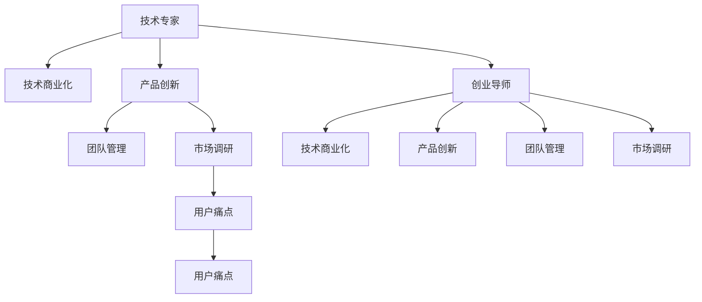

                 

# 从技术专家到创业导师的蜕变

## 1. 背景介绍

### 1.1 问题由来

在技术迅猛发展的时代，技术专家们往往面临着从技术研发向商业应用转型的挑战。将技术成果转化为商业价值，不仅需要深厚的技术积累，还需要出色的商业智慧和管理能力。因此，很多技术专家在转型过程中遭遇了瓶颈。本文将从技术专家转型为创业导师的角度，探讨其中的关键转变和核心策略。

### 1.2 问题核心关键点

技术专家转型为创业导师的关键在于：
- 从技术思维转向商业思维：理解市场需求、用户痛点，明确技术应用的商业价值。
- 从技术研发转向产品创新：设计符合市场需求的创新产品，寻找技术突破口。
- 从内部团队管理转向外部资源整合：搭建高效的创业团队，整合内部技术资源和外部市场资源。
- 从技术问题解决转向商业问题解决：从单一的技术视角转向多维度的商业视角，综合考虑技术、市场、运营等多个方面的问题。

本文将系统分析技术专家转型为创业导师的各个关键环节，为技术专家转型提供全面的指导和参考。

## 2. 核心概念与联系

### 2.1 核心概念概述

为更好地理解技术专家转型为创业导师的蜕变过程，本节将介绍几个密切相关的核心概念：

- 技术专家(Technical Expert)：具有深厚的技术积累，精通算法、架构、编程等技术领域的专家。
- 创业导师(Venture Coach)：拥有丰富创业经验和商业智慧，能够指导创业者进行技术创新和商业运作的专家。
- 技术商业化(Technology Commercialization)：将技术成果转化为商业产品和服务，实现技术应用的经济价值。
- 产品创新(Product Innovation)：通过技术研发和市场调研，设计符合市场需求的新产品或改进现有产品。
- 团队管理(Team Management)：指导团队成员有效协同工作，提升团队整体效率和创新能力。
- 市场调研(Market Research)：了解市场需求和竞争状况，为产品创新和商业决策提供数据支撑。
- 用户痛点(User Pain Point)：用户在实际使用产品或服务过程中遇到的困难和问题，是产品创新的重要出发点。

这些核心概念之间的逻辑关系可以通过以下Mermaid流程图来展示：



这个流程图展示了我从技术专家转型为创业导师的关键路径：

1. 从技术专家到产品创新的过程。
2. 从产品创新到技术商业化的过程。
3. 从技术商业化到创业导师的指导。

## 3. 核心算法原理 & 具体操作步骤

### 3.1 算法原理概述

技术专家转型为创业导师的过程，本质上是从技术视角向商业视角的转换。其核心在于如何将技术创新和市场需求有机结合，找到技术应用的商业价值。

技术商业化的过程通常包括以下几个关键步骤：

1. 技术创新：通过技术研发，形成具有市场竞争力的产品或服务。
2. 市场需求分析：通过市场调研，了解目标用户的需求和痛点。
3. 商业模式设计：结合技术创新和市场需求，设计符合市场规律的经济模型。
4. 团队建设与管理：构建高效的团队，推动产品商业化过程。
5. 市场推广与销售：通过营销手段，将产品推广到目标市场。

### 3.2 算法步骤详解

以下详细说明技术专家转型为创业导师的各个步骤：

**Step 1: 技术创新**

- **技术积累**：
  - 深入研究当前领域的前沿技术，积累深厚的技术基础。
  - 不断探索新技术和新算法，保持技术领先地位。

- **技术突破**：
  - 针对市场需求，寻找技术应用的突破口。
  - 针对用户痛点，进行技术创新，设计高效、可靠的产品方案。

**Step 2: 市场需求分析**

- **市场调研**：
  - 通过问卷调查、用户访谈、竞争分析等手段，获取目标市场的数据。
  - 分析市场趋势，理解用户需求和痛点。

- **需求验证**：
  - 通过最小可行性产品(MVP)验证产品是否满足用户需求。
  - 收集用户反馈，不断优化产品方案。

**Step 3: 商业模式设计**

- **经济模型设计**：
  - 根据技术创新和市场需求，设计可持续发展的经济模型。
  - 考虑产品的定价策略、收益模式、市场份额等关键因素。

- **盈利预测**：
  - 通过市场调研和产品测试，预测产品未来的收益情况。
  - 制定相应的财务计划和投资策略。

**Step 4: 团队建设与管理**

- **团队构建**：
  - 组建由不同背景的专家组成的创业团队，包括技术、市场、运营等。
  - 明确团队成员的角色和职责，推动团队协同工作。

- **管理策略**：
  - 制定有效的项目管理方法，如Scrum、Kanban等。
  - 培养团队的沟通、协作和创新能力。

**Step 5: 市场推广与销售**

- **营销策略**：
  - 制定针对目标市场的营销策略，如SEO、SEM、社交媒体营销等。
  - 通过广告、公关、合作等手段，提升品牌知名度。

- **销售渠道**：
  - 选择适合的产品销售渠道，如线上电商平台、线下零售商等。
  - 建立高效的销售团队，优化销售流程。

### 3.3 算法优缺点

技术专家转型为创业导师的过程具有以下优点：

- **技术优势**：具备深厚的技术积累，能够设计和实现具有创新性的产品。
- **商业智慧**：通过学习创业知识和经验，具备更全面的商业视野和战略思维。
- **团队领导**：能够指导团队成员进行技术创新和市场拓展，提升整体团队能力。

然而，这一过程也存在一些局限性：

- **商业经验不足**：初次创业可能缺乏市场和商业运作经验，需要不断学习和积累。
- **资源整合难度大**：搭建和整合团队资源、市场资源和资金资源需要大量时间和精力。
- **风险承受能力**：创业过程伴随着高风险，需要有较强的心理素质和应对能力。

### 3.4 算法应用领域

技术专家转型为创业导师的思路和方法，适用于多个领域的技术创新和商业化应用，如：

- 人工智能：通过技术研发和市场需求分析，设计出满足用户需求的AI产品。
- 物联网：将技术创新应用于智能家居、智慧城市等物联网领域，实现智能化的生活和工作场景。
- 区块链：通过区块链技术开发去中心化应用，如数字货币、智能合约等。
- 健康科技：结合医疗技术，开发健康监测、远程医疗等创新产品。
- 金融科技：利用大数据、机器学习等技术，开发智能投顾、金融分析等金融应用。
- 教育科技：开发在线教育平台、智能辅助教学工具等，提升教育质量和效率。

这些领域的技术创新和商业化，都需要技术专家具备从技术视角到商业视角的转换能力，以实现技术应用的商业价值。

## 4. 数学模型和公式 & 详细讲解 & 举例说明

### 4.1 数学模型构建

本节将使用数学语言对技术专家转型为创业导师的过程进行更加严格的刻画。

记技术创新过程为 $I(t)$，其中 $t$ 表示时间，$I(t)$ 表示在时间 $t$ 的技术创新水平。记市场需求分析过程为 $D(t)$，其中 $t$ 表示时间，$D(t)$ 表示在时间 $t$ 的市场需求分析水平。记商业模式设计过程为 $M(t)$，其中 $t$ 表示时间，$M(t)$ 表示在时间 $t$ 的商业模式设计水平。记团队建设与管理过程为 $T(t)$，其中 $t$ 表示时间，$T(t)$ 表示在时间 $t$ 的团队建设与管理水平。记市场推广与销售过程为 $S(t)$，其中 $t$ 表示时间，$S(t)$ 表示在时间 $t$ 的市场推广与销售水平。

定义技术创新、市场需求分析、商业模式设计、团队建设与管理、市场推广与销售之间的关系为：

$$
\dot{I}(t) = f(I(t), D(t), M(t), T(t), S(t))
$$

$$
\dot{D}(t) = g(I(t), D(t), M(t), T(t), S(t))
$$

$$
\dot{M}(t) = h(I(t), D(t), M(t), T(t), S(t))
$$

$$
\dot{T}(t) = k(I(t), D(t), M(t), T(t), S(t))
$$

$$
\dot{S}(t) = l(I(t), D(t), M(t), T(t), S(t))
$$

其中 $f$、$g$、$h$、$k$、$l$ 分别表示技术创新、市场需求分析、商业模式设计、团队建设与管理、市场推广与销售之间的动态关系。

### 4.2 公式推导过程

以下我们以AI产品开发为例，推导技术创新和市场推广之间的关系。

假设市场推广过程的参数为 $S(t)$，包括广告支出、营销策略等。技术创新的参数为 $I(t)$，包括算法优化、模型训练等。市场需求分析的参数为 $D(t)$，包括用户调研、竞争分析等。

市场推广对技术创新的影响为：

$$
S(t) = \alpha I(t) + \beta D(t) + \gamma M(t)
$$

其中 $\alpha$、$\beta$、$\gamma$ 为系数，表示市场推广对技术创新、市场需求分析和商业模式设计的依赖程度。

技术创新对市场推广的影响为：

$$
I(t) = \delta S(t) + \epsilon D(t) + \zeta M(t)
$$

其中 $\delta$、$\epsilon$、$\zeta$ 为系数，表示技术创新对市场推广、市场需求分析和商业模式设计的依赖程度。

将上述两个方程联立，得到市场推广与技术创新的动态关系为：

$$
S(t) = \alpha (\delta S(t) + \epsilon D(t) + \zeta M(t)) + \beta D(t) + \gamma M(t)
$$

$$
I(t) = \delta (\alpha I(t) + \beta D(t) + \gamma M(t)) + \epsilon D(t) + \zeta M(t)
$$

通过对方程的化简和求解，可以发现市场推广与技术创新之间的互动关系，从而设计出有效的市场推广策略，推动技术创新的实现。

### 4.3 案例分析与讲解

下面以一家智能家居企业为例，展示技术专家转型为创业导师的具体应用：

**背景**：
一家初创企业开发智能家居产品，核心技术为语音识别和家庭自动化。

**技术创新**：
- 深入研究语音识别领域的前沿技术，积累深厚的技术基础。
- 设计高效的语音识别算法，提升产品的识别准确率。

**市场需求分析**：
- 通过问卷调查和用户访谈，了解目标用户的需求和痛点。
- 分析市场趋势，预测未来的市场需求。

**商业模式设计**：
- 设计可持续发展的经济模型，考虑产品的定价策略和收益模式。
- 预测产品未来的收益情况，制定相应的财务计划和投资策略。

**团队建设与管理**：
- 组建由技术、市场、运营等不同背景的专家组成的创业团队。
- 制定有效的项目管理方法，推动产品商业化过程。

**市场推广与销售**：
- 制定针对目标市场的营销策略，提升品牌知名度。
- 通过广告、公关、合作等手段，将产品推广到目标市场。

在实际项目中，企业通过不断的技术创新和市场需求分析，成功开发出满足用户需求的智能家居产品，实现技术应用的商业价值。

## 5. 项目实践：代码实例和详细解释说明

### 5.1 开发环境搭建

在进行技术专家转型为创业导师的实践前，我们需要准备好开发环境。以下是使用Python进行Django开发的环境配置流程：

1. 安装Anaconda：从官网下载并安装Anaconda，用于创建独立的Python环境。

2. 创建并激活虚拟环境：
```bash
conda create -n django-env python=3.8 
conda activate django-env
```

3. 安装Django：根据官方文档，使用pip安装Django框架。

4. 安装Django REST framework：
```bash
pip install djangorestframework
```

5. 安装Gunicorn：用于在生产环境中部署Django应用。

6. 安装PostgreSQL：用于数据库管理。

完成上述步骤后，即可在`django-env`环境中开始实践。

### 5.2 源代码详细实现

下面我们以智能家居企业的项目为例，给出使用Django框架进行项目开发的PyTorch代码实现。

首先，定义Django应用和模型：

```python
# settings.py
DATABASES = {
    'default': {
        'ENGINE': 'django.db.backends.postgresql',
        'NAME': 'myproject',
        'USER': 'myuser',
        'PASSWORD': 'mypassword',
        'HOST': 'localhost',
        'PORT': '5432',
    }
}

# models.py
from django.db import models

class Device(models.Model):
    name = models.CharField(max_length=255)
    type = models.CharField(max_length=255)
    status = models.CharField(max_length=255)
    last_update = models.DateTimeField(auto_now_add=True)

    def __str__(self):
        return self.name
```

然后，定义视图和序列化器：

```python
# views.py
from rest_framework.views import APIView
from rest_framework.response import Response
from .models import Device
from .serializers import DeviceSerializer

class DeviceList(APIView):
    def get(self, request):
        devices = Device.objects.all()
        serializer = DeviceSerializer(devices, many=True)
        return Response(serializer.data)

    def post(self, request):
        serializer = DeviceSerializer(data=request.data)
        if serializer.is_valid():
            serializer.save()
            return Response(serializer.data, status=201)
        return Response(serializer.errors, status=400)
```

```python
# serializers.py
from rest_framework import serializers
from .models import Device

class DeviceSerializer(serializers.ModelSerializer):
    class Meta:
        model = Device
        fields = '__all__'
```

最后，启动Django应用：

```bash
python manage.py runserver
```

这个示例展示了如何使用Django框架搭建一个简单的智能家居设备管理系统，实现设备的增删改查等功能。开发者可以通过Django管理后台进行数据管理，使用RESTful API接口进行系统调用，同时也能在Web前端进行直观的操作。

### 5.3 代码解读与分析

让我们再详细解读一下关键代码的实现细节：

**Django设置**：
- `settings.py`：配置数据库连接信息等核心参数。
- `DATABASES`：指定数据库引擎、数据库名称、用户、密码、主机、端口等配置。

**模型定义**：
- `models.py`：定义智能家居设备的基本属性，如名称、类型、状态和更新时间。
- `name`、`type`、`status`、`last_update` 分别表示设备的名称、类型、状态和最近更新时间。
- `__str__` 方法：定义模型对象在打印时的显示格式。

**视图定义**：
- `views.py`：定义RESTful API接口的路由处理函数。
- `DeviceList`：继承自 `APIView`，处理 GET 和 POST 请求。
- `get` 方法：获取所有设备信息，返回 JSON 格式的数据。
- `post` 方法：添加新设备，如果数据有效则保存并返回新设备信息。

**序列化器定义**：
- `serializers.py`：将模型对象转化为可序列化的数据格式。
- `DeviceSerializer`：将模型 `Device` 转化为 JSON 格式的数据。
- `Meta` 类：指定序列化器的模型和序列化字段。

在实际项目中，Django框架提供了丰富的开发工具和插件，如 Admin、Rest Framework、Django Celery等，可以大大提升开发效率和系统稳定性。同时，Django也支持多种前端框架，如React、Vue等，方便进行Web端开发。

## 6. 实际应用场景

### 6.1 智能家居系统

智能家居系统通过技术创新和市场需求分析，将家庭自动化和语音识别等技术应用于实际生活中。用户可以通过语音命令控制家中的智能设备，实现家庭环境智能化管理。例如，通过智能音箱语音识别技术，用户可以控制灯光、空调、窗帘等家居设备，提升生活便利性和舒适性。

### 6.2 健康监测设备

健康监测设备通过技术创新和市场需求分析，将健康科技与互联网技术结合，实现智能健康监测和远程医疗。例如，通过智能手环、智能手表等设备，实时监测用户的健康数据，如心率、步数、睡眠质量等，并通过云端平台进行数据分析和健康建议。此外，通过远程医疗技术，用户可以通过视频通话与医生实时交流，获得专业医疗咨询。

### 6.3 金融科技应用

金融科技应用通过技术创新和市场需求分析，将区块链和人工智能技术应用于金融领域，实现智能投顾和金融分析。例如，通过区块链技术，建立去中心化的金融交易平台，提升交易的安全性和透明度。通过智能投顾技术，用户可以根据自身风险偏好和投资目标，获得个性化的投资建议。

### 6.4 未来应用展望

随着技术的不断发展，智能家居、健康监测、金融科技等领域的创新应用将不断涌现。技术专家转型为创业导师，将帮助这些领域的企业实现技术应用的商业价值，推动产业的数字化转型升级。

## 7. 工具和资源推荐

### 7.1 学习资源推荐

为了帮助技术专家转型为创业导师，这里推荐一些优质的学习资源：

1. 《从0到1：开启创业的底层逻辑》：这本书详细介绍了创业的各个环节，包括市场调研、产品设计、团队管理等，为技术专家转型提供全面的指导。

2. 《商业洞察力》：斯坦福大学开设的商业课程，通过视频讲解和案例分析，提升技术专家的商业洞察力。

3. 《创业公司的产品管理》：这本书深入探讨了创业公司如何通过产品管理实现市场成功，为技术专家转型提供实用的方法论。

4. 《精益创业》：这本书介绍了精益创业方法，通过小步快跑、快速迭代的方式，提升产品开发效率和市场响应速度。

5. 《技术创业大乱斗》：这本书通过真实案例，分析技术创业成功和失败的关键因素，为技术专家转型提供宝贵的经验。

通过这些资源的学习，相信技术专家能够更好地理解和应用创业知识，提升技术转化为商业价值的能力。

### 7.2 开发工具推荐

高效的开发离不开优秀的工具支持。以下是几款用于技术专家转型为创业导师的常用工具：

1. Django：Python的Web框架，快速搭建高效的后端系统。
2. PostgreSQL：功能强大的关系型数据库，支持高性能的数据存储和管理。
3. Gunicorn：Python的Web服务器，用于在生产环境中部署Django应用。
4. Git：版本控制系统，方便团队协作和管理代码变更。
5. Slack：团队沟通工具，支持高效的信息同步和任务协作。
6. Jira：项目管理工具，支持任务分配、进度跟踪和问题管理。

这些工具可以帮助技术专家高效地进行项目开发和管理，提升团队协作和系统稳定性。

### 7.3 相关论文推荐

技术专家转型为创业导师的过程涉及多个学科领域的知识，以下是几篇相关的经典论文，推荐阅读：

1. 《创业行为和组织结构：一个理论模型》：本文探讨了创业行为和组织结构的关系，为技术专家转型提供理论依据。

2. 《技术创业：创新与市场的应用》：本文分析了技术创业的成功因素，为技术专家转型提供实用的方法论。

3. 《产品管理和市场导向的创新》：本文探讨了产品管理和市场导向的创新策略，为技术专家转型提供有效的实践方法。

4. 《基于精益创业的方法论》：本文介绍了精益创业的核心理念和实践步骤，为技术专家转型提供具体的工具和流程。

5. 《从技术视角到商业视角的转化》：本文详细分析了技术专家转型为创业导师的过程，为技术专家转型提供系统的指导。

这些论文代表了当前创业领域的研究前沿，通过学习这些经典文献，技术专家可以更好地理解创业理论和方法，提升技术转化为商业价值的能力。

## 8. 总结：未来发展趋势与挑战

### 8.1 总结

本文对技术专家转型为创业导师的过程进行了全面系统的介绍。首先阐述了技术专家转型为创业导师的背景和意义，明确了转型过程中需要掌握的关键技能和方法。其次，从技术创新、市场需求分析、商业模式设计、团队建设与管理、市场推广与销售等多个环节，详细讲解了技术专家转型为创业导师的各个关键步骤。最后，本文还推荐了多个学习资源和开发工具，帮助技术专家顺利实现转型。

通过本文的系统梳理，可以看到，技术专家转型为创业导师不仅需要深厚的技术积累，还需要全面的商业智慧和团队管理能力。只有不断学习和实践，才能从技术视角顺利转型到商业视角，实现技术应用的商业价值。未来，随着技术的不断进步和市场的不断发展，技术专家转型为创业导师将成为越来越普遍的现象，为社会带来更多的创新价值。

### 8.2 未来发展趋势

展望未来，技术专家转型为创业导师的过程将呈现以下几个发展趋势：

1. 创业模式的多样化：除了传统的技术创业，技术专家还将越来越多地参与到混合型创业、平台创业等新的创业模式中。

2. 跨学科融合的深入：技术专家转型为创业导师，将更多地涉足商业、市场、运营等多个学科领域，推动跨学科融合创新。

3. 人工智能的广泛应用：AI技术将深入应用到创业项目中，帮助企业提升数据驱动决策和运营效率。

4. 数字化转型的加速：数字化转型将成为企业发展的重要趋势，技术专家转型为创业导师，将推动企业实现数字化转型。

5. 全球化的发展：随着全球化的加速，技术专家转型为创业导师，将推动企业实现全球化布局。

这些趋势凸显了技术专家转型为创业导师的重要性和紧迫性，为技术专家提供了广阔的发展空间。

### 8.3 面临的挑战

尽管技术专家转型为创业导师前景广阔，但在实现过程中仍面临诸多挑战：

1. 技术视角与商业视角的转换：技术专家需要从技术视角顺利转型到商业视角，这是一个较为复杂的过程，需要不断学习和实践。

2. 团队建设与管理：技术专家需要组建和管理高效的创业团队，这对技术专家的沟通、协作和领导能力提出了较高要求。

3. 市场和用户理解：技术专家需要深入了解市场和用户需求，这对于初次创业的技术专家来说，需要一定时间进行积累和学习。

4. 资源整合和调配：技术专家需要整合和调配内部资源和外部资源，这需要较强的资源整合能力。

5. 风险承受能力：创业过程中伴随着高风险，技术专家需要具备较强的心理素质和应对能力。

6. 产品创新和迭代：技术专家需要不断进行产品创新和迭代，以满足市场和用户的需求。

7. 法律和伦理问题：技术专家需要处理复杂的法律和伦理问题，确保产品和服务的合规性和安全性。

这些挑战需要技术专家不断提升自身能力，灵活应对各种问题和变化。

### 8.4 研究展望

未来的研究需要在以下几个方面寻求新的突破：

1. 技术商业化路径的多样化：探索更多技术商业化路径，如混合型创业、平台创业等，拓展技术专家的创业选择。

2. 创业模式的创新：结合不同行业的特点，创新创业模式，如订阅制、SaaS等，推动技术专家的创业实践。

3. 跨学科融合的深入：推动技术专家深入学习和应用跨学科知识，提升创业项目的创新性和竞争力。

4. 数字化转型的加速：推动技术专家在数字化转型中发挥重要作用，推动企业的数字化进程。

5. 全球化发展：推动技术专家参与全球化布局，提升企业的全球竞争力。

6. 人工智能的广泛应用：推动AI技术在创业项目中的应用，提升数据驱动决策和运营效率。

7. 法律和伦理问题的处理：推动技术专家处理复杂的法律和伦理问题，确保产品和服务的合规性和安全性。

这些研究方向将为技术专家转型为创业导师提供新的方向和思路，推动技术专家在创业实践中实现更大的价值。

## 9. 附录：常见问题与解答

**Q1：技术专家转型为创业导师的难点是什么？**

A: 技术专家转型为创业导师的难点主要在于以下几点：
1. 技术视角与商业视角的转换：技术专家需要从技术视角顺利转型到商业视角，这是一个较为复杂的过程，需要不断学习和实践。
2. 团队建设与管理：技术专家需要组建和管理高效的创业团队，这对技术专家的沟通、协作和领导能力提出了较高要求。
3. 市场和用户理解：技术专家需要深入了解市场和用户需求，这对于初次创业的技术专家来说，需要一定时间进行积累和学习。
4. 资源整合和调配：技术专家需要整合和调配内部资源和外部资源，这需要较强的资源整合能力。
5. 风险承受能力：创业过程中伴随着高风险，技术专家需要具备较强的心理素质和应对能力。
6. 产品创新和迭代：技术专家需要不断进行产品创新和迭代，以满足市场和用户的需求。
7. 法律和伦理问题：技术专家需要处理复杂的法律和伦理问题，确保产品和服务的合规性和安全性。

**Q2：技术专家转型为创业导师需要掌握哪些核心技能？**

A: 技术专家转型为创业导师需要掌握以下核心技能：
1. 技术创新：具备深厚的技术积累，能够设计和实现具有创新性的产品。
2. 市场需求分析：通过问卷调查和用户访谈，了解目标用户的需求和痛点。
3. 商业模式设计：设计可持续发展的经济模型，考虑产品的定价策略和收益模式。
4. 团队建设与管理：组建由不同背景的专家组成的创业团队，推动团队协同工作。
5. 市场推广与销售：制定针对目标市场的营销策略，提升品牌知名度。
6. 产品创新：通过技术研发和市场需求分析，设计符合市场需求的新产品或改进现有产品。
7. 商业决策：结合技术创新和市场需求，做出合理的商业决策。

**Q3：技术专家转型为创业导师的常见误区是什么？**

A: 技术专家转型为创业导师的常见误区有以下几点：
1. 只重视技术，忽视市场：一些技术专家在转型过程中，只关注技术研发，忽视市场需求和用户痛点，导致产品无法满足市场需求。
2. 只关注短期收益，忽视长期发展：一些技术专家在转型过程中，只关注短期收益，忽视长期发展和可持续发展，导致企业面临较高的风险。
3. 只关注内部资源，忽视外部资源：一些技术专家在转型过程中，只关注内部资源，忽视外部资源整合和利用，导致资源利用效率低下。
4. 只关注产品创新，忽视用户体验：一些技术专家在转型过程中，只关注产品创新，忽视用户体验和用户反馈，导致产品用户粘性较低。
5. 只关注团队技术能力，忽视团队管理：一些技术专家在转型过程中，只关注团队技术能力，忽视团队管理和协作，导致团队效率低下。

通过避免这些误区，技术专家可以更好地实现转型，推动技术应用的商业价值。

通过本文的系统梳理，可以看到，技术专家转型为创业导师不仅需要深厚的技术积累，还需要全面的商业智慧和团队管理能力。只有不断学习和实践，才能从技术视角顺利转型到商业视角，实现技术应用的商业价值。未来，随着技术的不断进步和市场的不断发展，技术专家转型为创业导师将成为越来越普遍的现象，为社会带来更多的创新价值。

