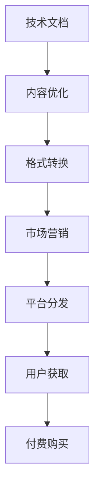

                 

# 从技术文档到付费电子书：程序员的写作之路

在软件开发领域，技术文档和代码并行存在，但前者往往被忽视。实际上，技术文档不仅对内部团队协作至关重要，而且对于外部用户、潜在雇主和同行也具有重要价值。本文将探讨如何从技术文档转变为付费电子书，这是程序员提高其技术影响力并创造额外收入的绝佳途径。

## 1. 背景介绍

### 1.1 问题由来
软件开发团队通常重视代码的编写和维护，但对技术文档的投入相对较少。这导致了以下问题：
- 新成员入职时，难以快速理解代码逻辑和架构。
- 无法向非技术背景的用户解释技术实现和功能。
- 技术交流时，没有标准化的文档指导，降低了效率。
- 技术积累和传承不系统，容易出现知识断层。

### 1.2 问题核心关键点
技术文档的重要性在于：
1. 帮助团队协作。
2. 提升知识传承效率。
3. 增强技术沟通能力。
4. 提供技术支持和学习资源。

技术文档与代码开发同样重要，但编写和维护文档的工作量巨大，且容易被忽视。高质量的技术文档不仅有助于团队合作，还能为开发者带来额外的收益。

### 1.3 问题研究意义
将技术文档转化为付费电子书，可以显著提升技术文档的价值，从而带来多方面的积极影响：
1. 增加技术影响力。
2. 带来额外收入。
3. 提升职业竞争力。
4. 促进知识共享和传播。
5. 增强品牌价值。

技术文档转化的过程，不仅需要技术上的专业性，还需要一定的写作和市场营销能力。本文将探讨这一转化的核心概念、核心算法、具体操作步骤，并提出可行的应用方案。

## 2. 核心概念与联系

### 2.1 核心概念概述

技术文档和付费电子书之间的转换涉及多个核心概念：

- **技术文档**：以Markdown、ReStructuredText等格式编写的代码解释、设计文档、架构图、用户手册等。
- **电子书**：电子版书籍，可以是PDF、MOBI等格式，通常包含目录、索引、章节点等结构化内容。
- **技术写作**：将技术知识通过书面形式进行呈现和表达的能力。
- **市场营销**：将技术文档转化为付费电子书的过程中的推广和销售策略。
- **专业内容创作**：聚焦于特定技术领域的深度学习、算法原理、开发实践等内容创作。

这些概念之间的联系是通过将技术文档进行内容优化、格式转换、平台分发等步骤实现的。下面通过Mermaid流程图展示这一过程：



## 3. 核心算法原理 & 具体操作步骤

### 3.1 算法原理概述

技术文档转化为电子书的核心算法原理涉及以下几个步骤：

1. **内容优化**：对原始技术文档进行内容精炼，增加可读性和易理解性。
2. **格式转换**：将Markdown、ReStructuredText等格式转换为电子书可支持的格式（如HTML、PDF）。
3. **市场营销**：利用SEO、社交媒体、邮件营销等手段推广电子书。
4. **平台分发**：将电子书上传至Amazon Kindle、Apple Books等平台进行分发。
5. **用户获取与付费**：通过邮件列表、社交媒体、线上广告等途径吸引用户，完成付费购买。

### 3.2 算法步骤详解

#### 3.2.1 内容优化

内容优化是技术文档转化为电子书的关键步骤之一，主要包括以下几个方面：

1. **结构化内容**：将技术文档按照章节、小节、标题等结构进行组织，确保内容层次清晰。
2. **简化术语**：使用简单的语言和定义，避免过度专业化，确保读者易于理解。
3. **添加示例**：通过代码示例、图表、图解等辅助说明，增强内容的可读性和可视性。
4. **用户反馈**：在内容优化阶段收集用户反馈，进行多次迭代，直至用户满意。

#### 3.2.2 格式转换

格式转换是将技术文档转换为电子书格式的过程，主要工具包括：

1. **Markdown to PDF**：使用Pandoc等工具将Markdown文档转换为PDF格式。
2. **ReStructuredText to EPUB**：使用Sphinx等工具将ReStructuredText文档转换为EPUB格式。
3. **HTML to MOBI**：使用Calibre等工具将HTML文档转换为MOBI格式。

#### 3.2.3 市场营销

市场营销是技术文档转化为付费电子书的重要环节，主要策略包括：

1. **SEO优化**：在电子书平台上优化SEO，确保电子书在搜索结果中排名靠前。
2. **社交媒体推广**：通过LinkedIn、Twitter、GitHub等平台推广电子书。
3. **邮件营销**：向邮件列表发送推广邮件，提供电子书预览或购买链接。
4. **付费广告**：在技术社区和相关论坛上投放付费广告，吸引潜在读者。

#### 3.2.4 平台分发

电子书分发需要选择适合的平台，例如：

1. **Amazon Kindle**：全球最大的电子书平台，适合技术书籍的推广。
2. **Apple Books**：苹果公司的电子书平台，适合跨平台分发。
3. **Google Play Books**：谷歌的电子书平台，适合多语言和国际市场。
4. **Apple iBooks**：苹果公司的iOS设备专属电子书平台。

#### 3.2.5 用户获取与付费

用户获取与付费是电子书销售的关键步骤，主要方法包括：

1. **邮件订阅**：通过邮件订阅收集潜在读者信息。
2. **社交媒体互动**：在社交媒体上与读者互动，回答疑问，增加信任感。
3. **免费试读**：提供电子书部分内容的免费试读，吸引用户购买。
4. **价格优惠**：初期提供折扣或优惠码，降低购买门槛。

### 3.3 算法优缺点

将技术文档转化为电子书的主要优点包括：

1. **提升技术影响力**：通过高质量的技术内容，吸引更多技术读者。
2. **增加收入来源**：带来额外的经济收益，减轻软件开发中的经济压力。
3. **增强品牌价值**：展示技术能力和专业性，提升个人或团队的品牌形象。

主要缺点包括：

1. **时间和精力投入**：内容优化和格式转换需要大量时间和精力。
2. **初期销售困难**：电子书市场竞争激烈，初期推广和销售难度较大。
3. **技术壁垒**：需要掌握一定的技术写作和市场营销技能，门槛较高。

### 3.4 算法应用领域

技术文档转化为电子书的方法不仅适用于技术书籍，还适用于以下领域：

1. **技术博客**：将博客文章整理成电子书，提升阅读体验和传播范围。
2. **开源项目文档**：将开源项目的开发文档转化为电子书，吸引更多贡献者。
3. **技术报告**：将技术报告整理成电子书，提升权威性和影响力。
4. **培训教材**：将培训课程和文档转化为电子书，便于学习和分享。
5. **企业内训资料**：将企业内部的培训材料转化为电子书，方便内部传播。

## 4. 数学模型和公式 & 详细讲解  
### 4.1 数学模型构建

假设原始技术文档的内容量为 $X$，优化后内容量为 $Y$，则转化过程可以用以下数学模型表示：

$$
Y = f(X)
$$

其中，$f$ 为内容优化的函数。通过优化函数 $f$，将原始内容 $X$ 转化为优化后的内容 $Y$，进而转换为电子书格式。

### 4.2 公式推导过程

假设原始文档为 $X$，优化后的文档为 $Y$，格式转换后的电子书为 $Z$，则转化过程可以表示为：

$$
Z = g(Y)
$$

其中，$g$ 为格式转换的函数。通过格式转换函数 $g$，将优化后的文档 $Y$ 转化为电子书格式 $Z$。

### 4.3 案例分析与讲解

以一个简单的Markdown文档为例，展示其内容优化和格式转换的过程：

**原始文档**：

```markdown
# 技术文档优化案例

## 引言

技术文档的优化是一个持续改进的过程，旨在提升文档的可读性和易理解性。

## 优化步骤

### 第一步：结构化内容

将原始文档按照章节、小节、标题进行结构化组织。

### 第二步：简化术语

使用简单的语言和定义，避免过度专业化。

### 第三步：添加示例

通过代码示例、图表、图解等辅助说明。

### 第四步：用户反馈

收集用户反馈，进行多次迭代。
```

**优化后的文档**：

```markdown
# 技术文档优化案例

## 引言

技术文档的优化是一个持续改进的过程，旨在提升文档的可读性和易理解性。

## 优化步骤

### 第一步：结构化内容

将原始文档按照章节、小节、标题进行结构化组织。

### 第二步：简化术语

使用简单的语言和定义，避免过度专业化。

### 第三步：添加示例

通过代码示例、图表、图解等辅助说明。

### 第四步：用户反馈

收集用户反馈，进行多次迭代。
```

**电子书格式**：

**目录**：
- 引言
- 优化步骤
  - 第一步：结构化内容
  - 第二步：简化术语
  - 第三步：添加示例
  - 第四步：用户反馈

**内容**：
```markdown
# 技术文档优化案例

## 引言

技术文档的优化是一个持续改进的过程，旨在提升文档的可读性和易理解性。

## 优化步骤

### 第一步：结构化内容

将原始文档按照章节、小节、标题进行结构化组织。

### 第二步：简化术语

使用简单的语言和定义，避免过度专业化。

### 第三步：添加示例

通过代码示例、图表、图解等辅助说明。

### 第四步：用户反馈

收集用户反馈，进行多次迭代。
```

## 5. 项目实践：代码实例和详细解释说明

### 5.1 开发环境搭建

以下是使用Python和Jupyter Notebook搭建开发环境的步骤：

1. 安装Anaconda：从官网下载并安装Anaconda，用于创建独立的Python环境。

2. 创建并激活虚拟环境：
```bash
conda create -n tech-docs python=3.8 
conda activate tech-docs
```

3. 安装必要的库：
```bash
conda install pandoc sphinx bookdown
```

4. 创建Jupyter Notebook环境：
```bash
conda install jupyterlab
jupyter lab
```

### 5.2 源代码详细实现

以下是使用Sphinx和Bookdown工具将Markdown文档转化为电子书的具体步骤：

1. 安装Sphinx和Bookdown：
```bash
pip install sphinx bookdown
```

2. 创建Sphinx项目：
```bash
mkdir tech-docs
cd tech-docs
sphinx-quickstart
```

3. 编辑Sphinx配置文件 `conf.py`，添加以下内容：

```python
# conf.py

# 导入必要的模块
import sphinx
import sphinx_bookdown

# 配置Bookdown输出格式
sphinx_bookdown bookdown_markdown = {
    'bookdown': {
        'input': 'markdown',
        'output': 'bookdown::gitbook::json',
    },
    'pandoc': {
        'extra_args': ['--metadata=bookdown::json']
    }
}
```

4. 创建Markdown文档：

```markdown
# 技术文档优化案例

## 引言

技术文档的优化是一个持续改进的过程，旨在提升文档的可读性和易理解性。

## 优化步骤

### 第一步：结构化内容

将原始文档按照章节、小节、标题进行结构化组织。

### 第二步：简化术语

使用简单的语言和定义，避免过度专业化。

### 第三步：添加示例

通过代码示例、图表、图解等辅助说明。

### 第四步：用户反馈

收集用户反馈，进行多次迭代。
```

5. 在Markdown文件中添加以下内容：

```python
# tech-docs.rst
content: tech-docs.md
latex_elements:
   preamble: |
      \usepackage{hyperref}
```

6. 使用Sphinx生成电子书：

```bash
sphinx-build -b bookdown -d _build/doctrees tech-docs.rst _build/html
```

生成的电子书文件在 `_build/html` 目录下。

### 5.3 代码解读与分析

以下是代码的详细解读：

- `sphinx-quickstart`：启动Sphinx项目，生成项目模板。
- `conf.py`：Sphinx配置文件，添加Bookdown输出格式配置。
- `tech-docs.rst`：Sphinx源文件，指定Markdown文档路径和LaTeX元素。
- `sphinx-build`：Sphinx命令行工具，生成电子书。

生成的电子书文件包括目录、章节、小节、标题和内容，具备完整的结构化内容。

### 5.4 运行结果展示

生成的电子书文件在 `_build/html` 目录下，包含以下内容：

```html
# tech-docs.html
<!DOCTYPE html>
<html>
<head>
  <meta charset="utf-8">
  <meta name="viewport" content="width=device-width, initial-scale=1.0">
  <title>技术文档优化案例</title>
  <link rel="stylesheet" href="style.css">
  <link rel="stylesheet" href="style-book.css">
</head>
<body>
<div class="book">
  <div class="book-contents">
    <div class="book-node book-node-chapter book-node-0">
      <h2 class="book-node-title">技术文档优化案例</h2>
      <div class="book-node-block">
        <div class="book-node-block-content">
          <h3 class="book-node-block-header">引言</h3>
          <p>技术文档的优化是一个持续改进的过程，旨在提升文档的可读性和易理解性。</p>
        </div>
      </div>
      <div class="book-node-block">
        <div class="book-node-block-content">
          <h3 class="book-node-block-header">优化步骤</h3>
          <div class="book-node-block-content">
            <h4 class="book-node-block-header">第一步：结构化内容</h4>
            <p>将原始文档按照章节、小节、标题进行结构化组织。</p>
          </div>
          <div class="book-node-block-content">
            <h4 class="book-node-block-header">第二步：简化术语</h4>
            <p>使用简单的语言和定义，避免过度专业化。</p>
          </div>
          <div class="book-node-block-content">
            <h4 class="book-node-block-header">第三步：添加示例</h4>
            <p>通过代码示例、图表、图解等辅助说明。</p>
          </div>
          <div class="book-node-block-content">
            <h4 class="book-node-block-header">第四步：用户反馈</h4>
            <p>收集用户反馈，进行多次迭代。</p>
          </div>
        </div>
      </div>
    </div>
  </div>
</div>
```

## 6. 实际应用场景

### 6.1 智能客服系统

技术文档可以为智能客服系统提供详细的设计和实现文档，帮助新成员快速了解系统架构和功能实现。例如，可以创建一份详细的智能客服系统文档，涵盖系统的设计理念、功能模块、技术架构、API接口等内容，并通过电子书形式发布。

### 6.2 金融舆情监测

技术文档可以用于记录金融舆情监测系统的设计、开发和维护过程，包括系统架构、数据处理、模型训练、应用部署等。通过电子书形式发布，可以帮助团队成员和用户快速理解系统功能和使用方法。

### 6.3 个性化推荐系统

技术文档可以用于记录个性化推荐系统的设计与实现过程，包括推荐算法、数据处理、模型训练、用户体验优化等。通过电子书形式发布，可以帮助开发者和用户了解系统的核心技术点和应用场景。

### 6.4 未来应用展望

未来，技术文档转化为电子书的应用场景将更加广泛：

1. **教育培训**：创建教育培训相关的技术文档，通过电子书形式发布，帮助学员快速掌握知识和技能。
2. **医疗健康**：记录医疗健康技术文档，通过电子书形式发布，帮助医护人员理解新设备和系统的使用。
3. **航空航天**：创建航空航天技术文档，通过电子书形式发布，帮助工程师理解复杂系统的设计和实现。
4. **自动驾驶**：记录自动驾驶技术文档，通过电子书形式发布，帮助研究人员理解新技术的实现。

## 7. 工具和资源推荐

### 7.1 学习资源推荐

为了帮助开发者提升技术写作和电子书创作能力，以下是一些推荐的资源：

1. **《技术写作指南》**：详细介绍了技术写作的基本原则和方法。
2. **《电子书出版指南》**：介绍了电子书出版的流程和技术要求。
3. **《Markdown入门》**：介绍了Markdown的基本语法和应用。
4. **《Sphinx文档》**：详细介绍了Sphinx的配置和使用。
5. **《Bookdown官方文档》**：介绍了Bookdown的使用和功能。

### 7.2 开发工具推荐

为了提高技术文档和电子书创建的效率，以下是一些推荐的工具：

1. **Markdown编辑器**：如Typora、Atom、Visual Studio Code等，用于编写和编辑Markdown文档。
2. **LaTeX编辑器**：如TeXstudio、TeXmaker等，用于编写和编辑LaTeX文档。
3. **PDF编辑器**：如Adobe Acrobat、Foxit PhantomPDF等，用于编辑PDF文档。
4. **版本控制工具**：如Git、SVN等，用于版本管理和协作开发。
5. **云存储服务**：如Google Drive、Dropbox等，用于存储和共享文档。

### 7.3 相关论文推荐

技术文档转化为电子书的技术基础涉及多个领域，以下是几篇相关的论文推荐：

1. **《如何创建可维护的代码文档》**：探讨了创建可维护代码文档的最佳实践。
2. **《电子书出版技术的现状与发展》**：介绍了电子书出版的技术现状和未来发展趋势。
3. **《技术文档的自动生成与出版》**：探讨了使用自动化工具生成和出版技术文档的方法。
4. **《技术写作与出版的数字化转型》**：探讨了技术写作和出版的数字化转型趋势和挑战。

## 8. 总结：未来发展趋势与挑战

### 8.1 研究成果总结

本文从技术文档到电子书的全过程进行了系统介绍，重点探讨了内容优化、格式转换、市场营销、平台分发和用户获取与付费等环节。通过实际案例展示了电子书出版的详细步骤和实践经验，为开发者提供了全面的指导。

### 8.2 未来发展趋势

未来，技术文档转化为电子书将呈现以下几个发展趋势：

1. **内容自动化生成**：使用自然语言处理技术自动生成技术文档，提高创作效率。
2. **跨平台发布**：通过云平台和移动应用，实现电子书的多平台发布和阅读。
3. **互动式电子书**：通过交互式设计，增强用户体验和互动性。
4. **多语言电子书**：通过机器翻译技术，实现电子书的多语言发布。
5. **个性化推荐**：使用推荐系统，为用户推荐适合的电子书。

### 8.3 面临的挑战

技术文档转化为电子书在推广和应用过程中仍面临以下挑战：

1. **内容质量控制**：如何确保电子书内容的质量和准确性。
2. **用户获取困难**：如何吸引更多用户购买和阅读电子书。
3. **版权保护**：如何保护电子书的版权和知识产权。
4. **技术门槛高**：如何降低技术文档转化为电子书的门槛。
5. **市场竞争激烈**：如何在电子书市场中脱颖而出。

### 8.4 研究展望

未来的研究可以从以下几个方向进行：

1. **内容生成技术**：研究如何使用自然语言处理技术自动生成高质量的技术文档。
2. **平台优化技术**：研究如何优化电子书发布平台，提高用户的购买和使用体验。
3. **互动式设计**：研究如何使用交互式设计增强电子书的用户体验和互动性。
4. **版权保护技术**：研究如何通过区块链等技术保护电子书的版权和知识产权。
5. **市场推广策略**：研究如何通过社交媒体、邮件营销等策略推广电子书。

总之，将技术文档转化为电子书是一个多学科交叉的研究方向，涉及自然语言处理、内容自动化生成、出版技术和市场营销等多个领域。只有综合考虑技术、内容和市场因素，才能实现电子书出版的成功。

## 9. 附录：常见问题与解答

**Q1：如何选择合适的电子书平台？**

A: 选择合适的电子书平台需要考虑以下几个因素：
1. 平台的覆盖范围和用户基础。
2. 平台的技术支持和用户服务。
3. 平台的销售分成和定价策略。
4. 平台的内容管理和版权保护措施。

**Q2：电子书出版如何获取用户？**

A: 获取用户主要通过以下几种方式：
1. 社交媒体推广：通过LinkedIn、Twitter、GitHub等平台推广电子书。
2. 邮件营销：向邮件列表发送推广邮件，提供电子书预览或购买链接。
3. 免费试读：提供电子书部分内容的免费试读，吸引用户购买。
4. 付费广告：在技术社区和相关论坛上投放付费广告，吸引潜在读者。

**Q3：如何提高电子书的内容质量？**

A: 提高电子书的内容质量主要通过以下几个步骤：
1. 编写详细的技术文档，确保内容的准确性和完整性。
2. 通过用户反馈，进行多次迭代和优化。
3. 使用自然语言处理技术，自动化生成和编辑技术文档。

**Q4：电子书出版需要哪些技术支持？**

A: 电子书出版需要以下技术支持：
1. Markdown编辑器：用于编写和编辑Markdown文档。
2. LaTeX编辑器：用于编写和编辑LaTeX文档。
3. PDF编辑器：用于编辑PDF文档。
4. 版本控制工具：用于版本管理和协作开发。
5. 云存储服务：用于存储和共享文档。

**Q5：电子书出版有哪些商业模式？**

A: 电子书出版的商业模式主要包括以下几种：
1. 按次付费：用户购买单次阅读权限，付费后可以无限次阅读。
2. 按月付费：用户购买月度订阅，每月支付固定费用，享受无限次阅读。
3. 一次性购买：用户购买电子书，付费后永久拥有阅读权限。
4. 广告收入：电子书平台通过广告收入分成，降低电子书售价。

总之，技术文档转化为电子书是一个不断迭代和优化的过程，需要开发者和出版者不断探索和实践。通过高质量的内容和合理的商业模式，技术文档可以成为程序员的另一项重要收入来源，为技术写作和出版带来新的机遇和挑战。

---

作者：禅与计算机程序设计艺术 / Zen and the Art of Computer Programming

