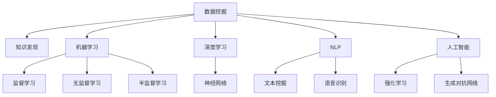

                 

# 从数据挖掘到知识发现：技术演进与应用

> 关键词：数据挖掘, 知识发现, 机器学习, 深度学习, 大数据, 自然语言处理, 人工智能

## 1. 背景介绍

### 1.1 问题由来
数据挖掘和大数据技术的发展，极大地拓展了人们处理和分析信息的能力。从早期的统计分析到如今基于机器学习和深度学习的智能算法，数据挖掘已经从简单的数据描述转向了复杂的知识发现。数据挖掘技术不仅在商业决策、金融预测、社交网络分析等传统领域大放异彩，还在生物信息学、医疗诊断、自然语言处理等领域不断刷新着应用的界限。本文将全面回顾数据挖掘和知识发现的演进历程，探讨其在不同应用场景下的核心技术与实践策略。

### 1.2 问题核心关键点
数据挖掘与知识发现是两个紧密相关但又有明显区别的概念。数据挖掘（Data Mining）是从数据中自动发现模式、关系、异常和知识的过程。而知识发现（Knowledge Discovery）是一个更广泛的过程，包括数据获取、数据处理、模型选择、知识提取、知识应用和评估等多个步骤。两者相辅相成，共同推动着数据驱动决策的发展。

本博客将首先介绍数据挖掘和知识发现的基本原理和技术演进，然后重点分析其在实际应用场景中的具体策略和挑战。通过案例分析，我们希望能为读者提供深入理解并实践数据挖掘和知识发现的路径。

## 2. 核心概念与联系

### 2.1 核心概念概述

为更好地理解数据挖掘和知识发现的演进历程，本节将介绍几个核心概念：

- 数据挖掘（Data Mining）：通过自动化算法从数据集中挖掘出有用的模式、知识或规律。主要包括分类、聚类、回归、关联规则学习等任务。
- 知识发现（Knowledge Discovery）：从数据中提炼出新的知识和信息，以支持决策和预测。包括数据清洗、数据预处理、数据转换、数据建模等步骤。
- 机器学习（Machine Learning）：研究如何让计算机利用数据进行学习，从而自动改进算法和模型，提升决策效果。
- 深度学习（Deep Learning）：一种特殊的机器学习方法，通过多层次神经网络模拟人脑的神经元处理信息。深度学习在大数据处理和特征提取上有独特优势。
- 自然语言处理（Natural Language Processing, NLP）：使用计算机处理和理解人类语言的技术，涉及分词、词性标注、句法分析、语义分析等多个子领域。
- 人工智能（Artificial Intelligence, AI）：旨在模拟人类智能，通过学习、推理、感知等能力，实现自主决策和行为。

这些核心概念之间的逻辑关系可以通过以下Mermaid流程图来展示：



这个流程图展示了数据挖掘、知识发现与其他核心概念之间的联系：

1. 数据挖掘是知识发现的基础，利用机器学习和深度学习算法从数据中挖掘出模式和规律。
2. 机器学习和深度学习是数据挖掘的主要工具，分别利用监督、无监督和半监督算法进行建模和预测。
3. 自然语言处理和人工智能是数据挖掘在特定领域的应用，涉及文本挖掘、语音识别等任务。

## 3. 核心算法原理 & 具体操作步骤
### 3.1 算法原理概述

数据挖掘和知识发现的核心算法包括但不限于：

- 聚类（Clustering）：将数据点分组，使得同一组内的数据点相似度高，不同组之间差异大。
- 分类（Classification）：将数据点划分到预设的类别中。
- 关联规则学习（Association Rule Learning）：发现数据项之间的关联关系。
- 预测建模（Prediction Modeling）：利用已知数据预测新数据的属性值。
- 降维（Dimensionality Reduction）：减少数据维度，便于分析和处理。

这些算法通常使用统计方法、机器学习模型和深度神经网络进行实现，如K-Means、决策树、支持向量机、神经网络等。

### 3.2 算法步骤详解

一个典型的数据挖掘过程包括以下步骤：

**Step 1: 数据预处理**
- 数据清洗：处理缺失值、异常值、重复值等问题。
- 数据转换：将原始数据转换为适合分析的格式，如归一化、标准化、特征工程等。

**Step 2: 数据探索**
- 探索性数据分析（EDA）：通过可视化、统计分析等方法，发现数据的基本特征和潜在问题。
- 初步模型建立：选择和训练简单的模型进行初步分析，发现数据的初步趋势。

**Step 3: 特征工程**
- 特征选择：选择最具区分性的特征进行建模。
- 特征提取：利用降维、编码等技术转换特征，提升模型效果。

**Step 4: 模型训练与评估**
- 选择模型：根据数据类型和任务需求选择合适的模型。
- 模型训练：利用历史数据训练模型。
- 模型评估：使用测试集验证模型效果，选择最优模型。

**Step 5: 模型应用与优化**
- 模型部署：将模型应用到实际问题中。
- 模型优化：根据反馈结果调整模型参数，提升性能。

### 3.3 算法优缺点

数据挖掘和知识发现方法具有以下优点：

1. 自动化程度高：能够从大量数据中自动识别模式和关系，大大提高数据分析的效率。
2. 发现未知知识：从数据中挖掘出的规律往往超出了人类直觉，有助于发现新的知识和洞察。
3. 广泛应用领域：涵盖商业决策、医疗诊断、金融预测等多个领域，具有很强的实用性。

然而，这些方法也存在一些局限：

1. 数据质量要求高：需要高质量的数据才能保证挖掘出的知识可靠。
2. 算法复杂度高：部分算法计算复杂，需要较强的计算资源。
3. 结果解释性差：模型输出的结果往往难以解释，难以满足一些领域对可解释性的需求。
4. 依赖领域专家：挖掘出的知识是否合理，需要领域专家的进一步验证和解释。

### 3.4 算法应用领域

数据挖掘和知识发现技术已经在多个领域得到了广泛应用，例如：

- 商业智能（Business Intelligence, BI）：用于市场分析、客户细分、销售预测等，帮助企业制定战略决策。
- 金融分析（Financial Analysis）：用于信用评估、风险管理、投资组合优化等，提高金融产品的性能。
- 医疗诊断（Medical Diagnosis）：用于疾病预测、患者分群、治疗方案推荐等，提升医疗服务的质量。
- 自然语言处理（NLP）：用于文本分类、情感分析、信息检索等，提升自然语言理解和生成能力。
- 计算机视觉（Computer Vision）：用于图像识别、目标检测、人脸识别等，提升视觉任务的表现。

除了上述这些经典应用外，数据挖掘和知识发现技术还在智能制造、智慧城市、环境监测、安全监控等多个领域发挥了重要作用，为各行各业带来了新的突破。

## 4. 数学模型和公式 & 详细讲解 & 举例说明
### 4.1 数学模型构建

本节将使用数学语言对数据挖掘和知识发现的主要算法进行更加严格的刻画。

以聚类算法为例，设数据集 $\mathcal{D}=\{x_1, x_2, ..., x_n\}$，每个数据点 $x_i=(x_{i1}, x_{i2}, ..., x_{ip})$ 包含 $p$ 个特征。聚类算法的基本目标是将数据点分组，使得同一组内的数据点相似度高，不同组之间差异大。常用的聚类算法有K-Means、层次聚类等。

K-Means算法的基本流程如下：

1. 随机选择 $k$ 个数据点作为初始聚类中心。
2. 对每个数据点计算到聚类中心的距离，分配到距离最近的聚类组。
3. 对每个聚类组内的数据点重新计算聚类中心。
4. 重复步骤2和3，直到聚类中心不再变化或达到预设迭代次数。

K-Means算法的数学模型可以表示为：

$$
\min_{C, Z} \sum_{i=1}^n \sum_{c=1}^k ||x_i - \mu_c||^2 + \lambda ||C||^2
$$

其中 $C=\{\mu_1, \mu_2, ..., \mu_k\}$ 为聚类中心，$Z=\{z_1, z_2, ..., z_n\}$ 为数据点分配标签，$\mu_c$ 为聚类中心，$||.||$ 表示向量间的欧几里得距离，$\lambda$ 为正则化参数，防止过度拟合。

### 4.2 公式推导过程

以K-Means算法为例，其关键步骤如下：

**Step 1: 初始化聚类中心**

随机选择 $k$ 个数据点作为初始聚类中心，记为 $C^0=\{\mu_1^0, \mu_2^0, ..., \mu_k^0\}$。

**Step 2: 分配数据点**

对每个数据点 $x_i$，计算其到每个聚类中心的距离 $d_{ij}=||x_i - \mu_j||$，分配到距离最近的聚类组 $z_i = \arg\min_j d_{ij}$。

**Step 3: 更新聚类中心**

对每个聚类组内的数据点重新计算聚类中心 $\mu_c = \frac{1}{N_c} \sum_{x_i \in G_c} x_i$，其中 $N_c$ 为聚类组 $G_c$ 内的数据点数量。

**Step 4: 迭代优化**

重复步骤2和3，直到聚类中心不再变化或达到预设迭代次数。

### 4.3 案例分析与讲解

假设我们有一个包含顾客消费记录的数据集，目标是将其分为高价值客户和低价值客户两组。我们首先进行数据预处理，包括去除缺失值、标准化数据等。然后使用K-Means算法进行聚类，选择聚类数目为2。

首先，随机选择2个数据点作为初始聚类中心。然后对每个顾客记录计算其到两个聚类中心的距离，分配到距离最近的聚类组。接着，对每个聚类组内的顾客记录重新计算聚类中心。最后，迭代多次，直到聚类中心不再变化。

最终，我们可以得到两组客户数据，每组内的顾客记录具有相似的消费行为特征。通过进一步的统计分析，可以发现高价值客户通常具有较高的消费频次和金额，而低价值客户则消费频次和金额较低。

## 5. 项目实践：代码实例和详细解释说明
### 5.1 开发环境搭建

在进行数据挖掘和知识发现实践前，我们需要准备好开发环境。以下是使用Python进行scikit-learn开发的环境配置流程：

1. 安装Anaconda：从官网下载并安装Anaconda，用于创建独立的Python环境。

2. 创建并激活虚拟环境：
```bash
conda create -n sklearn-env python=3.8 
conda activate sklearn-env
```

3. 安装scikit-learn：
```bash
conda install scikit-learn
```

4. 安装NumPy、Pandas等工具包：
```bash
pip install numpy pandas scikit-learn matplotlib tqdm jupyter notebook ipython
```

完成上述步骤后，即可在`sklearn-env`环境中开始项目实践。

### 5.2 源代码详细实现

这里我们以K-Means算法为例，给出在scikit-learn中对聚类模型进行训练和评估的Python代码实现。

```python
from sklearn.cluster import KMeans
from sklearn.datasets import make_blobs
from sklearn.metrics import silhouette_score

# 创建数据集
centers = [[1, 1], [-1, -1], [1, -1]]
X, labels_true = make_blobs(n_samples=300, centers=centers, cluster_std=0.5, random_state=0)
X = X[:, ::-1]  # 翻转x和y轴

# 训练模型
kmeans = KMeans(n_clusters=3, random_state=0)
kmeans.fit(X)

# 评估模型
score = silhouette_score(X, kmeans.labels_)
print(f"Silhouette Score: {score:.3f}")

# 可视化聚类结果
import matplotlib.pyplot as plt
plt.scatter(X[:, 0], X[:, 1], c=kmeans.labels_, cmap='viridis')
plt.title(f"K-Means Clustering Results with Silhouette Score: {score:.3f}")
plt.show()
```

这段代码使用了scikit-learn库中的KMeans类进行聚类模型的训练和评估。首先创建一个包含三个簇的数据集，然后训练K-Means模型，并计算轮廓系数来评估聚类效果。最后使用Matplotlib库可视化聚类结果。

### 5.3 代码解读与分析

让我们再详细解读一下关键代码的实现细节：

**数据集创建**：
- 使用make_blobs函数生成包含三个簇的数据集，每个簇的均值和标准差作为参数。
- 翻转x和y轴，使得X中的第一个特征对应于x轴，第二个特征对应于y轴。

**模型训练**：
- 使用KMeans类初始化聚类模型，并调用fit方法对数据集进行训练。
- KMeans模型的参数包括簇数n_clusters和随机种子random_state。

**模型评估**：
- 使用轮廓系数（silhouette score）评估聚类效果。轮廓系数反映了聚类内部和聚类之间的相似度。
- 轮廓系数的取值范围为[-1, 1]，值越大表示聚类效果越好。

**可视化结果**：
- 使用Matplotlib库绘制聚类结果的散点图，不同颜色代表不同的聚类标签。
- 添加标题，显示聚类结果和轮廓系数。

可以看到，使用scikit-learn库进行聚类模型的实现非常简单，代码可读性强，适合快速迭代实验和研究。

## 6. 实际应用场景
### 6.1 商业智能

数据挖掘技术在商业智能（BI）领域有着广泛应用。通过分析客户数据、销售记录、市场趋势等，企业可以发现潜在的商业机会和风险，优化经营策略。

例如，零售商可以使用数据挖掘技术分析顾客购买行为，发现哪些产品组合更受欢迎，哪些顾客更可能回购。通过对历史销售数据的挖掘，可以预测未来销售趋势，制定更合理的库存管理和促销策略。

### 6.2 金融风险管理

金融行业需要实时监控市场动态，识别潜在的风险点。数据挖掘技术可以用于信用评分、欺诈检测、投资组合优化等任务。

例如，银行可以通过分析客户的信用记录、财务状况等数据，构建风险评分模型，评估客户的信用风险。保险公司可以使用数据挖掘技术分析历史理赔数据，识别出高风险客户和区域，优化风险管理策略。

### 6.3 医疗诊断

医疗领域需要大量数据分析来支持诊断和治疗决策。数据挖掘技术可以用于疾病预测、患者分群、治疗方案推荐等任务。

例如，医院可以使用数据挖掘技术分析病人的病历记录、实验室检测结果等数据，发现与特定疾病相关的特征，构建疾病预测模型。医生可以根据模型的预测结果，制定个性化的治疗方案。

### 6.4 自然语言处理

自然语言处理（NLP）是数据挖掘技术的重要应用领域。通过分析文本数据，可以发现语言中的模式、关系和趋势，提升NLP系统的性能。

例如，新闻网站可以使用数据挖掘技术分析用户评论，发现热门话题和情感倾向。社交媒体平台可以使用数据挖掘技术分析用户互动数据，发现潜在的网络舆情。

## 7. 工具和资源推荐
### 7.1 学习资源推荐

为了帮助开发者系统掌握数据挖掘和知识发现的理论基础和实践技巧，这里推荐一些优质的学习资源：

1. 《Python数据科学手册》：详细介绍Python在数据科学中的应用，包括数据清洗、数据可视化、机器学习等。
2. 《机器学习实战》：通过大量实例，讲解了机器学习算法的实现和应用，适合初学者入门。
3. 《统计学习方法》：李航教授的经典教材，深入浅出地介绍了机器学习的基本概念和算法。
4. 《深度学习》：Ian Goodfellow等人的经典教材，详细介绍了深度神经网络的原理和应用。
5. 《自然语言处理综论》：斯坦福大学李飞飞教授的课程讲义，涵盖了NLP领域的基本概念和技术。
6. Coursera和edX等在线平台：提供大量的免费和付费课程，涵盖数据挖掘、机器学习、深度学习等多个领域。

通过对这些资源的学习实践，相信你一定能够快速掌握数据挖掘和知识发现的精髓，并用于解决实际的NLP问题。

### 7.2 开发工具推荐

高效的开发离不开优秀的工具支持。以下是几款用于数据挖掘和知识发现开发的常用工具：

1. Python：作为数据科学领域的主流语言，Python拥有丰富的库和框架，如Pandas、NumPy、scikit-learn、TensorFlow等。
2. R语言：数据统计和分析的流行语言，拥有ggplot2、dplyr等优秀的可视化库和数据处理框架。
3. RapidMiner：一款集成化的数据挖掘工具，提供了可视化界面和丰富的插件，适合初学者和商业应用。
4. KNIME：一个模块化的数据挖掘平台，支持拖放式流程设计，适合团队协作和生产环境。
5. Tableau：一款数据可视化工具，支持复杂的数据分析和交互式报表，适合业务用户使用。

合理利用这些工具，可以显著提升数据挖掘和知识发现任务的开发效率，加快创新迭代的步伐。

### 7.3 相关论文推荐

数据挖掘和知识发现技术的发展源于学界的持续研究。以下是几篇奠基性的相关论文，推荐阅读：

1. J. Han, M. Kamber, and J. Pei.《数据挖掘：概念与技术》：介绍数据挖掘的基本概念、算法和应用。
2. G. Tesauro.《Temporal Difference Learning and TD-Gammon》：介绍使用TD（时间差分学习）算法进行博弈学习的先驱工作。
3. J. Bilmes.《A gentle tutorial of the expectation-maximization algorithm and its application to parameter estimation for Gaussian mixture and hidden Markov models》：介绍EM算法的原理和应用，是统计学习中的经典算法。
4. G. Hinton, S. Osindero, Y. Teh.《A fast learning algorithm for deep belief nets》：介绍深度信念网络（DBN）的原理和应用，是深度学习的重要基础。
5. Y. Bengio, I. Goodfellow, A. Courville.《深度学习》：Ian Goodfellow等人的经典教材，详细介绍了深度神经网络的原理和应用。

这些论文代表了大数据技术和机器学习的演进历程，为数据挖掘和知识发现的研究提供了重要的理论基础。

## 8. 总结：未来发展趋势与挑战
### 8.1 总结

本文对数据挖掘和知识发现的基本原理和技术演进进行了全面系统的介绍。首先阐述了数据挖掘和知识发现的基本概念和技术演进，明确了它们在商业决策、金融预测、社交网络分析等领域的实际应用。其次，从原理到实践，详细讲解了数据挖掘的数学模型和算法步骤，给出了数据挖掘任务开发的完整代码实例。同时，本文还广泛探讨了数据挖掘技术在多个行业领域的应用前景，展示了数据挖掘范式的巨大潜力。最后，本文精选了数据挖掘技术的各类学习资源，力求为读者提供全方位的技术指引。

通过本文的系统梳理，可以看到，数据挖掘和知识发现技术正在成为数据驱动决策的重要手段，极大地拓展了企业的数据利用能力，带来了新的商业机遇。未来，伴随数据挖掘技术和其他人工智能技术进行更深入的融合，必将在更多领域带来变革性影响，深刻影响人类的生产生活方式。

### 8.2 未来发展趋势

展望未来，数据挖掘和知识发现技术将呈现以下几个发展趋势：

1. 自动化和智能化：随着机器学习和深度学习技术的不断进步，数据挖掘和知识发现的自动化程度将不断提高，智能化水平将显著提升。
2. 多模态融合：数据挖掘将逐步拓展到多模态数据（如文本、图像、视频、语音等），提高对复杂数据的理解和分析能力。
3. 实时处理和流数据处理：数据挖掘和知识发现将支持实时数据处理和流数据处理，满足动态决策和实时响应需求。
4. 可解释性和透明性：数据挖掘模型的解释性和透明性将成为重要的研究方向，以便更好地理解和信任模型的输出。
5. 安全性和隐私保护：数据挖掘和知识发现将重视数据隐私和安全问题，保障数据和模型的安全。

以上趋势凸显了数据挖掘和知识发现技术的广阔前景。这些方向的探索发展，必将进一步提升数据挖掘系统的性能和应用范围，为数据驱动决策提供更强大的支持。

### 8.3 面临的挑战

尽管数据挖掘和知识发现技术已经取得了瞩目成就，但在迈向更加智能化、普适化应用的过程中，它仍面临着诸多挑战：

1. 数据质量瓶颈：数据挖掘的效果很大程度上取决于数据的质量和完整性，处理大规模、高噪声的数据仍是挑战之一。
2. 计算资源需求高：数据挖掘和知识发现算法通常计算复杂，需要强大的计算资源支持。
3. 结果解释性差：数据挖掘模型的输出结果往往难以解释，难以满足一些领域对可解释性的需求。
4. 隐私和安全问题：数据挖掘和知识发现需要处理大量敏感数据，数据隐私和安全问题需要高度重视。
5. 算法选择困难：面对海量数据和多任务需求，选择合适的数据挖掘算法和模型组合仍是难题。

这些挑战需要学术界和工业界的共同努力，通过技术创新和应用实践，逐步克服数据挖掘和知识发现面临的问题。

### 8.4 研究展望

未来的数据挖掘和知识发现研究需要在以下几个方面寻求新的突破：

1. 探索无监督和半监督学习：摆脱对大规模标注数据的依赖，利用无监督和半监督学习技术，最大限度利用非结构化数据。
2. 研究参数高效和计算高效的数据挖掘方法：开发更加参数高效的数据挖掘方法，在固定大部分数据挖掘参数的同时，只更新极少量的任务相关参数。同时优化计算图，减少资源消耗，实现更加轻量级、实时性的部署。
3. 引入因果推断和对比学习：通过引入因果推断和对比学习思想，增强数据挖掘模型的建立稳定因果关系的能力，学习更加普适、鲁棒的语言表征。
4. 融合专家知识：将专家知识与数据挖掘模型进行巧妙融合，引导数据挖掘过程学习更准确、合理的知识表示。
5. 引入多模态数据融合：数据挖掘将逐步拓展到多模态数据（如文本、图像、视频、语音等），提高对复杂数据的理解和分析能力。
6. 提升数据挖掘模型的解释性和透明性：通过因果分析方法，识别数据挖掘模型的决策关键特征，增强输出解释的因果性和逻辑性。

这些研究方向的探索，必将引领数据挖掘和知识发现技术迈向更高的台阶，为构建智能决策系统和数据驱动决策提供更强大的支持。面向未来，数据挖掘和知识发现技术还需要与其他人工智能技术进行更深入的融合，如知识表示、因果推理、强化学习等，多路径协同发力，共同推动数据驱动决策系统的进步。只有勇于创新、敢于突破，才能不断拓展数据挖掘和知识发现技术的边界，让数据驱动决策技术更好地造福人类社会。

## 9. 附录：常见问题与解答

**Q1：数据挖掘和知识发现有什么区别？**

A: 数据挖掘（Data Mining）是从数据中自动发现模式、关系、异常和知识的过程，强调数据驱动的分析。而知识发现（Knowledge Discovery）是一个更广泛的过程，包括数据获取、数据处理、模型选择、知识提取、知识应用和评估等多个步骤，强调从数据中提炼出新的知识和信息。数据挖掘是知识发现的重要组成部分，两者相辅相成，共同推动着数据驱动决策的发展。

**Q2：数据挖掘和知识发现的优势是什么？**

A: 数据挖掘和知识发现的主要优势包括：
1. 自动化程度高：能够从大量数据中自动识别模式和关系，大大提高数据分析的效率。
2. 发现未知知识：从数据中挖掘出的规律往往超出了人类直觉，有助于发现新的知识和洞察。
3. 广泛应用领域：涵盖商业决策、金融预测、社交网络分析等多个领域，具有很强的实用性。

**Q3：数据挖掘和知识发现有哪些主要算法？**

A: 数据挖掘和知识发现的主要算法包括但不限于：
1. 聚类算法：如K-Means、层次聚类等，用于将数据点分组，发现数据中的自然群体结构。
2. 分类算法：如决策树、支持向量机、神经网络等，用于将数据点划分到预设的类别中。
3. 关联规则学习：如Apriori、FP-growth等，用于发现数据项之间的关联关系。
4. 预测建模：如回归分析、时间序列预测等，用于利用已知数据预测新数据的属性值。
5. 降维算法：如主成分分析（PCA）、线性判别分析（LDA）等，用于减少数据维度，便于分析和处理。

**Q4：数据挖掘和知识发现有哪些应用场景？**

A: 数据挖掘和知识发现技术已经在多个领域得到了广泛应用，例如：
1. 商业智能：用于市场分析、客户细分、销售预测等，帮助企业制定战略决策。
2. 金融分析：用于信用评分、欺诈检测、投资组合优化等，提高金融产品的性能。
3. 医疗诊断：用于疾病预测、患者分群、治疗方案推荐等，提升医疗服务的质量。
4. 自然语言处理：用于文本分类、情感分析、信息检索等，提升自然语言理解和生成能力。
5. 计算机视觉：用于图像识别、目标检测、人脸识别等，提升视觉任务的表现。

**Q5：如何提升数据挖掘和知识发现的准确性和可靠性？**

A: 提升数据挖掘和知识发现的准确性和可靠性，可以从以下几个方面入手：
1. 数据质量控制：确保数据完整、准确、一致，减少数据噪声和异常。
2. 选择合适的算法和模型：根据数据类型和任务需求，选择合适的算法和模型，避免过拟合和欠拟合。
3. 合理设置参数：根据数据和任务特点，合理设置算法的参数，避免超参数调参带来的误差。
4. 引入外部知识：将专家知识和领域知识与数据挖掘模型进行融合，提升模型的解释性和可靠性。
5. 模型评估和验证：通过交叉验证、测试集验证等方法，评估模型效果，确保模型在不同数据集上表现稳定。

这些措施将有助于提升数据挖掘和知识发现系统的准确性和可靠性，增强其应用价值。

---

作者：禅与计算机程序设计艺术 / Zen and the Art of Computer Programming

