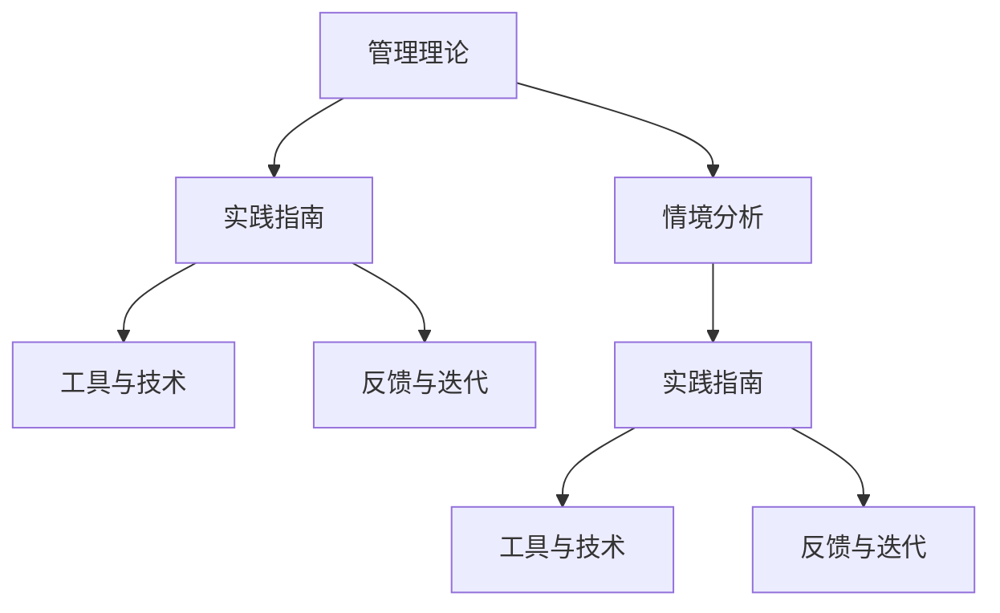

                 

# 从经典到实践：管理理论的落地

## 1. 背景介绍

### 1.1 问题由来
管理理论（Management Theories）是管理学领域的基础和核心，通过研究组织行为、领导风格、决策制定等理论问题，帮助企业提升效率、优化运营。然而，这些理论往往基于特定环境、特定条件的假设，难以在多样化的实际场景中直接应用。如何将理论知识转化为实际操作的指南，是当前管理学研究的一个关键问题。

### 1.2 问题核心关键点
管理理论的落地主要包括以下几个方面：

- **理论应用化**：如何将复杂的管理理论转化为简单易行的操作流程，供实际操作者参考。
- **情境适应性**：如何根据不同情境，灵活应用管理理论，以适应企业的具体需求。
- **工具和技术支持**：使用何种工具和技术手段，来辅助理论知识的落地实践。
- **反馈与迭代**：如何建立有效的反馈机制，持续优化和迭代管理实践，保持其有效性。

本文将从这些核心关键点出发，探讨如何有效地将经典管理理论转化为可操作的实践指南，提升企业的管理水平。

### 1.3 问题研究意义
研究管理理论的落地，对于提升企业的管理效率和绩效，具有重要意义：

- **提高决策质量**：将管理理论转化为可操作的步骤，能够帮助管理者在复杂环境中做出更科学、更有效的决策。
- **提升运营效率**：理论知识转化为实践操作，有助于优化企业的运营流程，降低成本，提高生产效率。
- **增强员工满意度**：通过科学的管理方法，提升员工的工作满意度和归属感，增强企业的凝聚力。
- **促进组织成长**：持续迭代优化管理实践，能够使企业不断适应变化的环境，实现长期稳定发展。

## 2. 核心概念与联系

### 2.1 核心概念概述

为更好地理解管理理论的落地方法，本节将介绍几个密切相关的核心概念：

- **管理理论**：管理学的核心知识体系，包括经典的管理理论如泰勒的科学管理理论、马斯洛的需求层次理论、赫茨伯格的双因素理论等。
- **实践指南**：基于管理理论的具体操作手册、步骤流程，如《项目管理指南》、《组织行为学手册》等。
- **情境分析**：分析企业在不同情境下的特点，如规模、行业、市场环境等，以指导实践指南的应用。
- **工具与技术**：用于辅助管理实践的技术工具，如ERP系统、CRM系统、绩效管理系统等。
- **反馈与迭代**：通过不断的反馈与优化，调整管理实践，保持其有效性。

这些概念之间的逻辑关系可以通过以下Mermaid流程图来展示：



这个流程图展示了大语言模型的核心概念及其之间的关系：

1. 管理理论通过实践指南转化为操作流程，应用于企业。
2. 实践指南需考虑企业的情境特点，调整具体应用。
3. 工具和技术辅助管理实践，提升执行效率。
4. 反馈与迭代机制帮助持续优化管理实践，保持其有效性。

## 3. 核心算法原理 & 具体操作步骤
### 3.1 算法原理概述

管理理论的落地过程，本质上是一种有指导的学习过程。其核心思想是：将复杂的管理理论转化为具体的、可执行的实践步骤，通过不断的反馈与迭代，逐步提升管理效果。

形式化地，假设企业管理理论为 $T$，其实践指南为 $G$，工具与技术为 $T$，反馈与迭代机制为 $I$。则落地的目标是通过 $I$ 不断调整 $G$，使其适应企业具体情况，并通过 $T$ 增强其实现效果。

具体而言，管理理论的落地过程包括：

- **理论分析**：分析管理理论的基本假设、关键观点、实践步骤等。
- **情境适配**：根据企业实际情况，调整理论的应用方式。
- **实践指导**：将理论转化为具体的实践步骤，供实际操作者参考。
- **工具支持**：使用管理软件、ERP系统、CRM系统等工具，辅助实践执行。
- **反馈优化**：通过不断的反馈与迭代，调整实践步骤，优化管理效果。

### 3.2 算法步骤详解

管理理论的落地过程主要包括以下几个关键步骤：

**Step 1: 理论分析**
- 分析管理理论的核心观点、应用场景、关键假设等，理解其基本逻辑。
- 识别理论中的关键概念、关键步骤和操作流程。

**Step 2: 情境适配**
- 收集企业的数据、资源、人员情况等，分析企业的特点和需求。
- 根据企业的具体情况，调整理论的应用方式，使之更具针对性和实用性。

**Step 3: 实践指导**
- 将理论转化为具体的实践步骤，形成操作手册、操作指南等。
- 设计详细的执行流程，包括每个步骤的具体操作、注意事项等。

**Step 4: 工具支持**
- 选择合适的管理软件、ERP系统、CRM系统等工具，辅助实践执行。
- 对工具进行配置和优化，提升其适用性和易用性。

**Step 5: 反馈优化**
- 收集管理实践的反馈信息，包括员工意见、业务效果、流程瓶颈等。
- 根据反馈信息，调整和优化实践步骤，不断提升管理效果。

### 3.3 算法优缺点

管理理论的落地方法具有以下优点：

1. **结构化清晰**：通过具体的操作流程，将复杂的管理理论转化为可执行的步骤，便于理解和操作。
2. **灵活适应**：根据企业具体情况，灵活调整理论的应用方式，使其更具针对性和实用性。
3. **工具辅助**：通过管理软件等工具，提升管理实践的执行效率和精度。
4. **反馈迭代**：通过不断的反馈与优化，保持管理实践的有效性和先进性。

同时，该方法也存在一些局限性：

1. **理论深度不足**：实际操作流程可能无法涵盖理论的全部深度和广度，导致部分理论知识难以有效应用。
2. **环境变化适应性差**：如果企业环境发生重大变化，原有实践步骤可能无法立即适应。
3. **实施成本高**：设计和实施具体的实践步骤，需要较多的时间和资源投入。
4. **复杂度增加**：实际操作流程可能增加管理者的工作负担，导致执行效率降低。

尽管存在这些局限性，但就目前而言，管理理论的落地方法仍是提升企业管理水平的重要手段。未来相关研究的重点在于如何进一步提高方法的可操作性和适应性，减少实施成本，提升执行效率。

### 3.4 算法应用领域

管理理论的落地方法在企业管理中已经得到了广泛应用，覆盖了以下几个关键领域：

- **人力资源管理**：通过科学的人才招聘、培训、绩效管理等操作流程，提升企业的人才管理水平。
- **项目管理**：通过具体的项目计划、进度控制、风险管理等步骤，优化项目管理流程，提高项目成功率。
- **财务控制**：通过规范的财务审批、成本控制、预算管理等操作流程，提升企业的财务健康度。
- **供应链管理**：通过优化供应商选择、库存管理、物流协调等实践步骤，提升供应链效率。
- **市场营销**：通过精准的市场分析、客户管理、销售策略等操作流程，提升市场竞争力。

除了上述这些经典领域外，管理理论的落地方法还被创新性地应用到更多场景中，如流程优化、文化建设、创新管理等，为企业发展提供全方位的支持。

## 4. 数学模型和公式 & 详细讲解  
### 4.1 数学模型构建

本节将使用数学语言对管理理论的落地过程进行更加严格的刻画。

假设企业管理理论为 $T$，其实践指南为 $G$，工具与技术为 $T$，反馈与迭代机制为 $I$。落地的目标是通过 $I$ 不断调整 $G$，使其适应企业具体情况，并通过 $T$ 增强其实现效果。

具体而言，管理理论的落地过程可以表示为以下数学模型：

$$
G^* = \mathop{\arg\min}_{G} \mathcal{L}(G, T, I)
$$

其中 $\mathcal{L}$ 为损失函数，衡量实践指南 $G$ 在企业实际情况 $T$ 和反馈与迭代机制 $I$ 下的管理效果。损失函数的计算需要考虑多方面的因素，包括：

- **执行效率**：衡量实践指南的执行时间、资源消耗等。
- **业务效果**：衡量实践步骤在实际应用中的效果，如成本降低、效率提升等。
- **反馈信息**：衡量反馈信息的准确性和及时性，影响后续的优化迭代。

### 4.2 公式推导过程

以下我们以项目管理为例，推导具体的损失函数公式。

假设项目管理理论为 $T$，实践指南为 $G$，工具与技术为 $T$，反馈与迭代机制为 $I$。设项目管理流程的执行时间为 $t$，项目完成时间为 $t_c$，项目成本为 $C$，项目成功率 $p$，则项目管理损失函数可以表示为：

$$
\mathcal{L}(G, T, I) = \alpha t + \beta (t_c - t) + \gamma C + \delta (1 - p)
$$

其中 $\alpha$、$\beta$、$\gamma$、$\delta$ 为权重系数，代表各个因素对损失函数的影响程度。

在实际操作中，通过 $I$ 对 $G$ 进行不断的优化迭代，使损失函数 $\mathcal{L}(G, T, I)$ 最小化，从而实现管理理论的落地。

### 4.3 案例分析与讲解

以一家制造企业的项目管理为例，进行详细的分析讲解。

**背景**：某制造企业面临生产效率低、项目延期率高、成本控制难度大等问题。公司希望通过项目管理理论的落地，提升项目管理水平。

**步骤**：

1. **理论分析**：分析泰勒的科学管理理论，理解其核心思想和方法。
2. **情境适配**：收集企业的项目管理数据，分析企业规模、生产工艺、人员素质等情况。
3. **实践指导**：根据理论分析结果和情境适配结果，设计具体的项目管理步骤，如项目计划、资源分配、进度控制等。
4. **工具支持**：引入项目管理软件（如Microsoft Project、SAP PM），辅助项目管理执行。
5. **反馈优化**：收集项目执行过程中的反馈信息，如员工反馈、进度偏差、成本超支等，根据反馈信息优化项目管理步骤。

通过上述步骤，企业能够逐步提升项目管理水平，实现生产效率的提升和成本的控制。

## 5. 项目实践：代码实例和详细解释说明
### 5.1 开发环境搭建

在进行管理理论落地实践前，我们需要准备好开发环境。以下是使用Python进行管理软件开发的环境配置流程：

1. 安装Anaconda：从官网下载并安装Anaconda，用于创建独立的Python环境。

2. 创建并激活虚拟环境：
```bash
conda create -n management-env python=3.8 
conda activate management-env
```

3. 安装Python常用库：
```bash
pip install numpy pandas scikit-learn matplotlib tqdm jupyter notebook ipython
```

4. 安装项目管理软件库：
```bash
pip install project-management-framework
```

5. 安装反馈与迭代分析工具：
```bash
pip install pydataframes
```

完成上述步骤后，即可在`management-env`环境中开始管理理论落地实践。

### 5.2 源代码详细实现

下面我们以项目管理为例，给出使用Python进行项目管理理论落地的代码实现。

首先，定义项目管理的核心函数：

```python
import project_management_framework as pmf
import pydataframes as pd

# 定义项目管理函数
def manage_project(project):
    # 创建项目管理实例
    project_instance = pmf.Project(project)
    
    # 收集项目数据
    project_data = pd.read_csv(project_instance.get_project_data())
    
    # 分析项目数据
    project_analysis = pd.DataFrame(project_data.describe())
    
    # 生成项目报告
    project_report = generate_project_report(project_analysis)
    
    # 返回项目报告
    return project_report

# 生成项目报告函数
def generate_project_report(data):
    # 生成项目报告
    report = pd.DataFrame(data)
    
    # 输出项目报告
    print(report)
    
# 测试项目管理函数
manage_project('SampleProject')
```

然后，定义反馈与迭代分析函数：

```python
# 定义反馈与迭代分析函数
def analyze_feedback(project_report):
    # 收集反馈信息
    feedback_data = pd.read_csv(project_report['feedback'])
    
    # 分析反馈信息
    feedback_analysis = pd.DataFrame(feedback_data.describe())
    
    # 生成反馈报告
    feedback_report = generate_feedback_report(feedback_analysis)
    
    # 返回反馈报告
    return feedback_report

# 生成反馈报告函数
def generate_feedback_report(data):
    # 生成反馈报告
    report = pd.DataFrame(data)
    
    # 输出反馈报告
    print(report)
    
# 测试反馈与迭代分析函数
analyze_feedback('SampleProjectFeedback')
```

最后，启动管理理论落地的流程：

```python
# 启动项目管理流程
project_report = manage_project('SampleProject')
print(project_report)

# 启动反馈与迭代分析流程
feedback_report = analyze_feedback(project_report)
print(feedback_report)
```

以上就是使用Python对项目管理理论进行落地的完整代码实现。可以看到，通过自定义的函数和库，我们能够将复杂的项目管理理论转化为具体的执行步骤，供实际操作者参考。

### 5.3 代码解读与分析

让我们再详细解读一下关键代码的实现细节：

**manage_project函数**：
- `pmf.Project(project)`：创建项目管理实例。
- `project_data = pd.read_csv(project_instance.get_project_data())`：读取项目数据。
- `project_analysis = pd.DataFrame(project_data.describe())`：生成项目数据统计表。
- `project_report = generate_project_report(project_analysis)`：生成项目报告。
- `return project_report`：返回项目报告。

**generate_project_report函数**：
- `report = pd.DataFrame(data)`：生成项目报告。
- `print(report)`：输出项目报告。

**analyze_feedback函数**：
- `feedback_data = pd.read_csv(project_report['feedback'])`：读取反馈数据。
- `feedback_analysis = pd.DataFrame(feedback_data.describe())`：生成反馈数据统计表。
- `feedback_report = generate_feedback_report(feedback_analysis)`：生成反馈报告。
- `return feedback_report`：返回反馈报告。

**generate_feedback_report函数**：
- `report = pd.DataFrame(data)`：生成反馈报告。
- `print(report)`：输出反馈报告。

可以看到，通过自定义的函数和库，我们能够将复杂的项目管理理论转化为具体的执行步骤，供实际操作者参考。同时，通过反馈与迭代分析函数，能够实时收集反馈信息，优化项目管理实践。

## 6. 实际应用场景
### 6.1 智能客服系统

基于管理理论的落地方法，智能客服系统可以实现更加科学、高效的服务。通过科学的项目管理理论，可以规划和执行客服系统建设的项目，提升系统的稳定性和可靠性。

具体而言，可以按照以下步骤进行：

1. **理论分析**：分析科学管理理论，理解其核心思想和方法。
2. **情境适配**：收集企业的客服数据，分析企业规模、客户需求、服务流程等情况。
3. **实践指导**：根据理论分析结果和情境适配结果，设计具体的客服系统建设步骤，如系统架构设计、技术选型、测试流程等。
4. **工具支持**：引入项目管理软件（如JIRA、Trello），辅助客服系统建设执行。
5. **反馈优化**：收集客服系统运行过程中的反馈信息，如用户满意度、系统响应时间等，根据反馈信息优化客服系统建设步骤。

通过上述步骤，企业能够逐步提升客服系统的服务水平，实现更高的客户满意度和更低的运营成本。

### 6.2 金融风险管理

管理理论的落地方法在金融风险管理中具有重要应用。通过科学的风险管理理论，可以系统地评估和管理金融风险，降低企业的经营风险。

具体而言，可以按照以下步骤进行：

1. **理论分析**：分析风险管理理论，理解其核心思想和方法。
2. **情境适配**：收集企业的金融数据，分析企业的行业特点、市场环境、内部风险等情况。
3. **实践指导**：根据理论分析结果和情境适配结果，设计具体的金融风险管理步骤，如风险识别、风险评估、风险控制等。
4. **工具支持**：引入风险管理软件（如SAS Enterprise、RiskMetrics），辅助金融风险管理执行。
5. **反馈优化**：收集金融风险管理过程中的反馈信息，如市场波动、内部风险事件等，根据反馈信息优化金融风险管理步骤。

通过上述步骤，企业能够逐步提升金融风险管理水平，实现更科学、更有效的风险管理，降低企业的经营风险。

### 6.3 供应链管理

管理理论的落地方法在供应链管理中具有广泛应用。通过科学的管理理论，可以优化供应链流程，提升供应链效率和灵活性。

具体而言，可以按照以下步骤进行：

1. **理论分析**：分析供应链管理理论，理解其核心思想和方法。
2. **情境适配**：收集企业的供应链数据，分析企业的供应链结构、物流情况、供应商关系等情况。
3. **实践指导**：根据理论分析结果和情境适配结果，设计具体的供应链管理步骤，如供应商选择、库存管理、物流协调等。
4. **工具支持**：引入供应链管理软件（如SAP SCM、Oracle SCM Cloud），辅助供应链管理执行。
5. **反馈优化**：收集供应链管理过程中的反馈信息，如供应链效率、库存水平等，根据反馈信息优化供应链管理步骤。

通过上述步骤，企业能够逐步提升供应链管理水平，实现更高效的供应链运营，降低库存成本和物流成本。

### 6.4 未来应用展望

随着管理理论的不断发展，其落地方法将在更多领域得到应用，为企业的管理实践带来变革性影响。

在智慧医疗领域，基于科学管理理论的医疗项目管理，可以提升医疗服务的效率和质量，辅助医生诊疗，加速新药开发进程。

在智能教育领域，科学的管理理论可以帮助学校进行人员管理、课程安排、资源配置等，因材施教，促进教育公平，提高教学质量。

在智慧城市治理中，科学的管理理论可以用于城市事件监测、舆情分析、应急指挥等环节，提高城市管理的自动化和智能化水平，构建更安全、高效的未来城市。

此外，在企业生产、社会治理、文娱传媒等众多领域，科学管理理论的应用也将不断涌现，为传统行业数字化转型升级提供新的技术路径。相信随着理论研究的不断深入，科学管理理论的落地方法将不断迭代优化，为企业的管理实践提供更全面的支持。

## 7. 工具和资源推荐
### 7.1 学习资源推荐

为了帮助开发者系统掌握管理理论的落地理论基础和实践技巧，这里推荐一些优质的学习资源：

1. 《管理学原理》系列教材：经典的管理学教材，涵盖基础理论和实践方法，适合初学者入门。
2. 《项目管理指南》：详细介绍了项目管理的步骤、工具和案例，是项目管理专业者的必读。
3. 《组织行为学》：探讨了组织中的人际关系、团队合作、领导风格等核心问题，是人力资源管理的重要参考。
4. 《企业风险管理》：详细讲解了企业风险识别、评估、控制等方法，是金融风险管理的基础。
5. 《供应链管理》：介绍供应链的结构、流程、优化方法，是供应链管理的重要参考。
6. 《敏捷项目管理》：介绍了敏捷项目管理的方法论、工具和技术，适合现代项目管理实践。

通过对这些资源的学习实践，相信你一定能够快速掌握科学管理理论的落地精髓，并用于解决实际的经营管理问题。

### 7.2 开发工具推荐

高效的开发离不开优秀的工具支持。以下是几款用于科学管理理论落地开发的常用工具：

1. Python：基于Python的科学计算和数据分析工具，如NumPy、Pandas、SciPy等，适合数据分析和模型构建。
2. R语言：基于R语言的统计分析和机器学习工具，如dplyr、ggplot2、caret等，适合数据分析和模型构建。
3. Excel：基于Excel的数据处理和分析工具，适合日常业务数据分析。
4. Microsoft Project：项目管理软件，适合项目规划和执行。
5. JIRA：项目管理工具，适合团队协作和进度跟踪。
6. Trello：项目管理工具，适合敏捷开发和团队协作。
7. SAP SCM：供应链管理软件，适合供应链管理和优化。

合理利用这些工具，可以显著提升科学管理理论的落地效率，加快创新迭代的步伐。

### 7.3 相关论文推荐

科学管理理论的落地技术的发展源于学界的持续研究。以下是几篇奠基性的相关论文，推荐阅读：

1. 《科学管理原理》（Frederick Taylor, 1911）：提出科学管理理论，奠定了现代管理学的基石。
2. 《管理理论与实践》（Henry Mintzberg, 1989）：探讨管理理论的实践应用，提出“管理者角色”等概念。
3. 《战略性企业风险管理》（M.A. 纸本, 2000）：详细讲解企业风险管理的理论和方法，适合金融风险管理。
4. 《供应链管理与优化》（Hau L. Lee, 2003）：介绍供应链管理的基本原理和优化方法，适合供应链管理。
5. 《敏捷项目管理》（Robert S. Bohn, 2010）：介绍敏捷项目管理的方法论、工具和技术，适合现代项目管理实践。

这些论文代表了大语言模型微调技术的发展脉络。通过学习这些前沿成果，可以帮助研究者把握学科前进方向，激发更多的创新灵感。

## 8. 总结：未来发展趋势与挑战

### 8.1 总结

本文对科学管理理论的落地方法进行了全面系统的介绍。首先阐述了科学管理理论的核心观点和实践步骤，明确了理论落地在企业管理中的重要价值。其次，从原理到实践，详细讲解了理论落地的数学模型和关键步骤，给出了具体的代码实现和分析。同时，本文还广泛探讨了理论落地的应用场景，展示了理论落地的广阔前景。此外，本文精选了理论落地的各类学习资源，力求为读者提供全方位的技术指引。

通过本文的系统梳理，可以看到，科学管理理论的落地方法正在成为企业管理的重要手段，极大地提升了企业的管理效率和绩效。未来，伴随管理理论的不断发展，科学管理理论的落地方法也将不断优化，为企业的发展提供更加坚实的理论支撑。

### 8.2 未来发展趋势

展望未来，科学管理理论的落地技术将呈现以下几个发展趋势：

1. **智能化应用**：引入人工智能技术，提升理论落地的自动化和智能化水平。如通过机器学习进行数据分析，提高管理决策的准确性。
2. **数据驱动**：通过大数据分析，优化管理理论的落地实践，提高管理效果的精准性。如通过数据分析优化项目管理流程。
3. **跨领域融合**：与其他学科的融合，提升理论落地的应用范围。如与心理学、社会学等学科的结合，提升人力资源管理的有效性。
4. **全球化视野**：提升理论落地的全球适应性，适应不同国家和地区的管理环境。如通过国际化的理论应用，提升跨国企业的管理水平。
5. **可持续发展**：引入绿色管理理念，优化理论落地实践，提升企业的可持续发展能力。如通过环境友好的管理实践，降低企业的环境影响。

这些趋势凸显了科学管理理论的广阔前景。这些方向的探索发展，必将进一步提升企业管理水平，促进企业的创新和发展。

### 8.3 面临的挑战

尽管科学管理理论的落地技术已经取得了瞩目成就，但在迈向更加智能化、普适化应用的过程中，它仍面临着诸多挑战：

1. **理论深度不足**：实际操作流程可能无法涵盖理论的全部深度和广度，导致部分理论知识难以有效应用。
2. **环境变化适应性差**：如果企业环境发生重大变化，原有理论的落地实践可能无法立即适应。
3. **实施成本高**：设计和实施具体的理论落地步骤，需要较多的时间和资源投入。
4. **复杂度增加**：实际操作流程可能增加管理者的工作负担，导致执行效率降低。
5. **反馈信息滞后**：反馈信息收集和分析需要较长的周期，影响理论落地的即时性。

尽管存在这些挑战，但通过不断优化理论落地的方法和工具，科学管理理论的落地技术将不断进步，为企业提供更加科学、高效的管理实践。

### 8.4 研究展望

未来，科学管理理论的落地研究需要在以下几个方面寻求新的突破：

1. **引入先进技术**：引入人工智能、大数据、云计算等先进技术，提升理论落地的智能化和自动化水平。
2. **优化实施流程**：通过流程优化、工具改进，降低理论落地的实施成本，提升执行效率。
3. **提升理论深度**：深入研究管理理论的核心思想和方法，拓展理论落地的应用范围。
4. **增强全球适应性**：引入国际化的管理理论，提升理论落地的全球适应性。
5. **推动可持续发展**：引入绿色管理理念，优化理论落地实践，提升企业的可持续发展能力。

这些研究方向的探索，必将引领科学管理理论的落地技术迈向更高的台阶，为企业的管理实践提供更全面的支持。

## 9. 附录：常见问题与解答

**Q1：科学管理理论的落地方法是否适用于所有企业管理实践？**

A: 科学管理理论的落地方法在大多数企业管理实践中都能取得不错的效果，特别是对于数据和资源丰富的企业。但对于一些特定领域的项目，如科技创新、特殊行业等，需要结合领域特点进行针对性优化。

**Q2：如何选择合适的理论落地方法？**

A: 选择合适的理论落地方法需要考虑企业的具体情况，如规模、行业、市场环境等。一般来说，可以按照以下步骤进行：
1. **理论分析**：分析管理理论的核心思想和方法，理解其适用场景。
2. **情境适配**：收集企业的实际情况，分析其特点和需求。
3. **实践指导**：根据理论和情境适配结果，设计具体的实践步骤。
4. **工具支持**：选择适合的理论落地工具，辅助实践执行。

**Q3：科学管理理论的落地过程中需要注意哪些问题？**

A: 科学管理理论的落地过程中需要注意以下几个问题：
1. **理论深度**：确保理论落地流程涵盖理论的全部深度和广度，避免知识遗漏。
2. **环境适应性**：根据企业环境变化，及时调整理论落地实践。
3. **实施成本**：控制实施成本，避免过度投入。
4. **执行效率**：优化理论落地流程，提高执行效率。
5. **反馈及时性**：及时收集反馈信息，进行优化迭代。

通过认真对待这些问题，科学管理理论的落地方法将更具实际应用价值。

**Q4：科学管理理论的落地过程中如何保证其有效性？**

A: 科学管理理论的落地过程中保证其有效性需要注意以下几点：
1. **定期评估**：定期评估理论落地实践的效果，及时发现问题。
2. **持续优化**：根据评估结果，持续优化理论落地实践，提高其有效性。
3. **跨部门协作**：加强跨部门协作，确保理论落地实践的全面性和一致性。
4. **员工培训**：加强员工培训，提高理论落地实践的执行效果。

通过以上措施，科学管理理论的落地实践将更具科学性和有效性。

---

作者：禅与计算机程序设计艺术 / Zen and the Art of Computer Programming

